# Pinotti's Bizzarre Spooping

Sofferenze e appunti di Algoritmi :toilet:


<!-- in caso serva per scaricare altre immagini
 https://latex.codecogs.com/gif.latex?SESSO
 http://ibm.codecogs.com/gif.latex?SESSO
 -->

# Indice


* [Ordinamento](#ordinamento)
    * [Tabella Riassuntiva](#tabella-riassuntiva)
    * [MergeSort](#mergesort)
    * [QuickSort](#quicksort)
    * [CountingSort](#countingsort)
    * [RadixSort](#radixsort)
* [Heap](#heap)
    * [HeapSort](#heapsort)
    * [Operazioni sugli Heap](#operazioni-sugli-heap)
        * [Insertion-Key](#insertion-key)
        * [Extract-max](#extract-max)
        * [Extract-key](#extract-key)
* [Strutture Dati](#strutture-dati)
    * [Pila](#pila)
    * [Coda](#coda)
    * [Liste](#lista)
    * [Alberi](#alberi)
* [Alberi di Ricerca Binaria](#alberi-di-ricerca-binaria)
    * [Tipi di Visite](#tipi-di-visite)
    * [AVL Tree](#avl-tree) 
* [Grafi](#grafi)
   * [BFS](#bfs)
   * [DFS](#dfs)
   * [UnionFind](#operazioni-insiemi-disgiunti)
        * [Con Liste](#con-liste-concatenate)
        * [Con Alberi](#con-alberi)
   * [MST](#mst)
        * [Regola Red Blue](#regola-red-blue)
        * [Prim](#algoritmo-di-prim)
        * [Kruscal](#algoritmo-di-kruscal)
   * [Shortest Path Single](#shortes-path-da-sorgente-unica)
        * [Belman-Ford](#algoritmo-di-belman-ford)
        * [Dijkstra](#algoritmo-di-dijkstra)
        * [DAG](#algoritmo-dag-shortest-path)
   * [Shortest Path Multiple](#shortes-path-da-sorgente-multipla)
        * [Metodo Tropicale](#algoritmo-tropicale)
            * [Versione Lenta](#versione-lenta)
            * [Versione Veloce](#versione-veloce)
        * [FloydWarshall](#algoritmo-floyd-warshll)
        * [Chiusura Transitiva](#chiusura-transitiva)
        * [Johnson](#algoritmo-di-johnson)

# Ordinamento

## Tabella Riassuntiva

Algoritmo |Complessità
-------------|----
SelectionSort|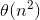
InsertionSort|<br>
MergeSort|
QuickSort|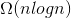<br>
CountingSort|
HeapSort|

## MergeSort

**Complessità in tempo:** nel caso peggiore 

Dividere sempre per 2 è la scelta migliore. L'algoritmo sfrutta della memoria aggiuntiva nella funzione Merge.

**Codice:**

```javascript
/*
 * A: Array da ordinare             [1:n]
 * p: Indice iniziale dell'array    (int)
 * r: Indice finale dell'arrya      (int)
 */
function MergeSort(A, p, r){
    if(p < r){
        q = int( (p+r)/2 )
        MergeSort(A, p, q)
        MergeSort(A, q+1, r)
        Merge(A, p, q, r)
    }
}

function Merge(A, p, q, r){
    n1 = q - p + 1
    n2 = (r - p + 1) - n1

    L = [1:n1+1]
    for (i= 1 to n1){
        L[i] = A[p+i-1]
    }
    L[n1+1] = inf

    R = [1:n2+1]
    for (i = 1 to n2){
        R[i] = A[q+i]
    }
    R[n2+1] = inf

    i = 1
    j = 1
    for (k = p to r){
        if(L[i] < R[j]){
            A[k] = L[i]
            i++
        }
        else {
            A[k] = R[j]
            j++
        }
    }
}
```

## QuickSort

**Complessità in tempo:** dipende dalla scelta del pivot:

- Nel caso pessimo pivot = max, 
- Nel caso pessimo in cui il pivot si alterna con il massimo e il minimo, 

Generalmente non capita molto spesso di imbattersi nei casi peggiori e la complessità in tempo nel caso medio è:


<br><br>
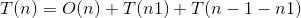
non ho idea di cosa sia.

<br> **Codice:**

```javascript
/*
 * A: Array da ordinare                 [1:n]
 * p: Indice di partenza dell'array     (int)
 * r: Indice di fine dell'arry          (int)
*/
function QuickSort(A, p, r){
    q = Partition(A, p, r)
    QuickSort(A, p, q - 1)
    QuickSort(A, q + 1, r)
}

function Partition(A, p, r){
    x = A[r]
    i = p - 1
    for j = p to (r - 1){
        if (A[j] <= x){
            i = i + 1
            scambia(A[i], A[j])
        }
    }
    scambia(A[i+1], A[r])
    return i+1
}
```

`partition(...)` <br>
`QuickSort(A, p, q-1)` 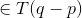<br>
`QuickSort(A, q+1, r)` 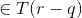<br>

## CountingSort

**Complessità in tempo:**  Richiede due array supplementari: B[1, …, n] per l’output ordinato e C[1, …, k] per la memoria di lavoro temporanea. Per eseguire il CountingSort si presume che l’array di partenza A sia un array di interi del tipo A[1, …, n] (indicano gli indici). Si assume anche che il contenuto di A varia tra 0 e k.

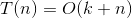<br>

Il CountingSort non essendo un algoritmo di ordinamento per confronti ha limite inferiore  (se ) e non  come gli algoritmi per confronti. È un algoritmo Stabile: elementi con lo stesso valore compaiono nell’array di output con lo stesso ordine che avevano in quello di input.

**Codice:**

```javascript
/*
 * A: Array di interi                   [1:n]
 * k: Valore massimo contenuto in A     (int)
 * n: Lunghezza di A                    (int)
 */
function CountingSort(A, k) {
    C = [0:k]   //Memoria temporanea di lavoro
    for (i = 0 to k){
        C[i] = 0
    }

    //C in una posizione generica i conterrà il numero degli elementi uguali ad i
    for (j = 1 to length(A)){
        C[A[j]] = C[A[j]] + 1
    }

    //C[i] contiene il numero degli elementi <= i
    for (i = 1 to k){
        C[i] = C[i] + C[i-1]
    }

    B = [1:length(A)]
    for (j = length(A) to 1){
        B[C[A[j]]] = A[j]
        C[A[j]] = C[A[j]] - 1
    }

    return(B)
}
```

## RadixSort

**Complessità in tempo:** L'algoritmo viene usato per ordinare numeri interi con d cifre in base b. Il costo è: 

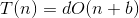<br>

L'algoritmo è ottimo quando 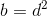<br>

**Codice:**

```javascript
function RadixSort(A, d){
    for(i = 1 to d){
        qualcosa di non ben definito sulla cifra i
    }
}
```

# Heap

È un albero binario completo fino al penultimo livello e nell'ultimo le foglie sono addossate a sinistra.
Ha una forma ben definita e può essere:

- un **max-heap**: ha come chiave della radice il massimo

- un **min-heap**: ha come chiave della radice il minimo

Questa struttura permette di fare un algoritmo di ordinamento sul posto con costo 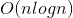 e permette di calcolare il massimo e il minimo con costo inferiore. L'heap viene rappresentato tramite un array.


I vari elementi hanno i seguenti indici:

- `left(i) = 2 * i`
- `right(i) = 2 * i + 1`
- `parent(i) = int( i/2 )`

**Codice:**

```javascript
function BuildMaxHeap(A, n){
    for (i = int(n/2) to 1){
        MaxHeapify(A, i, n)
    }
}

// Ha costo O(logn)
function MaxHeapify(A, i, n){
    largest = A[i]
    t = i

    if(2*i <= n) && (A[i] < A[2*i]){
        t = 2*i
        largest = A[t]
    }
    if(2*i+1 <= n) && (A[2*i+1] > largest){
        t = 2*i+1
        largest = A[t]
    }

    if(i != t){
        scambia(A[t], A[i])
        MaxHeapify(A, t, n)
    }
}
```

La funzione `BuildMaxHeap(A, n)` ha costo .<br>
La funzione `MaxHeapify(A, i, n)`  ha costo 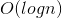.<br>È utile per la ricerca del massimo o del minimo.

## HeapSort

**Complessità in tempo:** È un algoritmo in-place ma non stable.


**Codice:**

```javascript
function HeapSort(A, n){
    BuildMaxHeap(A, n)

    for (i = n to 2){
        scambia(A[1], A[i])
        MaxHeapify(A, 1, i-1)
    }
}
```

Con o senza `BuildMaxHeap(A, n)` il costo della funzione rimane invariato.

## Operazioni sugli Heap

### Insertion-key

Ha costo . Aggiunge un nuovo nodo all'Heap e ne ricalcola il posto.

**Codice:**

```javascript
function Insertion-key(A, n, k){
    n = n + 1
    A[n] = k
    i = n

    while(A[int(i/2)] < A[i] && int(i/2) >= 1){
        scambia(A[i], A[int(i/2)])
        i = int(i/2)
    }
}
```

### Extract-max

Ha costo .
Elimina il massimo (la radice) e ricostruisce l'Heap.

**Codice:**

```javascript
function Extract-max(A, n){
    max = A[1]
    A[1] = A[n]
    n = n - 1

    MaxHeapify(A, 1, n)

    return max
}
```

### Extract-key

Ha costo .
Elimina l'elemento alla posizione data e ricostruisce l'Heap.

**Codice:**

```javascript
function Extrac-key(A, n, index){
    tmp = A[index]
    A[index] = A[n]

    tmp2 = A[n]
    n = n - 1

    MaxHeapify(A, index, n)

    if(A[index] == tmp2){
        i = index

        while(A[int(i/2)] < A[i] && int(i/2) >= 1){
            scambia(A[int(i/2)], A[i])
            i = int(i/2)
        }
    }
}
```

# Strutture Dati

## Pila

### Implementazione

Le pile vengono implementate tramite array con una politica `LIFO`: _Last In First Out_. 

Una pila di `n` elementi è un array: `S[1, ..., n]`.

La pila ha un attributo `S.top` che è l'indice dell'ultimo elemento inserito.

La funzione `stack_empty()` ritorna `true` se la pila è vuota, altrimenti `false`.

Con l'operazione `push()` si aggiunge un elemento alla pila e se `S.top` supera la dimensione di `S` allora si ha un errore di `overflow`.

La funzione `pop()` estrae l'ultimo elemento aggiunto alla pila. Se la pila è vuota (la funzione `stack_empty()` ritorna `true`) allora si ha un errore di `underflow`.

### Codice 

```javascript

function stack_empty(S) {
    if (S.top == 0) {
        return true
    } else {
        return false
    }
}

function push(S, x) {
    if (len(S) == (S.top + 1)){
        error("overflow")
    } else {
        S.top ++
        S[S.top] = x
    }
}

function pop(S) {
    if (stack_empty(S)) {
        error("underflow")
    } else {
        S.top --
        return S[S.top + 1]
    }
}
```
Tutte le operazioni hanno costo 

## Coda

### Implementazione

Le code vengono gestite tramite array circolare <!-- circhiolare --> con politica `FIFO`: _Firt in First Out_.

Una coda di `n` elementi sarà un array: `Q[1, ..., n]`.

Una coda ha i seguenti attributi:
* `head`: il primo elemento inserito nella coda
* `tail`: il primo elemento libero della coda

### Codice

```javascript

function enqueue(Q, x) {
    Q[Q.tail] = x

    if (Q.tail == len(Q)) {
        Q.tail = 1
    } else {
        Q.tail ++
    }
}

function dequeue(Q) {
    x = Q[Q.head]

    if (Q.head == len(Q)) {
        Q.head = 1
    } else {
        Q.head ++
    }

    return x
}
```

Tutte le operazioni hanno costo 

## Lista

### Implementazione

È una struttura dati in cui gli elementi possono essere inseriti in qualunque posizione.

Il tempo di inserimento è 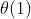

Ogni elemento ha 3 attributi:
* `info`: contiene i dati dell'elemento
* `previous`: un puntatore all'elemento precedente della lista
* `next`: un puntatore all'elemento successivo

Il primo elemento della lista viene chiamato `head` e ha un unico puntatore `next` mentre `previous = nil`.

### Codice

```javascript

function list_insert(L, x) {
    x.next = L.head

    if (L.head != nil) {
        L.head.prev = x
    }

    L.head = x
    x.prev = nil
}

function list_delete(L, x) {
    if (x.prev != nil) {
        x.prev.nex = x.next
    } else {
        L.head = x.next
    }

    if (x.next != nil) {
        x.next.prev = x.prev
    }
}

function list_search(L, k) {
    x = L.head

    while (x != nil AND x.info != k) {
        x = x.next
    }

    return x
}
```

`list_search()` nel caso peggiore impiega . Le altre 

## Alberi

### Diametro di un albero

Il diametro di un albero è il cammino minimo più lungo che collega due foglie.

### Test se un grafo è un albero

Per testare se un grafo è un albero è necessario eseguire una `DFS` e se:

<!-- sistemare graficamente -->
* **Grafo Orientato**
    * cercare un **nodo** con soli archi **uscenti**, se ce n'è più di uno allora **non è** un albero.
    * Se durante la `DFS` incontri un nodo **già visitato** (arco backwards/forword) **non è** un albero.
    * se alla fine della `DFS` **ci sono** nodi da visitare allora **non è** un albero.
<br>

* **Grafo Non Orientato**
    * fai la `DFS` da un qualunque nodo e valgono le regole di un Grafo Orientato.

---

# Alberi di ricerca binaria

## Definizione

Un albero di ricerca binaria è formato da una struttura dati concatenata il cui nodo è rappresentato da un oggetto.
Ogni oggetto ha i seguenti attributi:

* `key`: il valore del nodo
* `left`: il figlio sinistro
* `right`: il figlio destro
* `p`: il nodo padre

Un albero di ricerca binaria è un albero binario che rispetta la seguente proprietà:

Dato un nodo `x` il `x.left.key <= x.key <= x.right.key`
( il figlio sinistro ha l'attributo `key` minore del padre e il figlio destro ha l'attributo `key` maggiore).

## Tipi di Visite

### Anticipata

L'attributo `key` del nodo viene stampato ogni volta che l'attributo color del nodo viene settato a `gray`. [ Appena il nodo viene visitato viene anche stampato ]

**Esempio:**


`output: 8 3 1 6 4 7 10 14 13`

### Posticipata

L'attributo `key` del nodo viene stampato ogni volta che l'attributo color del nodo viene settato a `black`. [ Il nodo viene stampato quando la ricorsione inizia a tornare all'indietro ]

**Esempio:**


`output: 1 4 7 6 3 13 14 10 8`

### Simmetrica

L'attributo `key` del nodo viene stampato solo dopo aver visitato un figlio sinistro.


`output: 1 3 4 6 7 8 10 13 14`

## Stampa

```javascript

//Attraversamento simmetrico dell'albero
function inorder_tree_walk(x) {
    if (x != nil) {
        inorder_tree_walk(x.left)
        print(x.key)
        inorder_tree_walk(x.right)
    }
}


```

Il costo è 

## Ricerca

Passando un puntatore alla radice `x` e un valore `k` ritorna il puntatore all'elemento dell'albero con il corrispondente valore `key`.

### Ricorsiva

```javascript

function recursive_search(x, k) {
    if ((x == nil ) OR (x.key == k)) {
        return x
    } else {
        if (k < x.key) {
            return recursive_search(x.left, k)
        } else {
            return recursive_search(x.right, k)
        }
    }
}
```

### Iterativa

```javascript

function iterative_search(x, k) {
    while ((x != nil) AND (k != x.key)) {
        if (k < x.key) {
            x = x.left
        } else {
            x = x.right
        }
    }

    return x
}
```

### Range Query

Dati `k1` e `k2` due valori, la funzione `range_query()` ritorna tutti i valori contenuti nell'albero tali che `k1 <= nodo.key <= k2`.

```javascript
function range_query(x, k1, k2) {
    //controlla se x è una foglia
    if (x.is_leaf()) {
        return 0
    }

    //controlla se il nodo passato ha il valore key
    //compreso tra k1 e k2 altrimenti
    //controlla l'albero a sinistra o destra relativo
    if (k1 <= x.key <= k2) {
        L.append(range_query(x.left, k1, k2))
        R.append(range_query(x.right, k1, k2))

        L.append(x)

        return L + R
    } else {
        if (x.key < k1) {
            return range_query(x.right, k1, k2)
        } else {
            if (k2 < x.key) {
                return range_query(x.left, k1, k2)
            }
        }
    }
}
```

## Minimo e Massimo

Per la ricerca del valore minimo/massimo basta trovare la foglia più a sinistra/destra dell'albero.

```javascript

function minimum(x) {
    while (x.left != nil) {
        x = x.left;
    }

    return x
}

function maximum(x) {
    while (x.right != nil) {
        x = x.right;
    }

    return x
}
```

## Successore e Predecessore

* Se il nodo `x` ha un sottoalbero destro allora il successore di `x` è il **minimo** del sottoalbero destro.
* Se il nodo `x` non ha un sottoalbero destro allora il successore è il padre del primo nodo che è figlio sinistro del padre seguendo il cammino all'indietro verso la radice.

```javascript

function tree_successor(x) {
    if (x.right != nil) {
        return minimum(x.right)
    }

    y = x.p

    while ((y != nil) AND (x == y.right)) {
        x = y
        y = y.p
    }

    return y
}

function tree_predecessor(x) {
    if (x.left != nil) {
        return maxinum(x.left)
    }

    y = x.p

    while ((y != nil) AND (x == y.left)) {
        x = y
        y = y.p
    }

    return y
}
```

## Inserzione 
<!-- No HOMO = segreto antiomosessualità -->

Per inserire un nodo basta muoversi lungo i cammini rispettando le proprietà degli alberi binari fin quando non si raggiunge una foglia, a quel punto basta controllare se è maggiore o minore della foglia e aggiungerlo di conseguenza.

```javascript

function tree_insert(T, z) {
    y = nil
    x = T.root

    while (x != nil) {
        y = x
        
        if (z.key < x.key) {
            x = x.left
        } else {
            x = x.right
        }
    }

    z.p = y

    if (y == nil) {
        T.root = z
    } else if (z.key < y.key) {
        y.lef = z
    } else {
        y.right = z
    }
}
```

Il costo è 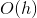

## Eliminazione

Per eliminare un nodo mantenendo sempre le proprietà degli alberi binari di ricerca ci sono 3 casi:
1. Se il nodo `x` _non ha_ figli, basta eliminarlo e cambiare il puntatore del padre a `nill`.
2. Se il nodo `x` _non ha figli sinistri_, basta assegnare al figlio destro del padre di `x` il figlio destro di `x` e al figlio destro di `x` come padre il padre di `x`.
3. Se il nodo `x` _ha figli sinistri_, basta utilizzare la funzione `maximum(x.left)` ed assegnare il risultato al figlio del destro del padre di `x` e aggiornarne i figli rispettando le proprietà degli alberi binari.

---

## AVL Tree

Un `AVL Tree` è un _Binary Search Tree_ che per ogni nodo ha un attributo `h`, il quale contiene il massimo trai i valori `h` dei figli + 1 (un nodo foglia ha `h = 1`).

Gli AVL Tree ammettono uno sbilanciamento massimo di 1.

Utilizzano gli stessi algoritmi dei _Binary Search Tree_ tranne che per `insertion()`, il quale setta l'altezza del nodo inserito ad 1 ed effettua il ribilanciamento dell'albero passando alla funzione `rebalance()` il nodo appena creato.

```javascript

function rebalance(T, v) {
    v.h = 1 + max(v.left.h, v.rigth.h)

    while (v != nil) {
        v = v.p

        if (abs(v.left.h - v.right.h) > 1) {
            y = get_tallest_child(v)
            x = get_tallest_child(y)

            v = restructure(x)

            v.h = max(v.left.h, v.right.h) + 1
        }
    }
}
```

La funzione `restructure()` tramite delle rotazioni ribilancia l'albero.

### Rotazioni

**RR:** 

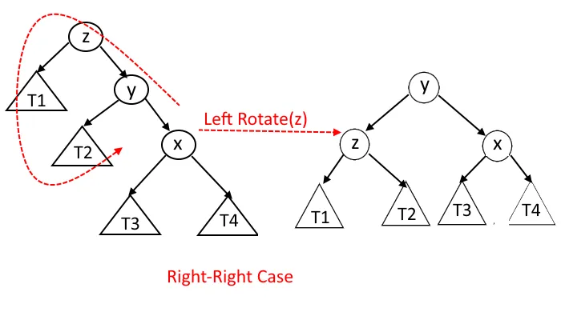

**RL:**


**LR:**

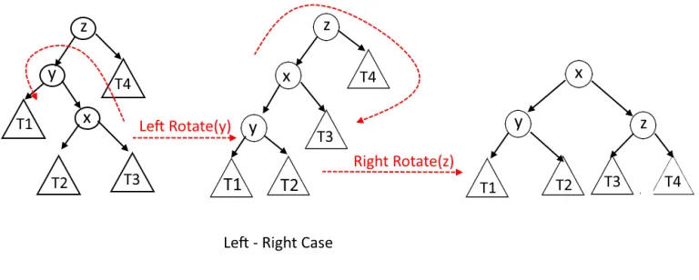

**LL:**

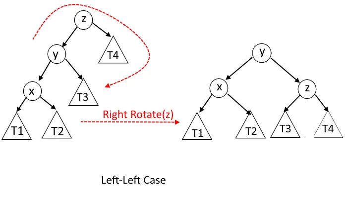


---

# Grafi

## Potenza di un Grafo

La `matrice di adiacenza` di un Grafo è una matrice che ha per righe i vertici di partenza e per colonna i vertici di arrivo, nella posizione `[i, j]` ha `1` se i nodi i e j sono adiacenti, altrimenti `0`.

L'`elevamento a potenza` di un grafo serve per vedere se c'è un cammino di lunghezza n che unisce i nodi i e j.<br>
L'`elevametno a potenza` di un grafo equivale ad elevare a potenza la matrice di adiacenza per poi controllare se nella posizione `i, j` della matrice c'è un `1` o uno `0`: 

* se c'è `1` vuol dire che esiste un cammino di lunghezza n (esponente della potenza) che collega i nodi i e j
* se `0` allora non è presente un cammino che collega i nodi i e j.

## Liste di Adiacenza

Una lista di adiacenza consiste in un array di `|V|` liste. Ogni elemento dell'array rappresenta un vertice del Grafo (testa della lista) e ogni lista contiene tutti i vertici adiacenti alla testa della lista.


## BFS

Viene utilizzata su Grafi **non orientati** e **connessi**.<br>
È la base per gli algoritmi di Prim (per gli MST) e Dijkstra (per gli Shortest Path).

### Codice
```javascript
function BFS(G(V,E), s){
   // prepara il grafo per l'esplorazione
   for (v in (G.V - {s})){ // per ogni elemento di V tranne s
      v.color = white
      v.d = infinity
      v.pi = nil
   }
   
   // setta i parametri di s come nodo di partenza
   s.d = 0
   s.pi = nil
   s.color = grey
   
   enqueue(Q, s)  // aggiunge s alla coda
   
   while(Q != 0){
      u = dequeue(Q) // estrae il primo elemento aggiunto alla coda
      
      for (v in G.adj[u]){ // per ogni elemento adiacente ad u
         if(v.color == white){
            enqueue(Q, v)
            
            v.d = u.d + 1
            v.pi = u
            v.color = grey
         }
      }
      
      u.color = black
   }
}
```

### Costo

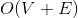

## DFS

Viene utilizzata soprattutto per controllare se un grafo è **aciclico** (un albero) e per la **catalogazione** degli **archi**.

Viene applicata soprattutto a **grafi orientati**.

### Tipi di archi

* `archi d'albero`: archi facenti parte dell'albero
* `archi all'indietro`: arco che raggiunge un nodo già visitato in precedenza. `v.color == gray` 
* `archi in avanti`: arco che collega un nodo ad un suo discendente che non gli è adiacente. `u.d < v.d`
* `archi trasversali`: arco che collega un vertice ad uno già visto in precedenza. `u.d > v.d` dove `u` è il nodo che viene visitato e `v` è un nodo già visitato

Dato un arco `arco(u,v)` con `u` nodo di partenza e `v` nodo di arrivo: 
* se `v.color == white` è un arco d'albero
* se `v.color == gray` è un arco all'indietro
* se `v.color == black` :
    * se `u.d < v.d` è un arco in avanti
    * se `u.d > v.d` è un arco trasversale


### Codice

```javascript
function DFS(G(V, E)){
   for (v in G.V){
      v.color = white
      v.pi = nil
   }
   
   time = 0
   
   for (v in G.V){
      if(v.color == white){
         DFS-visit(G, v)
      }
   }
}

function DFS-visit(G(V, E), u){
   u.color = grey
   time ++
   u.d = time
   
   for (v in G.adj[u]){
      if(v.color == white){
         v.pi = u
         DFS-visit(G, v)
      }
   }
   
   u.color = black
   time ++
   u.f = time
}
```

### Costo

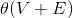

---

## Sort Topologico

Viene detto anche `Ordinamento` Lineare di un Grafo.

Serve a rendere più chiara la rappresentazione di Grafi che schematizzano una serie di azioni che devono essere eseguite secondo un ordine preciso.

### DAG

Un `DAG` è un Grafo Aciclico Orientato.

### Funzionamento

Viene effettuato sui `DAG`.<br>
Tramite una `DFS` si calcolano i tempi di fine visita di ogni Vertice, ogni volta che un Vertice diventa nero si aggiunge alla testa di una lista concatenata. Alla fine la lista concatenata sarà ordinata topologicamente. Ritorna la lista concatenata.

### Costo


---

## Componenti Fortemente Connesse

Una `componente connessa` è l'insieme di Vertici connessi da almeno un cammino.<br>
(Due Vertici si dicono `connessi` se esiste un cammino che li unisce.)

Una `componente fortemente connessa` è un insieme di vertici (in un grafo orientato) dove ogni vertice è muotuamente raggiungibile.

### Funzionamento

Per trovare le componenti fortemente connesse di un grafo:

1. Viene effettuata una `DFS` del Grafo `G` per calcolare i tempi di fine `u.f`.
2. Si calocla il grafto trasposto `G_trasposto`.
3. Viene effettuata una `DFS` sul grafo traposto `G_trasposto` considerando tutti i vertici in ordine decrescente ripsetto a `u.f` (calcolati al passo 1).
4. Ritorna in output le `componenti fortemente connesse`.

---

## Operazioni insiemi disgiunti

### Operazioni

* `make-set(x: "un numero qualunque")`: Crea un nuovo insieme avente un unico elemento che fa anche da rappresentante

* `union(x: "elemento di una lista", y: "elemento di una lista")`: unisce due insiemi contenenti `x` e `y`. Crea un nuovo insieme distruggendo gli insiemi precedenti e prende come rappresentante uno dei due rappresentati.
    >Si presume che gli insiemi siano disgiunti prima dell'operazione

* `find-set(x: "elemento di una lista")`: restituisce un puntatore all'insieme contenente `x`. In questo caso `x` non è il rappresentante dell'insieme ma un elemento contenuto

### Struttura degli insiemi

#### Con Liste Concatenate 

[:couplekiss_man_man:](https://www.youtube.com/watch?v=nixax3WDISM "Romani Gay")

Gli insiemi sono rappresentati tramite una lista concatenata con la seguente forma:
* `head`: puntatore al rappresentante (la testa della coda)
* `value`: elemento dell'insieme
* `next`: puntatore all'elemento successivo nella lista


##### Costo

* `make-set(x)`: 
* `union(x, y)`:  (n = numero di elementi dell'insieme con più elementi)
* `find-set(x)`: 

##### Erustica

* `unione pesata`: Nella funzione `union(x, y)` si unisce sempre la lista di elementi minori a quella con elementi maggiori così da ottenere un lower bound di 

**Costo totale**: 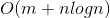 se si fanno `m` operazioni `union(x, y)`, `make-set(x)` e `find-set(x)` di cui `n` `make-set(x)`

#### Con Alberi

Gli insiemi disgiunti vengono rappresentati tramite un albero:

* Nodo:
    * `padre`
    * `rango`: il numero di archi da percorrere per arrivare alla foglia più distante in profondità
    * `key`: elemento dell'insieme


Il padre della radice punta a se stesso e ha rango maggiore di tutto l'albero. Il rango della radice determina il rango di tutto l'albero.

##### Euristiche

* `unione per rango`: durante la procedura `union(x, y)` la radice delll'albero con rango minore viene attaccato a quella di rango maggiore (come con la realizzazione con le liste)
* `compressione del cammino`: durante la procedura `find-set(x)` tutti i nodi vengono attaccati alla radice conservando inalterato il loro rango.

##### Costo

* `make-set(x)`: 
* `union(x, y)`: 
* `find-set(x)`:  [approssimato per eccesso a `logn`]

**Costo totale**: 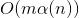 dove  è una funzione quasi lineare

##### Codice

```javascript
function make-set(x) {
    x.p = x
    x.rank = 0
}

function union(x, y) {
    link(find-set(x), find-set(y))
}

function link(x, y) {
    if (x.rank > y.rank) {
        y.p = x
    }
    else {
        x.p = y

        if (x.rank == y.rank) {
            y.rank ++
        }
    }
}

function find-set(x) {
    if (x != x.p) {
        x.p = find-set(x.p)
    }

    return x.p
}
```

## MST

### Regola Red Blue

* `regola blu`: 
    * Prendi un cammino del grafo senza archi <span style="color: blue">blu</span> e senza cicli (se esiste)
    * Scegli l'arco nel cammino con costo minore e coloralo di <span style="color: blue">blu</span>
* `regola rossa`:
    * Prendi un ciclo semplice (senza sottocicli) senza archi <span style="color: red">rossi</span> (se esiste)
    * Scegli l'arco nel ciclo con costo maggiore e coloralo di <span style="color: red">rosso</span>

La regola Red Blue viene utilizzata in modo non deterministico per costruire un MST.

#### Regola Color Invariant

L'insieme di tutti gli archi di colore <span style="color: blue">blu</span> rappresenta un MST.

<span style="color: blue">Blu</span> = accettato
<span style="color: red">Rosso</span> = rigettato


### Algoritmo di Prim

È un algoritmo per la connessione minima: archi pesati e deve essere un albero che riesce a toccare tutti i vertici con il minor costo possibile
Usa la regola blue (se ho un taglio (una partizione dell'insieme dei vertici) inserisco l'arco di costo minimo).

[pdf utile](http://computerscience.unicam.it/merelli/algoritmi-complessita/esercitazione9.pdf)

#### Funzionamento

1. Inizializzo tutti i vertici, tranne quello di partenza, a costo `+infinito` e padre `nil`
2. Inizializzo il vertice di partenza a costo `0` e padre `nil`
3. Assegno a `Q` l'isnieme dei vertici appartenenti al grafo
4. Con `extract_min()` estraggo il vertice con costo minore, che all'inizio sarà sempre il vertice di partenza per via della sua inizializzazione
5. Assegna i costi ai vertici adiacenti al vertice di partenza basandosi solo sul costo degli archi in uscita, non tenendo conto del costo dell'intero cammino
6. Continua nel ciclo while estraendo il vertice adiacente con costo minore assegnato al ciclo precedente

#### Codice

```javascript
function Prime(G=(V, E): "grafo", r:"Vertice di partenza"){
    for (v in V-{r}) {
        v.pi = nil
        v.d  = inf
    }

    r.pi = nil
    r.d  = 0

    Q = V   //coda con tutti i vertici

    while (Q != 0) {
        //estra il vertice di peso minore
        u = extract_min(Q) 

        for (v in ADJ(u) AND v isin Q) {
            if (v.d > w(u, v)){
                v.d = w(u, v)
                v.pi = u
            }
        }
    }
}
```

#### Costo

Il costo del primo for è trascurabile quindi consideriamo solo il while.

Il while viene eseguito V volte e al suo interno `extract_min()` ha costo:
*  se la coda è implementata con un **MinHeap** o **Heap di Fibonacci**
*  se la coda è implementata con un **Array**

Il costo del secondo for può essere portato fuori dal while approssimando il numero di iterazioni con la somma delle lunghezze di tutte liste di adiacenza (2E). In `relax()` il costo dell'assegnazione `v.d = w(u, v)` corrisponde ad un `decrease_key()` e il costo dipende dalla struttura della coda:
*  se viene usato un MinHeap
*  se viene usato un Heap di Fibonacci

Quindi il costo minimo si avrà utilizzando gli Heap di Fibonacci e sarà:
 .

### Algoritmo di Kruscal

#### Funzionamento

1. L'insieme A che conterrà gli archi viene inizializzato a vuoto
2. Per ogni Vertice v viene creato un albero a se stante tramite la funzione `makeSet()`
3. Gli archi E vengono ordinati in modo crescente in base al loro peso
4. Per ogni arco appartenente ad E provo a collegarci un altro vertice, se questo collegamento NON forma un cilco allora aggiungo l'arco ad A e unisco i vertici in un unico Albero
5. Ritorna A

#### Codice

```javascript
function Kruskal(G=(V, E), w){
    A = 0

    for (v in V) {
        makeSet(v)
    }

    // orgina gli archi E per peso w non decrescente
    sort(E, by=w, order=asc)

    for (arco in E) {
        if (findSet(arco.u) != findSet(arco.v)){
            A = A U {(arco.u, arco.v)}
            union(arco.u, arco.v)
        }
    }

    return A
}
```

#### Costo

> ```
> aV + ElogE + E --> O(ElogE)
> E < V^2
> logE < 2logV
> O(logE) = O(logV)
> ```


## Shortes Path da sorgente Unica

### Algoritmo di Belman-Ford

#### Funzionamento

1. Inizializza tutti i vertici del grafo a peso `+infito` e padre `nil`. Assegna il peso di `s` (il nodo di partenza) a `0` e padre `nil`
2. In ogni iterazione del ciclo `for` (con contatore i) guarda tutti gli archi e ne aggiorna il peso tramite la funzione `relax()`. Ad ogni iterazione se la funzione `relax()` trova un valore di costo minore per raggiungere un determinato vertice allora aggiorna il peso e il padre.
3. Controlla se ci sono cicli di peso negativo, in caso ritorna `false` altrimenti `true`.

#### Codice

```javascript
function belmanFord(G=(V, E), s){
    for (v in V) {
        v.pi = nil
        v.d  = inf
    }

    s.d = 0
    s.pi = nil

    for (i = 1 to (V - 1)) {
        for (arco(u, v) in E) {
            relax(u, v, w(u, v))
        }
    }

    for (arco(u, v) in E) {
        if (v.d > u.d + w(u, v)){
            return false
        }
    }
    
    return true
}

function relax(u: "vertice corrente", v: "vertice adiacente a u", w(u, v): "peso dell'arco tra u e v"){
    if (v.d > u.d + w(u, v)){
        v.d = u.d + w(u, v)
        v.pi = u
    }

}
```

#### Costo

> `V + V*E + E --> O(VE)`


### Algoritmo di Dijkstra

#### Funzionamento

1. Inizializza i vertici del grafo a padre `nil` e peso `+infinito`. Inizializza `s` a padre `nil` e peso `0`
2. Inizializza l'insieme delle soluzioni `S` a insieme vuoto
3. Inizilizza la coda di **min-priorità** `Q` con tutti i vertici del grafo. Viene gestito con un Heap di Fibonacci
4. Fin quando la coda non è vuota estrae il vertice di peso minimo (la prima volta sarà sempre `s`), lo aggiunge all'insieme delle soluzioni
5. Rilassa i nodi adiacenti

<!--
<details>
    <summary>SPOILER</summary>
    Romani Gay
</details>
-->

#### Codice

```javascript
function dijkstra(G=(V, E), s){
    for (v in V) {
        v.d = inf
        v.pi = nil
    }

    s.pi = nil
    s.d = 0

    S = []  //insieme delle soluzioni
    Q = V   //Heap di Fibonacci

    while (Q != 0) {
        u = extractMin(Q)
        S = S U {u}

        for (v in Adj(u)) {
            relax(u, v, w(u, v))
        }
    }
}

function relax(u: "vertice corrente", v: "vertice adiacente a u", w(u, v): "peso dell'arco tra u e v"){
    if (v.d > u.d + w(u, v)){
        v.d = u.d + w(u, v)
        v.pi = u
    }

}
```

#### Costo

**Per gli Heap di Fibonacci**: 

* `extractMin()` ha costo 
* Il ciclo for dentro il while costa `E` perchè in totale controlla tutti gli archi una singola volta
* All'interno della `relax()` viene effettuato un `decrease_key()` con costo 

> `V + V(logV) + E`

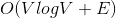


### Algoritmo DAG-Shortest-Path

#### Funzionamento

1. Ordina topologicamente il grafo G
2. Inizializza i vertici del grafo a padre `nil` e peso `+infinito`. Inizalizza `s` a padre nill e pseo `0`
3. Per ogni vertice ordinato topologicamente, guarda ogni arco adiacente e ne fa la `relax()`

#### Codice

```javascript
function dagShortestPath(G=(V, E), s){
    G = sortTopologico(G)

    for (v in V - {s}) {
        v.d = inf
        v.pi = nil
    }

    s.d = 0
    s.pi = nil

    // I vertici vengono presi in ordine Topologico
    // ( perchè sono già stati ordinati in modto Topologico prima)
    for (u in V) {
        for (v in Adj(u)) {
            relax(u, v, w(u, v))
        }
    }
}

```

#### Costo

> `theta(V + E) + V + theta(V) --> theta(V + E)`


## Shortes Path da sorgente Multipla

### Algoritmo Tropicale

<details>
    <summary>(Tropicanal)</summary>
    
</details>

#### Versione Lenta

##### Funzionamento

###### Premessa

1. **Non** ci sono loop di costo negativo
2. La lunghezza massima del cammino minimo passante per `n` **vertici** è di `n - 1` **archi**

###### Logica

Per rappresentare il cammino minimo tra tutte le coppie viene utilizzata una matrice di adiacneza `W` e vengono create `n` matrici `L`.

Ognuna viene creata progessivamente considerando la possibilità di passare per un vertice in più della matrice `L` precedente. Così si va a controllare se eiste un camino di costo inferiore al cammino minimo già presente nella matrice `L` precedente.

Per [PREMESSA .2](#premessa) . il `for` viene eseguito n - 1 volte.

##### Codice

```javascript
function tropicale_slow(W: "matrice di adiacenza"){
    n = W.rows
    L<1> = W

    for (m = 2 to n - 1) {
        //Sia L<m> una nuova matrice n*n
        L<m> = Matrix(n, n)
        L<m> = extend_shortest_path(L<m-1>, W)
    }

    return L<n - 1>
}

function extend_shortest_path(L: "matrice su cui iterare", W: "matrice di adiacenza") {
    n = L.rows
    // Sia L^= l^[i, j] una nuova matrice n*n
    L^ = Matrix(n, n)

    for (i = 1 to n) {
        for (j = 1 to n){
            l^[i, j] = inf
            
            for (k = 1 to n){
                l^[i, j] = min( l^[i, j], l[i, k] + w[k, j] )
            }
        }
    }

    return L^
}
```

##### Costo
> n * n^3


<hr>

#### Versione Veloce

##### Funzionamento

###### Premessa

1. **Non** ci sono loop di costo negativo
2. La lunghezza massima del cammino minimo passante per `n` **vertici** è di `n - 1` **archi**
3. Per ridurre il costo dell'algoritmo [precedente](#versione-lenta), non serve calcolare tutte le matrici, quindi si procede con la *tencica dell'elevazione al quadrato ripetuta*.

 

<details style="display: inplace">
    <summary>Nani !?!?</summary>
    
</details>

<!-- MR GIU approva -->

###### Logica

Il funzionamento è simile a quello dell'algoritmo [precedente](#versione-lenta), tuttavia per ridurre il numero di iterazioni il `for` viene sostituito da un `while` il cui argomento raddoppia ad ogni iterazione, restituendo così un tempo logaritmico.

##### Codice

```javascript
function tropicale_fast(W: "matrice di adiacenza") {
    n = W.rows
    L<1> = W
    m = 1

    while(m < n - 1) {
        // Sia L<2m> una nuova matrice n*n
        L<2m> = Matrix(n, n)
        
        L<2m> = extend_shortest_path(L<m>, L<m>)

        m = 2*m
    }

    return L<m>
}

function extend_shortest_path(L: "matrice su cui iterare", W: "matrice di adiacenza") {
    n = L.rows
    // Sia L^= l^[i, j] una nuova matrice n*n
    L^ = Matrix(n, n)

    for (i = 1 to n) {
        for (j = 1 to n){
            l^[i, j] = inf
            
            for (k = 1 to n){
                l^[i, j] = min( l^[i, j], l[i, k] + w[k, j] )
            }
        }
    }

    return L^
}
```

##### Costo

> logn * n^3


perchè n = V

### Algoritmo Floyd Warshll

#### Funzionamento

Ad ogni iterazione controlla se passando per il vertice `k` si ottiene un cammino migliore del cammino dell'iterazione precedente il quale non conteneva il vertice `k` presente al suo interno.

Si utilizza la matrice di Adiacenza e una matrice  per memorizzare il padre del vertice di arrivo


#### Codice

`D<k>` è la matrice al passo `k` e `d<k>[i, j]` è l'elemento i, j della matrice `D` al passo `k`

```javascript
function floydWarshall(W: "Matrice di Adiacenza"){
    n = W.rows
    D<0> = W

    //k è il vertice da aggiungere al cammino
    for (k = 1 to n) {
        //Sia D<k> = d<k>[i,j] una nuova matrice n * n
        for (i = 1 to n) {
            for (j = 0 to n) {
                //il minimo tra il cammino passando per k e il cammino NON passando per k
                d<k>[i, j] = min(d<k-1>[i, j], d<k-1>[i, k] + d<k-1>[k, j])
            }
        }
    }

    return D<n>
}
```

#### Costo

**Tempo**: 

**Spazio**: 

> 2 * n^2 --> O(n^2)

### Chiusura Transitiva

La chiusura transitiva è definita come il grafo `G*=(V, E*)` dove `E*` è un isniseme definito come:

`E*= {(i, j): esiste un cammino in G dal vertice i al vertice j }`

Serve per verificare se esiste un cammino che collega due vertici.

#### Funzionamento

1. Setta tutti i cammini a peso 1
2. Si inizializza la Matrice `T<0>` (matrice di Adiacenza)
3. Si utilizza l'algoritmo di FloydWharsall per trovare solo l'esistenza dei cammini non considerando il loro costo.

#### Codcie

```javascript
function chiusuraTransitiva(G=(V, E)) {
    n = len(G.V)

    // Sia T<0> una nuova Matrice n*n
    T<0> = Matrix(n, n)

    for (i = 1 to n) {
        for (j = 1 to n) {
            if (i == j or (i,j) in G.E)
                t<0>[i, j] = 1
            else
                t<0>[i, j] = 0
        }
    }

    for (k = 1 to n) {
        // Sia T<k> una nuova matrice n*n
        T<k> = Matrix(n, n)

        for (i = 1 to n) {
            for (j = 1 to n) {
                t<k>[i, j] = t<k-1>[i, j] or ( t<k-1>[i, k] and t<k-1>[k, j] )
            }
        }
    }

    return T<n>
}

```

#### Costo

> theta(n^2) + theta(n^3) --> theta(n^3)

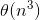

### Algoritmo di Johnson

<!-- Johnson fa un pompino a Dijkstra -->

#### Funzionamento

È l'algoritmo più veloce implementato con gli Heap di Fibonacci <!--HEap di FIcobnani (da non rimuovere) -->. Altrimenti è il migliore se si tratta di grafi sparsi.

1. Aggiunge un nuovo vertice `s` e lo collega a tutti gli altri vertici tramite un arco di costo 0. Il nuovo grafo è `G_1`
2. Esegue l'algoritmo di `BelmanFord` per controllare la presenza di cicli a costo negativo. Se ci sono ritorna un errore e termina l'algoritmo
3. Per ogni vertice di `G_1` assegna ad `h(v)` il peso del cammino minimo da `s` a `v` calcolato da `BelmanFord`
4. Per ogni arco di `G_1` ne aggiorna il peso rendendolo positvo in modo da poter utilizzare `Dijkstra`
5. Inizializza la matrice `D`
6. Utilizza `Dijkstra` per ogni verte e aggiorna la matrice con i relativi pesi caloclati
7. Ritorna `D`


#### Codice

```javascript
function johnson(G, w) {
    // Aggiunge un nuovo vertice s
    // e lo collega a tutti i Vertici G.V
    // dando peso 0 all'arco
    G_1 = add_vertice(G, s)

    if (bellmanFord(G_1, w, s) == false) {
        print("Il grafo ha un ciclo di peso negativo !")
    
        return -1
    }
    else {
        for (v in G_1.V){
            // Assegna ad h(v) il peso del cammino
            // calcolato da bellmanford
            h(v) = delta(s, v)
        }

        for (arco(u, v) in G_1.E) {
            // Rende ogni arco di costo positivo
            w_^(u, v) = w(u, v) + h(u) - h(v)
        }

        n = len(G.V)
        D = Matrix(n, n)

        for (u in G.V){
            // Serve per calcolare delta_^(u, v)
            // per ogni vertice v
            dijkstra(G, w_^, u)
        
            for (v in G.V) {
                d[u, v] = delta_^(u, v) + h(v) - h(u)
            }
        }

        return D
    }
}

```

#### Costo

Se implementato con Heap di Fibonacci il costo complessivo è: 
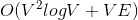
