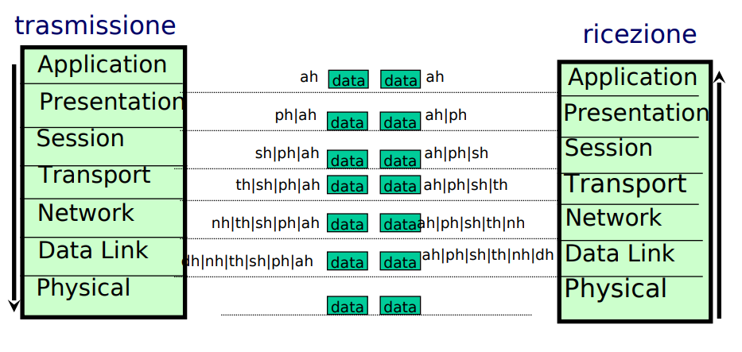
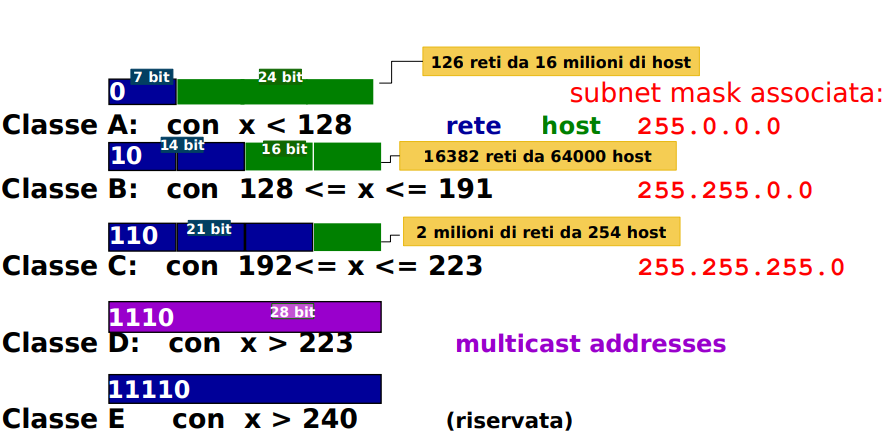

# Architettura Reti

<!-- https://www.unistudium.unipg.it/unistudium/pluginfile.php/585123/mod_resource/content/1/ArchitetturaReti_I.pdf -->

> In game we trust, is Osvaldo or bust !

## La storia di Internet (fatta male)

Nel 1962 nasce il concetto di Galactik Network che successivamente verrà utilizzato come ispirazione per Internet:

> Una infrastruttura basata su un insieme di computer globalmente interconnessi, attraverso la quale ciascuno potesse scambiare Dati,Informazioni e Programmi

Nel 1965 vengono messi in rete i primi due coputer con un collegamento di tipo dial-up a bassa velocità

Nel 1968 viene completata la specifica di ARPANET e il suo primo nodo fu il Network Measurement Center di UCLA.

Nel 1972 ILLIAC IV (il più potente supercoputer di quei tempi) viene collegato alla rete ARPANET.

Nel 1973 viene creato il TCP/IP, nasce la Posta Elettronica e viene inventato l'ethernet.

Nel 1983 viene sviluppato il DNS (Domain Name System) da Paul Mockapetris, Jon Postel e Craig Partridge con RFC 882 e viene raccomandato l'utilizzo della forma di indirizzamento `user@host.domain`

Nel 1983 ARPANET abbandona l'utilizzo del NCP ed adotta il TCP/IP

Dennis Jennings (se l'ho scritto vuol dire che è importante) nel 1985 lancia il programma NSFNET e diventa privatizzata nel 1995.

Il 30 aprile 1986 l'Italia si connette ad Internet

### Roba Sensata

**Internet**:

* Internet è una rete globale di reti che consente consente comunicazioni remote ai dispositivi ad essa connessi.
* E' definital nel RFC 1122 (originariamente RFC 760)

L'Internet Protocol (IP) fornisce le informazioni necessarie per l'invio di un pacchetto, chiamato datagram, da un mittente ad un destinatario. Il mittente e il destinatario sono due coputer host identificati ciascuno da un indirizzo a lughezza fissa chiamato IP. 
Il cammino di un datagram viene chiamato Routing.

Jon Postel fu direttore della IANA.

**Intranet**:

* La rete sicura che utilizzano aziende per connettere i loro dispositivi non accessibile da chiunque.
* I Router e i Firewall controllano l'accesso alla intranet e istradano i datagram dalla intranet a internet.

**Extranet**:

* Sono le risorse della rete di un'azienda/organizzazione accessibili da tutti (dall'esterno).
* Esempi sono:
    * Servizi Web
    * E-commerce
* Questi servizi vengono posti in una speciale parte della rete aziendale chiamata DMZ (DeMilitarized Zone) dove i controlli del firewall sono più laschi e i server in quest'area sono ritenuti "non critici" e ne vengono conservate copie su server interni all'azienda

**Standard**:

* Gli standard sono importanti per lo sviluppo dell'informatica e delle telecomunicazioni. Definiscono le caratteristiche fisiche e operative degli apparati di rete.
* Possono essere di 2 tipi:
    * De Jure: vengono definiti da organismi nazionali o internazionali
    * De Facto: molto utilizzati dagli utenti

**IEEE**:

* Istitue of Electrical and Electronic Engineers
* Uno standard molto importante è l'802 che definisce il funzionamento delle reti locali:
    * Definizione del formato dei dati
    * Controllo degli errori
    * Controllo del flusso dell'informazione

**ISO**:

* Internatioan Standards Organization
* Il suo scopo è quello di promuovere lo sviluppo degli standard nel mondo
* Il suo più grande successo è stato il modello a 7 livelli per le telecomunicazioni OSI: Open Systems Interconnection.
* Fornisce un modello di riferimento per l'implementazione di vari modelli di protocolli di rete. Rimane comunque uno strumento molto teorico e concettuale con pochissime implementazioni pratiche
* Ogni livello fornisce servizi al livello superiore e utilizza i servizi fornitigli da quello inferiorie. Questo avviene tramite i SAP: Service Accesso Point
* Entità di sistemi diversi che appartengono allo stello livello vengono dette Peer Entities
* Le operazioni specifiche di ogni livello vengono realizzate tramite un insieme di Protocolli

## ISO OSI

### Funzionamento

Ogni livello, a partire dal 7 in giù, aggiungono la propria intestazione al pacchetto e lo mandano al livello sottostante che farà altrettanto.
Questo viene chiamato Imbustamento Multiplo.
Il nodo Ricevente effettuerà l'operazione inversa: toglierà, per ogni livello, la propria intestazione e lo passerà al livello successivo.

### Physical Layer 1 (cavi e interfaccie fisiche)

E' il livello più basso dove vengono definite le regole per le connessioni elettriche e fisiche tra i vari dispositivi. 
Vengono specificate le varie connessioni dei cavi e i vari tipi di segnali che dovranno essere usati per la trasmissione del messagio.

Le regole definiscono il modo in cui modulare il segnale elettrico per mandarlo a modem, terminali, schede di rete, ecc.

### DataLink 2 (NIC, Hub, Switch, bridge)

Questo livello stabilisce come viene realizzata la comunicazione con un nodo adiacente. E' responsabile di un invio affidabile delle infromazioni tra un nodo e l'altro.

Definisce il formato dei dati, la frammentazione dei dati per la trasmissione, le procedure per il controllo dell'errore, ecc.

Vi appartengono Schede di Rete (NIC), Hub, Switch, che operano una divisione del dominio di collisione Ethernet.

Protocolli che appartengono a questo livello sono:

* DLCP
* BSC
* HDLC
* LLC
* MAC

### Network Layer 3 (Router, Switch di livello 3)

Si occupa della realizzazione della connessione tra 2 nodi della rete:

* Nodo Sorgente
* Nodo Destinatario

Si occupa anche del routing del messaggio: le regole che permettono l'instradamento dei pacchetti dal nodo Sorgente a quello di Destinazione

Vi appartengono i Router e gli Switch abilitati al routing (quelli di livello 3)

Il protocollo di questo livello è l'IP

### Transport Layer 4 (Switch di livello 4)

Questo livello garantisce che il trasferimento delle informazioni avvenga correttamente.
Si occupa anche di:

* Controllare l'errore
* Verificare la sequenza delle informazioni

E' il primo livello end-to-end

Appartengono a questo livello dispositivi che operano a livello 4 come i proxy.

I protocolli TCP e UDP appartengono a questo livello

### Session Layer 5

Fornisce le regole per attivare e terminare flussi di dati tra nodi della rete.
Offre i seguenti servizi:

* Attivazione e Terminazione della connessione tra 2 nodi
* Controllo del flusso di messaggi tra i nodi
* Controllo dei dati da ambo i nodi

Consente di aggiungere a sessioni end-to-end servizi più avanzati

### Presentation Layer 6

Questo livello di occupa della trasformazione, formattazione e alla sintassi dei dati. Si occupa di convertire i dati ricevuti in un formato consono per essere rappresentati dal dispositivo di ricezione.

Esempi di trasformazione dei dati:

* Crittografia / Decrittografia
* Compressione / Decompressione

### Application LAYERE 7

Vi appartengono tutti gli applicativi che utilizzano la rete. Questo livello si comporta come una finestra attraverso la quale l'applicazione utilizza i servizi messi a disposizione dal modello.

Esempi di questo livello:

* Terminale Virtuale
* Posta Elettronica
* Condivisione di Risorse
* Accesso a Database (DB)

## TCP/IP

### Protocollo IP (Internet Protocol)

I messaggi possono essere consegnati in 3 modi diversi:

* Consegna senza connessione: ogni pacchetto è consegnato indipendentemente dagli altri
* Consegna Inaffidabile: i pacchetti possono andar perso o fuori sequenza
* Consegna Best-Effort: si fa di tutto per consegnare i pacchetti. L'inaffidabilità si verifica solo per dei malfunzionamenti HardWare.

Il protocolo IP si occupa del routing dei pacchetti e definisce l'esatto formati dei dati che dovranno essere inviati.

Definisce le seguenti regole:

* Consegna non affidabile dei pacchetti
* Generazione dei messaggi di errore (ICMP)

L'unità fondamentale di trasmissione è detta Datagram IP ed è formato da:

* Header
* Data

#### Campi Header

* VERS: 4Bit che indicano la versione in uso. Può essere IPv4 o IPv6.
* HLEN: 4Bit che indicano la lunghezza dell'Header.
* TOTLEN: 16Bit che indicano la lunghezza totale del Datagram. I primo 8 rappresentano la lunghezza dell'Header, gli altri la lunghezza del Data
* SERVICE: 8Bit che indicano come deve essere gestito il datagram
* IDENTIFICAZIONE, FLAG e OFFSET DEL FRAMMENTO: sono campi che servono a controllare la frammentazione e il riassemblaggio dei datagram.
* TTL: durata della vita di un datagram nella rete (in secondi)
* PROTOCOL: indica quale protocollo di più alto livello ha generato quel datagram.
* CHECKSUM: campo che garantisce il controllo dell'integrità del datagram
* IP di Provenienza: 32Bit indirizzo IP del mittente
* IP di Destinazione: 32Bit indirizzo IP del Destinatario
* DATI: contiene i dati trasportati dal datagram
* OPZIONI IP: campo opzionale usato per debugging
* RIEMPIMENTO: area che viene riempita di 0 per rendere la lunghezza del datagram multipla di 32

#### Elaborazione Header

Viene effettuato il calcolo del checksum per verificare la validità dei suoi cammpi. 
Analisi della Routing Table per calcolare i NextHop. 
Vengono infine modificati i campi che richiedono di essere aggiornati come il TTL e l'HeaderChecksum.

#### Indirizzo IPv4

Un indirizzo IP di 32 bit, permette di identificare univocamente una determinata rete o uno specifico host della rete.
Ha la seguente forma:

> x.y.z.w -> 192.168.178.30 (candycesso)

L'indirizzo si divide in 2 parti:

* Rete
* Host

#### Classi di IP

I seguenti indirizzi sono privati, cioè non vengono istradati dei router:

* 10.0.0.0/8
* 172.16.0.0/12
* 192.198.0.0/16

Il seguente indirizzo è chiamato Link Local e viene assegnato ad una macchina quando ci sono stati problemi nelle richieste al server DHCP:

* 169.254.0.0/16

#### Configurazione IP

Per configurare un host IP vanno specificati i seguenti parametri:

* Indirizzo IP
* Subnet Mask
* Default Gateway
* Indirizzo IP del Name Servere

Si può fare a mano o delegare questa operazione al server DHCP che da solo provvederà alla configurazione dei vari client (molto utile per le gradi reti).

#### Sumbnet Mask

La subnet mask è utile per suddividere una rete primaria in più sottoreti.
Questo può essere utile per:

* migliorare l'amministrazione della rete, specializzando le varie sottoreti in base al loto utilizzo
* ottimizzare l'uso dello spazio di indirizzamento
* limitazione del dominio di Broadcast
* limitazione di eventuali malfunzionamenti
* isolare il traffico della rete per evitare di renderla accessibile dall'esterno

#### Piano di Indirizzamento

E' un documento che il network manager deve tenere aggiornato dove andrà a scrivere la suddivisione della rete principale nelle sue sottoreti:

### Protocolli

#### Address Resolution Protocol (ARP)

Per comunicare due host hanno bisogno di conoscere il loro realtivo indirizzo fisico (MAC address). Questo indirizzo è univoco per ogni scheda di rete e viene assegnto dalla casa produttrice, è comunque possibile alterarlo.

Generalmente i programmi applicativi conoscono solo il nome dell'host o il suo indirizzo IP. 
Il protocollo ARP permette la conversione da inidirzzo IP a MAC nel seguente modo:

* L'Host A vuole comunicare con l'Host B
* L'Host A manda una richiesta ARP (ARP Request) in broadcast (quindi a tutti gli host della rete). Questa richiesta contiene:
    * IP dell'Host B
    * MAC dell'Host A
* Tutti gli host che ricevono questo pacchetto controllano se il loro IP corrisponde a quello ricevuto.
* Se l'IP corrisponde a quello ricevuto l'host risponde alla richiesta ARP (ARP Reply) mandando direttamente il suo indirizzo MAC all'Host A

Ogni Host ha una cache ARP dove vencono salvati gli indirizzi MAC dei vari host con cui ha comunicato. I campi di questa cache hanno un tempo di vita limitato dopo il quale andranno aggiornati.

Dato che le richieste vengono effettuate in broadcast queste potrebbero portare ad errori come:

* Intasamento della rete (se la cache di tutti i dispositivi scande contemporaneamente)
* Ritardi di risposta elevati (Jitter)

#### Reverse Address Resolution Protocol (RARP)

Effettua il lavoro inverso dell'ARP: dal MAC risale all'IP.