# Basi di Dati

## Introduzione

### DB

**Definizione basi di dati:** collezione di dati correlati  
**Definizione dati:** sono fatti noti che possono essere memorizzati aventi un significato implicito

Una base di dati (DB) ha le seguenti proprietà implicite:

* Rappresenta un certo aspetto del mondo reale. Se cambia il mondo cambiano i dati
* È una collezione di dati logicamente coerenti
* È progettata e costruita per uno scopo specifico dettato dagli interessi degli utenti finali

Viene gestita tramite un software chiamato DBMS (DataBase Management System)

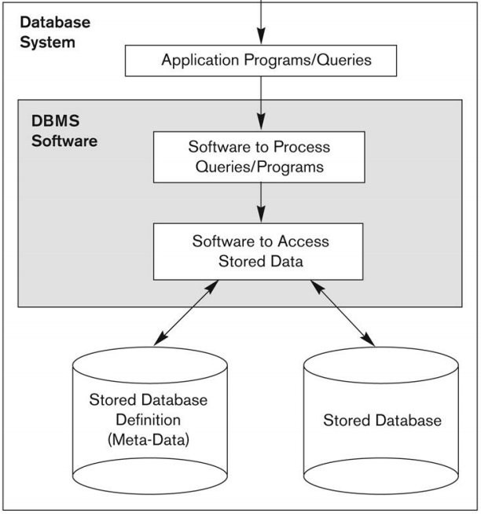

### DBMS

È il software che gestisce la basi di dati ed ha le seguenti funzioni:

* Definire il DB indicando i tipi di dati, struttura e vincoli
* Costruire il DataBase 
* Manipolare il DB con le seguenti operazioni:
    * Interrogare il DB per reperire dati
    * Aggiornare il DB per ripescchiare i cambiamenti nel minimondo
    * Accedere al DB attraverso applicazioni Web
* Condividere il DB, permettendo ad utenti e applicazioni di accedervi senza violare la consistenza dei dati (Florindi Approva)

Inoltre al DBMS sono delegate le funzioni di:

* Protezione e Manutenzione del DB
* Processing attivo dei dati (se il DBMS è attivo)
* Funzioni di presetnazione e visualizzazione dei dati

Alcuni vantaggi nell'utilizzo di un DBMS rispetto a semilici files sono:

* La sua natura autodescrittiva:
    * nei DB viene memorizzata una tabella che contiene struttura, vincoli e descrizioen complenta dei dati (viene detta catalogo e contiene i Metadati relativi al DB).
    * Permettono ai DBMS di accedere a diverse basi di dati con più facilità 
* La separazione tra programmi e dati e conseguentemente la loro astrazione:
    * agli utenti viene fornita una rappresentazione semplificata dei dati, detta Modello dei Dati.
    * le applicazioni si riferiscono al modello logico piuttosto che all'effettiva memorizzazione dei dati (memorizzata nel catalogo)
    * grazie a questa separazione è possibile modificare al struttura dei dati senza modificare i programmi di accesso ad essa
* Supporto di viste multiple e di condivisione sicura di dati in ambiente multiutente:
    * ogni utente può richiedere la visione di un diverso sottoinseme del DB, o di un insieme di dati non esplicitamente memorizzati, che prende il nome di vista
    * poichè un DBMS multiutente deve gestire più accessi contemporaneamemte deve anche tener conto della concorrenzialità delle modifiche che vengono effettuate al DB, garantendo l'**isolamento** e l'**atomicità** delle transazioni che vengono effettuate sul DB

#### Utenti di un DBMS

Ci sono 2 principali tipi di utenti:

* Attori in scena:
    * interagiscono direttametne con in DB in base alle loro compenteze
* Attori dietro le quinte:
    * progettano il DBMS ma non hanno interesse nelle Basi di Dati

#### Vantaggi di un DBMS

* Controllo della ridondanza:
    * permette di evitare la ridondanza o permette di avere casi di ridondanza controllata che non va ad influire sulla consisntenza dei dati
* Divieto di accesso non autorizzato:
    * fornisce un sistema per la sicurezza e l'autorizzazione all'accesso del DB (viene gestita dal DBA)
* Strutture di memorizzazione efficienti per l'eseuzione efficiente di query:
    * il DBMS utilizza indici (strutture ad albero o tabelle hash) per effettuare ricerche più veloci sui dati salvati su disco
    * impiego di un buffer che mantiene porzioni di DB nella memoria principale
* Backup e Recovery:
    * sistema per il ripristino del DBMS in caso di guasto
* Interfaccia utente:
    * fornisce varie interfaccie per faciliterne l'utilizzo
* Rappresentazioni di associazioni complesse tra i dati:
* Impostazione di Vincoli di Integrità
* Permesso di eseguire Inferenze e azioni tramite regole:
    * possibilità di definire regole per l'aggiornamento dei dati (per i DB attivi queste regole possono essere anche automatiche)
* Flessibilità:
    * possibilità di alterare la sturttura del DB senza interagire con i dati memorizzati al suo interno

In alcuni casi può essere svantaggioso utilizzare un DBMS rispetto ad una tradizionale gestione dei files:

* Basi di dati ed applicazioni semplici e ben definite
* L'accesso ai dati deve essere estremamente veloce e non si può perdere tempo con eventuali elaborazioni da parte del DMBS
* Non vi è accesso multiutente

## Modello dei Dati

Il modello dei dati è un isnieme che descrive la struttura (tipi di dato, associazioni tra i dati e i vincoli) di un DB e le operazioni per manipolare i suoi dati. 
Oltre alle operazioni di base (selezione, aggiornamento e cancellazione) il modello può anche contenere concetti per la specifica dell'aspetto dinamico di un DB.
I modelli dei dati possono essere di vari tipi:

* Alto Livello: forniscono concetti compendibili dagli utenti finali
* Basso Livello: forniscono dettagli sulla memorizzazione fisica dei dati
* Implementabili: forniscono concetti comprensibili dagli utenti ma con dettagli aggiunti che ne permettono implementazione diretta sul calcolatore

### Schema Vs Istanza

In una base di dati bisogna fare una distinzione tra Schemi e Istanze:

* Lo Schema (intenzione) rappresenta una descrizione del DB e viene specificato durante la fase di progettazione, può anche essere rappresentato graficamente tramite un diagramma di shcema. Serve per rappresentare i campi che ogni tabella del DB contiene. Generalmente cambia poco frequentemente. 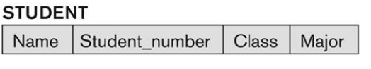
* L'Istanza (estenzione) rappresenta il contenuto del DB in un certo istante di tempo. Varia ad ogni aggiornamento del DB.

### Architettura a 3 Livelli

Per una migliroe implementazione dei DBMS è stata introdotta un'architettua a 3 Livelli utile supportare l'Indipendenza dei Dati e le Viste Multiple:

1. Schema Interno: serve per descrivere al memorizzazione fisica dei dati e delle strutture di accesso
2. Schema Conettuale: serve per desrivere le strutture e i vincoli del DB
3. Schema Esterno: descrive le varie viste dell'utente

### Indipendena dei Dati

L'indipendenza dei dati può essere:

* Logica: à la capacità di effettuare cambiamenti al livello Concettuale senza alterare il livello Esterno.
* Fisica: è la capacità di modificare il livello interno tenendo inalterato il livello Concettuale.

Questo consente di dover solamente modifcare i mapping tra i veri livelli che sono cambiati.

## Linguaggi

Vengono definiti 2 tipi di lingauggi:

* DDL (Data Definition Language):
    * viene utilizzata dai progettisti per specificare lo schema concettuale del DB
    * può essere suddiviso ulteriormente in SLD (Storage Definition Langue) e VDL (View Definition Language) che servono ripettivametne per definire schemi interni e schiemi esterni.
* DML (Data Manipulation Language):
    * Utilizzati per interrogazioni e aggiornamenti del DB
    * I comandi dl DML possono essere integrati in linguaggi di Programmazione come C, Java, ...
    * Possono essere di 2 tipi: Alto Livello o Basso Livello (Procedurali)

Esistono varie intefaccie per un DB e le più comuni sono:

* Standalone Query Inerface
* Interfaccia per l'utilizzo di DML in linguagig di Programmazione
* Interfraccie UserFriendly

## Architettura Centralizzata

Esisono 2 possibili architetture:

* A 2 Livelli: il client comunica direttamente con il DBMS Server
* A 3 Livelli: le richieste del client vengono passati ad un Application Server intermedio che le analizza e fa da tramite con il DBMS Server. Questa è più sicura perchè non c'è un'interazione diretta tra Client e Server

## Classificazione DMBS

Ci sono vari criteri per classificacare i DMBS:

* In base al Modello dei Dati:
    * Tradizionale: Relazionali, Gerarchici, Reticolari
    * Emergenti: Oggetti, Relazionale da Oggetti
* In base a come è distribuito il DB:
    * Centralizzati
    * Distribuiti
* General Puroe vs Special Purpose

### Tradizionali

**Gerarchico**: 

* i dati vengono rappresentati come una struttura gerarchica ad albero
* Vantaggio: rispecchia la antura gerarchica di una molteplicità di domini
* Svantaggi: 
    * impone regole rigide
    * poco ottimizzabile per le query automatiche
    * i programmi dipendono dalle strutture
    * non si presta a rappresentare relazioni N:M
    * la definizione di relazioni genereiche richiede inserimento di duplciati

**Reticolare**:

* i dati vengono rappresetnati come record che sono collegati tra di loto tramite puntatori
* Vantaggi:
    * un record può avere più padri evitando quindi ridondanze
    * ongi nodo può essere il punto di partenza per raggiungere un determinato campo
    * permette di modellare relazioni N:M
* Svantaggi:
    * genera complesso reticolo di puntatori
    * poca ottimizzazione per le query automatiche

### Emergenti

**Oggetti**:

* definisce la base di dati intermini di oggetti, delle loro propiretà e delle loro operazini associate
* icorporano parti del paradigma ad oggetti (tipi astratti, incapsulamento, ereditarietà, ...)

## Modello Relazionale

Le differenze pricipali con i modelli ormai in disuso (reticolare e gerarchico) sono:

* modo in cui si rappresentano le associazioni tra i record
    * nei primi 2 si usano puntatori
    * nel Relazinale si usano valori
* La definizione del Modello Relazionale trae fondamento nella Teoria degli insiemi e della logica dei predicati al Primo Ordine

### Definizioni

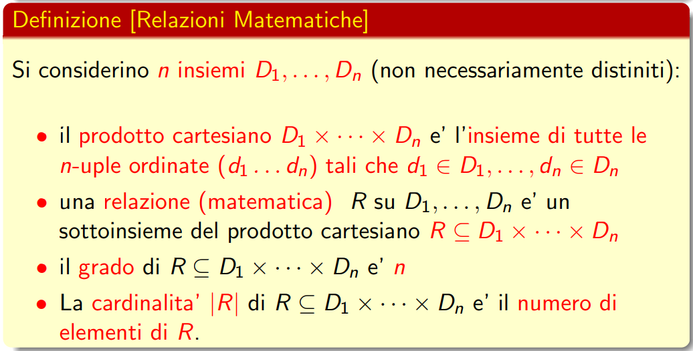

Un attributo rappresenta un campo della tabella 
Il Dominio rappresenta il tipo di elementi che saranno contenuti in un attributo.

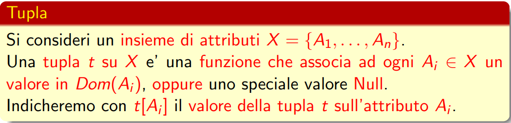

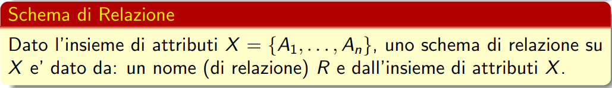

_Esempio di Relazione:_
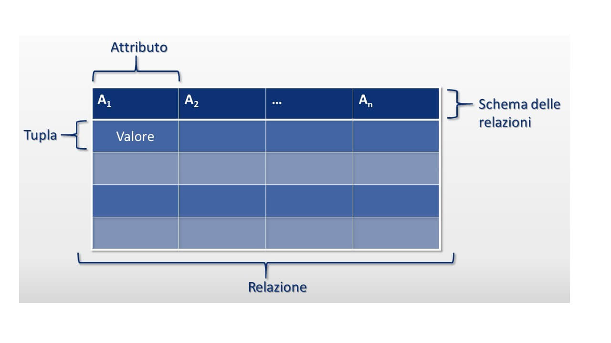

### Vincoli nei modelli Relazionali

Ci sono vari tipi di vincoli nei modelli Relazionali:

* Vincoli Intrinseci: sono vincoli dettati dal tipo di dati che si vanno ad utilizzare (e.g. vincolo che una relazione non può avere tuple duplicate)

* Vincoli basati sullo Schema: vincoli che possono essere espressi direttamente sugli schemi del modello (tramite il DDL)

* Vincoli non esprimibili sullo schema: vincoli che vengono specificati tramite programmi applicativi

* Dipendenze Funzionali: usati per verificare la qualità dei DB Relazionali

#### Vincoli Basati sullo Schema

Questa categoria di vincoli può essere divisa in 2 sottocategorie:

* Intra Relazionali: coinvolge un unico schema relazionale
* Inter Relazionali: coinvolge più schemi relazionli

**Intrarelazionali**

Ci sono vari vincoli di questo tipo ma i più importanti sono:

* Vincoli di Tupla: sono vincoli che conivolgono valori della stessa tupla come:
    * Vincoli di Dominio: restrizioni sui tipi attribuibili ad un attributo
    * Vincoli su più valori della stessa tupla
    * Vincoli di valore non nullo
* Vincoli di Univocità: restrizioni che vietano a 2 tuple di una stessa istanza di coincidere su valori di un dato sottoinsieme di attributi.

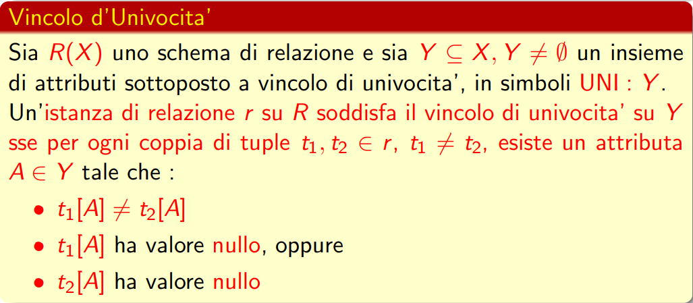

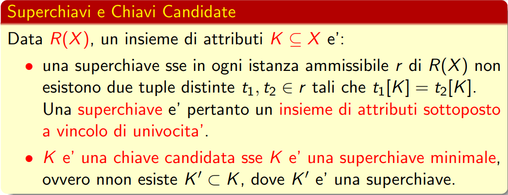

Dato che le Chiavi Candidate possono ammettere valori nulli, è necessario scegliere una Chiave Candidata che svolga il ruolo di Chiave Primaria su cui non si ammettono valori nulli. Quest'ultima proprietà viene chiamata Vincolo di Integrità dell'entità

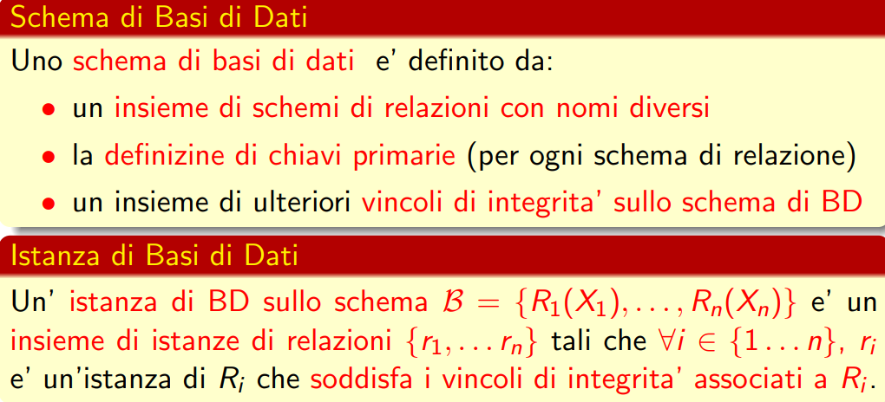

### Operazioni nel modello Relazionale :heart:

Le possibili operazioni che si possono effettuare in un DB relazionale sono:

* Inserimento: l'inserimento può violare tutti i tipi di vincoli. Quindi la maggior parte dei DBMS impedisce le operazioni di inserimento che violano tali regole

* Cancellazione: la cancellazione può portare alla violazione del vincolo di integrità referenziale, perciò i DBMS forniscono i seguenti approcci al problema:
    * rifiuto della cancellazione
    * propagazione della cancellazione: cancellare tutte le tuple che si riferiscono alla tupla che si sta eliminando
    * modifica dei valori referenti che causano la violazione ponendoli a Null o ad un valore di Default
* Modifica: la modifica può essere vista come un'operazioen di cancellazione e inserimento

## Algebra Relazionale

È un linguaggio per l'interrogazione dei DB Relazionali. Alcune carattirstiche:

* È costituito da un insieme di operazioni unari e binari su istanze di relazioni: ogni operatore ha come argomemnto 1 o 2 istanze di relazione e produce come output una istanza di relazione

* È un linguaggio procedurale: viene specificata la sequenza di operazioni neccessarie per ottenere il risultato atteso

Ci sono 2 tipi di Operatori:

* Operatori Insiemistici:
    * Unione
    * Intersezeione
    * Differenza
    * Prodotto Cartesiano
* Operatori Propriamente Relazionali:
    * Ridenominazione
    * Selezione
    * Proiezione
    * Concatenazione
    * Divisone

### Ridenominazione

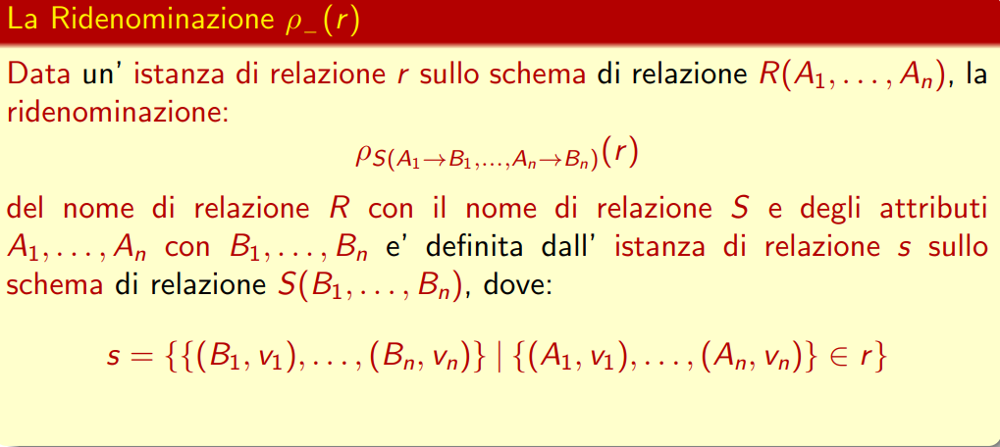

In breve, questo operatore permette di rinominare un singolo attributo, più attributi o una relazione, lasciando inalterati i valori.

Valgono le seguenti notazioni:

### Unione

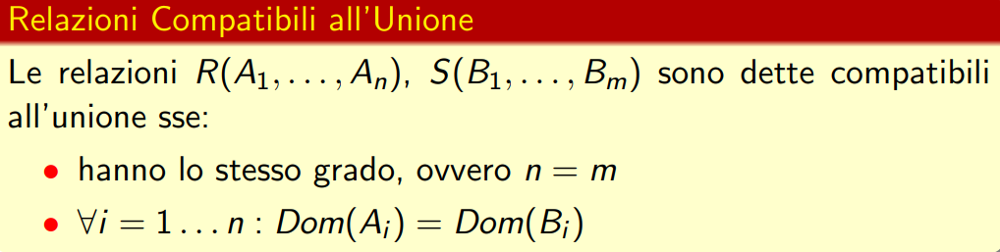

### Intersezione

### Differenza

> JUNGLE DIFF

### Prodotto Cartesiano

### Selezione e Proiezione

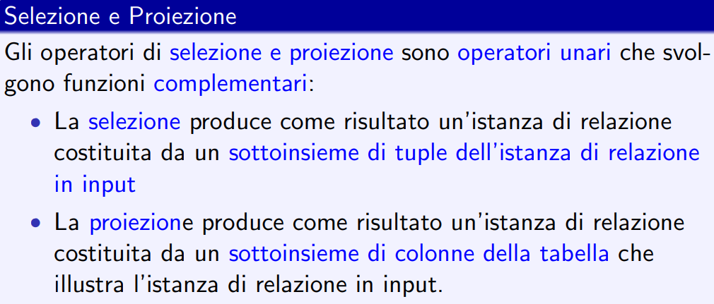

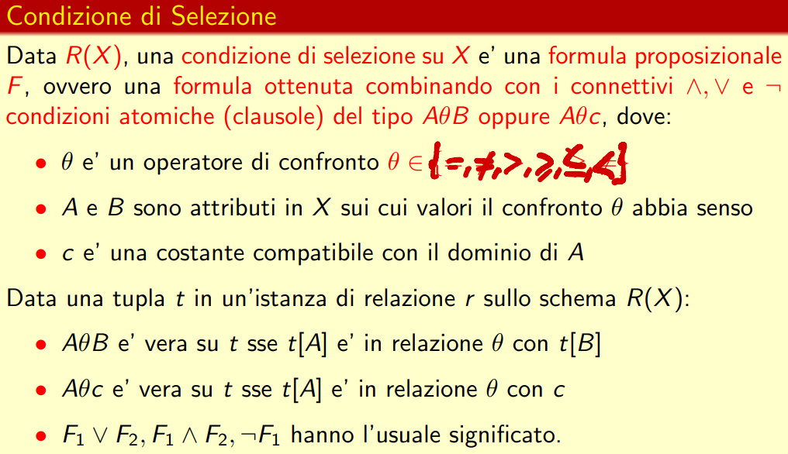

### Concatenazione (Join)

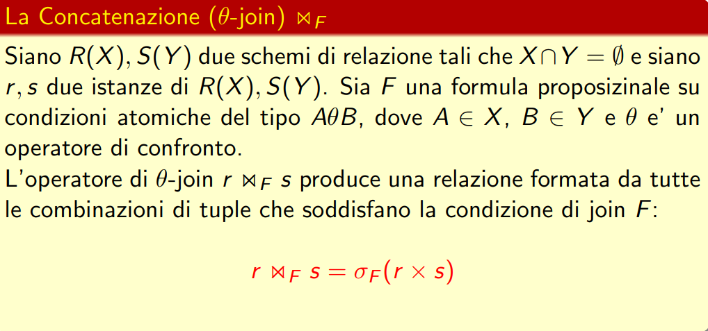

Viene effettuato un prodotto cartesiano tra r e s ed effettua una selezione in base alla condizione scelta F

**Equijoin**: le tuple vengono concatenate in base ad un attributo in comune e non come il teta-join che moltiplica tutto violentemente.

**Natural Join**: collassa gli attributi ridondanti dell'equijoin

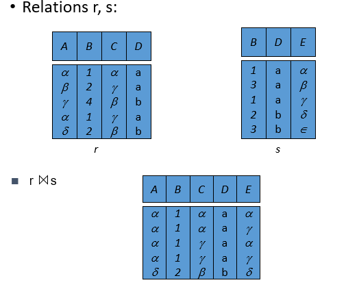

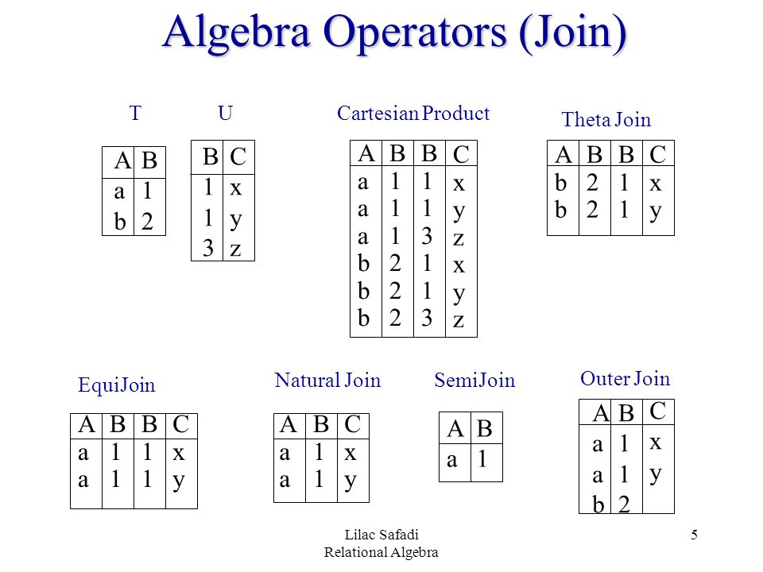