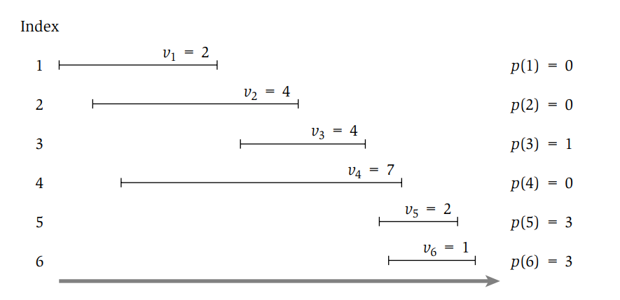
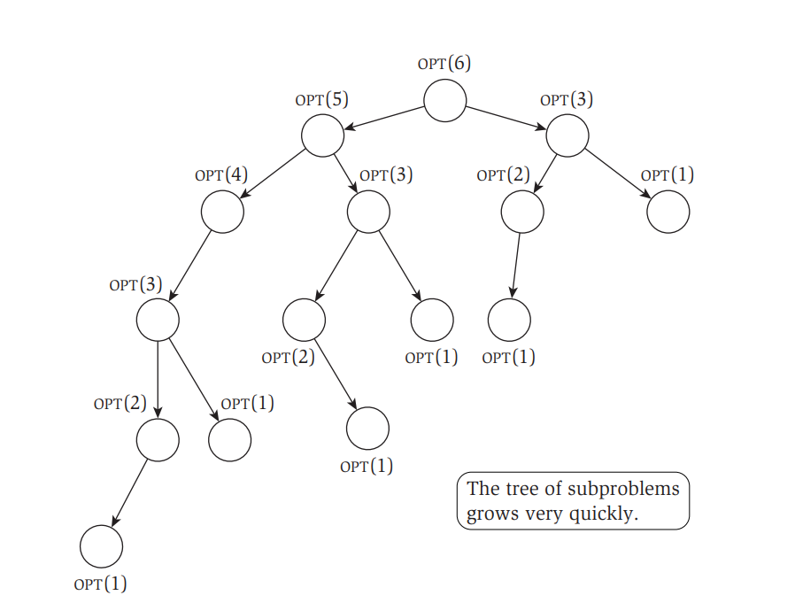
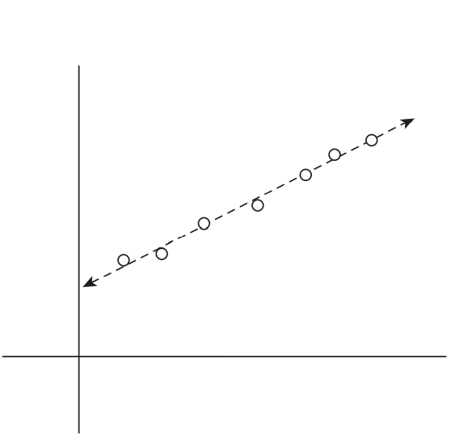
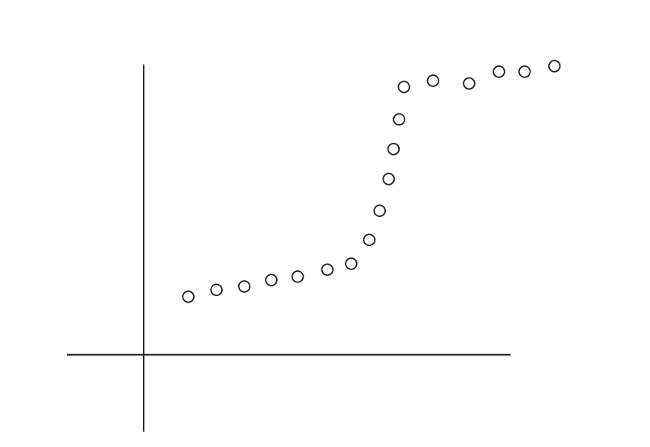
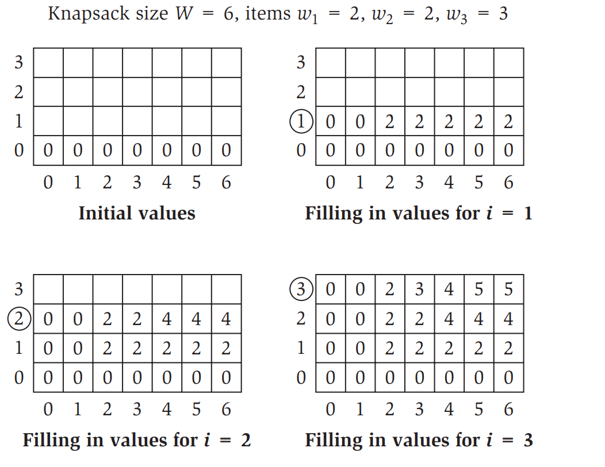

# Advanced and Distributed Algorithms - Modulo 2

## Indice

- [Advanced and Distributed Algorithms - Modulo 2](#advanced-and-distributed-algorithms---modulo-2)
  - [Introduzione alla Programmazione Dinamica](#introduzione-alla-programmazione-dinamica)
  - [Weighted Interval Scheduling 🏋️‍♂️](#weighted-interval-scheduling)
    - [Notazioni](#notazioni)
    - [Goal ⚽](#goal)
    - [Funzionamento](#funzionamento)
  - [Least Squares Problem: Multi-way Choice 🛣️](#least-squares-problem-multi-way-choice)
    - [Linear Least Square](#linear-least-square)
      - [Il Problema](#il-problema)
      - [Goal ⚽](#goal-1)
    - [Segmented Least Square](#segmented-least-square)
      - [Costi](#costi-1)
      - [Goal ⚽](#goal-2)
      - [Funzionamento](#funzionamento-1)

## Introduzione alla Programmazione Dinamica

Dopo aver visto tecniche di design degli algoritmi quali Greedy e Divide et Impera, 
è importante introdurre una tecnica più potente ma anche più complessa da applicare: la
Programmazione Dinamica (Dynamic Programming).

Prima di analizzarla in modo approfondito, spiegheremo a grandi linee il suo funzionamento.
L'idea di base si fonda sulla tecnica Divide et Impera ed è essenzialmente l'opposto di una
strategia Greedy, in sostanza si esplora implicitamente tutto lo spazio delle soluzioni e si decompone 
in una serie di sotto-problemi, grazie ai quali si costruiscono soluzioni corrette per
sotto-problemi sempre più grandi finché non si raggiunge il problema di partenza.

Una tecnica di programmazione dinamica è quella della memoization che è utile per risolvere una moltitudine di problemi e per applicare la programmazione dinamica è necessario creare un sotto-set di problemi che soddisfano le seguenti proprietà:

1. Esistono solo un numero polinomiale di sotto-problemi
2. La soluzione al problema originale può essere calcolata facilmente dalla soluzione dei sotto-problemi
3. C'è un ordinamento naturale dei sotto-problemi dal più piccolo al più grande, insieme a una ricorsione facilmente calcolabile

## Weighted Interval Scheduling 🏋️‍♂️

Questo algoritmo cerca di ottenere un insieme di intervalli non sovrapposti (overlapping)
che è il più grande possibile. Per la versione senza pesi (weight=1) esiste uno specifico algoritmo 
greedy che è in grado di trovare la soluzione ottima, tuttavia nella versione pesata (weight $\neq$ 1)
sarà necessario utilizzare la programmazione dinamica.

### Costi

| Funzione        | Costo                         |
| --------------- | ----------------------------- |
| `Compute-Opt`   | esponenziale (forse $O(2^n)$ ) |
| `M-Compute-Opt` | $O(n)$                        |
| `Find-Solution` | $O(n)$                        |

### Notazioni

Per discutere il problema dell'Interval Scheduling, utilizzeremo la seguente notazione:

- $n$: un intero che rappresenta l'indice dell'intervallo (job)
- $s_i$: tempo di inizio dell'intervallo $i$
- $f_i$: tempo di fine dell'intervallo $i$
- $v_i$: peso dell'intervallo $i$
- $p(j)$: ritorna l'indice più grande $i$, con $i < j$, del primo intervallo compatibile con l'intervallo $j$, considerando il fatto che gli intervalli sono ordinati in ordine non decrescente in base a $f_i$
- $\mathcal{O}_j$: rappresenta la soluzione ottima al problema calcolato sull'insieme $\{1, \ldots, j\}$
- $OPT(j)$: rappresenta il valore della soluzione ottima $\mathcal{O}_j$



### Goal ⚽

L'obiettivo del nostro problema attuale è quello di trovare un sottoinsieme $S \subseteq \{1, \ldots, n\}$ di intervalli mutualmente
compatibili che vanno a massimizzare la somma dei pesi degli intervalli selezionati $\sum_{i \in S} v_i$.

### Funzionamento

Come prima cosa definiamo il metodo per calcolare $OPT(j)$. Il problema è una _scelta binaria_ che va a decidere se l'intervallo di indice $j$ verrà incluso nella soluzione oppure no basandosi sul valore ritornato dalla seguente formula:

$$
OPT(j) = max(v_j + OPT(p(j)), \ \ OPT(j-1))
$$

Questo può essere anche visto come una disequazione:

$$
v_j + OPT(p(j)) \geq OPT(j-1)
$$

che se vera, includerà $j$ nella soluzione ottimale.


Scrivendo tutto sotto forma di algoritmo ricorsivo avremmo che:

```javascript
function Compute-Opt(j){
    if (j == 0)
        return 0
    else
        return max(vj+Compute-Opt(p(j)), Compute-Opt(j − 1))
}

```

Costruendo l'albero della ricorsione dell'algoritmo si nota che la complessità temporale è esponenziale! 😲



Una soluzione è quella di utilizzare la tecnica della **Memoization** che evita di ricalcolare $OPT$ per gli indici già calcolati precedentemente, rendendo così il costo temporale uguale ad $O(n)$ 🧑‍🦼.

```javascript
function M-Compute-Opt(j){
    if (j == 0)
        return 0
    else if (M[j] is not empty)
        return M[j]
    else
        let M[j] = max(vj+M-Compute-Opt(p(j)), M-Compute-Opt(j − 1))
        return M[j]
}
```

Oltre al valore della soluzione ottimale probabilmente vorremmo sapere anche quali sono gli intervalli che la compongono, e intuitivamente verrebbe da creare un array aggiuntivo in cui verranno aggiunti gli indici degli intervalli ottenuti con `M-Compute-Opt`. Tuttavia questo aggiungerebbe una complessità temporale di $O(n)$ peggiorando notevolmente le prestazioni. Un'alternativa è quella di recuperare le soluzioni dai valori salvati nell'array `M` dopo che la soluzione ottimale è stata calcolata. Per farlo possiamo sfruttare la formula vista in precedenza $v_j + OPT(p(j)) \geq OPT(j-1)$, che ci permette di rintracciare gli intervalli della soluzione ottima.

```javascript
function Find-Solution(j) {
    if (j == 0)
        Output nothing
    else if (vj + M[p(j)] >= M[j − 1])
        Output j together with the result of Find-Solution(p(j))
    else
        Output the result of Find-Solution(j − 1)
}

```

## Least Squares Problem: Multi-way Choice 🛣️

Nel capitolo precedente l'algoritmo richiedeva una ricorsione basata su scelte binarie,
in questo capitolo invece introdurremo un algoritmo che richiede ad ogni step un numero
di scelte polinomiali (_multi-way choice_). Vedremo come la programmazione dinamica si 
presta molto bene a risolvere questi problemi.

### Linear Least Square

#### Il Problema

La formulazione del problema è la seguente: 

> dato un insieme $P$ composto di $n$ punti sul piano denotati con $(x_1, y_1), (x_2, y_2), \ldots, (x_n, y_n)$; e supponiamo che $x_1 < x_2 < \ldots < x_n$ (sono strettamente crescenti). Data una linea $L$ definita dall'equazione $y = ax + b$, definiamo l'_errore_ di $L$ in funzione di $P$ come la somma delle distanze al quadrato della linea rispetto ai punti in $P$.
>
>Formalmente:
> $$Error(L, P) = \sum_{i=1}^{n} (y_i - ax_i - b)^2$$




#### Goal 

È intuibile che il goal dell'algoritmo è quello di cercare la linea con errore
minimo, che può essere facilmente trovata utilizzando l'analisi matematica.
La linea di errore minimo è $y = ax + b$ dove:

$$
    a = \frac{n \sum_{i} x_i y_i - (\sum_{i} x_i) (\sum_{i} y_i)}{n \sum_{i} x_i^2 - (\sum_{i} x_i)^2} \ \ \  \ \ b = \frac{\sum_{i} y_i - a \sum_{i} x_i}{n} 
$$


### Segmented Least Square

Le formule appena citate sono utilizzabili solo se i punti di $P$ hanno un andamento
che è abbastanza lineare ma falliscono in altre circostanze.

 

Come è evidente (_lapalissiano 💎_) dalla figura non è possibile trovare una linea
che approssimi in maniera soddisfacente i punti, dunque per risolvere il problema
possiamo pensare di rilassare la condizione che sia solo una la linea. Questo però
implica dover riformulare il goal che altrimenti risulterebbe banale (si fanno $n$ linee 
che passano per ogni punto).

#### Costi

La parte che computa gli errori ha costo in tempo $O(n^3)$ (si può portare a $O(n^2)$ ).
La parte che trova il valore ottimo ha costo $O(n^2)$.

In spazio l'algoritmo ha costo $O(n^2)$ ma può essere ridotto a $O(n)$


#### Goal ⚽

Formalmente, il problema è espresso come segue:

> come prima abbiamo un set di punti $P = \{(x_1, y_1), (x_2, y_2), \ldots, (x_n, y_n)\}$ strettamente crescenti.
> Denoteremo l'insieme dei punti $(x_i, y_i)$ con $p_i$.
> Vogliamo partizionare $P$ in un qualche numero di segmenti, ogni numero di segmenti
> è un sottoinsieme di $P$ che rappresenta un _set_ contiguo delle coordinate $x$ con la forma $\{p_i, p_{i+1}, \ldots, p_{j-1}, p_j\}$ per degli indici $i \leq j$.
> Dopodiché, per ogni segmento $S$ calcoliamo la linea che minimizza l'errore rispetto ai punti in $S$ secondo quanto espresso dalle formule enunciate prima.

Definiamo infine una penalità per una data partizione come la somma dei seguenti termini:

- Numero di segmenti in cui viene partizionato $P$ moltiplicato per un valore $C > 0$ (più è grande e più penalizza tante partizioni)
- Per ogni segmento l'errore della linea ottima attraverso quel segmento.

Il goal del Segmented Least Square Problem è quindi quello di trovare la partizione
di **penalità minima**. 

#### Funzionamento

Per come è fatta la programmazione dinamica noi vogliamo suddividere il problema in sotto-problemi e
per farlo partiamo dall'osservazione che l'ultimo punto appartiene ad una partizione ottima che parte da un valore $p_i$ fino a $p_n$
e che possiamo togliere questi punti dal totale per ottenete un sotto-problema più piccolo. 
Supponiamo che la soluzione ottima sia denotata da `OPT(j)`, per i punti che vanno da $p_1$ a $p_j$, allora avremo che la soluzione ottima al problema 
dato l'ultimo segmento che va da $p_i$ a $p_n$, sarà dalla seguente formula:

$$
    OPT(n) = e_{i,n} + C + OPT(i - 1)
$$

Questa formula è data dalla soluzione ottima dell'ultima partizione ( $e_{i,n} + C$ ) a cui viene aggiunta la soluzione ottima
di tutte le partizioni precedenti ( $OPT(i -1)$ ).
Per i sotto-problemi possiamo scrivere la soluzione al problema in forma ricorsiva utilizzando la formula appena espressa che prenderà
la forma:

$$
    OPT(j) = \min_{1 \leq i \leq j}(e_{i,j} + C + OPT(i - 1))
$$

```javascript
function Segmented-Least-Squares(n) {
    M[0 ... n]
    M[0] = 0
    
    // compute the errors
    for (j in 1 ... n) {
        for (i in 1 ... j) {
            compute eij for the segment pi, ..., pj
        }
    }

    // find optimal value
    for (j in 1 ... n) {
        M[j] = min_i(eij + C + M[i - 1]) // OPT(J)
    }

    return M[n]
}

```

Dopo aver trovato la soluzione ottima, possiamo sfruttare la memoization per ricavarci
i segmenti in tempi brevi.

```javascript
function Find-Segments(j) {
    if (j == 0) print('')

    else {
        Find an i that minimizes ei,j + C + M[i − 1]
        Output the segment {pi,..., pj} and the result of Find-Segments(i − 1)
    }
}

```

L'algoritmo ha costo $O(n^3)$ in tempo e $O(n^2)$ in spazio.
Questo tempo può essere ridotto applicando la memoization alle formule per il calcolo
dell'errore viste in precedenza portandolo a $O(n^2)$ per il tempo e $O(n)$ per lo spazio.


## Subset Sum & Knapsack Problem 💰 

### Il Problema

Il problema delle Subset Sum è formalmente definito come segue:

> abbiamo $n$ oggetti $\{1, \ldots, n\}$, a ognuno viene assegnato un
> peso non negativo $w_i$ (per $i = 1, \ldots, n$ ) e ci viene dato anche un 
> limite $W$. L'obbiettivo è quello di selezionare un sottoinsieme $S$ degli oggetti
> tale che $\sum_{i \in S}w_i \leq W$ e che questa sommatoria abbia valore più 
> grande possibile.

Questo problema è un caso specifico di un problema più generale conosciuto come
il Knapsack Problem, l'unica differenza sta nel valore da massimizzare che per il
Knapsack è un valore $v_i$ e non più il peso.

Si potrebbe pensare di risolvere questi problemi con un algoritmo greedy ma 
purtroppo non ne esiste uno in grado di trovare efficientemente la soluzione ottima.
Potremmo pensare di ordinare gli oggetti in base al peso in ordine crescente o
decrescente e prenderli, tuttavia questo approccio fallisce per determinati casi
(come per l'insieme $\{W/2+1, W/2, W/2\}$ ordinato in senso decrescente) e l'unica
opzione sarà quella di provare con la programmazione dinamica 👨‍🦽.

### Goal ⚽

Possiamo riassumere il goal di questi problemi come segue:

Abbiamo $n$ oggetti $\{1, \ldots, n\}$, a ognuno viene assegnato un
peso non negativo $w_i$ (per $i = 1, \ldots, n$ ) e ci viene dato anche un 
limite $W$. L'obbiettivo è quello di selezionare un sottoinsieme $S$ degli oggetti
tale che $\sum_{i \in S}w_i \leq W$ e che questa sommatoria abbia valore più 
grande possibile.

### Costi

| Funzione        | Costo (tempo)                 |
| --------------- | ----------------------------- |
| `Subset-Sum`    | $O(nW)$                       |
| `Find-Solution` | $O(n)$                        |

### Funzionamento

Come per tutti gli algoritmi dinamici dobbiamo cercare dei sotto-problemi e possiamo utilizzare la stessa intuizione avuto per il problema dello scheduling (scelta binaria). Facendo tutti i calcoli di dovere otteniamo la seguente ricorsione:

> se $w < w_i$ allora $OPT(i, w) = OPT(i-1,w)$ altrimenti
> $OPT(i, w) = max(OPT(i-1, w), w_i + OPT(i-1, w-w_i))$

Nella prima parte analizziamo il caso in cui l'elemento che vogliamo aggiungere va
a superare il peso massimo residuo $w$, dunque viene scartato. Nella seconda parte
andiamo ad analizzare se l'aggiunta o meno del nuovo oggetto va a migliorare
la soluzione di $OPT$ che è definita come: 

$$
    OPT(i, w) = \max_{S} \sum_{j \in S} w_j
$$

Possiamo formalizzare il tutto con il seguente pseudocodice:

```javascript
function Subset-Sum(n, W) {
    let M[0 . . . n,0... W]

    //initialize the memoization vector
    for(w in 0 ... W) {
        M[0, W] = 0
    }

    //solve subproblems
    for(i in 1 ... n) {
        for(w in 0 ... W) {
            Use the recurrence to compute M[i, w]
        }
    }

    return M[n, W]
}
```

La particolarità di questo algoritmo è che avremmo 2 insiemi di sottoproblemi
diversi che devono essere risolti per ottenere la soluzione ottima. Questo fatto
si riflette in come viene popolato l'array di memoization dei valori di $OPT$
che verranno salvati in un array bidimensionale.



> Il costo in tempo di questa implementazione è di $O(nW)$.

A causa di questo costo, questo algoritmo fa parte della famiglia degli algoritmi
_pseudo polinomiali_, ovvero algoritmi il cui costi dipende da una variabile di input
che se piccola, lo mantiene basso e se grande lo fa esplodere.

Per recuperare gli oggetti dall'array di Memoization la complessità in tempo è di
$O(n)$. 

Questa implementazione funziona anche per il problema più generale del Knapsack,
ci basterà solo cambiare la parte di ricorsione scrivendola come segue:

> se $w < w_i$ allora $OPT(i, w) = OPT(i-1,w)$ altrimenti
> $OPT(i, w) = max(OPT(i-1, w), v_i + OPT(i-1, w-w_i))$

La complessità temporale è sempre $O(nW)$.