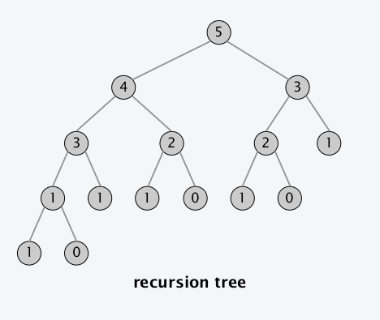
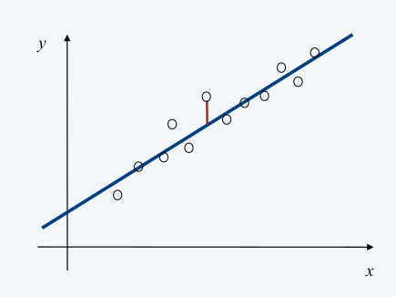
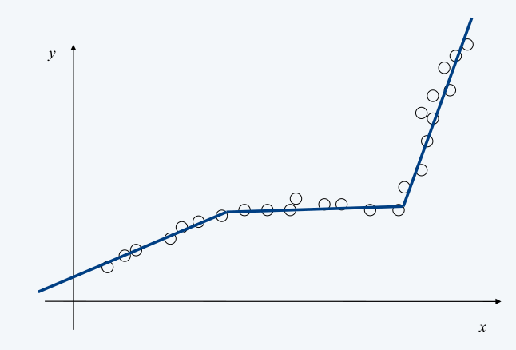
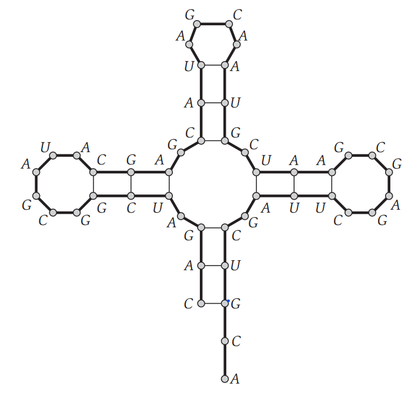
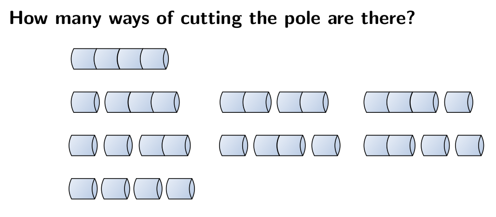
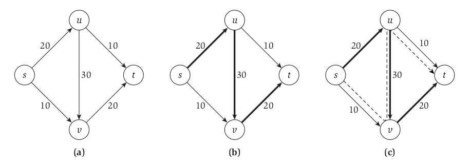
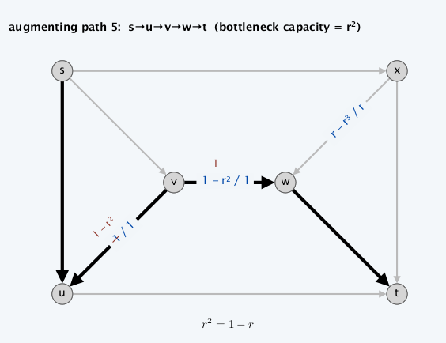
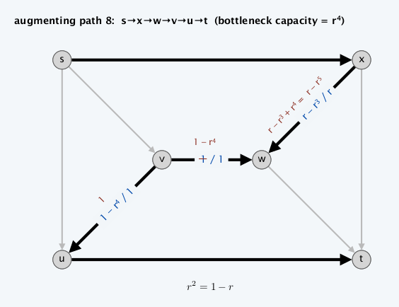
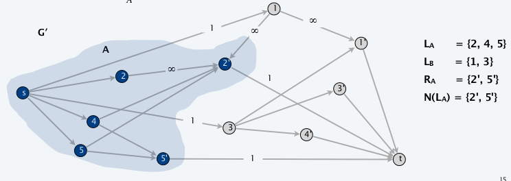
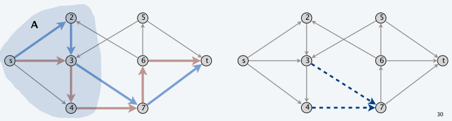

# Advanced and Distributed Algorithms - Modulo 2

## Indice

- [Dynamic Programming](#dynamic-programming)
  - [Introduzione](#introduzione)
  - [Weighted Interval Scheduling Problem](#weighted-interval-scheduling-problem)
  - [Segmented Least Squares Problem](#segmented-least-squares-problem)
  - [Knapsack Problem](#knapsack-problem)
  - [RNA Secondary Stucture](#rna-secondary-stucture-problem)
  - [Pole Cutting Problem](#pole-cutting-problem)
  - [Matrix Chain Parentesizathion](#matrix-chain-parenthesization)
  - [Optimal Binary Search Tree](#optimal-binary-search-tree)
  - [Sequence Alignment Problem](#sequence-alignment)
    - [Hirschberg's Algorithm](#sequence-alignment-in-spazio-lineare-utilizzando-la-dividi-et-impera)
    - [Longest Common Subsequence (LCS)](#longest-common-subsequence)
- [Network Flow](#network-flow)
  - [Introduzione](#introduzione-1)
  - [The Max-Flow Problem and the Ford-Fulkerson Algorithm](#the-maximum-flow-problem-and-the-ford-fulkerson-algorithm)
  - [Maximum Flows and Minimum Cuts in a Network](#maximum-flows-and-minimum-cuts-in-a-network)
  - [Capacity Scaling Algorithm](#capacity-scaling-algorithmchoosing-good-augmenting-paths)
  - [Ford-Fulkerson pathological example](#ford-fulkerson-pathological-example)
  - [Matching su Grafi Bipartiti](#Matching-su-Grafi-Bipartiti)
  - [Disjoint Paths](#disjoint-paths)
  - [Network Connectivity](#network-connectivity)


<hr>

# Dynamic Programming

## Introduzione
Dopo aver visto tecniche di design per vari tipi algoritmi (ad esempio Ricerca, Ordinamento ecc...) quali: 
- **Greedy** in cui si costruisce una soluzione in modo incrementale, ottimizzando ciecamente alcuni criteri locali.
- **Divide et Impera** nella quale si suddivide un problema in sottoproblemi indipendenti, si risolve ogni sottoproblema e ne si combina la soluzione con gli altri sottoproblemi per formare la soluzione al problema originale,

è possibile introdurre una tecnica più potente ma anche più complessa da applicare: la **Programmazione Dinamica** (Dynamic Programming). L'idea su cui si fonda è simile alla tecnica **Divide et Impera** ed è essenzialmente l'opposto di una strategia **Greedy**. In sostanza si esplora implicitamente tutto lo spazio delle soluzioni e lo si decompone in una serie di **sotto-problemi**, grazie ai quali si costruiscono le soluzioni per **sotto-problemi sempre più grandi** finché non si raggiunge il **problema di partenza**.

Una tecnica di programmazione dinamica è quella della `Memoization`, che è utile per risolvere una moltitudine di problemi. In sostanza, nella programmazione dinamica si verifica spesso la situazione in cui lo stesso sotto-problema deve essere risolto più volte, per questo motivo i risultati intermedi (le soluzioni a questi sotto-problemi) vengono salvati in una struttura dati (utilizzata come cache) e riutilizzati ogni qualvolta si presenta un sottoproblema già risolto. In questo modo, lo stesso sotto-problema non viene risolto/computato più volte ma soltanto una, diminuendo di molto il costo computazionale (in tempo) dell'algoritmo al prezzo di un costo in spazio (per salvare le soluzioni ai sotto-problemi risolti).

Per applicare la programmazione dinamica è necessario creare un *sotto-set* di problemi che soddisfano le seguenti proprietà:
1. Esiste solo un **numero polinomiale di sotto-problemi**
2. La soluzione al problema originale può essere calcolata **facilmente dalla soluzione dei sotto-problemi**
3. C'è un **ordinamento naturale dei sotto-problemi** dal più piccolo al più grande, insieme a una ricorsione facilmente calcolabile

### Applicare la Programmazione Dinamica

L'idea è quella di applicare i concetti fondamentali della programmazione dinamica: <br>
*Se avremo bisogno di nuovo della soluzione di questo sottoproblema, potremo riaverla immediatamente **senza bisogno di ricalcolarla***. <br>
Come sappiamo per i problemi risolti precedentemente: <br>
La programmazione dinamica richiede una memoria extra per ridurre il tempo di esecuzione (**compromesso tempo-memoria**). 

Il risparmio di tempo ottenibile può essere notevole: **una soluzione con tempo esponenziale può essere trasformata in una soluzione con tempo polinomiale**:
- Un metodo di programmazione dinamica viene eseguito in **tempo polinomiale** quando il numero di sottoproblemi distinti richiesti è **polinomiale nella dimensione dell'input** e ciascun sottoproblema può essere risolto in un tempo polinomiale.

Come già visto per la risoluzione degli altri problemi, ci sono due modi equivalenti:
- **Metodo Top-Down con Memoization**: In questo approccio si scrive la procedura ricorsiva in modo naturale, modificandola per salvare il risultato di ciascun sottoproblema. La procedura prima verifica se ha risolto precedentemente questo problema. In caso affermativo, restituisce il valore salvato, risparmiando gli ulteriori calcoli a quel livello; altrimenti la procedura calcola il valore nel modo usuale.
- **Metodo Bottom-Up**: Ordiniamo i sottoproblemi per dimensione e poi li risolviamo ordinatamente a partire dal più piccolo. Quando risolviamo un particolare sottoproblema, abbiamo già risolto tutti i sottoproblemi più piccoli da cui dipende la sua soluzione.

Questi due approcci generano ***algoritmo con lo stesso tempo di esecuzione asintotico***. L'approccio **Bottom-Up** spesso ha fattori costanti molto migliori, in quanto ha **meno costi per le chiamate di procedura**.
Qui di seguito verranno descritti i principali problemi e algoritmi di risoluzione nell'ambito della programmazione dinamica.

### **Recap**:
- Programmazione Dinamica
  - Risolve un problema combinando sottoproblemi
  - I sottoproblemi vengono risolti al massimo una volta, memorizza le soluzioni nella tabella
  - Se un problema presenta una sottostruttura ottimale, la programmazione dinamica è spesso la scelta giusta
  - Gli approcci Top-Down e Bottom-Up hanno lo stesso runtime

<hr>

## Weighted Interval Scheduling Problem

Abbiamo visto che un algoritmo **greedy** produce una soluzione ottimale per l'Interval Scheduling Problem, in cui l'obiettivo è accettare un insieme di intervalli non sovrapposti il più ampio possibile. 
**Il Weighted Interval Scheduling Problem** è una versione più **generale**, in cui ogni intervallo ha un certo valore (o peso), e vogliamo accettare un insieme di valore massimo.

Questo problema ha l'obiettivo di ottenere un insieme (il più grande possibile) di intervalli non sovrapposti (overlapping). Per la versione non pesata (Interval Scheduling Problem in cui weight=1) esiste uno specifico algoritmo **Greedy** che è in grado di trovare la soluzione ottima, tuttavia nella versione più generale, ovvero la versione pesata (**il Weighted Interval Scheduling Problem**, weight $\neq$ 1), è necessario utilizzare la programmazione dinamica.

### **Descrizione del problema**
- $n$: un intero che rappresenta l'indice dell'intervallo (job)
- $s_i$: tempo di inizio dell'intervallo $i$
- $f_i$: tempo di fine dell'intervallo $i$
- $v_i$: peso dell'intervallo $i$
- Due job sono **compatibili** se non si sovrappongono.
- $p(j)$: ritorna l'indice più grande $i$, con $i < j$, del primo intervallo compatibile con l'intervallo $j$, considerando il fatto che gli intervalli sono ordinati in ordine non decrescente in base a $f_i$
- $\mathcal{O}_j$: rappresenta la soluzione ottima al problema calcolato sull'insieme $\{1, \ldots, j\}$
- $OPT(j)$: rappresenta il valore della soluzione ottima $\mathcal{O}_j$

#### **Goal**:
- L'obiettivo del problema attuale è quello di trovare un sottoinsieme $S \subseteq \{1, \ldots, n\}$ di intervalli mutualmente compatibili che vanno a massimizzare la somma dei pesi degli intervalli selezionati $\sum_{i \in S} v_i$.

#### Greedy Version - *Earliest Finish Time First*
Considero i job in ordine non decrescente di $f_j$, aggiungo un job alla soluzione se è compatibile con il precedente.

È corretto se i pesi sono tutti 1, ma **fallisce** clamorosamente nella versione pesata.

### Dynamic Version

Come prima cosa definiamo il metodo per calcolare $OPT(j)$. Il problema è una ***scelta binaria*** che va a decidere se il job di indice $j$ verrà **incluso** nella soluzione **oppure no**, basandosi sul valore ritornato dalla seguente formula (si considerano sempre i job in ordine non decrescente rispetto a $f_i$):

$$
OPT(j) = max(v_j + OPT(p(j)), \ \ OPT(j-1))
$$

Questo può essere anche visto come una disequazione:

$$
v_j + OPT(p(j)) \geq OPT(j-1)
$$

che **se vera**, includerà $j$ nella soluzione ottimale.

### **Brute Force**
Scrivendo tutto sotto forma di algoritmo ricorsivo avremmo che:
```javascript
Input: n, s[1..n], f[1..n], v[1..n]
Sort jobs by finish time so that f[1] ≤ f[2] ≤ ... ≤ f[n]. 
Compute p[1], p[2], ..., p[n].

function Compute-Opt(j){
    if (j == 0)
        return 0
    else
        return max(vj+Compute-Opt(p(j)), Compute-Opt(j − 1))
}
```
Costruendo l'albero della ricorsione dell'algoritmo si nota che la complessità temporale è **esponenziale**. Questo perchè seguendo questo approccio, venogno calcolati più volte gli stessi sottoproblemi, i quali si espandono come un albero binario. Il numero di chiamate ricorsive cresce come la **sequenza di fibonacci**.



Una soluzione è quella di utilizzare la tecnica della **Memoization** che evita di ricalcolare $OPT$ per gli indici già calcolati precedentemente, rendendo così il costo temporale uguale ad $O(n)$.

### Memoization

```pseudocode
Input: n, s[1..n], f[1..n], v[1..n]
Sort jobs by finish time so that f[1] ≤ f[2] ≤ ... ≤ f[n]. 
Compute p[1], p[2], ..., p[n].

for j = 1 to n 
	M[j] ← empty.
M[0] ← 0.

M-Compute-Opt(j)
  if M[j] is empty
  	M[j] ← max(v[j] + M-Compute-Opt(p[j]), M-Compute-Opt(j – 1)) 
  return M[j]
```

Costruisco una array dove salvo i risultati dei sottoproblemi. Quando devo accedere ad un sottoproblema, prima di ricalcolarlo, controllo se è presente nel suddetto array.

Costo computazionale = $O(n\log{n})$:

- Sort: $O(n\log{n})$
- Computazione di p[i]: $O(n\log{n})$
- M-Compute-Opt( j ): $O(1)$ ogni iterazione, al massimo $2n$ ricorsioni = $O(n)$

Se i job sono già ordinati = $O(n)$

### Finding a solution
Oltre al valore della soluzione ottimale probabilmente vorremmo sapere anche quali sono gli intervalli che la compongono, e intuitivamente verrebbe da creare un array aggiuntivo in cui verranno aggiunti gli indici degli intervalli ottenuti con `M-Compute-Opt`. Tuttavia questo aggiungerebbe una complessità temporale di $O(n)$ peggiorando notevolmente le prestazioni. Un'alternativa è quella di recuperare le soluzioni dai valori salvati nell'array `M` dopo che la soluzione ottimale è stata calcolata. Per farlo possiamo sfruttare la formula vista in precedenza $v_j + OPT(p(j)) \geq OPT(j-1)$, che ci permette di rintracciare gli intervalli della soluzione ottima.

```pseudocode
Find-Solution(j)
  if j = 0
  	return ∅
  else if (v[j] + M[p[j]] > M[j–1])
  	return { j } ∪ Find-Solution(p[j]) 
  else
  	return Find-Solution(j–1)
```

Numero di chiamate ricorsive $\leq n = O(n)$ 

### Bottom-Up (iterative way)
Usiamo ora l'algoritmo per il Weighted Interval Scheduling Problem sviluppato nella sezione precedente per riassumere i principi di base della programmazione dinamica, e anche per offrire una prospettiva diversa che sarà fondamentale per il resto delle spiegazioni: ***iterare su sottoproblemi, piuttosto che calcolare soluzioni in modo ricorsivo***.

Nella sezione precedente, abbiamo sviluppato una soluzione in tempo polinomiale al problema, progettando: prima un **algoritmo ricorsivo in tempo esponenziale** e poi **convertendolo (tramite memoization) in un algoritmo ricorsivo efficiente** che consultava un array globale M di soluzioni ottimali per sottoproblemi. Per capire davvero i concetti della programmazione dinamica, è utile formulare una versione essenzialmente equivalente dell'algoritmo. **È questa nuova formulazione che cattura in modo più esplicito l'essenza della tecnica di programmazione dinamica e servirà come modello generale per gli algoritmi che svilupperemo nelle sezioni successive**.

```pseudocode
Sort jobs by finish time so that f1 ≤ f2 ≤ ... ≤ fn. 
Compute p(1), p(2), ..., p(n).

M[0] ← 0
for j = 1 TO n
	M[j] ← max { vj + M[p(j)], M[j–1] }
```
Questo approccio fornisce un secondo algoritmo efficiente per risolvere il problema dell'Weighted Interval Scheduling. I due approcci (**ricorsivo con memoization e iterativo**) hanno chiaramente una grande quantità di sovrapposizioni concettuali, poiché entrambi crescono dall'intuizione contenuta nella ricorrenza per `OPT`. Per il resto del capitolo, svilupperemo algoritmi di programmazione dinamica usando il secondo tipo di approccio (costruzione iterativa di sottoproblemi) perché gli algoritmi sono spesso più semplici da esprimere in questo modo.

### Riepilogo
- $OPT[j] = max\{ v_j + OPT[p_j], OPT[j-1] \}$
- Per ogni $j$ scelgo se prenderlo o meno
- Alcuni sottoproblemi vengono scartati (quelli che si sovrappongono al $j$ scelto)
- Per ogni scelta ho due possibilità: **TEMPO =** $O(n \log n)$
- Lo spazio è un vettore di $OPT[j]$ : **SPAZIO =** $O(n)$
- Per ricostruire la soluzione uso un vettore dove per ogni $j$ ho un valore booleano che indica se il job fa parte della soluzione: **SPAZIO_S =** $O(n)$

<hr>

## Segmented Least Squares Problem

### Linear Least Square
Nel capitolo precedente la risoluzione al problema Wheighted Interval Scheduling richiedeva una ricorsione basata su scelte ***binarie***, in questo capitolo invece introdurremo un algoritmo che richiede ad ***ogni step un numero di scelte polinomiali*** (_multi-way choice_). Vedremo come la programmazione dinamica si  presta molto bene a risolvere anche questo tipo di problemi.

### **Descrizione del Problema**
> Dato un insieme $P$ composto di $n$ punti sul piano denotati con $(x_1, y_1), (x_2, y_2), \ldots, (x_n, y_n)$ e supponiamo che $x_1 < x_2 < \ldots < x_n$ (sono strettamente crescenti). Data una linea $L$ definita dall'equazione $y = ax + b$, definiamo l'_errore_ di $L$ in funzione di $P$ come la somma delle distanze al quadrato della linea rispetto ai punti in $P$.
>
> Formalmente:
> $$Error(L, P) = \sum_{i=1}^{n} (y_i - ax_i - b)^2$$



#### **Goal**:
- Il goal dell'algoritmo è quello di ***cercare la linea con errore minimo***, che può essere facilmente trovata utilizzando l'analisi matematica.

La linea di errore minimo è $y = ax + b$ dove:

$$
    a = \frac{n \sum_{i} x_i y_i - (\sum_{i} x_i) (\sum_{i} y_i)}{n \sum_{i} x_i^2 - (\sum_{i} x_i)^2} \ \ \  \ \ b = \frac{\sum_{i} y_i - a \sum_{i} x_i}{n} 
$$

### Segmented Least Squares

Le formule appena citate sono utilizzabili solo se i punti di $P$ hanno un andamento che è abbastanza lineare ma falliscono in altre circostanze.



Come è evidente dalla figura non è possibile trovare una linea che approssimi in maniera soddisfacente i punti, dunque per risolvere il problema possiamo pensare di rilassare la condizione che sia solo una la linea. Questo però implica dover riformulare il goal che altrimenti risulterebbe banale (si fanno $n$ linee  che passano per ogni punto).

#### **Goal**:
- Formalmente, il problema è espresso come segue:
  > Come prima abbiamo un set di punti $P = \{(x_1, y_1), (x_2, y_2), \ldots, (x_n, y_n)\}$ strettamente crescenti.
  > Denoteremo l'insieme dei punti $(x_i, y_i)$ con $p_i$.
  > Vogliamo partizionare $P$ in un qualche numero di segmenti, ogni numero di segmenti è un sottoinsieme di $P$ che rappresenta un _set_ contiguo delle coordinate $x$ con la forma $\{p_i, p_{i+1}, \ldots, p_{j-1}, p_j\}$ per degli indici $i \leq j$.
  > Dopodiché, per ogni segmento $S$ calcoliamo la linea che minimizza l'errore rispetto ai punti in $S$ secondo quanto espresso dalle formule enunciate prima.

Definiamo infine una **penalità** per una data partizione come la somma dei seguenti termini:
- Numero di segmenti in cui viene partizionato $P$ moltiplicato per un valore $C > 0$ (più è grande e più penalizza tante partizioni)
- Per ogni segmento l'errore della linea ottima attraverso quel segmento.

$$f(x) = E + C L$$

Il goal del Segmented Least Square Problem è quindi quello di **trovare la partizione di penalità minima**. 

### Funzionamento
Seguendo la logica alla base della programmazione dinamica, ci poniamo l'obiettivo di suddividere il problema in sotto-problemi e, per farlo, partiamo dall'osservazione che l'ultimo punto appartiene ad una partizione ottima che parte da un valore $p_i$ fino a $p_n$ e che possiamo togliere questi punti dal totale per ottenete un sotto-problema più piccolo. <br>
Supponiamo che la soluzione ottima sia denotata da `OPT(j)`, per i punti che vanno da $p_1$ a $p_j$, allora avremo che la soluzione ottima al problema dato l'ultimo segmento che va da $p_i$ a $p_n$, sarà dalla seguente formula:

$$
    OPT(n) = e_{i,n} + C + OPT(i - 1)
$$

Questa formula è data dalla soluzione ottima dell'ultima partizione ( $e_{i,n} + C$ ) a cui viene aggiunta la soluzione ottima di tutte le partizioni precedenti ( $OPT(i -1)$ ).

Per i sotto-problemi possiamo scrivere la soluzione al problema in forma ricorsiva utilizzando la formula appena espressa che prenderà la forma:

$$
    OPT(j) = \min_{1 \leq i \leq j}(e_{i,j} + C + OPT(i - 1))
$$

***N.B.*** : $OPT(j) = 0$ if $j=0$


$e(i,j)$ = somma degli errori quadrati per i punti $p_i, p_{i+1},..., p_j$

```javascript
function Segmented-Least-Squares(n) {
    M[0 ... n]
    M[0] = 0
    
    // compute the errors
    for (j in 1 ... n) {
        for (i in 1 ... j) {
            compute eij for the segment pi, ..., pj
        }
    }

    // find optimal value
    for (j in 1 ... n) {
        M[j] = min_i(eij + C + M[i - 1]) // OPT(J)
    }

    return M[n]
}
```

Dopo aver trovato la soluzione ottima, possiamo sfruttare la **memoization** per ricavarci i segmenti in tempi brevi.

```javascript
function Find-Segments(j) {
    if (j == 0) 
        print('')
    else {
        Find an i that minimizes ei,j + C + M[i − 1]
        Output the segment {pi,..., pj} and the result of Find-Segments(i − 1)
    }
}
```

### Costo
La parte che computa gli errori ha costo in tempo $O(n^3)$. La parte che trova il valore ottimo ha costo in tempo $O(n^2)$.

In spazio l'algoritmo ha costo $O(n^2)$ ma può essere ridotto a $O(n)$.

Quindi:
- L'algoritmo ha costo $O(n^3)$ in tempo e $O(n^2)$ in spazio. Il collo di bottiglia è la computazione di $e(i, j)$. $O(n^2)$ per punto per $O(n)$ punti.
- Questo tempo può essere ridotto applicando la `memoization` alle formule per il calcolo dell'errore viste in precedenza portandolo a $O(n^2)$ per il tempo e $O(n)$ per lo spazio.

### Riepilogo
- Trovare il numero di segmenti su un piano cartesiamo per minimizzare i quadrati degli errori
- $OPT[j] = min_{1 \le i \le j } \{ OPT[i-1] + e(i,j) + C \}$
  - $C$: il costo da pagare per ogni segmento
  - $e$: il costo degli errori
- Risolvo n problemi: **SPAZIO =** $O(n)$
- Per ogni problema ho n scelte ( $O(n^2)$ ) ma per computare $e(i,j)$ : **TEMPO =** $O(n^3)$
- Per ricostruire la soluzione salvo un vettore dove $S[j] = min_i$ : **SPAZIO** = $O(n)$

<hr>

## Knapsack Problem

### Descrizione del problema
Il **Problema dello Zaino** (o *Subset Sum*) è formalmente definito come segue:

> Ci sono $n$ oggetti $\{1, \ldots, n\}$, a ognuno viene assegnato un peso non negativo $w_i$ (per $i = 1, \ldots, n$ ) e viene dato anche un limite $W$ (capienza dello zaino). 
> L'obbiettivo è quello di selezionare un sottoinsieme $S$ degli oggetti tale che $\sum_{i \in S}w_i \leq W$ e che questa sommatoria abbia valore più grande possibile.

Questo problema è un caso specifico di un problema più generale conosciuto come il Knapsack Problem, in cui l'unica differenza sta nel valore da massimizzare, che per il Knapsack è un valore $v_i$ e non più il peso.

Si potrebbe pensare di risolvere questi problemi con un algoritmo greedy ma  purtroppo non ne esiste uno in grado di trovare efficientemente la soluzione ottima. <br>
Un altro possibile approccio potrebbe essere quello di ordinare gli oggetti in base al peso in ordine crescente o decrescente e prenderli, tuttavia questo approccio fallisce per determinati casi (come per l'insieme $\{W/2+1, W/2, W/2\}$ ordinato in senso decrescente) e l'unica opzione sarà quella di provare con la programmazione dinamica.

### Goal
Possiamo riassumere il goal di questa tipologia di problemi come segue:
> Ci sono $n$ oggetti $\{1, \ldots, n\}$, a ognuno viene assegnato un peso non negativo $w_i$ (per $i = 1, \ldots, n$ ) e ci viene dato anche un  limite $W$.
> L'obbiettivo è quello di selezionare un sottoinsieme $S$ degli oggetti tale che $\sum_{i \in S}w_i \leq W$ e che questa sommatoria abbia valore più  grande possibile.

### Dynamic Version
Come per tutti gli algoritmi dinamici dobbiamo cercare dei **sotto-problemi** e possiamo utilizzare la stessa intuizione avuto per il problema dello scheduling (scelta binaria in cui un oggetto viene incluso nell'insieme o meno). Facendo tutti i calcoli di dovere, otteniamo la seguente ricorsione:
> - se $W < w_i$ allora $OPT(i, W) = OPT(i-1,W)$;
> - altrimenti $OPT(i, W) = max(OPT(i-1, W), w_i + OPT(i-1, W-w_i))$

- Nella prima parte analizziamo il caso in cui l'elemento che vogliamo aggiungere va a superare il peso massimo residuo $W$, dunque viene **scartato**. 
- Nella seconda parte andiamo ad analizzare se l'aggiunta o meno del nuovo oggetto va a migliorare la soluzione (viene quindi **selezionato**) di $OPT$ che è definita come:
  $$
      OPT(i, w) = \max_{S} \sum_{j \in S} w_j
  $$

Possiamo formalizzare il tutto con il seguente pseudo-codice:
```pseudocode
for w = 0 to W 
	M[0, w] ← 0
	
for j = 1 to n
	for w = 1 to W
		if(wj>W) 
			M[j,W]←M[j–1,W]
		else 
			M[j, W] ← max { M [j – 1, W], vj + M [j – 1, W – wj] }
return M[n,W]
```

### Find Solution

Dopo aver computato il valore ottimo, per trovare la soluzione completa:


prendo come soluzione l'oggetto di inidce $i$ in $OPT(i, w)$ iff $M[i, w] \gt M[i-1, w]$

poi se ho incluso $i$ nella soluzione mi sposto sotto di 1 (j-1) e a sinistra di tante celle quanto è il peso dell'oggetto inserito sennò non mi muovo a sinistra e continuo solo scendendo di 1. Continuo questa procedura fin quando non arrivo alla riga di indice 0. Tutto questo è riassunto nel seguente pseudocodice.


```javascript
// come invochi la funzione per far paretire la ricorsione
// Find-Solution(n, W)

function Find-Solution(j, w) {
  if (j == 0) {
    ritorna la soluzione
  }

  if (M[j, w] > M[j-1, w]) {
    includi j nella soluzione 
    Find-Solution(j-1, w-wj)
  }

  Find-Solution(j-1, w)
}
```

### Costi
| Funzione        | Costo in tempo                | Costo in spazio               |
| --------------- | ----------------------------- | ----------------------------- |
| `Subset-Sum`    | $\Theta(nW)$                  | $\Theta(nW)$                  |
| `Find-Solution` | $O(n)$                        |                               |

- $O(1)$ per ogni elemento inserito nella tabella
- $\Theta(nW)$ elementi della tabella


#### Osservazioni
- La particolarità di questo algoritmo è che avremmo 2 insiemi di sotto problemi diversi che devono essere risolti per ottenere la soluzione ottima. Questo fatto si riflette in come viene popolato l'array di memoization dei valori di $OPT$ che verranno salvati in un array bidimensionale (dimensione dell'input non polinomiale, pseudopolinomiale, perchè dipende da due variabili). <br> 
- A causa del costo computazionale $O(nW)$, questo algoritmo fa parte della famiglia degli algoritmi _pseudo polinomiali_, ovvero algoritmi il cui costi dipende da una variabile di input che se piccola, lo mantiene basso e se grande lo fa esplodere. Ovvero, la versione del problema con decisione è **NP-Completo**.
- Per recuperare gli oggetti dall'array di Memoization la complessità in tempo è di $O(n)$.
- Questa implementazione funziona anche per il problema più generale del Knapsack, ci basterà solo cambiare la parte di ricorsione scrivendola come segue:
  > - se $W < w_i$ allora $OPT(i, W) = OPT(i-1,W)$,
  > - altrimenti $OPT(i, W) = max(OPT(i-1, W), v_i + OPT(i-1, W-w_i))$
- Esiste un algoritmo che trova una soluzione in tempo polinomiale entro l'1% di quella ottima.

### Riepilogo

- Scegliere gli oggetti da mettere nello zaino per massimizzare il valore, non superando il peso massimo.
- $OPT[i,w] = max\{ v_i + OPT[i-1, w-w_i], OPT[i-1,w] \}$
- **Scelgo se prendere o meno l'oggetto** $i$
- Ho bisogno di una matrice $n \times W$ ($W$ è la capacità dello zaino). problema pseudopolinomiale perchè varia in base a $W$ $\rightarrow$ **SPAZIO =** $O(nW)$
- Per riempire una cella devo solo controllare due valori $\rightarrow$ **TEMPO =** $O(nW)$
- In questo problema la matrice può essere costruita per righe o per colonne
- Per trovare $(i,w)$ leggo solo da una riga, per costrure la riga $i$ ho solo bisogno della riga $i-1$, la soluzione è in $S[n,W]$. Posso quindi trovare una soluzione utilizzando una matrice con sole due righe **SPAZIO =** $O(W)$ ma cosí non posso ricostruire la soluzione.

<hr>

## RNA Secondary Stucture Problem
La ricerca della struttura secondaria dell'RNA è un problema a 2 variabili risolvibile tramite il paradigma della programmazione dinamica. Come sappiamo il DNA è composto da due filamenti, mentre l'RNA è composto da un filamento singolo. Questo comporta che spesso le basi di un singolo filamento di RNA si accoppino tra di loro.

L'insieme della basi può essere visto come l'alfabeto  $\{A, C, U, G\}$ e l'RNA è una sequenza di simboli presi da questo alfabeto.

Il processo di accoppiamento delle basi è dettato dalla regola di _Watson-Crick_ e segue il seguente schema: 

$$
    A - U \ \ \ \text{ e } \ \ \ C - G \ \ \ \text{ (l'ordine non conta)}
$$



**RNA:** stringa $b_0b_1...b_n$ su alfabeto {A, C, G, U}

### Descrizione del Problema
In questo problema si vuole trovare la struttura secondaria dell'RNA che abbia **maggiore energia libera (ovvero il maggior numero di coppie di basi possibili)**. Per farlo dobbiamo tenere in considerazione alcune condizioni che devono essere soddisfatte per permettere di approssimare al meglio il modello biologico dell'RNA.

Formalmente la struttura secondaria di $B$ è un insieme di coppie $S = \{(i,j)\}$ dove $i,j \in \{1,2,\ldots,n\}$, che soddisfa le seguenti condizioni:

1. **No sharp turns**: la fine di ogni coppia è separata da almeno 4 basi, quindi se $(i,j) \in S$ allora $i < j - 4$
2. Gli elementi di una qualsiasi coppia $S$ consistono di $\{A, U\}$ o $\{C, G\}$ (in qualsiasi ordine).
3. $S$ è un **matching**: nessuna base compare in più di una coppia.
4. **Non crossing condition**: se $(i, j)$ e $(k,l)$ sono due coppie in $S$ allora **non può avvenire che** $i < k < j < l$.


*La figura (a) rappresenta un esempio di Sharp Turn, mentre la figura (b) mostra una Crossing Condition dove il filo blu non dovrebbe esistere.*

### Goal
Data una molecola di RNA trovare una struttura secondaria che massimizza il numero di coppie.

### Funzionamento
Per mappare il problema sul paradigma della programmazione dinamica, come prima idea, potremmo basarci sul seguente sotto-problema: 
> - Affermiamo che $OPT(j)$ è il massimo numero di coppie di basi sulla struttura secondaria $b_1 b_2 \ldots b_j$, 
> - per la Non Sharp Turn Condition sappiamo che $OPT(j) = 0$ per $j \leq 5$
> - e sappiamo anche che $OPT(n)$ è la soluzione che vogliamo trovare. 

Il problema sta nell'esprimere $OPT(j)$ ricorsivamente. Possiamo parzialmente farlo sfruttando le seguenti scelte:
1. $j$ non appartiene ad una coppia
2. $j$ si accoppia con $t$ per qualche $t \leq j - 4$

- Per il primo caso basta cercare la soluzione per $OPT(j - 1)$
- Nel secondo caso, se teniamo conto della **Non Crossing Condition**, possiamo isolare due nuovi sotto-problemi: uno sulle basi $b_1 b_2 \ldots b_{t-1}$ e l'altro sulle basi  $b_{t+1} \ldots b_{j-1}$.
  - Il primo si risolve con $OPT(t-1)$ 
  - Il secondo, dato che non inizia con indice $1$, non è nella lista dei nostri sotto-problemi. A causa di ciò risulta necessario aggiungere una variabile.


Basandoci sui ragionamenti precedenti, possiamo scrivere una ricorsione di successo, ovvero: <br>
sia $OPT(i,j)$ = massimo numero di coppie nella struttura secondaria $b_i b_{i+1} \ldots b_j$, grazie alla **non Sharp turn Condition** possiamo inizializzare gli  elementi con $i \geq j -4$ a $0$. Ora avremmo sempre le stesse condizioni elencate sopra:
- $j$ non appartiene ad una coppia
- $j$ si accoppia con $t$ per qualche $t \leq j - 4$

Nel primo caso avremmo che $OPT(i,j) = OPT(i, j-1)$, nel secondo caso possiamo ricorrere su due sotto-problemi $OPT(i, t-1)$ e $OPT(t+1, j-1)$ affinché venga rispettata la **non crossing condition**.

Riassumendo, distinguiamo 3 diversi casi:
1. if $i \ge j -4$:
   $OPT(i,j) = 0$ dalla **no-Sharp Turns condition**
2. $b_j$ non viene accoppiata:
   $OPT(i,j) = OPT(i,j-1)$
3. $b_j$ si accoppia con $b_t$ per una qualche $i \le t \lt j -4$:
   $OPT(i,j) = 1 + max_t\{OPT(i, t-1) + OPT(t+1, j-1)\}$

Possiamo esprimere formalmente la ricorsione come segue:
> $OPT(i, j) = \max(OPT(i, j-1), \max_t(1+OPT(i, t-1)+OPT(t+1, j-1))),$
> dove il massimo è calcolato su $t$ tale che $b_t$ e $b_j$ siano una coppia di basi consentita (sotto le condizioni (1) e (2) dalla definizione di struttura secondaria).
>

 <br>
_Iterazioni dell'algoritmo su un campione del problema in questione_ $ACCGGUAGU$

Possiamo infine formalizzare il tutto con il seguente pseudo-codice:
```pseudocode
Initialize OPT(i, j) = 0 whenever i ≥ j − 4

for k = 5 to n – 1 
	for i = 1 to n – k
		j ← i + k
		Compute M[i, j] using the previous recurrence formula
return M[1,n]
```

### Costo
Ci sono $O(n^2)$ sotto-problemi da risolvere e ognuno richiede tempo $O(n)$, quindi il running time complessivo è di $O(n^3)$.

Costo computazionale: $O(n^3)$ time e $O(n^2)$ space

### Riepilogo

- Trovare il modo di accoppiare le basi di RNA con delle regole
- $OPT[i,j] = max\{ max_{i \le t \le j-5} \{ 1 + OPT[i, t-1] + OPT[t+1, j-1] \}, OPT[i, j-1] \}$
- Spazio = matrice riempita per diagonali $\rightarrow$ **SPAZIO =** $O(n^2)$
- Per calcolare ogni $OPT$ pago $n$ $\rightarrow$ **TEMPO =** $O(n^3)$
- Per costruire una soluzione mi serve una matrice dove $S[i,j] = max_t$ $\rightarrow$ **SPAZIO =** $O(n^2)$

<hr>

## Pole Cutting Problem

### Descrizione del problema

Il **Problema del Taglio delle Aste (Pole Cutting)** può essere definito nel modo seguente:

> Data un'asta di lunghezza $n$ pollici e una tabella di prezzi $p_i$ per $i = 1, ..., n$, **determinare il ricavo massimo $r_n$ che si può ottenere tagliando l'asta e vendendone i pezzi**. Si noti che, se il prezzo $p_n$ di un'asta di lunghezza $n$ è sufficientemente grande, la soluzione ottima potrebbe essere quella di non effettuare alcun taglio.

La figura qui di seguito mostra un esempio di problema Pole Cutting. <br>
 

 <br>
_La figura sopra invece, mostra tutti i modi in cui può essere tagliata un'asta lunga 4 pollici._

È importante notare che un'asta di lunghezza $n$ può essre tagliata in $2^{n-1}$ modi differenti, in quanto **si ha un'opzione indipendente di tagliare o non tagliare**, alla distanza di $i$ pollici dall'estremità sinistra, per $i = 1, 2, ..., n-1$.

Se una **soluzione ottima** prevede il taglio dell'asta in $k$ pezzi, per $1 \le k \le n$, allora una **decomposizione ottima** $n = i_1 + i_2, ... + i_k$ dell'asta in pezzi di lunghezze $i_1, i_2, ..., i_k$ fornisce il ricavo massimo corrispondente $r_m = p_{i_1} + p_{i_2} + ... + p_{i_k}$

 

#### **Goal**:
Data un'asta di lunghezza $n$ pollici e una tabella di prezzi $p_i$ per $i = 1, ..., n$, **determinare il ricavo massimo $r_n$ che si può ottenere tagliando l'asta e vendendone i pezzi**.

### Funzionamento
Più in generale, possiamo esprimere i valori $r_n$ per $n \ge 1$ in funzione dei ricavi ottimi delle aste più corte:

$$
r_n = max(p_n, r_1 + r_{n-1}, r_2 + r_{n-2}, ..., r_{n-1} + r_1)
$$

- Il primo argomento, $p_n$, corrisponde alla vendita dell'asta di lunghezza $n$ senza tagli. 
- Gli altri $n-1$ argomenti corrispondono al ricavo massimo ottenuto facendo un taglio iniziale dell'asta in due pezzi di dimensione $i$ e $n-1$, per $i = 1, 2, ..., n-1$, e poi tagliando in modo ottimale gli ulteriori pezzi, ottenendo i ricavi $r_i$ e $r_{n-1}$ da questi due pezzi.

**N.B.** Per risolvere il problema originale di dimensione $n$, risolviamo problemi più piccoli dello stesso tipo, ma di dimensioni inferiori. Una volta effettuato il primo taglio, possiamo considerare i due pezzi come istanze indipendenti del problema del taglio delle aste. Possiamo quindi dire che il problema del taglio delle aste presenta una **sottostruttura ottima**, ovvero **le soluzioni ottime di un problema incorporano le soluzioni ottime dei sottoproblemi correlati**.

Tuttavia, c'è un modo più semplice di definire una struttura ricorsiva per il problema del taglio delle aste:
> Consideriamo la decomposizione formata da un primo pezzo di lunghezza $i$ tagliato dall'estremità sinistra e dal pezzo restante di destra di lunghezza $n-i$. **Soltanto il pezzo restante di destra (non il primo pezzo) potrà essere ulteriormente tagliato**. Possiamo vedere ciascuna decomposizione di un'asta di lunghezza $n$ in questo modo:
> - **un primo pezzo seguito da un'eventuale decomposizione del pezzo restante**. 
> Così facendo, possiamo esprimere la soluzione senza alcun taglio dicendo che il primo pezzo ha dimensione $i = n$ e ricavo $p_n$ e che il pezzo restante ha dimensione 0 con ricavo $r_0 = 0$.

Otteniamo così la seguente **versione semplificata dell'equazione:**

$$
r_n = max_{1 \le i \le n}(p_i + r_{n-i})
$$

Secondo questa formulazione, **una soluzione ottima incorpora la soluzione di un solo sottoproblema** (il pezzo restante) anzichè due.

### Algorimto ricorsivo TOP-down
`Algorithm Cut-Pole(p, n)`
```pseudocode
Require: Integer n, Array p of length n with prices
if n == 0 then
  return 0

q ← −∞

for i = 1 . . . n do
  q ← max{q, p[i] + Cut-Pole(p, n − i)}

return q
```
#### Costo:
Perchè questo algoritmo è così **inefficiente**? Il problema è che la procedura `CUT-Pole` chiama più e più volte sè stessa in modo ricorsivo con gli stessi valori dei parametri, ovverro **risolve ripetutamente gli stessi sottoproblemi**.

 

$$
T(n) = 1 + \sum^{n-1}_{j=0}T(j)
$$

$$
T(n) = 2^n
$$

**N.B.** `CUT-Pole` è esponenziale in $n$.

La procedura cut-rod considera esplicitamente tutti i $2^{n-1}$ modi possibili di tagliare un'asta di lunghezza $n$. L'albero delle chiamate ricorsive ha $2^{n-1}$ foglie, una per ogni modo possibile di tagliare l'asta.

### Applicare la Programmazione Dinamica al taglio delle aste

#### Top-down Approach
##### `Algorithm Memoized-Cut-Pole(p, n)`
```pseudocode
Require: Integer n, Array p of length n with prices

Let r [0 . . . n] be a new array

for i = 0 . . . n do
  r [i] ← −∞

return Memoized-Cut-Pole-Aux(p, n, r )
```

##### `Algorithm Memoized-Cut-Pole-Aux(p, n, r )`
```pseudocode
Require: Integer n, array p of length n with prices, array r of revenues

if r [n] ≥ 0 then
  return r[n]

if n = 0 then
  q ← 0
else
  q ← −∞
  for i = 1 . . . n do
    q ← max{q, p[i] + Memoized-Cut-Pole-Aux(p, n − i, r )}
  r [n] ← q

return q
```

- Preparare una tabella `r` di dimensione $n$
- Inizializza tutti gli elementi di `r` con $-\infty$
- Il lavoro effettivo viene svolto in `Memoized-Cut-Pole-Aux`, la tabella `r` viene passata a `Memoized-Cut-Pole-Aux`

**N.B.**: Se `r[n] ≥ 0` allora `r[n]` **è stato calcolato in precedenza**

#### Bottom-up Approach
##### `Algorithm Bottom-Up-Cut-Pole(p, n)`
```pseudocode
Require: Integer n, array p of length n with prices
Let r[0 . . . n] be a new array
r[0] ← 0

for j = 1 . . . n do
  q ← −∞
  for i = 1 . . . j do
    q ← max{q, p[i] + r[j − i]}
  r[j] ← q

return r[n]
```

#### Costi
Il tempo di esecuzione della procedura bottom up è $O(n^2)$, a causa della doppia struttura annidata del suo ciclo.

$$
\sum^n_{j=1} \sum^j_{i=1} O(1) = O(1) \sum^n_{j=1} \sum^j_{i=1} 1 = O(1) \sum^n_{j=1} j = O(1) \frac{n(n+1)}{2} = O(n^2)
$$

Anche il tempo di esecuzione della sua **controparte Top-Down** è $O(n^2)$, sebbene questo tempo di esecuzione sia un pò più difficile da spiegare. Poichè **una chiamata ricorsiva per risolvere un sottoproblema precedentemente risolto termina immediatamente**.

### Riepilogo
- Massimizzare il reward in base ai tagli
- Tempo di esecuzione dell'approccio Top-Down $O(n^2)$
   - devo calcolare OPT per ogni n, per ognuno pago n **TEMPO =** $O(n^2)$
- $OPT[j] = max_{i \le l \le j} \{ OPT[j-l] + p_l \}$
- salvo i dati in un vettore che contiene OPT dei vari segmenti **SPAZIO =** $O(n)$
- per ricostruire la soluzione uso un vettore dove $S[j] = max_l$ **SPAZIO_S =** $O(n)$

<hr>

## Matrix Chain Parenthesization

### Descrizione del problema
Data una sequenza di $n$ matrici $A_1, A_2, ..., A_n$, vogliamo calcolare il prodotto $A_1A_2...A_n$.

Possiamo calcolare quest'ultimo utilizzando come subroutine l'algoritmo standard per moltiplicare una coppia di matrici, dopo che abbiamo posto le opportune parentesi per eliminare qualsiasi ambiguità sul modo in cui devono essere moltiplicate le matrici. 
La moltiplicazione delle matrici è associativa, quindi **tutte le parentesizzazioni forniscono lo stesso prodotto**.

**DEF**: _Un prodotto di matrici è **completamente parentesizzato** se è una singola matrice oppure è il prodotto, racchiuso tra parentesi, di due prodotti di matrici completamente parentesizzati_. 
Per esempio, se la sequenza delle matrici è $A_1, A_2, A_3, A_4$, il prodotto $A_1 A_2 A_3 A_4$ può essere parentesizzato in cinque modi distinti:
- $(A_1 (A_2 (A_3 A_4)))$
- $(A_1 ((A_2 A_3) A_4))$
- $((A_1 A_2 )(A_3 A_4))$
- $((A_1 (A_2 A_3 ))A_4)$
- $(((A_1 A_2) A_3 )A_4)$

Il modo in cui parentesizziamo una sequenza di matrici può avere un impatto notevole sul costo per calcolare il prodotto.

L'algoritmo standard di moltiplicazioni tra matrici è dato dal seguente pseudocodice:
#### `Algorithm Matrix-Multiply(A, B)`
```pseudocode
Require: Matrices A, B with A.columns = B.rows

Let C be a new A.rows × B.columns matrix

for i ← 1 . . . A.rows do
  for j ← 1 . . . B.columns do
    Cij ← 0
    for k ← 1 . . . A.columns do
      Cij ← Cij + Aik · Bkj

return C
```

#### **Costo**:
- Tre cicli nidificati: $O(A.righe · B.colonne · A.colonne)$
- Numero di moltiplicazioni: *A.righe · B.colonne · A.colonne*
- Moltiplicazione di due matrici $n$ x $n$: runtime $O(n^3)$

**N.B.**:
- Possiamo moltiplicare due matrici soltanto se sono **compatibili**: il numero di colonne di $A$ deve essere uguale al numero di righe di $B$.
- Se $A$ è una matrice $p$ x $q$ e $B$ è una matrice $q$ x $r$, la matrice risultante $C$ è una matrice $p$ x $r$

Il tempo per calcolare $C$ è dato dal numero di prodotti scalari, che è $p \cdot q \cdot r$ (riga 8 dell'algoritmo).

Per mostrare come il costo per moltiplicare le matrici dipenda dallo schema di parentesizzazione, consideriamo il problema di moltiplicare una sequenza di tre matrici $A_1, A_2, A_3$. Supponiamo che le dimensioni siano rispettivamente `10 x 100`, `100 x 5`, `5 x 50`. Se moltiplichiamo secondo lo schema di parentesizzazione $((A_1 A_2 )A_3)$ eseguiamo `10 x 100 x 5 = 5000` prodotti scalari per calcolare la matrice `10 x 5` risultante dal prodottto $A_1 A_2$, più altri `10 x 5 x 50 = 2500` prodotti scalari per moltiplicare questa matrice per $A_3$, per un totale di 7500 prodotti scalari.
Se invece moltiplichiamo secondo lo schema di parentesizzazione $(A_1 (A_2 A_3))$ eseguiamo `100 x 5 x 50 = 25000` prodotti scalari per calcolare la matrice `100 x 50` risultante dal prodottto $A_2 A_3$, più altri `10 x 100 x 50 = 50000` prodotti scalari per moltiplicare questa matrice per $A_1$, per un totale di 75000 prodotti scalari.
Quindi il calcolo della moltiplicazione delle matrici è 10 volte più rapido con il primo schema di parentesizzazioni.

Il **problema della parentesizzazione tra matrici** può essere descritto in questo modo:
> Data una sequenza di $n$ matrici $A_1, A_2, ..., A_n$, dove la matrice $A_i$ ha dimensioni $p_{i-1}$ x $p_i$ per $i = 1,2,...,n$, determinare lo schema di parentesizzazione completa del prodotto $A_1A_2...A_n$ che minimizza il numero di prodotti scalari.

#### **Goal**:
È importante notare che, nel problema della moltiplicazione di una sequenza di matrici, **non vengono effettivamente moltiplicate le matrici**. Il nostro **obiettivo è soltanto quello di determinare un ordine di moltiplicazione delle matrici che ha il costo minimo**. 
Tipicamente, il tempo impiegato per determinare quest'ordine ottimo è più che ripagato dal tempo risparmiato successivamente per eseguire effettivamente i prodotti delle matrici (per esempio, eseguire soltanto 7500 prodotti, anzichè 75000).

Vogliamo tuttavia dimostrare che un controllo esaustivo di tutti i possibili schemi di parentesizzazione non ci consente di ottenere un algoritmo effciente. 
Indichiamo con $P(n)$ il numero di parentesizzazioni alternative di una sequenza di $n$ matrici. 
- Quando $n=1$, c'è una sola matrice e, quindi un solo schema di parentesizzazione. 
- Quando $n \ge 2$, un prodotto di matrici completamente parentesizzato è il prodotto di due sottoprodotti di matrici completamente parentesizzati e la suddivisione fra i due sottoprodotti può avvenire fra la k-esima e la (k+1)-esima matrice per qualsiasi k=1,2,...,n-1.

Quindi otteniamo la seguente riccorenza


1, 1, 2, 5, 14, 42, 132, 429, 1430, 4862, 16796, 58786, 208012, 742900, . . .

- Si può dimostrare che ci sono $\Omega(2^n)$ combinazioni
- Un algoritmo efficiente quindi non può provare tutte le possibili combinazioni

### Applicare la programmazione dinamica
Seguiremo un procedimento di quattro fasi (classico della programmazione dinamica):
1. Caratterizzare la struttura di una soluzione ottima
2. Definire in modo ricorsivo il valore di una soluzione ottima
3. Calcolare il valore di una soluzione ottima
4. Costruire una soluzione ottima dalle informazioni calcolate

#### 1. Struttra di una parentesizzazione ottima
Per comodità adottiamo la notazione $A_{i..j}$ dove $i \le j$, per la matrice che si ottiene calcolando il prodotto $A_i A_{i+1} ... A_j$. Notate che, se il problema non è banale, cioè $i < j$, allora qualsiasi parentesizzazione del prodotto $A_i A_{i+1} ... A_j$ deve suddividere il prodotto fra $A_k$ e $A_{k+1}$ per qualche intero $k$ nell'intervallo $i \le k < j$, ovvero:
- per qualche valore di $k$, prima calcoliamo le matrici $A_{i..k}$ e $A_{k+1..j}$ 
- e, poi, le moltiplichiamo per ottenere il prodotto finale $A_{i..j}$. 

Il costo di questa parentesizzazione è, quindi, il costo per calcolare la matrice $A_{i..k}$, più il costo per calcolare la matrice $A_{k+1..j}$, più il costo per per moltiplicare queste due matrici.

##### **Defininizione della sottostruttura**:
> Supponiamo che una parentesizzazione ottima $A_i A_{i+1} ... A_j$ suddivida il prodotto fra $A_k$ e $A_{k+1}$. Allora la parentesizzazione della prima sottosequenza $A_i A_{i+1} ... A_k$ all'interno di questa parentesizzazione ottima di $A_i A_{i+1} ... A_j$, deve essere una parentesizzazione ottima di  $A_i A_{i+1} ... A_k$.

**Possiamo quindi costruire una soluzione ottima di un'istanza del problema della moltiplicazione di una sequenza di matrici suddividendo il problema in due sottoproblemi** (quelli della parentesizzazione ottima  $A_i A_{i+1} ... A_k$ e  $A_{k+1} A_{k+2} ... A_j$  ), trovando le soluzioni ottime delle istanze dei sottoproblemi e, infine, **combinando** **le soluzioni ottime dei sottoproblemi**.

#### 2. Soluzione in modo ricorsivo
Scegliamo come sottoproblemi i problemi per determinare il costo minimo di una parentesizzazione $A_i A_{i+1} ... A_j$ per $1 \le i \le j \le n$.
Sia `m[i,j]` **il numero minimo di prodotti scalari richiesti per calcolare la matrice** $A_{i..j}$; per il problema principale, il costo del metodo più economico per calcolare $A_{1..n}$ sarà quindi `m[1,n]`.
Possiamo definire `m[i,j]` ricorsivamente in questo modo:
- Se $i = j$, il problema è banale; la sequenza è formata da una matrice $A_{i..i} = A_i$, quindi non occorre eseguire alcun prodotto scalare. Allora `m[i,i]` = 0 per $i=1,2,...,n$. 
- Per calcolare `m[i,j]` quando $i < j$, sfruttiamo la struttura di una soluzione ottima ottenuta nella [fase 1](#1-struttra-di-una-parentesizzazione-ottima). Supponiamo che la parentesizzazione ottima suddivida il prodotto $A_i A_{i+1} ... A_j$ fra $A_k$ e $A_{k+1}$, dove $i \le k < j$. Quindi `m[i,j]` è uguale al costo minimo per calcolare i sottoprodotti  $A_{i..k}$ e  $A_{k+1..j}$, più il costo per moltiplicare queste due matrici. Ricordando che ogni matrice $A_i$ è $p_{i-1}$ x $p_i$, il calcolo del prodotto delle matrici $A_{i..k} A_{k+1..j}$ richiede $p_{i-1} p_k  p_j$ prodotti scalari. Quindi otteniamo:
$m[i,j] = m[i,k] + m[k+1,j] + p_{i-1} p_k p_j$

Questa equazione ricorsiva supppone che sia noto il valore di $k$, che invece non conosciamo. Notiamo tuttavia, che ci sono soltanto $j-i$ valori possibili per $k$, ovvero $k=i, i+1, ..., j-1$. 
Poichè la parentesizzazione ottima deve utilizzare uno di questi valori di $k$, dobbiamo semplicemente controllarli tutti per trovare il migliore. Quindi, la nostra definizione ricorsiva per il costo minimo di una parentesizzazione del prodotto $A_i A_{i+1} ... A_j$ diventa


I valori `m[i, j]` sono i costi delle soluzioni ottime dei sottoproblemi, ma essi non ci forniscono tutte le informazioni necessarie a ricostruire la soluzione ottima. Per poterlo fare definiamo `s[i,j]` come il valore $k$ in cui è stato suddiviso il prodotto $A_{i} A_{i+1} ... A_j$ per ottenere una parentesizzazione otttima. Ovvero, `s[i,j]` è uguale a un valore $k$ tale che $m[i,j] = m[i,k] + m[k+1,j] + p_{i-1} p_k p_j$
<!-- Cosci molto gay -->

#### 3. Calcolo dei costi ottimi
Osserviamo che ci sono relativamente pochi problemi distinti: un problema per ogni possibile scelta di $i$ e $j$, con $1 \le i \le j \le n$ per un totale di  $O(n^2)$. Un algoritmo ricorsivo può incontrare ciascun sottoproblema più volte nelle varie diramazioni del suo albero di ricorsione. **Questa proprietà dei sottoproblemi che si ripresentano è la seconda cartatteristica peculiare dell'applicabilità della programmazione dinamica** (la prima è la sottostruttura ottima).

Anzichè calcolare la soluzione della ricorrenza ricorsivamente, calcoliamo il costo ottimale applicando un metodo tabulare Bottom-Up. 
Implementiamo quest'ultimo con la procedura `Matrix-Chain-Order` riportata qui di seguito. Questa procedura assume che la matrice $A_i$ abbia dimensione $p_{i-1}$ x $p_i$ per $i=1,2,...n$. L'input è una sequenza $p = p_0, p_1, ..., p_n$, dove `p.length` $= n+1$. 
La procedura usa una tabella ausiliaria `m[1..n, 1..n]` per memorizzare i costi `m[i,j]` e una tabella ausiliaria `s[1..n, 1..n]` che registra l'indice $k$ cui corrisponde il costo ottimo nel calcolo `m[i,j]`. La tabella `s` sarà poi utilizzata per costruire una soluzione ottima. 

Per implementare correttamente il metodo Bottom-Up dobbiamo determinare quali posizioni nella tabella sono utilizzate nel calcolo di `m[i,j]`.
L'equazione ricorsiva, definita precedentemente, indica che il costo `m[i,j]` per calcolare il prodotto di $j-i+1$ matrici dipende soltanto dai costi per calcolare prodotti di sequenze di meno di $j-i+1$ matrici. Ovvero, per $k=i,i+1,...,j-1$, la matrice $A_{i..k}$ è un prodotto di $k-i+1 < j-i+1$  matrici e la matrice $A_{k+1..j}$ è un prodotto di $j-k < j-i+1$ matrici.

L'algoritmo dovrebbe riempire la tabella `m` in modo da risolvere il problema della parentesizzazione di sequenze di matrici di lunghezza crescente. Per il sottoproblema della parentesizzazione ottima della sequenza di matrici $A_i A_{i+1} ...A_j$, assumiamo come dimensione del problema la lunghezza $j-i+1$ della sequenza.

### Bottom-Up Approach
#### `Matrix-Chain-Order(p)`
```pseudocode
matrix Ai has dimensions p(i−1) × p(i)
n = p.length - 1

Let m[1...n,1...n] and s[1...n,1...n] be new arrays

for i ← 1 . . . n do
	m[i,i] ← 0
for l ← 2...n do                  # l = chain length
	for i ← 1 . . . n − l + 1 do    # left position 
		j ← i + l − 1                 # right position
		m[i,j] ← ∞
		for k ← i . . . j − 1 do
          q  = m[i,k] + m[k +1,j] + pi−1 pk pj
          if q < m[i,j]
            m[i,j] = q
            s[i,j] = k

return m and s
```

L'algoritmo prima calcola `m[i,i]` $= 0$ per $i=1, 2,...,n$ (i costi minimi per sequenze di lunghzza $l=1$). Poi usa la ricorrenza per calcolare `m[i,i+1]` per $i=1,2,...,n-1$ (i costi minimi per sequenze di lunghezza $l=2$) durante la prima esecuzione del ciclo `for`. Nella seconda iterazione del ciclo, l'algoritmo calcola `m[i, i+2]` per $i =1,2,...,n-2$ (i costi minimi per cammini di lunghezza $l=3$) e così via. In ciascun passo, il costo calcolato `m[i,j]` dipende soltanto dagli elementi della tabella `m[i,k]` e `m[k+1,j]` già calcolati.


#### **Costo**:
- Da un semplice esame dalla struttura annidata dei cicli della procedura `Matrix-Chain-Order` si deduce che il **tempo di esecuzione dell'algoritmo è pari a** $O(n^3)$. I cicli hanno tre livelli di annidamento e ogni indice di ciclo $(l,i \text{ e } k)$ assume al massimo $n-1$ valori.
- L'algoritmo richiede **in spazio** $O(n^2)$ per memorizzare le tabelle `m` e `s`. 

Quindi, la procedura `Matrix-Chain-Order` **è molto più efficiente del metodo con tempo esponenziale che elenca tutte le possiili parentesizzazioni controllandole una per una**.

#### 4. Costruire una soluzione ottima
La procedura `Matrix-Chain-Order`, determina il numero ottimo di prodotti scalari richiesti per moltiplciare una sequenza di matrici, ma non mostra direttamente come moltiplicare le matrici. La tabella `s[1,..n,1,..n]` ci fornisce le informazioni per farlo. Ogni posizione `s[i,j]` registra quel valore di $k$ per il quale la parentesizzazione ottima di $A_i A_{i+1}...A_j$ suddivide il prodotto fra $A_k$ e $A_{k+1}$.

Quindi, sappiamo che il prodotto finale delle matrici nel calcolo di $A_{1..n}$ è  $A_{1..s[1,n]} A_{s[1,n]+1..n}$. I prodotti precedenti possono essere calcolati ricorsivamente perchè `s[i, s[i,n]]` determina l'ultimo prodotto nel calcolo di $A_{s[1,n]+1..n}$. La seguente procedura ricorsiva produce una parentesizzazione ottima di ($A_i$, $A_{i+1}$,...,$A_j$) dati gli indici $i$ e $j$ e la tabella `s` (calcolata da `Matrix-Chain-Order`). La chiamata iniziale di `Print-Optimal-Parens(s, 1, n)` produce una parentesizzazione ottima di ($A_1$, $A_2$,...,$A_n$).

#### `Print-Optimal-Parens(s, 1, n)`
```pseudocode
Require: Array s, positions i, j

if i = j then
  print “Ai ”
else
  print “(”
  Print-Optimal-Parens(s, i, s[i, j])
  Print-Optimal-Parens(s, s[i, j] + 1, j)
  print “)”
```

### Riepilogo
- L'obiettivo è minimizzare i prodotti scalari con parentesizzazione
- $m[i,j] = min_{i \le k \lt j} \{ m[i,k] + m[k+1, j] + p_{i-1} p_k p_j\}$
- spazio necessario:
  ho bisogno di una matrice (triangolare superiore) per ricordarmi i valori calcolati precedentemente, riempita per diagonali.
- spazio matrice $n \times n$ : **SPAZIO =** $O(n^2)$
- per ogni cella pago n: **TEMPO =** $O(n^3)$
- per ricorstruire la soluzione: **SPAZIO** = $O(n^2)$
  uso una matrice dove segno quale $k$ per ogni $(i,j)$ ha dato il risultato migliore

<hr>

## Optimal Binary Search Tree
Come possiamo organizzare un albero binario di ricerca per minimizzare il numero di nodi visitati in tutte le ricerche, conoscendo le frequenze con cui vengono cercati i nodi? Ciò che fa al caso nostro è un **albero binario di ricerca ottimo**.

### Descrizione del problema
> Formalmente, data una sequenza $K = k_1, k_2, ..., k_n$ di $n$ chiavi distinte e ordinate (con $k_1 < k_2 < ... < k_n$), **vogliamo costruire un albero binario di ricerca** con queste chiavi. Per ogni chiave $k_i$, abbiamo una probabilità $p_i$ che una ricerca riguarderà $k_i$. Alcune ricerche potrebbero riguardare valori che non si trovano in $K$, quindi abbiamo anche $n+1$ chiavi fittizie (o **dummy**) $d_0, d_1, ..., d_n$ che rappresentano valori che non appartengono a $K$.

$d_0$ rappresenta tutti i valori minori di $k_1$, $d_n$ rappresenta tutti i valori maggiori di $k_n$ e, per $i = 1, 2, ..., n-1$, la chiave fittizia $d_i$ rappresenta tutti i valori fra $k_i$ e $k_{i+1}$. Per ogni chiave fittizia $d_i$, abbiamo una probabilità $q_i$ che una ricerca corrisponderà a $d_i$.

$$
  \sum_{i=1}^{n} p_i +  \sum_{i=0}^{n} q_i = 1
$$

**Poichè conosciamo le probabilità delle ricerche per ogni chiave e per ogni chiave fittizia, possiamo determinare il costo atteso di una ricerca in un determinato albero binario di ricerca $T$.** Supponiamo che il costo effettivo di una ricerca sia il numero di nodi esaminati, ovvero la profondità del nodo trovato dalla ricerca in $T$, più 1. Allora il costo atteso di una ricerca in $T$ è:

$$
avgCost(T) = 1 + \sum_{i=1}^{n} \text{profondità}_T (k_i) \cdot p_i + \sum_{i = 0}^{n} \text{profondità}_T (d_i) \cdot q_i
$$

- dove $\text{profondità}_T$ indica la profondità di un nodo nell'albero $T$.

#### **Goal**:
Per un dato insieme di probabilità, il nostro obiettivo è costruire un albero binario di ricerca il cui costo atteso di ricerca è minimo.

**N.B.** Un albero binario di ricerca ottimo non è necessariamente un albero la cui altezza è minima, nè possiamo necessariamente costruire un albero binario di ricerca ottimo ponendo sempre nella radice la chiave con probabilità massima.

Come nella moltiplicazione di una sequenza di matrici, il controllo esaustivo di tutte le possibilità non riesce a produrre un algoritmo efficiente. In una ricerca esaustiva, dovremmo esaminare un numero esponenziale di alberi binari di ricerca.

#### 1. La struttura di un albero binario di ricerca ottimo
Iniziamo con una osservazione sui sottoalberi. Consideriamo un sottoalbero qualsiasi di un albero binario di ricerca; le sue chiavi devono essere in un intervallo contiguo $k_i, ..., k_j$, per qualche $1 \le i \le j \le n$. Inoltre, un sottoalbero che contiene le chiavi $k_i, ..., k_j$ deve anche avere come foglie le chiavi fittizie $d_{i-1}, ..., d_j$. Adesso possiamo definire la **sottostruttura ottima**:
> **se un albero binario di ricerca ottimo $T$ ha un sottoalbero $T'$ che contiene le chiavi $k_i, ..., k_j$, allora questo sottoalberto $T'$ deve essere ottimo anche per il sottoproblema con chiavi $k_i, ..., k_j$ e chiavi fittizie $d_{i-1}, ..., d_j$**.

Date le chiavi $k_i, ..., k_j$, una di queste chiavi, per esempio $k_r$ ($i \le r \le j$), sarà la radice di un sottoalbero ottimo che contine queste chiavi. Il sottoalbero sinistro della radice $k_r$ conterrà le chiavi $k_i, ..., k_{r-1}$ (e le chiavi fittizie $d_{i-1}, ..., d_{r-1}$) e il sottoalbero destro conterrà le chiavi $k_{r+1}, ..., k_j$ (e le chiavi fittizie $d_{r}, ..., d_{j}$).

Se esaminiamo tutte le radici candidate $k_r$ con $i \le r \le j$, e determiniamo tutti gli alberi binari di ricerca ottimi che contengono $k_i, ..., k_{r-1}$ e quelli che contengono $k_{r+1}, ..., k_{j}$, avremo la garanzia di trovare un albero binario di ricerca ottimo.

**Note sui sottoalberi vuoti**: supponiamo di scegliere $k_i$ come radice di un sottoalbero con chiavi $k_i, ..., k_j$. Il sottoalbero sinistro di $k_i$, contiene le chiavi $k_i, ..., k_{i-1}$. È naturale dedurre che questa sequenza non contiene chiavi ma, notiamo che i sottoalberi contengono anche le chiavi fittizie. Adottiamo la convenzione che un sottoalbero che contiene le chiavi $k_i, ..., k_{i-1}$ non ha chiavi reali, ma contiene l'unica chiave fittizia $d_{i-1}$. In modo simmetrico, il sottoalbero destro di $k_j$, contiene le chiavi $k_{j+1}, ..., k_j$; questo sottoalbero destro non contiene chiavi reali, ma contiene la chiave fittizia $d_j$.

#### 2. Una soluzione ricorsiva
Il nostro dominio dei sottoproblemi è trovare un albero binario di ricerca ottimo che contiene le chiavi $k_i, ..., k_j$, dove $i \ge 1$, $j \le n$ e $j \ge i-1$ (quando $j = i-1$, non ci sono chiavi reali e c'è l'unica chiave fittizia $d_{i-1}$). Definiamo `e[i,j]` come il costo di ricerca atteso in un albero binario di ricerca ottimo che contiene le chiavi $k_i, ..., k_j$. In ultima analisi, vogliamo calcolare `e[1,n]`.

Il caso semplice si verifica quando $j = i-1$; c'è una sola chiave fittizia: $d_{i-1}$.

Il costo atteso di ricerca è `e[i, i-1]` = $q_{i-1}$.

Quando $j \ge i$, bisogna scegliere una radice $k_r$ fra $k_i, ..., k_j$ e poi creare, come suo sottoalbero sinistro, un albero binario di ricerca ottimo con le chiavi $k_i, ..., k_{r-1}$ e, come suo sottoalbero destro, un albero binario di ricerca ottimo con le chiavi $k_{r+1}, ..., k_j$. La profondità di ogni nodo nel sottoalbero aumenta di 1 quando questo sottoalbero diventa sottoalbero di un nodo e, il costo atteso di ricerca di questo sottoalbero aumenta della somma di tutte le probabilità nel sottoalbero. 

Per un sottoalbero con chiavi $k_i, ..., k_j$

$$
w(i , j) = \sum_{l = i}^{j} p_l + \sum_{l = i - 1}^{j} q_l
$$

Quindi se $k_r$ è la radice di un sottoalbero ottimo che contiene le chiavi $k_i, ..., k_j$ abbiamo

$$
e[i,j] = p_r + (e[i, r-1] + w(i, r-1)) + (e[r+1, j] + w(r+1, j)) 
$$

Osservando che

$$
w(i,j) = w(i, r-1) + p_r + w(r+1, j)
$$

possiamo riscrivere $e[i,j]$ in questo modo

$$
e[i,j] = e[i, r-1] + e[r+1, j] + w(i,j)
$$

Otteniamo quindi la seguente formula ricorsiva finale:

$e[i,j]$ = 
- $q_{i-1}$ se $j = i-1$
- $min_{i \le r \le j} \{e[i, r-1] + e[r+1, j] + w(i,j)\}$ se $i \le j$

I valori $e[i,j]$ rappresentano i costi attesi di ricerca negli alberi binari di ricerca ottimi. Per tenere traccia della struttura degli alberi binari di ricerca ottimi, definiamo $root[i,j]$, per $1 \le i \le j \le n$, come l'indice $r$ per il quale $k_r$ è la radice di un albero binario di ricerca ottimo che contiene le chiavi $k_i , ..., k_j$.

#### 3. Calcolare il costo di ricerca atteso in un albero binario di ricerca ottimo
Si possono vedere diverse analogie fra la caratterizzazione degli alberi binari di ricerca ottimi e la caratterizzazione della moltiplicazione di una sequenza di matrici. Per entrambi i domini dei problemi, i sottoproblemi sono formati da sottointervalli di indici e contigui. Una implementazione ricorsiva diretta dell'equazione definita precedentemente potrebbe risultare inefficiente come l'algoritmo ricorsivo diretto della moltiplicazione di una sequenza di matrici. Memorizziamo quindi i valori $e[i,j]$ in una tabella $e[1..n +1, 0..n]$. Il primo indice deve arrivare fino a $n+1$ (anzichè $n$) perchè, per ottenere un sottoalbero che contiene soltanto la chiave fittizia $d_n$, dobbiamo calcolare e memorizzare $e[n+1,n]$. Il secondo indice deve iniziare da 0 perchè, per ottenere un sottoalbero che contiene soltanto la chiave fittizia $d_0$, dobbiamo calcolare e memorizzare $e[1,0]$. Utilizzeremo soltanto le posizioni $e[i,j]$ per le quali $j \ge i-1$. Utilizzeremo anche una tabella $root[i,j]$ per memoriazzare la radice del sottoalbero che contiene le chiavi $k_i, ..., k_j$ (questa tabella usa soltanto le posizioni per le quali $1 \le i \le j \le n$).

Ovviamente, per migliorare l'efficienza, utilizzeremo un'altra tabella. Anzichè ricominciare da zero il calcolo di $w(i,j)$ ogni volta che calcoliamo $e[i,j]$ (il che richiederebbe $O(j-1)$ addizioni) memorizziamo questi valori in una tabella $w[1..n+1,0..n]$. Per il caso base, calcoliamo $w[i, i-1] = q_{i-1}$ per $1 \le i \le n+1$. Per $j \ge i$, calcoliamo $w[i,j] = w[i, j-1] + p_j + q_j$.

Quindi possiamo calcolare ciascuno dei $O(n^2)$ valori di $w[i,j]$ nel tempo $O(1)$.

Il seguente pseudocodice riceve come input le probabilità $p_1, ..., p_n$ e $q_0, ..., q_n$ e la dimensione $n$ e restituisce le tabelle $e$ e $root$.

#### `Optimal-BST(p,q,n)`
```pseudocode
Let e[1..n+1,0..n], w[1..n+1,0..n] and root[1..n,1..n] be three new table

for i = 1 to n + 1
  e[i,i - 1] = qi-1
  w[i,i - 1] = qi-1

for l = 1 to n
  for i = 1 to n - l + 1
    j = i + l - 1
    e[i,j] = ∞
    w[i,j] = w[i,j - 1] + pj + qj
    for r = i to j
      t = e[i, r - 1] + e[r + 1, j] + w[i,j]
      if t < e[i,j]
        e[i,j] = t
        root[i,j] = r

return e[] and root[]
```

- Il primo ciclo `for` inizializza i valori di $e[i,i - 1]$ e $w[i,i - 1]$. 
- Il ciclo `for` principale usa le ricorrenze per calcolare $e[i,j]$ e $w[i,j]$ per ogni $1 \le i \le j \le n$.
- Quando $l = 1$, il ciclo calcola $e[i,i]$ e $w[i,i]$ per $i = 1, 2, ..., n$
- Quando $l = 2$, il ciclo calcola $e[i,i+1]$ e $w[i,i+1]$ per $i = 1, 2, ..., n$ per $i = 1, 2, ..., n-1$, e così via.
- Il ciclo for più interno prova ciascun indice $r$ candidato per determinare (e salvare i $root[i,j]$) quale chiave $k_r$ utilizzare come radice di un albero binario di ricerca ottimo che contiene le chiavi $k_i, ..., k_j$.

#### **Costo**:
- Per ogni operazione pago n **TEMPO =** $O(n^3)$, esattamente come `Matrix-Chain-Order`
- Spazio = matrice `n x n` **SPAZIO =** $O(n^2)$

### Riepilogo
- L'obiettivo è costruire un albero di ricerca massimizzando la velocità di ricerca in base alla probabilità
- $OPT[i,j] = min_{i \le r \le j} \{ OPT[i, r-1] + OPT[r+1, j] + w[i,j] \}$
- $r$ è la radice dei sottoalberi creati ricorsivamente
- Per ricostruire la soluzione uso un'altra matrice dove $S[i,j] = min_r$ $\rightarrow$ **SPAZIO =** $O(n^2)$

<hr>

## Sequence Alignment

Il problema del Sequence Alignment consiste nel riuscire a comparare delle stringhe, come per esempio quando si effettua un ***typo*** in un motore di ricerca e quello ci fornisce l'alternativa corretta in quanto il testo da noi scritto è "abbastanza" simile a un'altra ricerca (che sia stata fatta con più probabilità).
Vogliamo quindi un modello in cui la **similarità** sia determinata approssimativamente dal numero di **gap** e **mismatch** in cui incorriamo quando allineiamo le due parole.
Tuttavia ci sono varie possibilità con cui due parole di lunghezza diversa possono essere confrontate, quindi è necessario fornire una definizione di **similarità**. 

### Descrizione del Problema
Come prima definizione di ***similarità*** possiamo dire che: 
> **minore è il numero di caratteri che non corrispondono, maggiore è la similarità tra le parole**.

Questa problematica è anche un tema centrale della biologia molecolare, e proprio grazie ad un biologo abbiamo una definizione rigorosa e soddisfacente di similarità.

Prima di dare una definizione similarità dobbiamo però darne una di **allineamento**:
> Supponiamo di avere due stringhe $X$ e $Y$, che consistono rispettivamente della sequenza di simboli $x_1 x_2 \ldots x_m$ e $y_1 y_2 \ldots y_n$. 
> Consideriamo gli insiemi $\{1,2,\ldots ,m\}$ e $\{1,2,\ldots ,n\}$ che rappresentano le varie posizioni nelle stringhe $X$ e $Y$, e consideriamo un **Matching** di questi due insiemi (un matching è stato definito [qui](#rna-secondary-stucture-problem) $\rightarrow$ si tratta di un insieme di coppie ordinate con la proprietà che ogni oggetto si trova al più in una sola coppia).
> Diciamo ora che **un matching $M$ di questi due insiemi è un *allineamento* se gli elementi di varie coppie non si incrociano**:
> - se $(i,j),(i^{\prime},j^{\prime}) \in M$
> - e $i < i^{\prime}$, 
> - allora $j < j^{\prime}$.

Intuitivamente, un ***alignment*** fornisce un modo per allineare le due stringhe, dicendoci quali coppie di posizioni saranno allineate l'una con l'altra. Ad esempio:
```
stop-
-tops
```
corrisponde all'alignment `{(2, 1), (3, 2), (4, 3)}`.

Ora la nostra definizione di similarità si baserà sul **trovare il miglior allineamento**, seguendo questi criteri:

Supponiamo che $M$ sia un dato allineamento tra $X$ e $Y$.
- C'è un parametro $\delta>0$ che definisce la **gap penalty** , ovvero ogni volta che bisogna aggiungere un simbolo (-) per far si che le due parole siano
allineate. Per ognuno di questi simboli aggiunti sosteniamo un costo di $\delta$.
```
o-currance
occurrance
```
- Per ogni coppia di lettere $p,q$ del nostro alfabeto, se c'è un accoppiamento errato si paga il corrispondente **mismatch cost** $a_{(p,q)}$.
```
occurrAnce
occurrEnce
```
- Il costo di $M$ è la somma del suo gap e mismatch cost, e l'**obiettivo sarà quello di minimizzarlo**.

**N.B.** Le quantità $\delta$ e $a_{(p,q)}$ sono parametri esterni che devono essere inseriti nel software per l'allineamento della sequenza; infatti, molto lavoro va nella scelta delle impostazioni per questi parametri. Dal nostro punto di vista, nel progettare un algoritmo per il sequence alignment, li prenderemo come input.

#### **Goal:** 
**Date due stringhe, trovare l'allineamento di costo minimo.**

**Esempio**: data le parole `ocurrance` e `occurrence` possiamo individuare vari alignment:
```
o-currAnce
occurrEnce
```
oppure
```
o-curr-ance
occurre-nce
```

Possiamo notare che nel primo abbiamo **1 gap** e **1 mismatch** mentre nel secondo abbiamo **3 gap** ma **nessun mismatch**.

Vogliamo quindi determinare quale dei due sia il migliore.

### Implementazione dell'algoritmo
Ora affronteremo il problema di calcolarci questo costo minimo, e l'allineamento ottimale che lo fornisce, date le coppie $X$ e $Y$.
Come al solito proveremo con un approccio di programmazione dinamica, e per realizzare l'algoritmo definiamo, come per altri algoritmi già visti, una **scelta binaria**.
Dato l'allineamento ottimale $M$, allora:
- $(m,n) \in M$ (quindi gli ultimi due simboli delle due stringhe **sono in un matching**)
- $(m,n) \notin M$ (gli ultimi simboli delle due stringhe ***non* sono in un matching**)

Tuttavia questa semplice distinzione **non è sufficiente**, quindi supponiamo di aggiungere anche il seguente concetto elementare:
> Sia $M$ un qualsiasi allineamento di $X$ e $Y$.
> se $(m,n) \notin M$, 
> allora, o l' $m$-esima posizione di $X$ o l' $n$-esima posizione di $Y$ **non è in un matching di $M$**.

Dire questo, equivale a riscrivere le due condizioni sopra come tre, dunque **in un allineamento ottimo $M$ almeno una deve essere vera**:
1. $(m,n) \in M$ 
2. l' $m-esima$ posizione di $X$ non è nel matching; o
3. l' $n-esima$ posizione di $Y$ non è nel matching

Ora definiamo la funzione di costo minimo $OPT(i,j)$ come costo dell'alignment tra $x_1 x_2 \ldots x_i$ e $y_1 y_2 \ldots y_j$.

- `Nel caso 1`, abbiamo un costo di $a_{x_m y_n}$ e poi si allinea $x_1 x_2 \ldots x_{m-1}$ nel miglior modo possibile con $y_1 y_2 \ldots y_{n-1}$. Si ha quindi che $OPT(m,n) = a_{x_m y_n} + OPT(m-1,n-1)$.
- `Nel caso 2`, si paga un gap cost $\delta$ dato che la $m^{th}$ posizione di $X$ non è in matching, e poi si allinea $x_1 x_2 \ldots x_{m-1}$ nel miglior modo possibile con $y_1 y_2 \ldots y_{n}$. Si ha quindi che $OPT(m,n) = \delta + OPT(m-1,n)$.
- Similmente per `il caso 3`, abbiamo $OPT(m,n) = \delta + OPT(m,n-1)$.

Utilizzando dunque gli stessi argomenti per i sottoproblemi, per l'allineamento di costo minimo tra $X$ e $Y$, otteniamo la definizione generale di $OPT(i,j)$:

> L'allineamento di costo minimo soddisfa la seguente ricorsione per $i \geq 1$ e $j \geq 1$:
> $$OPT(i,j) = min[a_{(x_i y_j)} + OPT(i-1, j-1), \delta + OPT(i-1, j), \delta + OPT(i, j-1)]$$

Dunque così abbiamo ottenuto la nostra funzione di ricorsione e possiamo procedere alla scrittura dello pseudo codice sfruttando la programmazione dinamica.

### Bottom-Up
#### `alignment(X,Y)`
```pseudocode
for i = 0 to m
	M[i, 0] ← i δ
for j = 0 to n
	M[0, j] ← j δ
	
for i = 1 to m
	for j = 1 to n
		M[i, j] ← min { α(xi yj) + M[i – 1, j – 1], δ + M [i – 1, j], δ + M [i, j – 1] }
 		
return M[m, n]
```

#### **Costo**
- Il running time è di $O(mn)$, poiché l'array $A$ ha $O(mn)$ voci e nel peggiore dei casi trascorriamo un tempo costante su ciascuna.
- Costo spaziale è di $O(mn)$

C'è un modo pittorico accattivante in cui le persone pensano a questo algoritmo di sequence alignment. Supponiamo di costruire un grafo a griglia $m$ × $n$ bidimensionale $G_{XY}$ , con le righe etichettate da simboli nella stringa $X$, le colonne etichettate da simboli in $Y$ e gli archi orientati come nella *Figura* di seguito.

  
_Nell'esempio il matching tra `name` e `mean`, con i parametri scelti per questo esempio
sarà:_
```
mean-
n-ame
```
_**NB:** le due immagini fanno riferimento ad esempi diversi_

Numeriamo le righe da 0 a $m$ e le colonne da 0 a $n$; indichiamo il nodo nell'$i$-esima riga e nella $j$-esima colonna con l'etichetta `(i, j)`. Mettiamo i costi sugli archi di $G_{XY}$ : il costo di ogni arco orizzontale e verticale è $\delta$, e il costo dell'arco diagonale da `(i − 1, j − 1)` a `(i, j)` è $a_{x_i y_i}$ .
Lo scopo di questa immagine emerge ora: la ricorrenza definita precedentemente per $OPT(i, j)$ **è precisamente la ricorrenza che si ottiene per il percorso di costo minimo in $G_{XY}$ da `(0, 0)` a `(i, j)`**. Così possiamo mostrare che:
> Sia $f(i, j)$ il costo minimo di un cammino da `(0, 0)` a `(i, j)` in $G_{XY}$ . Allora per ogni $i$, $j$, abbiamo $f(i, j) = OPT(i, j)$.

Quindi il valore dell'allineamento ottimale è la lunghezza dello shortest path in $G_{XY}$ da `(0, 0)` a `(m, n)`. (Chiameremo qualsiasi percorso in $G_{XY}$ da `(0, 0)` a `(m, n)` un *percorso da angolo ad angolo*.) Inoltre, gli archi diagonali utilizzati in un percorso più breve corrispondono esattamente alle coppie utilizzate in un allineamento di costo minimo. Queste connessioni al problema del cammino minimo nel grafo $G_{XY}$ non producono direttamente un miglioramento del tempo di esecuzione per il problema dell'allineamento di sequenza; tuttavia, aiutano la propria intuizione per il problema e sono stati utili nel suggerire algoritmi per varianti più complesse sul sequence alignment.

#### Riepilogo

- Trovare il numero di operazioni da fare per allineare due sequenze
- $OPT[i,j] = min\{ \alpha_{ij} + OPT[i-1,j-1], \delta + OPT[i, j-1], \delta + OPT[i-1, j] \}$
- Ho bisogno di una matrice $i \times j$ **TEMPO =** $O(nm)$ (nella versione base dell'algoritmo)
- Per ogni sottoproblema faccio solo un controllo. Posso anche utilizzare una matrice con sole due righe o sole due colonne **SPAZIO =** $O(nm)$ (nella versione base dell'algoritmo)
- **Per costrure la soluzione** ho bisogno di una matrice dove salvo le operazioni fatte, posso risalire in diagonale.
  - **SPAZIO =** $O(nm)$
  - **TEMPO =** $O(n+m)$

## Hirschberg's algorithm
### Sequence Alignment in Spazio Lineare utilizzando la *Dividi et Impera*
Come abbiamo appena visto l'algoritmo ha sia costo spaziale che temporale uguale a $O(mn)$ e se come input consideriamo le parole della lingua inglese non risulta essere un grande problema, ma se consideriamo genomi con 10 miliardi di caratteri potrebbe verificarsi la situazione di dover lavorare con array anche superiori ai 10 GB, il che renderebbe questo approccio molto costoso o quasi infattibile da applicare. Tuttavia, questo problema può essere risolto utilizzando un approccio **divide et impera** che va a rendere lineare il costo dello spazio, ovvero $\rightarrow$ $O(n + m)$

Per facilità di presentazione, descriveremo vari passaggi in termini di cammini nel grafico $G_{XY}$, con l'equivalenza naturale al problema dell'allineamento della sequenza. Pertanto, quando cerchiamo le coppie in un allineamento ottimale, possiamo equivalentemente chiedere gli archi in un percorso *angolo-angolo* più breve in $G_{XY}$. L'algoritmo stesso sarà una bella applicazione delle idee *divide et impera*. Il punto cruciale della tecnica è l'osservazione che, **se dividiamo il problema in più chiamate ricorsive, allora lo spazio necessario per il calcolo può essere riutilizzato da una chiamata all'altra**. Il modo in cui questa idea viene utilizzata, tuttavia, è abbastanza sottile.

### Implementazione dell'algoritmo 
Come prima cosa definiamo un algoritmo `Space Efficient Alignment`, che ci permette di trovare la soluzione ottima utilizzando il minor spazio possibile.
Per farlo, notiamo che la funzione $OPT$ dipende solamente da una colonna precedente di quella che si sta analizzando, dunque basterà caricarsi in memoria una matrice $m$ x $2$, riducendo così il costo spaziale ad $m$.
Tuttavia utilizzando questo metodo **non è possibile ricavare l'alignment effettivo** perché **non si hanno informazioni sufficienti**.

Lo pseudo-codice dell'algoritmo appena definito è il seguente:
```javascript
function Space-Efficient-Alignment(X,Y) {
    var B = Matrix(m, 2)
    Initialize B[i, 0]= iδ for each i // (just as in column 0 of M)
    
    for (j in 1...n) {
        B[0, 1]= jδ (since this corresponds to entry M[0, j])
        
        for (i in 1...m) {
            B[i, 1]= min[αxiyj + B[i − 1, 0],δ + B[i − 1, 1], δ + B[i, 0]]

        }
        
        Move column 1 of B to column 0 to make room for next iteration:
        Update B[i, 0]= B[i, 1] for each i
    }
}
```

Esiste, tuttavia, una soluzione a questo problema - saremo in grado di recuperare l'allineamento stesso utilizzando lo spazio $O(m + n)$ ma, richiede un'idea nuova. L'intuizione si basa sull'utilizzo della tecnica *divide et impera* che abbiamo visto in precedenza. Iniziamo con un semplice modo alternativo per implementare la soluzione di programmazione dinamica di base.

**A Backward Formulation of the Dynamic Program**: 
Ricordiamo che usiamo $f(i, j)$ per denotare la lunghezza del cammino minimo da `(0, 0)` a `(i, j)` nel grafo $G_{XY}$. (Come abbiamo mostrato nell'algoritmo di allineamento della sequenza iniziale, $f(i, j)$ ha lo stesso valore di $OPT(i, j)$).
Ora definiamo $g(i, j)$ come la lunghezza del cammino minimo da `(i , j)` a `(m, n)` in $G_{XY}$ . 
La funzione $g$ fornisce un approccio di programmazione dinamica altrettanto naturale al problema del sequence alignment, tranne per il fatto che **lo costruiamo al contrario**: 
iniziamo con $g(m, n) = 0$ e la risposta che vogliamo è $g(0, 0)$. Per stretta analogia con la ricorrenza precedente, abbiamo la seguente ricorrenza per $g$:
> Per $i < m$ e $j < n$ abbiamo 
> $g(i, j) = min[a_{x_{i+1} y_{i+1}} + g(i + 1, j + 1), \delta + g(i, j + 1), \delta + g (i + 1, j)]$.

Questa è solo la ricorrenza che si ottiene prendendo il grafo $G_{XY}$ , “ruotandolo” in modo che il nodo `(m, n)` si trovi nell'angolo in basso a sinistra, e utilizzando l'approccio precedente. Usando questa immagine, possiamo anche elaborare l'intero algoritmo di programmazione dinamica per costruire i valori di $g$, a ritroso partendo da `(m, n)`. Allo stesso modo, esiste una versione efficiente in termini di spazio di questo algoritmo di programmazione dinamica all'indietro, analogo a `Space-Efficient-Alignment`, che calcola il valore dell'allineamento ottimale utilizzando solo lo spazio `O(m + n)`. Faremo riferimento a questa versione all'indietro come `Backward-Space-Efficient-Alignment`.

**Combinazione delle formulazioni Forward e Backward**: 
Quindi ora abbiamo algoritmi simmetrici che costruiscono i valori delle funzioni $f$ e $g$.
L'idea sarà quella di utilizzare questi due algoritmi insieme per trovare l'allineamento ottimale. Innanzitutto, ecco due fatti fondamentali che riassumono alcune relazioni tra le funzioni $f$ e $g$.
> La lunghezza del cammino *angolo-angolo* più corto in $G_{XY}$  che passa per `(i, j)` è $f(i, j) + g(i, j)$.

>Sia k un qualsiasi numero in ${0, . . . , n}$, e sia $q$ un indice che minimizza la quantità $f(q, k) + g(q, k)$. Poi c'è un percorso *angolo-angolo* di lunghezza minima che passa attraverso il nodo `(q, k)`.

Possiamo sfruttare questo fatto per provare ad utilizzare lo `Space Efficient Sequence Alignment Algorithm` combinato ad un approccio _**divide et impera**_ e **un array di supporto $P$ per riuscire a calcolare il Sequence Alignment in spazio lineare**, aumentando solo di una costatane la complessità temporale.

#### Lemma e Dimostrazione
**Lemma:** $f(i,j) =$ shortest path from $(0,0)$ to $(i,j) = OPT(i,j)$
**Dimostrazione** per induzione
- caso base: $f(0,0) = OPT(0,0) = 0$
- ipotesi induttiva: assum vero per ogni $(i', j')$ con $i'+j' \lt i+j$
- l'ultimo arco nello shortest path verso $(i,j)$ è $(i-1, j-1)$, $(i, j-1)$ o $(i-1, j)$

- quindi 
  $f(i,j) = min\{ \alpha_{x_i y_j} + f(i-1, j-1), \delta + f(i-1, j), \delta +f(i, j-1)\} =$ <br>
  $= min\{ \alpha_{x_i y_j} + OPT(i-1, j-1), \delta + OPT(i-1, j), \delta + OPT(i, j-1)\} =$ <br>
  $= OPT(i,j)$

Per calcolare lo shortest path da un $(i,j)$ a $(m,n)$ posso cambiare la direzione degli archi e calcolare lo shortest path da $(m,n)$ a tutti i vertici $(i,j)$.

Il costo per andare da $(0,0)$ a $(m,n)$ posso scomporlo da $(0,0)$ a $(i,j)$ e da $(m,n)$ a $(i,j)$.

Nel cammino incontrerò per forza la colonna $n/2$ ma non so per quale vertice (riga $q$): 
- voglio trovare $q$. 
  divido quindi il problema in 2:
​	  $f((0,0)(q,n/2)) + f((q,n/2)(m,n))$ 
  - e posso quindi renderlo ricorsivo, 
    - in ogni ricorsione mi ricordo solo $q$.

### Funzionamento Algoritmo
Dividiamo $G_{XY}$ lungo la sua colonna centrale e calcoliamo il valore di $f(i, n/2)$ e $g(i, n/2)$ per ogni valore di $i$, usando i nostri due algoritmi efficienti in termini di spazio. Possiamo quindi determinare il valore minimo di $f(i, n/2) + g(i, n/2)$, e concludere tramite la precedente definizione che esiste un cammino *angolo-angolo* più breve che passa attraverso il nodo `(i, n/2)`. Detto questo, possiamo cercare ricorsivamente il cammino minimo nella porzione di $G_{XY}$ tra `(0, 0)` e `(i, n/2)` e nella porzione tra `(i, n/2)` e `(m, n)`. Il punto cruciale è che applichiamo queste chiamate ricorsive in sequenza e riutilizziamo lo spazio di lavoro da una chiamata all'altra. Pertanto, poiché lavoriamo solo su una chiamata ricorsiva alla volta, l'utilizzo totale dello spazio è $O(m + n)$. La domanda chiave che dobbiamo risolvere è se il tempo di esecuzione di questo algoritmo rimane $O(mn)$.
Nell'eseguire l'algoritmo, manteniamo un elenco $P$ accessibile a livello globale che manterrà i nodi sul percorso *angolo-angolo* più breve man mano che vengono scoperti.
Inizialmente $P$ è vuoto. $P$ deve avere solo $m + n$ voci, poiché nessun percorso da angolo a angolo può utilizzare più di questo numero di archi. Usiamo anche la seguente notazione:
$X[i : j]$, per $1 \le i \le j \le m$, denota la sottostringa di $X$ costituita da $x_i x_{i+1} ... x_j$;
e definiamo $Y[i : j]$ in modo analogo. Assumeremo per semplicità che $n$ sia una potenza di 2; questo presupposto rende il discorso molto più pulito, anche se può essere facilmente evitato.

Per prima cosa calcolo shortest path su tutta la matrice (Dijkstra in $O(nm)$ ). Cerco poi $q$ sulla colonna $n/2$ e lo salvo ricorsivamente $n$ volte.
Chiamo poi ricorsivamente $f$ per trovare le soluzioni da sinistra a $n/2$ e da destra a $n/2$.

Possiamo riassumere il tutto con il seguente pseudo-codice:
```javascript
function Divide-and-Conquer-Alignment(X,Y) {
    var m = length(X)
    var n = length(Y)

    if (m <= 2 or n <= 2) {
        Compute optimal alignment using Alignment(X,Y)
    }
    
    Space-Efficient-Alignment(X, Y[1 : n/2])
    Backward-Space-Efficient-Alignment(X, Y[n/2 + 1 : n])

    Let q be the index minimizing f(q, n/2) + g(q, n/2)
    Add (q, n/2) to global list P

    Divide-and-Conquer-Alignment(X[1 : q],Y[1 : n/2])
    Divide-and-Conquer-Alignment(X[q + 1 : n],Y[n/2 + 1 : n])
    
    return P
}
```

 

#### **Costo:**
$T(m,n) \le 2T(m, n/2) + O(nm) = O(mn \log n)$ Costo troppo elevato.
I due sottoinsiemi però non sono $2T(m, n/2)$ ma $(q, n/2) + (m-q, n/2)$

 

Quindi, il tempo di esecuzione dell'aligment *divide et impera* su stringhe di lunghezza $m$ ed $n$ è $O(mn)$.

<hr>

## Longest Common Subsequence
È un caso particolare del problema del Sequence Alignment.

### Descrizione del Problema
Per prima cosa è necessario dare la definizione di **sottosequenza**.
Una sottosequenza di una data sequenza è la sequenza stessa alla quale sono stati tolti zero o più elementi. Formalmente:
> Data una sequenza $X$ = $x_1, x_2, ..., x_m$, un'altra sequenza $Z$ = $z_1, z_2, ..., z_k$ è una **sottosequenza** di $X$ se esiste una sequenza strettamente crescente $i_2, i_2, ..., i_k$ di indici di $X$ tale che per ogni $j = 1, 2, ..., k$, si ha $x_{i_j} = z_j$. 

Per esempio, $Z = <B, C, D, B>$ è una sottosequenza di $X = < A, B, C, B, D, A, B>$ con la corrispondente sequenza di indici $<2, 3, 5, 7>$.

Date due sequenze $X$ e $Y$, diciamo che una sequenza $Z$ è una **sottosequenza comune** di $X$ e $Y$ se $Z$ è una sottosequenza di entrambe le sequenze $X$ e $Y$. Per esempio, se $X = <A,B,C,B,D,A,B>$ e $Y = <B,D,C,A,B,A>$, la sequenza $B,C,A$ è una sottosequenza comune di $X$ e $Y$.

**N.B.** Notare che comunque il nostro obiettivo non è trovare una sottosequenza comune, ma di trovare la sottosequenza comune di lunghezza massima

#### **Goal**:
Nel **problema della più lunga sottosequenza comune** sono date due sequenze $X = <x_1, x_2, ..., x_m>$ e $Y = <y_1, y_2, ..., y_n>$ e si vuole trovare una sottosequenza di lunghezza massima che è comune a $X$ e $Y$.

### 1. Caratterizzare la più lunga sottosequenza comune
Una tecnica a forza bruta per risolvere questo problema consiste nell'enumerare tutte le sottosequenze di $X$ e controllare le singole sottosequenze per vedere se sono anche sottosequenze di $Y$. Un simile approccio comporterebbe l'analisi di $2^m$ sottosequenze di $X$, quindi questo approccio richiede un tempo esponenziale, il che lo rende inutilizzabile per le sequenze lunghe.

Per costruire una rappresentazione che porta ad un approccio risolutivo migliore, procediamo nel seguente modo:
data una sequenza $X = <x_1, x_2, ..., x_m>$, definiamo $X_i = <x_1, x_2, ..., x_i>$ l'$i$-esimo **prefisso** di $X$, per $i=0,1,...,m$. Per esempio, se $X = <A,B,C,B,D,A,B>$, allora $X_4 = <A,B,C,B>$ e $X_0$ è la sequenza vuota.

#### Teorema: Sottostruttura ottima di una LCS
Siano $X = <x_1, x_2, ..., x_m>$ e $Y = <y_1, y_2, ..., y_n>$ le sequenze, sia $Z = z_1, z_2, ..., z_k$ una qualsiasi LCS di $X$ e $Y$.
1. Se $x_m = y_n$, allora $z_k = x_m = y_n$ e $Z_{k-1}$ è una LCS di $X_{m-1}$ e $Y_{n-1}$
2. Se $x_m \ne y_n$, allora $z_k \ne x_m$ implica che $Z$ è una LCS di $X_{m-1}$ e $Y$. 
3. Se $x_m \ne y_n$, allora $z_k \ne y_n$ implica che $Z$ è una LCS di $X$ e $Y_{n-1}$. 

Quindi, il problema della più lunga sottosequenza comune gode della proprietà della sottostruttura ottima. Una soluzione ricorsiva gode anche della proprietà dei sottoproblemi ripetuti.

### 2. Una Soluzione Ricorsiva
Il teorema precedente implica che ci sono uno o due sottoproblemi da esaminare per trovare una LCS di $X = <x_1, x_2, ..., x_m>$ e $Y$ = $<y_1, y_2, ..., y_n>$. Se $x_m = y_n$, dobbiamo trovare una LCS di $X_{m-1}$ e $Y_{n-1}$. Accodando $x_m = y_n$ a questa LCS, si ottiene una LCS di $X$ e $Y$. Se $x_m \neq y_n$, allora dobbiamo risolverre due sottoproblemi: trovare una LCS di $X_{m-1}$ e $Y$ e trovare una LCS di $X$ e $Y_{n-1}$. La più lunga di queste due LCS è una LCS di $X$ e $Y$. Poichè questi casi esauriscono tutte le possibilità, sappiamo che all'interno di una LCS di $X$ e $Y$ deve essere utilizzata una delle soluzioni ottime dei sottoproblemi.

Come nel problema della moltiplicazione di una sequenza di matrici, la nostra soluzione ricorsiva del problema della più lunga sottosequenza comune richiede la definizione di una ricorrenza per il valore di una soluzione ottima. Definiamo $c[i,j]$ come la lunghezza di una LCS delle sequenze $X_i$ e $Y_j$. Se $i = 0$ o $j = 0$, una delle sequenze ha lunghezza 0, quindi la LCS ha lunghezza 0. La sottostruttura ottima del problema della LCS consente di scrivere la formula ricorsiva

$c[i,j]=$:
- 0 se $i = 0$ o $j = 0$
- $c[i-1, j-1] + 1$ se $i, j > 0$ e $x_i = y_i$
- $max(c[i, j-1], c[i-1, j])$ se $i,j > 0$ e $x_i \neq y_j$

### 3. Calcolare la lunghezza di una LCS
Utilizzando l'equazione precedente potremmo scrivere facilmente un algoritmo ricorsivo con tempo esponenziale per calcolare la lunghezza di una LCS di due sequenze. Tuttavia, poichè ci sono soltanto $O(mn)$ sottoproblemi distinti, posiamo utilizzare la programmazione dinamica per calcolare le soluzioni con un metodo bottom-up. La procedura `LCS-Length` riceve come input due sequenze $X = <x_1, x_2, ..., x_m>$ e $Y$ = $<y_1, y_2, ..., y_n>$ e memorizza i valori $c[i,j]$ in una tabella $c[0..m, 0..n]$, le cui posizioni sono calcolate secondo l'ordine delle righe (cioè, vengono inseriti i valori nella prima riga di $c$ da sinistra a destra, poi vengono inseriti i valori nella seconda riga e così via).

La procedura utilizza anche la tabella $b[1..m, 1..n]$ per semplificare la costruzione di una soluzione ottima. Intuitvamente, $b[i, j]$ punta alla posizione della tabella che corrisponde alla soluzione ottima del sottoproblema che è stata scelta per calcolare $c[i,j]$. La procedura restituisce le tabelle $b$ e $c$; la posizione $c[m,n]$ contiene la lunghezza di una LCS di $X$ e $Y$.

#### `LCS-Lenght(X, Y)`
```javascript
m = X.length
n = Y.length

Let b[1..m, 1..n] e c[0..m, 0..n] two new tables

for i = 1 to m
  c[i,0] = 0

for j = 0 to n
  c[0,j] = 0

for i = 1 to m
  for j = 1 to n
    if xi == yi
      c[i,j] = c[i-1, j-1] + 1
      b[i,j] = "↖"
    elseif c[i-1,j] ≥ c[i,j-1]
      c[i,j] = c[i-1,j]
      b[i,j] = "↑"
    else 
      c[i,j] = c[i,j-1] 
      b[i,j] = "←"

return c e b
```

#### **Costo:**
Il tempo di esecuzione è $O(mn)$, perchè il calcolo di ogni posizione della tabella richiede un tempo $O(1)$

### 4. Costruire una LCS
La tabella $b$ restituita dalla procedura `LCS-length` può essere utilizzata per costruire rapidamente una LCS delle sequenze $X = <x_1, x_2, ..., x_m>$ e $Y$ = $<y_1, y_2, ..., y_n>$. Iniziamo semplicemente da $b[m,n]$ e, ogni volta che incontriamo una freccia "↖" nella posizione $b[i,j]$, significa che $x_i = y_j$ è un elemento della LCS trovata da `LCS-Length`. In questo modo gli elementi della LCS si incontrano in ordine inverso. La seguente procedura ricorsiva stampa una LCS di $X$ e $Y$ nell'ordine corretto. La chiamata iniziale è `Print-LCS(b, X, X.length, Y.length)`

#### `Print-LCS(b, X, i, j)`
```javascript
function Print-LCS(b, X, i, j) {
  if i == 0 or j == 0
    return

  if b[i,j] == "↖"
    Print-LCS(b, X, i-1, j-1)
    print xi
  else if b[i,j] == "↑"
    Print-LCS(b, X, i-1, j)
  else
    Print-LCS(b, X, i, j-1)
}
```
La procedura impiega un tempo $O(m + n)$, perchè a ogni chiamata ricorsiva essa decrementa almeno uno dei due valori $i$ e $j$.

---
---

# Network Flow
### Introduzione
Ricordiamo la struttura dei **Bipartite Matching Problems**: 
> Un grafo bipartito $G = (V , E)$ è un grafo non orientato il cui insieme di nodi può essere partizionato come $V = X \cup Y$, con la proprietà che ogni arco $e \in E$ ha un estremo in $X$ e l'altro estremo in $Y$.

Ora, abbiamo già visto la nozione di **matching**: abbiamo usato il termine per descrivere raccolte di coppie su un insieme, con la proprietà che **nessun elemento dell'insieme appare in più di una coppia** (si pensi ai caratteri nel Problema del [Sequence Alignment](#sequence-alignment).) 

Nel caso di un grafo, gli archi costituiscono coppie di nodi, e di conseguenza diciamo che un **matching in un grafo $G = (V , E)$ è un insieme di archi $M \subseteq E$ con la proprietà che ogni nodo appare al massimo in un arco di $M$**.

**Un insieme di archi $M$ è un matching perfetto se ogni nodo appare esattamente in un arco di $M$**.

I matching nei grafi bipartiti possono modellare situazioni in cui gli oggetti vengono assegnati ad altri oggetti. Un esempio sorge quando i nodi in $X$ rappresentano i *job*, i nodi in $Y$ rappresentano le *macchine* e un arco ($x_i$ , $y_j$ ) indica che la *macchina* $y_j$ è in grado di elaborare il *job* $x_i$ (*job shop schedulng problem*). Un matching perfetto è, quindi, un modo per assegnare ogni *job* a una *macchina* in grado di elaborarlo, con la proprietà che a ogni *macchina* è assegnato esattamente un *job*.

**Uno dei problemi più antichi negli algoritmi combinatori è quello di determinare la dimensione del matching più grande in un grafo bipartito G**. (Come caso particolare, si noti che $G$ ha un matching perfetto se e solo se $|X| = |Y|$ e ha un matching di dimensione $|X|$.) Questo problema risulta essere risolvibile da un algoritmo che gira in tempo polinomiale, ma lo sviluppo di questo algoritmo necessita di idee fondamentalmente diverse dalle tecniche che abbiamo visto finora.

Invece di sviluppare direttamente l'algoritmo, iniziamo formulando una classe generale di problemi, i **Network Flow Problems**, che include il Bipartite Matching Problem come caso particolare. 

Sviluppiamo quindi un algoritmo con tempo polinomiale per un problema generale, il problema del **Flusso Massimo (Maximum-Flow Problem)**, e mostriamo come questo fornisca un algoritmo efficiente anche per il Bipartite Matching Problem.

<hr>

## The Maximum-Flow Problem and the Ford-Fulkerson Algorithm
Spesso si utilizzano i grafi per modellare le ***transportation networks***, reti i cui archi trasportano una sorta di traffico e i cui nodi fungono da "*interruttori*" che fanno passare il traffico tra i diversi archi. Si consideri, ad esempio, un sistema autostradale in cui gli archi sono autostrade e i nodi sono svincoli; o una rete di computer in cui gli archi sono collegamenti che possono trasportare pacchetti e i nodi sono switch. I modelli di rete di questo tipo hanno diversi ingredienti:
- **capacità** sugli archi, che indica quanto possono trasportare; 
- **nodi sorgente** nel grafo, che generano traffico; 
- **nodi sink (o destinazione)** nel grafo, che possono *“assorbire”* il traffico mano a mano che arriva; 
- il **traffico**, che viene trasmesso attraverso gli archi.

**Flow Networks**: 
Prenderemo in considerazione grafi di questa forma e ci riferiamo al **traffico** come **flusso**, un'entità **astratta** che viene **generata** nei **nodi sorgente**, trasmessa attraverso gli archi e assorbita nei **nodi sink**. 

Formalmente diremo che una Flow Network è un grafo orientato $G = (V , E)$ con le seguenti caratteristiche:
- Associata a ciascun arco $e$ c'è una **capacità**, che è un numero **non negativo** che denotiamo $c_e$ .
- **Esiste un solo nodo sorgente** $s \in V$.
- C'è **un solo nodo sink** $t \in V$.

I nodi diversi da $s$ e $t$ saranno chiamati **nodi interni**.

Faremo delle assunzioni sulle reti di flusso di cui ci occupiamo:
1. **Nessun arco entra nella sorgente $s$ e nessun arco esce dal sink $t$**; 
2. Vi sia almeno un arco per ogni nodo;
3. Tutte le capacità sono numeri interi.


#### **Definizione di Flusso**
Definiamo cosa significa per la nostra rete trasportare traffico, o flusso. Diciamo che un flusso $s-t$ è una funzione $f$ che associa ogni arco $e$ a un numero reale non negativo, $f : E → R^+$; il valore $f(e)$ rappresenta la quantità di flusso trasportato dall'arco $e$.

Un flusso $f$ deve soddisfare le seguenti due proprietà:
1. (**Capacity conditions**) Per ogni $e \in E$, abbiamo $0 \le f(e) \le c_e$
2. (**Conservation conditions**) Per ogni nodo $v$ diverso da $s$ e $t$, abbiamo
  $$
    \sum_{e \text{ into } v}f(e) = \sum_{e \text{ out of } v}f(e)
  $$

Qui $\sum_{e \text{ into } v}f(e)$ somma il valore del flusso $f(e)$ su tutti gli archi che entrano nel nodo $v$, mentre $\sum_{e \text{ out of } v}f(e)$ è la somma dei valori di flusso su tutti gli archi che escono dal nodo $v$.

Quindi il flusso su un arco non può superare la capacità dell'arco stesso. Per ogni nodo diverso dalla **source** e dal **sink**, la quantità di flusso in entrata deve essere uguale alla quantità di flusso in uscita.
- La sorgente non ha archi entranti (secondo la nostra assunzione), ma le è consentito avere un flusso uscente; in altre parole, può generare flusso. 
- Simmetricamente, il sink può avere flusso in entrata, anche se non ha archi in uscita. 

**Il valore di un flusso** $f$, indicato con $v(f)$, è definito come la quantità di flusso generato alla sorgente:
$$
  v(f) = \sum_{e \text{ out of } s}f(e)
$$

Per rendere la notazione più compatta, definiamo $f^{out}(v) = \sum_{e \text{ out of } v}f(e)$ e $f^{in}(v) = \sum_{e \text{ into } v}f(e)$. 

Possiamo estenderlo ad insiemi di vertici; se $S \subseteq V$, definiamo $f^{out}(S) = \sum_{e \text{ out of } S}f(e)$ e $f^{in}(S) = \sum_{e \text{ into } S}f(e)$. In questa terminologia, la condizione di conservazione per i nodi $v \neq s, t$ diventa $f^{in}(v) = f^{out}(v)$; e possiamo scrivere $v(f) = f^{out}(s)$.

### Descrizione Problema del Maximum-Flow
Data una flow network, l'obiettivo è quello di organizzare il traffico in modo da fare un uso il più efficiente possibile della capacità disponibile. 

#### **Goal:**
**Data una rete di flussi, trovare un flusso di massimo valore possibile.**

È utile considerare come la struttura della rete di flusso pone un **upper bound** al **valore massimo** di un flusso $s-t$.
Supponiamo quindi di dividere i nodi del grafo in due insiemi, $A$ e $B$, in modo che $s \in A$ e $t \in B$. Allora, intuitivamente, ogni flusso che va da $s$ a $t$ deve passare da $A$ a $B$ ad un certo punto, e quindi consumare parte della capacità degli archi da $A$ a $B$. Ciò suggerisce che ciascuno di questi "***tagli***" del grafo pone un **limite al massimo valore di flusso possibile**. L'algoritmo del flusso massimo che svilupperemo, sarà collegato ad una dimostrazione, la quale afferma che: 
> **il valore del flusso massimo è uguale alla capacità minima di ciascuna di queste divisioni, chiamata taglio minimo** (*l'algoritmo calcolerà anche il taglio minimo*).

### Implementazione dell'algoritmo
Una prima idea è quella di applicare un approccio greedy e calcolare il valore del flusso procedendo con gli archi di capacità massima. L'algoritmo greedy segue la seguente logica:
- Iniziare con $f(e) = 0$ per ogni arco $e \in E$
- Trovare un cammino $s-t$ $P$ in cui ogni arco ha $f(e) < c_e$
- Augmentare il flusso lungo il cammino $P$
- Ripetere le operazioni precedenti finchè non puoi più proseguire

Come si può vedere nella Figura di seguito, questo approccio fallisce e non riesce a calcolare effettivamente il flusso massimo.

***Perchè l'algoritmo greedy fallisce?***
Perchè una volta che l'algoritmo incrementa il flusso su un arco non può più essere decrementato.



Nella figura (a) vediamo il grafo originale e nella (b) la soluzione trovata provando ad utilizzare un approccio greedy. Nella figura (c) vediamo invece quello che sarebbe la soluzione esatta per il problema del massimo flusso.

#### **The Residual Graph**
Dato una flow network $G$, e un flusso $f$ su $G$, definiamo il **grafo residuale** $G_f$ di $G$ rispetto a $f$ come segue. (Vedi grafo residuo (c)  del flusso sulla Figura precedente dopo aver spinto 20 unità di flusso lungo il percorso $s, u, v, t$.)
> - L'insieme dei nodi di $G_f$ è uguale a quello di $G$.
> - Per ogni arco $e = (u, v)$ di $G$ su cui $f(e) < c_e$ , ci sono $c_e − f(e)$ unità di capacità *“rimanenti”* su cui potremmo provare a spingere il flusso in avanti. Quindi includiamo l'arco $e = (u, v)$ in $G_f$ , con una capacità di $c_e − f(e)$. Chiameremo gli archi inclusi in questo modo **forward edges**.
> - Per ogni arco $e = (u, v)$ di $G$ su cui $f(e) > 0$, ci sono $f(e)$ unità di flusso che possiamo "*annullare*" se vogliamo, spingendo il flusso all'indietro (backward). Quindi includiamo l'arco $e' = (v, u)$ in $G_f$ , con una capacità di $f(e)$. Notare che $e'$ ha le stesse estremità di $e$, ma la sua direzione è **invertita**; chiameremo gli archi inclusi in questo modo **backward edges**.

Si noti che ogni arco $e$ in $G$ può dare origine a uno o due archi in $G_f$ : Se $0 < f (e) < c_e$ risulta che sia un arco in avanti che uno all'indietro siano inclusi in $G_f$ . Quindi $G_f$ ha al massimo il doppio degli archi rispetto a $G$. A volte ci riferiremo alla capacità di un arco nel grafo residuo come **residual capacity**, per aiutare a distinguerla dalla capacità dell'arco corrispondente nella rete di flusso originale $G$.

#### **Augmenting Paths in a Residual Graph**
Ora vogliamo rendere preciso il modo in cui viene spinto il flusso da $s$ a $t$ in $G_f$ . Sia $P$ un cammino $s-t$ in $G_f$ (un path nel grafo residuale viene chiamato **augmenting path**), cioè $P$ non visita nessun nodo più di una volta.
Definiamo `bottleneck(P, f)` come la **minima capacità residua tra tutti gli archi di $P$**, rispetto al flusso $f$.
Definiamo ora la seguente operazione `augment(f , P)`, che produce un nuovo flusso $f'$ in $G$.

#### `augment(f , P)`
```pseudocode
Let b = bottleneck(P, f)

For each edge (u, v) ∈ P
  If e = (u, v) is a forward edge then
    increase f (e) in G by b
  Else ((u, v) is a backward edge, and let e = (v, u))
    decrease f (e) in G by b
  Endif
Endfor

Return(f)
```

Proprio per poter eseguire questa operazione abbiamo definito il grafo residuale; per riflettere l'importanza dell'**augment** (aumento), ci si riferisce a qualsiasi cammino $s-t$ nel grafo residuale come ***augmenting path***.
Il risultato di `augment(f , P)` è un nuovo flusso $f'$ in $G$, ottenuto aumentando e diminuendo i valori di flusso sugli archi di $P$.

Questa operazione di **augmentation** cattura il tipo di spinta avanti e indietro (forward and backward) del flusso che abbiamo discusso in precedenza. Consideriamo ora il seguente algoritmo per calcolare un flusso $s-t$ in $G$.

#### `Max-Flow(G)`
```
Start with f (e) = 0 for each edge e ∈ E.
  
While there is an s-t path in the residual graph G_f
  Find an s↝t path P in the residual network G_f
  f' = augment(f , P)
  Update the residual graph Gf using f'
Endwhile

Return f
```

Lo chiameremo Algoritmo di **Ford-Fulkerson**, dal nome dei due ricercatori che lo svilupparono nel 1956. Vedere la Figura seguente per un'esecuzione dell'algoritmo. 


L'algoritmo Ford-Fulkerson è davvero molto semplice. 
Per quanto riguarda il modo in cui vengono trovati i path nel grafo residuale, non è stato specificato nell'algoritmo, ma si ha libera scelta sull'utilizzo di algoritmi di esplorazione dei grafi, un esempio è l'utilizzo della DFS (il costo complessivo dell'algoritmo di Ford-Fulkerson dipenderà anche da questa scelta).
Ciò che non è affatto chiaro è se il suo ciclo `While` centrale termini e se il flusso restituito sia un flusso massimo. Le risposte a entrambe queste domande si rivelano abbastanza sottili.

### Analyzing the Algorithm: Termination and Running Time
Per prima cosa consideriamo alcune proprietà che l'algoritmo mantiene per induzione sul numero di iterazioni del ciclo `While`, basandoci sulla nostra ipotesi che tutte le *capacità* siano numeri interi.

> Ad ogni stadio intermedio dell'algoritmo di Ford-Fulkerson, i valori di flusso $f(e)$ e le capacità residue in $G_f$ sono interi.

Possiamo usare questa proprietà per dimostrare che l'algoritmo di Ford-Fulkerson termina. Per prima cosa mostriamo che il valore del flusso aumenta strettamente quando applichiamo *augmentation*

##### (7.3)
> Sia $f$ un flusso in $G$, e sia $P$ un semplice cammino $s-t$ in $G_f$ . Allora $v(f') = v(f)$ + `bottleneck(P, f)`; e poiché `bottleneck(P, f)` > 0, abbiamo $v(f') > v(f)$.

Abbiamo bisogno di un'altra osservazione per dimostrare la terminazione. Dobbiamo essere in grado di limitare il massimo valore di flusso possibile. Ecco un upper bound: 
> se tutti gli archi al di fuori di $s$ potessero essere completamente saturati dal flusso, il valore del flusso sarebbe $\sum_{e \text{ out of }s} c_e$. Sia $C$ questa somma. Quindi abbiamo $v(f) \le C$ per tutti i flussi $f$ $s-t$ 

**N.B.** $C$ può essere un'enorme sovrastima del valore massimo di un flusso in $G$, ma è utile per noi come limite finito. 

Usando l'affermazione (7.3), ora possiamo dimostrare la terminazione:
> Supponiamo, come sopra, che tutte le capacità nella rete di flusso $G$ siano numeri interi. Quindi l'algoritmo di Ford-Fulkerson termina al massimo in $C$ iterazioni del ciclo `While`.

#### **Costo:**
Successivamente consideriamo il tempo di esecuzione dell'algoritmo Ford-Fulkerson. Sia $n$ il numero di nodi in $G$, ed $m$ il numero di archi in $G$. Abbiamo supposto che tutti i nodi abbiano almeno un arco incidente, quindi $m \ge n/2$, e quindi possiamo usare $O(m + n ) = O(m)$ per semplificare i limiti.

> Supponiamo, come sopra, che tutte le capacità nella rete di flusso $G$ siano numeri interi. Quindi l'algoritmo Ford-Fulkerson può essere implementato per funzionare in tempo $O(mC)$.

Una versione un po' più efficiente dell'algoritmo manterrebbe le linked lists di archi nel grafo residuo $G_f$ come parte della procedura di augmentation per il flusso $f$.

<hr>

## Maximum Flows and Minimum Cuts in a Network
Proseguiamo ora con l'analisi dell'algoritmo Ford-Fulkerson.

### Analyzing the Algorithm: Flows and Cuts
Il nostro prossimo obiettivo è dimostrare che il flusso restituito dall'algoritmo di Ford-Fulkerson ha il massimo valore possibile per il flusso in $G$.

Per compiere progressi verso questo obiettivo, torniamo ad un problema già descritto: **il modo in cui la struttura della rete di flusso pone upper bounds al valore massimo di un flusso $s-t$**.
Abbiamo già visto un upper bound:
> il valore $v(f)$ di qualsiasi flusso $s-t$ $f$ è al massimo $C = \sum_{e \text{ out of } S} c_e$. A volte questo limite è utile, ma a volte è molto debole.

Usiamo ora la nozione di **taglio** per sviluppare un metodo molto più generale per porre upper bound al valore del flusso massimo.
> Si consideri la possibilità di dividere i nodi del grafo in due insiemi, $A$ e $B$, in modo che $s \in A$ e $t \in B$.
> Formalmente diciamo che un **taglio** $s-t$ è una partizione $(A, B)$ dell'insieme di vertici $V$, tale che $s \in A$ e $t \in B$. 
> La **capacità di un taglio** $(A, B)$, che indicheremo con $c(A , B)$, è la somma delle capacità di tutti gli archi che escono da $A$: $c(A, B) =  \sum_{e \text{ out of } A} c_e$
> I tagli risultano fornire upper bounds molto naturali sui valori dei flussi. 

Lo precisiamo attraverso una sequenza di teoremi e/o definizioni.

##### **DEF (7.6)**
> Sia $f$ un flusso $s-t$ qualsiasi, e $(A, B)$ un taglio $s-t$. Allora $v(f) = f^{out}(A) − f^{in}(A)$.

Questa affermazione è in realtà molto più forte di un semplice upper bound. Dice che osservando la quantità di flusso che $f$ invia attraverso un taglio, possiamo misurare esattamente il valore del flusso: **è la quantità totale che lascia A, meno la quantità che "torna indietro" in A**.

Se $A = {s}$, allora $f^{out}(A) = f^{out}(s)$ e $f^{in}(A) = 0$ poiché non ci sono archi che entrano nella sorgente per ipotesi. Quindi l'affermazione per questo insieme $A = {s}$ è esattamente la definizione del valore del flusso $v(f)$.
Si noti che se $(A, B)$ è un taglio, allora gli archi in $B$ sono esattamente gli archi che escono da $A$. Allo stesso modo, gli archi che escono da $B$ sono esattamente gli archi che entrano in $A$. Quindi abbiamo $f^{out}(A) = f^{in}(B)$, semplicemente confrontando le definizioni di queste due espressioni. Quindi possiamo riformulare la (7.6) nel modo seguente.

##### **DEF (7.7)**
> Sia $f$ un flusso $s-t$ qualsiasi, e $(A, B)$ un taglio $s-t$. Allora $v(f) = f^{in}(B) − f^{out}(B)$.

Se poniamo $A = V − {t}$ e $B = {t}$ nella (7.7), abbiamo $v(f) = f^{in}(B) − f^{out}(B) = f^{in}(t) − f^{out}(t)$. In base alla nostra assunzione il **sink** $t$ non ha archi uscenti, quindi abbiamo $f^{out}(t) = 0$. Questo dice che avremmo potuto definire originariamente il *valore* di un flusso altrettanto bene in termini del sink $t$: è $f^{in}(t)$, la quantità di flusso che arriva al **sink**.
Una conseguenza molto utile della (7.6) è il seguente upper bound.

##### **DEF (7.8)**
> Sia $f$ un flusso $s-t$ qualsiasi, e $(A, B)$ un taglio $s-t$. Allora $v(f) \le c(A, B)$.

In un certo senso, la (7.8) sembra più debole della (7.6), poiché è solo una disuguaglianza piuttosto che un'uguaglianza. Tuttavia, ci sarà estremamente utile, poiché il suo lato destro è indipendente da un flusso particolare $f$. Quello che dice la (7.8) è che **il valore di ogni flusso è limitato superiormente dalla capacità di ogni taglio**. In altre parole, se eseguiamo un qualsiasi taglio $s-t$ in $G$ di un certo valore $c^∗$, sappiamo immediatamente dalla (7.8) che non può esserci un flusso $s-t$ in $G$ di valore maggiore di $c^∗$. Al contrario, se valutiamo un qualsiasi flusso $s-t$ in $G$ di un certo valore $v^∗$, sappiamo immediatamente dalla (7.8) che non può esserci un taglio $s-t$ in $G$ di valore minore di $v^∗$.

### Analyzing the Algorithm: Max-Flow Equals Min-Cut
Sia $\bar{f}$ il flusso restituito dall'algoritmo di **Ford-Fulkerson**. Vogliamo dimostrare che $\bar{f}$ ha il massimo valore possibile di qualsiasi flusso in $G$, e lo facciamo con il metodo discusso sopra: 
Lo facciamo con un taglio $s-t$ $(A^∗ , B^∗)$ per il quale $v(\bar{f}) = c(A^∗ , B^∗)$. Questo stabilisce immediatamente che $f$ ha il valore massimo di qualsiasi flusso, e che $(A^∗ , B^∗)$ ha la capacità minima di qualsiasi taglio $s-t$.

L'algoritmo di Ford-Fulkerson **termina quando il flusso $f$ non ha un cammino $s-t$ nel grafo residuale $G_f$**. Questa risulta essere l'unica proprietà necessaria per dimostrare la sua massimalità.

##### **DEF (7.9)**
> Se $f$ è un flusso $s-t$ tale che non esiste un cammino $s-t$ nel grafo residuale $G_f$ , allora esiste un taglio $s-t$ $(A^∗ , B^∗)$ in $G$ per cui $v(f) = c(A^∗ , B^∗)$. Di conseguenza, $f$ ha il valore massimo di qualsiasi flusso in $G$, e $(A^∗ , B^∗)$ ha la capacità minima di qualsiasi taglio $s-t$ in $G$.

#### Dimostrazione
Dobbiamo identificare un taglio che dimostri la precedente proprietà. A tal fine, indichiamo con $A^∗$ l'insieme di tutti i nodi $v$ in $G$ per i quali esiste un cammino $s-v$ in $G_f$ . Sia $B^∗$ l'insieme di tutti gli altri nodi: $B^∗ = V − A^∗$.

Per prima cosa stabiliamo che $(A^∗ , B^∗)$ è effettivamente un taglio $s-t$. È chiaramente una partizione di $V$. La sorgente $s$ appartiene ad $A^∗$ poiché c'è sempre un cammino da $s$ a $s$. Inoltre, $t \notin A^∗$ assumendo che non ci sia cammino $s-t$ nel grafo residuale; quindi $t \in B^∗$ come desiderato.

Supponiamo ora che $e = (u, v)$ sia un arco in $G$ per il quale $u \in A^∗$ e $v \in B^∗$, come mostrato nella Figura seguente. Affermiamo che $f(e) = c_e$ . Infatti, in caso contrario, $e$ sarebbe un arco *forward* nel grafo residuale $G_f$ , e poiché $u \in A^∗$ esiste un cammino $s-u$ in $G_f$ ; aggiungendo $e$ a questo cammino, otterremmo un cammino $s-v$ in $G_f$ , contraddicendo la nostra ipotesi che $v \in B^∗$.

Supponiamo ora che $e' = (u' , v')$ sia un arco in $G$ per cui $u' \in B^∗$ e $v' \in A^∗$.
Affermiamo che $f(e') = 0$. In caso contrario, $e'$ darebbe luogo a un arco *backward* $e'' = (v' , u')$ nel grafo residuale $G_f$ , e poiché $v' \in A^∗$, allora è un cammino $s-v'$ in $G_f$ ; aggiungendo $e''$ a questo cammino, otterremmo un cammino $s-u'$ in $G_f$ , contraddicendo la nostra ipotesi che $u' \in B^∗$.

Quindi tutti gli archi uscenti da $A^∗$ sono completamente saturati di flusso, mentre tutti gli archi entranti in $A^∗$ sono completamente inutilizzati. Possiamo ora usare la (7.6) per raggiungere la conclusione desiderata:

$$
v(f) = f^{out}(A^*) - F^{in}(A^*) = \sum_{e \text{ out of }A^*} f(e) - \sum_{e \text{ into }A^*}f(e) = \sum_{e \text{ out of }A^*} c_e - 0 = c(A^*, B^*)
$$


##### **DEF (7.10)**
> Il flusso $\bar{f}$ restituito dall'algoritmo di Ford-Fulkerson è un flusso massimo.

##### **DEF (7.11)**
> Dato un flusso f di valore massimo, possiamo calcolare un taglio $s-t$ di capacità minima in tempo $O(m)$.

##### **DEF (7.12)**
> In ogni rete di flussi esiste un flusso $f$ e un taglio $(A, B)$ tale che $v(f) = c(A, B)$.

Il punto è che $f$ nella (7.12) deve essere un flusso massimo $s-t$; poiché se ci fosse un flusso $f'$ di valore maggiore, il valore di $f$ supererebbe la capacità di $(A, B)$, e ciò contraddirebbe la (7.8). Allo stesso modo segue che $(A, B)$ nella (7.12) è un taglio minimo (nessun altro taglio può avere capacità minore) perché se ci fosse un taglio $(A , B)$ di capacità minore, sarebbe minore del valore di $f$ , e anche questo contraddirebbe la (7.8). A causa di queste implicazioni, la (7.12) è spesso chiamata **teorema del taglio minimo del flusso massimo** ed è formulata come segue.

### Teorema del Taglio Minimo del Flusso Massimo
> **In ogni rete di flussi, il valore massimo di un flusso $s-t$ è uguale alla capacità minima di un taglio $s-t$.**

<hr>

## Capacity Scaling Algorithm: Choosing Good Augmenting Paths
Nella sezione precedente, abbiamo visto che qualsiasi modo di scegliere un augmenting path aumenta il valore del flusso, e questo ha portato a un limite per C sul numero di augmentations, dove $C = \sum_{e \text{ out of }s} c_e$. Quando $C$ non è molto grande, questo può essere un limite ragionevole; tuttavia, è molto debole quando $C$ è grande.

### Designing a Faster Flow Algorithm
L'obiettivo di questa sezione è mostrare che con una migliore scelta dei path, possiamo migliorare significativamente questo limite. Una grande mole di lavoro è stata dedicata alla ricerca di metodi per scegliere augmenting path nel problema del flusso massimo in modo da minimizzare il numero di iterazioni. 
**Ricordiamo che l'augmentation aumenta il valore della capacità del bottleneck per il flusso massimo del percorso selezionato; quindi, è un buon approccio quello di scegliere percorsi con una grande capacità per il bottleneck.**

**Quindi, un'idea è quella di selezionare il percorso che ha il bottleneck di maggiore capacità.**

Tuttavia, trovare tali percorsi può rallentare di parecchio ogni singola iterazione. Eviteremo questo rallentamento non preoccupandoci di selezionare il percorso che ha esattamente la maggiore capacità di bottleneck. Invece, manterremo un cosiddetto **scaling parameter** $\Delta$ e cercheremo percorsi che abbiano un bottleneck di capacità di almeno $\Delta$.
Sia $G_f(\Delta)$ il sottoinsieme del grafo residuo costituito solo da archi con capacità residua di almeno $\Delta$. Lavoreremo con valori di $\Delta$ che sono potenze di 2.

L'algoritmo è il seguente.

#### `Scaling Max-Flow`
```
Initially f (e) = 0 for all e in G
Initially set Δ to be the largest power of 2 that is no larger than the maximum capacity out of s: Δ ≤ max(e out of s ce)

While Δ ≥ 1
  While there is an s-t path in the graph Gf(Δ)
    Let P be a simple s-t path in Gf(Δ)
    f' = augment(f , P)
    Update f to be f' and update Gf (Δ)
  Endwhile
  Δ = Δ/2
Endwhile

Return f
```

### Analyzing the Algorithm
Innanzitutto dobbiamo osservare che l'algoritmo `Scaling Max-Flow` **è in realtà solo una variante dell'originale algoritmo di Ford-Fulkerson**. 
I nuovi cicli, il valore $\Delta$ e il grafo residuo ristretto $G_f(\Delta)$ vengono utilizzati solo per **guidare la selezione del percorso residuo, con l'obiettivo di utilizzare archi con una grande capacità residua il più a lungo possibile.** 
Inoltre, tutte le proprietà che abbiamo dimostrato sull'algoritmo `Max-Flow` originale sono vere anche per questa nuova versione: il flusso rimane di valore intero per tutto l'algoritmo, e quindi tutte le capacità residue sono di valore intero.

#### Def 7.14
> (7.14) Se tutte le capacità nella rete di flusso sono intere, allora esiste un flusso massimo $f$ per il quale ogni valore di flusso $f(e)$ è un numero intero.

##### Def. 7.15
> Se le capacità hanno valori interi, allora in tutto l'algoritmo `Scaling Max-Flow` il flusso e le capacità residue rimangono valori interi. Ciò implica che quando $\Delta$ = 1, $G_f(\Delta)$ è uguale a $G_f$, e quindi quando l'algoritmo termina, $f$ è di valore massimo.

#### **Costo**:
Chiamiamo un'iterazione del ciclo esterno `While`, con un valore fisso di $\Delta$, la fase di $\Delta$-scaling. È facile dare un limite superiore al numero di diverse fasi di $\Delta$-scaling, in termini di valore di $C = \sum_{e \text{ out of }s} c_e$ che abbiamo usato anche nella sezione precedente. Il valore iniziale di $\Delta$ è al massimo $C$, scende di un fattore 2 e non scende mai al di sotto di 1.

Quindi:
> Il numero di iterazioni del ciclo `While` esterno è al massimo $\left\lceil 1 + log2 C  \right\rceil$.

La parte più difficile è limitare il numero di aumenti eseguiti in ogni fase di ridimensionamento. L'idea qui è che stiamo usando percorsi che aumentano molto il flusso, e quindi dovrebbero esserci relativamente pochi aumenti.
Durante la fase di $\Delta$-scaling utilizziamo solo archi con capacità residua di almeno $\Delta$.
Quindi:
> Durante la fase di $\Delta$-scaling, ogni augmentation aumenta il valore del flusso di almeno $\Delta$.

L'intuizione chiave è che alla fine della fase di $\Delta$-scaling, il flusso $f$ non può essere troppo lontano dal valore massimo possibile.

#### **Teorema**
Sia $f$ il flusso alla fine della fase di $\Delta$-scaling. Esiste un taglio $s-t$ $(A, B)$ in $G$ per cui $c(A, B) \le v(f) + m\Delta$ , dove $m$ è il numero di archi nel grafo $G$. Di conseguenza, il flusso massimo nella rete ha valore al massimo $v(f) + m\Delta$.

##### Dimostrazione
Questa dimostrazione è analoga alla nostra dimostrazione della (7.9), la quale stabilisce che il flusso restituito dall'originale `Max-Flow Algorithm` è di valore massimo.
Come in quella dimostrazione, dobbiamo identificare un taglio $(A, B)$ con la proprietà desiderata.
Sia $A$ l'insieme di tutti i nodi $v$ in $G$ per i quali esiste un cammino $s-v$ in $G_f(\Delta)$.
Sia $B$ l'insieme di tutti gli altri nodi: $B = V − A$. Possiamo vedere che $(A, B)$ è effettivamente un taglio $s-t$ altrimenti la fase non sarebbe terminata.

Consideriamo ora un arco $e = (u, v)$ in $G$ per il quale $u \in A$ e $v \in B$. Affermiamo che $c_e < f(e) + \Delta$ . Infatti, se così non fosse, allora $e$ sarebbe un arco in avanti nel grafo $G_f(\Delta)$, e poiché $u \in A$, esiste un cammino $s-u$ in $G_f(\Delta)$; aggiungendo $e$ a questo cammino, otterremmo un cammino $s-v$ in $G_f(\Delta)$, contraddicendo la nostra ipotesi che $v \in B$. Allo stesso modo, affermiamo che per ogni arco $e' = (u' , v')$ in $G$ per cui $u' \in B$ e $v' \in A$, abbia'mo $f(e') < \Delta$. Infatti, se $f(e') \ge \Delta$, allora $e'$ darebbe luogo ad un arco all'indietro $e'' = (v'' , u'')$ nel grafo $G_f(\Delta)$, e poiché $v' \in A$, esiste un cammino $s-v'$ in $G_f(\Delta)$; aggiungendo $e''$ a questo cammino, otterremmo un cammino $s-u'$ $G_f(\Delta)$, contraddicendo la nostra ipotesi che $'u \in B$.

Quindi tutti gli archi $e$ uscenti da $A$ sono quasi saturati (soddisfano $c_e < f(e) + \Delta $) e tutti gli archi entranti in $A$ sono quasi vuoti (soddisfano $f(e) < \Delta$).

Possiamo ora usare (7.6) per raggiungere la conclusione desiderata:

$$
v(f) = \sum_{e \text{ out of } A}f(e) - \sum_{e \text{ into } A}f(e) \ge \sum_{e \text{ out of } A}(c_e - \Delta) - \sum_{e \text{ into } A}\Delta = \sum_{e \text{ out of } A}c_e - \sum_{e \text{ out of } A}\Delta - \sum_{e \text{ into } A}\Delta \ge c(A, B) - m\Delta
$$

Qui la prima disuguaglianza segue dai nostri limiti sui valori di flusso degli archi attraverso il taglio, e la seconda disuguaglianza segue dal semplice fatto che il grafico contiene solo $m$ spigoli in totale.
Il valore del flusso massimo è limitato dalla capacità di qualsiasi taglio di (7.8). Usiamo il taglio $(A, B)$ per ottenere il limite dichiarato nella seconda affermazione.

##### Def. 7.19
> Il numero di aumenti in una fase di ridimensionamento è al massimo di $2m$.

##### Dimostrazione
L'affermazione è chiaramente vera nella prima fase di scaling: possiamo usare ciascuno degli archi di $s$ solo per al massimo un augmentation in quella fase.
Consideriamo ora una successiva fase di scaling $\Delta$, e sia $f_p$ il flusso alla fine della precedente fase di scalatura. In quella fase, abbiamo usato $\Delta' = 2\Delta$ come nostro parametro. Per la (7.18), il flusso massimo $f^∗$ è al massimo $v(f^∗) \le v(f_p) + m\Delta' = v(f_p) + 2m\Delta$ . Nella fase di $\Delta$-scalatura, ogni augmentation aumenta il flusso di almeno $\Delta$ , e quindi possono esserci al massimo $2m$ augmentations.

Una augmentation richiede un tempo $O(m)$, compreso il tempo necessario per impostare il grafo e trovare il percorso appropriato. Abbiamo al massimo $1 + \left\lceil log_2 C \right\rceil$ fasi di ridimensionamento $C$ e al massimo $2m$ augmentations in ciascuna fase di ridimensionamento. Abbiamo quindi il seguente risultato.

### **Teorema** 7.20
> L'algoritmo `Scaling Max-Flow` in un grafo con $m$ archi e capacità intere trova un flusso massimo in al massimo $2m(1 + \left\lceil log2 C \right\rceil)$ augmentations. Può essere implementato per eseguire al massimo in tempo $O(m2 \cdot log2 C)$.

Quando $C$ è grande, questo limite temporale è molto migliore del limite $O(mC)$ applicato a un'implementazione arbitraria dell'algoritmo di `Ford-Fulkerson`.
Il generico algoritmo di Ford-Fulkerson richiede un tempo proporzionale alla grandezza delle capacità, mentre l'algoritmo di scala richiede solo un tempo proporzionale al numero di bit necessari per specificare le capacità nell'input del problema . Di conseguenza, l'algoritmo di ridimensionamento funziona in tempo polinomiale nella dimensione dell'input (ovvero, il numero di archi e la rappresentazione numerica delle capacità), e quindi soddisfa il nostro obiettivo tradizionale di ottenere un algoritmo polinomiale.

<hr>

### Ford-Fulkerson pathological example

#### Intuizione:
Sia $r$ tale che $r^2 = 1-r$:
- le capacità iniziali sono $\{1, r\}$
- dopo qualche augmentation, le capacità residuali diventano $\{1,r,r^2\}$ (dove $r^2$ = $1-r$)
- dopo altre diventano $\{1,r,r^2, r^3\}$ (dove $r^3$ = $r-r^2$)
- dopo altre ancora, diventano $\{1,r,r^2, r^3, r^4\}$ (dove $r^4$ = $r^2-r^3$)

$$
r = \frac{\sqrt{5}-1}{2} \rightarrow r^2 = 1 - r
$$


Augmenting path 1: $s \to v \to w \to t$. Bottleneck capacity = 1 (v,w).

Continuo ad aumentare path che passano per (v,w) e per (w,v) alternati, quindi aggiungo e tolgo la bottleneck ogni volta. La bottleneck diminuisce sempre ma va da r a $r^2$ a $r^3$ e cosí via, cosí l'algoritmo non termina mai:
- dopo augmenting path 1: $\{ 1 - r^0, 1, r - r^1 \}$ (flow = $1$)
- dopo augmenting path 5: $\{ 1 - r^2, 1, r - r^3 \}$ (flow = $1 + 2r + 2r^2)
- dopo augmenting path 9: $\{ 1 - r^4, 1, r - r^5 \}$ (flow = $1 + 2r + 2r^2 + 2r^3 + 2r^4$)

|  |  |  |
| --- | --- | --- |
|  |  |  |
|  |  |  |

**Teorema:** 
> **L'algoritmo di Ford-Fulkerson può non terminare e può convergere ad un valore che non è il flusso massimo**.

**Dimostrazione:**
Utilizzando la data sequenza di augmenting paths, dopo $(1+4k)^{th}$ di questi path, il valore del flusso è uguale a

$$
1 + 2 \sum^{2k}_{i=1}r^i \le 1 + 2 \sum^{\infty}_{i=1}r^i = 3 + 2r < 5
$$

($r = \frac{\sqrt{5}-1}{2}$)

Valore del flusso massimo = 200 + 1

<hr>

## Matching su Grafi Bipartiti
Ora che abbiamo visto e sviluppato degli algoritmo potenti ed efficaci per il problema del Flusso Massimo, è ora di vedere le applicazioni di quest'ultimi per alcuni problemi noti. Durante l'introduzione del Problema del Flusso Massimo, abbiamo introdotto il ***Bipartite Matching Problem***, inizieremo quindi con la risoluzione di quest'ultimo e, successivamente, affronteremo il ***Disjoint Paths Problem***.

### Descrizione del problema
Ricordando che un *grafo bipartito* $G = (V. E)$ è un grafo indiretto il cui insieme di nodi può essere partizionato come $V = X \cup Y$, con la proprietà che ogni arco $e \in E$ ha una fine in $X$ e l'altra in $Y$ (ogni arco connette un nodo in $X$ e uno in $Y$).
Un **matching** $M$ in $G$ è un sottoinsieme di archi $M \subseteq E$ tale che ogni nodo appare in al massimo un arco in $M$.
Il ***Bipartite Matching Problem*** consiste nel trovare il matching in $G$ più grande possibile (matching di **cardinalità massima**).

### Designing the Algorithm
Il grafo in questione è indiretto, mentre le reti di flusso sono dirette, tuttavia non è difficile applicare un algoritmo per il Problema del Massimo Flusso per trovare un matching massimo, vediamo come:

Dato un grafo $G$ come istanza per il Bipartite Matching Problem, si costruisce una rete di flusso $G'$ come mostrato nella Figura qui di seguito:


Come si ottiene $G'$ ?
- Per prima cosa si direzionano tutti gli archi di $G$ che vanno da $X$ a $Y$
- Si aggiunge poi un nodo $s$, e un arco $(s, x)$ da $s$ ad ogni nodo in $X$
- Si aggiunge un altro nodo $t$, e un arco $(y, t)$ da ogni nodo in $Y$ verso $t$
- Infine, si da una capacità di 1 ad ogni arco in $G'$

Si può ora calcolare il massimo flow $s-t$ nella rete $G'$.

Vedremo ora come:
1. **Il valore del massimo flusso di questa rete ($G'$) è in realtà è uguale alla dimensione del massimo matching in $G$**.
2. Inoltre vederemo come ricostruire il matching utilizzando il flusso della rete.

#### Dimostrazione di 1
$$
\leftarrow
$$
Si supponga l'esistenza di un matching in $G$ composto da $k$ archi $(x_{i_1}, y_{i_1}), ..., (x_{i_k}, y_{i_k}) $
Si consideri allora un flusso $f$ che trasporta una un'unità su ogni path dalla struttura $s, x_{i_j}, y_{i_j}, t$ con $f(e) = 1$ per ogni arco per ognuno dei cammini.
Si può verificare facilmente che le condizioni di capacità e la conservazione sono verificate e che $f$ è un flusso $s-t$ di valore $k$

$$
\rightarrow
$$
Dall'altro lato, si supponga l'esistenza di un flusso $f'$ in $G'$ di valore $k$. Dal teorema dell'integralità del massimo flusso [7.14](#def-714), sappiamo che esiste un flusso $f$ di valore intero $k$; e siccome tutte le capacità sono $1$, questo significa che $f(e)$ è uguale a 0 o 1 per ogni arco $e$.
Su consideri ora un insieme $M'$ di archi dalla forma $(x, y)$ sui quali il flusso ha valore 1.

Ecco 3 semplici fatti sull'insieme $M'$:
- $M'$ contiene $k$ archi 
- Ogni nodo in $X$ è la coda di al massimo un arco in $M'$
- Ogni nodo in $Y$ è la testa di al massimo un arco in $M'$

Combinando questi fatti, vediamo che se consideriamo $M'$ come un insieme di archi nel grafo bipartito originale G, otteniamo un matching di dimensione $k$. In sintesi, abbiamo dimostrato il seguente fatto.

> La dimensione del massimo matching in $G$ è uguale al valore del massimo flusso in $G'$ ; e gli archi in un tale matching in G sono gli archi che portano il flusso da $X$ a $Y$ in $G'$.

#### **Costo**:
Sia $n = |X| = |Y|$, e sia $m$ il numero di archi di $G$. Assumiamo che ci sia un arco entrante in ogni nodo, e quindi $m \ge n/2$. Il tempo per computare il massimo matching è dominato dal tempo per computare un maximum flow a valore intero in $G'$, quindi convertire quest'ultimo ad un matching in $G$ è facile. Per questo problema di flusso, abbiamo che $C = \sum_{e \text{ out of } s}c_e = |X| = n$, con $s$ come arco di capacità 1 per ogni nodo di $X$. Quindi, utilizzando $O(mC)$ come bound (limite), abbiamo il seguente corollario:
> L'algoritmo di `Ford-Fulkerson` può essere utilizzato per trovare un matching massimo in un grafo bipartito in tempo $O(mn)$.

### Perfect Matching

Dato un grafo non diretto $G=(V,E)$, $M \subseteq E$ è un **matching perfetto** se ogni vertice $v \in V$ compare in $M$ esattamente una volta.
- Dobbiamo avere |X| = |Y|

**Notazione**: Sia $S$ un sottoinsieme dei nodi, e sia $N(S)$ l'insieme dei nodi adiacenti ai nodi in $S$

> **Se un grafo bipartito $G = (V, E)$, con i due lati $X$ e $Y$, ha un perfect matching, allora per ogni $S \subseteq X$ si deve avere $|N(S)| \ge |S|$**.

**Dimostrazione**
Ogni nodo in $S$ deve essere matchato a un differente nodo in $N(S)$


Con l'affermazione precedente possiamo anche constatare quando un grafo non ha un matching perfetto:
- un insieme $S \subseteq X$ tale per cui $|N(S)| < |S|$

Da qui ne deriva un teorema chiamato **Hall's Theorem**, la cui dimostrazione fornisce anche un modo per trovare il sottoinsieme $S$ in tempo polinomiale.

### Hall's Theorem:

Sia $G=(V, E)$ un grafo bipartito con i due lati $X$ e $Y$, tali per cui $|X| = |Y|$. Allora G ha un perfect matching oppure c'è un sottoinsieme $S \subseteq X$ tale per cui $|N(S)| < |S|$. Un matching perfetto o un appropriato sottoiunsieme $S$ può essere trovato in tempo $O(mn)$.

**Dimostrazione:**
$\Rightarrow:$ Ogni nodo in $S$ deve essere collegato ad un nodo al di fuori di $N(S)$ (al di fuori di $S$).
(Si noti come questa è la stessa dimostrazione della precedente affermazione.)

$\Leftarrow:$ Suppongo che G **non** abbia perfect matching. 
- Lo si formuli come un max-flow problem e sia $(A,B)$ un min-cut di $G'$. 
- Dal max-flow min-cut theorem $cap(A,B) \lt |X|$.
- Definisco $X_A = X \cap A$, $X_B = X \cap B$, $Y_A = Y \cap A$
- $cap(A,B) = |X_B| + |Y_A| \implies |Y_A| \lt |X_A|$
- min-cut non può usare archi con capacità infinita $\implies N(X_A) \subseteq Y_A$
- $|N(X_A)| \le |Y_A| \lt |X_A|$
- scelgo $S = X_A$. **Il che è assurdo**.



Si noti che $X$ corrisponde a $L$ e $Y$ a $R$ nella figura.

<hr>

## Disjoint Paths

### Descrizione del problema
Due path sono **edge-disjoint** se non hanno archi in comune.

**Edge-Disjoint Paths Problem:** dato un grafo $G$ e due nodi $s$ e $t$, trovare il massimo numero di **edge-disjoint path** da $s$ a $t$.

#### Max-Flow Formulation
Assegno capacità 1 ad ogni arco

#### Teorema:

Il massimo numero di edge-disjoint $s-t$ paths = valore del max-flow

**Dimostrazione:**
$\le:$ 
- Suppongo che ci siano $k$ edge-disjoint paths da s a t. 
- Pongo $f(e)=1$ per tutti gli archi che compaiono in questi path, altrimenti pongo $f(e)=0$. 
- Dato che non ci sono archi in comune, $f$ è un flow di valore $k$.

$\ge:$ 
- Suppongo che il max-flow abbia valore $k$. 
- Per l'integrality theorem esiste un flow $0-1$ di valore $k$. 
- Considero gli archi $(s, u)$ con $f(s, u) = 1$. 
  - Per la conservazione del flusso esiste un arco $(u,v)$ con $f(u, v) = 1$. 
  - Continuo scegliendo sempre nuovi archi fino a raggiungere $t$. 
- Produco $k$ edge-disjoint paths.

<hr>

## Network Connectivity
### Descrizione del problema
Un set di archi $F \subseteq E$ **disconnette** $t$ da $s$ se ogni path da $s-t$ passa per almeno un arco di $F$.

**Network Connectivity:** Dato un digrafo $G = (V,E)$ e due nodi $s$ e $t$, trovare il minor numero di archi la cui rimozione porta alla disconnessione di $t$ da $s$.

#### Teorema di Menger:
Il numero massimo di edge-disjoint $s-t$ paths = numero minimo di archi la cui rimozione porta alla disconnessione di $t$ da $s$.

**Dimostrazione:**
$\le:$
- Suppongo che la rimozione di $F \subseteq E$ disconnetta $t$ da $s$ e $|F| = k$. 
- Ogni path $s-t$ passa per almeno un arco di $F$. 
- Quindi il numero di edge-disjoint path è $\le k$
- 

$\ge :$ 
- Suppongo che il massimo numero di edge-disjoint path sia $k$.
- Allora, il Max-flow value è $k$. 
- Per il max-flow min-cut theorem esiste un cut $(A,B)$ di capacità $k$. 
- Sia $F$ l'insieme di archi che vanno da $A$ a $B$.
- $|F| = k$ e disconnette $t$ da $s$.
- 
