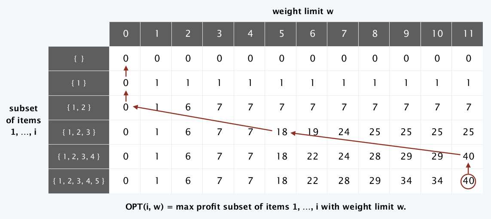

# Advanced and Distributed Algorithms - Modulo 2

## Indice

- [Dynamic Programming](#dynamic-programming)
  - [Introduzione](#introduzione)
  - [Weighted Interval Scheduling Problem](#weighted-interval-scheduling-problem)
  - [Segmented Least Squares Problem](#segmented-least-squares-problem)
  - [Knapsack Problem](#knapsack-problem)
  - [RNA Secondary Stucture](#rna-secondary-stucture-problem)
  - [Pole Cutting Problem](#pole-cutting-problem)
  - [Matrix Chain Parentesizathion](#matrix-chain-parenthesization)
  - 
  - 
  - [Optimal Binary Search Tree](#Optimal-Binary-Search-Tree)
  - [String Similarity](#String-Similarity)
  - [Hirschberg's Algorithm](#Hirschbergs-Algorithm)
- [Network Flow](#Network-Flow)
  - [Max-Flow and Min-Cut Problems](#Max-Flow-and-Min-Cut-Problems)
  - [Capacity Scaling Algorithm](#Capacity-Scaling-Algorithm)
  - [Ford-Fulkerson pathological example](#Ford-Fulkerson-pathological-example)
  - [Matching su Grafi Bipartiti](#Matching-su-Grafi-Bipartiti)
  - [Disjoint Paths](#Disjoint-Paths)
  - [Network Connectivity](#Network-Connectivity)


<hr>

# Dynamic Programming

### Introduzione
Dopo aver visto tecniche di design per vari tipi algoritmi (ad esempio Ricerca, Ordinamento ecc...) quali: 
- **Greedy** in cui si costruisce una soluzione in modo incrementale, ottimizzando ciecamente alcuni criteri locali.
- **Divide et Impera** nella quale si suddivide un problema in sottoproblemi indipendenti, si risolve ogni sottoproblema e ne si combina la soluzione con gli altri sottoproblemi per formare la soluzione al problema originale,

è possibile introdurre una tecnica più potente ma anche più complessa da applicare: la **Programmazione Dinamica** (Dynamic Programming). L'idea su cui si fonda è simile alla tecnica **Divide et Impera** ed è essenzialmente l'opposto di una strategia **Greedy**. In sostanza si esplora implicitamente tutto lo spazio delle soluzioni e lo si decompone in una serie di **sotto-problemi**, grazie ai quali si costruiscono le soluzioni per **sotto-problemi sempre più grandi** finché non si raggiunge il **problema di partenza**.

Una tecnica di programmazione dinamica è quella della `Memoization`, che è utile per risolvere una moltitudine di problemi. In sostanza, nella programmazione dinamica si verifica spesso la situazione in cui lo stesso sotto-problema deve essere risolto più volte, per questo motivo i risultati intermedi (le soluzioni a questi sotto-problemi) vengono salvati in una struttura dati (utilizzata come cache) e riutilizzati ogni qualvolta si presenta un sottoproblema già risolto. In questo modo, lo stesso sotto-problema non viene risolto/computato più volte ma soltanto una, diminuendo di molto il costo computazionale (in tempo) dell'algoritmo al prezzo di un costo in spazio (per salvare le soluzioni ai sotto-problemi risolti).

Per applicare la programmazione dinamica è necessario creare un *sotto-set* di problemi che soddisfano le seguenti proprietà:
1. Esiste solo un **numero polinomiale di sotto-problemi**
2. La soluzione al problema originale può essere calcolata **facilmente dalla soluzione dei sotto-problemi**
3. C'è un **ordinamento naturale dei sotto-problemi** dal più piccolo al più grande, insieme a una ricorsione facilmente calcolabile

Qui di seguito verranno descritti i principali problemi e algoritmi di risoluzione nell'ambito della programmazione dinamica.

#### **Recap**:
- Programmazione Dinamica
  - Risolve un problema combinando sottoproblemi
  - I sottoproblemi vengono risolti al massimo una volta, memorizza le soluzioni nella tabella
  - Se un problema presenta una sottostruttura ottimale, la programmazione dinamica è spesso la scelta giusta
  - Gli approcci Top-Down e Bottom-Up hanno lo stesso runtime

<hr>

## Weighted Interval Scheduling Problem

Abbiamo visto che un algoritmo **greedy** produce una soluzione ottimale per l'Interval Scheduling Problem, in cui l'obiettivo è accettare un insieme di intervalli non sovrapposti il più ampio possibile. **Il Weighted Interval Scheduling Problem** è una versione più **generale**, in cui ogni intervallo ha un certo valore (o peso), e vogliamo accettare un insieme di valore massimo.

Questo problema ha l'obiettivo di ottenere un insieme (il più grande possibile) di intervalli non sovrapposti (overlapping). Per la versione non pesata (Interval Scheduling Problem in cui weight=1) esiste uno specifico algoritmo **Greedy** che è in grado di trovare la soluzione ottima, tuttavia nella versione più generale, ovvero la versione pesata (**il Weighted Interval Scheduling Problem**, weight $\neq$ 1) è necessario utilizzare la programmazione dinamica.

### **Descrizione del problema**
- $n$: un intero che rappresenta l'indice dell'intervallo (job)
- $s_i$: tempo di inizio dell'intervallo $i$
- $f_i$: tempo di fine dell'intervallo $i$
- $v_i$: peso dell'intervallo $i$
- Due job sono **compatibili** se non si sovrappongono.
- $p(j)$: ritorna l'indice più grande $i$, con $i < j$, del primo intervallo compatibile con l'intervallo $j$, considerando il fatto che gli intervalli sono ordinati in ordine non decrescente in base a $f_i$
- $\mathcal{O}_j$: rappresenta la soluzione ottima al problema calcolato sull'insieme $\{1, \ldots, j\}$
- $OPT(j)$: rappresenta il valore della soluzione ottima $\mathcal{O}_j$

#### **Goal**:
- L'obiettivo del problema attuale è quello di trovare un sottoinsieme $S \subseteq \{1, \ldots, n\}$ di intervalli mutualmente compatibili che vanno a massimizzare la somma dei pesi degli intervalli selezionati $\sum_{i \in S} v_i$.

#### Greedy Version - *Earliest Finish Time First*
Considero i job in ordine non decrescente di $f_j$, aggiungo un job alla soluzione se è compatibile con il precedente.

È corretto se i pesi sono tutti 1, ma **fallisce** clamorosamente nella versione pesata.

### Dynamic Version

Come prima cosa definiamo il metodo per calcolare $OPT(j)$. Il problema è una ***scelta binaria*** che va a decidere se il job di indice $j$ verrà **incluso** nella soluzione **oppure no**, basandosi sul valore ritornato dalla seguente formula (si considerano sempre i job in ordine non decrescente rispetto a $f_i$):

$$
OPT(j) = max(v_j + OPT(p(j)), \ \ OPT(j-1))
$$

Questo può essere anche visto come una disequazione:

$$
v_j + OPT(p(j)) \geq OPT(j-1)
$$

che **se vera**, includerà $j$ nella soluzione ottimale.

### **Brute Force**
Scrivendo tutto sotto forma di algoritmo ricorsivo avremmo che:
```javascript
Input: n, s[1..n], f[1..n], v[1..n]
Sort jobs by finish time so that f[1] ≤ f[2] ≤ ... ≤ f[n]. 
Compute p[1], p[2], ..., p[n].

function Compute-Opt(j){
    if (j == 0)
        return 0
    else
        return max(vj+Compute-Opt(p(j)), Compute-Opt(j − 1))
}
```
Costruendo l'albero della ricorsione dell'algoritmo si nota che la complessità temporale è **esponenziale**. Questo perchè seguendo questo approccio, venogno calcolati più volte gli stessi sottoproblemi, i quali si espandono come un albero binario. Il numero di chiamate ricorsive cresce come la **sequenza di fibonacci**.


Una soluzione è quella di utilizzare la tecnica della **Memoization** che evita di ricalcolare $OPT$ per gli indici già calcolati precedentemente, rendendo così il costo temporale uguale ad $O(n)$.

### Memoization

```pseudocode
Input: n, s[1..n], f[1..n], v[1..n]
Sort jobs by finish time so that f[1] ≤ f[2] ≤ ... ≤ f[n]. 
Compute p[1], p[2], ..., p[n].

for j = 1 to n 
	M[j] ← empty.
M[0] ← 0.

M-Compute-Opt(j)
  if M[j] is empty
  	M[j] ← max(v[j] + M-Compute-Opt(p[j]), M-Compute-Opt(j – 1)) 
  return M[j]
```

Costruisco una matrice dove salvo i risultati dei sottoproblemi. Quando devo accedere ad un sottoproblema, prima di ricalcolarlo, controllo se è presente nella matrice.

Costo computazionale = $O(n\log{n})$:

- Sort: $O(n\log{n})$
- Computazione di p[i]: $O(n\log{n})$
- M-Compute-Opt( j ): $O(1)$ ogni iterazione, al massimo $2n$ ricorsioni = $O(n)$

Se i job sono già ordinati = $O(n)$

### Finding a solution
Oltre al valore della soluzione ottimale probabilmente vorremmo sapere anche quali sono gli intervalli che la compongono, e intuitivamente verrebbe da creare un array aggiuntivo in cui verranno aggiunti gli indici degli intervalli ottenuti con `M-Compute-Opt`. Tuttavia questo aggiungerebbe una complessità temporale di $O(n)$ peggiorando notevolmente le prestazioni. Un'alternativa è quella di recuperare le soluzioni dai valori salvati nell'array `M` dopo che la soluzione ottimale è stata calcolata. Per farlo possiamo sfruttare la formula vista in precedenza $v_j + OPT(p(j)) \geq OPT(j-1)$, che ci permette di rintracciare gli intervalli della soluzione ottima.

```pseudocode
Find-Solution(j)
  if j = 0
  	return ∅
  else if (v[j] + M[p[j]] > M[j–1])
  	return { j } ∪ Find-Solution(p[j]) 
  else
  	return Find-Solution(j–1)
```

Numero di chiamate ricorsive $\leq n = O(n)$ 

### Bottom-Up (iterative way)
Usiamo ora l'algoritmo per il Weighted Interval Scheduling Problem sviluppato nella sezione precedente per riassumere i principi di base della programmazione dinamica, e anche per offrire una prospettiva diversa che sarà fondamentale per il resto delle spiegazioni: ***iterare su sottoproblemi, piuttosto che calcolare soluzioni in modo ricorsivo***.

Nella sezione precedente, abbiamo sviluppato una soluzione in tempo polinomiale al problema, progettando: prima un **algoritmo ricorsivo in tempo esponenziale** e poi **convertendolo (tramite memoization) in un algoritmo ricorsivo efficiente** che consultava un array globale M di soluzioni ottimali per sottoproblemi. Per capire davvero i concetti della programmazione dinamica, è utile formulare una versione essenzialmente equivalente dell'algoritmo. **È questa nuova formulazione che cattura in modo più esplicito l'essenza della tecnica di programmazione dinamica e servirà come modello generale per gli algoritmi che svilupperemo nelle sezioni successive**.

```pseudocode
Sort jobs by finish time so that f1 ≤ f2 ≤ ... ≤ fn. 
Compute p(1), p(2), ..., p(n).

M[0] ← 0
for j = 1 TO n
	M[j] ← max { vj + M[p(j)], M[j–1] }
```
Questo approccio fornisce un secondo algoritmo efficiente per risolvere il problema dell'Interval Weighted Scheduling. I due approcci (**iterativo e ricorsione con memoization**) hanno chiaramente una grande quantità di sovrapposizioni concettuali, poiché entrambi crescono dall'intuizione contenuta nella ricorrenza per `OPT`. Per il resto del capitolo, svilupperemo algoritmi di programmazione dinamica usando il secondo tipo di approccio (costruzione iterativa di sottoproblemi) perché gli algoritmi sono spesso più semplici da esprimere in questo modo.

### Riepilogo
- $OPT[j] = max\{ v_j + OPT[p_j], OPT[j-1] \}$
- Per ogni $j$ scelgo se prenderlo o meno
- Alcuni sottoproblemi vengono scartati (quelli che si sovrappongono al $j$ scelto)
- Per ogni scelta ho due possibilità **TEMPO =** $O(n \log n)$
- Lo spazio è un vettore di $OPT[j]$ **SPAZIO =** $O(n)$
- Per ricostruire la soluzione uso un vettore dove per ogni $j$ ho un valore booleano che indica se il job fa parte della soluzione **SPAZIO_S =** $O(n)$

<hr>

## Segmented Least Squares Problem

### Linear Least Square
Nel capitolo precedente la risoluzione al problema Wheighted Interval Scheduling richiedeva una ricorsione basata su scelte ***binarie***, in questo capitolo invece introdurremo un algoritmo che richiede ad ***ogni step un numero di scelte polinomiali*** (_multi-way choice_). Vedremo come la programmazione dinamica si  presta molto bene a risolvere anche questo tipo di problemi.

### **Descrizione del Problema**
> Dato un insieme $P$ composto di $n$ punti sul piano denotati con $(x_1, y_1), (x_2, y_2), \ldots, (x_n, y_n)$ e supponiamo che $x_1 < x_2 < \ldots < x_n$ (sono strettamente crescenti). Data una linea $L$ definita dall'equazione $y = ax + b$, definiamo l'_errore_ di $L$ in funzione di $P$ come la somma delle distanze al quadrato della linea rispetto ai punti in $P$.
>
> Formalmente:
> $$Error(L, P) = \sum_{i=1}^{n} (y_i - ax_i - b)^2$$


#### **Goal**:
- Il goal dell'algoritmo è quello di ***cercare la linea con errore minimo***, che può essere facilmente trovata utilizzando l'analisi matematica.

La linea di errore minimo è $y = ax + b$ dove:

$$
    a = \frac{n \sum_{i} x_i y_i - (\sum_{i} x_i) (\sum_{i} y_i)}{n \sum_{i} x_i^2 - (\sum_{i} x_i)^2} \ \ \  \ \ b = \frac{\sum_{i} y_i - a \sum_{i} x_i}{n} 
$$

### Segmented Least Squares

Le formule appena citate sono utilizzabili solo se i punti di $P$ hanno un andamento che è abbastanza lineare ma falliscono in altre circostanze.


Come è evidente dalla figura non è possibile trovare una linea che approssimi in maniera soddisfacente i punti, dunque per risolvere il problema possiamo pensare di rilassare la condizione che sia solo una la linea. Questo però implica dover riformulare il goal che altrimenti risulterebbe banale (si fanno $n$ linee  che passano per ogni punto).

#### **Goal**:
- Formalmente, il problema è espresso come segue:
  > Come prima abbiamo un set di punti $P = \{(x_1, y_1), (x_2, y_2), \ldots, (x_n, y_n)\}$ strettamente crescenti.
  > Denoteremo l'insieme dei punti $(x_i, y_i)$ con $p_i$.
  > Vogliamo partizionare $P$ in un qualche numero di segmenti, ogni numero di segmenti è un sottoinsieme di $P$ che rappresenta un _set_ contiguo delle coordinate $x$ con la forma $\{p_i, p_{i+1}, \ldots, p_{j-1}, p_j\}$ per degli indici $i \leq j$.
  > Dopodiché, per ogni segmento $S$ calcoliamo la linea che minimizza l'errore rispetto ai punti in $S$ secondo quanto espresso dalle formule enunciate prima.

Definiamo infine una **penalità** per una data partizione come la somma dei seguenti termini:
- Numero di segmenti in cui viene partizionato $P$ moltiplicato per un valore $C > 0$ (più è grande e più penalizza tante partizioni)
- Per ogni segmento l'errore della linea ottima attraverso quel segmento.

$$f(x) = E + C L$$

Il goal del Segmented Least Square Problem è quindi quello di **trovare la partizione di penalità minima**. 

### Funzionamento
Seguendo la logica alla base della programmazione dinamica, ci poniamo l'obiettivo di suddividere il problema in sotto-problemi e, per farlo, partiamo dall'osservazione che l'ultimo punto appartiene ad una partizione ottima che parte da un valore $p_i$ fino a $p_n$ e che possiamo togliere questi punti dal totale per ottenete un sotto-problema più piccolo. <br>
Supponiamo che la soluzione ottima sia denotata da `OPT(j)`, per i punti che vanno da $p_1$ a $p_j$, allora avremo che la soluzione ottima al problema dato l'ultimo segmento che va da $p_i$ a $p_n$, sarà dalla seguente formula:

$$
    OPT(n) = e_{i,n} + C + OPT(i - 1)
$$

Questa formula è data dalla soluzione ottima dell'ultima partizione ( $e_{i,n} + C$ ) a cui viene aggiunta la soluzione ottima di tutte le partizioni precedenti ( $OPT(i -1)$ ).

Per i sotto-problemi possiamo scrivere la soluzione al problema in forma ricorsiva utilizzando la formula appena espressa che prenderà la forma:

$$
    OPT(j) = \min_{1 \leq i \leq j}(e_{i,j} + C + OPT(i - 1))
$$

***N.B.*** : $OPT(j) = 0$ if $j=0$


$e(i,j)$ = somma degli errori quadrati per i punti $p_i, p_{i+1},..., p_j$

```javascript
function Segmented-Least-Squares(n) {
    M[0 ... n]
    M[0] = 0
    
    // compute the errors
    for (j in 1 ... n) {
        for (i in 1 ... j) {
            compute eij for the segment pi, ..., pj
        }
    }

    // find optimal value
    for (j in 1 ... n) {
        M[j] = min_i(eij + C + M[i - 1]) // OPT(J)
    }

    return M[n]
}
```

Dopo aver trovato la soluzione ottima, possiamo sfruttare la **memoization** per ricavarci i segmenti in tempi brevi.

```javascript
function Find-Segments(j) {
    if (j == 0) 
        print('')
    else {
        Find an i that minimizes ei,j + C + M[i − 1]
        Output the segment {pi,..., pj} and the result of Find-Segments(i − 1)
    }
}
```

### Costo
La parte che computa gli errori ha costo in tempo $O(n^3)$. La parte che trova il valore ottimo ha costo in tempo $O(n^2)$.

In spazio l'algoritmo ha costo $O(n^2)$ ma può essere ridotto a $O(n)$.

Quindi:
- L'algoritmo ha costo $O(n^3)$ in tempo e $O(n^2)$ in spazio. Il collo di bottiglia è la computazione di $e(i, j)$. $O(n^2)$ per punto per $O(n)$ punti.
- Questo tempo può essere ridotto applicando la `memoization` alle formule per il calcolo dell'errore viste in precedenza portandolo a $O(n^2)$ per il tempo e $O(n)$ per lo spazio.

### Riepilogo
- Trovare il numero di segmenti su un piano cartesiamo per minimizzare i quadrati degli errori
- $OPT[j] = min_{1 \le i \le j } \{ OPT[i-1] + e(i,j) + C \}$
  - $C$: il costo da pagare per ogni segmento
  - $e$: il costo degli errori
- Risolvo n problemi **SPAZIO =** $O(n)$
- Per ogni problema ho n scelte ( $O(n^2)$ ) ma per computare $e(i,j)$ **TEMPO =** $O(n^3)$
- Per ricostruire la soluzione salvo un vettore dove $S[j] = min_i$ **SPAZIO** = $O(n)$

<hr>

## Knapsack Problem

### Descrizione del problema
Il **Problema dello Zaino** (o *Subset Sum*) è formalmente definito come segue:

> Ci sono $n$ oggetti $\{1, \ldots, n\}$, a ognuno viene assegnato un peso non negativo $w_i$ (per $i = 1, \ldots, n$ ) e viene dato anche un limite $W$ (capienza dello zaino). 
> L'obbiettivo è quello di selezionare un sottoinsieme $S$ degli oggetti tale che $\sum_{i \in S}w_i \leq W$ e che questa sommatoria abbia valore più grande possibile.

Questo problema è un caso specifico di un problema più generale conosciuto come il Knapsack Problem, in cui l'unica differenza sta nel valore da massimizzare, che per il Knapsack è un valore $v_i$ e non più il peso.

Si potrebbe pensare di risolvere questi problemi con un algoritmo greedy ma  purtroppo non ne esiste uno in grado di trovare efficientemente la soluzione ottima. <br>
Un altro possibile approccio potrebbe essere quello di ordinare gli oggetti in base al peso in ordine crescente o decrescente e prenderli, tuttavia questo approccio fallisce per determinati casi (come per l'insieme $\{W/2+1, W/2, W/2\}$ ordinato in senso decrescente) e l'unica opzione sarà quella di provare con la programmazione dinamica.

### Goal
Possiamo riassumere il goal di questa tipologia di problemi come segue:
> Ci sono $n$ oggetti $\{1, \ldots, n\}$, a ognuno viene assegnato un peso non negativo $w_i$ (per $i = 1, \ldots, n$ ) e ci viene dato anche un  limite $W$.
> L'obbiettivo è quello di selezionare un sottoinsieme $S$ degli oggetti tale che $\sum_{i \in S}w_i \leq W$ e che questa sommatoria abbia valore più  grande possibile.

### Dynamic Version
Come per tutti gli algoritmi dinamici dobbiamo cercare dei **sotto-problemi** e possiamo utilizzare la stessa intuizione avuto per il problema dello scheduling (scelta binaria in cui un oggetto viene incluso nell'insieme o meno). Facendo tutti i calcoli di dovere, otteniamo la seguente ricorsione:
> - se $W < w_i$ allora $OPT(i, W) = OPT(i-1,W)$;
> - altrimenti $OPT(i, W) = max(OPT(i-1, W), w_i + OPT(i-1, W-w_i))$

- Nella prima parte analizziamo il caso in cui l'elemento che vogliamo aggiungere va a superare il peso massimo residuo $W$, dunque viene **scartato**. 
- Nella seconda parte andiamo ad analizzare se l'aggiunta o meno del nuovo oggetto va a migliorare la soluzione (viene quindi **selezionato**) di $OPT$ che è definita come:
  $$
      OPT(i, w) = \max_{S} \sum_{j \in S} w_j
  $$

Possiamo formalizzare il tutto con il seguente pseudo-codice:
```pseudocode
for w = 0 to W 
	M[0, w] ← 0
	
for j = 1 to n
	for w = 1 to W
		if(wj>W) 
			M[j,W]←M[j–1,W]
		else 
			M[j, W] ← max { M [j – 1, W], vj + M [j – 1, W – wj] }
return M[n,W]
```

### Costi
| Funzione        | Costo in tempo                | Costo in spazio               |
| --------------- | ----------------------------- | ----------------------------- |
| `Subset-Sum`    | $\Theta(nW)$                  | $\Theta(nW)$                  |
| `Find-Solution` | $O(n)$                        |                               |

- $O(1)$ per ogni elemento inserito nella tabella
- $\Theta(nW)$ elementi della tabella
- Dopo aver computato il valore ottimo, per trovare la soluzione completa: prendo $i$ in $OPT(i, w)$ iff $M[i, w] \gt M[i-1, w]$ 


#### Osservazioni
- La particolarità di questo algoritmo è che avremmo 2 insiemi di sotto problemi diversi che devono essere risolti per ottenere la soluzione ottima. Questo fatto si riflette in come viene popolato l'array di memoization dei valori di $OPT$ che verranno salvati in un array bidimensionale (dimensione dell'input non polinomiale, pseudopolinomiale, perchè dipende da due variabili). <br> 
- A causa del costo computazionale $O(nW)$, questo algoritmo fa parte della famiglia degli algoritmi _pseudo polinomiali_, ovvero algoritmi il cui costi dipende da una variabile di input che se piccola, lo mantiene basso e se grande lo fa esplodere. Ovvero, la versione del problema con decisione è **NP-Completo**.
- Per recuperare gli oggetti dall'array di Memoization la complessità in tempo è di $O(n)$.
- Questa implementazione funziona anche per il problema più generale del Knapsack, ci basterà solo cambiare la parte di ricorsione scrivendola come segue:
  > - se $W < w_i$ allora $OPT(i, W) = OPT(i-1,W)$,
  > - altrimenti $OPT(i, W) = max(OPT(i-1, W), v_i + OPT(i-1, W-w_i))$
- Esiste un algoritmo che trova una soluzione in tempo polinomiale entro l'1% di quella ottima.

### Riepilogo

- Scegliere gli oggetti da mettere nello zaino per massimizzare il valore, non superando il peso massimo.
- $OPT[i,w] = max\{ v_i + OPT[i-1, w-w_i], OPT[i-1,w] \}$
- **Scelgo se prendere o meno l'oggetto** $i$
- Ho bisogno di una matrice $n \times W$ ($W$ è la capacità dello zaino). problema pseudopolinomiale perchè varia in base a $W$ $\rightarrow$ **SPAZIO =** $O(nW)$
- Per riempire una cella devo solo controllare due valori $\rightarrow$ **TEMPO =** $O(nW)$
- In questo problema la matrice può essere costruita per righe o per colonne
- Per trovare $(i,w)$ leggo solo da una riga, per costrure la riga $i$ ho solo bisogno della riga $i-1$, la soluzione è in $S[n,W]$. Posso quindi trovare una soluzione utilizzando una matrice con sole due righe **SPAZIO =** $O(W)$ ma cosí non posso ricostruire la soluzione.

<hr>

## RNA Secondary Stucture Problem
La ricerca della struttura secondaria dell'RNA è un problema a 2 variabili risolvibile tramite il paradigma della programmazione dinamica. Come sappiamo il DNA è composto da due filamenti, mentre l'RNA è composto da un filamento singolo. Questo comporta che spesso le basi di un singolo filamento di RNA si accoppino tra di loro.

L'insieme della basi può essere visto come l'alfabeto  $\{A, C, U, G\}$ e l'RNA è una sequenza di simboli presi da questo alfabeto.

Il processo di accoppiamento delle basi è dettato dalla regola di _Watson-Crick_ e segue il seguente schema: 

$$
    A - U \ \ \ \text{ e } \ \ \ C - G \ \ \ \text{ (l'ordine non conta)}
$$


**RNA:** stringa $b_0b_1...b_n$ su alfabeto {A, C, G, U}

### Descrizione del Problema
In questo problema si vuole trovare la struttura secondaria dell'RNA che abbia **maggiore energia libera (ovvero il maggior numero di coppie di basi possibili)**. Per farlo dobbiamo tenere in considerazione alcune condizioni che devono essere soddisfatte per permettere di approssimare al meglio il modello biologico dell'RNA.

Formalmente la struttura secondaria di $B$ è un insieme di coppie $S = \{(i,j)\}$ dove $i,j \in \{1,2,\ldots,n\}$, che soddisfa le seguenti condizioni:

1. **No sharp turns**: la fine di ogni coppia è separata da almeno 4 basi, quindi se $(i,j) \in S$ allora $i < j - 4$
2. Gli elementi di una qualsiasi coppia $S$ consistono di $\{A, U\}$ o $\{C, G\}$ (in qualsiasi ordine).
3. $S$ è un **matching**: nessuna base compare in più di una coppia.
4. **Non crossing condition**: se $(i, j)$ e $(k,l)$ sono due coppie in $S$ allora **non può avvenire che** $i < k < j < l$.


*La figura (a) rappresenta un esempio di Sharp Turn, mentre la figura (b) mostra una Crossing Condition dove il filo blu non dovrebbe esistere.*

### Goal
Data una molecola di RNA trovare una struttura secondaria che massimizza il numero di coppie.

### Funzionamento
Per mappare il problema sul paradigma della programmazione dinamica, come prima idea, potremmo basarci sul seguente sotto-problema: 
> - Affermiamo che $OPT(j)$ è il massimo numero di coppie di basi sulla struttura secondaria $b_1 b_2 \ldots b_j$, 
> - per la Non Sharp Turn Condition sappiamo che $OPT(j) = 0$ per $j \leq 5$
> - e sappiamo anche che $OPT(n)$ è la soluzione che vogliamo trovare. 

Il problema sta nell'esprimere $OPT(j)$ ricorsivamente. Possiamo parzialmente farlo sfruttando le seguenti scelte:
1. $j$ non appartiene ad una coppia
2. $j$ si accoppia con $t$ per qualche $t \leq j - 4$

- Per il primo caso basta cercare la soluzione per $OPT(j - 1)$
- Nel secondo caso, se teniamo conto della **Non Crossing Condition**, possiamo isolare due nuovi sotto-problemi: uno sulle basi $b_1 b_2 \ldots b_{t-1}$ e l'altro sulle basi  $b_{t+1} \ldots b_{j-1}$.
  - Il primo si risolve con $OPT(t-1)$ 
  - Il secondo, dato che non inizia con indice $1$, non è nella lista dei nostri sotto-problemi. A causa di ciò risulta necessario aggiungere una variabile.


Basandoci sui ragionamenti precedenti, possiamo scrivere una ricorsione di successo, ovvero: <br>
sia $OPT(i,j)$ = massimo numero di coppie nella nella struttura secondaria $b_i b_{i+1} \ldots b_j$, grazie alla **non Sharp turn Condition** possiamo inizializzare gli  elementi con $i \geq j -4$ a $0$. Ora avremmo sempre le stesse condizioni elencate sopra:
- $j$ non appartiene ad una coppia
- $j$ si accoppia con $t$ per qualche $t \leq j - 4$

Nel primo caso avremmo che $OPT(i,j) = OPT(i, j-1)$, nel secondo caso possiamo ricorrere su due sotto-problemi $OPT(i, t-1)$ e $OPT(t+1, j-1)$ affinché venga rispettata la **non crossing condition**.

Riassumendo, distinguiamo 3 diversi casi:
1. if $i \ge j -4$:
   $OPT(i,j) = 0$ dalla **no-Sharp Turns condition**
2. $b_j$ non viene accoppiata:
   $OPT(i,j) = OPT(i,j-1)$
3. $b_j$ si accoppia con $b_t$ per una qualche $i \le t \lt j -4$:
   $OPT(i,j) = 1 + max_t\{OPT(i, t-1) + OPT(t+1, j-1)\}$

Possiamo esprimere formalmente la ricorsione come segue:
> $OPT(i, j) = \max(OPT(i, j-1), \max_t(1+OPT(i, t-1)+OPT(t+1, j-1))),$
> dove il massimo è calcolato su $t$ tale che $b_t$ e $b_j$ siano una coppia di basi consentita (sotto le condizioni (1) e (2) dalla definizione di struttura secondaria).
>

 <br>
_Iterazioni dell'algoritmo su un campione del problema in questione_ $ACCGGUAGU$

Possiamo infine formalizzare il tutto con il seguente pseudo-codice:
```pseudocode
Initialize OPT(i, j) = 0 whenever i ≥ j − 4

for k = 5 to n – 1 
	for i = 1 to n – k
		j ← i + k
		Compute M[i, j] using the previous recurrence formula
return M[1,n]
```

### Costo
Ci sono $O(n^2)$ sotto-problemi da risolvere e ognuno richiede tempo $O(n)$, quindi il running time complessivo è di $O(n^3)$.

Costo computazionale: $O(n^3)$ time e $O(n^2)$ space

### Riepilogo

- Trovare il modo di accoppiare le basi di RNA con delle regole
- $OPT[i,j] = max\{ max_{i \le t \le j-5} \{ 1 + OPT[i, t-1] + OPT[t+1, j] \}, OPT[i, j-1] \}$
- Spazio = matrice riempita per diagonali $\rightarrow$ **SPAZIO =** $O(n^2)$
- Per calcolare ogni $OPT$ pago $n$ $\rightarrow$ **TEMPO =** $O(n^3)$
- Per costruire una soluzione mi serve una matrice dove $S[i,j] = max_t$ $\rightarrow$ **SPAZIO =** $O(n^2)$

<hr>

## Pole Cutting Problem

### Descrizione del problema

Il **Problema del Taglio delle Aste (Pole Cutting)** può essere definito nel modo seguente:

> Data un'asta di lunghezza $n$ pollici e una tabella di prezzi $p_i$ per $i = 1, ..., n$, **determinare il ricavo massimo $r_n$ che si può ottenere tagliando l'asta e vendendone i pezzi**. Si noti che, se il prezzo $p_n$ di un'asta di lunghezza n è sufficientemente grande, la soluzione ottima potrebbe essere quella di non effettuare alcun taglio.

La figura qui di seguito mostra un esempio di problema Pole Cutting. <br>
 

 <br>
_La figura sopra invece, mostra tutti i modi in cui può essere tagliata un'asta lunga 4 pollici._

È importante notare che un'asta di lunghezza $n$ può essre tagliata in $2^{n-1}$ modi differenti, in quanto **si ha un'opzione indipendente di tagliare o non tagliare**, alla distanza di $i$ pollici dall'estremità sinistra, per $i = 1, 2, ..., n-1$.

Se una **soluzione ottima** prevede il taglio dell'asta in $k$ pezzi, per $1 \le k \le n$, allora una **decomposizione ottima** $n = i_1 + i_2, ... + i_k$ dell'asta in pezzi di lunghezze $i_1, i_2, ..., i_k$ fornisce il ricavo massimo corrispondente $r_m = p_{i_1} + p_{i_2} + ... + p_{i_k}$

 

#### **Goal**:
Data un'asta di lunghezza $n$ pollici e una tabella di prezzi $p_i$ per $i = 1, ..., n$, **determinare il ricavo massimo $r_n$ che si può ottenere tagliando l'asta e vendendone i pezzi**.

### Funzionamento
Più in generale, posisiamo esprimere i valori $r_n$ per $n \ge 1$ in funzione dei ricavi ottimi delle aste più corte:

$$
r_n = max(p_n, r_1 + r_{n-1}, r_2 + r_{n-2}, ..., r_{n-1} + r_1)
$$

- Il primo argomento, $p_n$, corrisponde alla vendita dell'asta di lunghezza $n$ senza tagli. 
- Gli altri $n-1$ argomenti corrispondono al ricavo massimo ottenuto facendo un taglio iniziale dell'asta in due pezzi di dimensione $i$ e $n-1$, per $i = 1, 2, ..., n-1$, e poi tagliando in modo ottimale gli ulteriori pezzi, ottenendo i ricavi $r_i$ e $r_{n-1}$ da questi due pezzi.

**N.B.** Per risolvere il problema originale di dimensione $n$, risolviamo problemi più piccoli dello stesso tipo, ma di dimensioni inferiori. Una volta effettuato il primo taglio, possiamo considerare i due pezzi come istanze indipendenti del problema del taglio delle aste. Possiamo quindi dire che il problema del taglio delle aste presenta una **sottostruttura ottima**, ovvero **le soluzioni ottime di un problema incorporano le soluzioni ottime dei sottoproblemi correlati**.

Tuttavia, c'è un modo più semplice di definire una struttura ricorsiva per il problema del taglio delle aste:
> Consideriamo la decomposizione formata da un primo pezzo di lunghezza $i$ tagliato dall'estremità sinistra e dal pezzo restante di destra di lunghezza $n-i$. **Soltanto il pezzo restante di destra (non il primo pezzo) potrà essere ulteriormente tagliato**. Possiamo vedere ciascuna decomposizione di un'asta di lunghezza $n$ in questo modo:
> **un primo pezzo seguito da un'eventuale decomposizione del pezzo restante**. 
> Così facendo, possiamo esprimere la soluzione senza alcun taglio dicendo che il primo pezzo ha dimensione $i = n$ e ricavo $p_n$ e che il pezzo restante ha dimensione 0 con ricavo $r_0 = 0$.

Otteniamo così la seguente **versione semplificata dell'equazione:**

$$
r_n = max(o_i + r_{n-1})
$$

Secondo questa formulazione, **una soluzione ottima incorpora la soluzione di un solo sottoproblema** (il pezzo restante) anzichè due.

### Algorimto ricorsivo TOP-down
`Algorithm Cut-Pole(p, n)`
```pseudocode
Require: Integer n, Array p of length n with prices
if n == 0 then
  return 0

q ← −∞

for i = 1 . . . n do
  q ← max{q, p[i] + Cut-Pole(p, n − i)}

return q
```
#### Costo:
Perchè questo algoritmo è così **inefficiente**? Il problema è che la procedura `CUT-Pole` chiama più e più volte sè stessa in modo ricorsivo con gli stessi valori dei parametri, ovverro **risolve ripetutamente gli stessi sottoproblemi**.

 

$$
T(n) = 1 + \sum^{n-1}_{j=0}T(j)
$$

$$
T(n) = 2^n
$$

**N.B.** `CUT-Pole` è esponenziale in $n$.

La procedura cut-rod considera esplicitamente tutti i $2^{n-1}$ modi possibili di tagliare un'asta di lunghezza $n$. L'albero delle chiamate ricorsive ha $2^{n-1}$ foglie, una per ogni modo possibile di tagliare l'asta.

### Applicare la Programmazione Dinamica al taglio delle aste
L'idea è quella di applicare i concetti fondamentali della programmazione dinamica: <br>
*Se avremo bisogno di nuovo della soluzione di questo sottoproblema, potremo riaverla immediatamente **senza bisogno di ricalcolarla***. <br>
Come sappiamo per i problemi risolti precedentemente: <br>
La programmazione dinamica richiede una memoria extra per ridurre il tempo di esecuzione (**compromesso tempo-memoria**). 

Il risparmio di tempo ottenibile può essere notevole: **una soluzione con tempo esponenziale può essere trasformata in una soluzione con tempo polinomiale**:
- Un metodo di programmazione dinamica viene eseguito in **tempo polinomiale** quando il numero di sottoproblemi distinti richiesti è **polinomiale nbella dimensione dell'input** e cuascun sottoproblema può essere risolto in un tempo polinomiale.

Come già visto per la risoluzione degli altri problemi, ci sono due modi equivalenti:
- **Metodo Top-Down con Memoization**: In questo approccio si scrive la procedura ricorsiva in modo naturale, modificandola per salvare il risultato di ciascun sottoproblema. La procedura prima veriffica se ha risoltoprecedentemente questo problema. In caso affermativo, restituisce il valore salvato, risparmiando gli ulteriori calcoli a quel livello; altrimenti la procedura calcola il valore nel modo usuale.
- **Metodo Bottom-Up**: Ordiniamo i sottoproblemi per dimensione e poi li risolviamo ordinatamente a partire dal più piccolo. Quando risolviamo un particolare sottoproblema, abbiamo già risolto tutti i sottoproblemi più piccoli da cui dipende la sua soluzione.

Questi due approcci generano ***algoritmo con lo stesso tempo di esecuzione asintotico***. L'approccio **Bottom-Up** spesso ha fattori costanti molto migliori, in quanto ha **meno costi per le chiamate di procedura**.

### Top-down Approach
#### `Algorithm Memoized-Cut-Pole(p, n)`
```pseudocode
Require: Integer n, Array p of length n with prices

Let r [0 . . . n] be a new array

for i = 0 . . . n do
  r [i] ← −∞

return Memoized-Cut-Pole-Aux(p, n, r )
```

#### `Algorithm Memoized-Cut-Pole-Aux(p, n, r )`
```pseudocode
Require: Integer n, array p of length n with prices, array r of revenues

if r [n] ≥ 0 then
  return r[n]

if n = 0 then
  q ← 0
else
  q ← −∞
  for i = 1 . . . n do
    q ← max{q, p[i] + Memoized-Cut-Pole-Aux(p, n − i, r )}
  r [n] ← q

return q
```

- Preparare una tabella `r` di dimensione $n$
- Inizializza tutti gli elementi di `r` con $-\infty$
- Il lavoro effettivo viene svolto in `Memoized-Cut-Pole-Aux`, la tabella `r` viene passata a `Memoized-Cut-Pole-Aux`

Observe: If r [n] ≥ 0 then r [n] has been computed previously

**Osserva**: Se `r[n] ≥ 0` allora `r[n]` **è stato calcolato in precedenza**

### Bottom-up Approach
#### `Algorithm Bottom-Up-Cut-Pole(p, n)`
```pseudocode
Require: Integer n, array p of length n with prices
Let r[0 . . . n] be a new array
r[0] ← 0

for j = 1 . . . n do
  q ← −∞
  for i = 1 . . . j do
    q ← max{q, p[i] + r[j − i]}
  r[j] ← q

return r[n]
```

### Costi
Il tempo di esecuzione della procedura bottom up è $O(n^2)$, a causa della doppia struttura annidata del suo ciclo.

$$
\sum^n_{j=1} \sum^j_{i=1} O(1) = O(1) \sum^n_{j=1} \sum^j_{i=1} 1 = O(1) \sum^n_{j=1} j = O(1) \frac{n(n+1)}{2} = O(n^2)
$$

Anche il tempo di esecuzione della sua **controparte Top-Dow**n è $O(n^2)$, sebbene questo tempo di esecuzione sia un pò più difficile da spiegare. Poichè **una chiamata ricorsiva per risolvere un sottoproblema precedentemente risolto termina immediatamente**.

### Riepilogo
- Massimizzare il reward in base ai tagli
- Tempo di esecuzione dell'approccio Top-Down $O(n^2)$
   - devo calcolare OPT per ogni n, per ognuno pago n **TEMPO =** $O(n^2)$
- $OPT[j] = max_{i \le l \le j} \{ OPT[j-l] + p_l \}$
- salvo i dati in un vettore che contiene OPT dei vari segmenti **SPAZIO =** $O(n)$
- per ricostruire la soluzione uso un vettore dove $S[j] = max_l$ **SPAZIO_S =** $O(n)$

<hr>

## Matrix Chain Parenthesization

### Descrizione del problema
Data una sequenza di $n$ matrici $A_1, A_2, ..., A_n$, vogliamo calcolare il prodotto $A_1A_2...A_n$.

Possiamo calcolare quest'ultimo utilizzando come subroutine l'algoritmo standard per moltiplicare una coppia di matrici, dopo che abbiamo posto le opportune parentesi per eliminare qualsiasi ambiguità sul modo in cui devono essere moltiplicate le matrici. 
La moltiplicazione delle matrici è associativa, quindi **tutte le parentesizzazioni forniscono lo stesso prodotto**.

**DEF**: _Un prodotto di matrici è **completamente parentesizzato** se è una singola matrice oppure è il prodotto, racchiuso tra parentesi di due prodotti di matrici completamente parentesizzati_. 
Per esempio, se la sequenza delle matrici è $A_1, A_2, A_3, A_4$, il prodotto $A_1 A_2 A_3 A_4$ può essere parentesizzato in cinqui modi distinti:
- $(A_1 (A_2 (A_3 A_4)))$
- $(A_1 ((A_2 A_3) A_4))$
- $((A_1 A_2 )(A_3 A_4))$
- $((A_1 (A_2 A_3 ))A_4)$
- $(((A_1 A_2) A_3 )A_4)$

Il modo in cui parentesizziamo una sequenza di matrici può avere un impatto notevole sul costo per calcolare il prodotto.

L'algoritmo standard di moltiplicazioni tra matrici è dato dal seguente pseudocodice:
#### `Algorithm Matrix-Multiply(A, B)`
```pseudocode
Require: Matrices A, B with A.columns = B.rows

Let C be a new A.rows × B.columns matrix

for i ← 1 . . . A.rows do
  for j ← 1 . . . B.columns do
    Cij ← 0
    for k ← 1 . . . A.columns do
      Cij ← Cij + Aik · Bkj

return C
```

#### **Costo**:
- Tre cicli nidificati: $O(A.righe · B.colonne · A.colonne)$
- Numero di moltiplicazioni: *A.righe · B.colonne · A.colonne*
- Moltiplicazione di due matrici $n x n$: runtime $O(n^3)$

**N.B.**:
- Possiamo moltiplicare due matrici soltanto se sono **compatibili**: il numero di colonne di $A$ deve essere uguale al numero di righe di $B$.
- Se $A$ è una matrice $p$ x $q$ e $B$ è una matrice $q$ x $r$, la matrice risultante $C$ è una matrice $p$ x $r$

Il tempo per calcolare $C$ è dato dal numero di prodotti scalari, che è $p \cdot q \cdot r$ (riga 8 dell'algoritmo).

Per mostrare come il costo per moltiplicare le matrici dipenda dallo schema di parentesizzazione, consideriamo il problema di moltiplicare una sequenza di tre matrici $A_1, A_2, A_3$. Supponiamo che le dimensioni siano rispettivamente `10 x 100`, `100 x 5`, `5 x 50`. Se moltiplichiamo secondo lo schema di parentesizzazione $((A_1 A_2 )A_3)$ eseguiamo `10 x 100 x 5 = 5000` prodotti scalari per calcolare la matrice `10 x 5` risultante dal prodottto $A_1 A_2$, più altri `10 x 5 x 50 = 2500` prodotti scalari per moltiplicare questa matrice per $A_3$, per un totale di 7500 prodotti scalari.
Se invece moltiplichiamo secondo lo schema di parentesizzazione $(A_1 (A_2 A_3))$ eseguiamo `100 x 5 x 50 = 25000` prodotti scalari per calcolare la matrice `100 x 50` risultante dal prodottto $A_2 A_3$, più altri `10 x 100 x 50 = 50000` prodotti scalari per moltiplicare questa matrice per $A_1$, per un totale di 75000 prodotti scalari.
Quindi il calcolo della moltiplicazione delle matrici è 10 volte più rapido con il primo schema di parentesizzazioni.

Il **problema della parentesizzazione tra matrici** può essere descritto in questo modo:
> Data una sequenza di $n$ matrici $A_1, A_2, ..., A_n$, dove la matrice $A_i$ ha dimensioni $p_{i-1}$ x $p_i$ per $i = 1,2,...,n$, determinare lo schema di parentesizzazione completa del prodotto $A_1A_2...A_n$ che minimizza il numero di prodotti scalari.

#### **Goal**:
È importante notare che, nel problema della moltiplicazione di una sequenza di matrici, **non vengono effettivamente moltiplicate le matrici**. Il nostro **obiettivo è soltanto quello di determinare un ordine di moltiplicazione delle matrici che ha il costo minimo**. 
Tipicamente, il tempo impiegato per determinare quest'ordine ottimo è più che ripagato dal tempo risparmiato successivamente per eseguire effettivamente i prodotti delle matrici (per esempio, eseguire soltanto 7500 prodotti, anzichè 75000).

Vogliamo tuttavia dimostrare che un controllo esaustivo di tutti i possibili schemi di parentesizzazione non ci consente di ottenere un algoritmo effciente. 
Indichiamo con $P(n)$ il numero di parentesizzazioni alternative di una sequenza di $n$ matrici. 
- Quando $n=1$, c'è una sola matrice e, quindi un solo schema di parentesizzazione. 
- Quando $n \ge 2$, un prodotto di matrici completamente parentesizzato è il prodotto di due sottoprodotti di matrici completamente parentesizzati e la suddivisione fra i due sottoprodotti può avvenire fra la k-esima e ka (k+1)-esima matrice per qualsiasi k=1,2,...,n-1.

Quindi otteniamo la seguente riccorenza


1, 1, 2, 5, 14, 42, 132, 429, 1430, 4862, 16796, 58786, 208012, 742900, . . .

- Si può dimostrare che ci sono $\Omega(2^n)$ combinazioni
- Un algoritmo efficiente quindi non può provare tutte le possibili combinazioni

### Applicare la programmazione dinamica
Seguiremo un procedimento di quattro fasi (classico della programmazione dinamica):
1. Caratterizzare la struttura di una soluzione ottima
2. Definire in modo ricorsivo il valore di una soluzione ottima
3. Calcolare il valore di una soluzione ottima
4. Costruire una soluzione ottima dalle informazioni calcolate

#### 1. Struttra di una parentesizzazione ottima
Per comodità adottiamo la notazione $A_{i..j}$ dove $i \le j$, per la matrice che si ottiene calcolando il prodotto $A_i A_{i+1} ... A_j$. Notate che, se il problema non è banale, cioè $i < j$, allora qualsiasi parentesizzazione del prodotto $A_i A_{i+1} ... A_j$ deve suddividere il prodotto fra $A_k$ e $A_{k+1}$ per qualche intero $k$ nell'intervallo $i \le k < j$, ovvero:
- per qualche valore di $k$, prima calcoliamo le matrici $A_{i..k}$ e $A_{k+1..j}$ 
- e, poi, le moltiplichiamo per ottenere il prodotto finale $A_{i..j}$. 

Il costo di questa parentesizzazione è, quindi, il costo per calcolare la matrice $A_{i..k}$, più il costo per calcolare la matrice $A_{k+1..j}$, più il costo per per moltiplicare queste due matrici.

##### **Defininizione della sottostruttura**:
> Supponiamo che una parentesizzazione ottima $A_i A_{i+1} ... A_j$ suddivida il prodotto fra $A_k$ e $A_{k+1}$. Allora la parentesizzazione ottima di $A_i A_{i+1} ... A_j$ deve essere una parentesizzazione ottima di  $A_i A_{i+1} ... A_k$.

**Possiamo quindi costruire una soluzione ottima di un'istanza del problema della moltiplicazione di una sequenza di matrici suddividendo il problema in due sottoproblemi** (quelli della parentesizzazione ottima  $A_i A_{i+1} ... A_k$ e  $A_{k+1} A_{k+2} ... A_j$  ), trovando le soluzioni ottime delle istanze dei sottoproblemi e, infine, **combinando** **le soluzioni ottime dei sottoproblemi**.

#### 2. Soluzione in modo ricorsivo
Scegliamo come sottoproblemi i problemi per determinare il costo minimo di una parentesizzazione $A_i A_{i+1} ... A_j$ per $1 \le i \le j \le n$.
Sia `m[i,j]` il numero minimo di prodotti scalari richiesti per calcolare la matrice $A_{i..j}$; per il problema principale, il costo del metodo più economico per calcolare $A_{1..n}$ sarà quindi `m[1,n]`.
Possimao definire `m[i,j]` ricorsivamente in questo modo:
- Se $i = j$, il problema è banale; la sequenza è formata da una matrice $A_{i..i} = A_i$, quindi non occorre eseguire alcun prodotto scalare. Allora `m[i,i]` = 0 per $i=1,2,...,n$. 
- Per calcolare `m[i,j]` quando $i < j$, sfruttiamo la struttura di una soluzione ottima ottenuta nella [fase 1](#1-struttra-di-una-parentesizzazione-ottima). Supponiamo che la parentesizzazio ottima suddivida il prodotto $A_i A_{i+1} ... A_j$ fra $A_k$ e $A_{k+1}$, dove $i \le k < j$. Quindi `m[i,j]` è uguale al costo minimo per calcolare i sottoprodotti  $A_{i..k}$ e  $A_{k+1..j}$, più il costo per moltiplicare queste due matrici. Ricordando che ogni matrice $A_i$ è $p_{i-1}$ x $p_i$, il calcolo del prodotto delle matrici $A_{i..k} A_{k+1..j}$ richiede $p_{i-1} p_k  p_j$ prodotti scalari. Quindi otteniamo:
$m[i,j] = m[i,k] + m[k+1,j] + p_{i-1} p_k p_j$

Questa equazione ricorsiva supppone che sia noto il valore di $k$, che invece non conosciamo. Notiamo tuttavia, che ci sono soltanto $j-i$ valori possibili per $k$, ovvero $k=i, i+1, ..., j-1$. 
Poichè la parentesizzazione ottima deve utilizzare uno di questi valori di $k$, dobbiamo semplicemente controllarli tutti per trovare il migliore. Quindi, la nostra definizione ricorsiva per il costo minimo di una parentesizzazione del prodotto $A_i A_{i+1} ... A_j$ diventa


I valori `m[i, j]` sono i costi delle soluzioni ottime dei sottoproblemi, ma essi non ci forniscono tutte le informazioni necessarie a ricostruire la soluzione ottima. Per poterlo fare definiamo `s[i,j]` come il valore $k$ in cui è stato suddiviso il prodotto $A_{i} A_{i+1j} ... A_j$ per ottenere una parentesizzazione otttima. Ovvero, `s[i,j]` è uguale a un valore $k$ tale che $m[i,j] = m[i,k] + m[k+1,j] + p_{i-1} p_k p_j$

#### 3. Calcolo dei costi ottimi
Osserviamo che ci sono relativamente pochi problemi distinti: un problema per ogni possibile scelta di $i$ e $j$, con $1 \le i \le j \le n$ per un totale di  $O(n^2)$. Un algoritmo ricorsivo può incontrare ciascun sottoproblema più volte nelle varie diramazioni del suo albero di ricorsione. **Questa proprietà dei sottoproblemi che si ripresentano è la seconda cartatteristica peculiare dell'applicabilità della programmazione dinamica** (la prima è la sottostruttura ottima).

Anzichè calcolare la soluzione della ricorrenza ricorsivamente, calcoliamo il costo ottimale applicando un metodo tabulare Bottom-Up. 
Implementiamo quest'ultimo con la procedura `Matrix-Chain-Order` riportata qui di seguito. Questa procedura assume che la matrice $A_i$ abbia dimensione $p_{i-1}$ x $p_i$ per $i=1,2,...n$. L'input è una sequenza $p = p_o, p_1, ..., p_n$, dove `p.length` $= n+1$. 
La procedura usa una tabella ausiliaria `m[1..n, 1..n]` per memorizzare i costi `m[i,j]` e una tabella ausiliaria `s[1..n, 1..n]` che registra l'indice $k$ cui corrisponde il costo ottimo nel calcolo `m[i,j]`. La tabella `s` sarà poi utilizzata per costruire una soluzione ottima. 

Per implementare correttamente il metodo Bottom-Up dobbiamo determinare quali posizioni nella tabella sono utilizzate nel calcolo di `m[i,j]`. L'equazione ricorsiva, definita precedentemente, indica che il costo `m[i,j]` per calcolare il prodotto $j-i+1$ matrici dipende soltanto dai costi per calcolare prodotti di sequenze di meno di $j-i+1$ matrici. Ovvero, per $k=i,i+1,...,j-1$, la matrice $A_{i..k}$ è un prodotto di $k-i+1 < j-i+1$  matrici e la matrice $A_{k+1..j}$ è un prodotto di $j-k < j-i+1$ matrici.

L'algoritmo dovrebbe riempire la tabella `m` in modo da risolvere il problema della parentesizzazione di sequenze di matrici di lunghezza crescente. Per il sottoproblema della parentesizzazione ottima della sequenza di matrici $A_i A_{i+1} ...A_j$, assumiamo come dimensione del problema la lunghezza $j-i+1$ della sequenza.

### Bottom-Up Approach
#### `Matrix-Chain-Order(p)`
```pseudocode
matrix Ai has dimensions p(i−1) × p(i)
n = p.length - 1

Let m[1...n,1...n] and s[1...n,1...n] be new arrays

for i ← 1 . . . n do
	m[i,i] ← 0
for l ← 2...n do                  # l = chain length
	for i ← 1 . . . n − l + 1 do    # left position 
		j ← i + l − 1                 # right position
		m[i,j] ← ∞
		for k ← i . . . j − 1 do
      q  = m[i,k] + m[k +1,j] + pi−1 pk pj
      if q < m[i,j]
        m[i,j] = q
        s[i,j] = k

return m and s
```

L'algoritmo prima calcola `m[i,i]` $= 0$ per $i=1, 2,...,n$ (i costi minimi per sequenze di lunghzza $l=1$). Poi usa la ricorrenza per calcolare `m[i,i+1]` per $i=1,2,...,n-1$ (i costi minimi per sequenze di lunghezza $l=2$) durante la prima esecuzione del ciclo `for`. Nella seconda iterazione del ciclo, l'algoritmo calcola `m[i, i+2]` per $i =1,2,...,n-2$ (i costi minimi per cammini di lunghezza $l=3$) e così via. In ciascun passo, il costo calcolato `m[i,j]` dipende soltanto dagli elementi della tabella `m[i,k]` e `m[k+1,j]` già calcolati.


#### **Costo**:
- Da un semplice esame dalla struttura annidata dei cicli della procedura `Matrix-Chain-Order` si deduce che il **tempo di esecuzione dell'algoritmo è pari a** $O(n^3)$. I cicli hanno tre livelli di annidamento e ogni indice di ciclo $(l,i e k)$ assume al massimo $n-1$ valori.
- L'algoritmo richiede **in spazio** $O(n^2)$ per memorizzare le tabelle `m` e `s`. 

Quindi, la procedura `Matrix-Chain-Order` **è molto più efficiente del metodo con tempo esponenziale che elenca tutte le possiili parentesizzazioni controllandole una per una**.

#### 4. Costruire una soluzione ottima
La procedura `Matrix-Chain-Order`, determina il numero ottimo di prodotti scalari richiesti per moltiplciare una sequenza di matrici, ma non mostra direttamente come moltiplicare le matrici. La tabella `s[1,..n,1,..n]` ci fornisce le informazioni per farlo. Ogni posizione `s[i,j]` registra quel valore di $k$ per il quale la parentesizzazione ottima di $A_i A_{i+1}...A_j$ suddivide il prodotto fra $A_k$ e $A_{k+1}$.

Quindi, sappiamo che il prodotto finale delle matrici nel calcolo di $A_{1..n}$ è  $A_{1..s[1,n]} A_{s[1,n]+1..n}$. I prodotti prededenti possono essere calcolati ricorsivamente perchè `s[i, s[i,n]]` determina l'ultimo prodotto nel calcolo di $A_{s[1,n]+1..n}$. La seguente procedura ricorsiva produce una parentesizzazione ottima di ($A_i$, $A_{i+1}$,...,$A_j$) dati gli indici $i$ e $j$ e la tabella `s` (calcolata da `Matrix-Chain-Order`). La chiamata iniziale di `Print-Optimal-Parens(s, 1, n)` produce una parentesizzazione ottima di ($A_1$, $A_2$,...,$A_n$).

#### `Print-Optimal-Parens(s, 1, n)`
Require: Array s, positions i, j

if i = j then
  print “Ai ”
else
  print “(”
  Print-Optimal-Parens(s, i, s[i, j])
  Print-Optimal-Parens(s, s[i, j] + 1, j)
  print “)”


### Riepilogo
- L'obiettivo è minimizzare i prodotti scalari con parentesizzazione
- $m[i,j] = min_{i \le k \lt j} \{ m[i,k] + m[k+1, j] + p_{i-1} p_k p_j\}$
- spazio necessario:
  ho bisogno di una matrice (triangolare superiore) per ricordarmi i valori calcolati precedentemente, riempita per diagonali.
- spazio matrice $n \times n$ **SPAZIO =** $O(n^2)$
- per ogni cella pago n **TEMPO =** $O(n^3)$
- per ricorstruire la soluzione **SPAZIO** = $O(n^2)$
  uso una matrice dove segno quale $k$ per ogni $(i,j)$ ha dato il risultato migliore

---
---
ARRIVATO QUI
---

# Optimal Binary Search Tree

**BST:** 

- ogni nodo ha una chiave 

- la chiave di un nodo interno **u** è maggiore di tutte le chiavi del suo sottoalbero di sinistra e maggiore di tutte le chiavi del suo sottoalbero di destra

  

- il **livello** di un nodo **u** in un albero **T**, $level_T (u)$, è il numero di archi dalla radice di T fino al nodo **u**

- la **profondità** di **T** è il suo livello massimo

- la **ricerca** di un nodo u ha un costo proporzionale a $1 + level_T(u)$

un BST **bilanciato** con n elementi ha profondità $O(\log n)$. Questo è buono se assumiamo che i nodi vengano cercato con probabilità uguali. Se non è cosí vogliamo rendere i nodi più cercati più facili da trovare.

**Goal:** Vogliamo costruire un BST, conoscendo le frequenze con cui i nodi vengono cercati, che minimizza il costo medio di ricerca.

## Optimal BST Problem

input: 

- un set $S$ di n interi
- un array $W$ con n elementi che contiene interi positivi ($W[i]$ = frequenza di $i$)
- $a$, $b$ interi tali che $1 \le a \le b \le n$

Output:

- un BST su $S$ con **avgCost** il più piccolo possibile

```math
avgCost(T) = \sum_{i = a}^{b} W[i] * cost_T(i)
```

- $cost_T(i)$ = numero di nodi da controllare per trovare $i$ in T

## Costruzione dell'algoritmo

### 1. Trovare tutte le opzioni per la prima scelta

Scegliamo una root **r**, il suo sottoalbero di sinistra sarà un BST $T_1$ su $S_1 = \{a ... r-1 \}$  e quello di destra un BST $T_2$ su $S_2 = \{ r+1 ... b \}$

### 2. Data la prima scelta, trovare la soluzione migliore

Per trovare la soluzione migliore per T dobbiamo scegliere le soluzioni migliori per $T_1$ e $T_2$

```math
avgCost(T) = \sum_{i=a}^{b} W[i] * cost_T(i) 
= \left( \sum_{i=a}^{b} W[i] \right) + avgCost(T_1) + avgCost(T_2)
```

$optAvg(a,b)$

- 0 se $a \gt b$
- min BST su $\{a .. b\}$ altrimenti

$optAvg(a,b | r)$ è la soluzione ottima dato $r$ come radice.

```math
optAvg(a,b | r ) = \left( \sum_{i=a}^{b} W[i] \right) +optAvg(a,r-1) + optAvg(r+1, b)
```


### 3. Prendere la prima scelta che porta alla soluzione migliore 

```math
optAvg(a,b) = 
\begin{cases}
0 & \mbox{if } a\gt b \\
\left( \sum_{i=a}^{b} W[i] \right) + min_{r=a}^b \{ optAvg(a,r-1) + optAvg(r+1, b) \} & \mbox{otherwise}
\end{cases}
```

## Riepilogo

- Costruire un albero di ricerca massimizzando la velocità di ricerca in base alla probabilità
- $OPT[i,j] - min_{i \le r \le j} \{ OPT[i, r-1] + OPT[r+1, j] + w[i,j] \}$
- $r$ è la radice sei sottoalberi creati ricorsivmente
- spazio = matrice n x n **SPAZIO =** $O(n^2)$
- per ogni operazione pagno n **TEMPO =** $O(n^3)$
- per ricostruire la soluzione uso un'altra matrice dove $S[i,j] = min_r$ **SPAZIO_S =** $O(n^2)$

# String Similarity

Operazioni:

- **mismatch:** cambio una lettera in un'altra. Penalità $\alpha_{pq}$ (passare dalla lettera $p$ alla lettera $q$, $\alpha_{pp} = 0$)
- **gap:** aggiungo o rimuovo una lettera. Penalità $\delta$

Costo totale = somma delle penalità

Date due stringhe $x_1x_2...x_m$ e $y_1y_2...y_n$ un **allineamento** è una set di coppie ordinate $x_i - y_i$ tale che ogni lettera compaia in una sola coppia e non ci siano incroci ($x_i-y_j$ e $x_{i'}-y_{j'}$ si incrociano se $i \lt i'$ e $j > j'$)

Il costo dell'allineamento è dato dalla somma dei costi dei mismatch e dei costi dei gap

```math
cost(M) = \sum_{(x_i,y_j) \in M} \alpha_{x_j y_j} + \sum_{i:x_i unmatched} \delta + \sum_{j:y_j unmatched} \delta
```

**Goal:** Date due stringhe, trovare l'allineamento di costo minimo.

 ## Stuttura del Problema

$OPT(i,j)$ = costo minimo dell'allineamento delle stringhe $x_1x_2...x_i$ e $y_1y_2...y_j$

- aggiungo $x_i-y_j$ al match: 

  ​	pago $\alpha_{x_iy_j}$ + il costo $OPT(i-1,j-1)$

- lascio $x_i$ senza match:

  ​	pago $\delta$ + il costo di $OPT(i, j-1)$

- lascio $y_j$ senza match:

  ​	pago $\delta$ + il costo di $OPT(i-1, j)$ 

```math
OPT(i,j) = 
\begin{cases}
j\delta & \mbox{if } i = 0 \\
i\delta & \mbox{if } j = 0 \\
min
\begin{cases}
\alpha_{x_iy_j}+ OPT(i-1,j-1) \\
\delta + OPT(i, j-1)\\
\delta + OPT(i-1, j)
\end{cases}  & \mbox{otherwise}
\end{cases}
```

## Bottom-Up

```pseudocode
for i = 0 to m
	M[i, 0] ← i δ
for j = 0 to n
	M[0, j] ← j δ
	
for i = 1 to m
	for j = 1 to n
		M[i, j] ← min { 
			α(xi yj) + M[i – 1, j – 1],
 			δ + M [i – 1, j],
 			δ + M [i, j – 1] 
 		}
 		
RETURN M[m, n]
```

Costo computazionale = $\Theta(nm)$

## Riepilogo

- trovare il numero di operazioni da fare per allineare due sequenze
- $OPT[i,j] = min\{ \alpha_{ij} + OPT[i-1,j-1], \delta + OPT[i, j-1], \delta + OPT[i-1, j] \}$
- Ho bisogno di una matrice $i \times j$ **TEMPO =** $O(nm)$
- per ogni sottoproblema faccio solo un controllo. Posso anche utilizzare una matrice con sole due righe o sole due colonne **SPAZIO =** $O(nm)$
- per costrure la soluzione ho bisogno di una matrice dove salvo le operazioni fatte, posso risalire in diagonale. **SPAZIO_S =** $O(nm)$ **TEMPO_S =** $O(n+m)$

---

# Hirschberg's Algorithm

permette di risparmiare spazio nella costruzione della soluzione del problema Longest Common Subsequence

- serve una marice $n \times m$

  non si può calcolare la soluzione di LCS in meno di $n^{2-\epsilon}$ a meno che LCS non sia risolvibile in meno

**Teorema di Hirschberg:** esiste un algoritmo per ricostruire la soluzione di LCS in $O(nm)$ tempo e $O(n+m)$ spazio (basato su divide et impera)

risolvere LCS è come risolvere il cammino minimo su un grafo $n \times m$ da (0,0) a (n,m)

**Lemma:** $f(i,j) =$ shortest path from $(0,0)$ to $(i,j) = OPT(i,j)$

**Dimostrazione** per induzione

- caso base: $f(o,o) = OPT(0,0) = 0$

- ipotesi induttiva: assum vero per ogni $(i', j')$ con $i'+j' \lt i+j$

- l'ultimo arco nello shortest path verso $(i,j)$ è $(i-1, j-1)$, $(i, j-1)$ o $(i-1, j)$

- quindi 

  $f(i,j) = min\{ \alpha_{x_i y_j} + f(i-1, j-1), \delta + f(i-1, j), \delta +f(i, j-1)\} = $

  $= min\{ \alpha_{x_i y_j} + OPT(i-1, j-1), \delta + OPT(i-1, j), \delta + OPT(i, j-1)\} =$

  $= OPT(i,j)$

per calcolare lo shortest path da un $(i,j)$ a $(n,m)$ posso cambiare la direzione degli archi e calcolare lo shortest path da $(n,m)$ a tutti i vertici $(i,j)$

il costo per andare da $(0,0)$ a $(n,m)$ posso scomporlo da $(0,0)$ a $(i,j)$ e da $(m,n)$ a $(i,j)$

nel commino incontrerò per forza la colonna n/2 ma non su per quale vertice (riga q): voglio trovare q. divido quindi il problema in 2:

​	$f((0,0)(n/2,q)) + f((n/2,q)(n,m))$ 

e posso quindi renderlo ricorsivo, in ogni ricorsione mi ricordo solo q.

### Algoritmo

per prima cosa calcolo shortest path su tutta la matrice (Dijkstra in $O(nm)$ ). Cerco poi q sulla colonna n/2 e lo salvo ricorsivamente n volte.

Chiamo poi ricorsivamente f per trovare le soluzioni da sinistra a n/2 e da destra a n/2.

### Costo computazionale

$T(m,n) \le 2T(m, n/2) + O(nm) = O(mn \log n)$ Costo troppo elevato.

i due sottoinsiemi però non sono $2T(m, n/2)$ ma $(q, n/2) + (m-q, n/2)$


## Riepilogo

si può trovare un allineamento ottimo in tempo $O(nm)$ e spazio $O(n+m)$ con spazio_s = $O(n+m)$

---

# Network Flow

Una rete di flusso è una quintupla **G = (V, E, s, t, c)**

- Digrafo **(V, E)** con source **s** $\in V$ e sink **t** $\in V$
- Capacità $c(e) \gt 0$ per ogni $e \in E$

# Max-Flow and Min-Cut Problems

## Minimun Cut Problem

un **st-Cut** (cut) è una partizione $(A,B)$ con $s \in A$ e $t \in B$

la sua capacità è la somma delle capacità degli archi da A a B

**Min-Cut Problem:** trovare un cut con capacità minima

---

## Maximum Flow Problem

un **st-Flow** (flow) $f$ è una funzione che soddisfa:

- **Capcaity:** Per ogni $e \in E$: $0 \le f(e) \le c(e)$
- **Flow Conservation:** Per ogni $v \in V - \{s, t\}$: $\sum_{e\mbox{ in to }v} f(e) = \sum_{e\mbox{ out of }v} f(e)$

il **valore** del flow $f$ è $val(f) = \sum_{e\mbox{ out of }s} f(e) - \sum_{e\mbox{ in to }s} f(e)$

**Max-Flow Problem:** trovare un flow di valore massimo

---

# Ford-Fulkerson Algorithm

## Greedy Algorithm

1. Inizia con $f(e) = 0$ per ogni $e \in E$ 
2. Trova un path $P$ da $s$ a $t$ dove ogni arco ha $f(e) \lt c(e)$
3. Aumenta il flow lungo $P$ (vanno riguardati anche i flow per mantenera la proprietà della conservazione)
4. Ripeti 2 e 3 finchè puoi

Non funziona perchè non ho alcun modo di diminuire il flow sugli archi, se prendo decisioni sbagliate non posso tornare indietro.

## Residual Network

Invece di un arco $(u,v)$ su cui segno flow/capacity, ho due archi

1. $e=(u,v)$ dove segno $c(e) - f(e)$
2. $e^{reverse} = (v,u)$ dove segno $f(e)$

### Capacità residua:

```math
c_f(e) = 
\begin{cases}
c(e) - f(e) & \mbox{if } e \in E \\
f(e) & \mbox{if } e^{reverse} \in E
\end{cases}
```

### Residual Network:

$G_f = (V, E_f, s, t, c_f)$

- $E_f = \{ e: f(e) \lt c(e) \} \cup \{ e^{reverse}: f(e) \gt 0 \}$
- key property: $f'$ è un flow in $G_f \iff f+f'$ è un flow in $G$

**Augmenting Path:** un path da $s$ a $t$ nel resiudal network $G_f$.

**Bottleneck Capacity** di un augmenting path: minima capacità residua degli archi nel path.

```pseudocode
AUGMENT(f, c, P) {
  δ ← bottleneck capacity of augmenting path P.
  forEach edge e ∈ P :
  	if (e ∈ E) 
  		f(e) ← f(e) + δ.
  	else 
  		f(e_reverse) ← f(e_reverse) – δ.
  return f.
}
```

f = flow. P = augmenting path.

$f' = AUGMENT(f,c,P)$ è un flow e $val(f') = val(f) + bottleneck(G_f, P)$

quindi risco a trovare un flow con valore maggiore di quello precedente.

```pseudocode
FORD–FULKERSON(G) {
  forEach edge e ∈ E: 
  	f(e) ← 0
  Gf ← residual network of G with respect to flow f.
  while(there exists an s↝t path P in Gf )
  	f ← AUGMENT(f, c, P)
  	Update Gf
  return f
}
```

L'algoritmo continua a chiamare AUGMENT sugli augmenting path finchè può.

---

# Max-Flow Min-Cut Theorem

### Flow Value Lemma

sia $f$ un qualsiasi flow e $(A,B)$ un qualsiasi cut. Il valore del flow è uguale al flow passante per il cut.

```math
val(f) = \sum_{e \mbox { out of } A} f(e) -  \sum_{e \mbox { in to } A} f(e)
```

**Dimostrazione:**

 $val(f) = \sum_{e \mbox { out of } s} f(e) -  \sum_{e \mbox { in to } s} f(e) =$

$=\sum_{v \in A} \left( \sum_{e \mbox { out of } v} f(e) -  \sum_{e \mbox { in to } v} f(e) \right) =$ per la prorpietà della conservazione del flusso, ogni valore con $v \ne s$ è 0

$= \sum_{e \mbox { out of } A} f(e) -  \sum_{e \mbox { in to } A} f(e)$

### Weak Duality

Sia $f$ un qualsiasi flow e $(A,B)$ un qualsiasi cut. Allora $val(f) \le cap(A,B)$

**Dimostrazione:**

$val(f) = \sum_{e \mbox { out of } A} f(e) -  \sum_{e \mbox { in to } A} f(e) \le$ 

$\le \sum_{e \mbox { out of } A} f(e) \le \sum_{e \mbox { out of } A} c(e) = cap(A,B)$

**Corollario**

Sia $f$ un qualsiasi flow e $(A,B)$ un qualsiasi cut. Se $val(f) = cap(A,B)$ allora $f$ è max-flow e $(A,B)$ è min-cut

**Dimostrazione** (weak duality)**:**

- per ogni flow $f'$: $val(f') \le cap(A,B) = val(f)$ 

  Se f è max-flow è il più grande possibile

- per ogni $(A',B')$: $cap(A',B') \ge val(f) = cap(A,B)$ 

  Se (A,B) è min-cut la sua capacità è la più piccola possibile

### Max-Flow Min-Cut Theorem

Il valore del Max-Flow è uguale alla capacità del Min-Cut

### Augmenting Path Theorem

Un flow è max-flow se e solo se non ci sono Augmenting Path

**Dimostrazione:**

1. Esiste un cut $(A,B)$ tale che $cap(A,B) = val(f)$

2. $f$ è max-flow

   $1\to 2$ : corollario di weak duality

3. Non ci sono augmenting path per $f$ 

   $2\to3$: se ci fosse un augmenting path potremmo mandare più flow su questo path con AUGMENT, quindi $f$ non sarebbe un max-flow

   $3 \to 1$: $val(f) = \sum_{e \mbox { out of } A} f(e) -  \sum_{e \mbox { in to } A} f(e) = \sum_{e \mbox { out of } A} c(e) -  0 = cap(A,B)$

   Dato che non ci sono augmenting path, gli archi che escono da A hanno $f(e) = c(e)$ e gli archi che entrano in A hanno $f(e) = 0$ 

---

# Capacity Scaling Algorithm

Assumiamo che per ogni $e \in E$, $c(e)$ è un intero tra 0 e C, quindi anche ogni $f(e)$ ed ogni $c_f(e)$ è un intero.

### Teorema:

Ford-Fulkerson termina dopo al più $val(f^{\*}) \le nC$ augmenting paths, dove $f^{\*}$ è il flusso massimo.

**Dimostrazione:** ogni ciclo dell'algoritmo aumenta il flow di almeno 1.

**Corollario:** Ford-Fulkerson impiega $O(mnC)$ tempo.

**Dimostrazione:** Si possono usare DFS o BFS per trovare un augmenting path in $O(m)$

### Integrality Theorem:

Esiste un max-flow dove ogni $f(e)$ è intero.

## Scegliere Augmenting Paths

Alcune scelte degli augmenting paths portano a tempi polinomiali, altre a tempo esponenziali.

Quando le capacità sono irrazionali non è garantito che Ford-Fulkerson termini.

Sceglo augmenting path con:

- bottleneck capacity massima
  - uso un parametro $\Delta$. Prendo in considerazione solo gli archi con capacità $\ge \Delta$.
  - ogni augmenting path ora ha bottleneck capacity $\ge \Delta$
- bottleneck capacity abbastanza grande
- minor numero di archi

```pseudocode
CAPACITY-SCALING(G) {
  forEach edge e ∈ E: 
  	f(e) ← 0
  Δ ← largest power of 2 ≤ C
  
  while (Δ ≥ 1)
  	Gf(Δ) ← Δ-residual network of G with respect to flow f
  	while (there exists an s↝t path P in Gf(Δ))
  		f ← AUGMENT(f, c, P)
  		Update Gf (Δ)
 		Δ ← Δ / 2
 		
  return f
}
```

Assumo che tutte le capacità siano intere e che $\Delta$ sia una potenza di 2.

**Teorema:** Se CAPACITY-SCALING termina allora f è un max-flow

**Dimosrazione:**

- quando $\Delta = 1 \implies G_f(\Delta) = G_f $
- quando termina la fase con $\Delta = 1$ non ci sono più augmenting paths
- se non ci sono augmenting paths allora il flusso è massimo

**Lemma:** (non so se si dice lemmi)

- Ci sono $1 + \lfloor \log_2 C \rfloor$ fasi di scaling


- sia $f$ il flow dopo una fase di scaling. $val(f^*) \lt val(f) + m \Delta$

  - Esiste un cut $(A,B)$ tale che $cap(A,B) \le val(f) + m\Delta$

  - $val(f) = \sum_{e \mbox { out of } A} f(e) -  \sum_{e \mbox { in to } A} f(e) \ge$

    $\ge \sum_{e \mbox { out of } A} (c(e) - \Delta) -  \sum_{e \mbox { in to } A} \Delta \ge$

    $\ge \sum_{e \mbox { out of } A} c(e) - \sum_{e \mbox { out of } A} \Delta - \sum_{e \mbox { in to } A} \Delta \ge$

    $\ge cap(A,B) + m\Delta$

    

- ci sono $\lt 2m$ augmentation per ogni fase di scaling

  - ogni augmentation aumenta il flow di almeno $\Delta$

  

- CAPACITY-SCALING impiega $O(m^2 \log C)$

  - $O(m \log C)$ augmetations
  - ogni augmentation $O(m)$

---

# Ford-Fulkerson pathological example

sia $r$ tale che $r^2 = 1-r$

- le capacità iniziali sono $\{1, r\}$
- dopo qualche augmentation diventano $\{1,r,r^2\}$ ($1-r$)
- dopo altre diventano $\{1,r,r^2, r^3\}$ ($r-r^2$)


augment 1: $s \to v \to w \to t$. Bottleneck capacity = 1 (v,w).

continuo ad aumentare path che passano per (v,w) e per (w,v) alternati, quindi aggiungo e tolgo la bottleneck ogni volta. La bottleneck diminuisce sempre ma va da r a $r^2$ a $r^3$ e cosí via, cosí l'algoritmo non termina mai. 

**Teorema:** Ford-Fulkerson può non terminare e può convergere ad un valore che non è il flusso massimo.

---

# Matching su Grafi Bipartiti

Dato un grafo non diretto $G=(V,E)$, $M \subseteq E$ è un **matching** se ogni vertice $v \in V$ compare in $M$ al più una volta.

**Max Matching:** Trovare un matching di cardinalità massima

**Grafo Bipartito:** Un grafo si dice bipartito se può essere diviso in due subset $L$ e $R$ tali che ogni arco connette un nodo in $L$ e uno in $R$

**Bipartite Matching:** Dato un grafo bipartito $G=(L \cup R, E)$ trovare un max matching.

## Max-Flow Formulation

- Creo un grafo $G' = (L \cup R \cup \{ s, t\}, E')$
- Direziono tutti gli archi da L a R, do loro capacità infinita.
- Aggiungo archi da s a L con capacità 1. Aggiungo archi da R a t con capacità 1.

### Teorema:

La cardinalità di un max-matching su $G$ è uguale al max flow su $G'$

**Dimostrazione:**

$\le$: Considero un max-matching di valore k. Considero un flow che manda un unità in ognuno dei corrispondendi k archi. f è un flow di valore k.

$\ge$: Considero f max flow su G' di valore k. Per l'Integrality Theorem k è un intero e posso assumere che i valori di f siano $\{0,1 \}$. Considero M come l'insieme degli archi da L a R con $f(e) = 1$. Ogni nodo in L e R appare al più una volta in M. $|M| = k$ per il flow-value lemma sul cut $(L \cup \{s\}, R \cup \{t\})$.

## Perfect Matching

Dato un grafo non diretto $G=(V,E)$, $M \subseteq E$ è un **matching perfetto** se ogni vertice $v \in V$ compare in $M$ esattamente una volta.

Dobbiamo avere |L| = |R|

Se G ha un perfect matching, possiamo vedere che $|N(S)| \ge |S|$. con S subset di nodi e N(S) nodi adiacenti ad S.

### Teorema:

Sia $G=(L \cup R, E)$ un grafo bipartito con $|L| = |R|$. G ha perfect matching $\iff$ per ogni possibile $S \subseteq L$:  $|N(S)| \ge |S|$.

**Dimostrazione:**

$\Rightarrow:$ ogni nodo in S deve essere collegato almeno ad un nodo al di fuori di S.

$\Leftarrow:$ Suppongo che G **non** abbia perfect matching. sia $(A,B)$ un min-cut di $G'$. Dal max-flow min-cut theorem $cap(A,B) \lt |L|$.

- Definisco $L_A = L \cap A$, $L_B = L \cap B$, $R_A = R \cap A$
- $cap(A,B) = |L_B| + |R_A| \implies |R_A| \lt |L_A|$
- min-cut non può usare archi con capacità infinita \implies $N(L_A) \subseteq R_A$
- $|N(L_A)| \le |R_A| \lt |L_A|$
- scelgo $S = L_A$. assurdo.

---

# Disjoint Paths

Due path sono **edge-disjoint** se non hanno archi in comune

**Edge-Disjoint Paths Problem:** dato un grafo G e due nodi s e t, trovare il massimo numero di edge-disjoint path da s a t.

## Max-Flow Formulation

assegno capacità 1 ad ogni arco

### Teorema:

massimo numero di edge-disjoint paths = valore del max-flow

**Dimostrazione:**

$\le:$ Suppongo che ci siano k edge-disjoint paths da s a t. Pongo $f(e)=1$ per tutti gli archi che compaiono in questi path, altrimenti pongo $f(e)=0$. Dato che non ci sono archi in comune, f è un flow di valore k.

$\ge:$ Suppongo che il max-flow abbia valore k. Per l'integrality theorem esiste un flow 0-1 di valore k. Considero gli archi $(s, u)$ con flow = 1. Per la conservazione del flusso esiste un arco $(u,v)$ con flow =1. Continuo scegliendo sempre nuovi archi fino a raggiungere t. Produco k edge-disjoint paths.

---

# Network Connectivity

Un set di archi $F \subseteq E$ disconnette t da s se ogni path da t a s passa per un arco di F.

**Network Connectivity:** dato un arco G e due nodi s e t, trovare il minor numero di archi che disconnette s da t.

### Teorema di Menger:

numero massimo di edge-disjoint paths = numero minimo di archi che disconnettono s da t.

**Dimostrazione:**

$\le:$ Suppongo che $F \subseteq E$ disconnetta s da t e |F| = k. Ogni path da s a t passa per almeno un arco di F. Quindi il numero di edge-disjoint path è $\le k$

$\ge :$ Suppongo che il massimo numero di edge-disjoint path sia k. Max-flow value è quindi k. Per il max-flow min-cut theorem esiste un cut $(A,B)$ di capacità k. Sia F l'insieme di archi da A a B. |F| = k e disconnette s da t.

