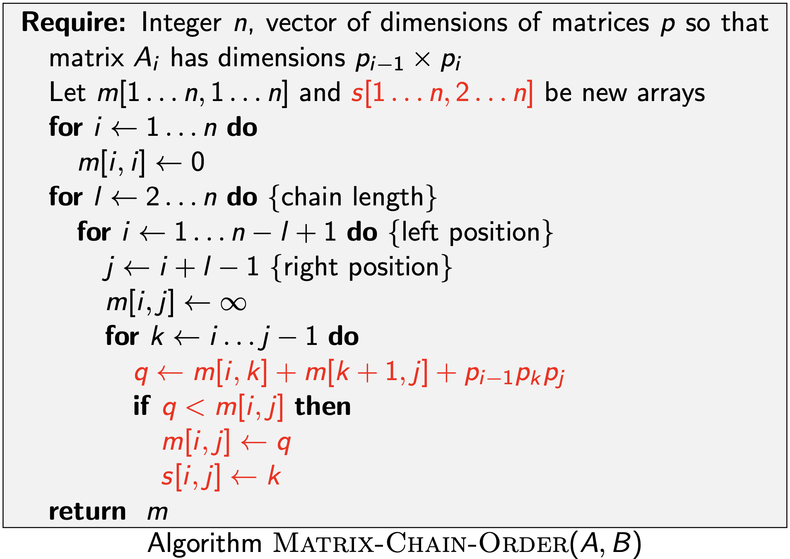

# Advanced and Distributed Algorithms - Modulo 2

## Indice

- [Dynamic Programming](#Dynamic-Programming)
  - [Introduzione](#introduzione)
  - [Weighted Interval Scheduling](#Weighted-Interval-Scheduling)

  -
  - [Segmented Least Squares](#Segmented-Least-Squares)
  - [Knapsack Problem](#Knapsack-Problem)
  - [RNA Secondary Stucture](#RNA-Secondary-Stucture)
  - [Pole Cutting](#Pole-Cutting)
  - [Matrix Chain Parentesizathion](#Matrix-Chain-Parentesizathion)
  - [Optimal Binary Search Tree](#Optimal-Binary-Search-Tree)
  - [String Similarity](#String-Similarity)
  - [Hirschberg's Algorithm](#Hirschbergs-Algorithm)
- [Network Flow](#Network-Flow)
  - [Max-Flow and Min-Cut Problems](#Max-Flow-and-Min-Cut-Problems)
  - [Capacity Scaling Algorithm](#Capacity-Scaling-Algorithm)
  - [Ford-Fulkerson pathological example](#Ford-Fulkerson-pathological-example)
  - [Matching su Grafi Bipartiti](#Matching-su-Grafi-Bipartiti)
  - [Disjoint Paths](#Disjoint-Paths)
  - [Network Connectivity](#Network-Connectivity)


<hr>

# Dynamic Programming

### Introduzione
Dopo aver visto tecniche di design per vari tipi algoritmi (ad esempio Ricerca, Ordinamento ecc...) quali 
- **Greedy** in cui si costruisce una soluzione in modo incrementale, ottimizzando ciecamente alcuni criteri locali.
- **Divide et Impera** nella quale si suddivide un problema in sottoproblemi indipendenti, si risolve ogni sottoproblema e ne si combina la soluzione con gli altri sottoproblemi per formare la soluzione al problema originale,

è possibile introdurre una tecnica più potente ma anche più complessa da applicare: la **Programmazione Dinamica** (Dynamic Programming). L'idea su cui si fonda è simile alla tecnica **Divide et Impera** ed è essenzialmente l'opposto di una strategia **Greedy**. In sostanza si esplora implicitamente tutto lo spazio delle soluzioni e lo si decompone in una serie di **sotto-problemi**, grazie ai quali si costruiscono le soluzioni per **sotto-problemi sempre più grandi** finché non si raggiunge il **problema di partenza**.

Una tecnica di programmazione dinamica è quella della `Memoization`, che è utile per risolvere una moltitudine di problemi, in cui risultati intermedi vengono salvati in cache e riutilizzati più avanti.

Per applicare la programmazione dinamica è necessario creare un *sotto-set* di problemi che soddisfano le seguenti proprietà:
1. Esiste solo un **numero polinomiale di sotto-problemi**
2. La soluzione al problema originale può essere calcolata **facilmente dalla soluzione dei sotto-problemi**
3. C'è un **ordinamento naturale dei sotto-problemi** dal più piccolo al più grande, insieme a una ricorsione facilmente calcolabile

Qui di seguito verranno descritti i principali problemi e algoritmi di risoluzione nell'ambito della programmazione dinamica.

<hr>

## Weighted Interval Scheduling

Abbiamo visto che un algoritmo **greedy** produce una soluzione ottimale per l'Interval Scheduling Problem, in cui l'obiettivo è accettare un insieme di intervalli non sovrapposti il più ampio possibile. **Il Weighted Interval Scheduling Problem** è una versione più **generale**, in cui ogni intervallo ha un certo valore (o peso), e vogliamo accettare un insieme di valore massimo.

Questo problema ha l'obiettivo di ottenere un insieme (il più grande possibile) di intervalli non sovrapposti (overlapping). Per la versione non pesata (Interval Scheduling Problem in cui weight=1) esiste uno specifico algoritmo **Greedy** che è in grado di trovare la soluzione ottima, tuttavia nella versione più generale, ovvero la versione pesata (**il Weighted Interval Scheduling Problem**, weight $\neq$ 1) è necessario utilizzare la programmazione dinamica.

#### **Descrizione del problema**
- $n$: un intero che rappresenta l'indice dell'intervallo (job)
- $s_i$: tempo di inizio dell'intervallo $i$
- $f_i$: tempo di fine dell'intervallo $i$
- $v_i$: peso dell'intervallo $i$
- Due job sono **compatibili** se non si sovrappongono.
- $p(j)$: ritorna l'indice più grande $i$, con $i < j$, del primo intervallo compatibile con l'intervallo $j$, considerando il fatto che gli intervalli sono ordinati in ordine non decrescente in base a $f_i$
- $\mathcal{O}_j$: rappresenta la soluzione ottima al problema calcolato sull'insieme $\{1, \ldots, j\}$
- $OPT(j)$: rappresenta il valore della soluzione ottima $\mathcal{O}_j$

#### **Goal**
- L'obiettivo del problema attuale è quello di trovare un sottoinsieme $S \subseteq \{1, \ldots, n\}$ di intervalli mutualmente compatibili che vanno a massimizzare la somma dei pesi degli intervalli selezionati $\sum_{i \in S} v_i$.

#### Greedy Version - Earliest Finish Time First
Considero i job in ordine non decrescente di $f_j$, aggiungo un job alla soluzione se è compatibile con il precedente.

È corretto se i pesi sono tutti 1, ma **fallisce** clamorosamente nella versione pesata.

### Dynamic Version

Come prima cosa definiamo il metodo per calcolare $OPT(j)$. Il problema è una _scelta binaria_ che va a decidere se il job di indice $j$ verrà incluso nella soluzione oppure no, basandosi sul valore ritornato dalla seguente formula (si considerano sempre i job in ordine non decrescente rispetto a $f_i$):

$$
OPT(j) = max(v_j + OPT(p(j)), \ \ OPT(j-1))
$$

Questo può essere anche visto come una disequazione:

$$
v_j + OPT(p(j)) \geq OPT(j-1)
$$

che se vera, includerà $j$ nella soluzione ottimale.

#### **Brute Force**
Scrivendo tutto sotto forma di algoritmo ricorsivo avremmo che:
```javascript
Input: n, s[1..n], f[1..n], v[1..n]
Sort jobs by finish time so that f[1] ≤ f[2] ≤ ... ≤ f[n]. 
Compute p[1], p[2], ..., p[n].

function Compute-Opt(j){
    if (j == 0)
        return 0
    else
        return max(vj+Compute-Opt(p(j)), Compute-Opt(j − 1))
}
```
Costruendo l'albero della ricorsione dell'algoritmo si nota che la complessità temporale è **esponenziale**. Questo perchè seguendo questo approccio calcolo più volte gli stessi sottoproblemi che si espandono come un albero binario. Il numero di chiamate ricorsive cresce come la **sequenza di fibonacci**.


Una soluzione è quella di utilizzare la tecnica della **Memoization** che evita di ricalcolare $OPT$ per gli indici già calcolati precedentemente, rendendo così il costo temporale uguale ad $O(n)$.

#### Memoization

```pseudocode
Input: n, s[1..n], f[1..n], v[1..n]
Sort jobs by finish time so that f[1] ≤ f[2] ≤ ... ≤ f[n]. 
Compute p[1], p[2], ..., p[n].

for j = 1 to n 
	M[j] ← empty.
M[0] ← 0.

M-Compute-Opt(j)
  if M[j] is empty
  	M[j] ← max(v[j] + M-Compute-Opt(p[j]), M-Compute-Opt(j – 1)) 
  return M[j]
```

Costruisco una matrice dove salvo i risultati dei sottoproblemi. Quando devo accedere ad un sottoproblema prima di ricalcolarlo controllo se è presente nella matrice.

Costo computazionale = $O(n\log{n})$:

- Sort: $O(n\log{n})$
- Computazione di p[i]: $O(n\log{n})$
- M-Compute-Opt( j ): $O(1)$ ogni iterazione, al massimo $2n$ ricorsioni = $O(n)$

Se i job sono già ordinati = $O(n)$

Oltre al valore della soluzione ottimale probabilmente vorremmo sapere anche quali sono gli intervalli che la compongono, e intuitivamente verrebbe da creare un array aggiuntivo in cui verranno aggiunti gli indici degli intervalli ottenuti con `M-Compute-Opt`. Tuttavia questo aggiungerebbe una complessità temporale di $O(n)$ peggiorando notevolmente le prestazioni. Un'alternativa è quella di recuperare le soluzioni dai valori salvati nell'array `M` dopo che la soluzione ottimale è stata calcolata. Per farlo possiamo sfruttare la formula vista in precedenza $v_j + OPT(p(j)) \geq OPT(j-1)$, che ci permette di rintracciare gli intervalli della soluzione ottima.

## Finding a solution

```pseudocode
Find-Solution(j)
  if j = 0
  	return ∅
  else if (v[j] + M[p[j]] > M[j–1])
  	return { j } ∪ Find-Solution(p[j]) 
  else
  	return Find-Solution(j–1)
```

Numero di chiamate ricorsive $\leq n = O(n)$ 

## Bottom-Up

```pseudocode
Sort jobs by finish time so that f1 ≤ f2 ≤ ... ≤ fn. 
Compute p(1), p(2), ..., p(n).

M[0] ← 0
for j = 1 TO n
	M[j] ← max { vj + M[p(j)], M[j–1] }
```

## Riepilogo

- $OPT[j] = max\{ v_j + OPT[p_j], OPT[j-1] \}$
- per ogni j scelgo se prenderlo o meno
- alcuni sottoproblemi vengono scartati (quelli che si sovrappongono al j scelto)
- per ogni scelta ho due possibilità **TEMPO =** $O(n \log n)$
- lo spazio è un vettore di $OPT[j]$ **SPAZIO =** $O(n)$
- per ricostruire la soluzione uso un vettore dove per ogni $j$ ho un valore booleano che indica se il job fa parte della soluzione **SPAZIO_S =** $O(n)$

<hr>
#### ARRIVATO QUI A LEGGERTE

# Segmented Least Squares

### Least Squares

Data una lista di punti nel piano $(x_1, y_1), ..., (x_n, y_n)$, trovare una retta $y=ax+b$ che minimizza l'errore quadrato medio.

## Segmented Least Squares

Data una lista di punti nel piano $(x_1, y_1), ..., (x_n, y_n)$, trovare una sequenza di segmenti che minimizzano $f(x)$.

$f(x)$ deve bilanciare accuratezza (errore quadrato medio) e numero di segmenti.

$f(x)= E + cL$

- E = somma della somma degli errori quadrati medi

- c = costante $\gt0$

- L = numero di segmenti

## Dynamic version

$e(i,j)$ = somma degli errori quadrati per i punti $p_i, p_{i+1},..., p_j$
```math
OPT(j) = \begin{cases} 
0 & \mbox{if } j = 0 \\
min_{1 \leq i \leq j}\{ e(i,j) + c + OPT(i-1)\} & \mbox{otherwise}
\end{cases}
```

```pseudocode
for j = 1 to n 
	for i = 1 to j
		Compute the least squares e(i, j) for the segment pi, pi+1, ..., pj
		
M[0] ← 0
for j = 1 to n
	M [ j ] ← min (1 ≤ i ≤ j) { eij + c + M [i – 1] }
return M[n]
```

Costo computazionale = $O(n^3)$ time, $O(n^2)$ space.

Il collo di bottiglia è la computazione di $e(i, j)$. $O(n^2)$ per punto per $O(n)$ punti.

Può essere migliorato in  $O(n^2)$ time, $O(n)$ space grazie ad alcune precomputazioni.

## Riepilogo

- trovare il numero di segmenti su un piano cartesiamo per minimizzare i quadrati degli errori
- $OPT[j] = min_{1 \le i \le j } \{ OPT[i-1] + e(i,j) + c \}$
  - $c$: il costo da pagare per ogni segmento
  - $e$: il costo degli errori
- risolvo n problemi **SPAZIO =** $O(n)$
- per ogni problema ho n scelte ( $O(n^2)$ ) ma per computare $e(i,j)$ **TEMPO =** $O(n^3)$
- per ricostruire la soluzione salvo un vettore dove $S[j] = min_i$ **SPAZIO_S** = $O(n)$

---

# Knapsack Problem

Dati uno zaino di capacità W e una lista di oggetti $i$ con peso $w_i$ e valore $v_i$.

**Goal:** Trovare l'insieme di $i$ con peso $\leq W$ e valore massimo.

Posso cercare algoritmi greedy, (by value, by weight, by ratio $v_i/w_i$) ma nessuno di questi è ottimo.

## Dynamic Version

Non posso usare una funzione $OPT(j)$ perchè senza sapere quali altri oggetti ho nello zaino non so se posso prendere $j$.

$OPT(j, w)$ = miglior soluzione nel subset di oggetti da 1 a $j$ con peso massimo $w$.
```math
OPT(j, w) = \begin{cases} 
0 & \mbox{if } j = 0 \\
OPT(j-1, w) & \mbox{if } w_j \gt w \\
max\{OPT(j-1, w), v_j + OPT(j-1, w-w_j)\} & \mbox{otherwise}
\end{cases}
```


## Bottom-Up

```pseudocode
for w = 0 to W 
	M[0, w] ← 0
	
for j = 1 to n
	for w = 1 to W
		if(wj>w) 
			M[j,w]←M[j–1,w]
		else 
			M[j, w] ← max { M [j – 1, w], vj + M [j – 1, w – wj] }
return M[n,W]
```

Complessità computazionale = $\Theta(nW)$ space e $\Theta(nW)$ time

- $O(1)$ per ogni elemento inserito nella tabella
- $\Theta(nW)$ elementi della tabella
- Dopo aver computato il valore ottimo, per trovare la soluzione completa: prendo $i$ in $OPT(i, w)$ iff $M[i, w] \gt M[i-1, w]$ 

## Osservazioni

Dimensione dell'input non polinomiale, pseudopolinomiale, perchè dipende da due variabili. 

La versione del problema con decisione è NP-Completo

Esiste un algoritmo che trova una soluzione in tempo polinomiale entro l'1% di quella ottima.

## Riepilogo

- scegliere gli oggetti da mettere nello zaino per massimizzare il valore, non superando il peso massimo.
- $OPT[i,w] = max\{ v_i + OPT[i-1, w-w_i], OPT[i-1,w] \}$
- scelgo se prendere o meno l'oggetto $i$
- ho bisogno di una matrice $n \times z$ ($z$ è la capacità dello zaino). problema pseudopolinomiale perchè varia in base a $z$ **SPAZIO =** $O(nz)$
- per riempire una cella devo solo controllare due valori **TEMPO =** $O(nz)$
- per costruire una soluzione ho una matrice dove per ogni $S[i,j]$ ho un booleano che indica se appartiene alla soluzione **SPAZIO_S =** $O(n^2)$ **TEMPO_S =** $O(n+z)$
- in questo problema la matrice può essere costruita per righe o per colonne
- per trovare $(i,w)$ leggo solo da una riga, per costrure la riga $i$ ho solo bisogno della riga $i-1$, la soluzione è in $S[n,z]$. Posso quindi trovare una soluzione utilizzando una matrice con sole due righe **SPAZIO =** $O(z)$ ma cosí non posso ricostruire la soluzione.

---

# RNA Secondary Stucture

**RNA:** stringa $b_0b_1...b_n$ su alfabeto {A, C, G, U}

**Secondary Structure:** set di coppie $S = \{(b_i,b_j)\}$ che soddisfa le seguenti proprietà:

- Ogni coppia è del tipo **A-U, U-A, C-G** o **G-C**
- se $(b_i,b_j)\in S \implies i \lt j-4$  (no sharp turns)
- se $(b_i,b_j)$ e $(b_k, b_l) \in S$ allora **NON** può essere $i < k < j < l$  (non crossing)

**Goal:** Data una molecola di RNA trovare una struttura secondaria che massimizza il numero di coppie.

## Dynamic Version

$OPT(i,j)$ = massimo numero di coppie nella sottostringa $b_ib_{i+1}...b_j$

distinguo 3 diversi casi:

1. if $i \ge j -4$: 

   $OPT(i,j) = 0$

2. $b_j$ non viene accoppiata:

   $OPT(i,j) = OPT(i,j-1)$

3. $b_j$ si accoppia con $b_t$ per una qualche $i \le t \lt j -4$:

   $OPT(i,j) = 1 + max_t\{OPT(i, t-1) + OPT(t+1, j-1)\}$

```pseudocode
for k = 5 to n – 1 
	for i = 1 to n – k
		j← i+k
		Compute M[i, j] using formula
return M[1,n]
```

Risolvere prima i sottoproblemi più piccoli.

Costo computazionale: $O(n^3)$ time e $O(n^2)$ space

## Riepilogo

- trovare il modo di accoppiare le basi di RNA con delle regole
- $OPT[i,j] = max\{ max_{i \le t \le j-5} \{ 1 + OPT[i, t-1] + OPT[t+1, j] \}, OPT[i, j-1] \}$
- spazio = matrice riempita per diagonali **SPAZIO =** $O(n^2)$
- per calcolare ogni OPT pago n **TEMPO =** $O(n^3)$
- per costruire una soluzione mi serve una matrice dove $S[i,j] = max_t$ **SPAZIO_S =** $O(n^2)$

---

# Pole Cutting

Pole di lunghezza n. Può essere tagiato in più parti di lunghezza intera. Poles di lunghezza $i$ vengono venduti al prezzo $p(i)$.

**Goal:** Trovare il maggior possibile guadagno tramite il taglio del pole.

possiamo tagliare il pole il $2^{n-1}$ modi diversi

## Recursive Top-Down

Considero la soluzione per input $n$ :	$n = i_1 + i_2 + ... i_k$ 	per qualche k

Ma allora 	$n - i_1 = i_2 + ... + i_k$ 	è una soluzione ottima per input $n - i_1$.

Posso quindi calcolare il massimo guadagno $r_n = max\{p_n, r_1 + r_{n-1}, r_2 + r_{n-2}, ..., r_{n-1} + r_1\}$.	$p_n$ è il guadagno del pole intero, senza tagli. 

```math
r_n = max_{1 \le i \le n}(p_i + r_{n-i})
```

```pseudocode
Cut-Pole(p, n) {
  if n = 0 then
    return 0 
  q ← −∞
  for i = 1 . . . n do
    q ← max{q, p[i] + Cut-Pole(p, n − i)}
  return q
}
```

Costo computazionale: $O(n2^n)$

- $2^i$ chiamate ricorsive
- $O(n)$ per ogni chiamata

## Memoization Top-Down

```pseudocode
Let r[0...n] be a new array
for i = 0 . . . n do
		r[i] ← −∞
return Memoized-Cut-Pole-Aux(p,n,r)

Memoized-Cut-Pole-Aux(p,n,r){
  if r[n] ≥ 0 then 
  	return r[n]
  if n = 0 then 
  	q←0
  else
  	q ← −∞
  	for i = 1 . . . n do
  		q ← max{q, p[i] + Memoized-Cut-Pole-Aux(p, n − i,r)} 
  r[n] ← q
  return q
}
```

## Bottom-Up

```pseudocode
Let r[0...n] be a new array
r[0] ← 0
for j = 1 . . . n do
	q ← −∞
	for i = 1 . . . j do
		q ← max{q, p[i] + r[j − i]} 
	r[j] ← q
return r[n]
```

Costo computazionale = $O(n^2)$

## Riepilogo

- massimizzare il reward in base ai tagli
- $OPT[j] - max_{i \le l \le j} \{ OPT[j-l] + p_l \}$
- devo calcolare OPT per ogni n, per ognuno pago n **TEMPO =** $O(n^2)$
- salvo i dati in un vettore che contiene OPT dei vari segmenti **SPAZIO =** $O(n)$
- per ricostruire la soluzione uso un vettore dove $S[j] = max_l$ **SPAZIO_S =** $O(n)$

---

# Matrix Chain Parentesizathion

moltiplicazione tra 2 matrici $(p \times r)(r \times q) = (p \times q)$ . $i,j =$ riga $i$ x colonna $j$ = $O(n^3)$ time

**Goal:** data una sequenza di matrici, trovare il modo migliore di parentesizzarla per calcolare la moltiplicazione tra tutte le matrici con meno moltiplicazioni scalari possibili. 

### Quante possibili parentesizzazioni?

```math
P(n) =
\begin{cases} 
1 & \mbox{if }n = 0 \\
\sum_{k=1}^{n-1}P(k)P(n-k) & \mbox{otherwise}
\end{cases}
```

Ovvero $\Omega(2^n)$

### Optimal Substructure

Un problema P si dice in sottostruttura ottima se una soluzione ottima di P contiene soluzioni ottime dei sottoproblemi di P.

MCP è un problema in sottostruttura ottima.

## Recursive

- $m[i,j]$ = minimo numero di moltiplicazioni scalari per computare la moltiplicazione $A_i \times A_{i+1} \times ... \times A_j$

- $m[i,i] = 0$ se i = j

- se $i \lt j$ e nella soluzione ottimale c'è la moltiplicazione $A_{ik} \times A_{(k+1) j}$ per qualche j allora $m[i,j] = m[i,k] + m[k+1,j] + p_{i-1} p_k p_j$
  - $p_{i-1} p_k p_j$ è il costo della moltiplicazione di $A_{ik} \times A_{(k+1)j}$

```math
m[i,j] = 
\begin{cases}
0 & \mbox{if } i = j \\
min_{i \le k \lt j} \{ m[i,k] + m[k+1, j] + p_{i-1} p_k p_j\} & \mbox{if } i \lt j
\end{cases}
```

Se implementassimo questa formula direttamente il costo computazionale diventerebbe esponenziale

## Bottom-Up

```pseudocode
matrix Ai has dimensions p(i−1) × p(i)

Let m[1...n,1...n] be a new array
for i ← 1 . . . n do
	m[i,i] ← 0
for l ← 2...n do {chain length}
	for i ← 1 . . . n − l + 1 do {left position} 
		j ← i + l − 1 {right position}
		m[i,j] ← ∞
		for k ← i . . . j − 1 do
			m[i,j] ← min{m[i,j],m[i,k]+m[k +1,j]+pi−1pkpj} 
return m
```

Meno di $n^2$ sottoproblemi, ognuno costa $O(n)$: l'algoritmo intero costa $O(n^3)$

Troviamo la soluzione in $m[0,n]$

Per conosccere la parentesizzazione dobbiamo modificare l'algoritmo e portarci dietro le coppie che decidiamo di moltiplicare



Possiamo poi utilizzare s per risalire alla soluzione

```pseudocode
Print-Optimal-Parens(s, i, j)
	if i = j then
		print “Ai”
	else
		print “(”
		Print-Optimal-Parens(s, i, s [i , j]) 
		Print-Optimal-Parens(s, s[i , j] + 1, j) 
		print “)”
```

## Riepilogo

- minimizzare i prodotti scalari con parentesizzazione

- $m[i,j] = min_{i \le k \lt j} \{ m[i,k] + m[k+1, j] + p_{i-1} p_k p_j\}$

- spazio necessario:

  ho bisogno di una matrice (triangolare superiore) per ricordrmi i valori calcolati precedentemente, riempita per diagonali.

- spazio matrice $n \times n$ **SPAZIO =** $O(n^2)$

- per ogni cella pago n **TEMPO =** $O(n^3)$

- per ricorstruire la soluzione **SPAZIO_S** = $O(n^2)$

  uso una matrice dove segno quale k per ogni $(i,j)$ ha dato il risultato migliore

---

# Optimal Binary Search Tree

**BST:** 

- ogni nodo ha una chiave 

- la chiave di un nodo interno **u** è maggiore di tutte le chiavi del suo sottoalbero di sinistra e maggiore di tutte le chiavi del suo sottoalbero di destra

  

- il **livello** di un nodo **u** in un albero **T**, $level_T (u)$, è il numero di archi dalla radice di T fino al nodo **u**

- la **profondità** di **T** è il suo livello massimo

- la **ricerca** di un nodo u ha un costo proporzionale a $1 + level_T(u)$

un BST **bilanciato** con n elementi ha profondità $O(\log n)$. Questo è buono se assumiamo che i nodi vengano cercato con probabilità uguali. Se non è cosí vogliamo rendere i nodi più cercati più facili da trovare.

**Goal:** Vogliamo costruire un BST, conoscendo le frequenze con cui i nodi vengono cercati, che minimizza il costo medio di ricerca.

## Optimal BST Problem

input: 

- un set $S$ di n interi
- un array $W$ con n elementi che contiene interi positivi ($W[i]$ = frequenza di $i$)
- $a$, $b$ interi tali che $1 \le a \le b \le n$

Output:

- un BST su $S$ con **avgCost** il più piccolo possibile

```math
avgCost(T) = \sum_{i = a}^{b} W[i] * cost_T(i)
```

- $cost_T(i)$ = numero di nodi da controllare per trovare $i$ in T

## Costruzione dell'algoritmo

### 1. Trovare tutte le opzioni per la prima scelta

Scegliamo una root **r**, il suo sottoalbero di sinistra sarà un BST $T_1$ su $S_1 = \{a ... r-1 \}$  e quello di destra un BST $T_2$ su $S_2 = \{ r+1 ... b \}$

### 2. Data la prima scelta, trovare la soluzione migliore

Per trovare la soluzione migliore per T dobbiamo scegliere le soluzioni migliori per $T_1$ e $T_2$

```math
avgCost(T) = \sum_{i=a}^{b} W[i] * cost_T(i) 
= \left( \sum_{i=a}^{b} W[i] \right) + avgCost(T_1) + avgCost(T_2)
```

$optAvg(a,b)$

- 0 se $a \gt b$
- min BST su $\{a .. b\}$ altrimenti

$optAvg(a,b | r)$ è la soluzione ottima dato $r$ come radice.

```math
optAvg(a,b | r ) = \left( \sum_{i=a}^{b} W[i] \right) +optAvg(a,r-1) + optAvg(r+1, b)
```


### 3. Prendere la prima scelta che porta alla soluzione migliore 

```math
optAvg(a,b) = 
\begin{cases}
0 & \mbox{if } a\gt b \\
\left( \sum_{i=a}^{b} W[i] \right) + min_{r=a}^b \{ optAvg(a,r-1) + optAvg(r+1, b) \} & \mbox{otherwise}
\end{cases}
```

## Riepilogo

- Costruire un albero di ricerca massimizzando la velocità di ricerca in base alla probabilità
- $OPT[i,j] - min_{i \le r \le j} \{ OPT[i, r-1] + OPT[r+1, j] + w[i,j] \}$
- $r$ è la radice sei sottoalberi creati ricorsivmente
- spazio = matrice n x n **SPAZIO =** $O(n^2)$
- per ogni operazione pagno n **TEMPO =** $O(n^3)$
- per ricostruire la soluzione uso un'altra matrice dove $S[i,j] = min_r$ **SPAZIO_S =** $O(n^2)$

# String Similarity

Operazioni:

- **mismatch:** cambio una lettera in un'altra. Penalità $\alpha_{pq}$ (passare dalla lettera $p$ alla lettera $q$, $\alpha_{pp} = 0$)
- **gap:** aggiungo o rimuovo una lettera. Penalità $\delta$

Costo totale = somma delle penalità

Date due stringhe $x_1x_2...x_m$ e $y_1y_2...y_n$ un **allineamento** è una set di coppie ordinate $x_i - y_i$ tale che ogni lettera compaia in una sola coppia e non ci siano incroci ($x_i-y_j$ e $x_{i'}-y_{j'}$ si incrociano se $i \lt i'$ e $j > j'$)

Il costo dell'allineamento è dato dalla somma dei costi dei mismatch e dei costi dei gap

```math
cost(M) = \sum_{(x_i,y_j) \in M} \alpha_{x_j y_j} + \sum_{i:x_i unmatched} \delta + \sum_{j:y_j unmatched} \delta
```

**Goal:** Date due stringhe, trovare l'allineamento di costo minimo.

 ## Stuttura del Problema

$OPT(i,j)$ = costo minimo dell'allineamento delle stringhe $x_1x_2...x_i$ e $y_1y_2...y_j$

- aggiungo $x_i-y_j$ al match: 

  ​	pago $\alpha_{x_iy_j}$ + il costo $OPT(i-1,j-1)$

- lascio $x_i$ senza match:

  ​	pago $\delta$ + il costo di $OPT(i, j-1)$

- lascio $y_j$ senza match:

  ​	pago $\delta$ + il costo di $OPT(i-1, j)$ 

```math
OPT(i,j) = 
\begin{cases}
j\delta & \mbox{if } i = 0 \\
i\delta & \mbox{if } j = 0 \\
min
\begin{cases}
\alpha_{x_iy_j}+ OPT(i-1,j-1) \\
\delta + OPT(i, j-1)\\
\delta + OPT(i-1, j)
\end{cases}  & \mbox{otherwise}
\end{cases}
```

## Bottom-Up

```pseudocode
for i = 0 to m
	M[i, 0] ← i δ
for j = 0 to n
	M[0, j] ← j δ
	
for i = 1 to m
	for j = 1 to n
		M[i, j] ← min { 
			α(xi yj) + M[i – 1, j – 1],
 			δ + M [i – 1, j],
 			δ + M [i, j – 1] 
 		}
 		
RETURN M[m, n]
```

Costo computazionale = $\Theta(nm)$

## Riepilogo

- trovare il numero di operazioni da fare per allineare due sequenze
- $OPT[i,j] = min\{ \alpha_{ij} + OPT[i-1,j-1], \delta + OPT[i, j-1], \delta + OPT[i-1, j] \}$
- Ho bisogno di una matrice $i \times j$ **TEMPO =** $O(nm)$
- per ogni sottoproblema faccio solo un controllo. Posso anche utilizzare una matrice con sole due righe o sole due colonne **SPAZIO =** $O(nm)$
- per costrure la soluzione ho bisogno di una matrice dove salvo le operazioni fatte, posso risalire in diagonale. **SPAZIO_S =** $O(nm)$ **TEMPO_S =** $O(n+m)$

---

# Hirschberg's Algorithm

permette di risparmiare spazio nella costruzione della soluzione del problema Longest Common Subsequence

- serve una marice $n \times m$

  non si può calcolare la soluzione di LCS in meno di $n^{2-\epsilon}$ a meno che LCS non sia risolvibile in meno

**Teorema di Hirschberg:** esiste un algoritmo per ricostruire la soluzione di LCS in $O(nm)$ tempo e $O(n+m)$ spazio (basato su divide et impera)

risolvere LCS è come risolvere il cammino minimo su un grafo $n \times m$ da (0,0) a (n,m)

**Lemma:** $f(i,j) =$ shortest path from $(0,0)$ to $(i,j) = OPT(i,j)$

**Dimostrazione** per induzione

- caso base: $f(o,o) = OPT(0,0) = 0$

- ipotesi induttiva: assum vero per ogni $(i', j')$ con $i'+j' \lt i+j$

- l'ultimo arco nello shortest path verso $(i,j)$ è $(i-1, j-1)$, $(i, j-1)$ o $(i-1, j)$

- quindi 

  $f(i,j) = min\{ \alpha_{x_i y_j} + f(i-1, j-1), \delta + f(i-1, j), \delta +f(i, j-1)\} = $

  $= min\{ \alpha_{x_i y_j} + OPT(i-1, j-1), \delta + OPT(i-1, j), \delta + OPT(i, j-1)\} =$

  $= OPT(i,j)$

per calcolare lo shortest path da un $(i,j)$ a $(n,m)$ posso cambiare la direzione degli archi e calcolare lo shortest path da $(n,m)$ a tutti i vertici $(i,j)$

il costo per andare da $(0,0)$ a $(n,m)$ posso scomporlo da $(0,0)$ a $(i,j)$ e da $(m,n)$ a $(i,j)$

nel commino incontrerò per forza la colonna n/2 ma non su per quale vertice (riga q): voglio trovare q. divido quindi il problema in 2:

​	$f((0,0)(n/2,q)) + f((n/2,q)(n,m))$ 

e posso quindi renderlo ricorsivo, in ogni ricorsione mi ricordo solo q.

### Algoritmo

per prima cosa calcolo shortest path su tutta la matrice (Dijkstra in $O(nm)$ ). Cerco poi q sulla colonna n/2 e lo salvo ricorsivamente n volte.

Chiamo poi ricorsivamente f per trovare le soluzioni da sinistra a n/2 e da destra a n/2.

### Costo computazionale

$T(m,n) \le 2T(m, n/2) + O(nm) = O(mn \log n)$ Costo troppo elevato.

i due sottoinsiemi però non sono $2T(m, n/2)$ ma $(q, n/2) + (m-q, n/2)$


## Riepilogo

si può trovare un allineamento ottimo in tempo $O(nm)$ e spazio $O(n+m)$ con spazio_s = $O(n+m)$

---

# Network Flow

Una rete di flusso è una quintupla **G = (V, E, s, t, c)**

- Digrafo **(V, E)** con source **s** $\in V$ e sink **t** $\in V$
- Capacità $c(e) \gt 0$ per ogni $e \in E$

# Max-Flow and Min-Cut Problems

## Minimun Cut Problem

un **st-Cut** (cut) è una partizione $(A,B)$ con $s \in A$ e $t \in B$

la sua capacità è la somma delle capacità degli archi da A a B

**Min-Cut Problem:** trovare un cut con capacità minima

---

## Maximum Flow Problem

un **st-Flow** (flow) $f$ è una funzione che soddisfa:

- **Capcaity:** Per ogni $e \in E$: $0 \le f(e) \le c(e)$
- **Flow Conservation:** Per ogni $v \in V - \{s, t\}$: $\sum_{e\mbox{ in to }v} f(e) = \sum_{e\mbox{ out of }v} f(e)$

il **valore** del flow $f$ è $val(f) = \sum_{e\mbox{ out of }s} f(e) - \sum_{e\mbox{ in to }s} f(e)$

**Max-Flow Problem:** trovare un flow di valore massimo

---

# Ford-Fulkerson Algorithm

## Greedy Algorithm

1. Inizia con $f(e) = 0$ per ogni $e \in E$ 
2. Trova un path $P$ da $s$ a $t$ dove ogni arco ha $f(e) \lt c(e)$
3. Aumenta il flow lungo $P$ (vanno riguardati anche i flow per mantenera la proprietà della conservazione)
4. Ripeti 2 e 3 finchè puoi

Non funziona perchè non ho alcun modo di diminuire il flow sugli archi, se prendo decisioni sbagliate non posso tornare indietro.

## Residual Network

Invece di un arco $(u,v)$ su cui segno flow/capacity, ho due archi

1. $e=(u,v)$ dove segno $c(e) - f(e)$
2. $e^{reverse} = (v,u)$ dove segno $f(e)$

### Capacità residua:

```math
c_f(e) = 
\begin{cases}
c(e) - f(e) & \mbox{if } e \in E \\
f(e) & \mbox{if } e^{reverse} \in E
\end{cases}
```

### Residual Network:

$G_f = (V, E_f, s, t, c_f)$

- $E_f = \{ e: f(e) \lt c(e) \} \cup \{ e^{reverse}: f(e) \gt 0 \}$
- key property: $f'$ è un flow in $G_f \iff f+f'$ è un flow in $G$

**Augmenting Path:** un path da $s$ a $t$ nel resiudal network $G_f$.

**Bottleneck Capacity** di un augmenting path: minima capacità residua degli archi nel path.

```pseudocode
AUGMENT(f, c, P) {
  δ ← bottleneck capacity of augmenting path P.
  forEach edge e ∈ P :
  	if (e ∈ E) 
  		f(e) ← f(e) + δ.
  	else 
  		f(e_reverse) ← f(e_reverse) – δ.
  return f.
}
```

f = flow. P = augmenting path.

$f' = AUGMENT(f,c,P)$ è un flow e $val(f') = val(f) + bottleneck(G_f, P)$

quindi risco a trovare un flow con valore maggiore di quello precedente.

```pseudocode
FORD–FULKERSON(G) {
  forEach edge e ∈ E: 
  	f(e) ← 0
  Gf ← residual network of G with respect to flow f.
  while(there exists an s↝t path P in Gf )
  	f ← AUGMENT(f, c, P)
  	Update Gf
  return f
}
```

L'algoritmo continua a chiamare AUGMENT sugli augmenting path finchè può.

---

# Max-Flow Min-Cut Theorem

### Flow Value Lemma

sia $f$ un qualsiasi flow e $(A,B)$ un qualsiasi cut. Il valore del flow è uguale al flow passante per il cut.

```math
val(f) = \sum_{e \mbox { out of } A} f(e) -  \sum_{e \mbox { in to } A} f(e)
```

**Dimostrazione:**

 $val(f) = \sum_{e \mbox { out of } s} f(e) -  \sum_{e \mbox { in to } s} f(e) =$

$=\sum_{v \in A} \left( \sum_{e \mbox { out of } v} f(e) -  \sum_{e \mbox { in to } v} f(e) \right) =$ per la prorpietà della conservazione del flusso, ogni valore con $v \ne s$ è 0

$= \sum_{e \mbox { out of } A} f(e) -  \sum_{e \mbox { in to } A} f(e)$

### Weak Duality

Sia $f$ un qualsiasi flow e $(A,B)$ un qualsiasi cut. Allora $val(f) \le cap(A,B)$

**Dimostrazione:**

$val(f) = \sum_{e \mbox { out of } A} f(e) -  \sum_{e \mbox { in to } A} f(e) \le$ 

$\le \sum_{e \mbox { out of } A} f(e) \le \sum_{e \mbox { out of } A} c(e) = cap(A,B)$

**Corollario**

Sia $f$ un qualsiasi flow e $(A,B)$ un qualsiasi cut. Se $val(f) = cap(A,B)$ allora $f$ è max-flow e $(A,B)$ è min-cut

**Dimostrazione** (weak duality)**:**

- per ogni flow $f'$: $val(f') \le cap(A,B) = val(f)$ 

  Se f è max-flow è il più grande possibile

- per ogni $(A',B')$: $cap(A',B') \ge val(f) = cap(A,B)$ 

  Se (A,B) è min-cut la sua capacità è la più piccola possibile

### Max-Flow Min-Cut Theorem

Il valore del Max-Flow è uguale alla capacità del Min-Cut

### Augmenting Path Theorem

Un flow è max-flow se e solo se non ci sono Augmenting Path

**Dimostrazione:**

1. Esiste un cut $(A,B)$ tale che $cap(A,B) = val(f)$

2. $f$ è max-flow

   $1\to 2$ : corollario di weak duality

3. Non ci sono augmenting path per $f$ 

   $2\to3$: se ci fosse un augmenting path potremmo mandare più flow su questo path con AUGMENT, quindi $f$ non sarebbe un max-flow

   $3 \to 1$: $val(f) = \sum_{e \mbox { out of } A} f(e) -  \sum_{e \mbox { in to } A} f(e) = \sum_{e \mbox { out of } A} c(e) -  0 = cap(A,B)$

   Dato che non ci sono augmenting path, gli archi che escono da A hanno $f(e) = c(e)$ e gli archi che entrano in A hanno $f(e) = 0$ 

---

# Capacity Scaling Algorithm

Assumiamo che per ogni $e \in E$, $c(e)$ è un intero tra 0 e C, quindi anche ogni $f(e)$ ed ogni $c_f(e)$ è un intero.

### Teorema:

Ford-Fulkerson termina dopo al più $val(f^{\*}) \le nC$ augmenting paths, dove $f^{\*}$ è il flusso massimo.

**Dimostrazione:** ogni ciclo dell'algoritmo aumenta il flow di almeno 1.

**Corollario:** Ford-Fulkerson impiega $O(mnC)$ tempo.

**Dimostrazione:** Si possono usare DFS o BFS per trovare un augmenting path in $O(m)$

### Integrality Theorem:

Esiste un max-flow dove ogni $f(e)$ è intero.

## Scegliere Augmenting Paths

Alcune scelte degli augmenting paths portano a tempi polinomiali, altre a tempo esponenziali.

Quando le capacità sono irrazionali non è garantito che Ford-Fulkerson termini.

Sceglo augmenting path con:

- bottleneck capacity massima
  - uso un parametro $\Delta$. Prendo in considerazione solo gli archi con capacità $\ge \Delta$.
  - ogni augmenting path ora ha bottleneck capacity $\ge \Delta$
- bottleneck capacity abbastanza grande
- minor numero di archi

```pseudocode
CAPACITY-SCALING(G) {
  forEach edge e ∈ E: 
  	f(e) ← 0
  Δ ← largest power of 2 ≤ C
  
  while (Δ ≥ 1)
  	Gf(Δ) ← Δ-residual network of G with respect to flow f
  	while (there exists an s↝t path P in Gf(Δ))
  		f ← AUGMENT(f, c, P)
  		Update Gf (Δ)
 		Δ ← Δ / 2
 		
  return f
}
```

Assumo che tutte le capacità siano intere e che $\Delta$ sia una potenza di 2.

**Teorema:** Se CAPACITY-SCALING termina allora f è un max-flow

**Dimosrazione:**

- quando $\Delta = 1 \implies G_f(\Delta) = G_f $
- quando termina la fase con $\Delta = 1$ non ci sono più augmenting paths
- se non ci sono augmenting paths allora il flusso è massimo

**Lemma:** (non so se si dice lemmi)

- Ci sono $1 + \lfloor \log_2 C \rfloor$ fasi di scaling


- sia $f$ il flow dopo una fase di scaling. $val(f^*) \lt val(f) + m \Delta$

  - Esiste un cut $(A,B)$ tale che $cap(A,B) \le val(f) + m\Delta$

  - $val(f) = \sum_{e \mbox { out of } A} f(e) -  \sum_{e \mbox { in to } A} f(e) \ge$

    $\ge \sum_{e \mbox { out of } A} (c(e) - \Delta) -  \sum_{e \mbox { in to } A} \Delta \ge$

    $\ge \sum_{e \mbox { out of } A} c(e) - \sum_{e \mbox { out of } A} \Delta - \sum_{e \mbox { in to } A} \Delta \ge$

    $\ge cap(A,B) + m\Delta$

    

- ci sono $\lt 2m$ augmentation per ogni fase di scaling

  - ogni augmentation aumenta il flow di almeno $\Delta$

  

- CAPACITY-SCALING impiega $O(m^2 \log C)$

  - $O(m \log C)$ augmetations
  - ogni augmentation $O(m)$

---

# Ford-Fulkerson pathological example

sia $r$ tale che $r^2 = 1-r$

- le capacità iniziali sono $\{1, r\}$
- dopo qualche augmentation diventano $\{1,r,r^2\}$ ($1-r$)
- dopo altre diventano $\{1,r,r^2, r^3\}$ ($r-r^2$)


augment 1: $s \to v \to w \to t$. Bottleneck capacity = 1 (v,w).

continuo ad aumentare path che passano per (v,w) e per (w,v) alternati, quindi aggiungo e tolgo la bottleneck ogni volta. La bottleneck diminuisce sempre ma va da r a $r^2$ a $r^3$ e cosí via, cosí l'algoritmo non termina mai. 

**Teorema:** Ford-Fulkerson può non terminare e può convergere ad un valore che non è il flusso massimo.

---

# Matching su Grafi Bipartiti

Dato un grafo non diretto $G=(V,E)$, $M \subseteq E$ è un **matching** se ogni vertice $v \in V$ compare in $M$ al più una volta.

**Max Matching:** Trovare un matching di cardinalità massima

**Grafo Bipartito:** Un grafo si dice bipartito se può essere diviso in due subset $L$ e $R$ tali che ogni arco connette un nodo in $L$ e uno in $R$

**Bipartite Matching:** Dato un grafo bipartito $G=(L \cup R, E)$ trovare un max matching.

## Max-Flow Formulation

- Creo un grafo $G' = (L \cup R \cup \{ s, t\}, E')$
- Direziono tutti gli archi da L a R, do loro capacità infinita.
- Aggiungo archi da s a L con capacità 1. Aggiungo archi da R a t con capacità 1.

### Teorema:

La cardinalità di un max-matching su $G$ è uguale al max flow su $G'$

**Dimostrazione:**

$\le$: Considero un max-matching di valore k. Considero un flow che manda un unità in ognuno dei corrispondendi k archi. f è un flow di valore k.

$\ge$: Considero f max flow su G' di valore k. Per l'Integrality Theorem k è un intero e posso assumere che i valori di f siano $\{0,1 \}$. Considero M come l'insieme degli archi da L a R con $f(e) = 1$. Ogni nodo in L e R appare al più una volta in M. $|M| = k$ per il flow-value lemma sul cut $(L \cup \{s\}, R \cup \{t\})$.

## Perfect Matching

Dato un grafo non diretto $G=(V,E)$, $M \subseteq E$ è un **matching perfetto** se ogni vertice $v \in V$ compare in $M$ esattamente una volta.

Dobbiamo avere |L| = |R|

Se G ha un perfect matching, possiamo vedere che $|N(S)| \ge |S|$. con S subset di nodi e N(S) nodi adiacenti ad S.

### Teorema:

Sia $G=(L \cup R, E)$ un grafo bipartito con $|L| = |R|$. G ha perfect matching $\iff$ per ogni possibile $S \subseteq L$:  $|N(S)| \ge |S|$.

**Dimostrazione:**

$\Rightarrow:$ ogni nodo in S deve essere collegato almeno ad un nodo al di fuori di S.

$\Leftarrow:$ Suppongo che G **non** abbia perfect matching. sia $(A,B)$ un min-cut di $G'$. Dal max-flow min-cut theorem $cap(A,B) \lt |L|$.

- Definisco $L_A = L \cap A$, $L_B = L \cap B$, $R_A = R \cap A$
- $cap(A,B) = |L_B| + |R_A| \implies |R_A| \lt |L_A|$
- min-cut non può usare archi con capacità infinita \implies $N(L_A) \subseteq R_A$
- $|N(L_A)| \le |R_A| \lt |L_A|$
- scelgo $S = L_A$. assurdo.

---

# Disjoint Paths

Due path sono **edge-disjoint** se non hanno archi in comune

**Edge-Disjoint Paths Problem:** dato un grafo G e due nodi s e t, trovare il massimo numero di edge-disjoint path da s a t.

## Max-Flow Formulation

assegno capacità 1 ad ogni arco

### Teorema:

massimo numero di edge-disjoint paths = valore del max-flow

**Dimostrazione:**

$\le:$ Suppongo che ci siano k edge-disjoint paths da s a t. Pongo $f(e)=1$ per tutti gli archi che compaiono in questi path, altrimenti pongo $f(e)=0$. Dato che non ci sono archi in comune, f è un flow di valore k.

$\ge:$ Suppongo che il max-flow abbia valore k. Per l'integrality theorem esiste un flow 0-1 di valore k. Considero gli archi $(s, u)$ con flow = 1. Per la conservazione del flusso esiste un arco $(u,v)$ con flow =1. Continuo scegliendo sempre nuovi archi fino a raggiungere t. Produco k edge-disjoint paths.

---

# Network Connectivity

Un set di archi $F \subseteq E$ disconnette t da s se ogni path da t a s passa per un arco di F.

**Network Connectivity:** dato un arco G e due nodi s e t, trovare il minor numero di archi che disconnette s da t.

### Teorema di Menger:

numero massimo di edge-disjoint paths = numero minimo di archi che disconnettono s da t.

**Dimostrazione:**

$\le:$ Suppongo che $F \subseteq E$ disconnetta s da t e |F| = k. Ogni path da s a t passa per almeno un arco di F. Quindi il numero di edge-disjoint path è $\le k$

$\ge :$ Suppongo che il massimo numero di edge-disjoint path sia k. Max-flow value è quindi k. Per il max-flow min-cut theorem esiste un cut $(A,B)$ di capacità k. Sia F l'insieme di archi da A a B. |F| = k e disconnette s da t.

