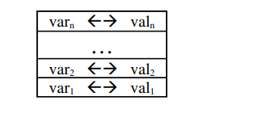
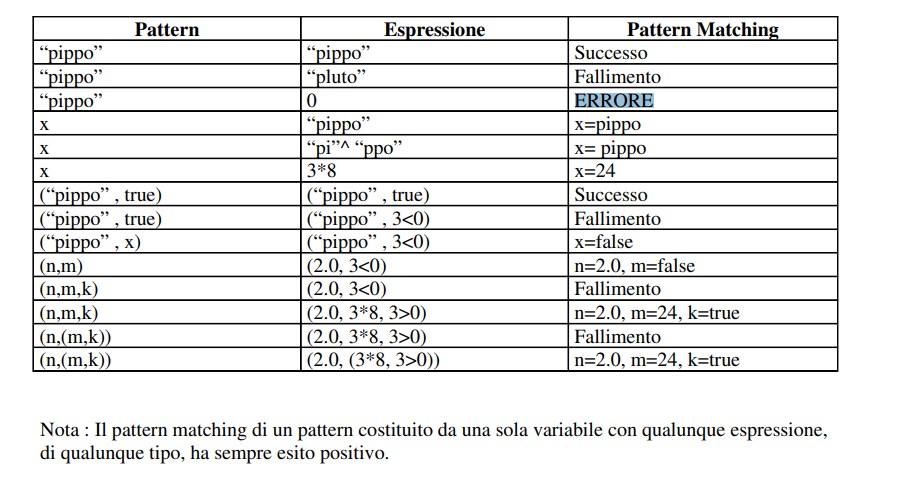
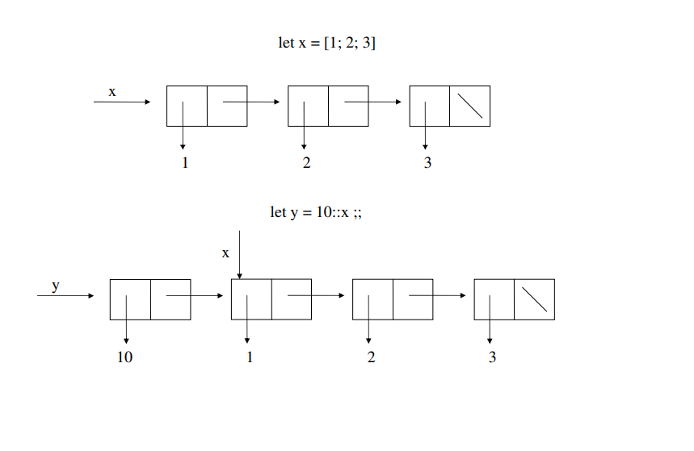
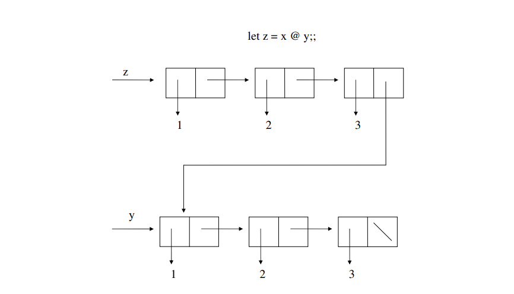
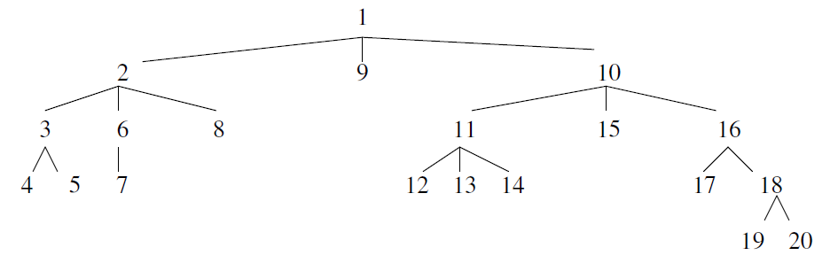
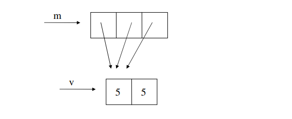

# Ocaml

## Indice

  * [Introduzione](#introduzione)
    + [Imperativo](#imperativo)
    + [Funzionale](#funzionale)
  * [ML](#ml)
    + [Funzioni](#funzioni)
      - [Prodotto Cartesiano](#prodotto-cartesiano)
    + [Funzioni a più argomenti](#funzioni-a-pi--argomenti)
    + [Funzioni che ritornano coppie di valori](#funzioni-che-ritornano-coppie-di-valori)
    + [Funzioni Totali vs Parziali](#funzioni-totali-vs-parziali)
    + [Funzioni Polimorfe](#funzioni-polimorfe)
    + [Applicazione di funzioni](#applicazione-di-funzioni)
    + [Calcolo come riduzione](#calcolo-come-riduzione)
    + [Composizione di Funzioni](#composizione-di-funzioni)
    + [Funzione Costante K](#funzione-costante-k)
    + [Funzioni in forma Currificata](#funzioni-in-forma-currificata)
  * [OCaml](#ocaml)
    + [Interprete](#interprete)
    + [Compilazione](#compilazione)
    + [Commenti](#commenti)
    + [Variabili](#variabili)
    + [Operatori e Tipi](#operatori-e-tipi)
    + [Dichiarazione di Funzioni](#dichiarazione-di-funzioni)
    + [Applicazione di Funzioni](#applicazione-di-funzioni)
    + [Inferenza di Tipi e Ambiente](#inferenza-di-tipi-e-ambiente)
    + [Espressioni e Tipi Semplici](#espressioni-e-tipi-semplici)
    + [Conversione di Tipi](#conversione-di-tipi)
    + [Uguaglianza e Disuguaglianza](#uguaglianza-e-disuguaglianza)
    + [Operatori di Confronto](#operatori-di-confronto)
    + [Espressioni Condizionali](#espressioni-condizionali)
    + [Coppie](#coppie)
    + [Tuple](#tuple)
    + [Costruttori e Selettori di tipo di dato](#costruttori-e-selettori-di-tipo-di-dato)
    + [Funzioni a più argomenti](#funzioni-a-pi--argomenti-1)
    + [Polimorfismo](#polimorfismo)
    + [Schemi di Tipo ed Istanze](#schemi-di-tipo-ed-istanze)
    + [Dichiarazione locale in Funzione](#dichiarazione-locale-in-funzione)
    + [Variabili locali](#variabili-locali)
    + [Ricorsione](#ricorsione)
    + [Input da Tastiera](#input-da-tastiera)
    + [Eccezioni](#eccezioni)
    + [Pattern](#pattern)
    + [Funzioni per Casi](#funzioni-per-casi)
    + [Variabile Muta](#variabile-muta)
    + [Pattern Matching esplicito](#pattern-matching-esplicito)
    + [Funzioni di ordine superiore](#funzioni-di-ordine-superiore)
    + [Funzioni di forma currificata](#funzioni-di-forma-currificata)
    + [Liste](#liste)
      - [Modulo List](#modulo-list)
      - [Dizionario](#dizionario)
      - [In Memoria](#in-memoria)
    + [Random](#random)
    + [Backtracking](#backtracking)
    + [Definizioni di nuovi tipi](#definizioni-di-nuovi-tipi)
      - [Tipi enumerati](#tipi-enumerati)
    + [Alberi](#alberi)
    + [Sequenze di comandi](#sequenze-di-comandi)
    + [Dati Modificabili](#dati-modificabili)
      - [Array](#array)
      - [Record](#record)
      - [Riferimento](#riferimento)
    + [Grafi](#grafi)
      + [Algoritmi di visita e ricerca](#algoritmi-di-visita-e-ricerca)
        - [DFS](#dfs)
        - [BFS](#bfs)
        - [Best-First](#best-first)
        - [Hill Climbing](#hill-climbing)
        - [Branch and Bound](#branch-and-bound)
        - [A*](#a-star)
    + [Cicli](#cicli)
      - [while](#while)
      - [for](#for)
    + [Operazioni su file](#operazioni-su-file)
    + [Modello a Moduli vs Oggetti](#modello-a-moduli-vs-oggetti)
      - [Moduli](#moduli)
      - [Oggetti](#oggetti)


## Introduzione

OCaml è un linguaggio della famiglia Meta Language (ML), sviluppato e distribuito dall’INRIA
(Francia) dal 1984. Supporta diversi stili di programmazione: 

- **Funzionale**
- **Imperativo**
- Ad **Oggetti**

### Paradigmi di programmazione

Esistono diverse tipologie di linguaggi di programmazione. Sotto ogni linguaggio c’è un modello di calcolo, che determina:
- le operazioni eseguibili
- una classe di linguaggi
- uno stile di programmazione (“paradigma” di programmazione)

Un **Paradigmi di programmazione** è uno stile fondamentale di programmazione, ovvero insieme di strumenti concettuali forniti da un linguaggio di programmazione per la stesura del codice sorgente del programma. Definisce il modo in cui il programmatore concepisce e percepisce il programma stesso. Diversi paradigmi si differenziano per i concetti e le astrazioni usate per rappresentare gli elementi di un programma:

- Funzione
- Oggetti
- Variabili
- Vincoli

E per i procedimenti usati per l’esecuzione delle procedure di elaborazione dei dati:

- Assegnazione
- Calcolo
- Iterazione
- Data flow

#### Linguaggi Imperativi

Il modello di calcolo è basato sull'hardware (architettura di Von Neumann) e ha 2 elementi di base: Variabili e Assegnazione. 

**INPUT -> MEMORIA -> OUTPUT**

Programmare vuol dire pianificare il flusso di informazioni.
**Esempio**: in C descrivo tutto il flusso (azione dopo azione) da fare per risolvere un problema. Questa programmazione è basata su **comandi** che operano sulla **memoria** (stato del programma).

Il modello di calcolo determina uno stile di programmazione.
Per capire il programma (e provarne la correttezza) occorre tenere traccia delle
modifiche dello stato.

**Correttezza di un programma**: Un programma è **corretto** se per risolvere il problema `P` produce, per ogni input `X` un output `Y`, tale che tra `X` e `Y` vale sempre la relazione specificata da `P`.

```c
# calcolo del massimo comun divisore
int gcd (int m, int m) {
    while (n != m)
        if (n > m) n = n - m;
    	else m = m - n
    return n;
}
```

#### Linguaggi Dichiarativi

Un programma è più vicino alla descrizione di che cosa si deve calcolare, piuttosto che a come
calcolare.

- Linguaggi di programmazione logica
- Linguaggi di programmazione funzionale (si basa principalmente sulla ricorsione.
Scomposizione in struttura più piccola, dalla soluzione più piccola deduco la soluzione
globale)


#### Programmazione Funzionale

Un programma è un’operazione che associa un input con un output: **un programma è una funzione**.
Possiamo anche dire che è la descrizione di cosa si deve calcolare piuttosto che il come calcolarlo.


Strutture di controllo:

- applicazione di funzione ad un argomento
- composizione di funzioni

I costrutti di base sono *espressioni* e non comandi. Le espressioni sono costruite a partire da espressioni semplici (*Costanti*) tramite *l'applicazione* di operazioni. Si calcola riducendo un'espressione ad un'altra più semplice e così via fino ad ottenere un *Valore*, un'espressione che *non si può più semplificare*.

```ocaml
(6 + 3) x (8 - 2) <- 9 x (8 - 2) <- 9 x 6 <- 54
```

La **valutazione** delle espressioni avviene nel seguente modo:

- Ogni espressione ha un valore
- Non ci sono effetti collaterali (Ricordiamo che _effetto collaterale_ = scrittura di un valore in una certa
locazione di memoria)
- `(6 + 3) x (8 - 2)` viene valutato, ma il valore non viene 'salvato' da nessuna parte

*Idealmente in un linguaggio funzionale puro non ci si appoggia su variabili.*

**La ricorsione è il costrutto di controllo fondamentale !**

***Esempi**:*


```ocaml
let rec gcd (m, n) = if n = m then n
						else if n > m then gcd(n-m, m)
							else gcd(n, m-n);;
```


```ocaml
let rec fact n = 
		if n = 0 then 1
			else n * fact(n-1);;
```

La principale modalità di calcolo è l'applicazione di funzioni, il calcolo procede valutando espressioni e non ci sono effetti collaterali. Un programma è quindi una collezioni di dichiarazioni.
Le *funzioni* sono oggetti di prima classe, possono essere componenti di una struttura dati o far parte degli argomenti di altre funzioni: `let sort (order, lst) = ... let comp (f, g) = ...`. I linguaggi funzionali supportano l'uso di funzioni di ordine superiore: funzioni che prendono funzioni come argomento o ritornano funzioni come valore.
Nei linguaggi funzionali "puri" non esistono strutture di controllo come `for`, `while`, ecc. ma il principale strumento di controllo è la ricorsione !! (IL MAAAALEEE :japanese_ogre:)

## ML

Alcune caratteristiche di ML:

- è un linguaggio interattivo
- a 'scopo statico': determina a tempo di compilazione il valore delle variabili in una dichiarazione
- fortemente tipizzato: ogni espressione ha un tipo (determinato a tempo di compilazione)
- ha inferenza di tipo che gli consente di dedurre quale tipo è un'espressione senza doverlo scrivere esplicitamente
- ha un sistema di tipi polimorfo: una funzione può accettare argomenti di vari tipi.
- ha un meccanismo per la gestione di errori
- ha un potente sistema di moduli
- c’è la possibilità di costruire dati polimorfi (dati generici), di volta in volta istanziati con tipo diverso
- è efficiente
- il codice è più corto, più veloce da scrivere e mantenere

### Funzioni


Una funzione è una regola `F` che associa ogni elemento del *dominio* uno ed un solo elemento del *codominio*. Il tipo di `F` è: `DOMINIO -> CODOMINIO`. 

***Cos'è un tipo?*** Un tipo descrive un insieme di valori e le operazioni che si possono fare su di essi.
Se $A$ è un tipo e $x \in A`$ diciamo che $x$ è di tipo $A$. In breve si scrive: `x: A`.

Alcuni esempi: 

- $3: \ IN$
- $(2, 5): \ IN x IN$
- $(1, 2 , 3): \ IN x IN x IN$ oppure $(1, 2, 3): \ IN^3$

Il tipo $A \rightarrow B$ è l'insieme di tutte le fusioni che hanno come dominio $A$ e codominio $B$.

Alcuni esempi:


```ocam
F: FORME -> COLORI
```

`F` si applica ad un elemento di FORME (argomento della funzione) e ritorna  un elemento di COLORE come valore.


La funzione `square` associa ad ogni numero intero il suo quadrato: $square: \ IZ \rightarrow IN$ quindi $n \rightarrow n^2$.

```
square(0) = 0
square(1) = 1 square(-1) = 1
square(2) = 4 square(-2) = 4
```

In Ocaml una definizione di `square` può essere:

```oca
let square n = n*n;;
```

#### Prodotto Cartesiano

**Definizione Prodotto Cartesiano:** Dati `A = {0, 1, 2}` e `B = {rosso, verde}`, allora `A x B = {(0, rosso), (0, verde), (1, rosso), (1, verde), (2, rosso), (2, verde)}`

Questa è la definizione di prodotto cartesiano.

**Definizione ESTENSIONALE della funzione**: Una funzione `F` è una relazione particolare, è un sottoinsieme del prodotto cartesiano di `DOMINIO x CODOMINIO` che forma un insieme di coppie (detto l'estensione di `F`) `{(x1, y1), (x2, y2), ...}` tali che:

- ogni $x_i$ appartiene al dominio
- ogni $y_i$ appartiene al codominio
- per ogni `x` del dominio, se `(x, y)` e `(x, y')` allora `y = y'`. `x` può essere in coppia con un solo elemento del codominio !
- `F(x) = y` se e solo se la coppia `(x, y)` appartiene all'estensione di `F`

Un esempio di estensione è quella della funzione `square`: `{(0, 0), (1, 1), (3, 9), (-1, 1), ...}`.


#### Funzioni a più argomenti

Sia `times`` la funzione che associa: $(n, m)$ a $n \times m$ per ogni $n, m \in IN$. E definita come segue: 

```ocaml
times = function (n, m) -> n*m;;
```

Qual è il tipo della funzione `times`?
Il suo codominio è `IZ`. Il suo dominio è l'insieme $\{(n, m) | n, m \in IN\}$. Quindi:

```
times: IZ x IZ -> IZ
```

Quando si applica `times` a $(n, m)$ diciamo che `n` è il primo argomento e `m` il secondo, ma in realtà in Ocaml `times` ha un solo argomento: un coppia di numeri. È anche possibile che le funzioni ritornino tuple come risultato e non un singolo valore.

Se una funzione si applica a `n` argomenti, appartenenti a $A_1, A_2, \ldots, A_n$ e ritorna un valore dell'insieme `B`, il suo tipo è: 

```
A1 x A2 x ... x An -> B
```

Il suo dominio è un insieme di tuple di `n` elementi: `{..., (a1, a2, ..., an), ...}`.
La sua estensione è un insieme di tuple con `n + 1` elementi: `{..., (a1, a2, ..., an, b), ...}`.

**FUNZIONI TOTALI:** sono definite per ogni elemento del dominio. <br>
**FUNZIONI PARZIALI:** Una funzione parziale è ovviamente totale se si restringe opportunamente il suo dominio. <br>
**FUNZIONI POLIMORFE**: il tipo può essere polimorfo(generico). In OCaml i tipi generici sono indicati con ‘lettera (apostrofo lettera). Se c’è anche un underscore `_` significa che al primo istanziamento la funzione opera con quel tipo di dato sempre.

#### Funzioni che ritornano coppie di valori

Sia `quorem` la funzione che si applica a due numeri naturali `n` e `m` e che ritorna il quoziente intero e il resto della divisione tra `n` e `m`.

```ocam
let quorem = function (n, m) -> (n / .m, n mod m);;
```

```
quorem(3, 2) = (1, 1)  quorem(3, 3) = (1, 0)
quorem(7, 2) = (3, 2)  quorem(15, 6) = (2, 3)
```

L'estensione di quorem è: `{..., (3, 2, (1, 1)), ..., (3, 3, (1, 0)), ...}`.
C'e da notare che quorem non è definito per gli argomenti `(n, 0)` (non si può dividere per 0).

#### Funzioni Totali vs Parziali

Le funzioni **Totali** sono definite per ogni elemento del dominio. Per ogni `x` nel dominio, esiste una ed una sola coppia `(x, y)` nell'estensione di `F`.

Le funzioni **Parziali** possono essere definite per alcuni elementi del dominio, possono esistere alcuni elementi del dominio `x` per cui non esiste nessuna coppia `(x, y)` nell'estensione di `F`.

Una funzione Parziale diventa Totale se si restringe opportunamente il suo dominio.

`quorem' : IN x (IN - {0}) -> IN x IN` diventa **Totale**.

### Funzioni Polimorfe

Consideriamo la funzione `first`: `let first = function(x, y) -> x;;`
`x` e `y` potrebbero essere di qualunque tipo:

```
first(0, 1) = 0
first(quadrato, rosso) = quadrato
first(0, rosso) = 0
...
```

`first` risulta essere quindi di tipo: 

```
IN x IN -> IN
FORME x COLORI -> FORME
IN x COLORI -> IN
...
```

`first` ha quindi molti tipo:

```
TIPO1 x TIPO2 -> TIPO1
```

`first` si chiama funzione polimorfa. Possiamo identificarlo in modo più generale utilizzando variabili come: 

```
first = alfa x beta -> alfa
```

Ogni tipo di `first` è un'istanza del suo tipo più generale.

### Applicazione di funzioni

```
F(x) = y

F: A -> B
```

`x` è l'argomento della funzione, è di tipo `x: A`; `y` è il valore di ritorno dell'applicazione `F(x)` ed è di tipo `F(x): B`

### Calcolo come riduzione

Calcolare significa ridurre un'espressione ad un Valore. Un valore è un’espressione non
ulteriormente riducibile. I parametri alle funzioni vengono passati per valore.
In pratica si va a sostituire il parametro della funzione con il valore a cui si applica:

```
square(5) ->
(function n -> n*n)5 ->
5 * 5 ->
25
```

```
first(15, 20) ->
(function (n, m) -> n)(15, 20) ->
15
```

### Composizione di Funzioni


Date

```
G: A -> B	e 	F: C -> A
```

due funzioni, allora

```
H = G o F: C -> B
```

e se `x: C` allora

```
(G o F)(x) = G(F(x))
```

Quindi `(G o F)(x): B`.

La funzione `H` è la composizione di due funzioni: `G` e `F`. Questo vuol dire che il risultato è dato prima dall'applicazione di `F` a `x`, al risultato di questo si applica `G`. Risulta quindi che il tipo di `G o F` è `B` perché `C -> A -> B`.

La composizione di funzioni è un'operazione che prende in ingresso una coppia di funzioni `A -> B` e `C -> A`  e riporta una funzione di tipo `C -> B`.

La composizione è quindi una funzione:

- con dominio `(A -> B) x (C -> A)`
- con codominio `C -> B`

```
(A -> B) x (C -> A) -> (C -> B)
```

È una funzione polimorfa, con il suo tipo generale:

```
(alfa -> beta) x (gamma -> alfa) -> (gamma -> beta)
```

Le funzioni che hanno funzioni come argomenti o che ritornano altre funzioni si dicono **Funzioni di ordine Superiore**.

```ocaml
let componi (g, f) = function n -> g(f n);;
```

### Funzione Costante K

Una funzione costante è una funzione che ritorna sempre lo stesso valore costante `K`.

```ocaml
let k = function x -> 0;;

k 20 -> 0
k 10 -> 0
```

### Funzioni in forma Currificata

Data una funzione che ha un parametro composto da 2 valori, ne sfruttiamo uno per utilizzarlo tramite un'altra funzione.

```ocaml
let add a b = a+b;;     (* val add: int -> int -> int = <fun> *)

let add3 = add 3;;      (* val add3 : int -> int = <fun> *)

(* Sfrutto add3 per usare la funzione add con un parametro fisso di 3 e un'altro da dovergli passare, per add, con cui fare la somma *)
add3 2;;                (* - : int = 5 *)    
```

E' quindi una funzione che, applicata a `n`, ritorna una funzione che, applicata a `m`, riporta il valore `n + m`.

```ocaml
let sum (n, m) = n + m 
let plus n m = n + m
```

plus è la forma currificata di sum.
```ocaml
Let somma1 x y = x+y
Let somma2 n = function m -> n+m
```
Due modi per dire la stessa cosa: funzione che restituisce una funzione che applicata a m riporta
m+m.

Ogni funzione su tuple si può riscrivere in forma currificata:
```ocaml
let mult(n,m) = n*m;;                      
-val mult : int * int -> int = fun 
let times n m = n*m;;
-val mult : int -> int -> int = fun
```

## OCaml

### Interprete

```
# <ESPRESSIONE> ::
-: <TIPO> = <VALORE>
```

OCaml dispone di una modalità interattiva, utilizzabile da terminale con il comando `ocaml`. Il simbolo `#` è il prompt di ocaml ed in questa modalità aspetta un espressione da valutare. Ogni espressione deve terminare con il simbolo `;;`. Una volta scritta un espressione e premuto il tasto ENTER, ocaml valuterà l'espressione e stamperà a  video il risultato dell'espressione con il tipo ed il valore di ritorno. 

Per esempio:

```ocaml
# 3*8;;
-: int = 24
```

È possibile caricare in memoria un file già scritto con il comando `use`:

```ocaml
# use "libreria.ml";;
```

Per uscire dall'interprete si usa il comando `exit`:

```ocaml
# exit 0;;
```

### Compilazione

È possibile compilare un file `.ml` con il seguente comando:

```bash
ocamlc file.ml -o executable.exe 
```

Per esempio, dato il seguente file:

```ocaml
let main () = 
		print_endline "HELLO WORLD !";;
		
main();;
```

possiamo compilarlo con `ocamlc hello.ml -o hello.exe` ed eseguirlo con `hello.exe`.
In linux possiamo omettere l'estensione finale (nella fase di compilazione) e lanciare il programma compilato con `./hello`.

### Commenti

I commenti in OCaml si scrivono tra `(* *)`.

```ocaml
(* questo e' un commento prima di un'espressione *)
let x = 5;;

(* questo e' un commento
su piu' linee *)

(* let x = 20;;*)
```

### Variabili

Una variabile si dichiara come segue:

```ocaml
let <VARIABILE> = <ESPRESSIONE>;;
```

Per esempio:

```ocaml
let base = 3;;
let altezza = 4;;
let area = base * altezza;;

let three = 3;;
three * 8;;
```

### Operatori e Tipi

In OCaml gli operatori cambiano in base al tipo di dato!!!
Questo simbolo `*` è diverso da `*.`!

Differenza tra operatori:

- operatori sugli interi : `*`, `+`, `-`, `/`.
- operatori sui reali (float): `*.`, `+.`, `-.`, `/.`

Gli operatori sui reali hanno un `.` dopo l'operatore.

È molto importante utilizzare i giusti operatori in base al tipo, altrimenti avremo un errore:

```ocaml
# let pi = 3.14;;
val pi: float = 3.14

# let r = 2.0;;
val r: float = 2.

let area = pi * r * r;;
Error: This expression has type float but an expression was expected of type int

let area = pi *. r *. r;;
val area: float = 12.56
```

### Dichiarazione di Funzioni

```ocaml
let <NOME FUNZIONE> = function <PARAMETRO FORMALE -> <ESPRESSIONE>;;
```

Un esempio di dichiarazione di una funzione:

```ocaml
# let area_quadrato = function n -> n*n;;
val area_quadrato : int -> int = <fun>
```

`area_quadrato` è una funzione da interi a interi ed applicata ad un intero `n` (che rappresenta il lato di un quadrato) riporta l'area del quadrato.
Il valore di una funzione NON è stampabile. Ocaml riporta solo il fatto che si tratta di una funzione `<fun>`.

Dato che ML ha un meccanismo di inferenza di tipo riesce a capire che tipo è una data espressione. Per l'esempio di prima capisce che si tratta di una funzione `int -> int` per via dell'operatore `*`. `*` è un operatore tra INTERI e quindi il dominio e il codominio della nostra funzione non possono che essere interi!

C'è anche un modo alternativo per dichiarare le funzioni:

```ocaml
let <NOME FUNZIONE> <PARAMETRO FORMALE> = <ESPRESSIONE>;;
```

Per esempio:

```ocaml
# let area_quadrato n = n * n;;
val area_quadrato : int -> int = <fun>
```

Prendiamo in considerazione la funzione che raddoppia un dato intero:

```ocaml
# let double x = 2*x;;
val double : int -> int = <fun> 
```

Ml ha dedotto il tipo della funzione perché se `x` viene moltiplicato per 2 (tramite l'operatore di moltiplicazione tra interi `*`), allora `x` deve essere per forza un intero (il dominio è INT). Il valore della funzione , `x*2`, è quindi di tipo int, perciò' il codominio è di tipo INT.

### Applicazione di Funzioni

Dopo aver dichiarato una funzione questa va applicata ad un argomento.

```ocaml
# area_quadrato 5;;
-: int = 25

# double 3;;
-: int = 6
```

Considerando le due funzioni:

```ocaml
# let pi = 3.14;;
val pi: float = 3.14

# let area r = pi *. r *. r;;
val area: float -> float = <fun>

# let square r = r *. r;;
val area: float -> float = <fun>
```

L'espressione `area(square 3.0)` risulta corretta perché':

- `square: float -> float = <fun>`, la funzione `square` va da `float` in `float` ed è di tipo funzione
- `square 3.0: float`, restituisce un `float`
- `area: float -> float = <fun>`, è una funzione che va da `float` in `float`
- Quindi il risultato di `square 3.0` che è un `float` può essere passato alla funzione `area` che come parametro richiede un `float`.

È molto importante tenere a mente che l'applicazione di funzioni è **associativa a sinistra**!!!
In mancanza di parentesi l'espressione `area square 3.0` viene interpretata come `(area square) 3.0` che non è corretta !!

- `square: float -> float = <fun>`, la funzione `square` va da `float` in `float` ed è di tipo funzione
- `area: float -> float = <fun>`, è una funzione che va da `float` in `float`
- `area` non può ricevere come parametro una funzione !!! scrivere `area square` equivale passare una funzione ad `area` !
- Supponendo che `area square` fosse un'espressione corretta (quindi tipo`float`) non andrebbe comunque bene in quando non sarebbe di tipo funzione !!! Non si può applicare un `float` ad un `float`, si possono applicare solo le funzioni !!!

### Inferenza di Tipi e Ambiente

ML possiede un meccanismo di inferenza di tipi che gli permette di capire il tipo di un'espressione senza che questo deve essere scritto in modo esplicito. Lo fa nel seguente modo:

- OCaml controlla che l'espressione sia corretta: se è possibile determinarne il tipo
- Ne determina il tipo
- Se si tratta di un'espressione ne calcola il valore e lo stampa
- Se si tratta di una dichiarazione estende l'ambiente di valutazione con un nuovo "legame"

Ogni esecuzione di un programma in OCaml viene fatta all'interno di un ambiente: un insieme di legami `variabile - valore` contenute all'interno di una tabella.



L'ambiente di esecuzione di default si chiama `Pervasives` e contiene alcune definizioni come `not`, `mod`, ecc.

Ogni valutazione di una nuova dichiarazione va a modificare l'ambiente aggiungendo un nuovo legame:

```ocaml
let two = 2;;
let three = two + 1;;
```

Valuta le espressioni ed aggiunge nuovi legami all'ambiente:


Questo viene gestito come una PILA e le nuove inserzioni vengono aggiunte in cima. Se aggiungo un nuovo valore `let two = "due";;` vado ad aggiungerlo in cima alla pila oscurando il vecchio legame `two`. Quindi da ora in poi, se utilizzerò `two` non sarà più un intero ma una stringa !


ML è un linguaggio a scopo statico, determina a tempo di compilazione il valore delle variabili di una dichiarazione !


In questo caso, anche se la variabile `six` è cambiata nel tempo, il valore di `sixtimes` è stato già calcolato prima con `six = 6`, quindi rimarrà quello sempre.

Se prendiamo la seguente chiamata `# sixtimes (2+1);;` viene creato il legame Provvisorio `n - 3` per la valutazione di `sixtimes`:


### Espressioni e Tipi Semplici

Un tipo è un insieme di valori e descrive le varie operazioni che possono essere fatte su quei valori.

- **`int`** :

  - e.g: `0`, `-23`, `14` (è a 31 bit)
  - Operazioni: `+ - * / mod succ pred ...`

- **`float`**:

  - e.g: `0.01, 3.0, 5., -4.0, 7E-5`
  - Operazioni: `*. -. *. /. sqrt sin ...`

- **`bool`**:

  - e.g. `true false`
  - Operazioni: `not && ||`
  - Note: viene effettuata una valutazione `circuited lazy`:
    - `E && E'`, `E'` viene valutato solo se `E = true`
    - `E || E'`, `E'` viene valutato solo se `E = false`

- **`char`**:

  - e.g.: `'a' 'b' '9' ' '`

  - Note: `# Char.code 'A';;` restituisce il valore intero della tabella ASCII `-: int = 65`. Si può fare anche il contrario: `# Char.chr 65;;`.
    ```ocaml
    # Char.code 'A';;
    -: int = 65 
    
    # Char.chr 65;;
    -: char = 'A' 
    ```

- **`string`**:

  - e.g.: `"pippo" "pluto" "12Ev"`

  - Operazioni: `^` (concatenazione)

  - Note: si possono concatenare due stringhe con l'operatore `^` e si può prendere un carattere di una stringa con `.[index]`. Si può trasformare un INT in stringa con `string_of_int` e viceversa `int_of_string`.
    ```ocaml
    # "programmazione " ^ "funzionale";;
    -: string = "programmazione funzionale"
    
    # "ABCDEFG".[2];;
    -: char = 'C' 
    
    # string_of_int 45;;
    -: string = "45" 
    
    # int_of_string "45";;
    -: int = 45
    ```

- **`unit`**:

  - e.g.: `()`

### Conversione di Tipi

Si possono effettuare conversioni di tipi con le seguenti funzioni:

```
- int_of_float    (* Trasforma float in int *)
- float_of_int    (* Trasforma int in float *)
- string_of_int   (* Trasforma int in string *)
- string_of_float (* Trasforma float in string *)
- int_of_string   (* Trasforma string in int *)
- float_of_string (* Trasforma string in float *)
- int_of_char     (* Trasforma char in int *)
- char_of_int     (* Trasforma int in char *)
```

### Uguaglianza e Disuguaglianza

L'operatore di uguaglianza è `=` (non `==` come in molti linguaggi normali :upside_down_face:).

È definito per tutti i tipi di dato tranne che per le funzioni !

```ocaml
# 3*8 = 24;;
-: bool = true

# "pippo" = "pi" ^ "ppo";;
-: bool = true

# true = not true;;
-: bool = false

# true <> false;;
-: bool = true


# let double x = x*2;;
val double : int -> int = <fun>

# let treble x = x*3;;
val treble : int -> int = <fun>

# double = treble;;
Exception: Invalid_argument "equal: functional value" 
```

### Operatori di Confronto

Gli operatori di confronto sono definiti per tutti i tipi di dato tranne che per le funzioni.

```ocaml
# 3*8 <= 30;;
- : bool = true

# 6.0 > 7.8;;
- : bool = false

# 6>7.8;;
Characters 2-5:
 6>7.8;;
 ^^^
This expression has type float but is here used with type int

# false < true;;
- : bool = true

# 'A' >= 'B';;
- : bool = false

# "acb" < "def";;
- : bool = true


# let double x = x*2;;
val double : int -> int = <fun>

# let treble x = x*3;;
val treble : int -> int = <fun>

# double = treble;; 
Exception: Invalid_argument "equal: functional value" 
```

### Espressioni Condizionali

```ocaml
if E then F else G
```

È un espressione condizionale se:

- `E` è di tipo `bool`
- `F` e `G` hanno lo stesso tipo

Il tipo di un `if` è dato dal tipo di `F` e `G` e il suo valore è:

- il valore di `F` se `E` è `true`
- il valore di `G` se `E` è `false`

Questo non è un costrutto ma un'espressione !! La parte `else` deve esserci per forza !

Nel valutare un if:

- se `E` è `true`, `G`  non viene valutata
- se `E` è `false`, `F`  non viene valutata

Alcuni esempi di valutazione di `if`:

```ocaml
# 4 + (if 1 < 0 then 3 * 8 else 5 / 2);;
-: int = 6 

4 + (if 1 < 0 then 3 * 8 else 5 / 2)
===> 4 + (if false then 3 * 8 else 5 / 2)
===> 4 + (5 / 2)
===> 4 + 2
===> 6 
```

```ocaml
# let sign n = if n > 0 then 1
 				else if n = 0 then 0
 					else -1;;
val sign : int -> int = <fun>
```

```ocaml

# let sort (x,y) = if x < y then (x,y) 
					else (y,x);;
val sort : 'a * 'a -> 'a * 'a = <fun>

# sort (5,2);;
-: int * int = (2,5) 

# sort(4, 5.);;
Error: This expression has type float but an expression was expected of type int
```

### Coppie

Un coppia ordinata si scrivere `(E, F)`, dove `E` è il primo elemento della coppia ed `F` è il secondo.
Il tipo delle coppie ordinate è dato da `t1 x t2`, dove `t1` è il tipo del primo elemento e `t2` è il tipo del secondo elemento (`t1 x t2` è il prodotto cartesiano). `x` viene chiamato costruttore di tipo e serve a costruire il tipo di una coppia ordinata.

```ocaml
# (5,8);;
-: int * int = (5, 8)

# ("pippo",7);;
-: string * int = ("pippo", 7)

# (true,80);;
-: bool * int = (true, 80) 
```

### Tuple

Le tuple sono coppie con più di due elementi ed una tupla può essere un elemento di una tupla:

```ocaml
# (true,5*4,"venti");;
-: bool * int * string = (true, 20, "venti")

# ((if 3<5 then "true" else "false"), 10.3, 'K', int_of_string "50");;
-: string * float * char * int = ("true", 10.3, 'K', 50)

# (true, ("pippo",98), 4.0);;
-: bool * (string * int) * float = (true, ("pippo", 98), 4) 
```

`*` non è associativo !! Ad esempio, il tipo `bool * (int * string)`  è diverso da `(bool * int) * string`. E.g.: `(true, (10, "stringa"))` è diverso da `((true, 10), "stringa")`!!!

Le funzioni possono essere un elemento di una tupla dato che sono oggetti di prima classe:

```ocaml
# (double, (true && not false, 6*5));;
-: (int -> int) * (bool * int) = (<fun>, (true, 30)) 
```

### Costruttori e Selettori di tipo di dato

Ogni tipo di dato è caratterizzato da un insieme di:

- **Costruttori**: costanti e operazioni che "costruiscono" valori di quel tipo
- **Selettori**: operazioni che "selezionano" componenti da un valore del tipo

I costruttori per i tipi di dato semplice sono i valori: `6 - int`, `5.0 - float`, `"stringa" - string`, ecc.

Il costruttore per le coppie ordinate è `(,)`: le parentesi e la virgola.

Si possono selezionare i componenti di una coppia con `fst`e `snd`:

```ocaml
# let t = (true, ("pippo", 98));;
val t : bool * (string * int) = true, ("pippo", 98)

# fst t;;
-: bool = true

# snd t;;
-: string * int = ("pippo", 98)

# snd (fst t);;
-: string = "pippo"

# snd (snd t);;
-: int = 98 
```

Queste due funzioni sono polimorfe:

```ocaml
# fst;;
-: 'a * 'b -> 'a = <fun>

# snd;;
-: 'a * 'b -> 'b = <fun> 
```

### Funzioni a più argomenti

Ocaml accetta come input ad una funzione un unico parametro o una coppia/tupla. Per far accettare ad una funzione più parametri si usa:

```ocaml
let quoremC n m = (n/m, n mod m);;
let quoremC = function n -> function m -> (n/m, n mod m);;

# quoremC 17 5;;
-: int * int = (3, 2)

# quoremC 17 ;;
-: int -> int * int = <fun>
```

Altrimenti il modo che sembra essere più carino (ed è quello visto sempre fin ora):

```ocaml
let quorem (n,m) = (n/m, n mod m);;
quorem : int * int -> int * int

# quorem (17,5);;
-: int * int = (3, 2) 
```

### Polimorfismo

Le funzioni che accettano ogni tipo di dato sono chiamate polimorfe (lo abbiamo visto prima). Un esempio:

```ocaml
# let first (x,y) = x;;
val first : 'a * 'b -> 'a = <fun> 
```

A volte OCaml, per 'far quadrare i conti' unifica i tipi:

```ocaml
# let sort1 (x, y, n) = if n > 5 then (x,y) else (y,x);;
val sort1 : 'a * 'a * int -> 'a * 'a = <fun>
```

Qui capisce che `n` è un intero perché viene confrontato con `5` (che è un intero). `x` e `y` vengono unificati (tutti e due del tipo `'a`) per "far tornare i conti" con l'espressione `if` (la parte then e else devono avere lo steso tipo). 

### Schemi di Tipo ed Istanze

`'a * 'b -> 'a` è uno schema di tipo: indica un insieme infinito di tipi, tutti quelli della forma: `T1 * T2 -> T1`. Ogni tipo che si ottiene sostituendo `'a` con un tipo e `'b` con un tipo è un'istanza di `'a * 'b -> 'a`:

- `int * bool -> int`
- `int * int -> int`
- `(int * bool) * (int -> bool) -> (int * bool) `
- ecc.

### Dichiarazione locale in Funzione

È possibile dichiarare una variabile locale in una funzione con:

```ocaml
let x = E in F;;
```

dove `E` e `F` sono espressioni. Il tipo di questa espressione è il tipo di `F`, il valore è quello che ha `F` quando `x` è sostituto da `E`.

Per esempio, prendiamo il seguente problema: 

_dati tre numeri interi, n, m e k, calcolare il quoziente e il resto della divisione di n + m per k_.

Possiamo risolverlo con:

```ocaml
let soluzione (n,m,k) = let somma = n + m in (somma/k, somma mod k);;
```

In pratica, sostituisce somma con il valore dato da `n + m`.

Questo problema può essere risolto in vari altri modi:

- con una "funzione anonima":
  ```ocaml
  let soluzione(n,m,k) =
  	(function somma -> (somma/k, somma mod k)) (n+m);;
  ```

- con una funzione ausiliaria:
  ```ocaml
  let quorem(m,n) = (m/n, m mod n);;
  let soluzione(n,m,k) = quorem(n+m,k);;
  ```

### Variabili locali

Nell'espressione vista prima `let x = E in F`, `x` è una variabile locale:`x` ha un valore (quello di `E`) solo all'interno dell'espressione `F`; quando questa viene valutata tutta ,`x` non ha più valore.

```ocaml
# let x = 1+2 in x*8;;
-: int = 24

# x;;
Characters 0-1: x;;
 ^
 Unbound value x 
```

Il "legame" locale sovrascrive legami globali in un ambiente:

```ocaml
# let x="pippo";;
val x : string = "pippo"

# let x="pluto" in "ciao "^x;;
-: string = "ciao pluto"

# x;;
-: string = "pippo" 
```

L'espressione `let x = E in F` si calcola nel seguente modo:

- viene calcolato il valore di `E`
- la variabile `x` viene provvisoriamente legata al valore di `E`
- tenendo conto di questo legame, viene calcolato il valore di `F` che sarà il valore di tutta l'espressione
- il legame provvisorio `x` viene sciolto ed `x` torna ad avere il valore di prima o nessun valore (dipende se `x` era già stato assegnato o no)

Un altro problema dove risulta utile utilizzare una variabile locale (dichiarazione locale) è il seguente:

_Dato il seguente codice, il valore `gdc(n,d)` viene calcolato 2 volte._

```ocaml
(* gcd : int * int -> int *)
let rec gcd (m,n) =
		if n=m then n
		else if n>m then gcd(n-m,m)
 		else gcd(n,m-n);;
 		
(* fraction : int * int -> int * int *)
let fraction(n,d) = (n / gcd(n,d), d / gcd(n,d)) ;;
```

Possiamo risolverlo con una dichiarazione locale:

```ocaml
let fraction (n,d) =
	let com = gcd(n,d)
		in (n/com, d/com);;

# fraction(32,28);;
-: int * int = (8, 7) 
```

<!-- dopo sta roba, Marcugini mette alcuni esempi di mini problemi da risolvere, la cosa divertente è che il procedimento per risolverli lo scrive in maniera sequenziale ... Sarà mica un indizio di quanto fa schifo sto paradigma ??? -->

### Ricorsione

Nei linguaggi funzionali puri non esistono costrutti per effettuare cicli come `while` o `for`. Si utilizza quindi la ricorsione. 
<!-- se non ci hanno manco messo i cicli for e si fa tutto con la ricorsione è un ottimo motivo per non usarle questo paradigma ! Un pò come i carciofi, se è così noioso pulirli e lavarli perché mangiarli ?? -->

Quando si dichiara una funzione ricorsiva è necessario specificarlo tramite la parola chiave `rec`.

```ocaml
(*errata dichiarazione*)
# let fact n =
		if n=0 then 1
		else n * fact(n-1);;
		
Characters 36-40:
let fact n = if n=0 then 1 else n * fact(n-1);;
 ^^^^
Unbound value fac

(*corretta dichiarazione con parola chiave rec*)
# let rec fact n =
		if n=0 then 1
		else n * fact(n-1) ;;
val fact: int -> int = <fun>
```

È anche possibile implementare questo algoritmo in modo "iterativo", che è un po una cazzata perché non è proprio iterativo ma in verità è sempre una merda ricorsiva solo che sfrutta una funzione ausiliaria e si chiama "ricorsione in coda". È utile perchè se si deve usare la ricorsione c'è il rischio di creare "Stack overflow" a causa del numero di chiamate che rimangono attive in contemporanea. Con la ricorsione di coda invece si evita totalmente queso problema. Una barca di stronzate :robot:. 

```ocaml
let rec aux (n,f) =
		if n = 0 then f
		else aux(n-1, f*n);;
		
let fact n = aux(n,1);;
```

Utilizzando le variabili locali può diventare ancora più incomprensibile :rocket: 

```ocaml
let fact n = 
	let rec aux(n, f) = 
			if n = 0 then f
			else aux(n-1, f*n)
		in aux(n,1);;
```

Quando un problema P1 viene convertito in un altro P2 in modo che la soluzione di P2 sia identica alla soluzione di P1, allora si dice che P1 è stato ridotto a P2 (P2 è una riduzione di P1).

Quando una funzione ricorsiva è definita in modo tale che tutte le chiamate ricorsive sono riduzioni, allora la funzione viene detta Ricorsiva Di Cosa (Tail Recursive).

### Input da Tastiera

Per leggere caratteri da tastiera si utilizzano le seguenti funzioni:

```ocaml
read_line: unit -> string
read_int: unit -> int
read_float: unit -> float
```

Un esempio:

```ocaml
# let x = read_int();;
45
val x: int = 45

# let x = read_line ();;
pippo e pluto
val x: string = "pippo e pluto"

# let x = read_int ();;
3pippo
Exception: Failure "int_of_string". 
```

Di seguito un esempio su una funzione ricorsiva che calcola il massimo di una serie di interi letti da tastiera:

```ocaml
(*funzione ausiliaria*)
let rec ciclo (k,m) =
		if k=0 then m
		else let x=read_int()
			in ciclo(k-1,max m x);;

(*funzione principale che avvia il ciclo*)
let max_n (n) =
		if n<=0 then 0
		else ciclo(n-1,read_int())
```

### Eccezioni

Ocaml mette a disposizione una gestione delle eccezioni per segnalare problemi, come per esempio la funzione fattoriale definita prima che, se viene chiamata con un numero negativo, va in stack overflow! Modificare la funzione per far si che accetti anche i numeri negativi vorrebbe dire creare una nuova funzione che non è più il fattoriale classico (gli si va a cambiare il dominio). Quindi si possono usare le eccezioni.

Ne esistono di default come: `Match failure`, `Division by zero`, ecc., ma se ne possono dichiarare anche di nuove come:

```ocaml
exception NegativeNumber;;
```

Il nome delle eccezioni deve iniziare **SEMPRE** con una lettera maiuscola !

Per lanciare un eccezione si usa la parola chiave `raise`:

```ocaml
exception NegativeNumber;;

let rec fact n =
	if n < 0 then raise NegativeNumber
	else if n=0 then 1
	else n * fact (n-1) ;;
	
# fact 3;;
-: int = 6

# fact (-1);;
Exception: NegativeNumber. 
```

Se durante il calcolo di un'espressione viene sollevata un'eccezione il calcolo termina immediatamente e il resto dell'espressione non viene valutata.

Le eccezioni possono essere catturate con il costrutto `try with`:

```ocaml
# try 4 * fact(-4) with NegativeNumber -> 0;;
-: int = 0
```

Le eccezioni possono essere argomento di funzioni o valori di funzioni.
Le eccezioni sono particolari e "rompono" la tipizzazione forte: possono fare parte di un else alterando la regola "il tipo di then e quello di else devono essere uguali".

```ocaml
exception ValoreZero;;
let positivo n = 
	if n > 0 then true
	else if n < 0 then false
	else raise ValoreZero ;;
```

Un esempio di come utilizzare le eccezioni è dato dal seguente problema:

_Leggere da tastiera una sequenza di numeri interi separati dal carattere ENTER, che termina con un qualsiasi carattere non numerico e  calcolarne la somma_

```ocaml
let rec aux tot =
	try
		let x = read_int()
		in aux (tot+x)
	with Failure "int_of_string" -> tot ;;

let main () = aux 0;;
```

Le eccezioni possono restituire del testo arbitrario quando sollevate, come mostrato nel seguente caso:

```ocaml
exception NegativeNumber of string;;

let rec fact n = 
  if n < 0 
    then raise (NegativeNumber "Inserito numero negativo")
    else if n = 0 
      then 1 
      else n * fact (n-1) ;;

# 4 * fact(-1);;
Exception: NegativeNumber "Inserito numero negativo".
```


### Pattern

Un pattern è un'espressione costituita da variabili e costruttori di tipo:

- x
- "pippo"
- 2.0
- (x, y)
- (x, true, y)

Tutti questi sono pattern perché sono composti da costruttori di tipo  e variabili: `(x, true, y)` è un pattern perché `x`  e `y` sono variabili, `true` è un costruttore di bool e `(,,)` è un costruttore di tuple.

Non sono pattern i seguenti in quanto non sono costruttori, ne variabili ma espressioni:

- x+y
- -n

In un pattern non possono esserci più occorrenze di una variabile (ad eccezione della variabile muta ????????): `(x,x)` non è un pattern anche se è composto da costruttori di tipo e variabili, perché compare 2 volte la variabile `x`.

Sono utili per passare più argomenti alle funzioni, in Ocaml le funzioni accettano un solo parametro !!

La funzione definita prima quorem con uso di pattern:

```ocaml
let quorem (n,m) = (n/m, n mod m);; 
```

La stessa funzione senza uso di pattern:

```ocaml
let quorem pair =
	((fst pair)/(snd pair), (fst pair) mod (snd pair));; 
```

**Pattern matching**: un valore `V` è conforme ad un pattern `P` se è possibile sostituire le variabili in P con sottoespressioni di V in modo tale da ottenere `V` stesso.
Viene quindi confrontata un'espressione `E` con il pattern `P` e:

- il confronto ha successo se il valore `V` di `E` è conforme al pattern P
- in caso di successo, viene stabilito come sostituire le variabili del pattern in modo da ottenere `V`



Quando si dichiara un variabile con:

```ocaml
let x = <ESPRESSIONE>
```

`x` in verità è un pattern, quindi la forma generale di una dichiarazione di variabile in realtà è:

```ocaml
let <PATTERN> = <ESPRESSIONE>
```

Lo stesso vale per le funzioni ! L'argomento della funzione in realtà è un pattern:

```ocaml
function <PATTERN> -> <ESPRESSIONE>
```

Un esempio dove `(n,m)` è il pattern:

```ocaml
let quorem = function (n,m) -> (n/m, n mod m) ;;
let quorem (n,m) = (n/m, n mod m) 
```

### Funzioni per Casi

OCaml mette a disposizione una definizione di funzioni ancora più generale di quella vista fin ora: la definizione per casi.

Fin ora abbiamo definito una funzione come:

```
fact n:
	se n = 0 allora ritorna 1
	altrimenti ritorna n * fact(n-1)
```

Possiamo anche definire una funzione come:

```
fact è quella funzione che
	applicata a 0 ritorna 1
	applicata a un altro intero ritorna n * fact(n-1)
```

In pratica:

```ocaml
let rec fact = function
	0 -> 1
	| n -> n * fact(n-1);;
```

La forma di definizione per casi generale risulta:

```ocaml
function
	P1 -> E1
	| P2 -> E2
	...
	| Pn -> En
```

Quando si applica una funzione definita per casi ad un valore `E` succede:

- `fact E`
- Viene calcolato il valore `V` dell'espressione `E`
- il valore viene confrontato con il primo pattern: 0, se è conforme allora ritorna 1
- se non è conforme al pattern 0, viene confrontato con il pattern successivo: `n`. In questo caso essendo sempre conforme, `n` prende temporaneamente il valore di `V` (una dichiarazione locale in pratica), si calcola `n * fact (n-1)` e si ritorna il valore ottenuto
- il legame `n` viene sciolto
- se il valore `V` non è conforme a nessun pattern ritorna un errore

### Variabile Muta

> la _ è muta bifolco !

Prendiamo la definizione di questa funzione come esempio:

```ocaml
let xor = function 
		(true,q) -> not q
 		| (p,q) -> q;; 
```

Il secondo pattern contiene la variabile `p` che nell'espressione non viene mai utilizzata ! Nella valutazione del pattern matching viene creato un legame provvisorio inutile. È possibile quindi utilizzare la variabile muta `_` per risolvere questo problema:

```ocaml
let xor = function 
		(true,q) -> not q
 		| (_,q) -> q ;;
```

Così facendo, non viene creato nessun legame temporaneo per `_`, ma solo per la variabile che veramente si sta utilizzando: `q`.

La variabile muta è un pattern ed è l'unica che può comparire più volte all'interno di un pattern. Il pattern matching con la variabile muta ha sempre senso, ma non viene mai creato alcun nuovo legame. È importante notare che la variabile muta non può comparire all'interno delle espressioni, ma solo nei pattern !!

Un esempio:

```ocaml
xor (false, true);;
```

- Viene valutato il pattern matching tra `(true, q)` e `(false, true)`, che fallisce dato che `true != false`
- Viene valutato il pattern matching tra `(_, q)` e `(false, true)`, che ha successo (pattern matching con `_` ha sempre successo) e viene creato il valore provvisorio `q - true`
- Viene valutata l'espressione `q` con il nuovo legame
- Viene ritornato il valore di `xor(false, true)`
- Viene sciolto il legame provvisorio `q - true`


### Pattern Matching esplicito

Abbiamo un ulteriore forma per definire le funzioni con il pattern matching:

```
xor(p, q):
	a seconda della forma di p:
		se p ha forma true, ritorna il valore di not q
		in tutti gli altri casi, ritorna il valore di q
```

Questo è possibile con le parole chiavi: `match <ESPRESSIONE> with`:

```ocaml
let xor (p,q) = 
		match p with
            true -> not q
            | _ -> q 
```

La forma generale è quindi:

```ocaml
match E with
	P1 -> E1
	| P2 -> E2
	...
	| Pn -> En
```

- I pattern `P1 ... Pn` devono essere tutti dello stesso tipo e dello stesso tipo di `E`
- Le espressioni `E1 ... En` devono essere tutte dello stesso tipo `T`
- Il tipo dell'espressione `match ...` è dato dal tipo delle espressioni `E1 ... En` (`T`)

Anche in questo caso, se il match fallisce per tutti i `P` allora si ha un errore.

Ocaml si rivela essere intelligente e ci suggerisce, tramite un warning, se definiamo pattern matching non esaustivi:

```ocaml
# let xor(p,q) = 
		match p with
			true -> not q;;
			
Characters 15-43:
Warning: this pattern-matching is not exhaustive.
Here is an example of a value that is not matched:
false
```

L'espressione è comunque valida e possiamo continuare ad usarla ma:

```ocaml
# xor(false,true);;
Exception: Match_failure ("", 15, 43). 
```

### Funzioni di ordine superiore

In Ocaml le funzioni sono oggetti che possono essere passati ad altre funzioni, far parte di strutture dati o essere il valore di ritorno di funzioni. Si chiamano oggetti di prima classe.

```ocaml
(*funzioni che fanno parte di strutture dati*)
# let double x = x * 2;;
val double : int -> int = <fun>

# let treble x = x * 3;;
val treble : int -> int

# let coppia = (double,treble);;
val coppia : (int -> int) * (int -> int) = <fun>, <fun>

(*funzioni come parametri di altre funzioni*)
# let apply (f,x) = f x;;
val apply : ('a -> 'b) * 'a -> 'b = <fun>

# let y = (double,7);;
val y : (int -> int) * int = <fun>, 7

# apply y;;
-: int = 14 

(*funzioni come valori di ritorno*)
# let k a = function x -> a;;
val k : 'a -> 'b -> 'a = <fun>

# (k 3) 0;;
-: int = 3

# let c3 = k 3 ;;

# let f = k true in f "pippo";;
-: bool = true 
```

Le funzioni che accettano come parametro altre funzioni si chiamano Funzioni di ordine superiore

### Funzioni di forma currificata

Le funzioni su tuple si possono scrivere come una funzione che "consuma un argomento alla volta".
Prendiamo per esempio il metodo con cui abbiamo sempre scritto le funzioni con tuple fino adesso:

```ocaml
# let mult (m, n) = m * n;;
mult : int * int -> int 
```

Questa funzione prende una coppia e moltiplica i suoi elementi. 
Questa può anche essere scritta come:

```ocaml
# let times m n = m * n;;
times : int->int->int 

# times 5;;
int -> int
```

`times 5;;` è un'applicazione parziale di `times`.

In generale, `fc` è la forma currificata di `f` se:

```
f: t1 x ... x tn -> t
fc: t1 -> (t2 -> ... -> (tn -> t) ...)
```

e per ogni `a1, ..., an`:

```
f (a1, ..., an) = (((fc a1) a2) ... an)
```

(le parentesi in `fc` possono essere omesse perché in ocaml si associa a sinistra !)

### Liste

Le liste sono sequenze finite di elementi dello stesso tipo:

```ocaml
# [1;2;3;4];;
-: int list = [1; 2; 3; 4] 
```

La parola `list` è un costruttore di tipi: se `T` è un tipo, `T list` è il tipo delle liste di elementi di tipo `T`.

La lista vuota è denotata da `[]` ed è un oggetto polimorfo di tipo `'a list`.
L'operazione per aggiungere un elemento in testa alla lista è `::` , infatti:

```ocam
(* Le seguenti operazioni sono identiche... *)
# ['a';'b';'c']
# 'a'::['b';'c']
# 'a'::'b'::['c']
# 'a'::'b'::'c'::[]
# 'a'::('b'::['c'])
# 'a'::('b'::('c'::[]))

(* ...ma queste qua non danno lo stesso risultato di quelle sopra, alcune danno errore: *)
# 'a'::'b'::'c'
# ['a';'b']::['c']
# ['a';'b';'c']::[]   (* Ritorna: [['a'; 'b'; 'c']] *)
```

Le operazioni di selezione sono:

```ocaml
List.hd <LISTA>
List.tl <LISTA>
List.nth <LISTA> <index>
```

Con la prima andiamo a selezionare il primo elemento della lista, con la seconda tutti gli elementi tranne il primo:

```ocaml
# List.hd [1;2;3;4];;
- : int = 1

# List.tl [1;2;3;4];;
- : int list = [2; 3; 4]
```

Sembra che per calcolare la lunghezza di una lista si debba utilizzare una funzione ricorsiva:

```ocaml
let rec length lst =
		if lst = [] then 0
 		else 1 + length (List.tl lst) ;;
```

Questa funzione può anche essere definita con il patter matching:

```ocaml
let rec length = function
         [] -> 0
         | x::rest -> 1 + length rest;; 
```

e ancora meglio, con pattern matching e funzione ricorsiva di coda:
```ocaml
let rec length_help lst len = match lst with
  [] -> len
  | x::rest -> length_help rest len+1;;

let length lst =
  length_help lst 0;; 
```
dove `x::rest` indica una lista composta da almeno un elemento, `x` indica la testa e `rest` indica la coda.

Altrimenti, molto più semplicemente, si può ottenere tramite il relativo modulo:
```ocaml
List.length <LISTA>;;
```

Di seguito alcuni pattern per le liste:

```ocaml
[]              (* lista vuota *)
[x]             (* lista con un solo elemento, x *)
[x;y]           (* lista con esattamente due elementi [x::y] [[1;2]] [[1]] [["ss", "tt", "pojpo"]] *)
x::rest         (* lista con almeno un elemento *)
x::(y::rest)    (* lista con almeno due elementi (x è il primo, y il secondo, rest è la coda della coda) *)
```


Per calcolare il massimo all'interno di una lista non vuota possiamo utilizzare la seguente funzione:

```ocaml
exception EmptyList ;;
let rec maxlist = function
        [] -> raise EmptyList
        | [x] -> x
        | x::rest -> max x (maxlist rest) 
```

È possibile concatenare liste con il simbolo `@` ed è possibile concatenare SOLO liste dello stesso tipo:

```ocaml
# [1;2] @ [3;4;5;6]
-: int list = [1; 2; 3; 4; 5; 6] 
```

Per l'inserimento in coda si può utilizzare sempre l'operazione `@`:

```ocaml
(*aggiunge 3 in coda alla mia lista*)
mialista @ [3];;

(*con una funzione*)
let in_coda x lst = lst @ [x];;
```

#### Modulo List

OCaml mette a disposizione vari moduli (librerie standard) tra cui uno per la gestione delle liste :scream:. Di seguito alcune funzioni utili:

```ocaml
List.length lista (* Ritorna la lunghezza di una lista *)
List.hd lista (* Ritorna il primo elemento di una lista *)
List.tl lista (* Ritorna tutti gli elementi di una lista tranne il primo *)
List.nth lista index (* Ritorna l'elemento n-esimo nella lista *)
List.assoc dizionario (* Ricerca "val" per "key" in un dizionario *)
List.flatten lista_di_liste (* Unisce gli elementi di una lista di liste in una unica lista *)
List.rev lista (* Inverte l'ordine degli elementi di una lista *)
List.iter funzione lista (* Applica una funzione, CHE RITORNA UNIT(), ad ogni elemento di una lista *)
List.map funzione lista (* Applica una funzione, CHE RITORNA QUALSIASI COSA, ad ogni elemento di una lista *)
```

Alcuni esempi:

```ocaml
# List.nth [3;4;5;6;7;8] 3;;
-: int = 6

# List.assoc 3 [(1,"pippo"); (2,"pluto"); (3,"paperino")];;
-: string = "paperino" 

# List.flatten [[1; 2; 3]; [3; 4; 5]];;
- : int list = [1; 2; 3; 3; 4; 5]

# List.rev [8;7;6;5;4;3;2;1];;
- : int list = [1; 2; 3; 4; 5; 6; 7; 8]

# List.iter print_int [8;7;6;5;4;3;2;1];;
87654321- : unit = ()

# let add3 e = e+3 in List.map add3 [3;4;5;6;7;8];;
- : int list = [6; 7; 8; 9; 10; 11]
```

#### Dizionario

Un dizionario è un tipo di dato astratto che in pratica è una lista i cui elementi sono formati da una coppia `(chiave, valore)`. In pratica si realizza con una lista associativa:

```ocaml
[("pippo", 0); ("pluto", 10); ("paperino", 2000)];;
```

Questa è una lista di tipo `(string * int) list` ed associa a delle stringhe dei valori interi.

**Inserimento**:

```ocaml
let inserisci(k,v,assoc) = (k,v)::assoc;;
```

#### In Memoria

In memoria le liste vengono rappresentate come una lista concatenata:



Per esempio, quando si effettua la concatenazione di due liste succede questo:




### Random

È possibile generare numeri pseudo casuali tramite la libreria `Random`:

```ocaml
# Random.int(50000);;
- : int = 40548

# Random.float(1000000.0);;
- : float = 490668.1499210574

# Random.bool();;
- : bool = false
```

Si può inizializzare un seme per la generazione tramite:

```ocaml
(*differenti modi per scegliere un seme*)
Random.init <SEME>;;
Random.full_init [<SEMI>];;
Random.self_init<SEME>;;
```

### Backtracking

È una delle tecniche più generali per la progettazioni di algoritmi per la risoluzioni di problemi di ricerca in un insieme di soluzioni che soddisfano date condizioni. Per esempio la ricerca dell'uscita di un labirinto.

C'è il classico approccio a forza bruta: generare ad una ad una tutte le possibili sequenze e controllare se soddisfino le condizioni (cercare di beccare a caso la soluzione). Oppure utilizzare l'approccio con Backtracking: costruire la soluzione aggiungendo un elemento alla volta ed utilizzare un criterio per capire se la sequenza parziale (la strada che sto percorrendo) ha possibilità di successo.

Soluzione: `(x1, ..., xn)`
Ad ogni stadio `i` controllo se `(x1, ..., xi)` ha possibilità di successo. Se ha possibilità, si sceglie un nuovo `xi+1` tra le possibili alternative. Se con tale scelta si arriva alla soluzione allora quella è la soluzione (ma va ?!). Altrimenti scelgo un diverso `xi+1`. Se dopo aver provato tutte le varie possibilità non si arriva ad una soluzione ritorno un fallimento. Se si verifica che `(x1, ..., xi)` non ha possibilità di successo non andrò a generare le sequenze che "passano" per lui `(x1, ..., xi, ...)`.

Così facendo riesco a diminuire lo spazio di ricerca applicando un criterio di eliminazione.

Prendiamo il seguente problema: 

_Dato un insieme S di numeri positivi ed un numero intero N, determinare un sottoinsieme Y di S tale che la somma degli elementi di Y dia N_.

Esempio: `S = {1, 4, 5, 8}` e `N = 9`. Dobbiamo trovare un sottoinsieme di S dove sommando tutti gli elementi il risultato sia 9.
Questo problema può essere rappresentato con un albero:


```ocaml
exception NotFound;;
(* subset_search : int list -> int -> int list *)
let rec stampalista = function
			[] -> print_newline()
			| x::rest -> print_int(x); print_string("; "); stampalista rest;;
			
let subset_search set n =
    (* aux : int list -> int -> int list -> int list *)
    (* funzione ausiliaria che implementa il ciclo *)
    (* i casi sono distinti a seconda della forma di X *)
	let rec aux solution tot = function
			[] -> if tot>0 then raise NotFound
 					else solution
			| x::rest -> if x>tot then aux solution tot rest
 						else if x=tot then x::solution
 						else try stampalista (x::solution) ;aux (x::solution) (tot-x) rest
								with NotFound -> aux solution tot rest
		in aux [] n set;;
```

Quando si progetta un algoritmo di backtracking è importante chiarire:

- quando termina la ricerca, cioè come determinare quando la soluzione parziale è completa
- il criterio di "ammissibilità" per aggiungere x alla soluzione
- quali sono i dati di cui si deve disporre ad ogni stadio
- come si trasforma il "problema locale"

### Definizioni di nuovi tipi

Si possono definire nuovi tipi di dato tramite la parola chiave `type` specificando 

- il nome del nuovo tipo
- come costruire i valori del tipo, quindi quali sono i costruttori del tipo

#### Tipi enumerati

Sono tipi costituiti da un insieme finito di valori, tipo `bool` che contiene solo `true, false`. I valori di questo tipo sono costanti.

```ocaml
type direzione = Su | Giu | Destra | Sinistra;;
```

In questa dichiarazione di tipo, `direzione` è il nome del nuovo tipo e `Su, Giu Destra, Sinistra` sono i valori del nuovo tipo. Questi devono essere sempre separati dal carattere `|` ed iniziare con la lettera maiuscola.

Le nuove costanti sono quindi costruttori di tipo e possono anche comparire all'interno di un pattern e quindi valgono le operazioni di pattern matching:

```ocaml
let prova = function
	Su -> 1
	| Giu -> 2
	| Destra -> 20
	| Sinistra -> 10;;
```

<!-- c'è altra roba ma non si capisce un cazzo -->

### Alberi

Un albero è un insieme di oggetti chiamati _nodi_ su cui è definita una relazione binaria `G(n,m)` (si legge `n è genitore di m`) tale che:

- esiste un unico nodo, chiamato _radice_, che non ha genitori
- ogni nodo diverso dalla radice ha uno ed un solo genitore
- per ogni nodo `n`, che non sia la radice, esiste un cammino dalla radice che arriva a quel nodo

Se `n` è genitore di `m` allora possiamo dire che `m` è _figlio_ di `n`. Definiamo un _albero binario_ come un albero dove ogni nodo ha al massimo 2 figli.


Alcune definizioni utili:

- **cammino**: una sequenza di nodi che unisce un nodo `n` ad un nodo `m`
- **lunghezza del cammino**: numero `k` di nodi attraversati
- **antenato e discendente:** se esiste un cammino da `n` a `m`, allora `n` è un _antenato_ di `m`  ed `m` è un *discendente* di `n`.
- **fratelli**: nodi che hanno lo stesso genitore
- **sotto albero**: un insieme costituito da un nodo `n` e tutti i suoi discendenti
- **foglia**: nodo senza figli
- **nodo interno:** nodo con 1 o più figli
- **profondità del nodo:** lunghezza del cammino dalla radice al nodo stesso
- **altezza del nodo**: lunghezza del cammino più lungo che va dal nodo ad una foglia
- **altezza dell'albero**: altezza della sua radice ovvero la profondità massima di un nodo nell'albero
- **dimensione dell'albero**: numero di nodi

Esiste anche l'albero vuoto, in pratica è l'insieme vuoto. Questo semplifica alcuni calcoli (forse non li riporterò mai).


La precedente è una rappresentazione di un albero binario con anche l'albero vuoto. In pratica le foglie hanno come figli alberi vuoti. Così facendo, ogni albero che non sia quello vuoto ha esattamente due sotto alberi; se è una foglia i sotto alberi sono vuoti, se è un nodo con un solo figlio uno dei due sotto alberi è vuoto.

Un albero binario è _completo_ se ogni nodo interno ha esattamente 2 figli.


Un albero di dice _bilanciato_ se per ogni nodo `n`, le altezze dei sotto alberi destro e sinistro di `n` differiscono al massimo di 1.

In Ocaml un _albero binario_ può essere rappresentato con:

```ocaml
type 'a tree = 
	Leaf of 'a
	| One of 'a * 'a tree
	| Two of 'a * 'a tree * 'a tree;;
		
```

Per esempio:

```ocaml
Two(1,
	One(2, Leaf 4),
	One(3, Two(5, Leaf 6, Leaf 7))) 
```

genera il seguente albero:


Per rappresentare degli _alberi N-ari_ si usa invece:

```ocaml
type 'a ntree = Tr of 'a * 'a ntree list;;    
```

dove quindi si ha che:
  - una foglia etichettata da `n` è rappresentata da `Tr(n,[])` (non ha sottoalberi)
    ```ocaml
    let leaf x = Tr(x,[]);;
    ```
  - l'albero con radice `n` e sottoalberi `t1, t2, ..., tn` è rappresentata da `Tr(n,[t1;...;tn])`

Per esempio:

```ocaml
let t = Tr(1,[Tr(2,[Tr(3,[leaf 4;
                          leaf 5]);
                    Tr(6,[leaf 7]);
                    leaf 8]);
              leaf 9;
              Tr(10,[Tr(11,[leaf 12;
                            leaf 13;
                            leaf 14]);
                    leaf 15;
                    Tr(16,[leaf 17;
                          Tr(18,[leaf 19;
                                leaf 20])])])]);;
```




### Sequenze di comandi

In Ocaml non esistono comandi veri e propri, ma possiamo considerare tali le funzioni che ritornano `unit`, cioè quelle funzioni che sono importanti non per il loro valore di ritorno ma per i loro effetti collaterali (tipo la funzione di stampa).

È possibile scrivere in una riga una sequenza di comandi:

```ocaml
(E1;E2;E3;...;En);;
```

Il tipo e il valore di questa espressione sono dati dal tipo e il valore di `En` (si, tutta sta roba ha il valore e il tipo dell'ultimo elemento :upside_down_face:). Le espressioni `Ei` vengono tutte valutate (quindi i loro effetti collaterali, quali la stampa ad esempio, influenzano il programma), da sinistra a destra, ma i valori sono ignorati, tranne quello dell'ultimo elemento.

```ocaml
# (print_int 3;print_string "*";print_int 8; print_string " = ";print_int(3*8); print_newline(); 3*8);;
3*8 = 24
-: int = 24 
```

Se una delle espressioni prima dell'ultima non ha tipo `unit` avremo un warning:

```ocaml
# (3*8; print_string "ciao\n"; 10);;
Characters 1-4:
Warning: this expression should have type unit.
 (3*8; print_string "ciao\n"; 10);;
 ^^^
ciao
-: int = 10 
```

### Dati Modificabili

In OCaml solo alcuni tipi di dato sono modificabili (può essere effettivamente cambiato il suo valore senza fare cose strane), per esempio le variabili non sono modificabili, modificare una variabile vuol dire creare un nuovo binding nell'ambiente che va ad oscurare quello precedente. 

I tipi di dato modificabili sono:

- array
- stringhe di caratteri
- records con campi mutabili
- riferimenti

#### Array

In OCaml un array di `n` elementi si definisce come una lista ma con il simbolo `|` a racchiudere le espressioni:

```ocaml
[|expr1; expr2; ...; exprn|];;
```

Le posizioni vanno da `0` fino a `n-1` e l'ordine di valutazione delle espressioni è sempre da sinistra a destra.

Per accedere ad un elemento si usa:

```ocaml
nomeArray.(posizione);;
```

Per modificare un elemento dell'array si usa:

```ocaml
nomeArray.(posizione) <- espressione;;
```

che modifica sul posto l'elemento in posizione `posizione` con il valore di `espressione`. Il valore di tutta l'espressione è `unit`;

In caso di `out of bounds exception` viene sollevata l'eccezione `Invalid_argument`.

OCaml ha un modulo nella libreria standard per la gestione degli array, di seguito alcune funzioni utili:

```ocaml
Array.make n x;; (*ritorna un array di n elementi di valore x*)
Array.length;;
Array.to_list;;
Array.of_list;;
Array.iter f a;; (*applica la funzione f ad ogni elemento dell'array a*)
Array.map f a;; (*applica la funzione f agli elementi di a ritornando un nuovo array con i risultati*)
Array.get myArray i;; (*equivalente di myArray.(i)*)
Array.set myArray i a;; (*equivalente di myArray.(i) <- a*)
```

È importante notare che con la funzione `Array.make n x` si genera un nuovo array inizializzato a `x` di lunghezza `n`. Se `x` è mutabile, questo verrà condiviso con tutti gli elementi dell'array (sarà fisicamente lo stesso) e quindi se verrà modificato un elemento dell'array anche tutti gli altri saranno modificati !

```ocaml
# let v = Array.make 2 5;;
val v : int array = [|5; 5|]

# let m = Array.make 3 v;;
val m : int array array = [| [|5;5|];[|5;5|];[|5;5|] |] 
```



Le stringhe di caratteri possono essere viste come uno speciale array che ha una sintassi leggermente diversa:

```ocaml
# let s = "hello";;
val s : string = "hello"

# s.[2];;
- : char = 'l'

# s.[2]<-'Z';;
- : unit = ()

# s;;
- : string = "heZlo" 
```

#### Record

Un record è un oggetto composto da vari componenti che possono essere diversi tra loro, ognuno dei quali viene identificato da un nome e un valore.

```ocaml
type esame = { 
	studente: string;
 	voto:int;
 	lode:bool
 };;
 
let e1 = {studente="pippo"; voto=28; lode=false};;
```

I campi sono accessibili con l'operatore `.`: `e1.studente;;` e l'ordine con cui si specificano i campi non è importante:

```ocaml
let e1 = {studente="pippo"; voto=28; lode=false};;
let e1 = {voto=28; studente="pippo"; lode=false};;
```

Se un campo di un record viene definito `mutable` allora questo può essere modificato tramite assegnazione:

```ocaml
type mut_point = { 
	mutable x: float;
 	mutable y: float 
 };; 
 
let punto = {x=10.2; y=4.0};;
punto.x <- 30.0;;
```

#### Riferimento

In OCaml c'è un sistema simile ai puntatori chiamato `ref`, che può essere visto come un record polimorfo con un unico componente mutabile.

```ocaml
# let x = ref 3 ;;
val x : int ref = {contents=3}

# x ;;
- : int ref = {contents=3}

# !x ;;  (* Leggiamo il valore della variabile *)
- : int = 3

# x := 4 ;; (* Modifichiamo il valore della variabile *)
- : unit = () 

# !x ;;
- : int = 4
```

OCaml per essere coerente alla sua tipizzazione forte introduce la _variabile debole_ per gestire bene i riferimenti caratterizzati dal tipo: `'_a`.

```ocaml
# let x = ref [] ;;
val x : '_a list ref = {contents=[]} 

# x := 0::!x ;;
- : unit = ()

# x ;;
- : int list ref = {contents=[0]}
```

La prima volta che viene creato `x` avrà il tipo `'_a list ref`, poi la prima volta che verrà aggiunto un elemento, `x` avrà il tipo di quell'elemento (si vede dalle righe successive all'inizializzazione).

### Grafi

Un grafo orientato può essere rappresentato come una lista di archi:

```ocaml
type 'a graph = Gr of ('a * 'a) list;;
let grafo1 = Gr [(1,2);(1,3);(1,4);(2,6);(3,5);(4,6);(6,5);(6,7);(5,4)];;
```


Lo stesso grafo orientato si può rappresentare con una lista di successori:

```ocaml
type 'a graph = Gr of ('a * 'a list) list ;;
let grafo1 = Gr [(1,[2;3;4]); (2,[6]); (3,[5]); (4,[6]); (5,[4]); (6,[5;7])] ;;
```

Un grafo può essere rappresentato anche come una funzione (utile in molti casi dove viene utilizzata solo la funzione `successori`):

```ocaml
type 'a graph = Graph of ('a -> 'a list);; 
let f = function
    1 -> [2;3;4]
    | 2 -> [1;3;5]
    | 3 -> [5;6]
    | 4 -> [3]
    | 6 -> [4]
    | _ -> [];; 
    
# let g = Graph f;;
val g : int graph = Graph <fun> 
```


<!-- in queste slide c'è tanta merda, pieno di funzioni e roba molto incomprensibile -->

#### Algoritmi di visita e ricerca
Il prof ne riporta vari quindi guardateli meglio dalle sue slide. I principali sono:
  - [DFS](#dfs)
  - [BFS](#bfs)
  - [Best-First](#best-first)
  - [Hill Climbing](#hill-climbing)
  - [Branch and Bound](#branch-and-bound)
  - [A*](#a-star)

Dove `DFS` e  `BFS` fanno parte degli algoritmi di _ricerca non informata_ mentre `Best-First, Hill Climbing, Branch and Bound, A*` fanno parte della _ricerca informata_ o _euristica_.

Ricordiamo che la _ricerca informata_ è applicabile quando una funzione di valutazione consente di paragonare due soluzioni parziali allo scopo di selezionare quella che più facilmente potrebbe portare alla soluzione. In generale la funzione di valutazione non è perfetta; se lo fosse non sarebbe necessaria nessuna ricerca perché ad ogni passo si sceglierebbe l'alternativa giusta. La funzione di valutazione dà una indicazione di massima su quale è la soluzione più promettente. L'euristica prevede però di fare un compromesso tra:
  - ottimalità: la soluzione trovata è la migliore
  - completezza: l'algoritmo trova soluzione per ogni istanza del problema
  - tempo: la soluzione viene trovata in un tempo ragionevole

Negli algoritmi euristici solitamente si sacrificano il primo od il secondo aspetto, od entrambi. Quindi potremo avere algoritmi che risolvono il problema ma solo per una certa istanza e trovano una soluzione sub-ottima.

##### DFS
Per usare questo algoritmo, e anche la [BFS](#bfs), dobbiamo prima definire una serie di funzioni ausiliare e la modalità di rappresentazione del grafo usato:

```ocaml
type 'a graph = Gr of ('a * 'a list) list ;;
let grafo1 = Gr [(1,[2;3;4]); (2,[6]); (3,[5]); (4,[6]); (5,[4]); (6,[5;7])] ;;

(* succ : 'a graph -> 'a -> 'a list *)
(* Ritorna la lista dei successori di un nodo *)
let succ (Gr succlist) node =
  try List.assoc node succlist with Not_found -> [];;
```

Ora possiamo definire l'algoritmo di visita in profondità (DFS, Depth First Search) vero e proprio per il quale se il nodo di partenza start non è stato già visitato si analizza start e, per ogni successore x di start, si visita, con lo stesso metodo, il grafo a partire da x, ricordando che start è già stato visitato. I nodi in attesa di essere visitati vengono gestiti come una _pila_.

```ocaml
let depth_first_collect graph start =
  let rec search visited = function
    [] -> visited (* List.rev visited *)
    | n::rest -> if List.mem n visited
      then search visited rest
      (* i nuovi nodi sono inseriti in testa *)
      else search (n::visited) ((succ graph n) @ rest)
  in search [] [start];;


# depth_first_collect grafo1 1;; (* Lista visualizzata in maniera inversa a causa di inserzioni in testa *)
- : int list = [3; 7; 4; 5; 6; 2; 1]
```

##### BFS
Anche per questo algoritmo dobbiamo usare le funzioni ausiliare già mostrate per la [DFS](#dfs) quindi riguardale.

Ora possiamo definire l'algoritmo di visita in ampiezza (BFS, Breadth First Search) per il quale se il nodo di partenza start non è già stato visitato allora si analizza start, si visitano tutti i suoi successori (ricordando che start è già stato considerato), poi tutti i successori dei successori di start, e così via. I nodi in attesa di essere visitati vengono gestiti come una _coda_.

```ocaml
let breadth_first_collect graph start =
  let rec search visited = function
    [] -> visited
    | n::rest -> if List.mem n visited
      then search visited rest
      (* i nuovi nodi sono inseriti in coda *)
      else search (n::visited) (rest @ (succ graph n))
  in search [] [start];;


# breadth_first_collect grafo1 1;; (* Lista visualizzata in maniera inversa a causa di inserzioni in testa *)
- : int list = [7; 5; 6; 4; 3; 2; 1]
```

##### Best-First
In questa tipologia di ricerca ad ogni passo si prende in esame la soluzione più promettente. È come fare una **ricerca in ampiezza** in cui però sfrutto la funzione euristica per espandere il nodo più promettente. In pratica mi calcolo prima la funzione euristica per tutti i nodi e poi li riordino in base a quelli più promettenti. Espando quindi il nodo più promettente ed aggiungo i suoi successori alla lista. Ci calcolo l'euristica e riordino l'**INTERA** lista così poi da espandere il nodo migliore tra **TUTTA** la lista.

Per usare questo algoritmo, e anche [Hill Climbing](#hill-climbing), [Branch and Bound](#branch-and-bound) e [A*](#a-star), dobbiamo prima definire una serie di funzioni ausiliare e la modalità di rappresentazione del grafo usato:

```ocaml
type 'a graph = Graph of ('a -> 'a list);;

let f = function
1 -> [2;5]
| 2 -> [1;3;5]
| 3 -> [2;4;6]
| 4 -> [3]
| 5 -> [1;2;6]
| 6 -> [3;5;7]
|7 -> [6]
| _ -> [];;

let g = Graph f;;

(* Esempio dato un grafo di coordinate *)
let coordinate = [ (1, (0,3)); (2, (4,6)); (3, (7,6)); (4, (11,6)); (5, (3,0)); (6, (6,0)); (7, (11,3))];;

(* In questo caso la funzione di valutazione calcola quale soluzione parziale porta più vicino al nodo che costituisce la meta *)
let distanza nodo1 nodo2 =
  let x1 = float (fst(List.assoc nodo1 coordinate))
  in let y1 = float (snd(List.assoc nodo1 coordinate))
  in let x2 = float (fst(List.assoc nodo2 coordinate))
  in let y2 = float (snd(List.assoc nodo2 coordinate))
  in sqrt ( (x1 -. x2)**2. +. (y1 -. y2)**2.);;

let piuvicino (cammino1, cammino2, meta) =
  (distanza (List.hd cammino1) meta) < (distanza (List.hd cammino2) meta);;

let confrontacammino cammino1 cammino2 meta =
  if List.hd cammino1 = List.hd cammino2
    then 0
    else if piuvicino (cammino1, cammino2, meta)
      then -1
      else 1;;
```

Ora possiamo definire l'algoritmo di ricerca vero e proprio:

```ocaml
exception NotFound;;

let rec stampalista = function [] -> print_newline()
  | x::rest -> print_int(x); print_string("; "); stampalista rest;;

let searchbf inizio fine (Graph succ) =
  let estendi cammino = stampalista cammino;
    List.map (function x -> x::cammino) (List.filter (function x -> not (List.mem x cammino)) (succ (List.hd cammino)))
    in let confronta c1 c2 =
      confrontacammino c1 c2 fine
      in let rec search_aux fine = function
        [] -> raise NotFound
        | cammino::rest -> if fine = (List.hd cammino)
          then List.rev cammino
          else search_aux fine (List.sort confronta (rest @ (estendi cammino)))
      in search_aux fine [[inizio]];;

# searchbf 1 7 g;;
1;
2; 1;
3; 2; 1;
4; 3; 2; 1;
6; 3; 2; 1;
- : int list = [1; 2; 3; 6; 7]
```

##### Hill Climbing
In questa tipologia di ricerca ad ogni passo viene scelta la soluzione parziale generata **dal passo precedente** più promettente. È come fare una **ricerca in profondità** in cui però sfrutto la funzione euristica per espandere il nodo più promettente tra i successori. In pratica mi calcolo prima la funzione euristica per tutti i nodi e poi li riordino in base a quelli più promettenti. Espando quindi il nodo più promettente e mi creo una lista con i **SOLI** suoi successori. Ci calcolo l'euristica e riordino **SOLO QUELLA LISTA** di successori così poi da espandere il relativo nodo migliore.

Anche per questo algoritmo dobbiamo usare le funzioni ausiliare già mostrate per la [Best-First](#best-first) quindi riguardale.

```ocaml
exception NotFound;;

let rec stampalista = function [] -> print_newline()
  | x::rest -> print_int(x); print_string("; "); stampalista rest;;

let searchhc inizio fine (Graph succ) =
  let estendi cammino = stampalista cammino;
    List.map (function x -> x::cammino) (List.filter (function x -> not (List.mem x cammino)) (succ (List.hd cammino)))
    in let confronta c1 c2 =
      confrontacammino c1 c2 fine
      in let rec search_aux fine = function
        [] -> raise NotFound
        | cammino::rest -> if fine = (List.hd cammino)
          then List.rev cammino
          else search_aux fine ((List.sort confronta (estendi cammino)) @ rest)
      in search_aux fine [[inizio]];;

# searchhc 1 7 g;;
1;
2; 1;
3; 2; 1;
4; 3; 2; 1;
6; 3; 2; 1;
- : int list = [1; 2; 3; 6; 7]
```

Il vantaggio della ricerca **Hill Climbing** rispetto alla ricerca **Best First** è che ordinare solo l'estensione del cammino attuale è computazionalmente meno costoso che ordinare l'intera lista dei cammini. Lo svantaggio è il rischio di tendere verso un minimo locale della funzione di valutazione.

A livello di codice invece la differenza tra i due è letteralmente solo il come sono ordinati gli elementi nella ricerca del nodo finale:
  - Best First: `List.sort confronta (rest @ (estendi cammino))` 
  - Hill Climbing: `(List.sort confronta (estendi cammino)) @ rest`

Notiamo le parentesi come sono messe:
  - in Best First si fa il sort per confronto tra tutti gli elementi; quindi sono riordinate tutte le soluzioni sia quelle precedenti che le nuove.
  - in Hill Climbing invece si fa il sort per confronto solo tra le nuove soluzioni e si mettono poi prima delle precedenti.

##### Branch and Bound
In questa ricerca si trova la soluzione di **costo minimo** ma deve essere definita una funzione costo per le soluzioni parziali. Poi un algoritmo simile al Best-First consente di calcolare la soluzione di costo minimo. Ad ogni passo l'insieme delle soluzioni parziali viene ordinato rispetto al costo totale. È in pratica una **Best First Search** in cui si usa una nuova euristica data dal costo dell'attuale path trovato (sempre calcolato in termini di sommatoria di distanza tra i vari nodi del path). È quindi come fare una ricerca in ampiezza in cui però sfrutto la funzione euristica per espandere il **PATH più promettente** ovvero quello che **ATTUALMENTE** ha distanza **MINIMA**. 

In pratica mi calcolo prima la funzione euristica per tutti i PATH e poi li riordino in base a quelli più promettenti. Espando quindi il PATH più promettente ed aggiungo i suoi successori alla lista. Ci calcolo l'euristica e riordino l'**INTERA lista di LISTE** così poi da espandere il PATH (lista) migliore **tra TUTTE le liste**.

Anche per questo algoritmo dobbiamo usare le funzioni ausiliare già mostrate per la [Best-First](#best-first) quindi riguardale.

```ocaml
let rec costocammino lst = match lst with (* SI DIFFERENZIA DAGLI ALTRI METODI PERCHE USA QUESTA FUNZIONE E NON 'confrontacammino' *)
    [] -> 0.
  | [x] -> 0.;
  | x::y::rest -> (distanza x y) +. (costocammino (y::rest));;


exception NotFound;;

let rec stampalista = function [] -> print_newline()
  | x::rest -> print_int(x); print_string("; "); stampalista rest;;

let searchbb inizio p (Graph succ)=
  let estendi cammino = stampalista cammino;
    List.map (function x -> x::cammino) (List.filter (function x -> not (List.mem x cammino)) (succ (List.hd cammino)))
    in let confronta c1 c2 =
      let costo1 = costocammino c1
      in let costo2 = costocammino c2
      in if costo1 = costo2 
        then 0
        else if costo1 < costo2 
          then -1
          else 1
    in let rec search_aux = function
      [] -> raise NotFound
      | cammino::rest -> if p (List.hd cammino)
        then List.rev cammino
        else search_aux (List.sort confronta (rest @ (estendi cammino)))
    in search_aux [[inizio]];;

# searchbb 1 ((=) 7) g;;
1;
5; 1;
2; 1;
6; 5; 1;
3; 2; 1;
2; 5; 1;
5; 2; 1;
4; 3; 2; 1;
- : int list = [1; 5; 6; 7]
```

##### A*
In questa ricerca si sfrutta il costo del cammino più la previsione del costo verso la meta. Realizzato nel 1968 per il robot shakey, rappresenta una versione con euristica dell'algoritmo di Dijkstra per la ricerca dei cammini minimi. La sua funzione euristica è:
`f(x) = g(x) + h(x)`   con:
  - `f(x)` = costo totale stimado dal nodo inziale fino al goal
  - `g(x)` = costo speso fino al passo x per allontanarsi dal nodo iniziale
  - `h(x)` = costo stimato dal nodo x fino al goal; se l'euristica `h(x)` non è ottimistica, quindi non stima un costo INFERIORE a quello reale, l'algoritmo non funziona

Anche per questo algoritmo dobbiamo usare le funzioni ausiliare già mostrate per la [Best-First](#best-first) e [Branch and Bound](#branch-and-bound) quindi riguardale. In particolare si avrà che:
  - `h(x)` = funzione `distanza`
  - `g(x)` = funzione `costocammino`
  - `f(x)` = funzione `costototale` che definiamo di seguito

```ocaml
let rec costocammino = function
  [] -> 0.
  | [x] -> 0.;
  | x::y::rest -> (distanza x y) +. (costocammino (y::rest));;

exception NotFound;;

let rec stampalista = function [] -> print_newline()
  | x::rest -> print_int(x); print_string("; "); stampalista rest;;

let costototale cammino meta = 
  costocammino cammino+. distanza (List.hd cammino) meta;;

let confrontacammino cammino1 cammino2 meta =
  let c1 = costototale cammino1 meta in
  let c2 = costototale cammino2 meta in
    if c1 = c2 
      then 0
      else if c1 < c2 
        then -1
        else 1;;

let searchAstar inizio fine (Graph succ) =
  let estendi cammino = stampalista cammino;
    List.map (function x -> x::cammino) (List.filter (function x -> not (List.mem x cammino)) (succ (List.hd cammino)))
    in let confronta c1 c2 =
      confrontacammino c1 c2 fine
        in let rec search_aux = function
          [] -> raise NotFound
          | cammino::rest -> if fine = (List.hd cammino)
            then List.rev cammino
            else search_aux (List.sort confronta (rest @ (estendi cammino)))
        in search_aux [[inizio]];;


# searchAstar 1 7 g;;
1;
2; 1;
5; 1;
3; 2; 1;
6; 5; 1;
- : int list = [1; 5; 6; 7]
```

### Cicli

#### while

```ocaml
while e1 do
	e2
done
```

Si valuta `e1` che deve ritornare un valore booleano, finché `e1 = true` si valuta `e2` (che di solito è una sequenza). Quando `e1 = false` il ciclo termina

#### for

```ocaml
(*ciclo crescente*)
for v=e1 to e2 do
	e3
done

(*ciclo decrescente*)
for v=e1 downto e2 do
	e3
done
```

Le espressioni `e1` ed `e2` sono i limiti del ciclo e devono ritornare un valore intero e vengono incrementati/decrementati a seconda del tipo di ciclo.

### Operazioni su file

A quanto pare Ocaml mette anche a disposizione delle funzioni per interagire sui file (ma pensa, direi proprio TOURING COMPLETE).

- operazioni di output:
  ```ocaml
  open_out: string -> out_cannel
  flush: out_cannel -> unit
  output_string: out_cannel -> string -> unit
  output_char: out_cannel -> char -> unit
  close_out: out_cannel -> unit 
  ```

- operazioni di input:
  ```ocaml
  open_in: string -> in_cannel
  input_line: in_cannel -> string
  input_char: in_cannel -> char
  close_in: in_cannel -> unit
  ```

  

### Modello a Moduli vs Oggetti

OCaml per gestire progetti di grandi dimensione offre due modelli differenti: *Moduli* e *Oggetti*.

#### Moduli

Un modulo, o libreria, è formato da 2 file che lo definiscono:

1. `modulo.ml`: contiene una sequenza di definizioni
2. `modulo.mli`: contiene una sequenza di specifiche e dice quali elementi sono accessibili "dall'esterno".

Un esempio:

```ocaml
(*file list.ml*)
let rec length_aux len = function
     [] -> len
     | a::l -> length_aux (len + 1) l
 
let length l = length_aux 0 l
```

```ocaml
(*file list.mli*)
val length : 'a list -> int
```

Se importo questo modulo in un altro file potrò utilizzare la funzione `length` ma non `length_aux` dato che non è definita nel file `.mli`:

```ocaml
# List.length;;
- : 'a list -> int = <fun>

# List.length_aux;;
Characters 0-15:
 List.length_aux;;
 ^^^^^^^^^^^^^^^
Unbound value List.length_aux
```

#### Oggetti

Le descrizioni dei dati e delle procedure vengono raccolte all'interno di entità chiamate *Classi*. Un'istanza di una classe si chiama *Oggetto*.
