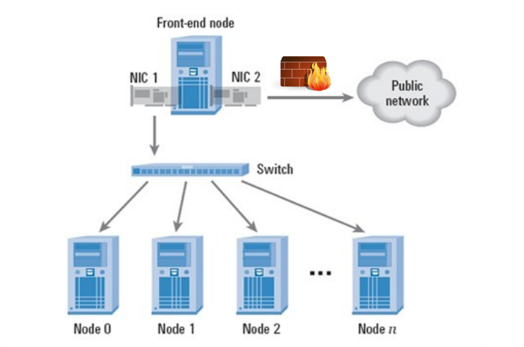
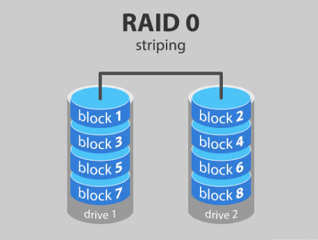
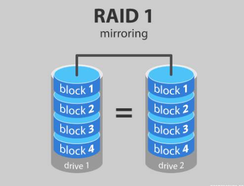
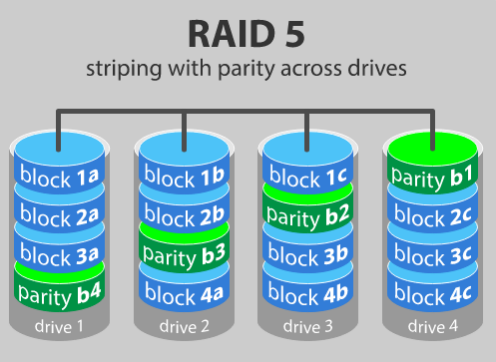
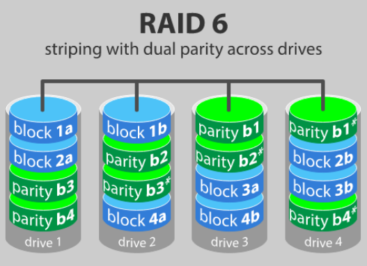
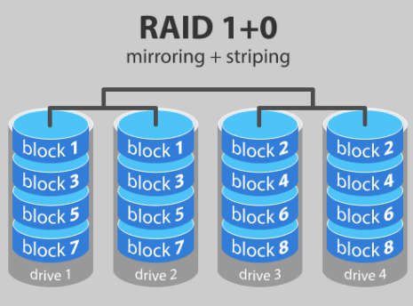
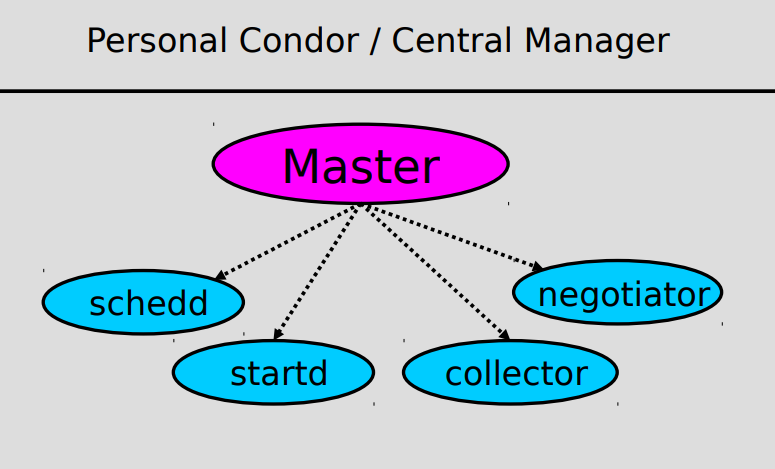
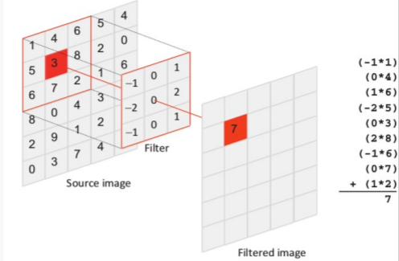
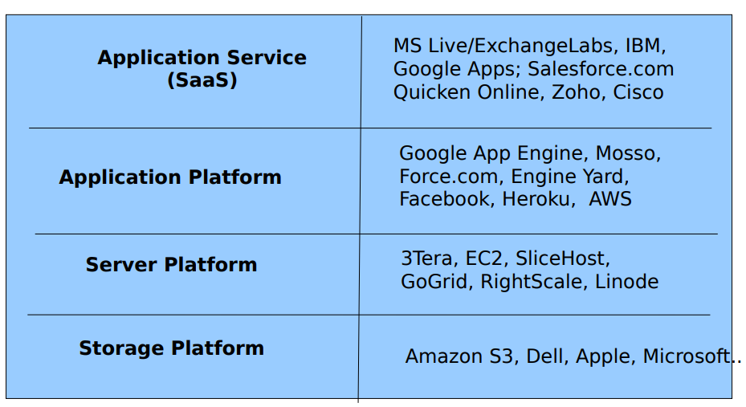

# HPC

## Indice

- [Introduzione](#introduzione)
- [Architetture innovative](#architetture-innovative)
- [Quantum computing](#quantum-computing)
- [Cluster Computing](#cluster-computing)
    - [High Availability Cluster](#high-availability-cluster)
    - [Load Balacing](#load-balacing)
    - [Parallel Distributed Processing](#parallel-distributed-processing)
    - [Il progetto Linux-HA](#il-progetto-linux-ha)
    - [Costruzione di un Cluster](#costruzione-di-un-cluster)
    - [Condor](#htcondor)
- [GPGPU](#gpgpu)
    - [OpenCL](#opencl)
- [Cloud Computing](#cloud-computing)
    - [Docker](#docker)
    - [Kubernetes](#kubernetes)

# Introduzione

Al giorno d'oggi il potere computazionale richiesto è sempre in aumento, questo vale per i campi più disparati come in ambito medico e sperimentale, nella simulazione di legami chimici e in ambito finanziario.
Negli ultimi anni l'Europa ha investito moltissimi fondi nello sviluppo di centri di calcolo per provare a raggiungere una potenza di calcolo di 10^18 operazioni al secondo.

Questa branca dell'informatica è detta **High Performance Computing** e studia come è possibile raggingere queste immense potenze di calcolo.

I principali metodi per migliorare la potenza di caclolo sono:

- Architetture innovative
- Quantoum comuting
- Cluster computing
- GPGPU Computing
- Cloud computing

## Architetture innovative

Con l'avanzamento delle tecnologie è possibile realizzare processori che richiedono un apporto energetico sempre più basso, con una densità di transistor sempre più elevata. 

Questo è evidenziato **dalla legge di Moore** che però negli ultimi anni non è più valida a causa dei limiti fisici che si incontrano quando si rimpiccioliscono più di tanto i transistor.

## **Quantum computing**

Sfrutta le leggi della fisica quantistica, come l'**entaglement** e il concetto di **superposizione** per realizzare computer con una capacità di calcolo nettamente superiore a quella dei computer tradizionali.

Tuttavia questi computer sono di difficile realizzazione poichè devono operare a temperature estremamente basse, rendendone quindi la commercializzazione difficile.

I principali computer quantistici attualmente esistenti sono:

- **IonQ** con 79-qbit.
- **Google** che sta sviluppando un supercomputer da 72-qbit.
- **IBM Q** con 53-qbit.

<hr>

# **Cluster Computing**
## High Performance Computing (HPC)
Il **Cluster Computing** consiste nella creazione di una rete di computer connessi tra di loro che operano insieme in modo tale da poter essere visti come una unica macchina.
I sistemi HPC sono principlamente utilizzati per applicazioni ad alta intensità di calcolo e/o alta intensità di dati. Sono implementati algoritmi paralleli oppure in alternativa si adotta un parallelismo sui dati. I sistemi HPC sono spesso collegati o interagiscono con i sistemi Cloud per ottenere la massima potenza possibile.

I componenti di un Cluster sono:
- **I Nodi**
- **Network**
- **OS**
- **Cluster Middelware**

Questi cluster possono essere realizzati con computer dai componenti di fortuna (non necessariamente di fascia alta, come il cesso: FX + Scheda video a caso), valorizzando quindi l'avere molte macchine dal costo ridotto.

Possono essere utilizzati per realizzare: Web Server, motori di ricerca, vari servizi web, gestire DB, ecc...

Vengono solitamente utilizzati per migliorare la velocità e/o l'affidabilità rispetto a quella fornita da un singolo computer. Sono in genere molto più convenienti in termini di velocità o affidabilità rispetto a quest'ultimo. Nel cluster computing ogni nodo all'interno di un cluster è un sistema indipendente, con il proprio sistema operativo, memoria privata e, in alcuni casi, il proprio file system. Poiché i vari nodi non possono accedere direttamente alla memoria degli altri nodi, i programmi o il software eseguiti sui cluster di solito utilizzano una procedura chiamata **message passing** per ottenere dati e codice di esecuzione da un nodo all'altro.

Il cluster computing può essere utilizzato anche come forma di elaborazione parallela relativamente a basso costo per applicazioni scientifiche e di altro tipo che si prestano a operazioni parallele.

Possono essere usati anche per il load balacing, aumentando così la tolleranza ai guasti di una data applicazione.

Ci sono vari tipi di cluster:

<!-- - Anali(con scat incluso) -->
- ## **High availability cluster**
    - In caso di eventuali errori o cadute dei nodi, altri occorrono per continuare a fornire un determinato servizio. Questi cluster sono progettati per fornire disponibilità ininterrotta di dati o servizi. Si può pensare ai Server Mail come esempi di questo tipo. Sono cluster utilizzati per fornire una disponibilità ininterrotta di dati o servizi ai consumatori, se un nodo muore il servizio viene subito ripristinato cambiando semplicemente nodo e l'utente non si accorge di nulla.
- ## **Load Balacing cluster**
    - Le richieste di servizi vengono gestite e distribuite sui nodi disponibili in modo da mantenere il carico di lavoro più omogeneo possibile. Entrambe le tecnologie cluster ad alta disponibilità e bilanciamento del carico possono essere combinate per aumentare l'affidabilità, disponibilità, e scalabilità di applicazioni e risorse di dati ampiamente distribuite per servizi Web, posta, notizie o FTP. Il Load Balancing Cluster può essere implementato utilizzando l'algoritmo Round-Robin dei DNS oppure utilizzando altri strumenti che permettono lo scambio di informazioni tra i nodi.
- ## **Parallel Distributed Processing**
    - Normalmente utilizzato in ambiti scentifici per simulazioni e altro. Questi tipi di cluster aumentano la disponibilità, le prestazioni e la scalabilità delle applicazioni, in particolare attività computazionali o ad alta intensità di dati. Viene utilizzato per eseguire richieste molto costose in code di batch. Viene anche chiamato High Throughput Computing cioè sistemi che permettono di eseguire molte operazioni di calcolo su un lungo periodo di tempo. Un esempio di queto software è HTCondor.

Applicazioni di cluster:
- Compute Intense
- Data o I/O Intense
- Transaction Intense


_Architettura tipica di un cluster_

I vantaggi di un cluster sono:

- Disponibilità
- Performance
- Scalabilità
- Efficienza dei costi
- Espandibilità

Tuttavia nei cluster a basso costo, un aspetto molto critico è quello della rete poichè una bassa larghezza di banda o una latenza elevata possono degradare notevolmente le performance del cluster. L'opzione migliore è l'Infiniband.

Si è tentati di pensare a un cluster solo come un gruppo di macchine interconnesse, ma quando si inizia a costruire un cluster, è necessario riflettere sulla sua struttura interna. Ciò comporterà decidere quali ruoli giocheranno le singole macchine e come sarà la rete di interconnessione. Nei multiprocessori centralizzati ci sono 2 approcci
architetturali, a seconda di come viene gestita la memoria:
- ### Architettura **UMA** (Uniform Memory Access)
    - C'è un memoria condivisa comune. La memoria principale è ugualmente accessibile a tutte le CPU. Per migliorare le prestazioni, ogni processore ha la propria cache.
- ### Architettura **NUMA** (Non Uniform Memory Access)
    - Ogni CPU mantiene il proprio pezzo di memoria. Mentre questa disposizione semplificherà la sincronizzazione, il problema della coerenza della cache aumenta.

Oggigiorno i Cluster vengono realizzati collegando un determinato numero di nodi Symmetric Multi Processors. L'architettura risultante è la seguente: abbiamo un insieme di nodi interconnessi, rappresentando globalmente un'architettura NUMA, composta da nodi con architettura UMA.

### Symmetric Cluster
- Ogni nodo può funzionare come un singolo computer. Questo è estremamente semplice da
configurare. Basta creare una sottorete con le singole macchine e aggiungere qualsiasi
software cluster specifico di cui si ha bisogno.
### Asymmetric Cluster
- Un computer è il nodo di testa (l'head funge spesso da server primario per il resto dei
cluster. La velocità della testa può limitare le prestazioni del cluster). Serve come gateway tra i nodi rimanenti e gli utenti. I restanti nodi hanno spesso sistemi operativi molto minimali e sono dedicati esclusivamente al cluster. Poiché tutto il traffico deve passare attraverso la testa, i cluster asimmetrici tendono a fornire un alto livello di sicurezza.
### Expanded Cluster
Questo è un tipo cluster più completo.

<hr>

## Il progetto Linux-HA
Fornire un soluzione ad alta disponibilità (clustering) per Linux che promuove affidabilità, disponibilità e facilità di manutenzione (RAS) attraverso lo sforzo di sviluppo della comunità. I pilastri principali dei progetti Linux HA erano 2 software sviluppati da Linbit:
- ### **Distributed Replicated Block Device (DRBD)**
    Il DRBD (Distributed Replicated Block Device), viene utilizzato per replicare il contenuto informativo all’interno di un nodo master, sui vari nodi slave. Il DRDB esegue la copia live di un disco tra il server attivo e quello di backup, al fine di garantire la correttezza delle informazioni memorizzate su disco. In combinazione verrà utilizzato Heartbeat, con lo scopo di verificare il corretto funzionamento dei server associati a un determinato servizio. In caso di failover il software esegue lo scambio tra un server di backup e il server primario. Il DRBD è un elemento fondamentale per formare un cluster ad alta disponibilità (HA). Questo viene fatto eseguendo il mirroring di un intero dispositivo tramite una rete assegnata. La funzionalità software di replicazione dei blocchi dell’hard disk del nodo master è completamente trasparente alle applicazioni che ne devono leggere il contenuto. Se ad esempio inseriamo le pagine di un contenuto Web all’interno dello spazio governato dal DRBD, queste verranno replicate su tutti i nodi del cluster garantendo continuità di servizio e consistenza dei dati. Un applicativo software di questo tipo viene installato quando la soluzione che si sta realizzando è fortemente indirizzata all’affidabilità dei dati. Se il nodo primario dovesse incorrere in problematiche di rete, heartbeat, avvierà la procedura che porta uno dei nodi secondari a prendere il posto del primario, garantendo la continuità del servizio offerto. Dopo un’interruzione di un nodo, il DRBD:
    - Risincronizza automaticamente il nodo temporaneamente non disponibile all’ultima versione dei dati, in background, senza interferire con il servizio in esecuzione. Ovviamente questo funziona anche se il ruolo del nodo sopravvissuto è stato modificato mentre il peer era inattivo.
    - Nel caso in cui un’interruzione completa dell’alimentazione disattivi entrambi i nodi, DRBD rileverà quale dei nodi è rimasto inattivo più a lungo ed eseguirà la risincronizzazione nella giusta direzione.
    - Dopo un’interruzione della rete di replica, DRBD ristabilirà la connessione ed eseguirà automaticamente la risincronizzazione necessaria.
- ### **Heartbeat**
    Heartbeat è altamente portatile ed è il primo software scritto per il progetto Linux-HA. Heartbeat invia costantemente messaggi ai nodi chiedendo se questi sono ancora a disposizione, nel caso in cui il nodo primario non risponda, uno dei nodi passivi prende in carico l’erogazione dei servizi forniti dal nodo primario gestendo l’indirizzo IP virtuale a cui il cluster fa riferimento.

Al momento Earthbeat è stato sostituito da Corosync+Peacemaker e i componenti coinvolti sono i seguenti:
- ### **Corosync**
    Corosync Cluster Engine è un demone che gestisce lo scambio di messaggi e l’appartenenza dei nodi all’interno dei gruppi. È stato implementato come evoluzione di OpenAIS, per risolvere i problemi osservati lavorando con OpenAIS, PeaceMaker e Apache Qpid. Corosync si avvicina all’alta disponibilità garantendo che ogni server ridondante nel sistema mantenga una copia ridondante delle informazioni utilizzate per prendere decisioni per l’applicazione. Questo approccio è chiamato "distributed state machine". In una tipica macchina a stati, i progettisti di software chiamano funzioni che modificano lo stato dell’applicazione. Utilizzando Corosync, i progettisti di software inviano messaggi invece di chiamare funzioni. Quando questi messaggi vengono consegnati, la macchina a stati su tutti i nodi cambia il suo stato in modo ordinato e coerente. Corosync è altamente sintonizzato e progettato per le prestazioni. È stata presa una considerazione speciale per ridurre al minimo il cambio di contesto della fine della memoria.
- ### **Pacemaker**
    Pacemaker è un gestore di risorse ad alta disponibilità open source per cluster di piccole e grandi dimensioni. In caso di errore, i gestori delle risorse come Pacemaker avviano automaticamente il ripristino e si assicurano che l’applicazione sia disponibile da una delle macchine rimanenti nel cluster. Pacemaker ottiene la massima disponibilità per i servizi cluster rilevando e ripristinando gli errori del nodo e del livello di servizio. Ciò viene raggiunto utilizzando le capacità di messaggistica e di appartenenza fornite dall’infrastruttura cluster preferita. Pacemaker è responsabile del funzionamento delle risorse, permette di controllarne il loro stato, di avviarle o di stopparle, e gestisce il comportamento che queste devono avere nel caso si verifichino malfunzionamenti.

<hr>

## Cluster Kits
Sono pacchetti software che automatizzano il processo di installazione di un cluster. Fornisce tutto il software di cui si potrebbe aver bisogno in un'unica distribuzione. Alcuni kit hanno una distribuzione Linux inclusa nel pacchetto (es. Rocks), mentre altri sono installati su un'installazione Linux esistente (es. OSCAR). Sebbene siano disponibili altri kit cluster, i tre più comuni per i cluster Linux sono
* NPACI Rocks (CentOS)
* OSCAR (Fedora, RedHatEnterpriseLinux (RHEL), OpenSuse, Debian)
* Scyld Beowulf (prodotto commerciale)
## NPACI Rocks vs OSCAR
- Rocks è una raccolta di software open source per la creazione di un cluster basato su Red Hat Linux.
- OSCAR, del gruppo Open Cluster, utilizza una strategia di installazione diversa da Rocks. Con OSCAR, prima installi Linux (ma solo sul nodo head) e poi installi OSCAR: le installazioni dei due sono separate. Poiché l'installazione OSCAR è separata dall'installazione Linux, non si è legati a una singola distribuzione Linux.
- La maggior parte del software di base è la stessa sia per OSCAR che per Rocks. Tuttavia, ci sono alcuni pacchetti disponibili per uno ma non per l'altro. Ad esempio, Condor è prontamente disponibile per Rocks mentre LAM/MPI è incluso in OSCAR.
- OSCAR scala bene sulle distribuzioni Linux, Rocks scala bene con hardware eterogeneo.
- Nessun approccio è migliore in ogni situazione.
- Attualmente solo Rocks viene mantenuto e aggiornato.
- Poiché OSCAR è un insieme complesso di hardware che include un gran numero di programmi e servizi, può essere molto arduo risolvere errori commessi in fase di configurazione (solitamente è consigliato ripetere tutto da capo). OSCAR va per prima cosa istallato sul nodo head del cluster. Si consiglia di iniziare con un'installazione pulita del sistema operativo e di personalizzare il meno possibile l'installazione OSCAR la prima volta che la si installa.
- Quando si installa Rocks, verrà installato sia il software di clustering che una versione corrente di RedHat Linux aggiornata per includere le patch di sicurezza. L'installazione di Rocks configurerà correttamente vari servizi. L'installazione predefinita tende ad andare molto rapidamente e senza intoppi.
- Un cluster Rocks ha la stessa architettura di base di un cluster OSCAR. Il nodo principale, o frontend, è un server con due interfacce di rete.

<hr>

## Costruzione di un Cluster
A livello di software è imporante gestire il parallelismo che può essere di 3 tipi:
- **Grana Grossa**: Il codice è suddiviso in blocchi che richiedono un interazione minima tra di loro
- **Grana Media**: il blocco richiede qualche tipo di interazione con altri blocchi (sync points). Le informazioni vengono scampiate tramite MPI.
- **Grana Fine**: le interazioni tra le parti di codice sono molto frequenti (richiede un rete molto efficiente)

### **Selezione dell'hardware**
Lo scopo finale di utilizzo di un cluster determina le caratteristiche hardware necessarie (utilizzare computer già di proprietà, assemblare nuovi pc o acqusitare pc preassemblati). Tuttavia i vincoli di budget possono costringere a soluzioni meno ideali. Un consiglio è quello di (se possibile) utilizzare sistemi identici per i nodi, in questo modo sarà sufficiente clonare le varie macchine e la relativa manutenzione e riparazione sarà più semplice.
- **CPU e scheda madre**
    - Rappresentano le componenti cruciali dell'ambiente. Per alte prestazioni (fattori critici: frequenza di clock del processore, dimensione della cache, Velocità del bus, capacità di memoria, velocità di accesso al disco, latenza di rete) le due parti devono essere totalmente compatibili. La frequenza di clock dovrebbe essere confrontata considerando il costo totale dei nodi. L'ultimo modello sul mercato generalmente non è la scelta giusta.
- **Memoria e cache**
    - Più memoria e più cache si ha, meglio è.
- Potrebbe essere utile aggiungere un lettore CD/ DVD, visto il basso costo e la loro utilità. Questi dispositivi sono utili per ripristinare alcuni file system o guasti del disco.

La "testa" e i server aggiuntivi dovrebbero essere sistemi completi, poiché aggiungeranno poco ai costi complessivi, ma faciliteranno la personalizzazione e la manutenzione di questi sistemi. Il nodo head deve essere dual-homed (a meno che, come suggerito per motivi di sicurezza, non venga utilizzato un host separato che funge da firewall).

Può essere utile creare un **RAID** (Redundant Array of Inexpensive Disks) come sistema di memoria principale. RAID è una tecnologia utilizzata per aumentare le prestazioni e/o l'affidabilità dell'archiviazione dei dati. Un sistema RAID è costituito da due o più unità che funzionano in parallelo. Questi possono essere dischi rigidi, ma c'è una tendenza ad utilizzare anche la tecnologia SSD. Esistono diversi livelli RAID, ciascuno ottimizzato per una situazione specifica.

- **RAID 0** - striping: In un sistema RAID 0 i dati vengono suddivisi in blocchi che vengono scritti su tutte le unità dell'array. Utilizzando più dischi (almeno 2) contemporaneamente, questo offre prestazioni di I/O superiori. Queste prestazioni possono essere ulteriormente migliorate utilizzando più controller, idealmente un controller per disco. <br>
    - Vantaggi: ottime prestazioni in lettura e scrittura. Viene utilizzata tutta la capacità di archiviazione. Facile da implementare.
    - Svantaggi: se un'unità si guasta, tutti i dati nell'array RAID 0 vengono persi. Non dovrebbe essere utilizzato per sistemi con scopi critici.
    - Utilizzo consigliato: archiviazioni di dati che devono essere letti e scritti ad alta velocità, come su una stazione di ritocco delle immagini o editing video.

- **RAID 1** - mirroring: crea una copia nel secondo disco di ogni dato che viene salvato. <br><br>
Se un'unità si guasta, il controller utilizza l'unità dati o l'unità mirror per il ripristino dei dati e continua a funzionare. Sono necessarie almeno 2 unità per un array RAID 1.
    - Vantaggi: in caso di guasto di un'unità, i dati non devono essere ricostruiti, devono solo essere copiati nell'unità sostitutiva.
    - Svantaggi: lo svantaggio principale è che la capacità di archiviazione effettiva è solo la metà della capacità totale dell'unità perché tutti i dati vengono scritti due volte.
    - Utilizzo consigliato: RAID-1 è ideale per l'archiviazione mission-critical, ad esempio per i sistemi di contabilità. È adatto anche per server di piccole dimensioni in cui verranno utilizzate solo due unità dati.

- **RAID 5** - striping parity: si realizza con minimo 3 dischi di cui uno è adibito a salvare il checksum dei dati. <br><br>
    - Vantaggi: utilizzando i dati di parità, il computer può ricalcolare i dati di uno degli altri blocchi di dati, qualora quei dati non fossero più disponibili. Ciò significa che un array RAID 5 può resistereun singolo guasto dell'unità senza perdere dati.
    - Svantaggi: questa è una tecnologia complessa. Se uno dei dischi in un array che utilizza dischi da 4 TB si guasta e viene sostituito, il ripristino dei dati (il tempo di ricostruzione) potrebbe richiedere un giorno o più, a seconda del carico sull'array e della velocità del controller. Se un altro disco si guasta durante quel periodo, i dati vengono persi per sempre.
    - Utilizzo consigliato: RAID 5 è un buon sistema a tutto tondo che combina un'archiviazione efficiente con un'eccellente sicurezza e prestazioni decenti. È ideale per server di file e applicazioni che dispongono di un numero limitato di unità dati.

- **RAID 6** - striping double parity: si realiza con un minimo di 4 dischi di cui 2 sono adibiti a salvare i checksum dei dati. <br><br>
RAID 6 è come RAID 5, ma i dati di parità vengono scritti su due unità. Ciò significa che richiede almeno 4 unità e può resistere se 2 unità muoiono contemporaneamente.
    - Vantaggi: gli stessi di RAID 5 ed in più il sistema può sopravvivere al secondo guasto.
    - Svantaggi: le transazioni di scrittura dei dati sono più lente di RAID 5 a causa dei dati di parità aggiuntivi che devono essere calcolati.
    - Utilizzo consigliato: è preferibile rispetto a RAID 5 nei server di file e applicazioni che utilizzano molte unità di grandi dimensioni per l'archiviazione dei dati.

- **RAID 10** - mirroring striping: combina i vantaggi di RAID 1 e RAID 0. <br><br>
Questa è una configurazione RAID nidificata o ibrida. Fornisce sicurezza eseguendo il mirroring di tutti i dati su unità secondarie e utilizzando lo striping su ciascun set di unità per accelerare i trasferimenti di dati.
    - Vantaggi: se qualcosa va storto con uno dei dischi in una configurazione RAID 10, il tempo di ricostruzione è molto veloce poiché tutto ciò che serve è copiare tutti i dati dal mirror sopravvissuto a una nuova unità.
    - Svantaggi: metà della capacità di archiviazione va al mirroring, quindi rispetto ai grandi array RAID 5 o RAID 6, questo è un modo costoso per avere ridondanza.

È comunque consigliabile avere un backup dei dati esterno al RAID in caso di eventuali furti o danni ai sistemi di archiviazione stessi.

### **Environment**
È necessaria una pianificazione accurata dello spazio fisico, del cablaggio, del raffreddamento e dell'accesso fisico. La ventilazione deve essere preservata. Anche la gestione dei cavi è un problema, idealmente i cavi di alimentazione e dati devono essere separati. La potenza richiesta va valutata con attenzione (considerando un +50% per sicurezza). Per i tipi di raffreddamento si distingue tra aria condizionata e ad acqua. Inoltre è consigliabile un sistema che riesca a fornire elettricità anche in caso di guasti del fornitore di energia. Solitamente sono implementati anche sistemi di disaster recovery, realizzando un data center gemello a distanza di quello principale. Anche un'ottima banda e una bassa latenza sono caratteristiche necessarie.

### Piccola parentesi su NFS
Network File System (NFS) è un protocollo di rete che consente a computer client di utilizzare la rete per accedere a directory condivise da server remoti come fossero disponibili in locale. Il NFS permette ai calcolatori che compongono un sistema distribuito di condividere file, directory o un intero file system utilizzando il protocollo client-server. Un calcolatore (client) deve richiedere esplicitamente ad un altro calcolatore (server) del sistema distribuito di condividere una directory o un file, dichiarando un punto di montaggio. Una volta effettuato un montaggio un utente sul calcolatore client accede alla directory montata in modo assolutamente trasparente, ossia accede alla directory remota credendo di accedere ad una directory locale. In un cluster:
- Il nodo head è solitamente configurato come server NFS per le home directory degli utenti,
mentre i nodi di calcolo sono configurati come client.

Questo semplifica alcune operazioni:
- Tutti i file risiedono sullo stesso file system.
- Le procedure di backup sono facilitate.
- L'accesso ai file eseguibili e di input è facilitato.
- Il file /etc/exports deve essere modificato per specificare quali macchine possono montare quali directory e come.
- Se è attivo un firewall blocca il traffico NFS: in caso di problemi questa è la prima cosa da controllare
- Anche gli ID utente e di gruppo possono creare sorprese. Gli ID utente e gruppo devono essere
coerenti tra i sistemi che utilizzano NFS (ogni utente deve avere un ID identico su tutti i sistemi).
- Tieni presente che i privilegi di root non si estendono tra i sistemi condivisi NFS. Quindi se come root sei tu e ti sposti tra le directory in un filesystem montato in remoto, non aspettarti di poter guardare ogni file.

**Automount**:
- alternativa per montare i filesystem (particolarmente importante per le directory home) usando un programma di montaggio automatico.
- Un demone di montaggio automatico monta un filesystem remoto quando si tenta di accedere al
filesystem e smonta il filesystem quando non è più necessario. Questo è trasparente per l'utente.

NFS ha alcune limitazioni. Innanzitutto, ci sono alcuni potenziali problemi di sicurezza. Se intendi utilizzare NFS, è importante utilizzare la versione aggiornata, applicare le patch necessarie e configurarla correttamente. Non è particolarmente scalabile, quindi per cluster di grandi dimensioni (>1000 nodi) NFS è inadeguato.
<hr>

## High-Throughput Computing
Consente l'esecuzione per un lungo periodo di tempo di molti task. Strumento molto utile per ricercatori e altri utenti che sono interessati al numero di calcoli che possono fare in lunghi periodi di tempo.

### **HTCondor**
È un classico High-Throughput Computing system. È un software che consente di svolgere molte attività di calcolo per un lungo periodo di tempo. Si occupa principalmente del numero di risorse di elaborazione disponibili per le persone che desiderano utilizzare il sistema. Offre la possibilità di gestire sia CPU dedicate (cluster) che risorse non dedicate (desktop). Nessun file system condiviso è richiesto. È supportato per molti tipi di lavoro: seriale, parallelo, ecc. Può sopravvivere a arresti anomali, interruzioni di rete e qualsiasi singolo punto di errore. Con Condor è inoltre possibile:
- tenere d’occhio i lavori e rimanere aggiornato sui loro progressi;
- implementare una politica sull’ordine di esecuzione dei lavori;
- aggiungere tolleranza agli errori dei jobs.

Permette una policy di scheduling mediante le **ClassAds** (Preemption, suspension, requirements, preferences, groups, quotas, settable fair-share, system hold…).

Definizioni: 
- **Job**: rappresentazione di condor di un lavoro. Può essere idenfiticato come un processo di unix ed è un elemento del Workflow. Ogni job ha delle preferenze e requisiti:
    - _Requisiti_: determinati OS 
    - _Preferenze_: determinate caratteristiche della macchina
- **ClassAd**: rappresentazione interna dei dati di condor. La struttura e costituita da una coppia attributo-valore oppure da una coppia attributo-espressione. Possono essere di vario tipo:
    - Job ClassAd: rappresenta un job di Condor 
    - Machine ClassAd: rapressenta le varie risorse di calcolo all'interno del pool di Condor
    - Altri ClassAd: rappresentano altre caratteristiche del pool


- **Universe**: policy di Condor per la gestione dei Job. Possono essere:
    - Vanilla: quello base, che permette l'esecuzione di qualsiasi job seriale ed effettua il trasferimento automatico dei file. L’universo vanilla è una buona impostazione predefinita, poiché ha il minor numero di restrizioni sui job.
    - Standard: fornisce un sistema di checkpoint per poter continuare l'esecuzione di un job che viene interrotto. Fornisce remote system calls. È indipendente dal linguaggio di programmazione. I checkpoint non sono a livello kernel quindi non sarà possibile effettuare Fork, usare Thread Kernel o alcune IPC come pipes e shared memory. 
    - Grid
    - Java
    - Parallel
    - VM: fa partire un'istanza VM come un job.
- **Machine/Resource**: rappresentazione di condor dei computer che possono effettuare i calcoli.
- **Match Making**: associazione tra una macchina ed un Job.
- **Central Manager**: repository centrale per la pool di risorse. Effettua il match making.
- **Execute Host**: computer che fa partire il job (il lavoratore).


<br>
_Condor Daemon Layout_

- **Master**: il demone principale che è presente in ogni host, fa partire tutti gli altri demoni e se un demone ha un problema e muore, Master lo riavvia.
- **Collector**: raccoglie informazioni su tutti gli altri demoni nella pool tramite messaggi periodici. Ne serve almeno 1 per pool e va messo sul Central Manager Node.
- **Negotiatior**: effettua il matchmaking. Ne serve uno per pool ed è situato sul Central Manager Node.
- **StartD**: rappresenta la macchina nel sistema Condor. È responsabile dell'avvio, sospensione e arresto dei job. Un solo demone per ogni nodo.
- **Schedd**: effettua lo scheduling. Uno per ogni nodo. Mantiene una coda persistente dei job. Contatta le macchine disponibili all'esecuzione dei job e crea uno shadow per ogni job in esecuzione.
- **Shadow**: è la rappresentazone locale del job in esecuzione.

### **Altre informazioni di amministrazione per HTCondor**
- Obiettivi e consigli:
    - scrivere una configurazione il più semplice ed efficiente possibile;
    - il file di configurazione non dovrebbe superare le 20 linee.
- **File di configurazione**
    - ```CONDOR_CONFIG``` rappresenta il file di configurazione globale di condor. All’interno sono presenti tutte le impostazioni globali, alcune impostazioni vanno abilitate per IPV6. È presente nella directory ```/etc/condor/```
    - ```LOCAL_CONFIG_FILE``` è il file di configurazione locale specifico della macchina per ogni host. È presente nella directory ```/home/etc/condor/condor_config.local```.
    - ```LOCAL_CONFIG_DIR``` è la directory condor locale per ogni host. È presente nella directory  ```/etc/condor/config.d```
- **Configuration File Macros** </br>
    Le definizioni delle macro hanno la forma: <nome_macro> = <definizione_macro></br>
    NOTA: è necessario disporre di uno spazio vuoto tra il nome della macro, il segno "=" e la definizione della macro. </br>
    Le invocazioni delle macro hanno la forma: **$(nome_macro)**.
- **Sicurezza**
    - Condor possiede anche meccanismi di sicurezza che permettono di autenticare gli di utenti ed i demoni, garantire una crittografia sulla rete e controllare l’integrità del network.
    - Un esempio sta nel modificare la variabile **ALLOW_WRITE** (va impostata a prescindere altrimenti non funziona niente).
- **Policy** (*"chi si incarica di eseguire il lavoro e quando ?"*)
    - Vanno settate nel file **CONDOR_CONFIG**, alcuni esempi:
        - **START**: è la politica principale. Quando assume il valore FALSE lo slot entra nello stato “OWNER” e non eseguirà lavori.  I JOB devono soddisfare START, che può far riferimento ai valori ClassAd inclusi nel JOB.
        - **RANK**: spesso è utilizzata per dare la priorità di esecuzione del JOB ad un proprietario di un particolare gruppo di macchine.
        - **SUSPEND**: Quando SUSPEND diventa True il job smette di essere eseguito ma rimane sulla macchina in esecuzione(che risulta occupata).
        - **CONTINUE**: quando CONTINUE diventa True il job riprende l'esecuzione da dove si era fermato.
        - **PREEMPT**: quando diventa True il job lascia la macchina dove lo sta eseguendo.
        - **KILL**
- Parametri utili nella configurazione della policy:
    - **CurrentTime**: definisce il tempo attuale in “Unix epoch time” (secondi dall' 1 gennaio 1970, ore 00:00).
    - **EnteredCurrentActivity**: definisce il tempo in cui HTCondor ha iniziato l'attività (sempre in Unix epoch time).
    - **LoadAvg**: carico della CPU totale.
    - **CondorLoadAvg**: carico della CPU dovuto a HTCondor.
    - **KeyboardIdle**: secondi trascorsi dall'ultima attività di tastiera o mouse.
- Ultime info e tool per il debug:
    - Si può anche decidere di assegnare una priorità ai vari job (numeri maggiori = priorità più alta). Quest'ultima può essere settata anche in base a quale utente avvia il job.
    - Comandi:
        - **condor_status**: check dello stato del demone.
        - **condor_q**: per vedere la coda dei job. Nel caso in cui un determinato job non parta o qualsiasi altro problema, vengono restituiti dei commenti molto utili all'eventuale risoluzione di bug (utilizzando anche -analyze).
    - HTCondor mantiene anche un file di log per ogni demone.

Per qualsiasi altro dubbio, informazione sui comandi e per problemi di debug è consigliabile seguire le varie guide e i manuali forniti.

<hr>

# **GPGPU**

Il GPGPU (General-Purpose computing on Graphics Processing Units) è un tipo di HPC che sfrutta l'architettura con alto grado di parallelismo (permesso dalle migliaia di core) delle schede video per migliorare le performances. Le GPU sono particolarmente adatte per applicazioni SIMD (vedi dopo) (la stessa architettura dei computer vettoriali), le quali sono utilizzate per risolvere una vasta gamma di problemi computazionali, tra cui:
- Data Mining;
- Crittografia;
- Simulazioni in ambito scientifico (fisica, astrofisica, medicina ecc...).

### **Grafica computazionale**
Consiste nella produzione di immagini bitmap basate su dati acquisiti da una fonte esterna o calcolati mediante un modello computazionale. Le varie fasi si distinguono nella definizione degli oggetti nella scena e nel rendering dell'immagine.
- ***Pipeline grafica***: insieme di operazioni per la resa grafica.
#### **Operazioni di rendering**
- **trasferimento della descrizione della scena**: insieme dei vertici che definiscono gli oggetti, i dati associati all'illuminazione della scena, le texture, il punto di vista dell'osservatore.
- **trasformazioni dei vertici**: rotazioni, ridimensionamento e traslazione degli oggetti
- **ritaglio**:  eliminazione degli oggetti o di parti di essi non visibili dal punto di vista dell'osservatore.
- **illuminazione e ombreggiatura**:valutazione delle interazioni delle sorgenti luminose con le forme, valutandone l'ombreggiamento.
- **rasterization**: generazione dell'immagine bitmap. Le coordinate 3D vengono trasformate in coordinate 2D. Vengono applicate anche trame e altri effetti grafici.

### **Computer architectures secondo la tassonomia di Flynn**
- **SISD**: Istruzione singola su Single Data (es. Architetture Von Neumann tradizionale).
- **SIMD**: Istruzione Singola su Dati Multipli (es. Processori vettoriali).
    - Esegue un singolo set di istruzioni su diversi set di dati utilizzando diverse unità di calcolo contemporaneamente.
    - Il recupero e la decodifica delle istruzioni si verificano solo una volta.
    - Esiste un'unica unità di controllo (CU) che gestisce il flusso di istruzioni di un determinato programma.
    - **Processori vettoriali**: unità di calcolo che dopo il ***fetch and decode*** dell'istruzione, la eseguono sui dati memorizzati nei registri vettoriali. L'unità load-store sposta i dati dalla memoria centrale ai registri vettoriali e viceversa.
- **MISD**: Istruzioni multiple su dati singoli (es. Controller di volo dello Space Shuttle).
- **MIMD**: Istruzioni multiple su dati multipli (es. architettura moderne multicore: Xeon Clovertown)
    - Esegue diverse istruzioni contemporaneamente.
    - Ogni processore ha la sua control unit.
    - Ogni processore può eseguire un compito o parte di esso.

### Esecuzione delle istruzioni
L'esecuzione viene organizzata in Thread. Ogni SM crea, gestisce, schedula ed esegue i thread in gruppi di 32, denominati **wraps**. I thread dello stesso wrap partono dallo stesso indirizzo di programma ma si evolvono indipendentemente. Il massimo dell'efficienza si verifica quando tutti i thread di un wrap hanno lo stesso percorso. Nvidia chiama tale architettura con la sigla SIMT (single istruction multiple thread).

<hr>

## **OpenCL**
OpenCL è il primo standard aperto e privo di royalty per la programmazione parallela multipiattaforma di processori moderni presenti in personal computer, server e dispositivi palmari/incorporati.
- Standard di calcolo eterogeneo multicore;
- Funziona su diversi dispositivi (CPU, GPU, DSP, ecc.);
- Per più fornitori (nVidia, AMD, Intel, ecc.);
- Per più sistemi operativi (Linux, Windows, MacOS).

### **Architettura OpenCL**
- **Modello di piattaforma**: specifica che esiste un processore che coordina l'esecuzione (host) e uno o più processori in grado di eseguire codice OpenCL C (nei dispositivi). Definisce un modello hardware astratto che viene utilizzato dai programmatori durante la scrittura di funzioni OpenCL C (chiamate kernel) per l'esecuzione sui dispositivi.
- **Modello di esecuzione**: definisce le istruzioni impostate per essere eseguite dai dispositivi OpenCL (kernel) e le istruzioni che inizializzano e controllano l'esecuzione dei kernel (programma host).
    - Programma ospite: insieme di istruzioni che inizializzano e gestiscono l'ambiente di esecuzione del Compute Device. 
    - Programma del kernel: insieme di istruzioni eseguite dai dispositivi di calcolo.
    - L'host prepara l'esecuzione dei vari kernel.
    - Ciascun dispositivo di calcolo esegue il kernel.
    - I calcoli sono effettuati da Oggetti di lavoro (che sono raggruppati in gruppi di lavoro) ogni elemento di lavoro esegue lo stesso programma su dati diversi.
- **Modello di memoria**: definisce gli oggetti di memoria, i tipi di memoria e il modo in cui l'host e i dispositivi vi accedono.
- **Modello di programmazione**: definisce il tipo di esecuzione parallela eseguita (sui dati o sui task).
- **Modello Framework**: set di API ed estensioni C99 per implementare programmi host e kernel.

Un caso di studio è l'algoritmo crittografico AES. Esso svolge un ruolo importante nelle attuali
comunicazioni di crittografia e nelle tecnologie di sicurezza. Per le sue caratteristiche, può trarre grandi benefici da un'implementazione parallela e in particolare da un'implementazione GPU (molto migliore dell'utilizzo delle CPU). Implementazione:
- Leggi file di input (testo normale o cifrato)
- Leggi i parametri AES
- Trasferisci oggetti di memoria alla memoria globale del dispositivo
- Espansione chiave
- Eseguire il kernel sul Dispositivo OpenCl
- Trasferisci oggetti di memoria dalla memoria globale del dispositivo

### Problemi di pianificazione
- L'impressionante quantità di risorse disponibili attraverso l'approccio GPGPU affronta importanti questioni legate all'efficienza della schedulazione dei moderni sistemi operativi nelle architetture ibride.
- Di solito spetta all'utente decidere il tipo di dispositivo da utilizzare. Ciò si traduce in un inefficiente o processo di pianificazione inadeguato e ad un utilizzo non ottimizzato delle risorse hardware.

## **Parallel computing**
Il Parallel Computing è una forma di calcolo in cui vengono eseguiti molti calcoli contemporaneamente, operando sul principio che i grandi problemi possono spesso essere suddivisi in sottoproblemi più piccoli, che vengono poi risolti contemporaneamente (cioè in parallelo). Il grado di parallelismo che può essere raggiunto dipende dalla natura intrinseca del problema in
questione e l'abilità dell'algoritmo o del progettista del software consiste nell'identificare le forme di parallelismo presenti nel problema sottostante. Esempi di attività che possono essere eseguite in modo più efficiente e veloce utilizzando la parallelizzazione:
- Moltiplicazione degli elementi di due array
- Filtrare una serie di immagini usando FFT
- Trovare le occorrenze di una stringa in un testo

### **Concorrenza**
La concorrenza riguarda due o più attività che si verificano contemporaneamente. Quando parliamo di concorrenza nella programmazione, intendiamo un singolo sistema che esegue più attività in modo indipendente. Sebbene sia possibile che attività simultanee possano essere eseguite contemporaneamente (cioè in parallelo), questo non è un requisito.

### **Parallelismo**
Il parallelismo riguarda l'esecuzione di due o più attività in parallelo con l'obiettivo esplicito di aumentare le prestazioni complessive. I programmi paralleli devono essere concorrenti, ma i programmi concorrenti non devono essere paralleli. Nel calcolo parallelo, la granularità è una misura del rapporto tra calcolo e comunicazione. I periodi di calcolo sono tipicamente separati dai periodi di comunicazione per eventi di sincronizzazione. La grana del parallelismo è vincolata dalle caratteristiche intrinseche degli algoritmi che costituiscono l'applicazione. È importante che il programmatore parallelo selezioni la giusta granularità per sfruttare appieno i vantaggi della piattaforma sottostante, perché la scelta della giusta dimensione dei grani può aiutare a esporre un ulteriore grado di parallelismo.

### **Threads**
Un programma in esecuzione può essere costituito da più sottoprogrammi che mantengono il proprio flusso di controllo indipendente e che possono essere eseguiti simultaneamente. La comunicazione tra i thread avviene tramite aggiornamenti della memoria che appare nello stesso spazio di indirizzi.
- Ogni thread ha il proprio pool di memoria locale (variabili), ma tutti i thread vedono lo stesso insieme di variabili globali.
Una semplice analogia potrebbe essere il programma principale che include un insieme di subroutine. I thread comunicano tra loro attraverso la memoria globale. Ciò può richiedere costrutti di sincronizzazione per garantire che più di un thread non aggiorni lo
stesso indirizzo globale. Viene definito un modello di consistenza della memoria per gestire l'ordine di caricamento e archiviazione.
- Meccanismi come lock/semafori sono comunemente usati per controllare l'accesso alla
memoria condivisa a cui si accede da più attività.
- Il supporto di un modello di memoria condivisa completamente coerente nell'hardware ha un costo significativo (possibili colli di bottiglia).

### **Message-passing communication**
Consente l'intercomunicazione esplicita di un insieme di attività simultanee che possono utilizzare la memoria durante il calcolo. Le attività scambiano dati attraverso la comunicazione
inviando e ricevendo messaggi espliciti. Il trasferimento dei dati di solito richiede che ogni
processo esegua operazioni cooperative. Ad esempio, un'operazione di invio deve avere un'operazione di ricezione corrispondente. Il programmatore è responsabile della gestione esplicita delle comunicazioni tra le attività.

### **Condivisione dei dati e sincronizzazione**
Se due applicazioni non condividono alcun dato, possono essere eseguite contemporaneamente e anche in parallelo. Se a metà dell'esecuzione di un'applicazione viene generato un risultato che sarà successivamente richiesto dalla seconda applicazione, allora dobbiamo introdurre una qualche forma di sincronizzazione nel sistema e l'esecuzione parallela diventa impossibile. Quando si eseguono software concorrenti, la condivisione e la sincronizzazione dei dati giocano un ruolo fondamentale. È possibile utilizzare primitive di sincronizzazione esplicite come barriere o locks.

### **ND Range**
Quando viene eseguito un kernel, il programma specifica il numero di elementi di lavoro che dovrebbero essere creati come un intervallo ndimensionale (NDRange). Spesso è mappato alle dimensioni dei dati di input o di output.

### **Contexts**
Prima che un host possa richiedere l'esecuzione di un kernel su un dispositivo, è necessario configurare un context sull'host che gli consenta di passare comandi e dati al dispositivo. In OpenCL un context è un contenitore astratto che esiste sull'host. Esso coordina il meccanismo di interazione host-dispositivo, gestisce gli oggetti di memoria disponibili sul dispositivo e tiene traccia del programma e dei kernel creati per ciascun dispositivo.

### **Command Queues**
La comunicazione con un dispositivo avviene inviando comandi ad una coda di comando. La coda dei comandi è il meccanismo utilizzato dall'host per richiedere un'azione da parte del dispositivo. Una volta che l'host decide con quale dispositivo lavorare e viene creato un context, è necessario creare una coda di comandi per dispositivo (ogni coda di comandi è associata a
un solo dispositivo). Ogni volta che l'host ha bisogno che un'azione venga eseguita da un dispositivo, invierà i comandi alla coda comandi appropriata.

### **Oggetti di memoria**
Le applicazioni OpenCL spesso funzionano con grandi array di matrici multidimensionali. Questi dati devono essere fisicamente presenti su un dispositivo prima che l'esecuzione possa iniziare. Affinché i dati possano essere trasferiti a un dispositivo, deve prima essere incapsulato come un oggetto di memoria. OpenCL definisce due tipi di oggetti di memoria: buffers e immagini. I buffer sono equivalenti agli array in c, creati utilizzando malloc(), in cui gli elementi dei dati sono archiviati in modo contiguo in memoria. Le immagini sono progettate come oggetti opachi, consentendo il riempimento dei dati e altre ottimizzazioni che possono migliorare le prestazioni sui dispositivi. Un oggetto di memoria è valido solo all'interno di un singolo context.

### **Creazione di un programma OpenCL**
Il codice OpenCL C, scritto per essere eseguito su un dispositivo OpenCL, è chiamato a programma. Un programma è una raccolta di funzioni chiamate **kernel** (i kernel OpenCL sono simili alle funzioni C e possono essere pensati come istanze di un'operazione parallela. Il corpo della funzione verrà eseguito una volta per ogni elemento di lavoro creato), dove i kernel sono unità di esecuzione che possono essere pianificate per l'esecuzione su un dispositivo. I programmi OpenCL vengono compilati in fase di esecuzione tramite una serie di chiamate API. Questa compilazione runtime offre al sistema l'opportunità di eseguire l'ottimizzazione per un dispositivo specifico. Non è necessario che un'applicazione OpenCL sia stata precostruita per runtime di tipo specifico (NVIDIA, AMD, Intel). 

### **Memory Model**
I sottosistemi di memoria variano notevolmente tra le piattaforme di elaborazione. Per esempio tutte le moderne CPU supportano la memorizzazione nella cache automatica, anche se molte GPU no. Per supportare la portabilità del codice, l'approccio di OpenCL consiste nel definire un modello di memoria astratto a cui i programmatori possono rivolgersi durante la scrittura del codice e che i fornitori possono mappare sulla loro memoria effettiva.
- **Memoria globale**
    - è visibile a tutte le unità di calcolo del dispositivo (simile alla memoria principale su un sistema host basato su CPU). Ogni volta che i dati vengono trasferiti dall'host al dispositivo, i dati risiederanno nella memoria globale. Tutti i dati che devono essere ritrasferiti dal dispositivo all'host devono risiedere anche nella memoria globale.
- **Memoria costante**
    - è progettata per dati in cui ogni elemento è accessibile contemporaneamente da tutti gli elementi di lavoro. Rientrano in questa categoria anche le variabili i cui valori non cambiano mai. La memoria costante è modellata come parte della memoria globale, quindi gli oggetti di memoria trasferiti nella memoria globale possono essere specificati come costanti.
- **Memoria locale**
    - è una memoria scratchpad il cui spazio degli indirizzi è unico per ogni dispositivo di calcolo. La memoria locale è modellata come essere condiviso da un gruppo di lavoro. Poiché tali accessi possono avere una latenza molto più breve e una larghezza di banda molto più elevata rispetto alla memoria globale.
- **Memoria privata**
    - è una memoria unica per un singolo oggetto di lavoro. Le variabili locali e gli argomenti del kernel non puntatori sono privati per impostazione predefinita. In pratica, queste variabili sono mappate su registri, sebbene gli array privati e tutti i registri versati siano solitamente mappati su una memoria off-chip (cioè: lunga latenza).
Durante la programmazione per dispositivi OpenCL, in particolare GPU, le prestazioni possono aumentare utilizzando la memoria locale per memorizzare nella cache i dati che verranno utilizzati più volte da più elementi di lavoro dello stesso gruppo di lavoro.

### **Elaborazione delle immagini**
- **Rotazione immagine**
    - La rotazione delle immagini è una routine molto comune nel campo dell'elaborazione delle immagini. L'input per un programma che deve svolgere tale compito è l'immagine, l'angolo di rotazione e un punto intorno al quale viene eseguita la rotazione. Per implementare la rotazione dell'immagine con OpenCL i calcoli per ottenere la nuova coordinata di ciascun pixel possono essere eseguiti in modo indipendente tra loro. L'esempio di rotazione dell'immagine è un buon esempio di scomposizione di input, il che significa che un elemento dell'input (in questo caso, un'immagine di input) viene scomposto in più elementi per processarne il lavoro.
- **Image Convolution**
    - Nell'elaborazione delle immagini, la convoluzione è un algoritmo comunemente usato che modifica il valore di ciascun pixel in un'immagine utilizzando le informazioni dei pixel vicini. Un kernel di convoluzione, o filtro, descrive come ogni pixel sarà influenzato dai suoi vicini. 
    - Ad esempio, un kernel sfocato prenderà la media pesata dei pixel vicini in modo da ridurre le grandi differenze tra i valori dei pixel.
    - Utilizzando la stessa immagine sorgente e cambiando solo il filtro, è possibile produrre effetti come nitidezza, sfocatura, miglioramento dei bordi e rilievo.
    - Un kernel di convoluzione funziona iterando su ogni pixel nell'immagine sorgente. Per ogni pixel sorgente, il filtro è centrato e i valori del filtro moltiplicano i valori dei pixel che si sovrappongono. Viene quindi presa una somma dei prodotti per produrre un nuovo valore di pixel.<br>
<br>

<hr>

# **Cloud Computing**

È un termine che serve per indicare un'ampia classe di Network Based Computing, in pratica è una collezione di Hardware e Software che tramite l'utilizzo di Internet forniscono vari servizi ai client nascondendo le caratteristiche dell'infrastruttura, fornendo agli utenti un'interfaccia grafica o API molto semplice. I servizi di cloud computing vengono forniti on demand e quindi sono sempre disponibili. Tecnologie come cluster e ora il cloud computing hanno tutte l'obiettivo di consentire l'accesso a grandi quantità di potenza di calcolo in modo completamente virtualizzato.

Il cloud computing è molto utile perché permette alle aziende una riduzione dei costi di gestione. Con questa tecnologia non è più necessario acquistare costosi programmi software o hardware, e non servono neppure grandi server per la memorizzazione dei dati (server che andrebbero tenuti accessi 24 ore su 24 con grosse spese elettriche, e che andrebbero gestiti dal personale IT). Tutte le spese di manutenzione e gestione dell’hardware, sono a carico del provider di servizi. Questo permetterà all'azienda di rimanere sempre al passo non solo con le ultime novità in fatto di tecnologia, ma anche di restare a norma di legge grazie ai costanti aggiornamenti correttivi o evolutivi del provider. Queste proprietà rendono il cloud computing molto **flessibile** e con **grande potenziale sia economico che applicativo.**

Possono essere identificati da 3 caratteristiche:

1. **Remotely Hosted**: i servizi sono hostati su server remoti
2. **Ubiquitus (ocus pocus)**: i servizi e i dati sono reperibili da ovunque.
3. **Commodified**: la definizione è lasciata al lettore.

Un servizio di Cloud Computing può essere diviso in 4 Layer: 



I benefici del Cloud Computing sono:

1. **Riduzione dei costi (e aumento dell’efficienza)**<br>
    Le aziende che utilizzano sistemi cloud riducono enormemente le spese relative all’acquisto di hardware e software. Non sono più costrette ad acquistare server e data center locali, che richiedono personale specializzato nella gestione e nella manutenzione, che occupano spazio fisico e che consumano elettricità 24 ore su 24 e 7 giorni su 7 per l’alimentazione e il raffreddamento.

2. **Scalabilità**<br>
    Il successo e l’enorme diffusione del cloud derivano, in primis, da un problema e dal fatto che questo tipo di tecnologia può risolverlo come nessun altro. È il problema della scalabilità. L’elasticità dei sistemi di cloud computing è perfetta per ovviare a queste problematiche. Si possono, infatti, gestire servizi e capacità di calcolo on-demand, ampliando la propria infrastruttura in tempistiche assai brevi. Allo stesso tempo, questa “infrastruttura” può ritornare ad essere più contenuta, con la massima flessibilità. 

3. **Prestazioni**<br>
    Un singolo data center aziendale, nella stragrande maggioranza dei casi, non può competere con la rete di data center forniti da aziende specializzate. Innanzitutto, dal momento che quasi tutti i servizi sono forniti in modalità on-demand, si possono avere a disposizione enormi quantità di risorse di calcolo in poco tempo, e con grande facilità e flessibilità, senza investimenti onerosi. Contemporaneamente, ospitando piattaforme, software e database in remoto, i servizi cloud permettono di liberare memoria e potenza computazionale sui singoli computer della propria azienda. L’evidente conseguenza è, appunto, il deciso miglioramento delle prestazioni.

4. **Produttività**<br>
    Il cloud computing, innanzitutto, riduce drasticamente alcune perdite di tempo: quelle relative all’assemblaggio e all’organizzazione dei data center locali, con le diverse configurazioni hardware e software, e tutta una serie di azioni di routine nell’ambito IT. I vantaggi del Cloud Computing permettono un facile accesso ai dati e alle piattaforme aziendali con tutti i tipi di device, dal classico desktop fino ai dispositivi mobile.

5. **Sicurezza**<br>
    I dati e le reti vengono protetti con servizi presidiati sempre da backup.

Gli svantaggi sono:
1. **Sicurezza informatica e privacy degli utenti**<br>
    Utilizzare un servizio di cloud computing per memorizzare dati personali o sensibili, espone l'utente a potenziali problemi di violazione della privacy. I dati personali vengono memorizzati nelle Server Farms di aziende che spesso risiedono in uno Stato diverso da quello dell'utente. Il cloud provider, in caso di comportamento scorretto o malevolo, potrebbe accedere ai dati personali per eseguire ricerche di mercato e profilazione degli utenti.

2. **Costo delle prestazioni e della larghezza di banda**<br>
    Le industrie possono risparmiare fondi sull'hardware ma devono investire ulteriori risorse per la larghezza di banda. La condivisione di dati complessi e intensivi sulla rete implica una larghezza di banda sufficiente. Pertanto, diversi settori sono in attesa di costi ridotti della banda prima di passare a soluzioni cloud. 

3. **Affidabilità e disponibilità**<br>
    I provider cloud non dispongono di un servizio continuo questo quindi può subire guasti regolari. È importante dunque esaminare il servizio offerto costantemente attraverso strumenti interni o di terze parti.


**Caratteristiche del cloud computing:**
1. **Virtualizzazione risorse**<br>
    Ovvero capacità di calcolo, archiviazione e rete. Nei cloud sono virtualizzate e si ottiene a vari livelli tra cui VM (Virtual Machine) e livelli di piattaforma. Il più semplice è a livello di macchina virtuale (VM) in cui diverse applicazioni possono essere eseguite all'interno dei loro contenitori o sistemi operativi in esecuzione sulla stessa macchina fisica. Il livello di piattaforma consente la mappatura senza interruzioni delle applicazioni su una o più risorse offerte da diversi provider di infrastrutture cloud.

2. **Orientato al servizio**<br>
    Il cloud è implementato utilizzando il modello Service-Oriented Architecture in cui tutti i capacità/componenti sono disponibili sulla rete come servizio.

3. **Elastico**<br>
    Le risorse (ovvero capacità di calcolo, archiviazione e rete) necessarie per le applicazioni cloud possono essere fornite e variate in modo dinamico, ovvero aumentare o diminuire in fase di esecuzione a seconda della richiesta dell'utente.

4. **Dinamico e distribuito** <br>
    Sebbene le risorse cloud siano virtualizzate, sono spesso distribuite per consentire la fornitura di servizi cloud affidabili e/o ad alte prestazioni.

5. **Infrastruttura condivisa**<br>
    I cloud sono un'infrastruttura condivisa in cui le risorse servono più clienti con allocazione dinamica in base alla domanda della loro applicazione. Questo modello di condivisione è anche definito modello “multi-tenant”. In generale, i clienti non hanno alcun controllo diretto sulle risorse fisiche né sono a conoscenza dell'ubicazione delle risorse e con chi vengono condivise.

6. **Orientato al mercato** <br>
    Nel cloud computing, i clienti pagano i servizi in base al pagamento a consumo. Il modello di prezzo può variare a seconda delle aspettative dell'applicazione.

7. **Autonomo**<br>
    Per fornire servizi altamente affidabili, i Cloud mostrano un comportamento autonomo gestendo se stessi in caso di guasti o di degrado delle prestazioni.


Le varie componenti del cloud coputing sono:
- **SaaS** (Software as a Servcie): fornisce l'accesso ad applicazioni on demand. Permette di ridurre i costi perchè non è necessario acquistare software completo ma è necessario solo l'acquisto di un abbonamento. Un altro aspetto chiave è la Multitenancy che evita all'utente finale tutte quelle operazioni di manutenione delle macchine.
- **DAAS** (data as a service): con questo servizio vengono messi a disposizione via web solamente i dati, ai quali gli utenti possono accedere tramite qualsiasi applicazione, come se fossero residenti su un disco locale; in pratica il DAAS non è basato sul concetto di server ma di storage (conservazione dati).
- **MAAS** (monitoring as a service): è un framework che facilita lo sviluppo di funzionalità di monitoraggio per vari altri servizi e applicazioni all'interno del cloud. L'applicazione più comune per MaaS è il monitoraggio dello stato online, che consente di monitorare continuamente determinati stati di applicazioni, reti, sistemi, istanze o qualsiasi elemento che possa essere distribuito all'interno del cloud. 
- **IaaS** (Infrastructur as a Service): è un insieme di macchine virtuali, fisiche, cluster e database. Il tutto è gestito da un Layer superiore che garantisce Runtime Enviroment Customizaion, Application Isoaltion e QoS. In questo layer ci sonon anche gli Hypervisor per la virtualizzazione.
- **PaaS** (Platform as a Service): offre delle piattaforme di sviluppo in cloud per permettere agli sviluppatori di far girare le loro applicazioni. Alcune soluzioni che offre sono:
    - Runtime Frameworks
    - Abstraction
    - Cloud Service


## **IAAS**
Fornisce l'accesso a risorse fondamentali come macchine fisiche, macchine virtuali, storage virtuale, ecc.
Oltre a queste risorse, IaaS offre anche:
1. Archiviazione su disco della macchina virtuale 
2. Bilanciatore del carico della rete 
3. Rete locale (VLAN) virtuale
4. Indirizzi IP
5. Pacchetti software

Tutte le risorse di cui sopra sono messe a disposizione dell'utente finale tramite la virtualizzazione del server.

**Vantaggi**
- Controllo completo delle risorse di calcolo tramite l'accesso amministrativo alle VM.
- Noleggio flessibile ed efficiente di hardware per computer.
- Portabilità, interoperabilità con applicazioni legacy

IaaS consente al consumatore di accedere alle risorse di elaborazione tramite l'accesso amministrativo alle macchine virtuali nel modo seguente:
- Il consumatore invia un comando amministrativo al provider di servizi cloud per eseguire la macchina virtuale o per salvare i dati sul server del cloud.
- Il consumatore invia il comando amministrativo alle macchine virtuali di sua proprietà per avviare il server Web o installare nuove applicazioni.

**Svantaggi**
- Noleggio hardware per computer:
    - Le risorse IaaS come macchine virtuali, storage, larghezza di banda, indirizzi IP, servizi di monitoraggio, firewall, ecc., sono tutte messe a disposizione dei consumatori in affitto.
    - Il consumatore deve pagare in base al periodo di tempo in cui un consumatore conserva una risorsa. Inoltre, con l'accesso amministrativo alle macchine virtuali, il consumatore può anche eseguire qualsiasi software, anche un sistema operativo personalizzato.
- Portabilità, interoperabilità con applicazioni legacy:
    - È possibile mantenere l'eredità tra applicazioni e carichi di lavoro tra cloud IaaS. 
    Ad esempio, le applicazioni di rete come server Web e server di posta elettronica che normalmente vengono eseguiti su hardware server di proprietà del consumatore possono essere eseguite anche da macchine virtuali nel cloud IaaS.

<hr>

### Cloud pubblici
I cloud pubblici sono il tipo più comune di distribuzione di cloud computing. Le risorse cloud, come server e archiviazione, appartengono a e sono gestite da un provider di servizi cloud di terze parti e vengono distribuite tramite Internet. Con un cloud pubblico, tutto l'hardware, il software e altre infrastrutture di servizio sono di proprietà e gestite dal provider di servizi cloud. Microsoft Azure è un esempio di cloud pubblico. In un cloud pubblico condividi lo stesso hardware, le stesse risorse di archiviazione e gli stessi dispositivi di rete con altre organizzazioni, accedi ai servizi e gestisci il tuo account tramite un Web browser. Le distribuzioni di cloud pubblico vengono spesso usate per fornire posta elettronica basata sul Web, applicazioni Office online, risorse di archiviazione e ambienti di test e di sviluppo.

Vantaggi dei cloud pubblici:
- **Costi ridotti**: non devi acquistare hardware o software e paghi solo per i servizi usati.
- **Nessuna manutenzione**: il provider di servizi fornisce la manutenzione.
- **Scalabilità praticamente illimitata**: sono disponibili risorse on demand per soddisfare le tue esigenze aziendali.
- **Affidabilità elevata**: una vasta rete di server offre protezione in caso di errori.

### Cloud Privati
Un cloud privato è costituito da risorse di cloud computing usate esclusivamente da un'azienda o un'organizzazione. Il cloud privato può essere situato fisicamente nel data center locale dell'organizzazione oppure può essere ospitato da un provider di servizi di terze parti. In un cloud privato, tuttavia, i servizi e l'infrastruttura vengono sempre gestiti in una rete privata e l'hardware e il software sono dedicati esclusivamente alla tua organizzazione. I cloud privati vengono usati spesso da agenzie governative, istituti finanziari e altre organizzazioni di medie e grandi dimensioni con operazioni cruciali che richiedono un controllo avanzato sul proprio ambiente.

Vantaggi di un cloud privato:
- **Maggiore flessibilità**: la tua organizzazione può personalizzare il proprio ambiente cloud per soddisfare esigenze aziendali specifiche.
- **Più controllo**: le risorse non vengono condivise con altri utenti e di conseguenza sono possibili livelli superiori di controllo e sicurezza.
- **Maggiore scalabilità**: i cloud privati offrono spesso maggiore scalabilità rispetto all'infrastruttura locale.

### Cloud Ibrido
Un cloud ibrido è un tipo di cloud computing che combina l'infrastruttura locale, o un cloud privato, con un cloud pubblico. I cloud ibridi consentono di spostare dati e app tra i due ambienti. Molte organizzazioni scelgono un approccio basato su cloud ibrido per diversi motivi di natura aziendale, tra cui la necessità di soddisfare requisiti normativi e di sovranità dei dati, la possibilità di sfruttare al meglio l'investimento nella tecnologia locale o la capacità di risolvere i problemi di bassa latenza.

Vantaggi del cloud ibrido:
- **Controllo**: la tua organizzazione può mantenere un'infrastruttura privata per asset o carichi di lavoro riservati che richiedono bassa latenza.
- **Flessibilità**: puoi sfruttare risorse aggiuntive nel cloud pubblico quando necessario.
- **Convenienza**: grazie alla scalabilità nel cloud pubblico, puoi pagare per la potenza di calcolo aggiuntiva solo quando necessario.
- **Semplicità**: la transizione al cloud non deve necessariamente essere complessa, in quanto puoi eseguire gradualmente la migrazione solo di alcuni carichi di lavoro per volta.

## Software cloud
### **Eucalyptus**
È un framework software Opensource per il Cloud Computing, che implementa la cosiddetta Infrastructure as a Service (IaaS): sistemi che danno agli utenti la possibilità di eseguire e controllare intere istanze di Macchine Virtuali, distribuite su una varietà di risorse fisiche.
La piattaforma Eucalyptus Infrastructure as a Service (IaaS) è completamente compatibile con l'API Amazon Web Services (AWS), consentendo il supporto sia per cloud IaaS che ibridi.

### **OpenNebula**
OpenNebula è un toolkit di cloud computing open source per la gestione di centri di elaborazione dati distribuiti eterogenei. OpenNebula gestisce una infrastruttura virtuale di elaborazione dati per costruire IaaS (Infrastrutture come servizio) pubbliche, private ed ibride.
OpenNebula gestisce tecnologie di memoria, la rete, la monitorizzazione della virtualizzazione e la sicurezza per implementare servizi multi-livello come macchine virtuali su infrastrutture distribuite, combinando le risorse dei centri di elaborazione e le risorse remote della "nuvola", secondo le politiche di allocazione. Il toolkit fornisce funzioni per **l'integrazione, la gestione, la scalabilità, la sicurezza e la gestione delle risorse**.

### **OpenStack**
OpenStack è una piattaforma di cloud computing standard aperta e gratuita . Viene distribuito principalmente come Infrastructure-as-a-Service (IaaS) sia in cloud pubblici che privati, in cui i server virtuali e altre risorse sono messi a disposizione degli utenti. La piattaforma software è costituita da componenti interconnessi che controllano diversi pool hardware multi-vendor di elaborazione, storage e risorse di rete in un data center. Gli utenti lo gestiscono tramite un dashboard basato sul Web, tramite strumenti da riga di comando o tramite servizi Web RESTful.

### **ownCloud** 
ownCloud è un software libero che permette di gestire un completo servizio di file hosting.
Il codice sorgente del server di ownCloud è pubblicato sotto i termini della licenza GNU, e vi sono diversi client per PC e dispositivi mobili. 

### **NextCloud**
Nextcloud è una suite di software client-server per la creazione e l'utilizzo di servizi di file hosting, di cloud storage, di memorizzazione e sincronizzazione online. Nextcloud è software libero e open-source, il che significa che chiunque può installarlo e utilizzarlo sui propri server. Nextcloud, grazie all'integrazione con OnlyOffice o Collabora Online, è funzionalmente simile a Dropbox, Office 365 o Google Drive.
Lo sviluppatore originale di ownCloud, Frank Karlitschek, ha creato NextCloud da un fork di ownCloud. NextCloud è attivamente sviluppato da Karlitschek e altri membri del team originale di ownCloud.

### Il fenomeno del **lock-in** nel cloud
Si verifica nel momento in cui un cliente (ad es. un'azienda) si trova in un rapporto di dipendenza con il fornitore dei servizi. Ciò si verifica nei casi in cui il cliente riscontri notevoli difficoltà economiche e organizzative nel cambiare il fornitore dei servizi con uno equivalente con il medesimo scopo. Questo succede perché non sono a tutti gli effetti disponibili le informazioni essenziali sul sistema in uso; parametri che consentirebbero a un nuovo fornitore di subentrare in modo rapido ed efficace.
Più un provider è in possesso di elementi unici e indispensabili, di cui è il solo depositario, e più questo vincolo diventa reale e complesso da allentare. Che si tratti di informazioni esclusive e riservate, oppure di componenti sviluppati su misura, una cosa è certa: il rapporto fornitore-cliente è fortemente sbilanciato a favore del primo. In questo modo il provider può più facilmente imporre modifiche contrattuali, preventivi o ricambi, sapendo che per il cliente una eventuale uscita sarebbe difficile e, con tutta probabilità, onerosa. In questo senso, come evidenziato nel European Interoperability Framework è sempre opportuno puntare su piattaforme open.

<hr>

# **Docker**

Docker è un progetto open-source che automatizza il processo di deployment di applicazioni all'interno di contenitori software, fornendo un'astrazione aggiuntiva grazie alla virtualizzazione a livello di sistema operativo. Il deployment e l'isolamento delle applicazioni sono gestite tramite i Container: un pacchetto leggero, standalone ed eseguibile che contiene tutto il necesario per far eseguire un'applicazione.

I container sono effimeri, quindi ogni modifica che viene effettuata non verrà salvata su disco in modo permanente. Eventuali modifiche apportate a un contenitore in esecuzione verranno scritte su un livello temporaneo, chiamato container layer, che è una directory sul filesystem dell'host locale. Docker in più utilizza la stratificazione delle immagini per creare più livelli collegati che appaiono come un unico filesystem.

### **Il problema dei dati persistenti**
Essere limitati a contenitori solo temporanei limiterebbe notevolmente i casi d'uso per Docker. È molto probabile che alcuni casi d'uso richiedano l'archiviazione persistente dei dati. Quando si archiviano i dati nel livello dell'immagine del contenitore, l'immagine di base non cambia.  Quando il contenitore viene rimosso dall'host, viene rimosso anche lo strato del contenitore. Se la stessa immagine viene utilizzata per avviare un nuovo contenitore, viene creato anche un nuovo livello immagine contenitore.

Docker permette di risolvere questo problema tramite:

- ## **Volumi**: 
    - i volumi memorizzano i file sul filesystem dell'host locale per fornire persistenza e sono l'opzione preferita per aggiungere dati persistenti a un container. Sono cartelle che vengono gestite in automatico da docker dove è possibile salvare file in modo permanente. Generalmente vengono create in `/var/lib/docker/volumes`. Essendo gestite in automatico da Docker, è possibile gestirle con facilità (eliminazione, creazione, ecc).
    - Prima di utilizzare un volume con un contenitore, è necessario crearlo. La creazione di un volume Docker può essere eseguita manualmente utilizzando la Docker CLI o automaticamente dal daemon Docker all'avvio di un container. Poiché entrambi i metodi sono creati da Docker, sono di proprietà e gestiti da Docker stesso, il che ne semplifica la gestione e il monitoraggio. Quando si crea un volume Docker, si possono fornire opzioni come un nome o un'etichetta.
    - Un volume può anche essere creato in modo **anonimo** (senza nome). Può essere difficile però tenere traccia di un volume anonimo. Pertanto, è considerata una procedura consigliata assegnare un nome al volume al momento della creazione, anziché consentire a Docker di generare un nome di volume anonimo.
    - **Montaggio di un volume in un contenitore**
        - Quando si monta un volume in un contenitore, è necessario fornire una delle due opzioni al comando di avvio della linea di comando. Le due opzioni che puoi usare per montare i volumi sono 
        ```bash 
        --mount
        ```
        o
        ```bash 
        -v
        ```
        Se stai eseguendo un container standard, puoi utilizzare una delle due opzioni, ma la seconda è l'opzione più comunemente usata.
        Esempio:
        ```bash
        docker run --name mysql-01 -v pv-mysql-data:/var/lib/mysql -e MYSQL_ROOT_PASSWORD=mia-password -d mysql
        ```
        Questo avvierà un contenitore che esegue MySQL, con un nome di MySQL-01, che monta un volume chiamato pv-mysql-data in un punto di montaggio chiamato /var/lib/mysql nel contenitore. L'ultima opzione, con -e, crea una variabile di ambiente che viene chiamata MYSQL_ROOT_PASSWORD, che è impostato sulla mia password.
    - **Montaggio di un volume esistente**
        - A differenza dei livelli container, anch'essi archiviati nell'host locale, i volumi non vengono persi se un contenitore viene rimosso da Docker. Per montare un volume già esistente basta fare:
        ```bash
        docker run --name mysql-01 -v pv-mysql-data:/var/lib/mysql -e MYSQL_ROOT_PASSWORD=mia-password -d mysql:v2
        ```
        Questo lancerà il nostro nuovo MySQL:v2 container con lo stesso volume del container precedente, con il database esistente completamente intatto.
    - **Montaggio di un volume su più container**
        - E se avessi un'applicazione che richiede più contenitori e ognuno di essi richiede esattamente gli stessi dati? Sebbene sia possibile creare un volume per ogni contenitore e copiare i dati in ciascuno, un metodo più efficiente sarebbe condividere un singolo volume tra più contenitori. Una caratteristica unica dei volumi Docker è che più contenitori possono accedere allo stesso volume. Sebbene sembri una soluzione semplice per fornire un'unica posizione ai dati condivisi, è necessario tenere presente che non tutte le applicazioni funzionano bene quando più processi accedono agli stessi dati. Quando si avviia ogni istanza, si usano semplicemente gli stessi nomi per il volume:
        ```bash
        docker run --name webserver01 -v webdata:/opt/ web/data -d bitnami/nginx:latest 
        docker run --name webserver02 -v webdata:/opt/web/data -d bitnami/nginx:latest 
        docker run --name webserver03 -v webdata:/opt/web/data -d bitnami/nginx:latest 
        docker run --name webserver04 -v webdata:/opt/web/data -d bitnami/nginx:latest
        ```
        In piu’ è possibile elencare tutti i volumi con il comando:
        ```bash
        docker volume list
        ```
    - **Ripulire i volumi**
        - Per impostazione predefinita, Docker non elimina mai i volumi creati per i contenitori. Quando stoppiamo e avviamo un container utilizzando un volume, i dati persistono, ma cosa si deve fare con i dati di cui non si ha più bisogno ? La quantità di dati nella cartella ```/var/lib/docker/volumes``` può crescere di molto. Per questo motivo, è consigliabile sfoltire o rimuovere i volumi per liberare spazio su disco. Il modo più semplice per eliminare i dati da un'immagine che non è più necessaria consiste nell'utilizzare l'opzione **-v** quando si rimuove il contenitore da Docker. Il comando docker **rm \<nome immagine>** permette di rimuovere l’immagine. Se hai un volume allegato al contenitore e desideri eliminare i dati quando rimuovi l'immagine, puoi aggiungere l'opzione **-v** al comando **rm**, che cancellerà tutti i volumi associati al contenitore. Per eliminare il server MySQL precedente e i dati persistenti, si utilizza il seguente comando:
        ```bash
        docker rm -v mysql
        ```
        Può succedere che non si voglia eliminare i dati rimuovendo il contenitore. L'eliminazione di un volume non può essere annullata, quindi è consigliabile rimuovere il contenitore e conservare il volume per un determinato numero di giorni per verificare che non si ha effettivamente bisogno di tali dati. Se desideri eliminare uno o più volumi, puoi utilizzare l'opzione 
        ```bash
        docker volume rm
        ```
        È possibile fornire il nome o i nomi del volume dopo l'opzione rm. Ogni volume fornito verrà eliminato dal sistema, liberando spazio su disco nel sistema host. Potresti essere preoccupato dall’idea di eliminare un volume utilizzato da un contenitore. Non temere: Docker non permette di farlo. Se si tenta di eliminare un volume attualmente in uso da un container in esecuzione, o assegnato a un container fermo, verrà visualizzato un messaggio di errore che dice all’utente che tale volume è utilizzato da altri container. Docker consente solo di eliminare un volume che non è aperto da un contanier in esecuzione. Potresti avere molti volumi che desideri eliminare. Sebbene è possibile fornire ogni nome usando il comando di rimozione, Docker fornisce un'altra opzione, nota come potatura. L'eliminazione esaminerà tutti i volumi e rimuoverà qualsiasi volume che non è attualmente montato su un contenitore in esecuzione. Fai attenzione a usare questa opzione: usala solo se sai che i volumi che non sono in uso non contengono dati di cui hai bisogno per qualsiasi motivo. Questo processo è definitivo e, una volta eseguito, eliminerà tutti i volumi che non sono in uso.


- ## **Bind Mount**: 
    - sono cartelle che non vengono gestite in automatico da Docker, ma dall'utente che le crea dove vuole e ci mette roba che vuole. Sono identiche in tutto e per tutto ai Volumi solo che non hanno una gestione automatizzata ed è l'utente che deve tenerne traccia.
    - Nel complesso, i volumi e bind mount possono sembrare simili:
        - Entrambi usano il filesystem dell'host locale ed entrambi sono montati usando l’opzione docker -v. Sebbene condividano molte delle stesse caratteristiche, un montaggio bind differisce da un volume in quanto esso non è gestito da Docker.
        - Poiché Docker non gestisce i bind mount, essi non possono essere eliminati utilizzando un comando Docker. Docker non tiene traccia della posizione dei bind mount in un elenco. Se crei bind mount in diverse aree del filesystem sull'host, devi tenere traccia della posizione di ciascuno da rimuoverli manualmente una volta che non ne hai più bisogno.
    
    Un bind mount è una directory situata in un punto qualsiasi del filesystem dell'host che è associata al container. A differenza di un volume, che di solito si trova sempre in una posizione predefinita, ad esempio ```/var/lib/docker/volumes```, un bind mount può essere ovunque nel filesystem dell'host.
    - **Perché creare un bind mount?**
        - Un bind mount può essere utile quando è necessario condividere qualcosa sul sistema host con un container in esecuzione. Ad esempio, sviluppi un'applicazione sul tuo laptop in locale e desideri testare l'applicazione prima di finalizzare il codice. Invece di eseguirlo sulla tua console locale, vuoi testarlo in un container. Puoi memorizzare il tuo codice sorgente in ```/source``` e poi, quando compili, puoi memorizzare l'eseguibile e le eventuali librerie in ```/apps/testapp```.
        Può essere creato un bind mount con il comando:
        ```bash
        docker run -d -v /apps/testapp:/bin/testapp ubuntu:latest
        ```
        Questo avvierà un container che esegue Ubuntu con un mount all'interno del contenitore che si lega all'host locale nel percorso ```/app/testapp```, dove si trova l'applicazione compilata.

- ## **Tmpfs**: 
    - questo tipo di montaggio non è persistente al riavvio del container, il riavvio del Docker o il riavvio dell'host. Viene utilizzato solo come posizione per archiviare temporaneamente i dati nella RAM ad alta velocità ed è veramente effimero. Sebbene non offra persistenza, ci sono casi d'uso specifici in cui la selezione di tmpfs può essere utile.
    - tmpfs offre alcuni **vantaggi** esclusivi che non sono disponibili nei volumi o nei bind mount:
        - La dimensione può essere predefinita per limitare la quantità di RAM consumata per	l'archiviazione. 
        - Offre un accesso ai dati molto veloce.
    - **svantaggi**
        - disponibile solo su Linux; Windows non è supportato.
        - può essere montato un singolo tmpfs per ogni container.
    - Un container può essere avviato con un tmpfs aggiungendo uno dei due comandi: 
    ```bash
    --mount 
    ```
    o usando 
    ```--tmpfs ``` come opzione. In generale, si usa ```--mount``` come opzione per impostazione predefinita e non ```--tmpfs``` perché non consente alcuna personalizzazione sul montaggio (non sarai in grado di impostare un limite di dimensione o alcuna sicurezza). Esempio mount tmpfs:
    ```bash
    docker run --mount type=tmpfs,target=/opt/html,tmpfsmode=1770,tmpfs-size=1000000 --name nginx-test -d bitnami/nginx:latest
    ```

I container di solito non sono direttamente connessi alla rete, il traffico passa per una scheda Bridged Nat. La maggior parte degli utenti Docker utilizza semplicemente la rete bridge
predefinita, che funzionerà per la maggior parte dei casi d'uso, ma presenta
alcune limitazioni che devono essere considerate. 

Quando si utilizza la rete bridge predefinita vanno considerate le se seguenti conseguenze: 
- Quando un container viene avviato senza una rete specificata, utilizzerà il bridge predefinito. Ciò significa che più container saranno in grado di comunicare, senza tenere conto dei carichi di lavoro. 
- Se  si stanno eseguendo più container e desideri isolarne alcuni da altri, potresti inavvertitamente consentire le comunicazioni tra container comunque, poiché utilizzano il bridge predefinito.
- Il bridge predefinito limita le comunicazioni tra contenitori solo a determinati indirizzi IP.
- I container che utilizzano il bridge predefinito devono essere arrestati prima di poterli spostare su una rete diversa.

È consigliato quindi utilizzare un rete bridge definita dall'utente.
Se si avvia un container senza un'opzione di rete, verrà avviato connesso alla rete bridge predefinita. È tuttavia possibile **avviare un container senza una rete** collegata utilizzando il comando **--network=none** selezionabile quando si avviia il contenitore. Questo è lo stesso processo che si esegue quando viene avviato un container con una rete definita dall'utente.

### Esporre i servizi di container
Per poter accedere dall'esterno è necessario aprire le porte e farne un binding/forwarding. Docker offre due soluzioni:
- Expose: permette di rendere visibili le porte solo ad altri docker container.
- Ports: permette di rendere visibili le porte a tutti così che altri utenti possano accedervi dall'esterno.

Ogni docker container si basa su un immagine di un SO ed è possibile crearne di personalizzate tramite l'uso dei Dockerfile (un Dockerfile è semplicemente uno script di istruzioni basato su
testo che viene utilizzato per creare un'immagine contenitore.).

_Esempio di dockerfile:_

```Dockerfile
    FROM ubuntu:16.04
    RUN apt-get update
    RUN apt-get install -y apache2
    RUN echo "Hello World" > /var/www/html/index.html
    EXPOSE 80
```
Successivamente è necessario il seguente comando:
```bash
docker build -t getting-started .
```
I container possono essere avviati in due modi:

- tramite riga di comando (bruttino e macchinoso)
- tramite un file di configurazione (più semplice e veloce)

_Esempio di docker run:_

```bash 
docker run -p 80:80 -v /var/run/docker.sock:/tmp/docker.sock:ro --
restart always --log-opt max-size=1g nginx
```

_Esempio di docker-compose:_

```yaml

    version: '3.3'
    services:
        nginx:
            image: nginx
            ports:
                - 80:80
            volumes:
                - /var/run/docker.sock:/tmp/docker.sock:ro
            restart: always
            logging:
                options:
                    max-size: 1g

```
Un comando di esempio può essere:
```bash 
docker-compose -f docker-compose-example.yml -f dockercompose.admin.yml run backup_db
```
### **Alcuni comandi utili**
- Per visualizzare le reti disponibili basta lanciare il comando:
    ```bash 
    docker network ls
    ```
    Ed avremo il riepilogo di tutte le reti disponibili.
- Per creare delle reti definite dall’utente possiamo lanciare il comando:
    ```bash 
    docker create network frontend
    ```
    Poiché non abbiamo specificato alcuna opzione diversa dal nome della rete, Docker assegnerà alla rete un intervallo IP non sovrapposto. Se si desidera creare una seconda rete chiamata backend che usa il ```192.168.10.0/24```, utilizzando come gateway ```192.168.10.1```, devi solo aggiungere  --subnet e  --gateway:
    ```bash 
    docker create network backend --subnet 192.168.10.0/24 --gateway=192.168.10.1
    ```
- Collegamento di un container ad una rete definita dall’utente:
    ```bash 
    docker run network=frontend --name=ngixnx1 -d bitnami/nginx:latest
    ```
    Il comando precedente avvierà un nuovo container NGINX denominato frontend, sulla rete definita dall'utente denominata frontend.
- Rimozione di una rete:
    
    Se non hai più bisogno di una rete definita dall'utente, puoi eliminare la rete dal tuo host utilizzando:
    ```bash 
    docker network rm frontend
    ```
    oppure possiamo rimuovere tutte le reti non utilizzate dall’host con il comando 

    ```bash 
    docker network prune
    ```
<hr>

# **Kubernetes**

Kubernetes è una piattaforma portatile, estensibile e open-source per la gestione di carichi di lavoro e servizi containerizzati, in grado di facilitare sia la configurazione dichiarativa che l'automazione. La piattaforma vanta un grande ecosistema in rapida crescita. Servizi, supporto e strumenti sono ampiamente disponibili nel mondo Kubernetes.

Utile per gestire i container docker in autonomia e semplicità gestendo anche: scalabilità, failover, distribuzione delle applicazioni.

Kubernetes fornisce un framework per sistemi distribuiti. Si occupa del ridimensionamento e del failover delle applicazioni, fornisce modelli di distribuzione e altro ancora.


Kubernetes fornisce:

- **Bilanciamento del carico**
    -  Kubernetes può esporre un container utilizzando il nome DNS o utilizzando il proprio indirizzo IP. Se il traffico verso un container è elevato, Kubernetes è in grado di bilanciare il carico e distribuire il traffico di rete in modo che la distribuzione sia stabile.
- Orchestrazione dello storage permettendo di **montare volumi** o cartelle in modo semlice
- **Rollout e rollback automatizzati**
    - puoi automatizzare Kubernetes per creare nuovi container per la tua distribuzione, rimuovere i container esistenti e adottare tutte le loro risorse nel nuovo container.
- **Ottimizzazione dei carichi**
    - Fornendo a Kubernetes un cluster di nodi che può utilizzare per eseguire attività containerizzate si può impostare quanta CPU e memoria (RAM) assegnare ad ogni container e Kubernetes può adattare i container ai nodi per sfruttare al meglio le risorse.
- **Self-healing**
    - riavvia i container che si bloccano, sostituisce container, termina i container che non rispondono agli health checks, e evita di far arrivare traffico ai container che non sono ancora pronti per rispondere correttamente.
- Gestione di informazioni sensibili (passowrd, chiavi SSH, OAuth token, ecc.)

### Componenti di kubernets
Quando si utilizza Kubernetes, si ha un cluster. Un cluster Kubernetes è costituito da un insieme di macchine worker, chiamate nodi, che eseguono applicazioni containerizzate. Ogni cluster ha almeno un nodo di lavoro. I nodi di lavoro ospitano i pods che sono i componenti del carico di lavoro dell'applicazione. Il piano di controllo gestisce i nodi di lavoro e i pods nel cluster. Negli ambienti di produzione, il piano di controllo viene solitamente eseguito su più computer e un cluster esegue solitamente più nodi, fornendo tolleranza agli errori e disponibilità elevata.
### Componenti del piano di controllo
Le componenti del piano di controllo prendono decisioni globali sul cluster, oltre a rilevare e rispondere agli eventi del cluster. I componenti del piano di controllo possono essere eseguiti su qualsiasi macchina nel cluster. 
Tuttavia, per semplicità, gli script di configurazione in genere avviano tutti i componenti del piano di controllo sulla stessa macchina e non eseguono container utente su tale macchina.
- **kube-apiserver**
    - è il server API, ovvero il front-end per il piano di controllo Kubernetes.
- **kube-scheduler**
    - controlla i pods appena creati senza alcun nodo assegnato e seleziona un nodo su cui eseguirli. 
- **kube-controller-manager**
    - esegue i processi del controller.  Logicamente, ogni controller è un processo separato, ma per ridurre la complessità, sono tutti compilati in un unico binario ed eseguiti in un unico processo
    - Alcuni tipi di questi controller sono: 
        - Controllore del nodo: 
        Responsabile di notare e rispondere quando i nodi si interrompono.
        - Controllore del job: 
        Controlla gli oggetti Job che rappresentano attività una tantum, quindi crea i pod per eseguire tali attività fino al completamento.
        - Controllore degli endpoint: 
        Popola l'oggetto Endpoints (vale a dire, si unisce a servizi e pod. 
        - Account di servizio e controller di token:
        Crea account predefiniti e token di accesso API per nuovi spazi dei nomi.
- **cloud-controller-manager**
    - incorpora la logica di controllo specifica del cloud. Il gestore del controller cloud consente di collegare il tuo cluster all'API del tuo provider di servizi cloud e separa i componenti che interagiscono con quella piattaforma cloud dai componenti che interagiscono solo con il tuo cluster.

### Componenti del nodo
I componenti del nodo vengono eseguiti su ogni nodo, mantenendo i pod in esecuzione e fornendo l'ambiente di runtime Kubernetes.
- **kubelet**
    - è un agente che viene eseguito su ogni nodo del cluster. Si assicura che i container siano in esecuzione in un Pod. Il kubelet accetta una serie di PodSpec forniti attraverso vari meccanismi e garantisce che i contenitori descritti in tali PodSpec siano in esecuzione e integri. Il kubelet non gestisce i contenitori che non sono stati creati da Kubernetes.
- **kube-proxy**
    - è un proxy di rete che viene eseguito su ogni nodo del tuo cluster. kube-proxy mantiene le regole di rete sui nodi. Queste regole di rete consentono la comunicazione di rete ai Pod da sessioni di rete all'interno o all'esterno del cluster.
- **Container runtime**
    - È il software responsabile dell'esecuzione dei contenitori.

### Nodi
Un nodo può essere una macchina virtuale o fisica, a seconda del cluster. Ogni nodo è gestito dal piano di controllo e contiene i servizi necessari per eseguire i Pod. In genere si hanno diversi nodi in un cluster (in un ambiente di test o con risorse limitate, si potrebbe avere un solo nodo).

Le componenti di un nodo includono il kubelet, un container runtime, e un kube-proxy.
Esistono due modi per aggiungere i nodi al server API:
1. Il kubelet su un nodo si registra automaticamente sul piano di controllo.
2. Un utente aggiunge manualmente un oggetto al Nodo.

Dopo aver creato un oggetto Node o il kubelet su un nodo si registra automaticamente, il piano di controllo verifica se il nuovo oggetto Node è valido. Kubernetes crea un oggetto Node internamente. Kubernetes verifica che un kubelet sia registrato sul server API che corrisponde al nome. Se il nodo è integro (ovvero tutti i servizi necessari sono in esecuzione), è idoneo per eseguire un Pod. In caso contrario, quel nodo viene ignorato per qualsiasi attività del cluster finché non diventa integro. Il nome di un oggetto Node deve essere un nome di sottodominio DNS valido.

- **Unicità del nome del nodo**: Il nome identifica un nodo. Due nodi non possono avere lo stesso nome contemporaneamente.

- **Autoregistrazione dei nodi**: Quando il flag di kubelet **--register-node** è true (impostazione predefinita), il kubelet tenterà di registrarsi con il server API. Questo è il modello preferito, utilizzato dalla maggior parte delle distribuzioni. Per l'autoregistrazione, il kubelet viene avviato con le seguenti opzioni: **--kubeconfig, --cloud-provider, --register-node, --register-with-taints, --node-ip, --node-labels, --node-status-update-frequency**

- **Amministrazione manuale del nodo**: È possibile creare e modificare gli oggetti Node utilizzando kubectl. Quando si vogliono creare oggetti Node manualmente, va impostato il flag kubelet --node-registert=false. È possibile modificare gli oggetti Node indipendentemente dall'impostazione di --register-node. Ad esempio, si possono impostare etichette su un nodo esistente o contrassegnarlo come non programmabile. È possibile utilizzare le etichette sui nodi insieme ai selettori di nodi sui pod per controllare la pianificazione. Oppure puoi vincolare un Pod in modo che sia idoneo all'esecuzione solo su un sottoinsieme dei nodi disponibili. Invece contrassegnare un nodo come non pianificabile impedisce allo scheduler di posizionare nuovi pod su quel nodo ma non influisce sui pod esistenti sul nodo. Ciò è utile come passaggio preparatorio prima del riavvio di un nodo o di altre operazioni di manutenzione.
Per contrassegnare un nodo come non “schedulabile”, eseguire:
**kubectl cordon $NODENAME**

- **Stati del nodo**: lo stato di un nodo contiene le seguenti informazioni: 
    - Indirizzi Condizioni 
    - Capacità e allocazione
    - Informazioni

    Si può usare kubectl per visualizzare lo stato di un nodo e altri dettagli: **kubectl describe node nomenodo**

- Gli stati del nodo sono descritti mediante JSON.

- **Oggetti di tipo  spec e stato**:

    Quasi tutti gli oggetti Kubernetes includono due campi oggetto nidificati che governano la configurazione dell'oggetto: l'oggetto spec e l'oggetto stato.
    - **Oggetto spec**: Per gli oggetti che hanno a specifica spec, devi impostarlo quando crei l'oggetto, fornendo una descrizione delle caratteristiche che vuoi che la risorsa abbia.
    - **Oggetto stato**: Lo stato descrive il corrente stato dell'oggetto, fornito e aggiornato dal sistema Kubernetes e dai suoi componenti. Il piano di controllo di Kubernetes gestisce continuamente e attivamente l'effettivo di ogni oggetto stato per abbinare lo stato fornito.

- **Descrivere un oggetto Kubernetes**:
    Quando crei un oggetto in Kubernetes, devi fornire l'oggetto spec che descrive lo stato desiderato, nonché alcune informazioni di base sull'oggetto (come un nome). Quando utilizzi l'API Kubernetes per creare l'oggetto (direttamente o tramite kubectl), tale richiesta API deve includere tali informazioni come JSON nel corpo della richiesta. Molto spesso, si forniscono le informazioni a kubectl in un .yaml file .kubectl che converte le informazioni in JSON durante la creazione dell'API request.apiVersion: apps/v1. Esempio:
    ```bash
    kubectl apply -f https://k8s.io/examples/application/deployment.yaml --record
    ```

- **Comandi imperativi**: Quando si utilizzano comandi imperativi, un utente opera direttamente su oggetti attivi in un cluster. L'utente fornisce le operazioni al kubectl comando come argomenti o flag.  Questo è il modo consigliato per iniziare o per eseguire un'attività una tantum in un cluster.  Perché questa tecnica opera direttamente su oggetti vivi, non fornisce alcuna cronologia delle configurazioni precedenti.
    - **Vantaggi** rispetto alla configurazione degli oggetti:
        - I comandi sono espressi come una singola parola d'azione.
        - I comandi richiedono un solo passaggio per apportare modifiche al cluster.
    - **Svantaggi** rispetto alla configurazione degli oggetti:
        - I comandi non si integrano con i processi di revisione delle modifiche. 
        - I comandi non forniscono un audit trail associato alle modifiche. 
        - I comandi non forniscono una fonte di record ad eccezione di ciò che è live. 
        - I comandi non forniscono un modello per la creazione di nuovi oggetti

- **Configurazione oggetto imperativa**: Nella configurazione dell'oggetto imperativo, il comando  kubectl specifica l'operazione (creare, sostituire, ecc.), flag opzionali e almeno un nome file. Il file specificato deve contenere una definizione completa dell'oggetto in YAML o JSON. Esempio:
    ```bash
    kubectl create -f nginx.yaml
    ```
    - **Vantaggi** rispetto ai comandi imperativi:
        - La configurazione degli oggetti può essere archiviata in un sistema di controllo del codice sorgente come Git. 
        - La configurazione degli oggetti può integrarsi con processi come la revisione delle modifiche prima del push e degli audit trail. 
        - La configurazione degli oggetti fornisce un modello per la creazione di nuovi oggetti.
    - **Svantaggi** rispetto ai comandi imperativi:
        - La configurazione dell'oggetto richiede una comprensione di base dello schema dell'oggetto.
        - La configurazione dell'oggetto richiede il passaggio aggiuntivo della scrittura di un file YAML.

- **Configurazione oggetto dichiarativa**: Quando si utilizza la configurazione dichiarativa degli oggetti, un utente opera sui file di configurazione degli oggetti archiviati localmente, tuttavia l'utente non definisce le operazioni da eseguire sui file. Le operazioni di creazione, aggiornamento ed eliminazione vengono rilevate automaticamente per oggetto da kubectl. Ciò consente di lavorare su directory, in cui potrebbero essere necessarie operazioni diverse per oggetti diversi.
    - **Vantaggi** rispetto alla configurazione imperativa degli oggetti: 
        - Le modifiche apportate direttamente agli oggetti live vengono mantenute, anche se non vengono nuovamente unite nei file di configurazione. 
        - La configurazione dichiarativa dell'oggetto offre un supporto migliore per operare su directory e rilevare automaticamente i tipi di operazione (creazione, patch, eliminazione) per oggetto. 
    - **Svantaggi** rispetto alla configurazione imperativa degli oggetti: 
        - La configurazione dell'oggetto dichiarativo è più difficile da eseguire il debug e comprendere i 	risultati quando sono imprevisti.
        - Gli aggiornamenti parziali che utilizzano le differenze creano complesse operazioni di unione e patch.
