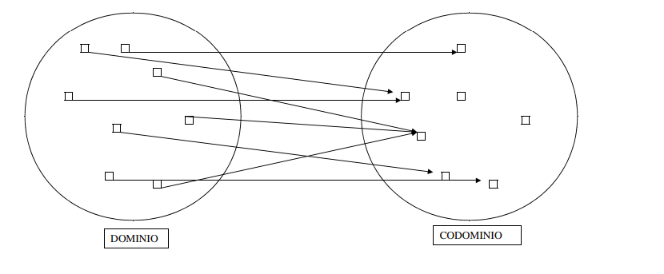
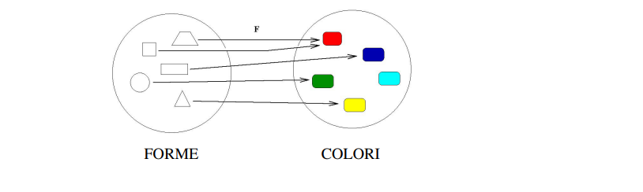
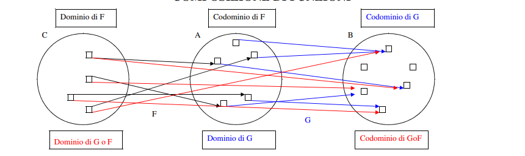
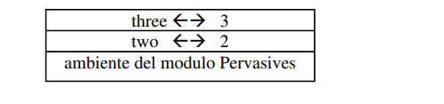
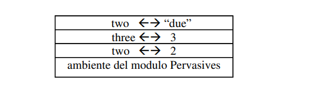
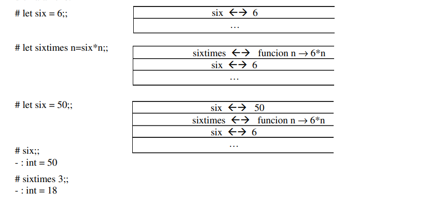
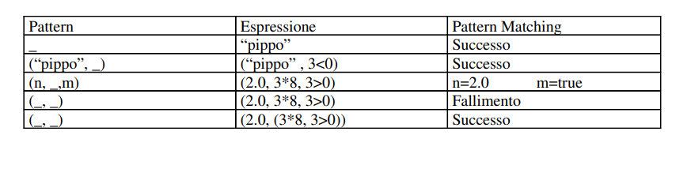

# Ocaml

## Indice

<!-- forse va cambiato  e scritto a mano -->

[TOC]

## Introduzione

Supporta diversi paradigmi di programmazione:

- **Funzionale**
- **Imperativo**
- Ad **Oggetti**

### Imperativo

Il modello di calcolo e' basato sull'hardware (architettura di Von Neauman) e ha 2 elementi di base: Variabili e Assegnazione. Programmare vuol dire pianificare il flusso di informazioni. E.g. in C descrivo tutto il flusso (azione dopo azione) da fare per risolvere un problema. Questa programmazione e' basata su *comandi* che operano sulla *memoria* (stato del programma).

Un programma e' **corretto** se per risolvere il problema `P` produice, per ogni input `X` un output `Y`, tale che tra `X` e `Y` vale sempre la relazione specificata da `P`.

```c
# calcolo del massimo comun divisore
int gcd (int m, int m) {
    while (n != m)
        if (n > m) n = n - m;
    	else m = m - n
    return n;
}
```

### Funzionale

Un programma di questo tipo e' la descrizione di cosa si deve calcolare piuttosto che il come calcolarlo.

Un programma e' una funzione !

Strutture di controllo:

- applicazione di funzione ad un argomento
- coposizione di funzioni

I costrutti di base sono *espressioni* e non comandi. Le espressioni sono costruite a partire da espressioni seplici (*Costanti*) tramite *l'applicazione* di operazioni. Si calcola riducendo un'espressione ad un'altra piu' semplice e cosi' via fino ad ottenere un *Valore*, un'espressione che *non si puo' piu' semplificare*.

```ocaml
(6 + 3) x (8 - 2) <- 9 x (8 - 2) <- 9 x 6 <- 54
```

La valutazione delle espressioni avviene nel seguente modo:

- Ogni espressione ha un valore
- Non ci sono effetti collaterali
- `(6 + 3) x (8 - 2)`viene valutato, ma il valore non viene 'salvato'da nessuna parte

**La ricorsione e' il costurtto di controllo fondamentale !**

***Esempi**:*


```ocaml
let rec gcd (m, n) = if n = m then n
						esle if n > m then gcd(n-m, m)
							else gcd(n, m-n);;
```


```ocaml
let rec fact n = 
		if n = 0 then 1
			else n * fact(n-1);;
```

La principale modalita' di coalcolo e' l'applicazione di funzioni, il calcolo procede valutando espressioni e non ci sono effetti collaterali. Un programma e' quindi una collezioni di dichiarazioni.
Le *funzioni* sono oggetti di prima classe, possono essere componenti di una struttura dati o far parte degli argomenti di altre funzioni: `let sort (order, lst) = ... let comp (f, g) = ...`. I linguaggi funzionali supportano l'uso di funzioni di ordine superiore: funzioni che prendono funzioni come argomento o ritornano funzioni come valore.
Nei linguaggi funzionali "puri" non esistono strutture di controllo come `for`, `while`, ecc. ma il principale strumento di controllo e' la ricorsione !! (IL MAAAALEEE :japanese_ogre:)

## ML

Alcune caratteristiche di ML:

- un linguaggio interattivo
- a 'scopo statico': determina a tempo di compilazione il valore delle variabili in una dichiarazione
- fotemente tipato: ogni espressione ha un tipo (determinato a tempo di compilaizone)
- ha inferenza di tipo che gli consente di dedurre quale tipo e' un'esrpessione senza doverlo scrivere esplicitamente
- sistema polimorfo di tipi
- ha un meccanismo per la gestione di errori
- ha un potente sistema di moduli
- e' efficiente
- il codice e' piu' corto, piu' veloce da scrivere e mantenere

### Funzioni



F associa ogni elemento del *dominio* uno ed un solo elemento del *codominio*. Il tipo di F e': `DOMINIO -> CODOMINIO`. 
Un tipo descrive un insieme di valori e le operazioni che si possono fare su di essi.
Se `A` e' un tipo e `x € A` diciamo che `x` e' di tipo `A`. `x: A`.

Alcuni esempi: 

- `3: IN`
- `(2, 5): IN x IN`
- `(1, 2 , 3): IN x IN x IN` oppure `(1, 2, 3): IN^3`

Il tipo `A -> B` e' l'insieme di tutte le fuzioni che hanno come dominio A e codominio B.


Alcuni esempi:



```ocam
F: FORME -> COLORI
```

F si applica ad un elemento di FORME (argomento della funzione) e ritorna  un elemento di COLORE come valore.


La funzione `square` associa ad ogni numero intero il suo quadrato: `square: IZ -> IN` quindi `n -> n^2`

```
square(0) = 0
square(1) = 1 square(-1) = 1
square(2) = 4 square(-2) = 4
```

In Ocaml una definizione di square puo' essere:

```oca
let square n = n*n;;
```

#### Prodotto Cartesiano

Dati `A = {0, 1, 2}` e `B = {rosso, verde}`, allora `A x B = {(0, rosso), (0, verde), (1, rosso), (1, verde), (2, rosso), (3, verde)}`

Questa e' la definzione di prodotto cartesiano.

Le funzioni sono qunindi un sottoinsieme del prodotto cartesiano di `DOMINIO x CODOMINIO` che forma un insieme di coppie (estensione di F) `{(x1, y1), (x2, y2), ...}` tali che:

- ogni `xi` apparteiene al dominio
- ogni `yi` appartieen al codominio
- per ogni `x` del dominio, se `(x, y)` e `(x, y')` allora `y = y'`. `x` puo' essere in coppia cono un solo elemento del codominio !
- `F(x) = y` allora la coppia `(x, y)` appartiene all'estensione di F

Un esempio di estensione e' quella della funzione `square`: `{(0, 0), (1, 1), (3, 9), (-1, 1), ...}`.


### Funzioni a piu' argomenti

La funzione `times` e' definita come segue: 

```ocaml
times = function (n, m) -> n*m;;
```

Il suo codominio e' `IZ`. Il suo dominio e' l'insieme `{(n, m) | n, m in IN}`. Quindi:

```
times: IZ x IZ -> IZ
```

Qunado si applica `times` a `(n, m)` diciamo che `n` e' il primo argomento e `m` il secondo, ma in realta' in Ocaml `times` ha un solo argomento: un coppia di numeri.

Se una funzione si applica a `n` argomenti, appertenenti a `A1, A2, ... An` e ritorna un valore dell'insieme `B`, il suo tipo e': 

```
A1 x A2 x ... x An -> B
```

Il suo dominio e' un insieme di tuple di `n` elementi: `{..., (a1, a2, ..., an), ...}`.
La sua estensione e' un insieme di tuple con `n + 1` elementi: `{..., (a1, a2, ..., an, b), ...}`.

### Funzioni che ritornano coppie di valori

Sia `quorem` la funzione che si applica a due numeri natuarli `n`e `m` e che ritorna il quoziente intero e il resto della divisione tra `n` e `m`.

```ocam
let quorem = function (n, m) -> (n / .m, n mod m);;
```

```
quorem(3, 2) = (1, 1)  quorem(3, 3) = (1, 0)
quorem(7, 2) = (3, 2)  quorem(15, 6) = (2, 3)
```

L'estensione di quorem e': `{..., (3, 2, (1, 1)), ..., (3, 3, (1, 0)), ...}`.
C'e da notare che quorem non e' definito per gli argomenti `(n, 0)` (non si puo' dividere per 0).

### Funzioni Totali vs Parziali

Le funzioni **Totali** sono definite per ogni elemento del dominio. Per ogni `x` nel dominio, esiste una ed una sola coppia `(x, y)` nell'estensione di F.

Le funzioni **Parziali** possono essere defiiti per alcuni elementi del dominio, possono esistere alcuni elementi del dominio `x` per cui non esiste nessuna coppia `(x, y)` nell'estesione di F.

Una funzione Parziale diventa Totale se si restringe opportunamente il suo dominio.

`quorem' : IN x (IN - {0}) -> IN x IN` diventa **Totale**.

### Funzioni Polimorfe

Consideriamo la funzione `first`: `let first = function(x, y) -> x;;`
`x` e `y` potrebbero essere di qualunque tipo:

```
first(0, 1) = 0
first(quadrato, rosso) = quadrato
first(0, rosso) = 0
...
```

`first` risulta essere quindi di tipo: 

```
IN x IN -> IN
FORME x COLORI -> FORME
IN x COLORI -> IN
...
```

`first` ha quindi molti tipo:

```
TIPO1 x TIPO2 -> TIPO1
```

`first` si chiama funzione polimorfa. Possiamo identificarlo in modo piu' generale utilizzando variabili come: 

```
first = alfa x beta -> alfa
```

Ogni tipo di `first` e' un'istanza del suo tipo piu' generale.

### Applicazione di funzioni

```
F(x) = y

F: A -> B
```


`x` e' l'argomento della funzione. E' di tipo `x: A`

`y` e' il valore di ritorno dell'applicazione `F(x)`. E' di tipo `F(x): B`


### Calcolo come riduzione

Calcolare significa ridurre un'espressione ad un Valore. In pratica si va a sostituire il parametro della funzione con il valore a cui si applica:

```
square(5) ->
(function n -> n*n)5 ->
5 * 5 ->
25
```

```
first(15, 20) ->
(function (n, m) -> n)(15, 20) ->
15
```

### Composizione di Funzioni



Date

```
G: A -> B	e 	F: C -> A
```

due funzini, allora

```
H = G o F: C -> B
```

e se `x: C` allora

```
(G o F)(x) = G(F(x))
```

Quindi `(G o F)(x): B`.

La funzione `H` e' la composzione di due funzioni: `G` e `F`. Questo vuol dire che il risultato e' dato prima dall'applicazione di `F` a `x`, al risultato di questo si applica`G`. Risulta quindi che il tipo di `G o F` e' `B` perche' `C -> A -> B`.

La composizione di funzioni e' un'operazione che prende in ingresso una coppia di funzioni `A -> B` e `C -> A`  e riporta una funzione di tipo `C -> B`.

La composizione e' quindi una funzione:

- con dominio `(A -> B) x (C -> A)`
- con codominio `C -> B`

```
(A -> B) x (C -> A) -> (C -> B)
```

E' una funzione polimorfa, con il suo tipo generale:

```
(alfa -> beta) x (gamma -> alfa) -> (gamma -> beta)
```

Le funzioni che hanno funzioni come argomenti o che ritornano altre funzioni si dicono **Funzioni di ordine Superiore**.

```ocaml
let componi (g, f) = function n -> g(f n);;
```

### Funzione Costante K

Una funzione costante e' una funzione che ritorna sempre lo stesso valore costante `K`.

```ocaml
let k = function x -> 0;;

k 20 -> 0
k 10 -> 0
```


### Funzioni in forma Currificata

Non ci ho capito nulla, forse lo scrivero' in futuro :+1: :japanese_goblin:

## OCaml

### Interprete

```
# <ESPRESSIONE> ::
-: <TIPO> = <VALORE>
```

OCaml dispone di una modalita' interattiva, avviabile da terminale con `ocaml`. Il sibolo `#` e' il prompt di ocaml ed in questa modalita' aspetta un espressione da valutare. Ogni espressione deve terminare con il sibolo `;;`. Una volta scritta un espressione e premuto il tasto ENTER, ocaml valutera' l'espressione e stampera' a  video il risultato dell'espressione con il tipo ed il valore di ritorno. 
Per esempio:

```ocaml
# 3*8;;
-: int = 24
```

E' possibile caricare in memoria un file gia' scritto con il comando `use`:

```ocaml
# use "libreria.ml";;
```

Per uscire dall'interprete si usa il comando `exit`:

```ocaml
# exit 0;;
```

### Compilazione

E' possibile compilare un file `.ml` con il seguente comando:

```bash
ocamlc file.ml -o executable.exe 
```

Per esempio, dato il seguente file:

```ocaml
let main () = 
		print_endline "HELLO WORLD !";;
		
main();;
```

possiamo compilarlo con `ocamlc hello.ml -o hello.exe` ed eseguirlo con `hello.exe`.
In linux possiamo omettere l'esetensione finale (nella fase di compilazione) e lanciare il programma compilato con `./hello`.

### Commenti

I commeti in OCaml si scrivono tra `(* *)`.

```ocaml
(* questo e' un commento prima di un'espressione *)
let x = 5;;

(* questo e' un commento
su piu' linee *)

(* let x = 20;;*)
```


### Variabili

Una variabile si dichiara come segue:

```ocaml
let <VARIABILE> = <ESPRESSIONE>;;
```

Per esempio:

```ocaml
let base = 3;;
let altezza = 4;;
let area = base * altezza;;

let three = 3;;
three * 8;;
```

### Operatori e Tipi

In OCaml gli operatori cambiano in base al tipo di dato!!!
Questo simbolo `*` e' diverso da `*.`!

Differenza tra operatori:

- operatori sugli interi : `*`, `+`, `-`, `/`.
- operatori sui reali (float): `*.`, `+.`, `-.`, `/.`

Gli operatori sui reali hanno un `.` dopo l'operatore.

E' molto importante utilizzare i giusti operatori in base al tipo, altrimenti avremo un errore:

```ocaml
# let pi = 3.14;;
val pi: float = 3.14

# let r = 2.0;;
val r: float = 2.

let area = pi * r * r;;
Error: This expression has type float but an expression was expected of type int

let area = pi *. r *. r;;
val area: float = 12.56
```

### Dichiarazione di Funzioni

```ocaml
let <NOME FUNZIONE> = function <PARAMETRO FORMALE -> <ESPRESSIONE>;;
```

Un esempio di dichiarazione di una funzione:

```ocaml
# let area_quadrato = function n -> n*n;;
val area_quadrato : int -> int = <fun>
```

`area_quadrato` e' una funzione da interi a interi ed applicata ad un intero `n` (che rappresenta il lato di un quadrato) riporta l'area del quadrato.
Il valore di una funzione NON e' stampabile. Ocaml riporta solo il fatto che si tratta di una funzione `<fun>`.

Dato che ML ha un meccanismo di inferenza di tipo riesce a capire che tipo e' una data espressione. Per l'esempio di prima capisce che si tratta di una funzione `int -> int` per via dell'operatore `*`. `*` e' un operatore tra INTERI e quindi il dominio e il codominio della nostra funzione non possono che essere interi!

C'e' anche un modo alternativo per dichiarare le funzioni:

```ocaml
let <NOME FUNZIONE> <PARAMETRO FORMALE> = <ESPRESSIONE>;;
```

Per esempio:

```ocaml
# let area_quadrato n = n * n;;
val area_quadrato : int -> int = <fun>
```

Prendiamo in considerazione la funzione che raddoppia un dato intero:

```ocaml
# let double x = 2*x;;
val double : int -> int = <fun> 
```

Ml ha dedotto il tipo della funzione perche' se `x` viene moltiplicato per 2 (tramite l'operatore di moltiplicazione tra interi `*`), allora `x` deve essere per forza un intero (il dominio e' INT). Il valore della funzione , `x*2`, e' quindi di tipo int, percio' il codominio e' di tipo INT.

### Applicazione di Funzioni

Dopo aver dichiarato una funzione questa va applicata ad un argomento.

```ocaml
# area_quadrato 5;;
-: int = 25

# double 3;;
-: int = 6
```

Considernado le due funzioni:

```ocaml
# let pi = 3.14;;
val pi: float = 3.14

# let area r = pi *. r *. r;;
val area: float -> float = <fun>

# let square r = r *. r;;
val area: float -> float = <fun>
```

L'espressione `area(square 3.0)` risulta corretta perche':

- `square: float -> float = <fun>`, la funzione `square` va da `float` in `float` ed e' di tipo funzione
- `square 3.0: float`, restituisce un `float`
- `area: float -> float = <fun>`, e' una funzione che va da `float` in `float`
- Quindi il risultato di `square 3.0` che e' un `float` puo' essere passato alla funzione `area` che come parametro richiede un `float`.

E' molto importante tenere a mente che l'applicazione di funzioni e' **associativa a sinistra**!!!
In mancanza di parentesi l'espressione `area square 3.0` viene interpretata come `(area square) 3.0` che non e' corretta !!

- `square: float -> float = <fun>`, la funzione `square` va da `float` in `float` ed e' di tipo funzione
- `area: float -> float = <fun>`, e' una funzione che va da `float` in `float`
- `area` non puo' ricevere come parametro una funzione !!! scrivere `area square` equivale passare una funzione ad `area` !
- Supponendo che `area square` fossse un'espressione corretta (quindi tipo`float`) non andrebbe comunque bene in quando non sarebbe di tipo funzione !!! non si puo' applicare un `float` ad un `float`, si possono applicare solo le funzioni !!!

### Inferenza di Tipi e Ambiente

ML possiede un meccanismo di inferenza di tipi che gli permette di capire il tipo di un'espressione senza che questo deve essere scritto in modo esplicito. Lo fa nel seguente modo:

- OCaml controlla che l'espressione sia corretta: se e' possibile determinarne il tipo
- Ne determina il tipo
- Se si tratta di un'espressione ne calcola il valore e lo stampa
- Se si tratta di una dichiarazione estende l'ambiente di valutazione con un nuovo "legame"

Ogni esecuzione di un programma in OCaml viene fatta all'interndo di un ambiente: un insieme di legami `variabile - valore` contenute all'interno di una tabella.


L'ambiente di esecuzione di default si chiama `Pervasives` e contiene alcune definizioni come `not`, `mod`, ecc.

Ogni valutazione di una nuova dichiarazione va a modificare l'abiemente aggiungendo un nuovo legame:

```ocaml
let two = 2;;
let three = two + 1;;
```

Valuta le espressioni ed aggiunge nuovi legami all'ambiente:



Questo viene gestito come una PILA e le nuove insersioni vengono aggiunte in cima. Se aggiungo un nuovo valore `let two = "due";;` vado ad aggiungerlo in cima alla pila oscurando il vecchio legame `two`. Quindi da ora in poi, se utilizzero' `two` non sara' piu' un intero ma una stringa !



ML e' un lingaggio a scopo statico, determina a tempo di compilazione il valore delle variabili di una dichiarazione !



In questo caso, anche se la variabile `six` e' cambiata nel tempo, il valore di `sixtimes` e' stato gia' calcolato prima con `six = 6`, quindi rimarra' quello sempre.

Se prendiamo la seguente chiamata `# sixtimes (2+1);;` viene creato il lagame Provvisorio `n - 3` per la valutazione di `sixtimes`:


### Espressioni e Tipi Semplici

Un tipo e' un insieme di valori e descrive le varie operazioni che possono essere fatte su quei valori.

- **`int`** :

  - e.g: `0`, `-23`, `14` (e' a 31 bit)
  - Operazioni: `+ - * / mod succ pred ...`

- **`float`**:

  - e.g: `0.01, 3.0, 5., -4.0, 7E-5`
  - Operazioni: `*. -. *. /. sqrt sin ...`

- **`bool`**:

  - e.g. `true false`
  - Operazioni: `not && ||`
  - Note: viene effettuata una valutazione `cicuited lazy`:
    - `E && E'`, `E'` viene valutato solo se `E = true`
    - `E || E'`, `E'` viene valutato solo se `E = false`

- **`char`**:

  - e.g.: `'a' 'b' '9' ' '`

  - Note: `# Char.code 'A';;` restituisce il valore intero della tabella ASCII `-: int = 65`. Si puo' fare anche il contrario: `# Char.chr 65;;`.
    ```ocaml
    # Char.code ’A’;;
    -: int = 65 
    
    # Char.chr 65;;
    -: char = ’A’ 
    ```

- **`string`**:

  - e.g.: `"pippo" "pluto" "12Ev"`

  - Operazioni: `^` (concatenazione)

  - Note: si possono concatenare due stringhe con l'operatore `^` e si puo' prendere un carattere di una stringa con `.[index]`. Si puo' trasformare un INT in stringa con `string_of_int` e viceversa `int_of_string`.
    ```ocaml
    # "programmazione " ^ "funzionale";;
    -: string = "programmazione funzionale"
    
    # "ABCDEFG".[2];;
    -: char = ’C’ 
    
    # string_of_int 45;;
    -: string = "45" 
    
    # int_of_string "45";;
    -: int = 45
    ```

- **`unit`**:

  - e.g.: `()`

	
	
	

### Conversione di Tipi

Si possono effettuare conversioni di tipi con le seguneti funzioni:

```
float_of_int		int_of_float				string_of_float
float_of_string 	int_of_string 				string_of_int
					int_of_char 	char_of_int
```

### Uguaglianza e Disuguaglianza

L'operatore di ugaglianza e' `=` (non `==` come in molti linguaggi normali :upside_down_face:).

E' definito per tutti i tipi di dato tranne che per le funzioni !

```ocaml
# 3*8 = 24;;
-: bool = true

# "pippo" = "pi" ^ "ppo";;
-: bool = true

# true = not true;;
-: bool = false

# true <> false;;
-: bool = true


# let double x = x*2;;
val double : int -> int = <fun>

# let treble x = x*3;;
val treble : int -> int = <fun>

# double = treble;;
Exception: Invalid_argument "equal: functional value" 
```


### Operatori di Confronto

Gli operatori  di confronto sono definiti per tutti i tipi di dato tranne che per le funzioni.

```ocaml
# 3*8 <= 30;;
- : bool = true

# 6.0 > 7.8;;
- : bool = false

# 6>7.8;;
Characters 2-5:
 6>7.8;;
 ^^^
This expression has type float but is here used with type int

# false < true;;
- : bool = true

# 'A' >= 'B';;
- : bool = false

# "acb" < "def";;
- : bool = true


# let double x = x*2;;
val double : int -> int = <fun>

# let treble x = x*3;;
val treble : int -> int = <fun>

# double = treble;; 
Exception: Invalid_argument "equal: functional value" 
```

### Espressioni Condizionali

```ocaml
if E then F alse G
```

E' un espressione condizionale se:

- `E` e' di tipo `bool`
- `F` e `G` hanno lo stesso tipo

Il tipo di un `if` e' dato dal tipo di `F` e `G` e il suo valore e':

- il valore di `F` se `E` e' `true`
- il valore di `G` se `E` e' `false`

Questo non e' un costrutto ma un'espressione !! La parte `else` deve esserci per forza !

Nel valutare un if:

- se `E` e' `true`, `G`  non viene valutata
- se `E` e' `false`, `F`  non viene valutata


Alcuni esempi di valutazione di `if`:

```ocaml
# 4 + (if 1 < 0 then 3 * 8 else 5 / 2);;
-: int = 6 

4 + (if 1 < 0 then 3 * 8 else 5 / 2)
===> 4 + (if false then 3 * 8 else 5 / 2)
===> 4 + (5 / 2)
===> 4 + 2
===> 6 
```

```ocaml
# let sign n = if n > 0 then 1
 				else if n = 0 then 0
 					else -1;;
val sign : int -> int = <fun>
```

```ocaml

# let sort (x,y) = if x < y then (x,y) 
					else (y,x);;
val sort : ’a * ’a -> ’a * ’a = <fun>

# sort (5,2);;
-: int * int = (2,5) 

# sort(4, 5.);;
Error: This expression has type float but an expression was expected of type int
```

### Coppie

Un coppia ordinata si scrivere `(E, F)`, dove `E` e' il primo elemento della coppia ed `F` e' il secondo.
Il tipo delle coppie ordinate e' dato da `t1 x t2`, dove `t1` e' il tipo del primo elemento e `t2` e' il tipo del secondo elemento (`t1 x t2` e' il prodotto cartesiano). `x` viene chiamato costruttore di tipo e serve a costruire il tipo di una coppia ordinata.

```ocaml
# (5,8);;
-: int * int = (5, 8)

# ("pippo",7);;
-: string * int = ("pippo", 7)

# (true,80);;
-: bool * int = (true, 80) 
```

### Tuple

Le tuple sono coppie con piu' di due elementi ed una tupla puo' essere un elemento di una tupla:

```ocaml
# (true,5*4,"venti");;
-: bool * int * string = (true, 20, "venti")

# ((if 3<5 then "true" else "false"), 10.3, ’K’, int_of_string "50");;
-: string * float * char * int = ("true", 10.3, ’K’, 50)

# (true, ("pippo",98), 4.0);;
-: bool * (string * int) * float = (true, ("pippo", 98), 4) 
```

`*` non e' associativo !! Ad esempio, il tipo `bool * (int * string)`  e' divers oda `(bool * int) * string`. E.g.: `(true, (10, "stringa"))` e' diverso da `((true, 10), "stringa")`!!!

Le funzioni possono essere un elemento di una tupla dato che sono oggetti di prima classe:

```ocaml
# (double, (true && not false, 6*5));;
-: (int -> int) * (bool * int) = (<fun>, (true, 30)) 
```

### Costruttori e Selettori di tipo di dato

Ogni tipo di dato e' caratterizzato da un insieme di:

- **Costruttori**: costanti e operazioni che “costruiscono” valori di quel tipo
- **Selettori**: operazioni che “selezionano” componenti da un valore del tipo

I costruttori per i tipi di dato semplice sono i valori: `6 - int`, `5.0 - float`, `"stringa" - string`, ecc.

Il costruttore per le coppie ordinate e' `(,)`: le parentesi e la virgola.

Si possono selezionare i componenti di una coppia con `fst`e `snd`:

```ocaml
# let t = (true, ("pippo", 98));;
val t : bool * (string * int) = true, ("pippo", 98)

# fst t;;
-: bool = true

# snd t;;
-: string * int = ("pippo", 98)

# snd (fst t);;
-: string = "pippo"

# snd (snd t);;
-: int = 98 
```


Queste due funzioni sono polimorfe:

```ocaml
# fst;;
-: ’a * ’b -> ’a = <fun>

# snd;;
-: ’a * ’b -> ’b = <fun> 
```

### Funzioni a piu' argomenti

Ocaml accetta come input ad una funzione un unico parametro o una coppia/tupla. Per far accettare ad una funzione piu' parametri si usa:

```ocaml
let quoremC n m = (n/m, n mod m);;
let quoremC = function n -> function m -> (n/m, n mod m);;

# quoremC 17 5;;
-: int * int = (3, 2)

# quoremC 17 ;;
-: int -> int * int = <fun>
```

Altrimenti il modo che sembra essere piu' carino (ed e' quello visto semrpe fin ora):

```ocaml
let quorem (n,m) = (n/m, n mod m);;
quorem : int * int -> int * int

# quorem (17,5);;
-: int * int = (3, 2) 
```

### Polimorfismo

Le funzioni che accettano ogni tipo di dato sono chiamate polimorfe (lo abbiamo visto prima). Un esempio:

```ocaml
# let first (x,y) = x;;
val first : ’a * ’b -> ’a = <fun> 
```

A volte OCaml, per 'far quadrare i conti' unifica i tipi:

```ocaml
# let sort1 (x, y, n) = if n > 5 then (x,y) else (y,x);;
val sort1 : 'a * 'a * int -> 'a * 'a = <fun>
```

Qui capisce che `n` e' un intero perche' viene confrontato con `5` (che e' un intero). `x` e `y` vengono unificato (tutti e due del tipo `'a`) per 'far tornare i conti' con l'espressione `if` (la parte then e else devono avere lo steso tipo). 

### Schemi di Tipo ed Istanze

`’a * ’b -> ’a` è uno schema di tipo: indica un insieme infinito di tipi, tutti quelli della forma: `T1 * T2 -> T1`. Ogni tipo che si ottiene sostituendo `’a` con un tipo e `’b` con un tipo è un’istanza di `’a * ’b -> ’a`:

-  `int * bool -> int`
- `int * int -> int`
- `(int * bool) * (int -> bool) -> (int * bool) `
- ecc.

### Dichiarazione locale in Funzione

E' possibile dichiarare una variabile locale in una funzione con:

```ocaml
let x = E in F;;
```

dove `E` e `F` sono espressioni. Il tipo di questa espressione e' il tipo di `F`, il valore e' quello che ha `F` quando `x` e' sostituto da `E`.

Per esempio, prendiamo il seguente problema: 

_dati tre numeri interi, n, m e k, calcolare il quoziente e il resto della divisione di n + m per k_.

Possiamo risolverlo con:

```ocaml
let soluzione (n,m,k) = let somma = n + m in (somma/k, somma mod k);;
```

In pratica, sostituisce somma con il valore dato da `n + m`.

Questo problema puo' essere risolto in vari altri modi:

- con una "funzione anonima":
  ```ocaml
  let soluzione(n,m,k) =
  	(function somma -> (somma/k, somma mod k)) (n+m);;
  ```

- con una funzione ausiliaria:
  ```ocaml
  let quorem(m,n) = (m/n, m mod n);;
  let soluzione(n,m,k) = quorem(n+m,k);;
  ```

  

### Variabili locali

Nell'espressione vista prima `let x = E in F`, `x` e' una variabile locale:`x` ha un valore (quello di `E`) solo allinterno dell'espressione `F`, quanto questa viene valutata tutta ,`x` non ha piu' valore.

```ocaml
# let x = 1+2 in x*8;;
-: int = 24

# x;;
Characters 0-1: x;;
 ^
 Unbound value x 
```

Il "legame" locale sovrascrive lagami globali in un ambiente:

```ocaml
# let x="pippo";;
val x : string = "pippo"

# let x="pluto" in "ciao "^x;;
-: string = "ciao pluto"

# x;;
-: string = "pippo" 
```

L'espressione `let x = E in F` si calocla nel seguetne modo:

- viene calcolato il valore di `E`
- la variabile `x` viene provvisoriamente legata al valore di `E`
- tenendo conto di questo legame, viene calcolato il valore di `F` che sara' il valore di tutta l'espressione
- il legame provvisorio `x` viene sciolto ed `x` torna ad avere il valore di prima o nessun valore (dipende se `x` era gia' stato assegnato o no)

Un altro problema dove risulta utile utilizzare una variabile locale (dichiarazione locale) e' il seguente:

_Dato il seguente codice, il valore `gdc(n,d)` viene calcolato 2 volte._

```ocaml
(* gcd : int * int -> int *)
let rec gcd (m,n) =
		if n=m then n
		else if n>m then gcd(n-m,m)
 		else gcd(n,m-n);;
 		
(* fraction : int * int -> int * int *)
let fraction(n,d) = (n / gcd(n,d), d / gcd(n,d)) ;;
```

Possiamo risolverlo con una dichiarazione locale:

```ocaml
let fraction (n,d) =
	let com = gcd(n,d)
		in (n/com, d/com);;

# fraction(32,28);;
-: int * int = (8, 7) 
```

<!-- dopo sta roba, Marcugini mette alcuni esempi di mini problemi da risolvere, la cosa divertente e' che il procedimento per risolverli lo scrive in maniera sequenziale ... Sara' mica un indizio di quanto fa schifo sto paradigma ??? -->

### Ricorsione

Nei linguaggi funzionali puri non esistono costrutti per effettuare cicli come `while` o `for`. Si utilizza quindi la ricorsione. <!-- se non ci hanno manco messo i cilic for e si fa tutto con la ricorsione e' un ottimo motivo per non usarli ! Un po come i carciofi, se e' cosi' noioso pulirli e lavarli perche' mangiarli ?? -->

Quando si dichiara una funzione ricorsiva e' necessario specificarlo tramite la parola chiave `rec`.

```ocaml
(*errata dichiarazione*)
# let fact n =
		if n=0 then 1
		else n * fact(n-1);;
		
Characters 36-40:
let fact n = if n=0 then 1 else n * fact(n-1);;
 ^^^^
Unbound value fac

(*corretta dichiarazione con parola chiave rec*)
# let rec fact n =
		if n=0 then 1
		else n * fact(n-1) ;;
val fact: int -> int = <fun>
```

E' anche possibile implementare questo algoritmo in modo "iterativo", che e' un po una cazzata perche' non e' proprio iterativo ma in verita' e' sempre una merda ricorsiva solo che sfrutta una funzione ausiliaria e si chiama "ricorsione in coda". Una barca di stronzate :robot:.

```ocaml
let rec aux (n,f) =
		if n = 0 then f
		else aux(n-1, f*n);;
		
let fact n = aux(n,1);;
```

Utilizzando le variabili locali pue' diventare ancora piu' incomprensibile :rocket: 

```ocaml
let fact n = 
	let rec aux(n, f) = 
			if n = 0 then f
			else aux(n-1, f*n)
		in aux(n,1);;
```


Qunado un problema P1 viene convertito un un altro P2 in modo che la soluzione di P2 sia identica alla soluzione di P1, allora si dice che P1 e' stato ridotto a P2 (P2 e' una riduzione di P1).

Qunado una funzione ricorsiva e' definita in modo tale che tutte le chiamate ricorsive sono riduzioni, allora la funzione viene detta Ricorsiva Di Cosa (Tail Recursive).

### Input da Tastiera

Per leggere caratteri da tastiera si utilizzano le seguenti funzioni:

```ocaml
read_line: unit -> string
read_int: unit -> int
read_float: unit -> float
```

Un esempio:

```ocaml
# let x = read_int();;
45
val x: int = 45

# let x = read_line ();;
pippo e pluto
val x: string = "pippo e pluto"

# let x = read_int ();;
3pippo
Exception: Failure "int_of_string". 
```

Di seguito un esempio su una funzione ricorsiva che calcola il massimo di una serie di interi letti da tastiera:

```ocaml
(*funzione ausiliaria*)
let rec ciclo (k,m) =
		if k=0 then m
		else let x=read_int()
			in ciclo(k-1,max m x);;

(*funzione principale che avvia il ciclo*)
let max_n (n) =
		if n<=0 then 0
		else ciclo(n-1,read_int())
```

### Eccezioni

Ocaml mette a dispozione una gestione delle eccezioni per segnalare problemi, come per esempio la funzione fattoriale definita prima che se viene chiamata con un numero negativo va in stack overflow ! Modificare la funzione per far si che accetti anche i numeri negativi vorrebbe dire creare una nuova funzione che non e' piu' il fattoriale classico (gli si va a cambiare il dominio). Quindi si possono usare le eccezioni.

Ne esistono di default come: `Match failure`, `Division by zero`, ecc., ma se ne possono dichiarare anche di nuove cone:

```ocaml
exception NegativeNumber;;
```

Il nome delle eccezioni deve iniziare SEMPRE con una lettera maiuscola !

Per lanciare un eccezione su usa la parola chiave `raise`:

```ocaml
exception NegativeNumber;;

let rec fact n =
	if n < 0 then raise NegativeNumber
	else if n=0 then 1
	else n * fact (n-1) ;;
	
# fact 3;;
-: int = 6

# fact (-1);;
Exception: NegativeNumber. 
```

Se durante il calcolo di un'espressione viene sollevata un'eccezione il calcolo termina immediatamente e il resto dell'espressione non viene valutata.

Le eccezioni possono essere catturate con il costrutto `try with `:

```ocaml
# try 4 * fact(-4) with NegativeNumber -> 0;;
-: int = 0
```

Le eccezioni possono essere argomento di funzioni o valori di funzioni.
Le eccezioni sono particolari e "rompono" la tipizzazione forte: possono fare parte di un else alterando la regola "il tipo di then e quello di else devono essere uguali".

```ocaml
exception ValoreZero;;
let positivo n = 
	if n > 0 then true
	else if n < 0 then false
	else raise ValoreZero ;;
```

Un esempio di come utilizzare le eccezioni e' dato dal seguente problema:

_Leggere da tastiera una sequenza di numeri interi separati dal carattere ENTER, che termina con un qualsiasi carattere non  numerico e  calcolarne la somma_

```ocaml
let rec aux tot =
	try
		let x = read_int()
		in aux (tot+x)
	with Failure "int_of_string" -> tot ;;

let main () = aux 0;;
```

### Pattern

Un pattern e' un'espressione costituita da variabili e costruttori di tipo:

- x
- "pippo"
- 2.0
- (x, y)
- (x, true, y)

Tutti questi sono pattern perche' sono composti da costruttori di tipo  e variabili: `(x, true, y)` e' un pattern perche' `x`  e `y` sono variabili, `true` e' un costruttore di bool e `(,,)` e' un costruttore di tuple.

Non sono pattern i seguenti in quanto non sono costruttori, ne variabili ma espressioni:

- x+y
- -n

In un pattern non possono esserci piu' occorrenze di una variabile (ad eccezione della variabile muta ????????): `(x,x)` non e' un pattern anche se e' composto da costruttori di tipo e variabili, perche' compare 2 volte la variabile `x`.

Sono utili per passare piu' argomenti alle funzioni, in Ocaml le funzioni accettano un solo parametro !!

La funzione definita prima quorem con uso di pattern:

```ocaml
let quorem (n,m) = (n/m, n mod m);; 
```

La stessa funzione senza uso di pattern:

```ocaml
let quorem pair =
	((fst pair)/(snd pair), (fst pair) mod (snd pair));; 
```


**Pattern matching**: un valore `V` e' conforme ad un pattern `P` se e' possibile sostiutire le variabili in P con sottoespressioni di V in modo tale da ottenere `V` stesso.
Viene quindi confrontata un'espressione `E` con il pattern `P` e:

- il confronto ha successo se il valore `V` di `E` e' conforme al pattern P
- in caso di successo, viene stabilito come sostituire le variabili del pattern in modo da ottenere `V`


Quando si dichiara un variabile con:

```ocaml
let x = <ESPRESSIONE>
```

`x` in verita' e' un pattern, quindi la forma generale di una dichiarazione di variabile in realta' e':

```ocaml
let <PATTERN> = <ESPRESSIONE>
```

Lo stesso vale per le funzioni ! L'argomento della funzione in realta' e' un pattern:

```ocaml
function <PATTERN> -> <ESPRESSIONE>
```

Un esempio dove `(n,m)` e' il pattern:

```ocaml
let quorem = function (n,m) -> (n/m, n mod m) ;;
let quorem (n,m) = (n/m, n mod m) 
```

### Funzioni per Casi

OCaml mette a disposizione una definizione di funzioni ancora piu' generale di quella vista fin ora: la definizione per casi.

Fin ora abbiamo definito una funzione come:

```
fact n:
	se n = 0 allora ritorna 1
	altrimenti ritorna n * fact(n-1)
```

Possiamo anche definire una funzione come:

```
fact e' quella funzione che
	applicata a 0 ritorna 1
	applicata a un altro intero ritorna n * fact(n-1)
```

In pratica:

```ocaml
let rec fact = function
	0 -> 1
	| n -> n * fact(n-1);;
```

La forma di definizione per casi generale risulta:

```ocaml
function
	P1 -> E1
	| P2 -> E2
	...
	| Pn -> En
```


Quando si applica una funzione definita per casi ad un valore `E` succede:

- `fact E`
- Viene calcolato il valore `V` dell'espressione `E`
- il valore viene confrontato con il primo pattern: 0, se e' conforme allora ritorna 1
- se non e' conforme al pattern 0, viene confrontato con il pattern successivo: `n`. In questo caso essendo sempre conforme, `n` prende temporaneamente il valore di `V` (una dichiarazione locale in pratica), si calcola `n * fact (n-1)` e si ritorna il valore ottenuto
- il legame `n` viene sciolto
- se il valore `V` non e' conforme a nessun pattern ritorna un errore

### Variabile Muta

> la _ e' muta bifolco !

Prendiamo la definizione di questa funzione come esempio:
```ocaml
let xor = function 
		(true,q) -> not q
 		| (p,q) -> q;; 
```

Il secondo pattern contiene la variabile `p` che nell'espressione non viene mai utilizzata ! Nella valutazione del pattern matching viene creato un legame provvisorio inutile. E' possibile quindi utilizzare la variabile muta `_` per risolvere questo problema:

```ocaml
let xor = function 
		(true,q) -> not q
 		| (_,q) -> q ;;
```

Cosi' facendo, non viene creato nessun legame temporane per `_`, ma solo per la variabiele che veramente si sta utilizzando: `q`.

La variabile muta e' un pattern ed e' l'unica che puo' comparire piu' volte all'interno di un pattern. Il pattern matching con la variabile muta ha sempre senso, ma non viene mai creato alcun nuovo legame. E' importante notare che la variabile muta non puo' comparire all'interno delle espressioni, ma solo nei pattern !!

Un esempio:

```ocaml
xor (false, true);;
```

- Viene valutato il pattern matching tra `(true, q)` e `(false, true)`, che fallisce dato che `true != false`
- Viene valutato il pattern matching tra `(_, q)` e `(false, true)`, che ha successo (pattern matching con `_` ha sempre succsso) e viene creato il valore provvisorio `q - true`
- Viene valutata l'espressione `q` con il nuovo legame
- Viene ritornato il valore di `xor(false, ture)`
- Viene sciolto il legame provvisorio `q - true`



### Pattern Matching esplicito

Abbiamo un ulteriore forma di definire le funzioni con il patter matching:

```
xor(p, q):
	a seconda della forma di p:
		se p ha forma true, ritorna il valore di not q
		in tutti gli altri casi, ritorna il valore di q
```

Questo e' possibile con le parole chiavi: `match <ESPRESSIONE> with`:

```ocaml
let xor (p,q) = 
		match p with
            true -> not q
            | _ -> q 
```

La forma generale e' quindi:

```ocaml
match E with
	P1 -> E1
	| P2 -> E2
	...
	| Pn -> En
```

- I pattern `P1 ... Pn` devono essere tutti dello stesso tipo e dello stesso tipo di `E`
- Le espressioni `E1 ... En` devono essere tutte dello stesso tipo `T`
- Il tipo dell'espressione `match ...` e' dato dal tipo delle espressioni `E1 ... En` (`T`)

Anche in questo caso, se il match fallisce per tutti i `P` allora si ha un errore.

Ocaml si rivela essere intelligente e ci suggerisce, tramite un warning, se definiamo pattern matching non esaustivi:

```ocaml
# let xor(p,q) = 
		match p with
			true -> not q;;
			
Characters 15-43:
Warning: this pattern-matching is not exhaustive.
Here is an example of a value that is not matched:
false
```

L'espressione e' comunque valida e possiamo continuare ad usarla ma:

```ocaml
# xor(false,true);;
Exception: Match_failure ("", 15, 43). 
```

