# **ARTIFICIAL INTELLIGENT SYSTEM: INTELLIGENT MODELS**

## **Indice**

- [Agenti Intelligenti](#agenti-intelligenti)
- [Algoritmi di Ricerca](#algoritmi-di-ricerca)
    - [Ricerca non informata](#ricerca-non-informata)
    - [Ricerca informata](#ricerca-informata)
- [Adversarial Search & Games](#adversarial-search--games)
    - [MinMax Search](#minmax-search)
    - [Alfa-Beta Pruning](#alfa-beta-pruning)
- [Cellular Automata](#cellular-automata)
    - [Varianti](#varianti)
    - [Classi di Stepehn Wolfram](#classi-di-stepehn-wolfram)
    - [CA probabilistici](#ca-probabilistici)
- [Swarm Intelligence](#swarm-intelligence)
- [Reinforcement Learning](#reinforcement-learning)
    - [Agent and Envirnonment](#agent-and-envirnonment)
    - [Concetti chiave](#concetti-chiave)
    - [Markov Decision Process](#markov-decision-process)
    - [Q-Learning](#q-learning)
- [Social Network Analysis](#social-network-analysis)
    - [Concetti base](#concetti-base)
        - [Key players](#key-players)
        - [Cohesion](#cohesion)
    - [Communicability](#communicability)    
- [Reti e grafi](#reti-e-grafi)
    - [Formazione dei grafi](#formazione-dei-grafi)
    - [Erdos-Renyi Random Graphs](#erdos-renyi-random-graphs)
    - [Small World Network](#small-world-network)
    - [Scale-Free Network](#scale-free-network)
    - [Il modello Barabasi-Albert](#il-modello-barabasi-albert)
    - [Generazione di una rete gerarchica scale-free](#generazione-di-una-rete-gerarchica-scale-free)
- [Link Prediction](#link-prediction)
    - [Global Methods](#global-methods)
    - [Algebraic Methods](#algebraic-methods)
    - [Machine Learning Methods](#machine-learning-methods)
    - [Local Methods](#local-methods)


# **Agenti Intelligenti**
**Definizione:** <br>
Un agente è qualsiasi cosa che può percepire l'ambiente circostante tramite sensori e agire su di esso tramite attuatori.


Le azioni dell'agente sono influenzate dal tipo di ambiente in cui si trova.
Un agente razionale è un agente che fa la cosa giusta (per ogni possibile sequenza di azioni, dovrebbe scegliere un'azione che massimizza il valore atteso dalla sua misura di prestazione). Si dice anche **autonomo** se il suo comportamento è determinato dalla sua esperienza e non dipende esclusivamente dalla sua conoscenza di base (built-in knowledge). L'agente **percepisce** lo stato e **modifica** (agendo) l'ambiente.

**Funzione Agente**: Descrizione matematica astratta, il cui **programma agente** ne è un'implementazione concreta, in esecuzione all'interno di un sistema fisico.

**Control Policy**: consiste nel prendere decisioni giuste, ovvero decidere cosa far fare alla macchina affinchè l'ambiente sia modificato in manierea adeguata.

Gli ambienti vengono classificati in base ai seguenti criteri:

* **Osservabilità**:
    
    * **Fully Observable**: i sensori dell'agente gli danno accesso allo stato completo dell'ambiente in qualisasi momento.

    * **Partially Observable**: l'agente ha una conoscenza parziale dell'ambiente che lo circonda (può essere causato dalla limitatezza dei sensori o dalla natura stessa dell'ambiente)

* **Single Anget Vs Multi Agent**: possibilità di avere un singolo agente o molteplici che possono essere *Competitivi* o *Cooperativi*

* **Determinabilità**:

    * **Deterministico**: lo stato successivo dell'ambiente è determinato completamente dallo stato attuale e dalle azioni effettuate dall'agente

    * **Stocastico**: tutto ciò che non è deterministo

* **Episodico Vs Sequenziale**: 

    * **Episodico**: gli stati futuri non dipendono dalle azioni svolte in precedenza dall'agente (come il controllore di difetti in una linea di assemblaggio)

    * **Sequenziale**: negli ambienti sequenziali, ogni decisione può influenzare tutte quelle successive

* **Dinamicità**:

    * **Statico**: l'ambiente cambia solamente quando l'agente effettua delle azioni

    * **Dinamico**: l'ambiente può cambiare mentre l'agente sta pensando

* **Discreto Vs Continuo**: dipende dalla maniera in cui il tempo e lo stato dell'ambiente sono gestiti dall'agente, per esempio: una partita di scacchi è discreta mentre un gioco di strategia no.

* **Noto Vs Ignoto**: In un ambiente noto sono conosciuti i risultati per tutte le azioni

<hr>

**Agente** = Arhitettura + programma

### **Tipi di agente**:

* **Agenti reattivi semplici**: Questi agenti scelgono le azioni sulla base della percezione corrente, ignorando tutte la storia precedente. <br> 


* **Agenti reattivi basati sul modello**: Tengono conto della parte del mondo che non possono vedere nell'istante corrente. <br> 


* **Agenti basati su obiettivi (goal)**: L'agente ha bisogno di qualche tipo di informazione riguardante il suo obiettivo. <br> 


* **Agenti basati sull'utilità**: Gli obiettivi da soli non bastano a generare un comportamento di alta qualità. Questi agenti tengono in considerazione quanto un'azione è utile al fine del loro obiettivo, prediligendo quelli che li avvicinano di più ad esso (sono più utili, hanno quindi un criterio di scelta). <br> 


<hr> 

# **Algoritmi di Ricerca**

Dato un problema sconosciuto l'agente può operare in 2 modi:

* Compiere azioni random sperando di raggiungere la soluzione

* Seguire il seguente processo di problem solving:

    1. Goal Formulation
    2. Problem Formulation
    3. Search
    4. Execution

### **Definizioni per Algoritmi di Ricerca**

* **Problema**: l'insieme degli stati possibili nei quali l'ambiente può esistere, viene anche chiamato **Spazio degli Stati**

* **Stato iniziale**: lo stato in cui l'agente inizia

* **Stato Goal/Finale**: lo stato che l'agente vuole raggiungere

* **Azioni**: dato uno stato `s` la funzione `action(s)` ritorna un insieme finito di azione che possono essere eseguite in s e sono dette **applicabili in s**.<br>
`ACTION(Arad) = {ToSibiu, ToTimisoara, ToZerind}`

* **Modello di Transizione**: ritorna lo stato che risulta dall'applicazione di una determinata azione `a` in uno stato `s`.<br>
`RESULT(Arad, ToZerind) = Zerind`

* **Funzione Costo Azione**: ritorna il costo numerico richiesto per applicare un'azione `a` in uno stato `s` per raggiungere lo stato `s'`.

* **Nodi di Frontiera**: i nodi visti ma non espansi.

* **Cammino**: la conseguenza di insieme di azioni.

* **Cammino Ridondante**: è un cammino che porta allo stesso nodo ma con costo maggiore. Un ciclo è un particolare tipo di cammino ridondante.

* **Soluzione**: il cammino che va dallo stato iniziale ad uno stato goal/finale.<br>Una soluzione si dice **ottima** se corrisponde al percorso di costo minore tra tutte le soluzioni.

### **Rappresentazione di un problema di ricerca**

Un problema di ricerca può essere rappresentato in 2 modi:

1. Lo State Space Graph (il grafo dello spazio degli stati)
2. L'Albero di Ricerca


Le principali differenze tra i 2 sono che:

|**State Space Graph**|**Albero di Ricerca**|
|-----------------|-----------------|
|Ad ogni nodo corrisponde uno stato e ogni arco corrisponde ad un'azione che può esser eseguita in quello stato.|Ci possono essere più nodi uguali, però dato un nodo, il cammino che lo riporta alla radice è unico.|
|_Ti fa vedere tutto il problema_| _Qui vedi più chiaramente il cammino_.|
|||


L'albero di ricerca riportato sopra presenta un ciclo tra `Arad` e `Sibiu`. Poichè i cilci possono essere percorsi infinite volte, l'albero di ricerca **completo** può avere infiniti nodi !
La differenza tra **stato** e **nodo** è la seguente:

* uno **stato** è la rappresentazione grafica di una configurazione del mondo fisico

* un **nodo** è una struttura dati che contiene informazioni come: stato, nodo padre, azioni, costo del cammino, profondità, ecc.

Questa mappa verrà presa in considerazione per i successivi esempi: <br>


### Il Problema dei Cammini Ridondanti

I cammini ridondanti possono andare a complicare di molto alcuni problemi di ricerca e quindi vanno evitati.<br>
Ci sono 3 diversi modi per farlo:

1. **Memorizzare i nodi visitati**. Questo metodo è particolarmente utile se si hanno tanti cammini ridondanti e se abbiamo abbastanza spazio in memoria per rappresentare la tabella degli stati raggiunti.

2. **Metodo Milani**: se non c'è bisogno di farlo non lo fare ! Esistono alcuni casi in cui non è necessario tenere traccia degli stati già visti perchè la struttura del problema impedisce a determinate azioni di essere effettuate.<br>
_E.g._ una linea di assemblaggio.

3. **Parent Link**: si controlla solo la presenza di cicli e non di cammini ridondanti. Ogni nodo ha un link al proprio nodo padre e si risale all'indietro questa "catena" per vedere se vi è un ciclo.<br>
Alcune implementazini risalgono tutta la catena, impiegano molto tempo ma tolgono tutti i cicli, altre solo una piccola parte (3 o 4 salti all'indietro), impiegano un tempo costante ma riescono a togliere solo piccoli cicli.


### **Graph Search vs Tree-like Search**

Possiamo fare una distinzione degli algoritmi in base alla necessità di controllare la presenza di cammini ridondanti:


|Graph Search|Tree-like Search|
|------------|----------------|
|Questi algoritmi controllano la presenza di cammini ridondanti|**NON** controllano la presenza di cammini ridondanti.
|Best First Search|Assembly Problem|
<hr>


### **Complessità degli algoritmi di ricerca**

Per decidere quale algoritmo di ricerca utilizzare è necessario guardare alle loro diverse caratteristiche di complessità.<br>
I parametri che si utilizzano per valutare le prestazioni di un algoritmo sono:

* **Completezza**: la capacità di un algoritmo di garantire il ritrovamento della soluzione, se ce n'è una, o di riportare il fallimento se non ne viene trovata nessuna.
* **Ottimalità di costo**: la capacità di trovare il cammino di costo minimo
* **Complessità di tempo**: il tempo richiesto per torvare una soluzione. Può essere misurato in secondi o in numero di stati analizzati e di azioni compiute.
* **Complessità in spazio**: la memoria utilizzata pe l'esecuzione dell'algoritmo.


#### **Spazio degli stati infinito**
Quando lo spazio degli stati è finito non ci sono grandi problemi per la ricerca di una soluzione. Qunando invece si tratta di uno spazio degli stati infinito, la ricerca deve essere fatta **sistematicamente** per evitare di applicare sempre la stessa azione e non tornare mai indietro per controllare stati vicini allo stato iniziale.


### **State Space Graph Implicito ed Esplicito**

In un State Space Graph **Esplicito** generalmente il calcolo della complessità non è difficoltoso poichè basta rappresentarlo con un search tree e la complessità risulterà: `|V| + |E|` con:

* `|V|` numero di nodi
* `|E|` numero degli archi

In alcuni problemi di IA, tuttavia, il grafo può essere rappresentato in maniera **Implicita**.<br>
In questi casi la complessità può essere misurata in funzione di 3 fattori:

* `d` (**_depth_**): il numero di azioni in una soluzione ottimale
* `m`: massimo numero di azioni in un cammino qualsiasi
* `b` (**_brancing factor_**): il numero di successori ad un nodo che deve essere preso in considerazione

**Tempo**: si misura con il numero di nodi generati durante la ricerca.

**Spazio**: Si misura con il numero massimo di nodi mantenuti in memoria.

<hr>

# **Ricerca non Informata**

A questa famiglia di ricerca appartengono:
* **Best First Search**
* **Breadth First Search**
* **Uniform cost search**
* **Depth First Search**
* **Depth Limited Search**
* **Iterative Deepening Search**

## **Best First Search**

Uno degli algoritmi di ricerca più semplici è il **Best First Search**, esso basa la scelta del nodo su una funzione di valutazione, scelta arbitrariamente, chiamata `f(n)`.<br>
La frontiera viene mantenuta in una **coda di priorità**, ordinata secondo una funzione di valutazione `f(n)`, da cui ad ogni iterazione verrà estratto il nodo di costo minimo, e:

* se è lo stato Goal ritorna il corrispondente cammino
* altrimenti applica la funzione `EXPAND()` per generare altri nodi figli e li aggiunge alla frontiera se non sono mai stati raggiunti o sono riaggiunti se ora possono essere raggiunti con un cammino di costo inferiore a quello precedente.<br>
Questo algoritmo ritorna un avviso di fallimento o un cammino che rappresenta la soluzione.

```javascript
//problem contiene:
//  Insieme degli Stati
//  Stato Iniziale
//  Stato Goal/Finale
//f:
//  funzione di valutazione costo
function BestFirstSerach(problem, f) {
    // stato iniziale del problema
    node = problem.getInitalNode()

    // priority queue basata su F e inizia con node
    frontier = []
    frontier.add(node)

    // tabella di LookUp (tipo una HashMap) inizializzata 
    // con key=NodoIniziale value=CostoDelNodo
    reached = LookUpTable()
    reached[node.STATE] = node

    // fin quando non ci sono più elementi in frontiera
    while (frontier is not Empty) {
        // prende l'elemento di costo minore
        node = frontier.pop()

        if isGoal(node.STATE)
            return node
        
        foreach (child in expand(problem, node)) {
            s = child.STATE

            // aggiunge il nodo alla frontiera se:
            //  non è mai stato visitato
            //  è raggiungibile con costo minore
            if (s not in reached) or (child.PATH_COST < reached[s].PATH_COST) {
                reached[s] = child
                frontier.add(child)
            }
        }
    }

    return failure
}

//problem contiene:
//  Insieme degli Stati
//  Stato Iniziale
//  Stato Goal/Finale
//node:
//  il nodo da espandere
function expand(problem, node) {
    s = node.STATE

    // trova tutti i nodi raggiungibili da node e ne calcola i costi
    foreach (action in problem.actions(s)) {
        s1 = problem.result(s, action)
        cost = node.PATH_COST + problem.actionCost(s, action, s1)
        yield Node(STATE=s1, PARENT=node, ACTION=action, PATH_COST=cost)
    }
}
```

In questo algoritmo vengono scartati i **Cammini Ridondanti**.

## **Breadth First Search**

Quando le azioni hanno tutte quante lo stesso costo può essere una buona idea utilizzare la Breadth First Search. Essa è molto simile alla Best First Search, ma come funzione di valutazione `f(n)` considera non il costo delle azioni, ma la **profondità** del nodo, ovvero il numero di azioni richieste per raggiungerlo.

Nell'implementazione è possibile migliorarlo alterando alcuni aspetti della Best First Search:

* La coda **frontier** può essere impelemntata come una coda FIFO dato che darà una coda che rispetta già l'ordine di visita per la Breadth First Search (i più vecchi vengono visitati prima)
* La tabella **reached** può essere impostata con gli stati piuttosto che con una mappatura stati-nodi
* È possibile effettuare un **early goal test** poichè, una volta trovato un cammino, saremo sicuri che non ci saranno altri cammini migliori per raggiungere quel nodo

Questo algoritmo è **Completo** e **Ottimo**.<br>
Ha una complessità in **tempo** e **spazio** equvalenti che sono: 

Quando lo spazio delle soluzioni è molto ampio e si ha un brancing factor elevato, non è possibile applicare algoritmi di ricerca non informati poichè si va in contro a limitazioni fisiche di memoria e, anche ipotizzando una memoria infinita, si raggiungono tempi di esecuzione impraticabile (per uno stato goal con d = 14 e b = 10 il tempo di esecuzione richiesto sarebbe di 3.5 anni)

```javascript
function breadthFirstSearch(problem) {
    // stato iniziale del problema
    node = problem.getInitalNode()

    // goal test per terminare immediatamente se in stato finale
    if isGoal(node.STATE)
        return node
    
    // coda FIFO inizializzata con il nodo node
    frontier = []
    frontier.append(node)

    // lista di stati visitati
    reached = []
    reached.append(node.STATE)

    while (frontier is not Empty) {
        node = frontier.pop()

        // espande i figli del nodo estratto dalla fifo
        foreach (child in expand(problem, node)) {
            s = child.STATE

            // early goal test
            if isGoal(s)
                return child
            
            // aggiunge il figlio alla frontiera
            if (s not in reached) {
                reached.append(s)
                frontier.append(child)
            }
        }
    }

    return failure
}
```

## **Uniform Cost Search**

Questo algoritmo, a differenza della breadth first serach che espande i nodi in base alla profondità, espande i nodi in base al costo del cammino totale: guarda prima i commini con lo stesso costo.<br>
Non si espande nodo in nodo ma cammino in cammino.<br>
Risulta ottima per ogni costo di passo, a differenza della ricerca in ampiezza.<br>
La coda di priorità viene ordinata secondo il costo di cammino `g(n)`.

Il costo di questo algoritmo in **spazio** e **tempo** è  con:

* : il costo della soluzione ottimale
* : brancing factor
* : il minimo costo di un'azione
  
Questo algoritmo può essere utilizzato come la breadth first search se il costo di tutte le eazioni è equivalente ed il suo costo in tempo e spazio è di 

La Uniform Cost Search è un algortimo **Completo** e **Ottimale** perchè la prima soluzione che trova sarà sempre il cammino di costo minore perchè basato su un algoritmo greedy (best first search).

```javascript
function uniformCostSearch(problem) {
    //PATH_COST è una funzione che si basa sul costo totale del percorso
    return bestFirstSearch(problem, PATH_COST)
}
```

## **Depth First Search**

La DFS espande sempre il nodo più in profondità nella frontiera.<br>
Utilizza quindi una coda LIFO per ordinare i nodi di frontiera.

_Esempio di funzionamente della DFS_: <br>


Per uno spazio degli stati ad albero è **Efficiente** e **Completa**.<br>
Per uno spazio degli stati **aciclico** può risultare che espande più volte lo stesso stato (attraverso differenti percorsi), ma alla fine riuscirà a completare la ricerca in maniera sistematica.<br>
In un insieme degli stati **con cicli** può rimanere bloccata in un ciclo infinito e perciò alcune implementazioni controllano la presenza di cicli.<br>
Con uno spazio degli stati infinito la DFS non è sistematica perchè può bloccarsi in un percorso di lunghezza infinita.

Il costo per uno spazio degli stati ad albero è:  con:
* `b`: il branching factor
* `m`: profondità massima

Una variante della DFS è la Backtracking Search che utilizza ancora meno memoria perchè espande un solo nodo successore alla volta, garantendo così la possibilità di "annullare" un'azione.

## **Depth Limited Search**

Un implementazione concreta della DFS per AI è la **Depth Limited Search** (DLS), nella quale viene definito un limite di profondità `l` oltre il quale i nodi non verrano considerati.

La sua complessità in tempo è: 
La complessità in spazio è: 

```javascript
function depthLimitedSearch(problem, l) {
    // coda LIFO inizializzata con il nodo stato iniziale
    frontier = []
    frontier.add(problem.getInitalNode())

    result = failure

    while (frontier not Empty) {
        // prende l'ultimo nodo aggiunto
        node = frontier.pop()

        // controlla se ha trovato il goal
        if (isGoal(node.STATE))
            return node
        
        // controlla se ha superato il limite l
        if (node.DEPTH > l)
            result = cutoff

        // controlla di non essere in un ciclo
        else if (if not isCycle(node)) {
            // espande i nodi e li aggiunge alla frontiera
            foreach (child in expand(problem, node)){
                frontier.add(child)
            }
        }
    }

    return result
}
```

Con la funzione `isCycle()` si vanno ad eliminare, con un costo di computazione leggermente maggiore, i cicli "corti" (considerando 3 o 4 elementi prima). I cicli "lunghi" vengono gestiti con il limite `l`.

La scelta del limite `l` può essere abbastanza problematica: in generale non sappiamo quale sia un "buon limite" fin quando non abbiamo risolto il problema.
Per uno spazio degli stati a modi grafo, come quello della Romania, possiamo utilizzare il **diametro** del grafo come limite `l`.

_Il **diametro** di un grafo è il cammino più lungo che collega 2 nodi senza cicli al suo interno._

## **Iterative Deepening Search**

Questo algoritmo risolve il problema di scegliere un buon valore per il limite `l`: prova tutti i limiti possibili.<br>
Combina i benefici della Depth First Search e della Bredth First Serach:

* la memoria richiesta è modesta:  se c'è una soluzione, altrimenti è 
* come la Bredth First Search, è ottimale se tutte le azioni hanno costo uguale
* la complessità in tempo è di:  se c'è una soluzione, altrimenti 

Generalmente la IDS è il metodo di ricerca **non informato** più usato quando il lo spazio degli stati è più grande della memoria utilizzabile e la profondità della soluzione non è conosciuta anche se il suo tempo è asintoticamente uguale a quello della breadth first search.

```javascript
function iterativeDeepningSearch(problem) {
    for (depth=0 to inf) {
        result = depthLimitedSearch(problem, depth)

        if (result != cutoff)
            return result
    }
}
```

_Esempio di funzionamento della IDS_ <br>


## **Bidirectional Search**

E' un algoritmo di ricerca che espande parallelamente nodi partendo sia dallo Start che dal Goal fin quando non si incontrano in un punto "centrale". Può essere implementato utilizzando vari algoritmi di ricerca, quello che fornisce prestazioni migliori è la BFS. <br>
È utilizzabile quando lo stato iniziale e quello finale sono definiti ed unici ed `b` deve essere uguale per tutti e due i lati della ricerca.

Ha una complessità in tempo e spazio di `O(b ^(d/2))` <br>
Con la BFS è **Ottimo** e **Completo**.


#### Comparazione tra algoritmi di ricerca non informati

|**Criterio**|**Bredth First**|**Uniform Cost**|**Depth First**|**Depth Limited**|**Iterative Deepnening**|**Bidirectional**|
|:------:|:----------:|:----------:|:---------:|:-----------:|:------------------:|:-----------------:|
|**Completo?**|SI|SI|NO|NO|SI|SI|
|**Ottimale?**|SI|SI|NO|NO|SI|SI|
|**Tempo**|||||||
|**Spazio**|||||||

<hr>

# **Ricerca Informata**
La ricerca informata utilizza delle funzioni chiamate **Euristiche**, indicate con `h(n)`, per trovare in maniera più efficiente la soluzione ad un problema.<br>
La funzione `h(n)` corrisponde alla **stima in costo** del cammino meno costoso dallo stato `n` allo stato finale.


## **Greedy Best First Search**

È la versione informata dell Best First Search che, piuttosto di basare la sua scelta su una funzione di valutazione `f(n)`, si basa su una funzione euristica `h(n)` (la coda di priorità è ordinata in base alla funzione euristica `f(n) = h(n`). Questa euristica fornisce informazioni su quale nodo ci permette di avvicinarci sempre di più al goal, senza però prendere in considerazione la distanza richiesta per percorrere il cammino.

Il costo di questo algoritmo sia in spazio che in tempo è: `O(b^m)` (con m che rappresenta la profondità massima dello spazio di ricerca).
Non è ottimo e non è completo (a meno che non si tiene traccia di tutti gli stati visitati).


## **A\* Search**

L'algoritmo definitivo per la ricerca informata è chiamato **A STAR**. Esso basa la sua scelta di cammino su due fattori:

* il costo del cammino fino al nodo n (`g(n)`)
* il costo dell'euristica (vista prima) `h(n)`

`f(n) = g(n) + h(n)`

Il risultato di questa somma corrisponde al cammino di costo minimo che permette di avvicinarsi sempre di più allo stato goal.

A* è un algoritmo completo ma la sua ottimalità in costo dipende da alcune proprietà dell'euristica:

* **Ammissibilità**: capacità dell'euristica di non sovrastimare mai il costo per raggiungere il goal (l'euristica è _ottimistica_).
* **Consistentza** : la capacità dell'euristica di mantenere sensate le sue previsioni, ovvero l'euristica per raggiungere un nodo, deve essere minore o uguale alla somma tra un nuovo cammino figlio del nodo di partenza e l'euristica del nuovo nodo. Viene chiamata regola della **disuguaglianza triangolare**. <br>


Un eurisitica consistente è sempre ammissibile, ma non è detto il contrario.<br>
L'euristiche possono peggiorare la performance della ricerca costringendo l'algoritmo a tornare su più nodi già visitati.

Con un abuona euristica, non avremo necessità di ricontrollare e aggiornare la tabella `reached`.

_Esempio di funzionamento di A*_ <br>


Quindi con una euristica Consistente A* è:

* **Completo**
* **Ottimo**

### **Ricerca Soddisfacente**

A* è un ottimo algoritmo ma può presentare problemi (tempo e spazio) in alcuni tipi di ambienti. Se però ci si accontenta di una soluzione che non è ottima si possono raggiungere dei risultati soddisfacienti esplorando un numero significativamente minore di nodi. Queste soluzioni sono chiamate **soddisfacienti** e sono derivate dall'uso di un'euristica inammissibile, ovvero che può sovrastimare `h(n)`. Così facendo, c'è il rischio di mancare la soluzione ottima però l'euristica può essere più precisa nell'avvicinarsi alla soluzione scartando quelle che non ritiene opportune e permettendo così la visita di meno nodi.

## **A\* Pesato**

Un implementazione con A* consiste nel dare un maggior peso all'euristica utilizzando una funzione di valutazione `f(n) = g(n) + W * h(n)`, con `W > 1` 

_Esempio di A* pesato contro A*_


La funzione di valutazione di A* Pesato può essere vista come una generalizzazione delle funzioni di valutazione viste in precedenza:

|Algoritmo|`f(n)`|`W`|
|-|-|-|
|A* Search|`g(n) + h(n)`|`1`|
|Uniform-cost Search|`g(n)`|`0`|
|Greedy Best First Search|`h(n)`|`infinito`|
|A* Pesato|`g(n) + W * h(n)`|`1 < W < infinito`|


## **Memory Bounded Search**

Il problema principale di A* è il suo utilizzo della memoria. Ci sono degli stratagemmi per aggirare questo problema.

Una prima soluzione è quella di cercare di eliminare la tabella dei nodi raggiunti (`reached`) a costo di complicare l'algoritmo e di rallentarne l'esecuzione.

Un'altra possibilità è quella di eliminare dagli stati raggiungi gli stati non più necessari. Questo può essere fatto assicurandosi che le azioni possano solamente muoversi verso la frontiera o su altri nodi di frontiera e mai tornare indietro. Successivametne cercare nella frontiera cammini ridondanti ed eliminarli dalla tabella `reched`.

Un altro modo è quello di tenersi un contatore che controlla quante volte un nodo è stato visitato eliminandolo poi dalla tabella degli stati raggiunti se viene visitato da tutti i suoi vicini (risulterà quindi inutile).


## **Iterative Deepening A***

Questo algoritmo è l'equivalente della Iterative Deepening Search per A*. Invece di limitare le ricerche con la profondità, utilizzerà il valore di `f(n)`. Ad ogni iterazione, se non trova lo stato goal, ritorna all'iterazione successiva il nuovo valore di cutoff che sarà il nodo con minor peso che supera il valore attuale di cutoff.

Questo algoritmo è ottimo per problemi come l' 8 Puzzle dove il valore di `f(n)` è un intero.

Se il valore ottimale della soluzione è `C*` allora non verranno effettuate più di `C*` iterazioni.


## **Recursive Best First Search**

Cerca di imitare le operazioni della Best First Search, ma utilizza uno spazio lineare.
Per ovviare alla mancanza della tabella `reached`, la RBFS ogni volta che espande un nodo salva il valore `f(n)` della sua migliore alternativa (limite). Se tutti i figli del nodo corrente superano quel limite, la ricorsione "torna indietro" alla migliore alternativa, cambiando il valore del nodo appena espanso al valore del suo miglio figlio.

```javascript
function recursiveBestFirstSearch(problem) {
    // avvia la ricorsione
    solution, fvalue = rbfs(problem, problem.getInitalNode(), inf)

    return solution
}

function rbfs(problem, node, f_limit) {
    // controlla se ha trovato lo stato goal
    if isGoal(node.STATE)
        return node
    
    // espande il nodo
    successors = expand(node)

    // se non ha figli ritorna un fallimento
    if (successors is Empty)
        return failure, inf
    
    // aggiorna il costo dei nodi figli
    foreach (s in successors) {
        s.f = max(s.PATH_COST + h(s), node.f)
    }

    while (true) {
        // prende i successore con la minore f-value
        best = successors.getBestSuccessor()

        // fa backtracking
        if (best.f > f_limit)
            return failure, best.f
        
        // prende il secondo successore con la minor f-value
        alternative = successors.getSecondBestSuccessor()

        // continua la ricorsione
        result, best.f = rbfs(problem, best, min(f_limit, alternative.f))

        // ritorna la miglior scelta
        if( result != failure)
            return result, best.f
    }
}
```

_Esempio di funzionamento della RBFS <br>


Questo algoritmo è un po' più efficente di IDA* ma soffrre dell'utilizzo di troppa poca memoria portandolo a riiterare degli stessi cammini più volte prima di torvare una soluzione.
RBFS è ottimo con una funzione euristica `h(n)` ammissibile, ma la sua complessità nel tempo è difficile da calcolare perchè connessa all'accuratezza dell'euristica e a quanti "cambi di idea" l'algoritmo ha durante la sua esecuzione.


## **Memory Bounded A\* & Simplified A***

Sembra ragionevole poter far sfruttare ai nosti algoritmi tutta la memoria a loro disposizione. Esistono due algoritmi che la sfruttano appieno:

* Memory Bounded A* (MA*)
* Simplified Memory Bounded A* (SMA*): il suo funzionamento è molto semplice, l'algoritmo procede come un normalissimo A* fin quando non finisce la memoria per poi eliminare il nodo con la `f-value` più grande e ne salva quest ultima sul suo nodo predecessore cosicche si possa ricordare la miglior f-value, trovata fin ora, nel sottoalbero generato da quel nodo.

L'SMA* può avere problemi di tempistiche, perchè quando finisce la memoria, eliminando i nodi con costo maggiore potrebbe andare a riespanderli e quindi passare più volte sugli stessi nodi. Questo può accadere in problemi molto difficili, il che significa che dei problemi risolvibili con un A*, dalla memoria infinita, non sono risolvibili dalla SMA* ma ovviamente non si può avere una memoria infinita e quindi per poter trovare una soluzione dobbiamo accontentarci non del miglior cammino ma di uno che sia "abbastanza buono".


### **Funzioni Euristiche**

Il problema dell'8 puzzle possiamo fare a meno delle euristiche dato che può essere tutto rappresentato in memoria, ma per il 15 puzzle iniziano ad esserci un numero eccessivamente grade di stati per essere rappresentati in memoria, quindi è necessario ricorrere a delle euristiche ammissibili. Le principali euristiche utilizzate per questi tipo di porblema sono 2:

* `h1`: il numero di tasselli in posizioni sbagliate (escluso quello vuoto)
* `h2`: la somma della distanza dei tasselli dalla loro posizione finale, viene anche chiamata **city block distance** o **Mhanattan distance**

Un fattore che viene spesso preso in cosiderazione per misurare la qualità di una euristica è il **branchin factor effettivo**: è il branching factor che viene calcolato su un albero di profondità `d` formato da `N+1` nodi che sono quelli esplorati da un algoritmo di ricerca (più è vicino ad 1 e migliore sarà l'euristica).

Nella seguente tabella vediamo i differenti branching factor effettivi relativi all'euristica `h1`, `h2` e nessuna euristica. Evice che generalmente `h2` è la migliore scelta. <br>


Possiamo dire che `h2` domina `h1`, ovvero che `h2(n) >= h1(n)`. La dominazione si può tradurre direttamente in efficenza, in quanto implica che `h2` non espanderà mai più nodi di `h1` per un dato algoritmo di ricerca.


#### **Problemi rilassati per individuazione di Euristiche**

Un problema rilassato è caratterizzato da minori condizioni vincolanti rispetto a un problema di riferimento.

Si ricorre alla tecnica dei problemi rilassati (**relaxed problem**) per agevolare la ricerca delle soluzioni o di una euristica di ricerca. Nel caso dei problemi rilassati l'agente ha maggiore libertà di azione e può intraprendere strade altrimenti inibite nel problema di riferimento. Questa maggiore libertà di azione consente di individuare una funzione euristica più efficiente, da applicare successivamente nelle operazioni di ricerca informata del problema di riferimento.

Il problema rilassato è caratterizzato da un albero di ricerca più grande rispetto a quello di origine. La complessità spaziale e temporale è, pertanto, maggiore. È utile ricorrere a queste tecniche soprattutto per individuare una funzione euristica efficiente, al fine di poterla utilizzare successivamente negli algoritmi di ricerca informata.

Essendo l'albero di ricerca del problema di riferimento, quello con maggiori condizioni, un sottoinsieme dell'albero di ricerca del problema rilassato, la migliore euristica di ricerca individuata nella versione "rilassata" del problema è altrettanto valida anche nella versione "rigida" del problema (problema originale). Inoltre, essendo una euristica derivata, questa eredita le medesime caratteristiche di ammissibilità e di consistenza nell'applicazione sia nel problema rilassato che nel problema originale.

<hr>

# **Adversarial Search & Games**

Degli ambienti competitivi nei quali ci sono 2 o più agenti, con obiettivi contrastanti, fanno nascere il problema dell'**Adversarial search** (detti anche problemi di ricerca nei giochi). I giochi richiedono l'abilità di prendere una qualche decisione quando il calcolo di quella ottima non è realizzabile. <br>
Ci sono 3 possibili approcci per gestire gli ambienti multiagenti:

1. si applica quando c'è un gran numero di agenti e consiste nel trattarli come un aggregato, quindi non si andrà a predire le azioni degli agenti individuali, ma quelle del proprio gruppo.

2. l'agente può essere considerato parte dell'ambiente che lo rende **non deterministico**, bisogna però stare attenti a quale modello si sceglie per l'agente avversario (esempio della pioggia)

3. modellarlo in maniera esplicita con le tecniche dell'**adversarial tree search** (verrà approfondito in seguito)

**Search vs Adversarial Games:**

| Search | Adversarial |
| ---    | ----        |
|La soluzione è un metodo per raggiungere lo stato goal| La soluzione è una strategia basata sulle mosse dell'avversario per vincere la partita|
| Le euristiche permettono di trovare soluzioni Ottimali | Limiti di tempo portano a soluzioni approssimate |
| La Evaluation function stima il costo di ogni passo dal nodo Start al nodo Goal | La Evaluation function valuta la "bontà" di ogni mossa |
| Esempi: path planning, scheduling activities, path finding, ecc. | Esempi: scacchi, backgammon |

<hr>

### **Giochi a somma 0 con 2 giocatori**

Questo tipo di giochi sono quelli più studiati nei campi dell'intelligenza artificiale e sono caratterizzati dalle seguenti proprietà:

* **Deterministici**
* **A 2 Giocatori**
* **A turni**
* Perfect information (**Fully Observable**)
* **A somma 0**: ad ogni azione positiva per un giocatore, corrisponderà un'azione altrettanto negativa per l'altro.

Un gioco di questo tipo può essere definito dai seguenti elementi:

* `S0`: stato iniziale del gioco
* `To-Move(s)`: il giocatore che deve muoversi allo stato `s` (a chi sta il turno)
* `Actions(s)`: un set di mosse eseguibili dal giocatore nello stato s
* `Result(s, a)`: definisce il risultato di un'azione `a` effettuata nello stato `s`
* `Is-Terminal(s)`: controlla se lo stato `s` è uno **stato terminale**
* `Utility(s, p)`: assegna un punteggio predeterminato `p` al vincitore del gioco (in scacchi la vittoria vale 1, perdita 0 e pareggio 1/2)

Le **Azioni**, lo **Stato Iniziale** e la funzione `Result` definiscono lo **State Space Graph**. Possiamo applicare un **albero di ricerca** da un determinato nodo per capire quale mossa fare.

Definiamo il **Game Tree** come un albero di ricerca che segue ogni sequenza di mosse fino alla fine del gioco (stato terminale). Se il gioco lo permette o se lo state space è infinito, allora il Game Tree può essere infinito.

## **MinMax Search**

L'idea fondante di questo algoritmo è che andrà a scegliere la mossa migliore per ogni giocatore, puntando a massimizzare il proprio obbiettivo e cercare di minimazzre il punteggio dell'altro.

La funzione su cui si basa questo algoritmo è `MinMax`. Questa funzione ritorna un valore numerico che viene scelto in base a chi effettua l'azione: 

* se è il turno di `MAX` allora MinMax cercherà il nodo con valore maggiore
* se è il turno di `MIN`, cercherà il nodo con valore minore.

```javascript
global player

function minMaxSearch(game, state) {
    player = game.toMove(state)
    value, move = maxValue(game, state)

    return move
}

function maxValue(game, state) {
    if (game.isTerminal(state))
        return game.utility(state, player), null

    v = -inf

    foreach (a in game.actions(state)) {
        v2, a2 = minValue(game, game.result(state, a))

        if (v2 > v)
            v, move = v2, a
    
    }

    return v, move
}

function minValue(game, state) {
    if (game.isTerminal(state))
        return game.utility(state, player), null

    v = +inf

    foreach (a in game.actions(state)) {
        v2, a2 = maxValue(game, game.result(state, a))

        if (v2 < v)
            v, move = v2, a
    }

    return v, move
}
```

Proprietà dell'algoritmo:

* è **Completo** per alberi finiti
* è **Ottimo** contro avversari ottimi (vince comunque contro avversari non-ottimi)
* Ha una complessità in tempo di 
* Ha una complessità in spazio di  se vengono generate tutte le azioni, se ne viene generata una per volta è . <br>
Questo algoritmo fornisce la base per un'analisi matematica dei giochi e per sviluppare algoritmi più pratici.


## **Alfa-Beta Pruning**

Il problema della ricerca minmax è il numero degli stati da esaminare che cresce esponenzialmente con la profondità dell'albero. È però possibile calcolare la decisione minmax corretta senza guardare tutti i nodi dell'albero di gioco. Sorge da qui l'idea della **potatura** per evitare di prendere in considerazioni grandi porzioni dell'albero. <br>
La **potatura alfa-beta** restituisce quindi lo stesso risultato della tecnica minmax pura, ma "pota" i rami che non possono influenzare la decisione finale. <br>
**Principio generale**: Considerate un nodo `n` da qualche parte nell'albero tale che il `giocatore` abbia la facoltà di muoversi in quel nodo. Se c'è una scelta migliore `m` a livello del nodo padre o di un qualunque nodo precedente, allora `n` non sarà mai raggiunto in tutta la partita. Possiamo quindi `potare n` non appena abbiamo raccolto abbastanza informazioni da raggiungere tale conclusione.

- **MinMax** è una ricerca in profondità
- dobbiamo considerare solo i nodi lungo un singolo cammino dell'albero

La potatura prende il nome dai seguenti parametri che vengono "portati su":
- **alpha** = il valore della scelta migliore (valore più alto) per max, che abbiamo trovato sin qui in qualsiasi punto di scelta lungo il cammino
- **beta** = il valore della scelta migliore (valore più basso) per min, che abbiamo trovato fin qui in un qualsiasi punto di scelta lungo il cammino

La ricerca alfa-beta aggiorna i valori di alfa e beta a mano a mano che procede e pota i rami restanti che escono da un nodo non appena determina che il valore del nodo è peggio di quella di alfa per max o rispettivamente di beta per min.

### **Ordinamento delle mosse**
L'efficacia della potatura alfa-beta dipende fortemente dall'ordine in cui sono esaminati gli stati. È quindi una buona idea esaminare per primi i successori più promettenti. In questo caso per scegliere la mossa migliore, la ricerca alfa-beta deve esaminare solo O(b<sup>m/2</sup>) nodi, invece di O(b<sup>m</sup>) richiesti da minmax. Aggiungere schemi dinamici di ordinamento delle mosse ci porta molto vicino al limite teorico. Le mosse migliori sono chiamate `Mosse Killer`.

C'è un euristica chiamata ***Killer Move***, nella quale sono conosciute le migliori mosse di quel problema a seconda di determinati stati.

Il costo in tempo nel caso migliore (le mosse vengono ordiante dal costo più piccolo al costo più grande) è: .<br>
Il costo in tempo nel caso peggiore è:  come quello del MiniMax.

_Funzionamento dell'agoritmo_


_Esempio di pseudocodice dell'algoritmo_


### **Decisioni imperfette in tempo reale**

Siccome le mosse devono essere calcolate in un tempo ragionevole (ad esempio massimo qualche minuto) è stato proposto di tagliare la ricerca prima di raggiungere le foglie, applicando una `funzione di valutazione euristica` **eval** agli stati (trasformando i nodi terminali in foglie). <br>
Modifiche da apportare a minmax o alfa-beta:
1. sostituire la funzione di utilità con una funzione di valutazione euristica che fornisca una stima dell'utilità dalla posizione raggiunta
2. rimpiazzre il test di terminazione con un test di taglio (`cutoff test`), il quale decide quando applicare `eval`.

La funzione di valutazione restituisce una stima del guadagno atteso in una determinata posizione (proprio come le funzioni euristiche che forniscono una stima della distanza dal'obiettivo).

- La funzione di valutazione dovrebbe ordinare gli stati terminali nello stesso modo della vera funzione di utilità.
    - Gli stati che sono `vittorie` devono avere una valutazione migliore dei pareggi, che a loro volta devono essere migliori delle sconfitte.

- I calcoli non dovrebbero richiedere troppo tempo.
- Per gli stati non terminali la funzione di valutazione dovrebbe avere una forte correlazione con le probabilità reali di vincere la partita (questo limite di incertezza deriva dai limiti computazionali, non dalla mancanza di informazioni).

È quindi necessario modificare la ricerca in modo che venga invocata la funzione `eval` quando è il momento di tagliare la ricerca.

È necessario anche modificare il codice in modo che la profondità corrente sia incrementata a ogni chiamata ricorsiva. La profondità `d` deve essere determinata in modo tale che la scelta di una mossa avvenga nel tempo allocato. Un altro approccio più robusto è rappresentato dalla ricerca ad approfondimento iterativo: quando scade il tempo il programma restituisce la mossa calcolata con la più profonda ricerca completata.

- La funzione di valutazione dovrebbe essere applicata solo a posizioni `quiescenti` (quelle per cui è improbabile che si verifichino grandi variazioni di valore nelle mosse immediatamente successive). Le posizioni non quiescenti possono essere espanse ulteriormente fino a raggiungere posizioni di quiescenza (`ricerca di quiescenza`).


#### **Effetto Orizzonte**
A volte succede che la scelta fatta può portare ad un risultato inaspettato che potrebbe essere evitato con la scansione successiva ma che per colpa del tempo non è stata possibile effettuare. Questo prende il nome di "Effetto Horizon".
Per risolvere questo problema ci sono specifiche euristiche che cercano di seguire lo sviluppo di un branch più "promettete", a discapito di altri, in modo tale da velocizzare la ricerca e quindi di espandere il più possibile l'`orizzonte`.

#### **Giochi con alberi molto grandi**
Per giochi con branching factor molto grande, come Go e Schacchi, il MinMax anche se potenziato con **AlfaBetaPruning** e il Clever Ordering, non è in grando di trovare una soluzione in un tempo utile. Per questo sono state proposte 2 strategie teoriche:

* **Tipo A**: consiste nel considerare tutte le possibilità fino ad un certo livello di profondità e poi calcolare l'utilità a quel livello prestabilito.
* **Tipo B**: ignora le mosse che sembrano poco promettenti e segue la linea promettente il più a lungo possibile, quindi esplora una porzione stretta dell'albero andando in profondità.

<hr>

# **Cellular Automata**

Un Automa Cellulare è un array di automi (o celle) programmati nello stesso modo, i quali interagiscono tra di loro all'interno di un vicinato ed hanno uno stato finito.
Questi automi vengono posizionati all'interno di un reticolo che può avere diverse dimensioni: 1D, 2D, 3D, ecc.

**Set di stati e regole di transizione:** <br>
Il valore dello stato di ogni cella appartiene ad un insieme finito, i cui elementi possiamo assumere come numeri. Il valore dello stato è spesso rappresentato dai colori delle celle. Può esserci uno stato di riposo speciale s0. 

La regola di transizione è l'elemento fondamentale dell'AC (`automa cellulare`). Deve specificare il nuovo stato corrispondente ad ogni possibile configurazione di stati delle celle nelle vicinanze. La regola di transizione può essere rappresentata come una tabella di transizione, sebbene ciò diventi rapidamente impraticabile.

**Condizioni al contorno:** <br>
Se lo spazio cellulare ha un confine, le celle sul confine possono non avere le celle necessarie per formare il quartiere prescritto. Le condizioni al contorno specificano come costruire un vicinato “virtuale” per le celle al contorno.


**Cosa sono gli automi cellulari?**
- Le CA (`cellular automata`) sono sistemi dinamici discreti.
- Le CA sono dette discrete perché operano in spazio e tempo finiti e con proprietà che possono avere solo un numero finito di stati. 
- Le CA sono dette dinamiche perché mostrano comportamenti dinamici. 

**Idea di base:** simulare sistemi complessi tramite l'interazione di celle seguendo semplici regole. 

***“Non per descrivere un sistema complesso con equazioni complesse, ma lasciare che la complessità emerga dall'interazione di semplici individui seguendo semplici regole.”***

**Da un'altra prospettiva**:
- Macchina a stati finiti, con una funzione di transizione per tutte le celle, questa funzione di transizione cambia lo stato corrente di una cella a seconda dello stato precedente per quella cella e le sue vicine. 

Per implementare ed eseguire un esperimento CA:

1. Assegnare la geometria dello spazio CA 

2. Assegnare la geometria del quartiere 

3. Definire l'insieme degli stati delle celle 

4. Assegnare la regola di transizione 

5. Assegnare le condizioni al contorno 

6. Assegnare le condizioni iniziali della CA 

7. Aggiornare ripetutamente tutte le celle della CA, fino a quando non viene soddisfatta una condizione di arresto (ad esempio, viene raggiunto un numero di passi prefissato, o la CA è in stato di quiete, o cicli in loop...). 


#### ***Definizione informale***
Un automa cellulare è una struttura geometricamente strutturata di sistemi identici (semplici) chiamati cellule. Quest'ultime interagiscono solo localmente con ogni cella avente:
- uno stato locale (memoria), il quale può assumere un numero finito di valori
- una (semplice) regola utilizzata per aggiornare lo stato di tutte le celle a passi di tempo discreti e in sincrono per tutte le celle dell'automa (“segnale” globale).

#### ***Definizione formale***
Un automa cellulare è un reticolo n-dimensionale di macchine a stati finiti identiche e sincrone il cui stato s viene aggiornato (in modo sincrono) a seguito di una funzione di transizione (o regola di transizione), che tenga conto dello stato delle macchine appartenenti ad un intorno N della macchina, e la cui geometria è la stessa per tutte le macchine.


<br>


**Vicinato**: il set di celle che possono influenzare una data cella. <br>
Ci sono due metodi diversi per considerarlo:

- Von Neumann
- Moore


### **Varianti:**

- **CA Asincrone**
    - Le regole CA vengono generalmente applicate contemporaneamente a tutte le celle del reticolo. Questa variante consente di aggiornare in modo asincrono lo stato delle celle. 

- **CA probabilistiche**
    - Le transizioni di stato deterministiche vengono sostituite con le specifiche delle probabilità per le assegnazioni di valori alla cella. 

- **CA non omogenee**
    - Le regole di transizione di stato possono variare da cella a cella.  

- **CA Mobile**
    - Alcuni o tutti i siti del reticolo sono liberi di muoversi su esso. 
    - Modelli essenzialmente primitivi di robot mobili. 
    - Utilizzato per modellare alcuni aspetti in ambito militare. 

- **CA strutturalmente dinamiche**
    - La topologia (i siti e le connessioni tra i siti) possono evolvere. 


## **Classi di Stepehn Wolfram**

- **Classe One**: Regole che producono universi con tutte cellule vive o morte.
- **Classe Two**: Regole che generano configurazioni stabili e sempre riproducibili.
- **CLasse Three**: Regole che generano pattern caotici come le molecole di un gas.
- **Classe Four**: Regole che producono pattern complessi, localmente organizzati e non strutturati come il liquido che scorre.

#### **Il gioco della vita di Conway**
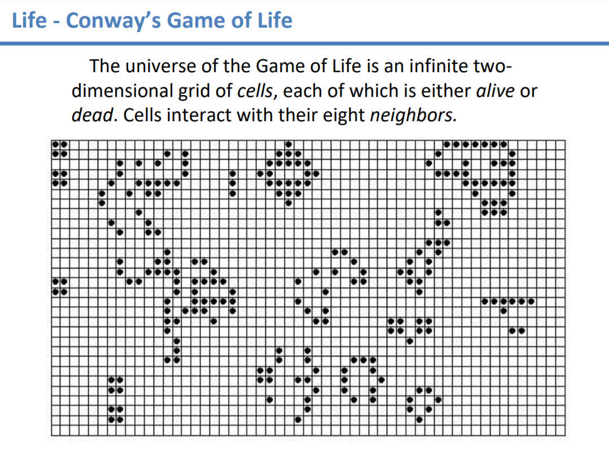

**Design di base**: griglia rettangolare di celle “vive” (accese) e “morte” (spente). <br>
I modelli complessi derivano da strutture semplici. <br>
In ogni generazione, le cellule sono governate da tre semplici regole. <br>
Le regole si basano su un vicinato di 9 bit, 512 combinazioni e possibili regole. In realtà sono state successivamente definite 3 semplici regole in grado di incarnarle tutte. 
- La cella muore se ha 2 o meno vicini vivi (muore per solitudine) 
- La cella muore se ha 5 o più vicini vivi (sovrappopolamento) 
- La cella nasce se ha 3 vicini vivi (procreazione per sesso ternario) 

(Questo significa che quando ha 4 vicini vivi lo stato resta invariato.) 


**Universalità computazionale** <br>
In Life possiamo definire segnali come flussi di alianti interpretati come bit. In questo modo si potrebbe implementare con le porte logiche (AND, NOT,...), implementare ritardi, banchi di memoria, duplicatori di segnale e così via. 
- Quindi, Life può emulare qualsiasi macchina informatica; diciamo che è capace di computazione universale. 
- La teoria del calcolo dice che, in generale, dato uno stato iniziale per l'automa, non esiste un modo scorciatoia per prevedere il risultato dell'evoluzione del modello. Dobbiamo eseguirlo.
- Diciamo che la Life è computazionalmente irriducibile. 
- In parole povere, questo significa che un'AC molto semplice come Life (e Regola 110 in 1D) può produrre comportamenti altamente non banali, che non possono essere previsti semplicemente osservando la regola di transizione. 
- L'`universo` costituito da un'AC può essere uno sfondo interessante per l'emergere di fenomeni complessi. 


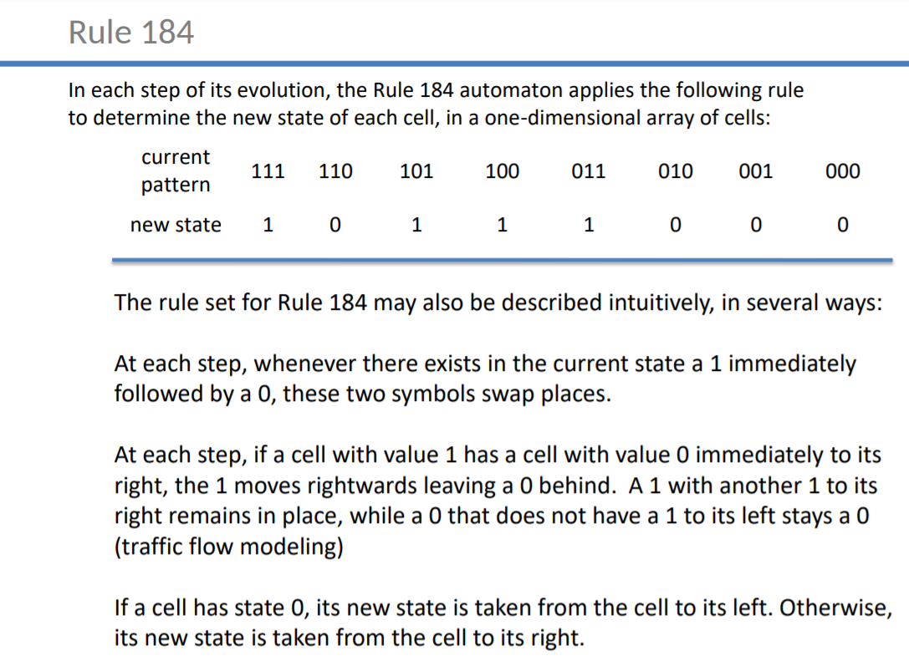

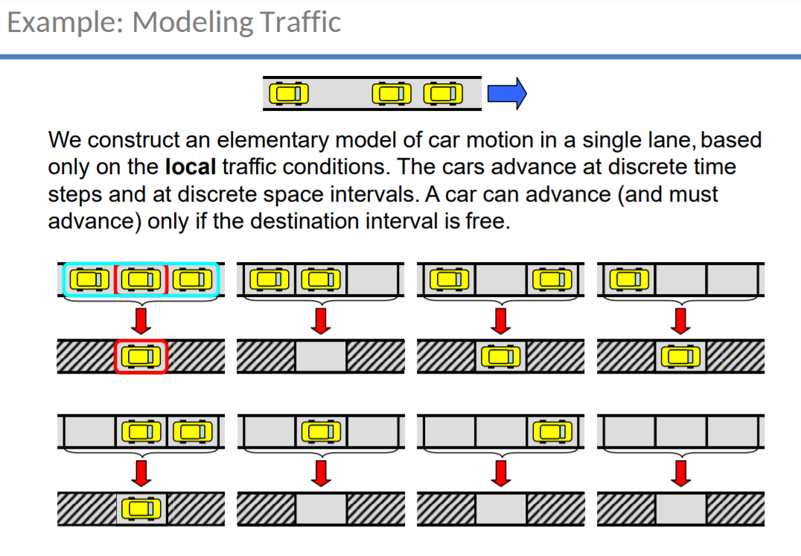

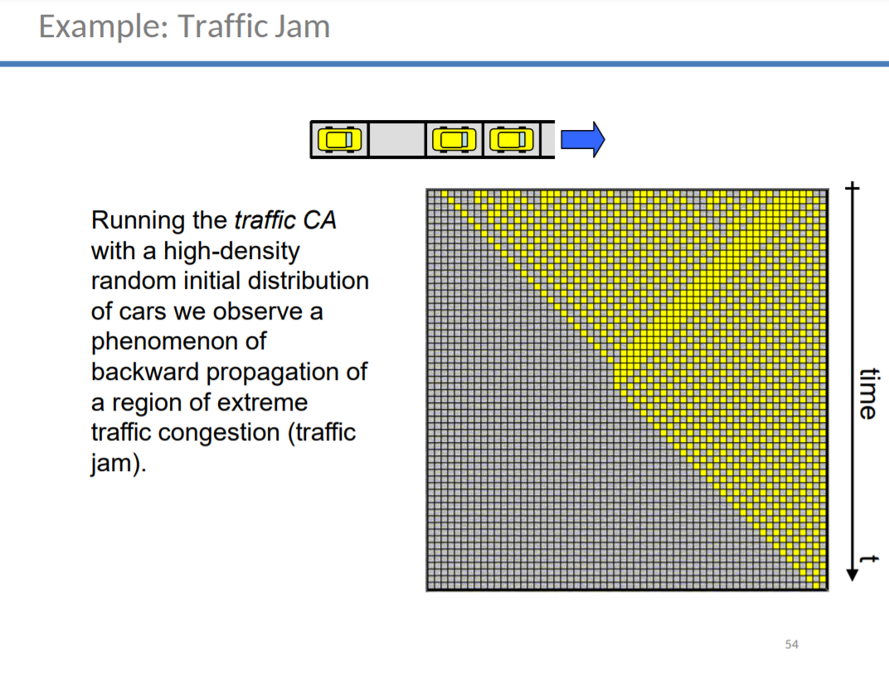


### **CA probabilistici**
Finora abbiamo considerato solo CA deterministici. Per modellare molti fenomeni è utile applicare regole di transizione che dipendono da qualche probabilità assegnata esternamente. <br>
***Esempio***: il modello dell'incendio boschivo 
- Ogni cella contiene un albero verde, un albero in fiamme o è vuota 
- Un albero in fiamme diventa una cella vuota 
- Un albero verde con almeno un vicino in fiamme diventa un albero in fiamme 
- Un albero verde senza vicini in fiamme diventa un albero in fiamme con probabilità f (probabilità di fulmine) 
- Una cella vuota fa crescere un albero verde con probabilità g (probabilità di crescita). 
- I parametri possono essere variati in un intervallo continuo e introdurre una certa `continuità` nel mondo discreto di CA models. 

**Il Forest Fire Model** è un automa cellulare stocastico a 3 stati definito su un reticolo dimensionale d con siti Ld. Ogni sito è occupato da un albero, un albero in fiamme o è vuoto. Ad ogni passaggio temporale il sistema viene aggiornato secondo le regole: 
1. sito vuoto albero con probabilità di crescita p 
2. albero in fiamme con la probabilità di frequenza dei fulmini f, se nessun vicino più vicino sta bruciando 
3. albero in fiamme con probabilità 1-g, se almeno un vicino più prossimo sta bruciando, dove g definisce l'immunità. 
4. albero in fiamme (sito vuoto) 


### **Regola Modello predatore/preda** <br>
Questa regola modellava una relazione predatore/preda. Inizia con una popolazione distribuita casualmente di pesci, squali e celle vuote in una griglia di celle 1000x2000 (2 milioni di celle). Inizialmente:
- Il 50% delle celle è occupato da pesci 
- Il 25% è occupato da squali 
- il 25% è vuoto 

#### **Regole in dettaglio: Regole del pesce** <br>
Se la cella corrente contiene un pesce:
- I pesci vivono per 10 generazioni. 
- Se >=5 vicini sono squali, il pesce muore (cibo per squali). 
- Se tutti e 8 i vicini sono pesci, il pesce muore (sovrappopolazione). 
- Se un pesce non muore, aumentare l'età. 

#### **Regole in dettaglio: Regole Shark** <br>
Se la cella corrente contiene uno squalo:
- Gli squali vivono per 20 generazioni. 
- Se >=6 vicini sono squali e vicini pesci =0, lo squalo muore (fame). 
- Uno squalo ha una probabilità di 1/32 (.031) di morire per cause casuali. 
- Se uno squalo non muore, aumenta l'età. 


### **Vantaggi delle CA**
- Sono necessari potenti motori di calcolo (GPU). 
    - Ma consentono un calcolo parallelo molto efficiente 
- Simulatore di sistemi dinamici discreti. 
    - Consentono un'indagine sistematica di fenomeni complessi. 
- Modelli originali di GéPphysics. 
    - Invece di guardare le equazioni della fisica fondamentale, considera di modellarle con CA. 
- È possibile studiare il comportamento emergente di un gruppo complesso da un semplice comportamento individuale. 
- I risultati della simulazione sono molto più intuitivi in quanto sono ben rappresentati visivamente 
- Semplice da implementare 

### **Svantaggi**
- Non adatto a sistemi che richiedono sintesi poiché le regole CA non possono essere facilmente previste dai risultati 
    - I risultati possono contenere informazioni ridondanti. 
- Possono essere generati modelli che sembrano complessi ma sono dati irrilevanti per quanto riguarda il comportamento emergente del sistema reale. 
    - A volte non è facile ottenere regole perfette che regolino l'evoluzione del sistema 
- È difficile capire se un modello CA coglie completamente le dinamiche del sistema che si sta modellando o aggiunge dinamiche superflue 

<hr>

# **Swarm Intelligence**

Come si coordinano insiemi di agenti distribuiti? Ad es. Formiche, traffico, termiti, branchi di pesci e stormi di uccelli?  In realtà non esiste alcun tipo di capo branco che muove e guida il resto del gruppo. In molti casi si ha in realtà una forma di controllo decentralizzato e distribuito. I singoli individui obbediscono in realtà a semplici regole di controllo distribuito. <br>
Generalmente date le regole, può risultare molto difficile dedurre il comportamento emergente dello sciame e spesso risulta possibile solo tramite la simulazione del modello.

Approccio più generale rispetto agli automi cellulari: 
- **regole generali**
- **continuo** vs **discreto** 
- **parametri** 

Nel modello informatico che consente di simulare gli sciami, i singoli individui sono visti come un insieme di agenti distribuiti, che elaborano ed interagiscono in parallelo, tra loro e con l’ambiente, e rispettando un insieme di regole di comportamento. Tutti assieme realizzano un modello di «democrazia collaborativa» perfetta! <br>
Intelligenza collettiva emergente, indotta dal rispetto delle regole degli agenti. <br>
***es***. la formazione di volo degli uccelli, o il movimento di gruppo dello sciame  
- Non è affatto semplice dedurre, date le regole, quello che sarà il comportamento emergente.
- Spesso possibile solo tramite simulazione del modello.

### **Swarm intelligence: il banco di pesci** <br>
TRE REGOLE  ---> I pesci seguono tre regole: **allineamento**, **separazione**, **coesione**
1. **Allineamento**: Un pesce tende a girare nella stessa direzione in cui i pesci vicini si stanno muovendo.
2. **Separazione**: Un pesce tenderà ad allontanarsi per evitare un pesce troppo vicino.
3. **Coesione**: Un pesce si muoverà verso i propri vicini, a meno che non sia troppo vicino. Se due pesci sono troppo vicini la regola di separazione, prevale sulle altre due finchè non è ristabilita la separazione minima. Le regole riguardano solo la direzione del movimento, la velocità resta costante.

### **Swarm intelligence: stormo di uccelli** <br>
(Netlogo Model Library: Biology> Flocking Biology> Flocking Vee Formation). <br>
La formazione a «V» emerge quando, alle regole di attrazione/coesione e repulsione/distanza minima si aggiunge la regola sul cono visivo: la visuale di un uccello deve essere libera. Se vista ostruita si sposta casualmente, a dx o a sx, fino a che non è più ostruita 

#### **Ricerche basate su Swarm Intelligence**
- utilizzati in intelligenza artificiale per crowd behavior: comportamento di folle reali (stadi, concerti, manifestazioni), virtuali (diffusione virale info, attacchi hater), studio vie di fuga edifici. Agenti con parametri variabili nel tempo es. Stato ubriachezza, visibilità entusiasmi, panico 

#### **Swarm intelligence: modelli di calcolo** <br>
Modelli di calcolo ispirati alla swarm intelligence: algoritmi per l’ottimizzazione di funzioni computazionalmente «hard» Particle Swarm Optimization (PSO). Nel PSO sciami di particelle collaborano per esplorare lo spazio  di ricerca. <br>
Inizialmente le particelle esplorano lo spazio di ricerca in modo casuale, col passare del tempo, lo sciame tende a convergere nella soluzione ottima «attratto» dalle particelle che hanno un successo maggiore
- ogni particella è un thread di calcolo 
- ad ogni iterazione si muovono in sincronia tendando una soluzione diversa e condividendo informazioni

**Particle Swarm Optimization (PSO)**: ogni particella i-esima all’iterazione t ha un vettore posizione xi,t ed un vettore velocità vi,t. Essa è attratta sia dal personal best (il miglior valore incontrato in precedenza durante l’esplorazione) che dal global best (il miglior valore trovato dalle altre particelle nel suo vicinato) 

**Modelli di calcolo ispirati alla swarm intelligence: Ant Colony Optimization** <br>
Ispirato dall’osservazione dei biologi del comportamento stigmergico delle formiche.  
Le formiche: 
- depositano feromone muovendosi 
- ad ogni punto di scelta si muovono casualmente scegliendo in modo probabilistico proporzionale alla quantità di feromone 
- Il feromone evapora (Fenomeno emergente): 
    - I percorsi ottimali tendono ad essere rafforzati, in quelli più lunghi il feromone tende ad evaporare e scomparire 


<hr>

# **Reinforcement Learning**

È un campo dell’intelligenza artificiale (fa parte del machine learning) in cui un agente sceglie le azioni basandosi su un premio numerico che ottiene dall’ambiente. Nel reinforcement learning:
- l’agente ha uno spazio degli stati che esplora
- l’agente conosce le azioni che può eseguire
- c'è una serie di azioni che l'agente può intraprendere in qualsiasi stato particolare
- c'è una ricompensa associata allo stato successivo in cui l'agente atterra

L'obiettivo dell'apprendimento per rinforzo è **progettare la policy** (dato uno stato lui conosce le azioni che deve eseguire) ottimale o quasi ottimale basata sui premi ricevuti. <br>
Nell’apprendimento di rinforzo non c’è supervisione, ma ci sono delle ricompense (reward). 
- Il feedback è in ritardo, non immediato. Il tempo conta, le azioni sono sequenziali.
- Le azioni dell’agente influenzano i dati successivi (modificano l’ambiente quindi gli stati successivi) che esso riceve. 

Esempi di applicazione:
- Apprendimento della guida di veicoli 
- Gestire un portafoglio azionario di investimenti 
- Controllare una centrale elettrica 
- Rendere possibile che un umanoide cammini 

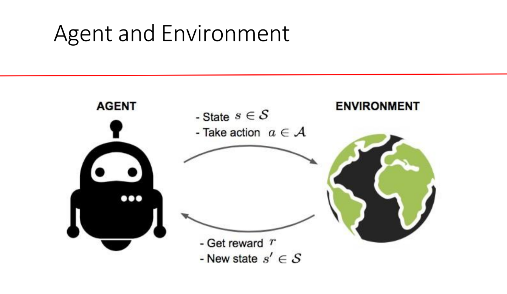

## **Agent and Envirnonment**

I protagonisti del RL sono l'agente e l'ambiente. <br>
L'**ambiente** è il mondo in cui l'agente vive e con cui interagisce. Ad ogni passo dell'interazione, l'agente vede un'osservazione (possibilmente parziale) dello stato del mondo, e poi decide l'azione da intraprendere. L'ambiente cambia quando l'agente agisce su di esso, ma può anche cambiare da solo. <br>
L'**agente** percepisce anche un segnale di ricompensa immediato dall'ambiente, un numero che gli dice quanto sia buono o cattivo l'attuale stato del mondo. `L'obiettivo dell'agente è massimizzare la sua ricompensa cumulativa, chiamata rendimento.`

I metodi di apprendimento per rinforzo sono modi in cui l'agente può apprendere i comportamenti per raggiungere il suo obiettivo. In un ambiente di rl l’agente si muove per prove ed errori e apprende attraverso la ripetuta azione delle stesse operazioni e tiene conto del bilancio finale di ogni serie di azioni. Non è importante in realtà il massimizzare il rendimento (reward) immediato ma quello a lungo termine (cumulativo totale).

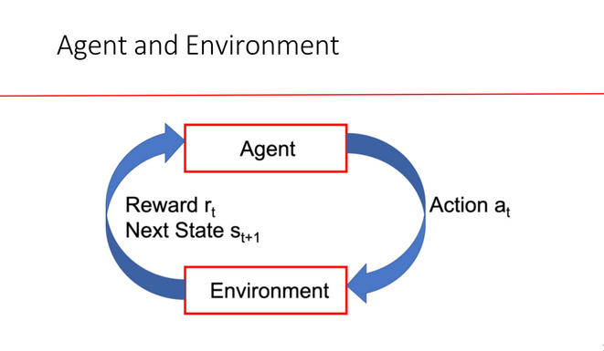


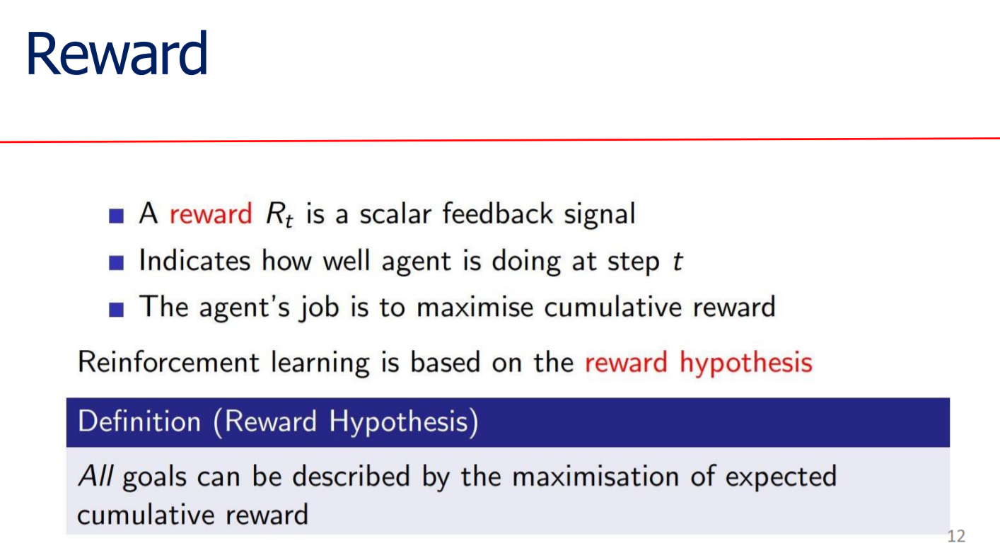

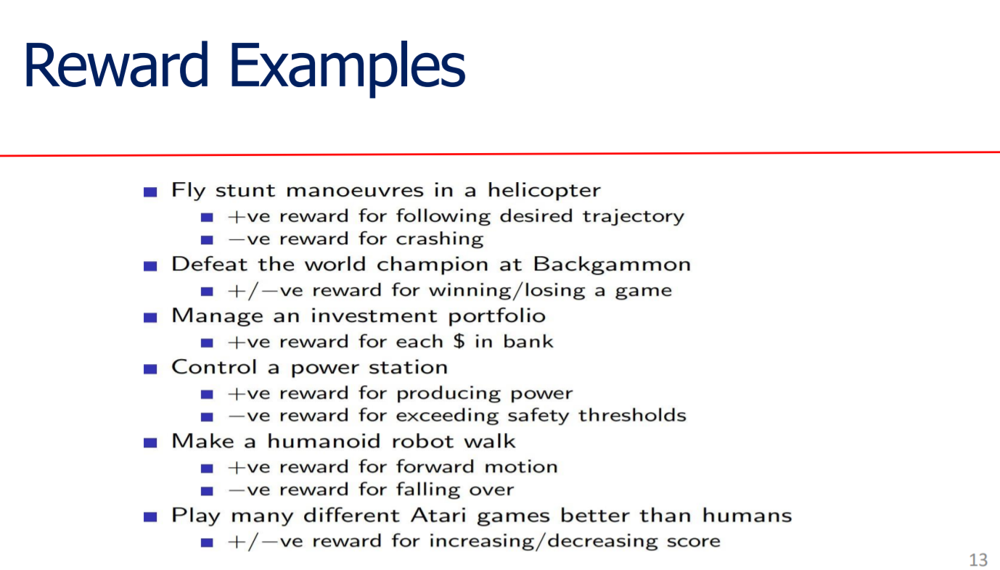

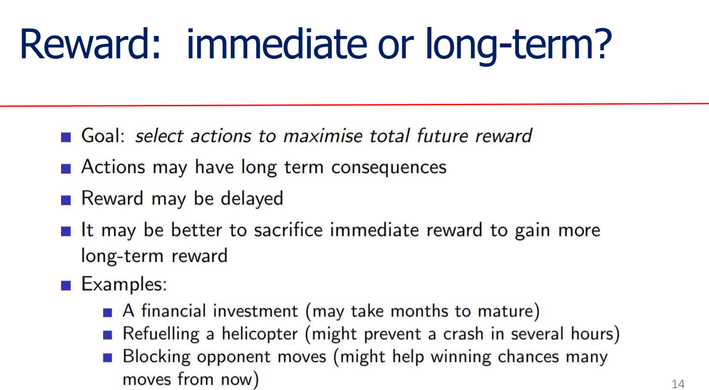

A seconda del problema il reward migliore può essere a breve o medio o lungo termine. <br>
A seconda della frequenza con cui vengono dati i reward, il modello può essere definito **sparso** oppure no. <br>
**Ricorda bene**: L'obiettivo dell'agente è quello di massimizzare la somma cumulata dei reward (Reward Hypothesis): un **reward Rt** è un feedback scalare che indica come si sta comportando l'agente allo step t. 

## **Concetti chiave**
- ### **Stati e osservazioni**
    Uno **stato** s è una descrizione completa dello stato del mondo. <br>
    Non ci sono informazioni sul mondo che sono nascoste allo stato. <br>
    Un'**osservazione** è una descrizione parziale di uno stato, che può omettere informazioni. Di solito l'agente riceve dall'ambiente osservazioni non stati. <br>
    In RL profondo, rappresentiamo quasi sempre stati e osservazioni con un vettore, una matrice o un tensore di ordine superiore a valori reali. Ad esempio, un'osservazione visiva potrebbe essere rappresentata dalla matrice RGB dei suoi valori di pixel; lo stato di un robot potrebbe essere rappresentato dai suoi angoli e velocità di giunzione. <br>
    Quando l'agente è in grado di osservare lo stato completo dell'ambiente, si dice che l'ambiente è completamente osservabile. Quando l'agente può vedere solo un'osservazione parziale, diciamo che l'ambiente è parzialmente osservable.
- ### **Spazi d'azione (dominio, spazio degli stati)**
    - spazio di azione: è l'insieme di tutte le azioni valide in un dato ambiente 
        - spazi di azione **discreti**, in cui l'agente ha a disposizione solo un numero finito di mosse (es. Atari e GO)
        - spazi di azione **continui**. Negli spazi di azione continua, le azioni sono vettori a valori reali (ad esempio, come quando l'agente controlla un robot in un mondo fisico)
   
    Il tipo di spazio di azione influenza profondamente le caratteristiche dell'algoritmo. 
- ### **Policies**
    Una **Policy** è una regola utilizzata dagli agenti per decidere quale azione compiere dato un determinato stato. Può essere di due tipi:
    1. Deterministica: indicata con u (mu) e associa un'azione ad un determinato stato. <br>
    
    2. Stocastica: indicata con pi (pigreco) e fornisce la distribuzione di probabilità delle azionoi dati gli stati. <br>
    

    A volte, nel Deep Reinforcement Learning, gli output delle policy dipendono da dei parametri e per denotare questi parametri, vengono messi come pedice accanto al simbolo della policy. <br>
    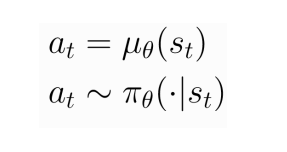
- ### **Traiettorie**
    Una **Trajectory** T (chiamate anche rollout) è una sequneza di stati e azioni nel mondo. <br>
    . <br>
    La **History** è una sequenza di osservazioni, azioni e reward. <br>
    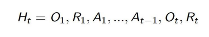 <br>
    Le **State Transitions** rappresentano cosa accade al mondo durante un cambio di stato (dallo stato st al tempo t allo stato st+1 al tempo t+1) e sono governate dalle legge dell'ambiente, e dipendono solo dall'azione più recente at.
    Possono essere:
    - **Deterministiche**: <br>
    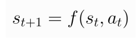
    - **Stocastiche**: <br>
    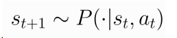
- ### **Reward and Return**
    La **reward Function R** è la parte più importante dei sistemi di reinforcement learning e può dipendere dall'azione, dallo stato attuale e dallo stato futuro, può talvolta essere semplificata dipendendo solo dallo stato attuale e dall'azione. <br>
    Quindi il **goal** dell'agente è quello di massimizzare una sorta di **reward cumulativo** ***R(T)*** individuato da una traiettoria. Si distingue tra:
    - **Finite-horizon undiscounted return**: è la somma dei reword ottenuti in un intervallo di tempo <br>
    
    - **Infinite-horizon discounted return**: la somma di tutti i reward ottenuti dall'agente, più sono recenti e meno influenzeranno la somma totale. <br>
     <br>
        I ritorni scontati sono pesati sempre meno via via con la successione. Il fattore di sconto è sia intuitivamente attraente che matematicamente conveniente.
        - ***A livello intuitivo***: i contanti ora sono meglio dei contanti dopo.  
        - ***Matematicamente***: una somma di ricompense all'orizzonte infinito potrebbe non convergere a un valore finito ed è difficile da trattare nelle equazioni.  
    
        In condizioni ragionevoli, con un fattore di sconto la somma infinita converge. 
- ### **Il problema di ottimizzazione nel Reinforcement Learning**
    Il vero obiettivo del Reinforcement Learning è quindi quello di massimizzare l'Expected Return J(pi) definito come segue: <br> 
     <br>
    Otterremo quindi la **policy ottimale**: <br>
     <br>
    Lo scopo di un algoritmo di rl è quello di trovare una policy ottimale. L’algoritmo si muove nello spazio delle policy. L’algoritmo cambierà, modificherà le rappresentazioni della policy fino a convergere nella policy ottimale. Lo farà cambiando la value function. 
- ### **funzioni di valore**
    La **Value Function** indica il valore di uno stato o di una coppia stato-azione. <br>
    Ce ne sono 4 tipi principali:
    1. **On-Policy Value Function**: che restituisce l'Expected Return se si parte dallo stato s e si applica sempre la policy pi. <br> 
    
    2. **On-Policy Action-Value Function**: che restituisce l'Expected Return se si parte dallo stato s, partendo con un azione arbitraria a e poi seguendo sempre la policy pi. <br> 
    
    3. **Optimal Value Function**: che restituisce l'Expected Return se si parte dallo stato s e si applica sempre la optimal policy. <br>
    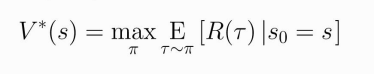
    4. **Optimal Action-Value Function**: che restituisce l'Expected Return se si parte dallo stato s, partendo con un'azione arbitraria a e poi seguendo sempre la optimal v. <br>
    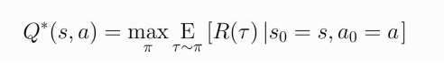

<hr>

### **Tassonomia degli algoritmi nel Reinforcement Learning**
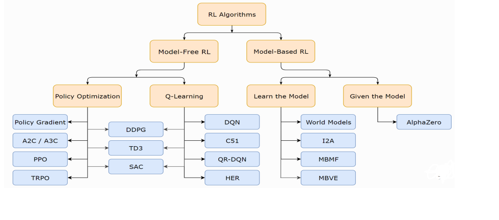

**Model free:** non conosciamo l’ambiente. <br>
**Policy optimization**: basato sul value. <br>
**Q_learning**: basato sulla coppia value azione. <br>
**Model based**: apprendiamo la policy come al solito, ma sapendo come il mondo evolve agendo (nello spazio degli stati invece esploravamo e poi agivamo). <br>
**Learn the model**: il modello è sconosciuto ma attraverso l’esecuzione delle azioni mi posso creare un’aspettativa di come funziona il mondo.<br>


Ci sono due categorie principali di approcci per il reinforcement learning:
- **MODEL BASED**: viene utilizzato un algoritmo che utilizza la funzione di transizione (e la funzione di ricompensa) per stimare la policy ottimale.
- **MODEL FREE**: viene utilizzato un algoritmo che stima la policy ottimale senza utilizzare o stimare le dinamiche (funzioni di transizione e ricompensa) dell'ambiente. Può essere suddiviso in 2 sottocategorie:
    - **Action Utility Learning**: 
    - **Policy Search**:


### **Reinforcement Learning Agents vs Planning Agents**
**Planning** = ricerca nello spazio degli stati. <br>
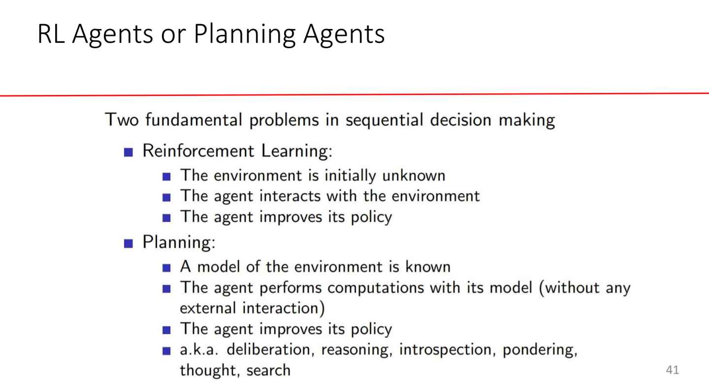

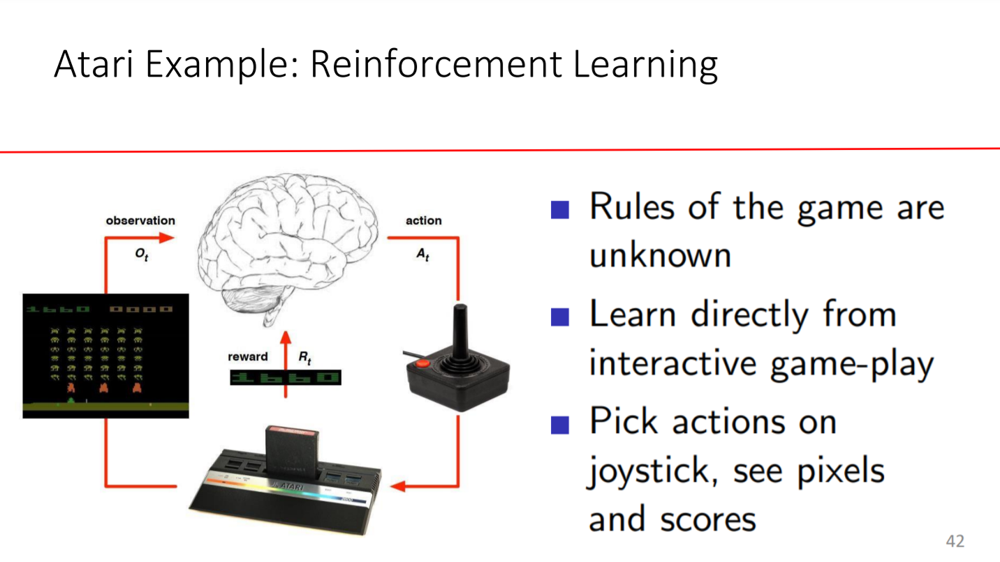

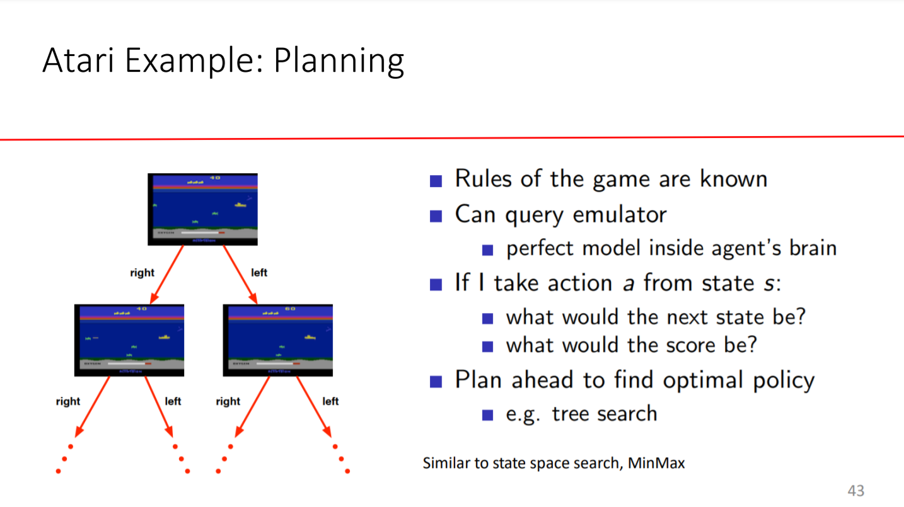

### **Exploitation vs Exploration**
Il Reinforcement Learning è un metodo di apprendimento trial-and-error, l'agente deve trovare una buona policy e per farlo dobbiamo trovare una compromesso tra esplorazione di nuove mosse (**Exploration**) e lo sfruttamento di alcune già conosciute (**Exploitation**). <br>
***esempi***:
- Selezione di un ristorante
    - **Exploitation**: andare nel proprio ristorante preferito. 
    - **Exploration**: provare un nuovo ristorante.

<hr>

## **Markov Decision Process**
Una **state transition** si dice Markoviana quando la probabilità di raggiungere lo stato s(t+1) dipende solo da s(t) e non dagli stati precedenti. <br>


Un **Markov decision process** è una 5-tupla (S,A,R,P,p0) dove :
- S è l'iniseme degli stati validi
- A è l'insieme di tutte le azioni valide
- R è la reward function
- P è la transition probability, ovvero la probabilità di raggiungere lo stato s' se si parto da uno stato s e si effettua un azione a.
- p0 è lo stato iniziale della distribuzione

L'insieme delle transizioni di stato possono rappresentate come una **Transition Matrix** contente tutte le possibili transizioni e le relative probabilità.

L'**MDP** può essere anche definito come una tupla (S,P) dove :
- S è l'insieme finito degli stati
- P è la state transition probabilityt matrix

il **Markov Reward Process** è una tupla formata da (S,P,R,y(gamma)) dove:
- S è l'inisieme finito di stati
- P è la matrice di transizione 
- R è la reward fuction
- y è un fattore di discount compreso tra 0 e 1

Il discount viene utilizzato per:
- una convenienza metematica
- evita rendimenti infiniti nei processi di Markov ciclici
- l'incertezza sul futuro potrebbe non essere pienamente rappresentata
- se il premio è finanziario, i premi immediati possono guadagnare più interesse rispetto ai premi ritardati
- spesso viene preferito un reward immediato (e.g. comportamenti umani o finanza)
- A volte è possibile utilizzare processi di ricompensa Markov non scontati se tutte le sequenze terminano

Il **reward totale scontato** allo step **t** è calcolato come segue: <br>
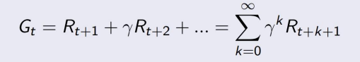


Qui il discount factor y valuta maggiormete i reward immediati rispetto a quelli futuri.
Questo avviene perchè, come si capisce dalla formula, se y è vicina a 0 questa va a far annullare i reward dopo l'azione successiva, portando così a valorizzare di più valutazioni immediate invece che lungimiranza.


La value function v(s) fornisce il valore a lungo termine dello stato s, ovvero il ritorno aspettato partendo dallo stato s: <br>


<hr>

## **Q-Learning**
Q-learning è un algoritmo di apprendimento per rinforzo **model-free**. <br>
Q-learning è un algoritmo di apprendimento **values-based**. Gli algoritmi basati sul valore aggiornano la funzione del valore in base a un'equazione (in particolare l'equazione di Bellman). Mentre l'altro tipo, **policy-based**, stima la funzione del valore con una policy greedy ottenuta dall'ultimo miglioramento della policy. <br>
- Q-learning è un **off-policy learner**. Significa che apprende il valore della policy ottimale indipendentemente dalle azioni dell'agente. È considerato off-policy perché la funzione q-learning apprende da azioni che sono al di fuori della policy attuale, come l'esecuzione di azioni casuali, e quindi una policy non è necessaria.
- D'altra parte, un **on-policy learner** apprende il valore della policy attuata dall'agente, comprese le fasi di esplorazione e troverà una policy ottimale, tenendo conto dell'esplorazione inerente alla policy.

***Cos'è questa "Q"?*** <br>
La "Q" in Q-learning sta per qualità. La qualità qui rappresenta quanto sia utile una determinata azione per ottenere una ricompensa futura.

### **Definizione di Q-learning**
- `Q*(s,a)` è il valore atteso (ricompensa cumulativa scontata) di fare un'azione **a** in uno stato **s** e quindi seguire la policy ottimale.
- Q-learning utilizza le **differenze temporali (TD)** per stimare il valore di `Q*(s,a)`. La differenza temporale è un agente che apprende da un ambiente attraverso episodi senza alcuna conoscenza preliminare dell'ambiente.
- L'agente mantiene una tabella di `Q[S, A]`, dove **S** è l'insieme degli stati e **A** è l'insieme delle azioni.
- `Q[s, a]` rappresenta la sua attuale stima di `Q*(s,a)`.


### **Taking Action: Explore or Exploit**
Un agente interagisce con l'ambiente in uno di due possibili modi. 
- Il primo consiste nell'usare la q-table come riferimento e visualizzare tutte le azioni possibili per un determinato stato. L'agente seleziona quindi l'azione in base al valore massimo di tali azioni. Questo è noto come **exploiting** poiché utilizziamo le informazioni che abbiamo a nostra disposizione per prendere una decisione.
- Il secondo modo per agire è farlo in modo casuale. Questo si chiama **exploring**. Invece di selezionare le azioni in base alla ricompensa futura massima, selezioniamo un'azione a caso. Agire in modo casuale è importante perché consente all'agente di esplorare e scoprire nuovi stati che altrimenti potrebbero non essere selezionati durante il processo di sfruttamento.

Puoi ***bilanciare Explore/Exploit*** usando `epsilon (ε)` e impostando il valore della frequenza con cui vuoi esplorare e sfruttare. Ecco del codice approssimativo che dipenderà da come sono impostati lo stato e lo spazio di azione.
```python
import random
# Set the percent you want to explore
epsilon = 0.2
if random.uniform(0, 1) < epsilon:
    """
    Explore: select a random action
    """
else:
    """
    Exploit: select the action with max value (future reward)
    """
```

<hr>

### **Esempio semplice di Q-learning**
Diciamo che un agente deve spostarsi da un punto di partenza a un punto finale lungo un percorso che presenta ostacoli. L'agente deve raggiungere l'obiettivo nel modo più breve possibile senza urtare gli ostacoli e deve seguire il confine coperto dagli ostacoli. Per nostra comodità, l'ho introdotto in un ambiente di griglia personalizzato come segue.

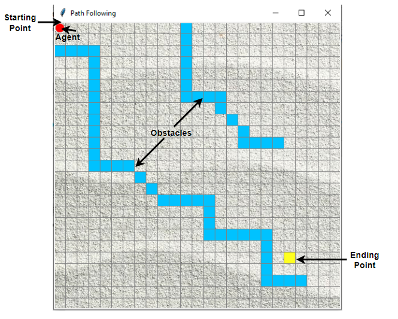

### **Presentazione della Q-Table**
Q-Table è la struttura dati utilizzata per calcolare le ricompense future massime attese per l'azione in ogni stato. Fondamentalmente, questa tabella ci guiderà verso l'azione migliore in ogni stato. Per apprendere ogni valore della tabella Q, viene utilizzato l'algoritmo Q-Learning.

### **Funzione Q**
La funzione Q utilizza l'equazione di Bellman e accetta due input: **stato (s) e azione (a)**. <br>


### **Processo dell'algoritmo di Q-learning**<br> 


### **Passaggio 1: inizializza la Q-Table**
Per prima cosa deve essere costruito la Q-table. Ci sono **n** colonne, dove n = numero di azioni. Ci sono **m** righe, dove m = numero di stati. <br>
Nel nostro esempio n= `{Vai a sinistra, Vai a destra, Vai su e vai giù}` e m= `{Inizio, Idle, Percorso corretto, Percorso sbagliato e Fine}`. <br> 
Innanzitutto, inizializziamo i valori a 0. <br>
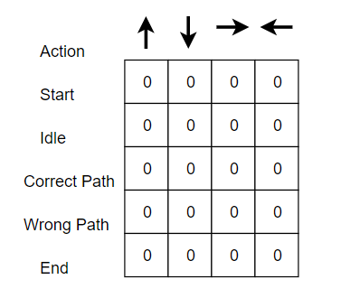

### **Passaggio 2: scegli un'azione**

### **Passaggio 3: eseguire un'azione**
La combinazione dei passaggi 2 e 3 viene eseguita per un periodo di tempo indefinito. Questi passaggi vengono eseguiti fino all'interruzione dell'addestramento o all'interruzione del ciclo di addestramento come definito nel codice. <br>
Innanzitutto, viene scelta `un'azione (a)` nello `stato (s)` in base alla tabella Q. Nota che, come accennato in precedenza, quando l'episodio inizia, ogni valore Q dovrebbe essere 0. <br>
Quindi, aggiorna i valori Q per essere all'inizio e spostarti a destra usando l'equazione di Bellman che è indicata sopra. <br>
Il concetto di **Epsilon greedy strategy** entra in gioco qui. All'inizio, i tassi di epsilon saranno più alti. L'agente esplorerà l'ambiente e sceglierà casualmente le azioni. Ciò si verifica logicamente in questo modo, poiché l'agente non sa nulla dell'ambiente. Quando l'agente esplora l'ambiente, il tasso di epsilon diminuisce e l'agente inizia a sfruttare l'ambiente. <br>
Durante il processo di esplorazione, l'agente diventa progressivamente più confidente nella stima dei valori Q. <br>
Nel nostro esempio di agente, quando la formazione dell'agente inizia, l'agente è completamente inconsapevole dell'ambiente. Quindi diciamo che compie un'azione casuale nella direzione "giusta". <br>
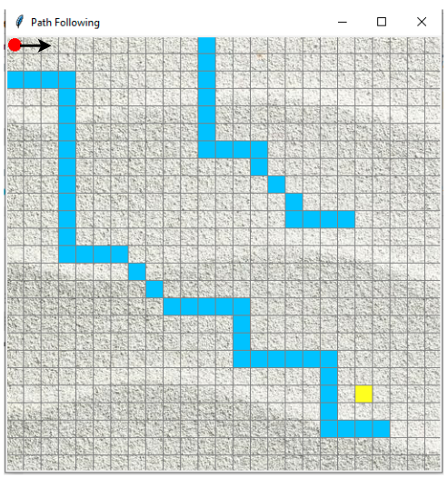

Ora possiamo aggiornare i valori Q per essere all'inizio e spostarci a destra usando l'equazione di Bellman. <br>
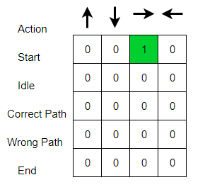

### **Passaggio 4: Misura la ricompensa**
Ora abbiamo intrapreso un'azione e osservato un risultato e una ricompensa.

### **Passaggio 5: Valutazione**
Dobbiamo aggiornare la funzione `Q(s,a)`. <br>
Questo processo viene ripetuto ancora e ancora fino a quando l'apprendimento non viene interrotto. In questo modo la Q-Table viene aggiornata e la funzione valore Q viene massimizzata. Qui `Q(stato, azione)` restituisce la ricompensa futura attesa di quell'azione in quello stato. <br>


- ***Tasso di apprendimento (lr o learning rate)***: spesso indicato come alfa o α, può essere semplicemente definito come quanta influenza dà il ​​nuovo valore rispetto al vecchio valore. Sopra prendiamo la differenza tra nuovo e vecchio e poi moltiplichiamo quel valore per il tasso di apprendimento. Questo valore viene quindi aggiunto al nostro precedente valore q che essenzialmente lo sposta nella direzione del nostro ultimo aggiornamento.
- ***Gamma  o γ***: è un fattore di sconto. È usato per bilanciare la ricompensa immediata e futura. Dalla nostra regola di aggiornamento sopra puoi vedere che applichiamo lo sconto al premio futuro. In genere questo valore può variare da 0,8 a 0,99.
- ***Ricompensa***: è il valore ricevuto dopo aver completato una determinata azione in un determinato stato. Una ricompensa può verificarsi in un determinato passaggio temporale o solo nel passaggio temporale terminale.
- ***Max o np.max()*** (usa la libreria numpy): prende il massimo della ricompensa futura e la applica alla ricompensa per lo stato attuale. Ciò che fa è influenzare l'azione attuale con la possibile ricompensa futura. Questa è la bellezza del q-learning. Stiamo assegnando ricompense future alle azioni in corso per aiutare l'agente a selezionare l'azione di ritorno più alta in un dato stato.

Nell'esempio, ho inserito lo schema di reward come segue.
- Ricompensa quando raggiungi un passo più vicino all'obiettivo = +1
- Ricompensa quando viene colpito un ostacolo =-1
- Ricompensa quando inattivo=0

Inizialmente, esploriamo l'ambiente dell'agente e aggiorniamo la Q-Table. Quando il Q-Table è pronto, l'agente inizia a sfruttare l'ambiente e inizia a intraprendere azioni migliori. Il Q-table finale può essere come quello che segue (per esempio). <br>


Di seguito sono riportati i risultati del percorso più breve dell'agente verso l'obiettivo dopo l'allenamento. <br>
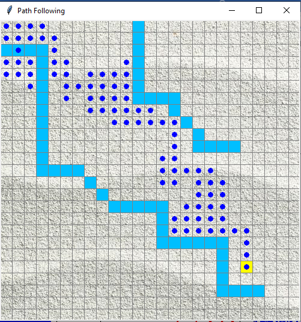

<hr>

# **Social Network Analysis**

La SNA ha origine ha origine dallo studio delle scienze sociali, nell’analisi delle reti e nella teoria dei grafi. La network analysis è principalmente utilizzata nella formulazione e nella soluzione di problemi che hanno una struttura a network, rappresentata principalmente utilizzando dei grafi. <br>
La teoria dei grafi fornisce un insieme di concetti e metodi di analisi utilizzabili per questo tipo di problemi. Questo, in combinazione ad altri strumenti analitici sviluppati appositamente per l’analisi di reti sociali, forma la base per ciò che è comunemente chiamato SNA methods. <br> 
Ma la SNA non è solo una metodologia, è una prospettiva di come le società funzionano: invece di concentrarsi su caratteristiche e attributi del singolo, essa si specifica sulle relazioni tra individui, gruppi e istituzioni sociali. <br>
SNA ha trovato applicazione in molti domini. Gli informatici hanno ad esempio sviluppato e approfondito tale ambito nello studio di pagine web, traffico internet, disseminazione di informazioni e molto altro. Sono anche utilizzate per identificare criminali, terroristi e molto altro, sulla base delle comunicazioni, identificando giocatori chiave in queste reti. Inoltre, agenzie come Facebook usano SNA per identificare e raccomandare amici sulla base di amici di amici e altro. 

### **Definizione formale di centralità**
Le domande di base sulla struttura della rete includono centralità, robustezza, comunicabilità e problemi di rilevamento della comunità: 
- Quali sono i nodi più “importanti”? 
    - Connettività di rete e robustezza/vulnerabilità 
    - Identificazione di individui influenti nei social network 
    - Proteine essenziali nelle reti PPI (letalità) 
    - Identificazione delle specie chiave di volta negli ecosistemi 
    - Centralità dell'autore nelle reti di collaborazione 
    - Classifica di documenti/pagine web su un determinato argomento 
- Come si diffondono i “disturbi” in una rete? 
    - Diffusione di epidemie, credenze, dicerie, mode,... 
    - Instradamento dei messaggi; colli di bottiglia, possibilità di restituzione 
- Come identificare le “strutture comunitarie” in una rete? 
    - Clustering, chiusura triadica (transitività) 
    - Partizionamento 

Perché e quando utilizzare SNA:
- Nello studio di reti sociali 
- Quando si vogliono visualizzare i dati per scovare eventuali pattern, relazioni ed interazioni su di essi 
- Quando si vogliono seguire i percorsi che le informazioni seguono nelle reti sociali 
- Analizzare social network, social media e in generale studiare comunità 

## **Concetti base**
- **Networks**: Come rappresentare le varie reti sociali 
- **Forza del legame**: Come identificare legami forti e deboli nelle reti 
- **Elementi chiave**: Come identificare nodi chiave o centrali nelle reti 
- **Coesione**: Misure della struttura complessiva della rete 

### **Network**
Rappresentazione tramite grafi (sia diretti che aciclici). <br>
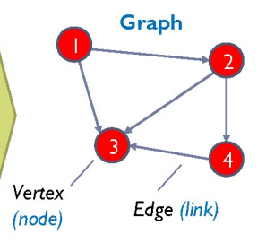

Tipi di grafi:
- Grafi
- Grafi pesati
- Multigrafi
    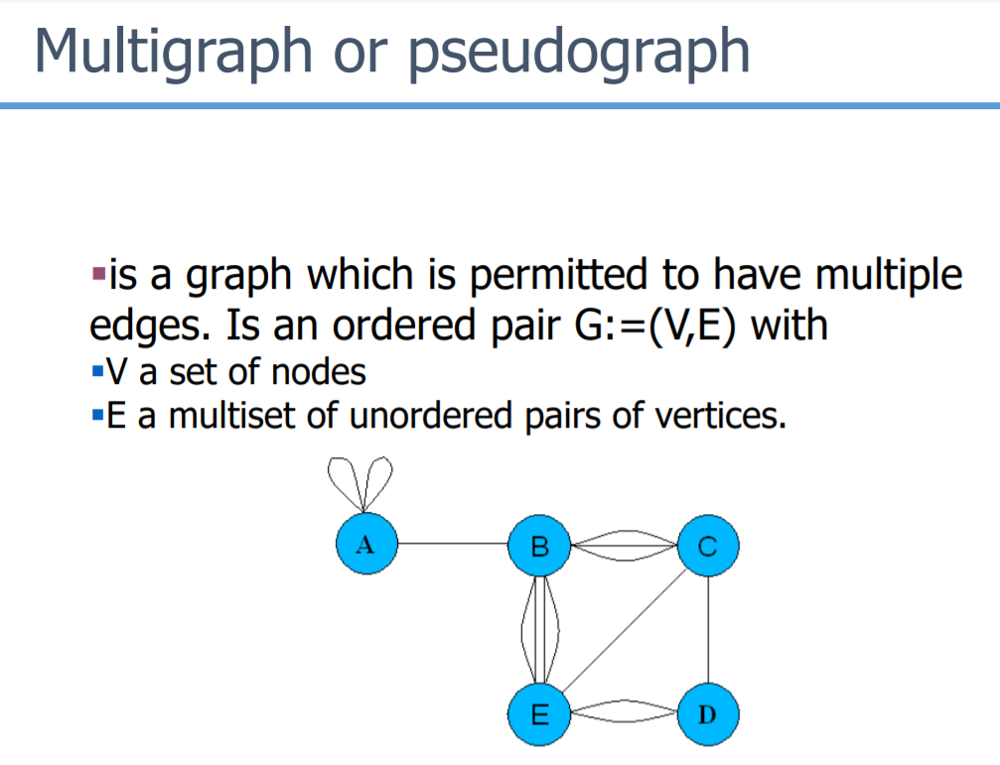 <br>
    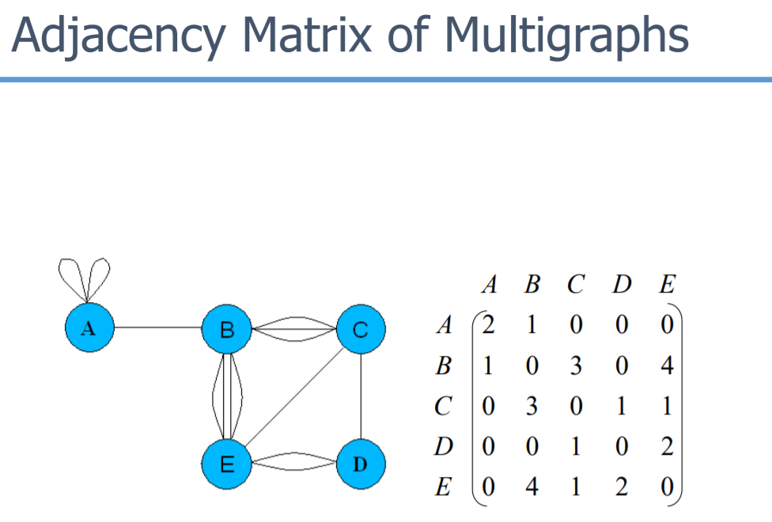

- pseudografi
- digrafi (directed graph)
- Grafi semplici: sono grafi senza archi multipli o loop sullo stesso nodo.

### **Definizioni formali**
Le reti del mondo reale sono generalmente modellate mediante grafi. <br>
Un grafo G = (V, E) è costituito da un insieme (finito) V = {v1, v2, . . . , vN } di nodi (o vertici) e un insieme E di archi (o collegamenti), che sono coppie {vi, vj } con vi, vj ∈ V. <br>
Il grafo G è orientato se gli archi {vi, vj } ∈ E sono coppie ordinate = (vi, vj ) ∈ V × V , altrimenti G è non orientato. Un grafo orientato viene spesso definito digrafo. <br>
Un ciclo in G è un arco da un nodo a se stesso. I loop sono spesso ignorati o esclusi. 
Un grafo G è pesato se ai suoi archi sono associati valori numerici. Se a tutti gli archi viene assegnato lo stesso valore 1, si dice che il grafico non è pesato. <br>
Un grafo semplice è un grafo non pesato senza più bordi o loop. <br>
Un cammino di lunghezza k in G è un insieme di nodi vi1, vi2, . . . vik , vik+1 tale che per ogni 1 ≤ j ≤ k, esiste un arco tra vij e vij+1 .  <br>
Un cammino chiuso è un cammino dove vi1 = vik+1 . <br>
Un percorso è una passeggiata senza nodi ripetuti. 
Un ciclo è un percorso con un bordo tra il primo e l'ultimo nodo. In altre parole, un ciclo è un percorso chiuso.
Un triangolo in G è un ciclo di lunghezza 3. <br>
La distanza geodetica d(vi, vj ) tra due nodi è la lunghezza del cammino minimo che collega vi e vj . Sia d(vi, vj ) = se tale cammino non esiste. <br> 
Il diametro di un grafico G = (V, E) è definito come diam(G) :=  max d(vi, vj ). vi, vj ∈V <br>
Un grafo G è connesso se per ogni coppia di nodi vi e vj esiste un cammino in G che inizia in vi e finisce in vj ; cioè diam(G) < ∞. <br>
Queste definizioni si applicano sia ai grafi non orientati che a quelli diretti, sebbene in quest'ultimo caso si debba tener conto dell'orientamento degli spigoli. 

Ad ogni grafo non pesato G = (V, E) associamo la sua matrice di adiacenza A = [aij] ∈ R^N×N , con aij = 
- 1, se (vi, vj) ∈ E,
- 0, altro. 

Qualsiasi rinumerazione dei nodi del grafo risulta in una permutazione simmetrica A → PAP^T della matrice di adiacenza del grafo. Se G è un grafo non orientato, A è simmetrico con zeri lungo la diagonale principale (A è "vuoto"). In questo caso gli autovalori di A sono tutti reali. <br>
Etichettiamo gli autovalori di A in ordine non crescente: 1 ≥ λ2 ≥ · · · ≥ λN . Nota che A è sempre indefinito se E ƒ= ∅. 

Se G è connesso, allora λ1 è semplice e soddisfa λ1 > |λi| per 2 ≤ i ≤ N
(questo segue dal teorema di Perron-Frobenius). In particolare, il raggio spettrale ρ(A) è dato da λ1. 

Se G è non orientato, il grado di del nodo vi è il numero di archi incidenti a vi in G. In altre parole, di è il numero di "vicini immediati" di vi in G. <br>
Un grafo regolare è un grafo in cui ogni nodo ha lo stesso grado d. <br>
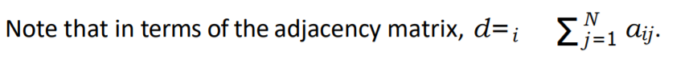

Per un grafo orientato, definiamo l'in-grado del nodo vi come il numero dini degli archi che terminano in vi e l'out-grado di vi come il numero dout degli archi che hanno origine in vi. In termini di matrice di adiacenza (non simmetrica), <br>
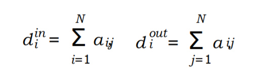

  
Quindi, le somme delle colonne di A danno i gradi interni e le somme delle righe danno i gradi esterni. 

Un grafo non orientato G = (V, E) è bipartito se esistono V1, V2 ⊂ V , con V1, V2 ƒ= ∅, V = V1 ∪ V2, V1 ∩ V2 = ∅ tali che gli archi possono esistere solo tra nodi appartenenti a diversi sottoinsiemi V1, V2. In altri termini, un grafo è bipartito se non contiene cicli di lunghezza dispari. <br>
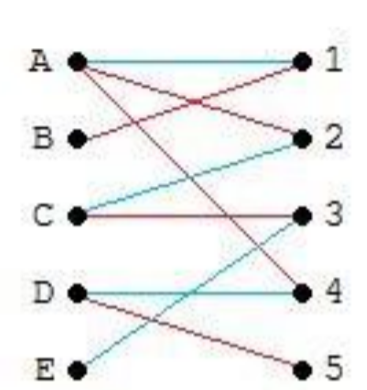

### **Forza dei legami/collegamenti**
La forza di un collegamento viene rappresentata tramite un numero o peso associato al collegamento stesso. <br>
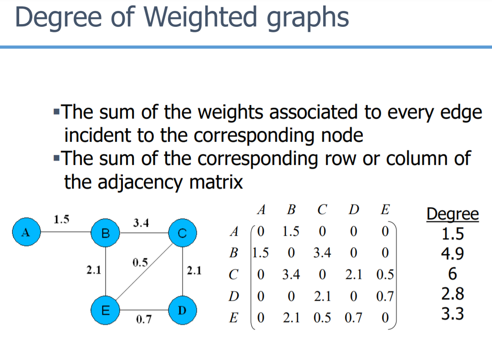

I collegamenti (gli archi) possono rappresentare interazioni, flussi di informazioni, affinità o relazioni sociali.
Nelle relazioni sociali questo peso può essere inteso come:
- la frenquenza delle interazioni
- la recoprocità delle interaizoni
- il tipo dell'interazione (intime o non)
- altri attributi come relazione di parentela


### **Homophily, Transitivity e Bridging**
- **Homophily**: la tendenza di legarsi a persone con caratteristiche simili. 
    - Tende a formare clusters, gruppi omogeni, dove formare relazioni è più semplice.
    - L'estrema omogeneizzazione può agire contro l'innovazione e la generazione di idee (l'eterofilia è quindi auspicabile in alcuni contesti).
    - I legami di omofilia possono essere forti o deboli.
- **Transitivity**: è una proprietà dei collegamenti, se A e B sono connessi e B e C sono connessi allora in un network transitivo A e C sono connessi. 
    - Legami forti sono più spesso transitivi rispetto a quelli deboli. La transitività è inoltre l’evidenza dell’esistenza di legami forti (non è una condizione necessaria o sufficiente).
    - Transitività e omofilia insieme conducono alla formazione di **cicli** (grafi completamente connessi) 
- **Bridging**: sono nodi e archi che connettono vari gruppi.
    - Facilitano la comunicazione inter-gruppo, incrementano la coesione sociale e spronano l’innovazione.
    - Sono solitamente legami deboli, ma non necessariamente ogni legame debole è un ponte 

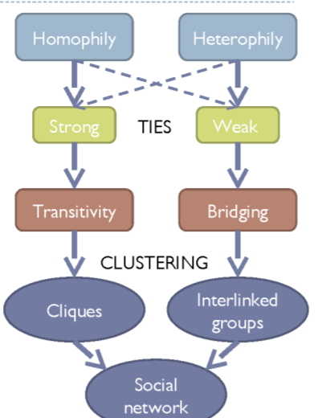

<hr>

## **Key Players**
Metodi di valutazione dei Key Player in un social network:
- **IN/OUT-Degree centrality**: il numero di collegamenti in ingresso o in uscita di un certo nodo. Se il grafo è non orientato allora i due conincidono. Utile per distinguere nodi chiave per la diffusione di informazioni nel loro immediato vicinato. <br>


- **Path e shortest paths**: un path tra due nodi è una sequenza di archi e nodi non ripetuti che connette due nodi. Lo shortest path tra due nodi è il path che connette due nodi con il minor numero di archi (anche detto distanza tra due nodi).

- **Betweenness centrality**: mostra quali nodi è più probabile che siano in comunicazione con gli altri (i nodi più attraversati). Utile per capire quali in quale punto la rete potrebbe rompersi e perdere più nodi connessi. Si calcola come segue:
    - Dato un nodo V, si calcola il numero P di shortest path, tra i e j, che lo attraversano
    - Si calcola il numero totale T di shortest path tra i e j
    - Si calcola B = P/T
    - Si ripetono queste operaizoni per ogni coppia di i e j e si sommano tutti. <br>
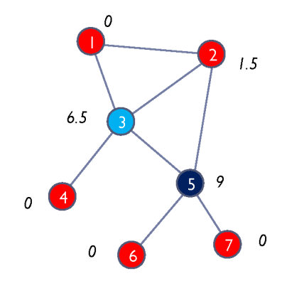 <br>
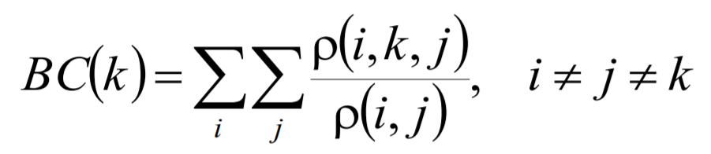 <br>
    I nodi con un'elevata centralità di intersezione sono interessanti perché:
    - Controllano il flusso di informazioni in una rete
    - potrebbe essere richiesto di portare più informazioni. <br>
    E quindi, tali nodi possono essere oggetto di attacchi mirati 

- **Closeness centrality**: serve a misurare il ***reach***, ovvero la velocità con cui un'informazione raggiunge altri nodi partendo da un dato nodo iniziale. Si calcola con il reciproco della media della lungezza degli shortest path da quel nodo verso tutti gli altri. <br>
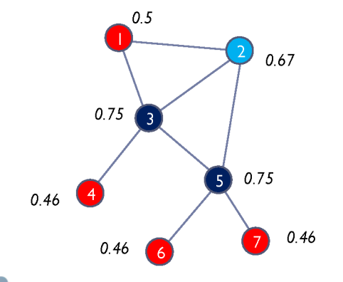 <br>
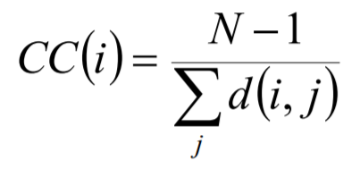

- **Eigenvector centrality**: i nodi con valori di eigenvetctor alto sono connessi con altri nodi con alti valori di eigenvector. Simile a come Google valuta le pagine web, link a pagine molto likante contano più. Utile per determinare chi è connesso a nodi più "autorevoli". <br>
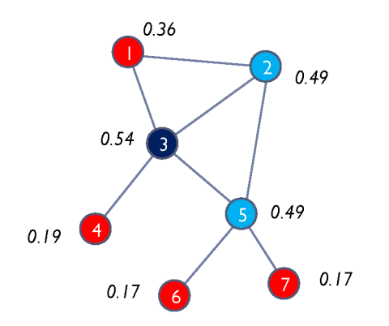

#### **Esempio**: <br>
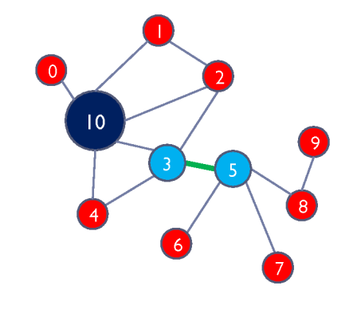 <br>
In questo esempio il nodo 10 è quello con valore Degree Centrality più elevato, ma se si rompe il collegamentro tra 3 e 5, il network si spezzerebbe a metà, perciò 3 e 5 sono più importanti del nodo 10 per la struttura della rete

### **Interpretazione delle misure**
|Misure di centralità|Interpretazione nelle reti sociali (Social network)|
|------------|------------|
|Grado|Quante persone può raggiungere direttamente questa persona?| 
|Betweenness|Quanto è probabile che questa persona sia la via più diretta tra altre due persone in rete (network)?| 
|Closeness (vicinanza)|Quanto velocemente questa persona può raggiungere tutti gli altri nella rete? | 
|Eingenvector (autovettore)|Quanto è ben collegata questa persona ad altre persone ben collegate nella rete?| 			 

#### **Altre possibili interpretazioni (sempre secondo l’ordine precedente)**
- In un network di collaborazioni musicali: con quante persone ha collaborato questa persona?
- In una rete di spie: quale è la spia con più probabilità a cui possono fluire informazioni riservate?
- In una rete di relazioni sessuali: quanto velocemente una malattia può essere sparsa da questa persona al resto della rete?
- In una rete di citazioni di articoli scientifici: qual è l’autore che è più citato da altri autori molto citati? 

#### **Subgraph Centrality**
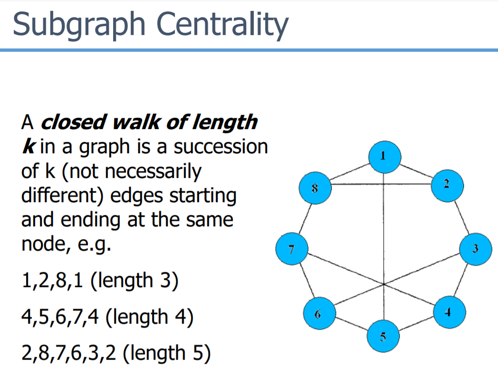<br>
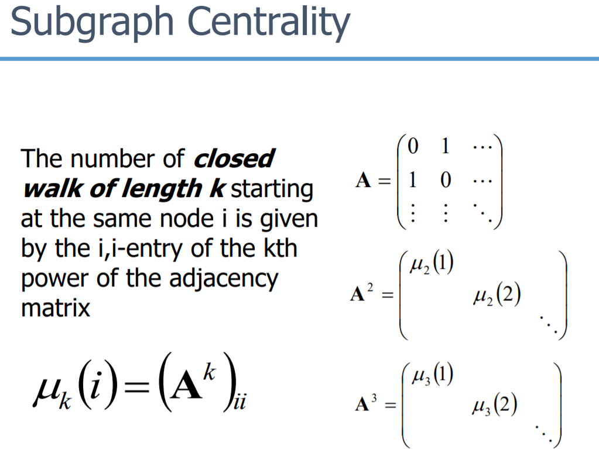<br>
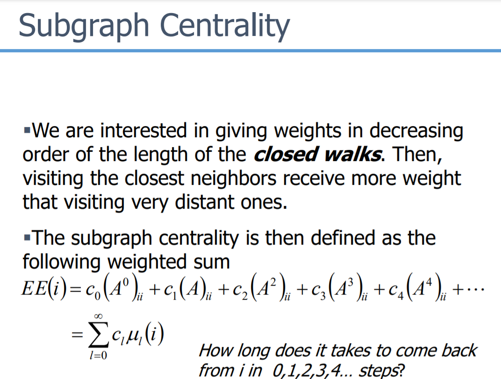<br>
<br>
La centralità del sottografo misura la centralità di un nodo tenendo conto del numero di sottografi a cui il nodo "partecipa".<br>
Questo viene fatto contando, per ogni k = 1, 2, . . . il numero di cammini chiusi in G che iniziano e terminano nel nodo i, penalizzando i cammini più lunghi (dato un peso inferiore).
A volte è utile introdurre un parametro di regolazione β > 0 ("temperatura inversa") per simulare influenze esterne sulla rete, ad esempio, aumento della tensione in un social network, difficoltà finanziarie nel sistema bancario, ecc.<br>
La centralità del sottografo è stata utilizzata con successo in vari contesti, tra cui la proteomica e le neuroscienze.<br>
**Nota**: i pesi servono per “penalizzare” le camminate più lunghe, e per far convergere le serie di potenze.

<hr>

## **Cohesion**
- **Reciprocity**: il rapporto tra il numero di connessioni reciproche e il numero di connessioni totali (il grafo deve essere orientato). Utile per individuare la mutualità nello scambio di informazioni. <br>
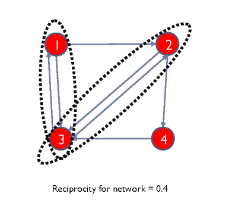

- **Density**: il rapporto tra il numero di connessioni del grafo e il numero totale di connessioni possibili. È una misura utile per stabilire quanto la rete sia ben connessa e per mettere a confronto reti. Una rete perfettamente connessa è chiamata Clique ed ha una densità di 1. <br>
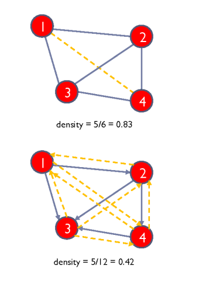

- **Clustering**: si calcola con algoritmi di clustering che identificano delle "comunità" all'interno della rete. Il coefficiente di clustering di un nodo è dato dal numero di triplette chiuse nel suo vicinato fratto il numero di triplette del vicinato. <br>
 <br>
Un coefficiente di clustering misura il grado in cui i nodi di una rete tendono a raggrupparsi insieme. Per un nodo vi con grado di, è definito come <br>
 <br>
Dove delta i è il numero di triangoli in G avente il nodo vi come uno dei suoi vertici. Il coefficiente di clustering in un grafo G è definito come la media dei coefficienti di cluster di tutti i nodi con grado > = 2. 

- **Diametro**: il diametro è dato dal più lungo shortest path. Indica la distanza massima percorribile tra 2 nodi nel grafo. <br>
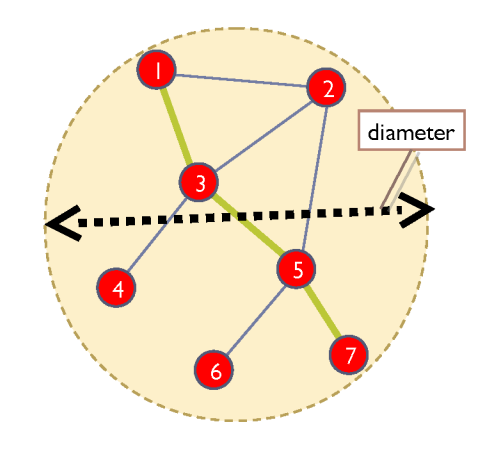.

- **Small Worlds**: è un network che sembra quasi random ma dimostra un coefficiente di clustering significativamente alto e una corta short average path lenght. Questi network avranno molti cluster e molti nodi ponte. <br>
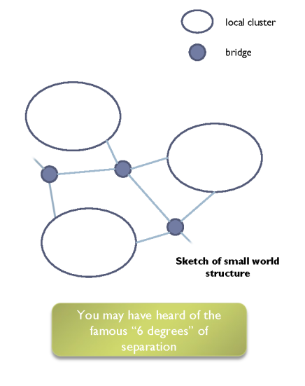

- **Preferential Attachment**: è la proprietà di qualche network dove nella loro evoluzione e crescita nel tempo, la maggior parte delle nuove connessioni vanno ad essere con il nodo più connesso andandolo a preferire a discapito di altri cluster/nodi. Questo può essere dato dalla qualità o popolarità del nodo (o entrambe le cose). <br>
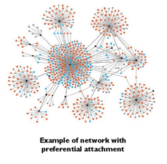 <br>
Ragioni per il preferential attachment:
    - **Popolarità**: vogliamo essere connessi a persone, idee, oggetti popolari. Il ricco diventa più ricco.
    - **Qualità**: valutiamo le persone e qualsiasi altra cosa sul criterio della qualità. Nodi con maggior qualità attraggono in modo naturale più attenzione. Il buono migliora.
    - **Modello misto**: tra nodi con caratteristiche simili, attraggono massa critica e diventano star con molti amici e seguaci. Effetto halo. Può risultare impossibile prevedere chi diventa una star, anche se la qualità conta.


- **Core periphery Structures (strutture di centro-periferia)**: Una metrica utile e relativamente semplice del grado in cui è centralizzato o decentralizzato un social network è la misura di accentramento (Centralization). <br>
    - Si basa sul calcolo delle differenze in gradi tra i nodi, una rete che dipende da 1-2 nodi fortemente connessi (come risultato, ad esempio, di attaccamento preferenziale) mostrerà maggiori differenze in centralità di grado tra i nodi.
    - Le strutture centralizzate possono svolgere meglio alcune attività (come la risoluzione di problemi in team che richiede coordinamento) ma sono più inclini al fallimento se i giocatori chiave si disconnettono.<br>

    Oltre alla centralizzazione, molti gruppi e comunità online hanno un nucleo densamente connesso di utenti che sono fondamentali per la connessione ad una periferia molto più ampia.
    - I nuclei possono essere identificati visivamente o esaminando la posizione dei nodi di alto grado e il loro grado di congiunzioni di distribuzione (i nodi di alto grado tendono a connettersi ad altri nodi di alto grado).
    - Analisi del papillon: notoriamente utilizzato per analizzare la struttura del web, può essere utilizzato anche per distinguere tra il core e altri elementi più periferici in una rete. <br>
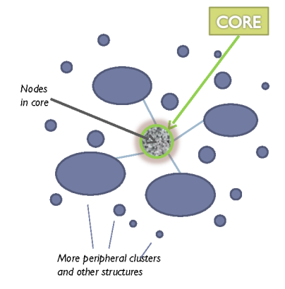

### **Piccola parentesi sulle matrici di adiacenza**
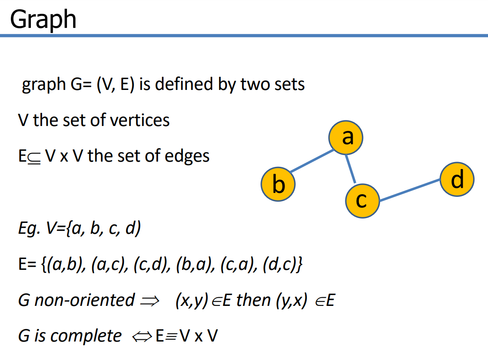 <br>


***NOTA IMPORTANTANTE***: la matrice di adiacenza elevata alla n-esima potenza con elemento `a^n i,j` indica quanti cammini di lunghezza n passano tra i e j.

<hr>

## **Communicability**
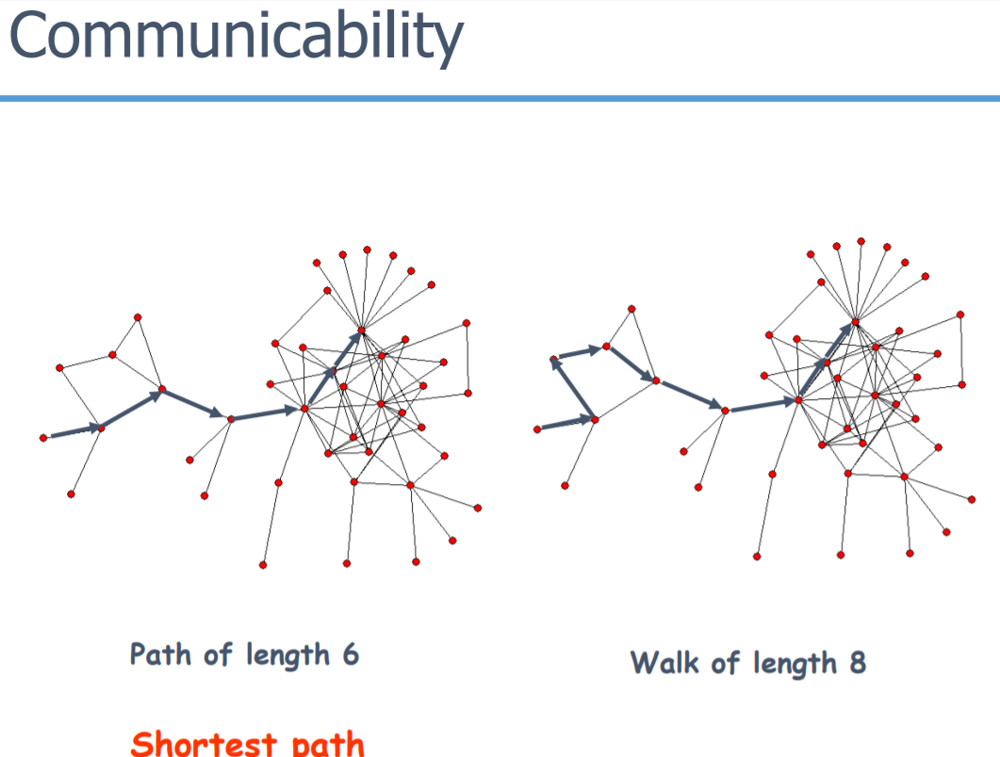<br>
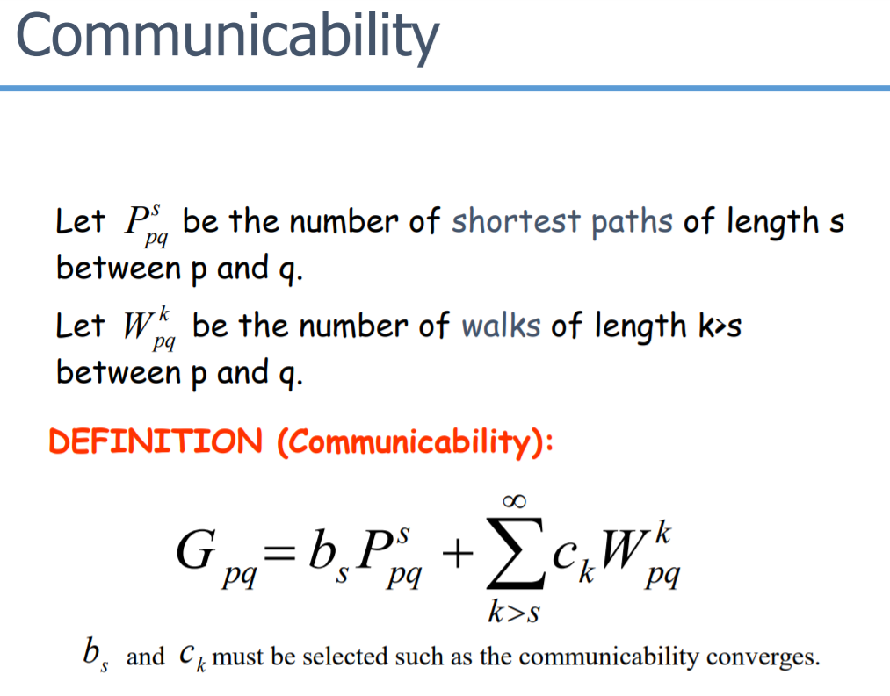<br>
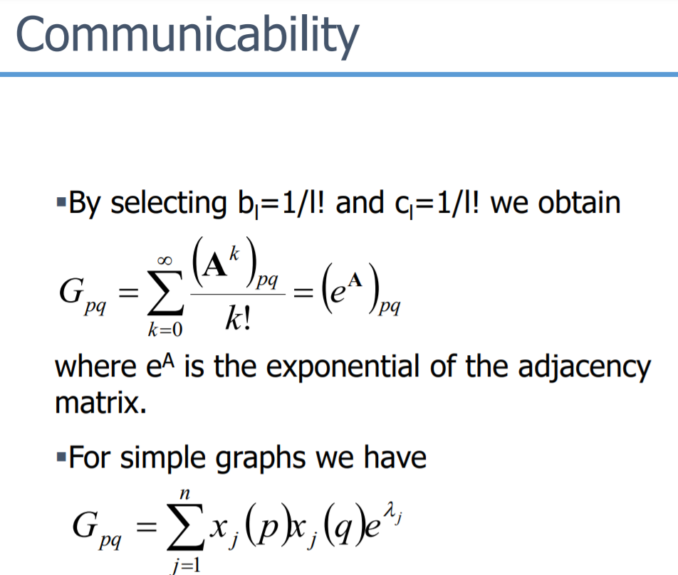<br>
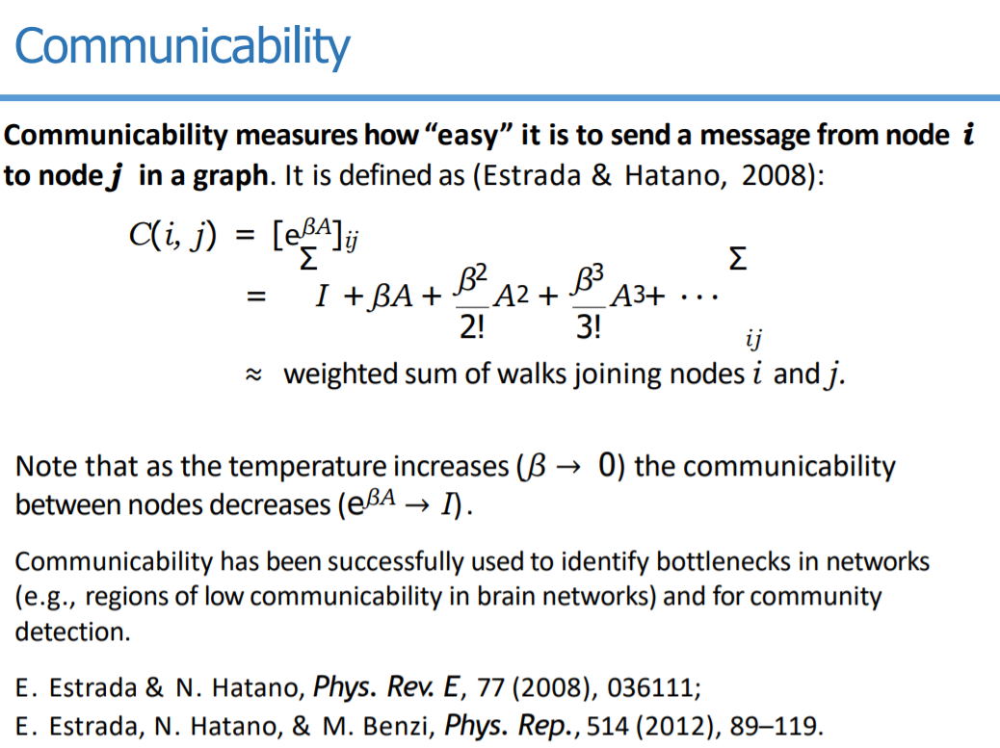<br>
<br>
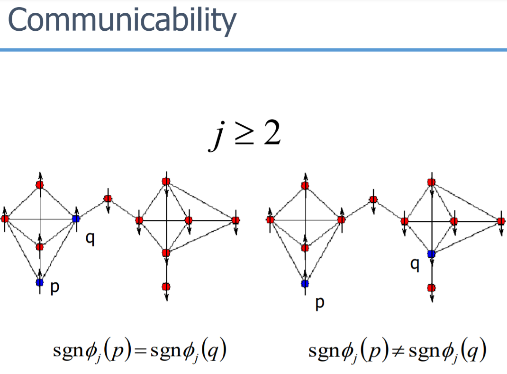<br>
<br>
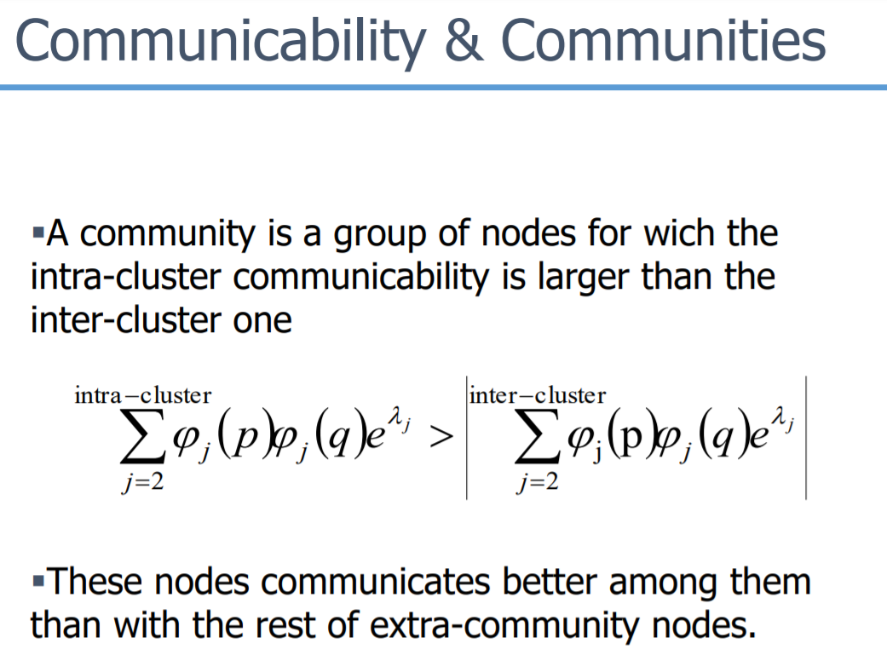<br>
<br>
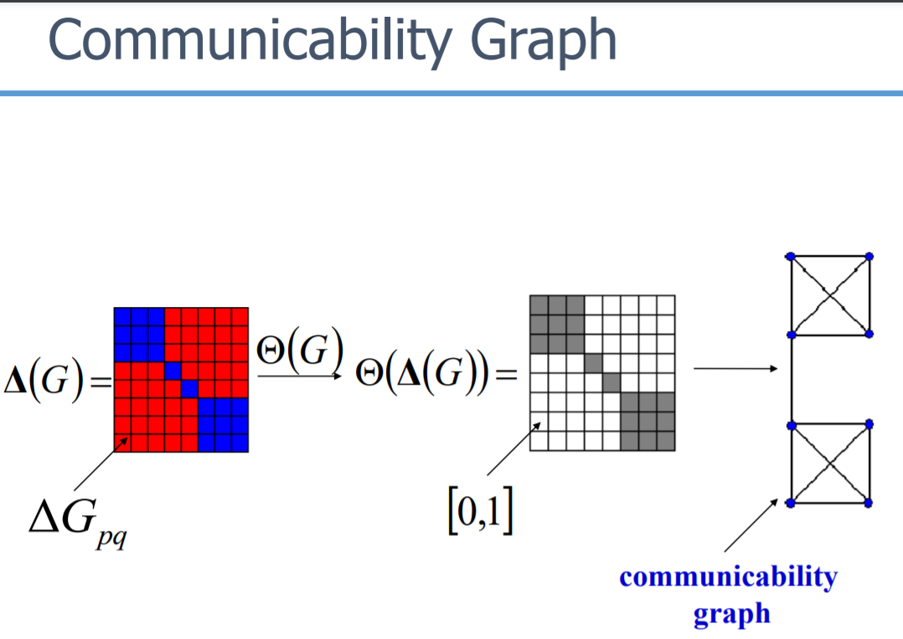<br>

#### **Grafico di comunicabilità** 
Una comunità è definita come una cricca nel grafico della comunicabilità. <br>
L'identificazione delle comunità si riduce al “problema di tutte le cricche” nel grafico della comunicabilità. <br>
Una comunità è definita come un insieme di nodi con un alto coefficiente di clusterizzazione. <br>
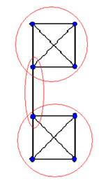<br>
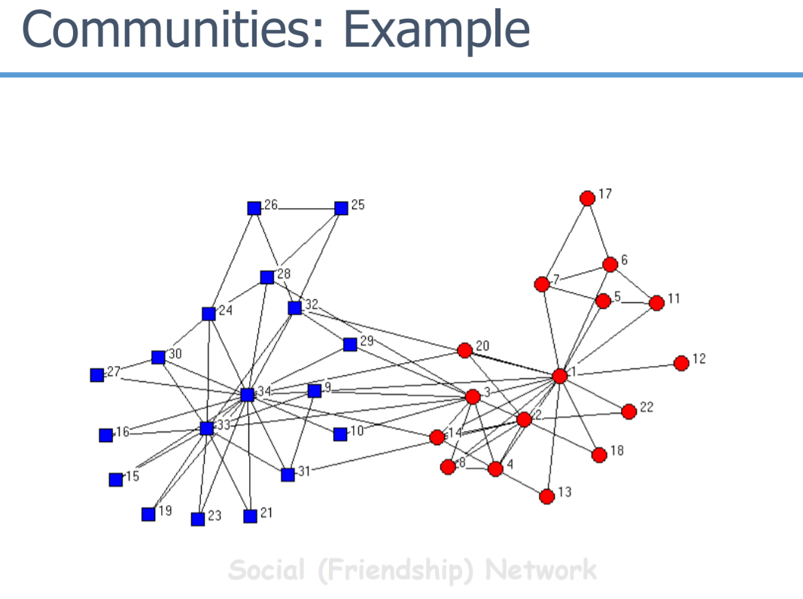<br>

<hr>

# **Reti e grafi**

## **Formazione dei grafi**
**Modelli di network**:
- Proprietà dei grafi del mondo reale
    - Formazione di componenti giganti
- Grafi casuali
    - Grafi casuali di Erdos–Renyi
- Proprietà del piccolo mondo
    - Watt e Strogatz
- Reti senza scalabilità
    - Attaccamento Preferenziale, Modello Barabasi-Albert
- Altri modelli
    - Modello gerarchico
    - Grafi casuali geometrici 

#### **Esempi di reti complesse**
Ma cos'è esattamente una rete complessa? Sfortunatamente, non esiste una definizione precisa, sebbene sia in corso un lavoro sulla caratterizzazione (e quantificazione) del grado di complessità in una rete. È facile dire quali grafi non sono reti complesse. I reticoli regolari non sono considerati reti complesse e nemmeno i grafi completamente casuali come il modello di Erdös-Rényi. <br>
I grafi casuali, tuttavia, sono utili come modelli nulli rispetto ai quali confrontare (possibili esempi di) reti complesse. 

 <br>
 <br>
 <br>
 <br>

<hr>

## **Networks Properties**
La maggior parte delle reti reali ha:
- Componente connesso gigante
    - “siamo tutti collegati”
- Alta connettività
    - “tutti i miei amici sono amici”
- Piccolo diametro
    - “notizia diffusa in un lampo”
- Distribuzione del grado in Power Law
    - “poche persone hanno un numero enorme di follower”
- Scala libera
    - “una piccola parte delle reti è simile al quadro generale”

***Come crescono i grafi per mostrare quelle proprietà?***

#### **Problema di analisi di rete** <br>
Le domande di base sulla struttura della rete includono centralità, robustezza, comunicabilità e problemi di rilevamento della comunità:
- Quali sono i nodi più “importanti”?
- Connettività di rete e robustezza/vulnerabilità
- Identificazione di individui influenti nei social network
- Proteine essenziali nelle reti PPI (letalità)
- Identificazione delle specie chiave negli ecosistemi
- Centralità dell'autore nelle reti di collaborazione
- Classifica di documenti/pagine web su un determinato argomento 

Come si diffondono i “disturbi” in una rete?
- Diffusione di epidemie, credenze, voci, mode,...
- Instradamento di messaggi; colli di bottiglia, possibilità di restituzione 

Come identificare le “strutture comunitarie” in una rete?
- Clustering, chiusura triadica (transitività)
- Partizionamento 

<hr>

## **Erdos-Renyi Random Graphs**
È un grafo G con n nodi e m archi e quest ultimi hanno la stessa probabilità ***p*** di essere generati.

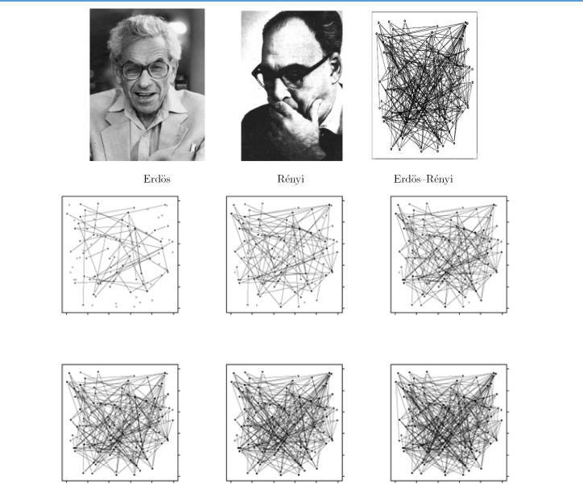

Modella una rete dati G(V,E) con |V|=n e |E|=m <br>
Un grafo di Erdos-Renyi (ER) che modella G è costruito come segue:
- Ha n nodi
- Gli archi vengono aggiunti tra coppie di nodi in modo uniforme a caso con la stessa probabilità p
- Gn,p: scegli p in modo che la rete del modello risultante abbia m archi 

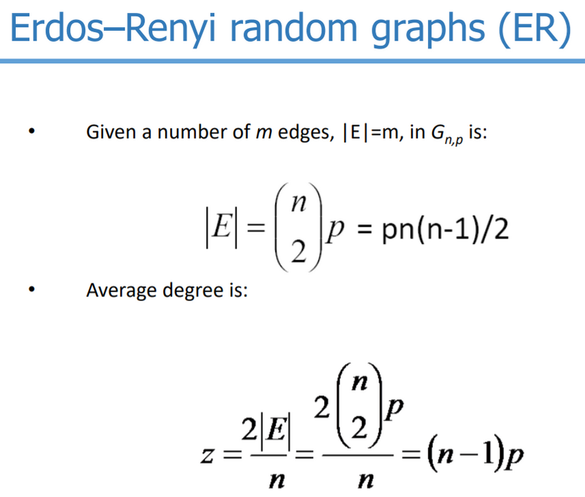

#### **Importante proprietà di ER**
- quando m=n/2, emerge **la componente gigante**
    - Un componente connesso della rete ha O(n) nodi (quasi tutti i nodi)
    - Il successivo componente connesso più grande ha O(log(n)) nodi (pochi nodi) <br>
(vedi Netlogo GiantComponent per la demo) 

<br>
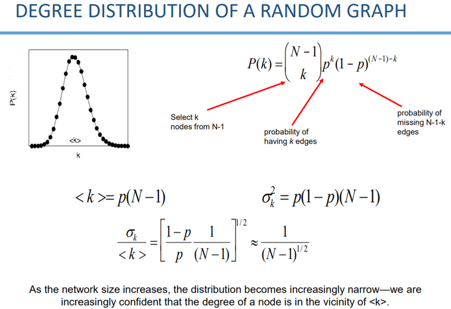<br>
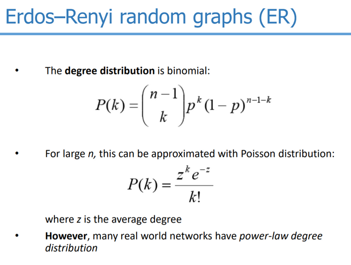<br>

Il coefficiente di clustering, C, di ER è basso (per p basso)
- C=p, poiché la probabilità p di connettere due nodi qualsiasi in un grafo ER è la stessa, indipendentemente dal fatto che i nodi siano vicini
- Tuttavia, molte reti del mondo reale hanno coefficienti di clustering elevati

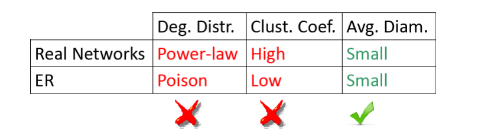

#### **Grafici casuali: percolazione**
Il primo modello è stato reso formale da Erdos e Rényi (sebbene scoperto indipendentemente da Rapoport 10 anni prima). <br>
L'obiettivo non era quello di studiare proprietà come small-world o scale-free (non era nemmeno noto). Questa teoria è interessata alle proprietà che si verificano per grafi di grandi dimensioni, cioè per n → ∞. <br> 
Per illustrare la proprietà principale di quei grafici, facciamo un esempio... <br>
Modelliamolo! <br>
Supponiamo che una pietra porosa sia immersa in un secchio di acqua. Qual è la probabilità che il centro della pietra sia inumidito? <br>
Un fluido può fluire attraverso i canali se sono sufficientemente ampi. 
Un canale ha una probabilità p di essere sufficientemente largo e 1 – p troppo piccolo. Se modelliamo questo in due dimensioni, abbiamo delle griglie (reticolo quadrato). 


Il sistema si comporta in modo molto diverso per p < pc e p > pc : è nitido! <br> 
Per una transizione netta, pensa all'acqua in un bicchiere e al pc = 0 gradi. 

<hr>

## **Small World Network**
Un network si dice Small World Network se la lunghezza media L dello shortest path tra due nodi è in scala logaritmica rispetto al numero totale dei nodi n. Tipo 225226 nodi -> L = 3.65 (la L deve essere mooolto piccola rispetto a n). Alcuni autori hanno definito lo small world network aggiungendogli un'altra proprietà, ovvero avere un alto coefficiente di clustering. Trasmettere informazioni in una small world network risulta molto veloce, ma lo è anche la trasmissione di minacce e virus.

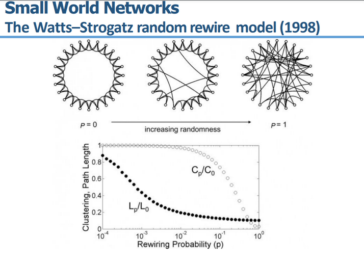

### **The Watts–Strogatz random rewire model - Generazione di reti Small World (altamente connesse)**
Per generare degli small world Wats-Stragat si parte da una griglia circolare (network regolare) (1-dimensionale con k = 4) la quale ha un alto coefficiente di clustering e randomicamente si rimuovono e aggiungono degli archi andando cosi a generare un fenomeno di small world. Questo metodo va a migliorare il precedente metodo di Erdos-Renyi perchè generando un grafo random non è detto che si ottiene un alto tasso di clustering.

- **Rewire**: C’è un componente gigante ma poco connesso. Ogni nodo è connesso con un nodo ma i vicini non è detto che lo siano tra loro. stacco e riattacco un arco con un altro nodo con una certa probabilità. Quando questa probabilità supera una certa soglia quello che succede è che emerge un alto grado di connettività locale. 

#### **Modello di Watts-Strogatz:**
- Iniziare con un reticolo regolare di piccole dimensioni. 
- Per ogni arco, sposta casualmente una delle sue estremità su un altro arco con probabilità p. 

Il grado originale è molto clusterizzato, nel processo teniamo comunque questo valore alto (Coefficiente di clusterizzazione). Creando scorciatoie si diminuisce la distanza media, cioè si crea un effetto di piccolo mondo. 

Le reti Small World hanno:
- Piccoli diametri 

Nel modello Watts-Strogatz
- Alti coefficienti di clustering – introdotti dalla “regolarità ad anello” iniziale 

La conseguenza:
- Grandi diametri medi di reticoli regolari, possono essere ridotti ricablando casualmente una piccola percentuale di bordi 

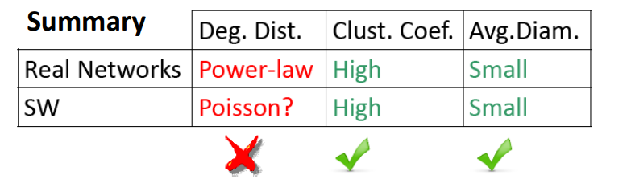


Hanno dei pattern di collegamento che si ripetono spesso (tipo i 5 nodi connessi ad un nodo centrale rosso)(SELF SIMILAR). <br>
Presentano anche una topologia non basilare (non-trivial topology).

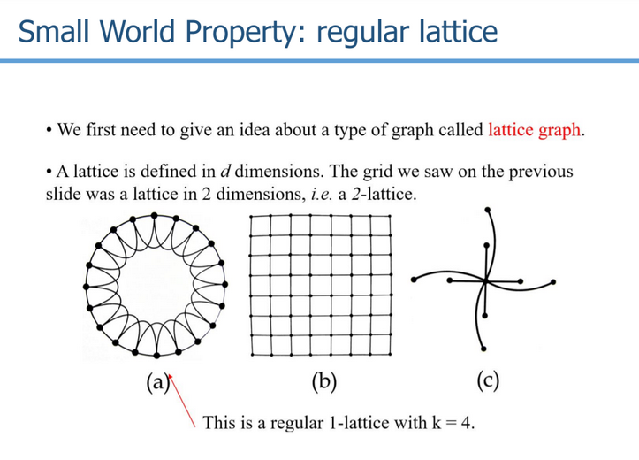

<hr>

## **Scale-Free Network**
Sono network dove la distribuzione del grado segue una legge di potenza (nodi di grado k). Pochi nodi con grado alto, tanti con grado piccolo. <br>
In quelli random c’è una distribuzione normale (tanti nel mezzo pochi agli estremi). <br>
Le due cose sopra sono diverse!! 

La distribuzione power-law è l'unica distribuzione che rimane identica per qualsiasi scala di misura si utilizza. Viene quindi chiamata Scale-Free.
Una rete con questa distribuzione si chiama Sclae-Free Network. Queste reti presentano un alto numero di hub centrali con enormi connessioni. Questi hub rappresentano solitamente un tallone di achille: rimuovendoli la rete si spezza in varie parti, ma da studi recenti, reti Scale-Free complesse hanno una distrubuzione power-law e non hanno questo tallone d'achille.


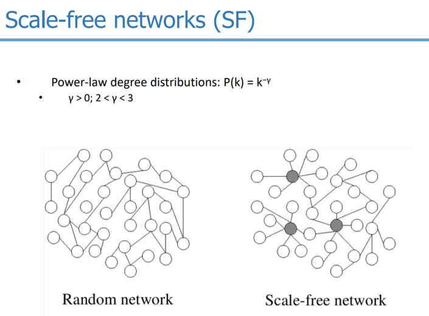


Quando la rete cresce viene utilizzata la politica prefential attachment.

Il modello di Barabasi-Albert utilizza la distribuzione power-low e quando a queste network viene aggiunto un nuovo nodo, questo tende a connettersi ai nodi "più grandi" (quelli con più connessioni e più importanti, "the rich get richer").
Questo produce "small world" network dove il diametro della rete cresce molto lentamente: logaritmico o loglogaritmico.

A differenza del Modello BA, Erdos-Reyni e Watts-Sgorgtaaf generano reti che non sono scale free, questo è brutto perchè si è visto che generalmente le reti reali hanno una distribuzione power-law o comunque molto simile.

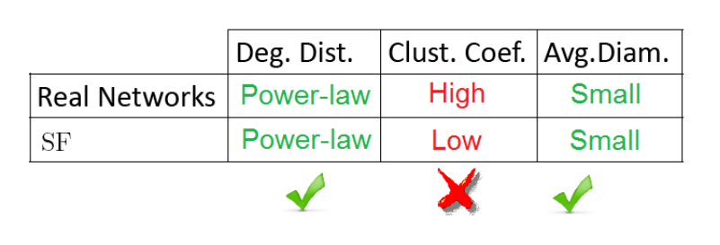

#### **The Scale-Free property**
La distribuzione della popolazione delle città ha la proprietà scale-free! 

Nel 1955, Herbert Simon ha già dimostrato che molti sistemi seguono una distribuzione della legge di potenza, quindi non è né nuovo né unico. <br>
È stato scoperto che la distribuzione del grado dei nodi segue una legge di potenza in molte reti, cioè molte reti sono scale-free... 
- Dimensioni dei terremoti
- Crateri lunari
- Eruzioni solari
- File del computer
- Guerre
- Numero di citazioni ricevute / paper
- Numero di visite alle pagine web
- Redditi annuali delle persone 

Ciò che è importante non è tanto trovare una legge di potenza come è comune, ma capire perché e quali altri parametri strutturali ci sono.

#### **Mito e realtà**
- Le distribuzioni in scala sono un sottoinsieme di una famiglia più ampia di distribuzioni a coda pesante che mostrano un'elevata variabilità. 
- Un'importante affermazione della letteratura per le reti scale-free è stata la presenza di hub centrali altamente connessi.
- Tuttavia, richiede solo un'elevata variabilità e non un ridimensionamento rigoroso... 

Si diceva che «i nodi più strettamente connessi rappresentano un tallone d'Achille»: cancellali e il grafo si rompe in pezzi.
- Ricerche recenti hanno dimostrato che le reti complesse che affermavano di essere prive di scala hanno una legge di potenza, ma non questo tallone d'Achille. 
- Un meccanismo è stato utilizzato per costruire reti senza scala, chiamato attaccamento preferenziale, o "i ricchi diventano più ricchi". 
- È solo uno dei tanti, e non meno di 7 altri meccanismi danno lo stesso risultato, quindi l'attaccamento preferenziale dà poca o nessuna comprensione del processo. 

#### **Preferences Attachment of newcomers**
Un altro modo molto diffuso per modellare le reti è riprodurre il processo di crescita in atto nel mondo reale: entrano nuovi nodi. <br>
Heber Simon mostrò nel 1955 che le leggi di potere si incontrano quando i ricchi si arricchiscono: più abbiamo già, più avremo. 

Quando arriva un nuovo nodo si connette ai nodi più popolari (con più connessioni), non in maniera deterministica, ma è una preferenza proporzionale (probabilità proporzionale la numero di connessioni).

Quindi il modo più comune per generare una rete senza scala è usare attaccamento preferenziale.
- Quando arriva un nuovo nodo, preferisce collegarsi ai nodi più popolari 

Nel 19665 Derek de Solla Price stabilì un modello in cui la probabilità che un nuovo nodo si colleghi ad un altro è proporzionale a Kin+1, dove Kin p il grado di ingresso del nodo. 

<hr>

### **Il modello Barabasi-Albert**
Il modello Barabási–Albert si basa sulla nozione di attaccamento preferenziale: partendo da un dato grafo sparso, vengono aggiunti (uno alla volta) nuovi nodi alla rete, unendoli ai nodi esistenti con una probabilità proporzionale al grado (il numero di nodi adiacenti) di tali nodi. Quindi nodi ricchi di connessioni con altri nodi hanno un'alta probabilità di attrarre nuovi “vicini”, mentre i nodi “poveri” tendono a rimanere tali. Si può dimostrare che il modello Barabási-Albert porta a una distribuzione dei gradi molto asimmetrica data da una legge di potenza della forma <br>
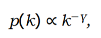 <br>
dove p(k) denota la frazione di nodi di grado k e γ è una costante, tipicamente con 2 ≤ γ ≤ 3.

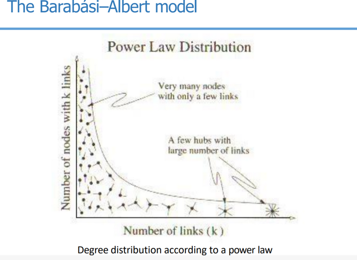 

Il modello Barabási-Albert produce reti "piccolo mondo", in cui il diametro cresce lentamente con il numero di nodi; la crescita è generalmente logaritmica o addirittura log-logaritmica (in pratica, il diametro rimane pressoché costante). <br>
Esempi: Facebook; Grafico di collaborazione MathSciNet. <br>
A differenza del modello Barabási-Albert, i modelli Erdös-Rényi e Watts-Strogatz mostrano distribuzioni dei gradi che decadono esponenzialmente dalla media (k): quindi, tali reti non sono "scale-free". <br>
Un numero schiacciante di reti complesse del mondo reale sembra seguire una distribuzione del grado di legge del potere, almeno approssimativamente.

 

#### **The Barabasi-Albert (BA) comparison**
Il modello di Price ha creato un grafo diretto con il numero di variabili di bordi aggiunti a ciascun nodo per modellare la crescita delle reti di citazioni bibliografiche. Fornisce la distribuzione dei gradi pk ~ legge di potenza
 
Trent'anni dopo, nel 1999, Barabasi e Albert arrivarono con il loro modello: non orientato, numero costante di spigoli, dà sempre pk ~ k ^(-alpha) .
Il modello BA è il più famoso e "iniziato" nel campo. Come mai?
Hanno dato una situazione importante in cui questo modello ha un forte potenziale: il Web.
 
Hai deciso di avviare il tuo sito Web ed è ora di creare una sezione "link".
Molto probabilmente, ti collegherai a siti Web popolari, rendendoli ancora più popolari (cioè crea un sistema di feedback loop → le ricchezze diventano più ricche).

#### **The Barabasi-Albert (BA) features summary**

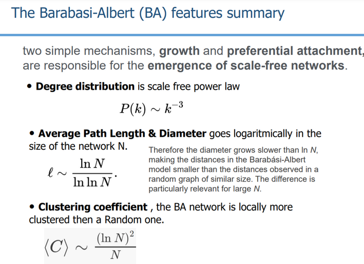 

Il modello Barabási-Albert non è in grado di descrivere molte caratteristiche dei sistemi reali: 

Il modello prevede γ=3 mentre il grado esponente delle reti reali varia tra 2 e 5. Molte reti, come il WWW o le reti di citazione, sono dirette, mentre il modello genera reti non orientate. 

Molti processi osservati nelle reti, dal collegamento a nodi già esistenti alla scomparsa di collegamenti e nodi, sono assenti dal modello. <br>
Il modello non permette di distinguere tra nodi in base ad alcune caratteristiche intrinseche, come la novità di un documento di ricerca o l'utilità di una pagina web. <br>
Sebbene il modello Barabási-Albert sia usato occasionalmente come modello di Internet o della cellula, in realtà non è progettato per catturare i dettagli di una particolare rete reale. Si tratta di un modello minimale di prova di principio il cui scopo principale è catturare i meccanismi di base responsabili dell'emergere della proprietà scale-free. <br>
Pertanto, se vogliamo comprendere l'evoluzione di sistemi come Internet, il cellulare o il WWW, dobbiamo incorporare i dettagli importanti che contribuiscono all'evoluzione temporale di questi sistemi, come la natura diretta del WWW, la possibilità di collegamenti e rimozione di nodi e collegamenti. 

#### **Some features of complex networks**
Alcuni degli attributi tipici di molte reti complesse del mondo reale sono: 
- “Scale-free”: la distribuzione dei gradi segue una legge di potenza (curva di Pareto) 

"Mondo piccolo":
- Piccolo diametro del grafo, breve distanza media tra i nodi
- Alto coefficiente di clustering: molti triangoli, hub, ...
- Struttura gerarchica Ricca di “motivi”
- Autosimile (come nei frattali) 

In breve: le reti complesse mostrano una topologia non banale. <br>
Avvertenza: esistono importanti esempi di reti complesse del mondo reale prive di uno o più di questi attributi. 

<hr>

## Generazione di una rete gerarchica scale-free
Si inizia con un grafo completo di n vertici, si effettuano n-1 copie di questo grafo e si collegano tutti i vertici (tranne le radici dei nuovi grafi) dei nuovi grafi alla radice del grafo di partenza. 
Questo processo piò essere ripetutto più volte.

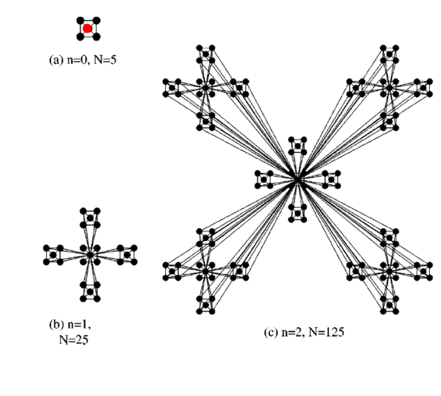

Il diametro di questa rete risulta essere 2k - 1 (k = numero di terazioni utilizzate per creare la rte)

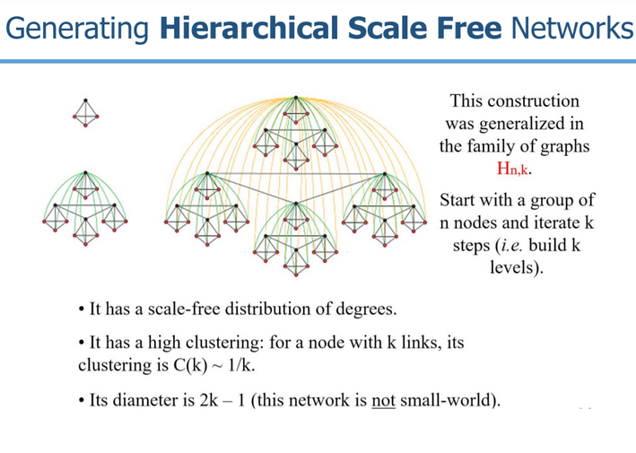<br>
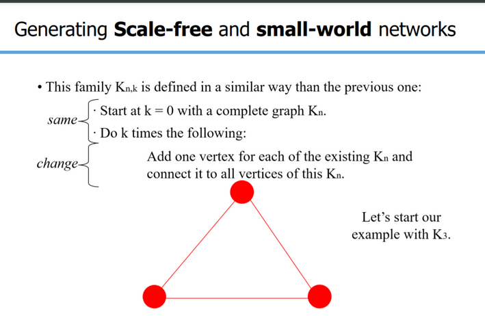<br>
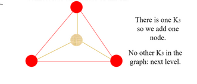
<br>
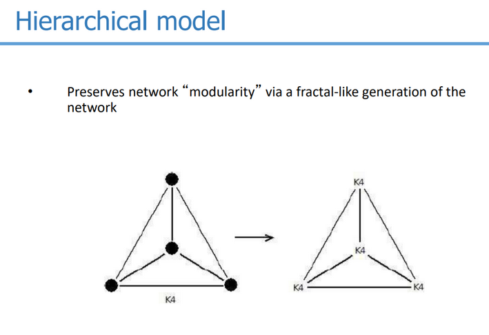<br>
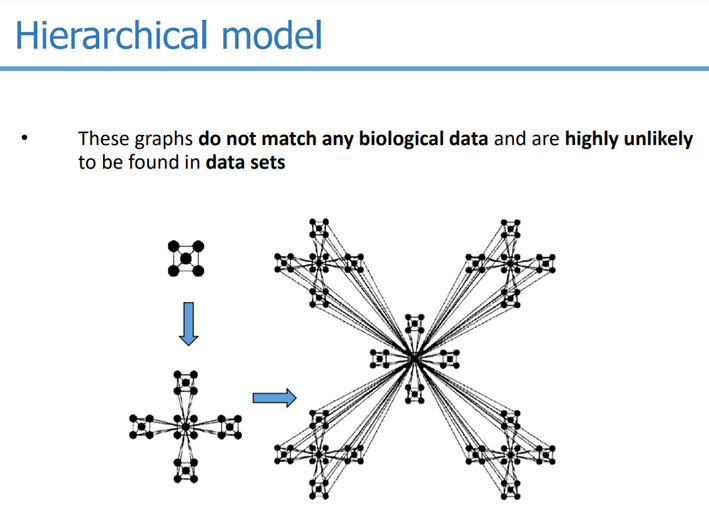

#### **Geometric random graphs**
Grafi casuali geometrici “uniformi” (GEO)
- Prendi qualsiasi spazio metrico e, utilizzando una distribuzione casuale uniforme, posiziona i nodi all'interno dello spazio
- Se dei nodi sono all'interno del raggio r (calcolato tramite qualsiasi norma di distanza scelta per lo spazio), saranno connessi
- Scegliere r in modo che la dimensione della rete GEO corrisponda a quella dei dati
- Ci sono molti possibili spazi metrici (es. spazio euclideo)
- Ci sono molte possibili norme sulla distanza (ad es. la distanza euclidea, la distanza a scacchiera e la distanza Manhattan/tassista)

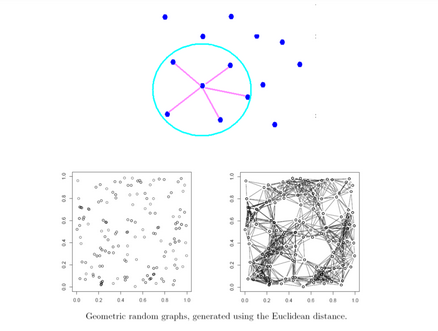

<hr>

# **Link Prediction**
***Definizione del problema***: data una rete al tempo t, è possibile predire quali saranno le nuove connessioni che si creeranno all'istante t+1 ??

Molto utilizzata anche in ambito commerciale, dove aziende come facebook, tinder, amazon e linkedin ne fanno molto utilizzo. Molto utilizzata in biologia, per anti terrorismo e molto altro. <br>
Es prevedere:
- futuri possibili collegamenti in una rete (es. Facebook)
- collegamenti esistenti mancanti/nascosti a causa di dati incompleti 

### **Metodi di prossimità locali e globali**
Dividi i dati di rete in modo appropriato nel training set (tempo t) e nel test set (tempo t+1) e applica la strategia di previsione classificando i potenziali bordi (x,y) assegnando a un indice di punteggio una valutazione della vicinanza di (x,y) 

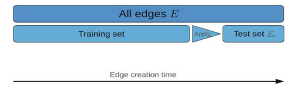

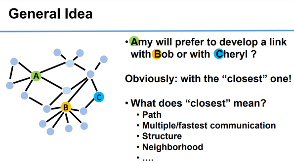

Ci sono 3 approcci per provare a risolvere il problema:
1. **Globabl Methods**
2. **Algebraic Methods**
3. **Machine Learning**

<hr>

### **Global Methods**
Prendono in considerazione l'intera rete.
Esistono vari coefficienti che permettono di individuare potenziali nuovi collegamenti:

- **Katz coefficient**: un metodo di predizione basato sulla topologia della rete e si basa sul numero di cammini tra il nodo x e il nodo y (considera tutti i cammini tra x e y), di lunghezza l moltiplicati per un coefficiente B^l con `0 < B < 1`. B serve per aggiustare il peso di cammini di lungezza differente (e.g. per B piccolo, cammini lunghi contribuiscono poco al punteggio finale). È un calcolo computazionalmente costoso ma da ottimi risultati. <br> 
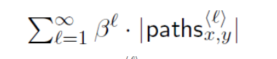 <br>
**Intuizione**: più cammini -> più modi per arrivare al nodo -> più vicino

- **Hitting Time**: lunghezza di un potenziale cammino tra due nodi. <br>
***HT(x, y)***: numero atteso di passi per una **random walk** partendo da x per arrivare a y.

- **Commute time**: x e y sono vicini se il commute time tra essi è basso. <br>


<hr>

### **Algebraic Methods**
Questi metodi utilizzano la matrice di adiacenza della rete per calcolare varie proprietà e predizioni. Il problema è che le matrici sono difficili da trattare per i problemi reali (dimensione troppo grande).

<hr>

### **Machine Learning Methods**
Si dividono gli archi in un set di training ed uno di testing, si genera un modello che viene allenato con il set di training e si applica al set di testing.
Il problema è che questi metodi non sono applicabili a reti reali per via della loro grandezza e del tempo di calcolo ed è dunque necessario analizzare localmente le informazioni e non globlamente.

<hr>

#### **Principali svantaggi dei metodi globali, algebrici e dell'apprendimento automatico**
- I metodi globali sono computazionalmente costosi
- L'apprendimento automatico non è sempre praticabile nelle grandi reti dinamiche
- Problemi di aggiornamento del modello con reti dinamiche
- Grandi reti, ad es. il WWW, non analizzabile nel suo insieme
- Metodi algebrici matrice troppo sparsa e grande
- Le informazioni locali sono facilmente accessibili, facili da aggiornare 

<hr>

### **Local Methods**
Vengono utilizzate informazioni vicine ai nodi in questione. <br>
Non necessitano dell'intera rete per predirre un collegamento e quindi richiede un costo computazionale ragionevole. <br>
- facile da calcolare
- facile da aggiornare 

La maggior parte dei local methods, utilizzano come metrica **T(x)** che indicano il **numero dei vicini del nodo x**.

Di seguito alcuni di questi metodi:
- **Grah Distance**: il cammino minimo tra x e y negato. Poco efficace.
- **Common Neighbours**: due nodi che hanno molti vicini in comune hanno un'alta probabilità di essere collegati in futuro. Cosa succede quando più nodi hanno lo stesso numero di Common Neighbours ?? Per risolverlo basta normalizzare il numero di Common Neibhours come suggerisce Jaccard. <br>
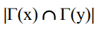
- **Jaccard Coefficient**: calcola il numero di common neighorus dividendolo per il numero di vicini totali dei due nodi. <br>
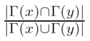
- **Preferential Attachment**: su basa sul concetto che un nodo con un alto numero di connessioni sarà preferibile ad uno che ne ha poche (rich get richer). <br>
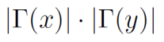
- **Adamic Adar Index**: è l'opposto di Prefenteial Attachment, un alto numero di vicini va ad influire negativamente sul puteggio. Risulta molto efficacie in vari casi. <br>
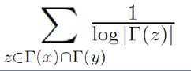 <br>
Adamic Adar Index è in relazione con la nozione di entropia dell'informazione. <br>
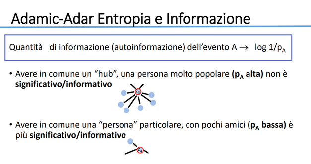

<hr>

#### **Previsione dei collegamenti: sfide e problemi aperti**
- Problema di avviamento a freddo
- Reti dinamiche
- i collegamenti possono essere creati e distrutti nel tempo
- nuovi nodi entrano ed escono dal sistema
- Link Prediction eterogenei, link/nodi di diverso tipo e natura, es.: link “negativi”
- Somiglianza strutturale vs somiglianza semantica
- Come predirre le rimozioni di link
- Usata anche per indagini su attacchi terroristici 

Predirre i link quando ce ne sono pochi nella rete è molto diverso da predirre i link quando si inizia a formare, o è presente, una componente gigante. 

#### **Applicazioni di frontiera**
Applicazioni della “previsione dei collegamenti” al “ragionamento naturale”, senza logiche o sistemi di inferenza, attivazione/disattivazione dei collegamenti per la comprensione dei meccanismi di:
- associazione mentale, attivazione semantica,
- meccanismi creativi,
- attivazione di emozioni, esperienza dell'utente
