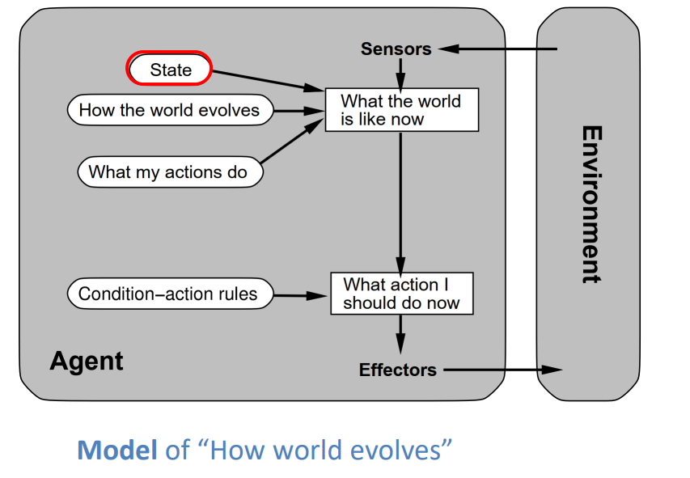
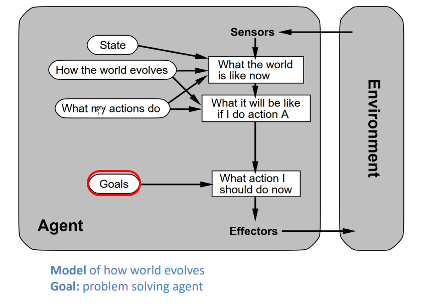
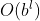
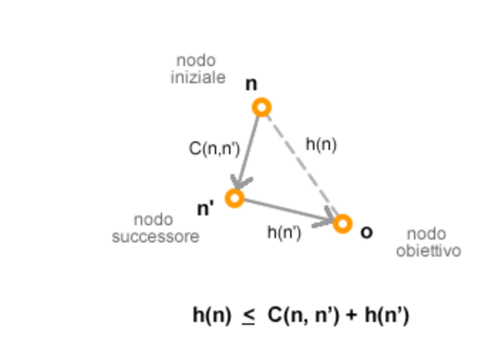
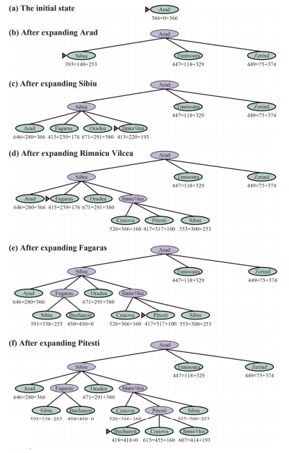
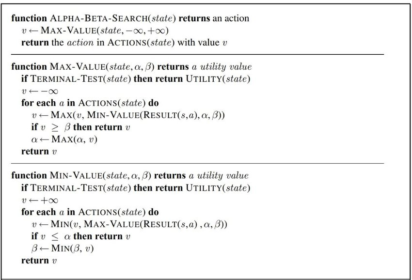

# La vendetta di Milani

## Indice

Scrivimi

## Agenti Intelligenti

> L'intelligente lo è chi l'intelligente lo fa

**Definizione:** <br>
Un agente è qualsiasi cosa che può percepire l'ambiente circostante tramite sensori e agire su di esso tramite attuatori.


Le azioni dell'agente sono influenzate dal tipo di ambiente in cui si trova.
Un agente razionale non è omniscente e può effettuare azioni per modificare l'input percepito ed ottenere così informazioni più utili. Si dice anche **autonomo** se il suo comportamento è determinato dalla sua esperienza e non dipende esclusivamente dalla sua conoscenza di base (built-in knowledge).


Gli ambienti vengono classificati in base ai seguenti criteri:

* **Osservabilità**:
    
    * **Fully Observable**: i sensori dell'agente gli danno accesso allo stato completo dell'ambiente in qualisasi momento.

    * **Partially Observable**: l'agente ha una conoscenza parziale dell'ambiente che lo circonda (può essere causato dalla limitatezza dei sensori o dalla natura stessa dell'ambiente)

* **Single Anget Vs Multi Agent**: possibilità di avere un singolo agente o molteplici che possono essere **Competitivi** o **Cooperativi**

* **Determinabilità**:

    * **Deterministico**: lo stato successivo dell'ambiente è determinato completamente dallo stato attuale e dalle azioni effettuate dall'agente

    * **NON Deterministico**: tutto ciò che non è deterministo è dunque NON Deterministico (`best effort !`)

* **Episodico Vs Sequenziale**:

    * **Episodico**: gli stati futuri non dipendono dalle azioni svolte in precedenza dall'agente (come il controllore di difetti in una linea di assemblaggio)

    * **Sequenziale**: il contrario di Episodico (`best effort !`)

* **Dinamicità**:

    * **Statico**: l'ambiente cambia solamente quando l'agente effettua delle azioni

    * **Dinamico**: l'ambiente può cambiare mentre l'agente sta pensando

* **Discreto Vs Continuo**: dipende dalla maniera in cui il tempo e lo stato dell'ambiente sono gestiti dall'agente, per esempio: una partita di scacchi è discreta mentre un gioco di strategia no.

* **Conoscibilità**: la conoscenza dell'agente rispetto alle leggi dell'ambiente in cui si trova.<br>
_E.g._: In un ambiente conosciuto data una serie di azioni si conosce il risultato.

Tipi di agente:

* Simple Reflex: if-else in base all'input 

* State Model-based Reflex: if-else basato sullo storico di input e modello. 

* Goal Based: basato sul problem solving (??). 

* Utility-based: può avere più stati goal ed è in grado di distinguerli (ha anche goal impliciti). 

## Algoritmi di Ricerca

Dato un problema sconosciuto l'agente può operare in 2 modi:

* Compiere azioni random sperando di raggiungere la soluzione

* Seguire il seguente processo di problem solving:

    1. Goal Formulation
    2. Problem Formulation
    3. Search
    4. Execution

Durante le fase di Execution gli agenti possono utilizzare 2 modelli di systemi:

* **Open Loop**: gli agenti hanno la certezza che durante un'azione lo stato dell'ambiente non venga alterato

* **Closed Loop**: l'opposto di Open Loop (`best effort !`)

### Definizioni di Algoritmi di Ricerca

* **Problema**: l'insieme degli stati possibili nei quali l'ambiente può esistere, viene anche chiamato **Spazio degli Stati**

* **Stato iniziale**: lo stato in cui l'agente inizia

* **Stato Goal/Finale**: lo stato che l'agente vuole raggiungere

* **Azioni**: dato uno stato `s` la funzione `action(s)` ritorna un insieme finito di azione che possono essere eseguite in s e sono dette **applicabili in s**.<br>
`ACTION(Arad) = {ToSibiu, ToTimisoara, ToZerind}`

* **Modello di Transizione**: ritorna lo stato che risulta dall'applicazione di una determinata azione `a` in uno stato `s`.<br>
`RESULT(Arad, ToZerind) = Zerind`

* **Funzione Costo Azione**: ritorna il costo numerico richiesto per applicare un'azione `a` in uno stato `s` per raggiungere lo stato `s'`.

* **Nodi di Frontiera**: i nodi visti ma non espansi.

* **Cammino**: la conseguenza di insieme di azioni.

* **Cammino Ridondante**: è un cammino che porta allo stesso nodo ma con costo maggiore. Un ciclo è un particolare tipo di cammino ridondante.

* **Soluzione**: il cammino che va dallo stato iniziale ad uno stato goal/finale.<br>Una soluzione si dice **ottima** se corrisponde al percorso di costo minore tra tutte le soluzioni.

### Rappresentazione di un problema di ricerca

Un problema di ricerca può essere rappresentato in 2 modi:

1. Lo State Space Graph (il grafo dello spazio degli stati)
2. L'Albero di Ricerca


Le principali differenze tra i 2 sono che:

|State Space Graph|Albero di Ricerca|
|-----------------|-----------------|
|Ad ogni nodo corrisponde uno stato e ogni arco corrisponde ad un'azione che può esser eseguita in quello stato.|Ci possono essere più nodi uguali, però dato un nodo, il cammino che lo riporta alla radice è unico.|
|_Ti fa vedere tutto il problema_| _Qui vedi più chiaramente il cammino_.|
|||


L'albero di ricerca riportato sopra presenta un ciclo tra `Arad` e `Sibiu`. Poichè i cilci possono essere percorsi infinite volte, l'albero di ricerca **completo** può avere infiniti nodi !
La differenza tra **stato** e **nodo** è la seguente:

* uno **stato** è la rappresentazione grafica di una configurazione del mondo fisico

* un **nodo** è una struttura dati che contiene informazioni come: stato, nodo padre, azioni, costo del cammino, profondità, ecc.

Questa mappa verrà presa in considerazione per i successivi esempi:


### Il Problema dei Cammini Ridondanti

I cammini ridondanti possono andare a complicare di molto alcuni problemi di ricerca e quindi vanno evitati.<br>
Ci sono 3 diversi modi per farlo:

1. **Memorizzare i nodi visitati**. Questo metodo è particolarmente utile se si hanno tanti cammini ridondanti e se abbiamo abbastanza spazio in memoria per rappresentare la tabella degli stati raggiunti.

2. **Metodo Milani**: se non c'è bisogno di farlo non lo fare ! Esistono alcuni casi in cui non è necessario tenere traccia degli stati già visti perchè la struttura del problema impedisce a determinate azioni di essere effettuate.<br>
_E.g._ una linea di assemblaggio.

3. **Parent Link**: si controlla solo la presenza di cicli e non di cammini ridondanti. Ogni nodo ha un link al proprio nodo padre e si risale all'indietro questa "catena" per vedere se vi è un ciclo.<br>
Alcune implementazini risalgono tutta la catena, impiegano molto tempo ma tolgono tutti i cicli, altre solo una piccola parte (3 o 4 salti all'indietro), impiegano un tempo costante ma riescono a togliere solo piccoli cicli.


### Graph Search vs Tree-like Search

Possiamo fare una distinzione degli algoritmi in base alla necessità di controllare la presenza di cammini ridondanti:


|Graph Search|Tree-like Search|
|------------|----------------|
|Questi algoritmi controllano la presenza di cammini ridondanti|**NON** controllano la presenza di cammini ridondanti.
|Best First Search|Assembly Problem|


### Complessità degli algoritmi di ricerca

Per decidere quale algoritmo di ricerca utilizzare è necessario guardare alle loro diverse caratteristiche di complessità.<br>
Le 4 che vengono prese in considerazione sono:

* **Completezza**: la capacità di un algoritmo di garantire il ritrovamento della soluzione, se ce n'è una, o di riportare il fallimento se non ne viene trovata nessuna.
* **Ottimalità di costo**: la capacità di trovare il cammino di costo minimo
* **Complessità di tempo**: il tempo richiesto per torvare una soluzione. Può essere misurato in secondi o in numero di stati analizzati e di azioni compiute.
* **Complessità in spazio**: la memoria utilizzata pe l'esecuzione dell'algoritmo.


### Spazio degli stati infinito

Quando lo spazio degli stati è finito non ci sono grandi problemi per la ricerca di una soluzione. Qunando invece si tratta di uno spazio degli stati infinito, la ricerca deve essere fatta **sistematicamente** per evitare di applicare sempre la stessa azione e non tornare mai indietro per controllare stati vicini allo stato iniziale.


### State Space Graph Implicito ed Esplicito

In un State Space Graph **Esplicito** generalmente il calcolo della complessità non è difficoltoso poichè basta rappresentarlo con un search tree e la complessità risulterà: `|V| + |E|` con:

* `|V|` numero di nodi
* `|E|` numero degli archi

In alcuni problemi di IA, tuttavia, il grafo può essere rappresentato in maniera **Implicita**.<br>
In questi casi la complessità può essere misurata in funzione di 3 fattori:

* `d` (**_depth_**): il numero di azioni in una soluzione ottimale
* `m`: massimo numero di azioni in un cammino qualsiasi
* `b` (**_brancing factor_**): il numero di successori ad un nodo che deve essere preso in considerazione


### Best First Search

Uno degli algoritmi di ricerca più semplici è il **Best First Search**, esso basa la scelta del nodo su una funzione di valutazione, scelta arbitrariamente, chiamata `f(n)`.<br>
Ad ogni iterazione viene scelto il nodo di frontiera con `f(n)` minimo e:

* se è lo stato Goal ritorna il corrispondente cammino
* altrimenti applica la funzione `EXPAND()` per generare altri nodi figli e li aggiunge alla frontiera se non sono mai stati raggiunti o sono riaggiunti se ora possono essere raggiunti con un cammino di costo inferiore a quello precedente.<br>
Questo algoritmo ritorna un avviso di fallimento o un cammino che rappresenta la soluzione.

```javascript
//problem contiene:
//  Insieme degli Stati
//  Stato Iniziale
//  Stato Goal/Finale
//f:
//  funzione di valutazione costo
function BestFirstSerach(problem, f) {
    // stato iniziale del problema
    node = problem.getInitalNode()

    // priority queue basata su F e inizia con node
    frontier = []
    frontier.add(node)

    // tabella di LookUp (tipo una HashMap) inizializzata 
    // con key=NodoIniziale value=CostoDelNodo
    reached = LookUpTable()
    reached[node.STATE] = node

    // fin quando non ci sono più elementi in frontiera
    while (frontier is not Empty) {
        // prende l'elemento di costo minore
        node = frontier.pop()

        if isGoal(node.STATE)
            return node
        
        foreach (child in expand(problem, node)) {
            s = child.STATE

            // aggiunge il nodo alla frontiera se:
            //  non è mai stato visitato
            //  è raggiungibile con costo minore
            if (s not in reached) or (child.PATH_COST < reached[s].PATH_COST) {
                reached[s] = child
                frontier.add(child)
            }
        }
    }

    return failure
}

//problem contiene:
//  Insieme degli Stati
//  Stato Iniziale
//  Stato Goal/Finale
//node:
//  il nodo da espandere
function expand(problem, node) {
    s = node.STATE

    // trova tutti i nodi raggiungibili da node e ne calcola i costi
    foreach (action in problem.actions(s)) {
        s1 = problem.result(s, action)
        cost = node.PATH_COST + problem.actionCost(s, action, s1)
        yield Node(STATE=s1, PARENT=node, ACTION=action, PATH_COST=cost)
    }
}
```

In questo algoritmo vengono scartati i **Cammini Ridondanti**.


### Agente Informato vs Non Informato

Un Agente **non informato** non sa se scegliendo una soluzione andrà ad avvicinarsi al Goal, quindi date 2 possibili azioni,  mentre un agente informato si.


### Ricerca Non Informata

A questa famiglia di ricerca appartengono:

* **Breadth First Search**
* **Best First Search** (Dijisktra) <!-- ricordarsi che Jhonson fa un pompino a Dijkstra -->
* **Depth First Search**
* **Depth Limited Search**
* **Iterative Deeeeeeepening Search**

#### Breadth First Search

<!-- Aggiungere BREACKFAST -->

Quando le azioni hanno tutte quante lo stesso costo può essere una buona idea utilizzare la Breadth First Search. Essa è molto simile alla Best First Search, ma come funzione di valutazione `f(n)` considera non il costo delle azioni, ma la **profondità** del nodo, ovvero il numero di azioni richieste per raggiungerlo.

Nell'implementazione è possibile migliorarlo alterando alcuni aspetti della Best First Search:

* La coda **frontier** può essere impelemntata come una coda FIFO dato che darà una coda che rispetta già l'ordine di visita per la Bereadth First Search (i più vecchi vengono visitati prima)
* La tabella **reached** può essere impostata con gli stati piuttosto che con una mappatura stati-nodi
* E' possibile effettuare un **early goal test** poichè, una volta trovato un cammino, saremo sicuri che non ci saranno altri cammini migliori per raggiungere quel nodo

Questo algoritmo è **Completo** e **Ottimo**.<br>
Ha una complessità in **tempo** e **spazio** equvalenti che sono: 

Quando lo spazio delle soluzioni è molto ampio e si ha un brancing factor elevato, non è possibile applicare algoritmi di ricerca non informati poichè si va in contro a limitazioni fisiche di memoria e, anche ipotizzando una memoria infinita, si raggiungono tempi di esecuzione impraticabile (per uno stato goal con d = 14 e b = 10 il tempo di esecuzione richiesto sarebbe di 3.5 anni)

```javascript
function breadthFirstSearch(problem) {
    // stato iniziale del problema
    node = problem.getInitalNode()

    // goal test per terminare immediatamente se in stato finale
    if isGoal(node.STATE)
        return node
    
    // coda FIFO inizializzata con il nodo node
    frontier = []
    frontier.append(node)

    // lista di stati visitati
    reached = []
    reached.append(node.STATE)

    while (frontier is not Empty) {
        node = frontier.pop()

        // espande i figli del nodo estratto dalla fifo
        foreach (child in expand(problem, node)) {
            s = child.STATE

            // early goal test
            if isGoal(s)
                return child
            
            // aggiunge il figlio alla frontiera
            if (s not in reached) {
                reached.append(s)
                frontier.append(child)
            }
        }
    }

    return failure
}
```

#### Algoritmo di Dijstra o Uniform Cost Search

Questo algoritmo, a differenza della breadth first serach che espande i nodi in base alla profondità, espande i nodi in base al costo del cammino totale: guarda prima i commini con lo stesso costo.<br>
Non si espande nodo in nodo ma cammino in cammino.

Il costo di questo algoritmo in **spazio** e **tempo** è  con:

* : il costo della soluzione ottimale
* : brancing factor
* : il minimo costo di un'azione
  
Questo algoritmo può essere utilizzato come la breadth first search se il costo di tutte le eazioni è equivalente ed il suo costo in tempo e spazio è di 

La Uniform Cost Search è un algortimo **Completo** e **Ottimale** perchè la prima soluzione che trova sarà sempre il cammino di costo minore perchè basato su un algoritmo greede (best first search).

```javascript
function uniformCostSearch(problem) {
    //PATH_COST è una funzione che si basa sul costo totale del percorso
    return bestFirstSearch(problem, PATH_COST)
}
```

#### Depth First Search

La DFS espande sempre il nodo più in profondità nella frontiera.
Può essere implementata in due modi differenti:

* **Invocando la Best First Search**: con una `f(n)` che è il negativo della profondità <!-- va guardato meglio -->
* **Con Tree-Like Search**: non tiene traccia dei nodi visitati a differenza del graph search.

Generalmente si predilige l'implementazione con **Tree-Like Searh** all'utilizzo della Best First Search.

_Esempio di funzionamente della DFS:_


Per uno spazio degli stati ad albero è **Efficiente** e **Completa**.<br>
Per uno spazio degli stati **aciclico** può risultare che espande più volte lo stesso stato (attraverso differenti percorsi), ma alla fine riuscirà a completare la ricerca in maniera sistematica.<br>
In un insieme degli stati **con cicli** può rimanere bloccata in un ciclo infinito e perciò alcune implementazioni controllano la presenza di cicli.<br>
Con uno spazio degli stati infinito la DFS non è sistematica perchè può bloccarsi in un percorso di lunghezza infinita.

Il costo per uno spazio degli stati and albero è:  con:

* `b`: il branching factor
* `m`: profondità massima

Una variante della DFS è la Backtracking Search che utilizza ancora meno memoria perchè espande un solo nodo successore alla volta, garantendo così la possibilità di "annullare" un'azione.

#### Depth Limited Search & Deepening Search

**Depth Limited Search**

Un implementazione concreta della DFS per AI è la **Depth Limited Search** (DLS), nella quale viene definito un limite di profondità `l` oltre il quale i nodi non verrano considerati.

La sua complessità in tempo è: 
La complessità in spazio è: 

```javascript
function depthLimitedSearch(problem, l) {
    // coda LIFO inizializzata con il nodo stato iniziale
    frontier = []
    frontier.add(problem.getInitalNode())

    result = failure

    while (frontier not Empty) {
        // prende l'ultimo nodo aggiunto
        node = frontier.pop()

        // controlla se ha trovato il goal
        if (isGoal(node.STATE))
            return node
        
        // controlla se ha superato il limite l
        if (node.DEPTH > l)
            result = cutoff

        // controlla di non essere in un ciclo
        else if (if not isCycle(node)) {
            // espande i nodi e li aggiunge alla frontiera
            foreach (child in expand(problem, node)){
                frontier.add(child)
            }
        }
    }

    return result
}
```

Con la funzione `isCycle()` si vanno ad eliminare, con un costo di computazione leggermente maggiore, i cicli "corti" (considerando 3 o 4 elementi prima). I cicli "lunghi" vengono gestiti con il limite `l`.

La scelta del limite `l` può essere abbastanza problematica: in generale non sappiamo quale sia un "buon limite" fin quando non abbiamo risolto il problema.
Per uno spazio degli stati a modi grafo, come quello della Romania, possiamo utilizzare il **diametro** del grafo come limite `l`.

_Il **diametro** di un grafo è il cammino più lungo che collega 2 nodi senza cicli al suo interno._

**Iterative Deepening Search**

Questo algoritmo risolve il problema di scegliere un buon valore per il limite `l`: prova tutti i limiti possibili (**_EZ OMG MILANI CONFIRMED!_**).<br>
Combina i benefici della Depth First Search e della Bredth First Serach:

* la memoria richiesta è modesta:  se c'è una soluzione, altrimenti è 
* come la Bredth First Search, è ottimale se tutte le azioni hanno costo uguale
* la complessità in tempo è di:  se c'è una soluzione, altrimenti 

Generalmente la IDS è il metodo di ricerca **non informato** più usato quando il lo spazio degli stati è più grande della memoria utilizzabile e la profondità della soluzione non è conosciuta anche se il suo tempo è asintoticamente uguale a quello della breadth first search.

```javascript
function iterativeDeepningSearch(problem) {
    for (depth=0 to inf) {
        result = depthLimitedSearch(problem, depth)

        if (result != cutoff)
            return result
    }
}
```

_Esempio di funzionamento della IDS_


#### Bidirectional Search

E' un algoritmo di ricerca che espande parallelamente nodi partendo sia dallo Start che dal Goal fin quando non si incontrano in un punto "centrale". Può essere implementato utilizzando vari algoritmi di ricerca, quello che fornisce prestazioni migliore è la BFS.
E' utilizzabile quando lo stato iniziale e quello finale sono definiti ed unici ed `b` deve essere uguale per tutti e due i lati della ricerca.

Ha una complessità in tempo e spazio di `O(b ^(d/2))`
Con la BFS è **Ottimo** e **Completo**.


#### Comparazione tra algoritmi di ricerca non informati

|Criterio|Bredth First|Uniform Cost|Depth First|Depth Limited|Iterative Deepnening|Bidirectional (gay)|
|:------:|:----------:|:----------:|:---------:|:-----------:|:------------------:|:-----------------:|
|**Completo?**|SI|SI|NO|NO|SI|SI|
|**Ottimale?**|SI|SI|NO|NO|SI|SI|
|**Tempo**|||||||
|**Spazio**|||||||


### Ricerca Informata (con Euristica)

La ricerca informata utilizza delle funzioni chiamate **Euristiche**, indicate con `h(n)`, per trovare in maniera più efficiente la soluzione ad un problema.<br>
La funzione `h(n)` corrisponde alla **stima in costo** del cammino meno costoso dallo stato `n` allo stato finale.


#### Greedy Best First Search

E' la versione informata dell Best First Search che, piuttosto di basare la sua scelta su una funzione di valutazione `f(n)`, si basa su una funzione euristica `h(n)` detta Straight Line Distance Heuristic (`f(n) = h(n`). Questa euristica fornisce informazioni su quale nodo ci permette di avvicinarci sempre di più al goal, senza però prendere in considerazione la distanza richiesta per percorrere il cammino.

Il costo di questo algoritmo sia in spazio che in tempo è: `O(b^m)`.
Non è ottimo e non è completo (a meno che non si tiene traccia di tutti gli stati visitati)


#### A* Search

L'algoritmo definitivo per la ricerca informata è chiamato **A STAR**. Esso basa la sua scelta di cammino su due fattori:

* il costo del cammino fino al nodo n (`g(n)`)
* il costo dell'euristica (vista prima) `h(n)`

`f(n) = g(n) + h(n)`

Il risultato di questa somma corrisponde al cammino di costo minimo che permette di avvicinarsi sempre di più allo stato goal.

A* è un algoritmo completo ma la sua ottimalità in costo dipende da alcune proprietà dell'euristica:

* **Ammissibilità**: capacità dell'euristica di non sovrastimare mai il costo per raggiungere il goal (l'euristica è _ottimistica_).
* **Consistentza** (_So Ssodo !_): la capacità dell'euristica di mantenere sensate le sue previsioni, ovvero l'euristica per raggiungere un nodo, deve essere minore o uguale alla somma tra un nuovo cammino figlio del nodo di partenza e l'euristica del nuovo nodo (la distanza in line d'aria del punto di partenza è il valore minimo per raggiungere il goal e quindi aggiungendo altri percorsi non si potrà fare meglio). Viene chiamata regola dell'**inequità del triangolo**.


Un eurisitica consistente è sempre ammissibile, ma non è detto il contrario.<br>
L'euristiche possono peggiorare la performance della ricerca costringendo l'algoritmo a tornare su più nodi già visitati.

Con un abuona euristica, non avremo necessità di ricontrollare e aggiornare la tabella `reached`.

_Esempio di funzionamento di A*_


Quindi con una euristica Consistente A* è:

* **Completo**
* **Ottimo**

#### Ricerca Soddisfacente

A* è un ottimo algoritmo ma può presentare problemi (tempo e spazio) in alcuni tipi di ambienti. Se però ci si accontenta di una soluzione che non è ottima si possono raggiungere dei risultati soddisfacienti esplorando un numero significativamente minore di nodi. Queste soluzioni sono chiamate **soddisfacienti** e sono derivate dall'uso di un'euristica inammissibile, ovvero che può sovrastimare `h(n)`. Così facendo, c'è il rischio di mancare la soluzione ottima però l'euristica può essere più precisa nell'avvicinarsi alla soluzione scartando quelle che non ritiene opportune e permettendo così la visita di meno nodi.

##### A* Pesato

Un implementazione con A* consiste nel dare un maggior peso all'euristica utilizzando una funzione di valutazione `f(n) = g(n) + W * h(n)`, con `W > 1` 

_Esempio di A* pesato contro A*_


La funzione di valutazione di A* Pesato può essere vista come una generalizzazione delle funzioni di valutazione viste in precedenza:

|Algoritmo|`f(n)`|`W`|
|-|-|-|
|A* Search|`g(n) + h(n)`|`1`|
|Uniform-cost Search|`g(n)`|`0`|
|Greedy Best First Search|`h(n)`|`infinito`|
|A* Pesato|`g(n) + W * h(n)`|`1 < W < infinito`|


#### Memory Bounded Search

Il problema principale di A* è il suo utilizzo della memoria. Ci sono degli stratagemmi per aggirare questo problema.

Una prima soluzione è quella di cercare di eliminare la tabella dei nodi raggiunti (`reached`) a costo di complicare l'algoritmo e di rallentarne l'esecuzione.

Un'altra possibilità è quella di eliminare dagli stati raggiungi gli stati non più necessari. Questo può essere fatto assicurandosi che le azioni possano solamente muoversi verso la frontiera o su altri nodi di frontiera e mai tornare indietro. Successivametne cercare nella frontiera cammini ridondanti ed eliminarli dalla tabella `reched`.

Un altro modo è quello di tenersi un contatore che controlla quante volte un nodo è stato visitato eliminandolo poi dalla tabella degli stati raggiunti se viene visitato da tutti i suoi vicini (risulterà quindi inutile).


##### Iterative Deepening A*

Questo algoritmo è l'equivalente della Iterative Deepening Search per A*. Invece di limitare le ricerche con la profondità, utilizzerà il valore di `f(n)`. Ad ogni iterazione, se non trova lo stato goal, ritorna all'iterazione successiva il nuovo valore di cutoff che sarà il nodo con minor peso che supera il valore attuale di cutoff.

Questo algoritmo è ottimo per problemi come l' 8 Puzzle dove il valore di `f(n)` è un intero.

Se il valore ottimale della soluzione è `C*` allora non verranno effettuate più di `C*` iterazioni.


##### Recursive Best First Search

Cerca di imitare le operazioni della Best First Search, ma utilizza uno spazio lineare.
Per ovviare alla mancanza della tabella `reached`, la RBFS ogni volta che espande un nodo salva il valore `f(n)` della sua migliore alternativa (limite). Se tutti i figli del nodo corrente superano quel limite, la ricorsione "torna indietro" alla migliore alternativa, cambiando il valore del nodo appena espanso al valore del suo miglio figlio.

```javascript
function recursiveBestFirstSearch(problem) {
    // avvia la ricorsione
    solution, fvalue = rbfs(problem, problem.getInitalNode(), inf)

    return solution
}

function rbfs(problem, node, f_limit) {
    // controlla se ha trovato lo stato goal
    if isGoal(node.STATE)
        return node
    
    // espande il nodo
    successors = expand(node)

    // se non ha figli ritorna un fallimento
    if (successors is Empty)
        return failure, inf
    
    // aggiorna il costo dei nodi figli
    foreach (s in successors) {
        s.f = max(s.PATH_COST + h(s), node.f)
    }

    while (true) {
        // prende i successore con la minore f-value
        best = successors.getBestSuccessor()

        // fa backtracking
        if (best.f > f_limit)
            return failure, best.f
        
        // prende il secondo successore con la minor f-value
        alternative = successors.getSecondBestSuccessor()

        // continua la ricorsione
        result, best.f = rbfs(problem, best, min(f_limit, alternative.f))

        // ritorna la miglior scelta
        if( result != failure)
            return result, best.f
    }
}
```

_Esempio di funzionamento della RBFS_


Questo algoritmo è un po' più efficente di IDA* ma soffrre dell'utilizzo di troppa poca memoria portandolo a riiterare degli stessi cammini più volte prima di torvare una soluzione.
RBFS è ottimo con una funzione euristica `h(n)` ammissibile, ma la sua complessità nel tempo è difficile da calcolare perchè connessa all'accuratezza dell'euristica e a quanti "cambi di idea" l'algoritmo ha durante la sua esecuzione.


##### Memory Bounded A* & Simplified A*

Sembra ragionevole poter far sfruttare ai nosti algoritmi tutta la memoria a loro disposizione. Esistono due algoritmi che la sfruttano appieno:

* Memory Bounded A* (MA*): è troppo complicato per le nostre piccole menti.
* Simplified Memory Bounded A* (SMA*): il suo funzionamento è molto semplice, l'algoritmo procede come un normalissimo A* fin quando non finisce la memoria per poi eliminare il nodo con la `f-value` più grande e ne salva quest ultima sul suo nodo predecessore cosicche si possa ricordare la miglior f-value, trovata fin ora, nel sottoalbero generato da quel nodo.

L'SMA* può avere problemi di tempistiche, perchè quando finisce la memoria, eliminando i nodi con costo maggiore potrebbe andare a riespanderli e quindi passare più volte sugli stessi nodi. Questo può accadere in problemi molto difficili, il che significa che dei problemi risolvibili con un A*, dalla memoria infitia, non sono risolvibili dalla SMA* ma ovviamente non si può avere una memoria infinita e quindi per poter trovare una soluzione dobbiamo accontentarci non del miglior cammino ma di uno che sia "abbastanza buono".


##### Funzioni Euristiche

Il problema dell'8 puzzle possiamo fare a meno delle euristiche dato che può essere tutto rappresentato in memoria, ma per il 15 puzzle iniziano ad esserci un numero eccessivamente grade di stati per essere rappresentati in memoria, quindi è necessario ricorrere a delle euristiche ammissibili. Le principali euristiche utilizzate per questi tipo di porblema sono 2:

* `h1`: il numero di tasselli in posizioni sbagliate (escluso quello vuoto)
* `h2`: la somma della distanza dei tasselli dalla loro posizione finale, viene anche chiamata **city block distance** o **Mhanattan distance**

Un fattore che viene spesso perso in cosiderazione per misurare la qualità di una euristica è il **branchin factor effettivo**: è il branching factor che viene calcolato su un albero di profondità `d` formato da `N+1` nodi che sono quelli esplorati da un algoritmo di ricerca (più è vicino ad 1 e migliore sarà l'euristica).

Nella seguente tabella vediamo i differenti branching factor effettivi relativi all'euristica `h1`, `h2` e nessuna euristica. Evice che generalmente `h2` è la migliore scelta.


Possiamo dire che `h2` domina `h1`, ovvero che `h2(n) >= h1(n)`. La dominazione si può tradurre direttamente in efficenza, in quanto implica che `h2` non espanderà mai più nodi di `h1` per un dato algoritmo di ricerca.


##### Problemi rilassati per individuazione di Euristiche

Un problema rilassato è caratterizzato da minori condizioni vincolanti rispetto a un problema di riferimento.

Si ricorre alla tecnica dei problemi rilassati (**relaxed problem**) per agevolare la ricerca delle soluzioni o di una euristica di ricerca. Nel caso dei problemi rilassati l'agente ha maggiore libertà di azione e può intraprendere strade altrimenti inibite nel problema di riferimento. Questa maggiore libertà di azione consente di individuare una funzione euristica più efficiente, da applicare successivamente nelle operazioni di ricerca informata del problema di riferimento.

Il problema rilassato è caratterizzato da un albero di ricerca più grande rispetto a quello di origine. La complessità spaziale e temporale è, pertanto, maggiore. È utile ricorrere a queste tecniche soprattutto per individuare una funzione euristica efficiente, al fine di poterla utilizzare successivamente negli algoritmi di ricerca informata.

Essendo l'albero di ricerca del problema di riferimento, quello con maggiori condizioni, un sottoinsieme dell'albero di ricerca del problema rilassato, la migliore euristica di ricerca individuata nella versione "rilassata" del problema è altrettanto valida anche nella versione "rigida" del problema (problema originale). Inoltre, essendo una euristica derivata, questa eredita le medesime caratteristiche di ammissibilità e di consistenza nell'applicazione sia nel problema rilassato che nel problema originale.


## Adversarial Search & Games

Degli ambienti competitivi nei quali ci sono 2 o più agenti, con obbiettivi contrastanti, fanno nascere il problema dell'**Adversarial search**. Ci sono 3 possibili approcci per gestire gli ambienti multiagenti:

1. si applica quando c'è un gran numero di agenti e consiste nel trattarli come un aggregato, quindi non si andrà a predire le azioni degli agenti individuali, ma quelle del proprio gruppo.

2. l'agente può essere considerato parte dell'ambiente che lo rende **non deterministico**, bisogna però stare attenti a quale modello si sceglie per l'agente avversario (esempio della pioggia)

3. modellarlo in maniera esplicita con le tecniche dell'**adversarial tree search** (verrà approfondito in seguito)

**Search vs Adversarial Gaymes:**

| Search | Adversarial |
| ---    | ----        |
|La soluzione è un metodo per raggiungere lo stato goal| La soluzione è una strategia basata sulle mosse dell'avverzario per vincere la partia|
| Le euristiche permettono di trovare soluzioni Ottimali | Limiti di tempo potrano a soluzioni approssimate |
| La Evaluation function stima il costo di ogni passo dal nodo Start al nodo Goal | La Evaluation function valuta la "bontà" di ogni mossa |
| Esempi: path planning, scheduling activities, path finding, ecc. | Esempi: scacchi, backgammon, Othello (??) |

### Giochi a somma 0 con 2 giocatori

Questo tipo di giochi sono quelli più studiati nei campi dell'intelligenza artificiale e sono caratterizzati dalle seguenti proprietà:

* **Deterministici**
* **A 2 Giocatori**
* **A turni**
* Perfect information (**Fully Observable**)
* **A somma 0**: ad ogni azione positiva per un giocatore, corrisponderà un'azione altrettanto negativa per l'altro.

Un gioco di questo tipo può essere definito dai seguenti elementi:

* `S0`: stato iniziale del gioco
* `To-Move(s)`: il giocatore che deve muoversi allo stato `s` (a chi sta il turno)
* `Actions(s)`: un set di mosse eseguibili dal giocatore nello stato s
* `Result(s, a)`: definisce il rislutatio di un azione `a` effettuata nello stato `s`
* `Is-Terminal(s)`: controlla se lo stato `s` è uno **stato terminale**
* `Utility(s, p)`: assegna un punteggio predetermintato `p` al vincitore del gioco (in scacchi la vittoria vale 1, perdita 0 e pareggio 1/2)

Le **Azioni**, lo **Stato Iniziale** e la funzione `Result` definiscono lo **State Space Graph**. Possiamo applicare un **albero di ricerca** da un determinato nodo per capire quale mossa fare.

Definiamo il **Game Tree** come un albero di ricerca che segue ogni sequenza di mosse fino alla fine del gioco (stato terminale). Se il gioco lo permette o se lo state space è infinito, allora il Game Tree può essere infinito.

### MinMax Search

L'idea fondante di questo algoritmo è che andrà a scegliere la sua mossa migliore per ogni giocatore, puntando a massimizzare il proprio obbiettivo e cercare di minimazzre il punteggio dell'altro.

La funzione su cui si basa questo algoritmo è `MinMax`. Questa funzione ritorna un valore numerico che viene scelto in base a chi effettua l'azione: 

* se è il turno di MAX allora MinMax cercherà il nodo con valore maggiore
* se è il turno di min, cercherà il nodo con valore minore.

```javascript
global player

function minMaxSearch(game, state) {
    player = game.toMove(state)
    value, move = maxValue(game, state)

    return move
}

function maxValue(game, state) {
    if (game.isTerminal(state))
        return game.utility(state, player), null

    v = -inf

    foreach (a in game.actions(state)) {
        v2, a2 = minValue(game, game.result(state, a))

        if (v2 > v)
            v, move = v2, a
    
    }

    return v, move
}

function minValue(game, state) {
    if (game.isTerminal(state))
        return game.utility(state, player), null

    v = +inf

    foreach (a in game.actions(state)) {
        v2, a2 = maxValue(game, game.result(state, a))

        if (v2 < v)
            v, move = v2, a
    }

    return v, move
}
```

Proprietà dell'algoritmo:

* è **Completo** per alberi finiti
* è **Ottimo** contro avversari ottimi (vince comunque contro avversari non-ottimi)
* Ha una complessità in tempo di 
* Ha una complessità in spazio di  se vengono generate tutte le azioni, se ne viene generata una per volta è 


### Alfa Beta Prugne

L'algoritmo funziona raggiungendo le foglie del Game Tree (che noi chiameremo Albero di Prugne) e ne guarda il valore dell'utility. Sul primo ramo l'algoritmo salva il valore minimo che poi andrà a confrontare con i vaoliri minimi degli altri rami. Se incontra un valore minimo minore di quello salvato ferma l'esplorarione di quel ramo e passa a quello successivo (_pruning_).

C'è un euristica chiamata _Killer Move_ che sono le migliori mosse conosciute di quel problema a seconda di determinati stati.

Il costo in tempo nel caso migliore (le mosse vengono ordiante dal costo più piccolo al costo più grande) è: .<br>
Il costo in tempo nel caso peggiore è:  come quello del MiniMax.

_Funzionamento dell'agoritmo_


_Esempio di pseudocodice dell'algoritmo_


#### Iterative Progressive Deeeeepeniiiing

Nei giochi reali c'è un tempo limete T per fare una mossa.
Non possiamo utilizzare risultati parziali con l'AlphaBeta Prunga se l'ampiezza dell'albero non è stata completamente controllata. Possiamo quindi utilzzare un depth-limit che ci garantisce di trovare una soluzione entro il tempo T, però potremmo finire la ricerca prima del tempo T e quindi sprecare secondi utili per effettuare altre ricerche.

Quindi utilizzamo la IDS come segue:

- Si effettua una IDS con un depth-limit incrementale
- Qunado scade il tempo si utilizza come soluzione la migliore trovata al precedente depth-limit.

#### Effetto Horizon

A volte succede che la scelta fatta può portare ad un risultato inaspettato (molto molto male) che potrebbe essere evitato con la scansione successiva ma che per colpa del tempo non è stata possibile effettuare. Questo prende il nome di "Effetto Horizon".
Per risolvere questo problema ci sono specifiche euristiche che cercano di seguire lo sviluppo di un branch più "promettete", a discapito di altri, in modo tale da velocizzare la ricerca e quindi di espandere il più possibile l'"orizzonte".

### Giochi con alberi molto grandi :palm_tree:

Per giochi con branching factor molto grande, come Go e Schacchi, il MinMax anche se potenziato con AlfaBetaPrugna e il Clever Ordering, non è in grando di trovare una soluzione in un tempo utile. Per questo sono state proposte 2 strategie teoriche:

* **Tipo A**: consiste nel considerare tutte le possibilità fino ad un certo livello di profondità e poi calcolare l'utiliti a quel livello prestabilito
* **Tipo B**: ignora le mosse che sembrano poco promettenti e segue la linea promettente il più a lungo possibile, quindi esplora una porzione stretta dell'albero andando in profondità

## Cellular Automata

Un Automa Cellulare è un array di automi (o celle) programmati nello stesso modo, i quali interagiscono tra di loro all'interno di un vicinato ed hanno uno stato finito.
Questi automi vengono posizionati all'interno di un reticolo che può avere diverse dimenzioni: 1D, 2D, 3G, ecc.


Vicinato: il set di celle che possono influenzare una data cella. Ci sono due metodi diversi per considerarlo:

- Von Neumann
- Moore


### Classi di Stiven King (Classi di Stepehn Wolfram)


- **Classe One**: Regole che producono universi con Tutte cellule vive o morte.
- **Classe Two**: Regole che generano configurazioni stabili e sempre riproducibili
- **CLasse Three**: Regole che generano pattern caotici come le molecole di un gas.
- **Classe Four**: Regole che producono pattern complessi, localmente organizzati e non strutturati come il liquido che scorre.

Queste sono regole deterministiche ma possono essere anche probabilistiche, generando quindi un Automa Cellulare Probabilistico come il modello della foresta che brucia.

### Swarm Intelligence

Un esempio più generico dell'automa cellulare è lo Stormo. Un insime di elementi che si muovono tramte semplice regole di controllo distribuito (ogni cellula ha delle semplici regole e insieme riescono a generare movimenti e fenomeni complessi).
Generalmente date le regole , può risultare molto difficile dedurre il comportamento emergente dello sciame e spesso risulta possibile sono tramite la simulazione del modello.


Un esempio può essere il banco di pesci. Ogni signolo pesce segue 3 regole:

- Allineamento. Un pesce tende a girare nella stessa
direzione in cui i pesci vicini si stanno muovendo

- Separazione. Un pesce tenderà ad allontanarsi per
evitare un pesce troppo vicino.

- Coesione. un pesce si muoverà verso i propri vicini, a
meno che non sia troppo vicino.

Un modello di calcolo basato su Swarm Intelligence è Particle Swarm Optimization (PSO) dove sciami di particelle collaborano per esplorare uno spazio di ricerca, prima in modo casuale poi tenderanno a convergere sulla soluzione ottimale.


Ogni particella è attratta sia dal personal best (il miglior valore incontrato in precedenza) che dal global best (il miglior valore trovato dalle altre particelle).