# Machine Learning

## Indice

* [Definizione di un problema di learning](#definizione-di-un-problema-di-learning)
* [Quando usare il Machine Learning](#quando-usare-il-machine-learning)
* [Tipi di Learning](#tipi-di-learning)
  + [Supervised Learning](#supervised-learning)
* [Progettare un sistema di Learning](#progettare-un-sistema-di-learning)
* [Classificazione](#classificazione)
  + [Decision Treeee :evergreen_tree:](#decision-treeee--evergreen-tree-)
  + [Hunt's Algorithm](#hunt-s-algorithm)
* [Problemi di design di alberi ad induzione elettromagnetica :zap:](#problemi-di-design-di-alberi-ad-induzione-elettromagnetica--zap-)
  + [Metodi per effettuare i test](#metodi-per-effettuare-i-test)
    - [Gini](#gini)
    - [Entropy](#entropy)
    - [Pro Vs Cons](#pro-vs-cons)
  + [Caratteristiche degli Alberi](#caratteristiche-degli-alberi)
* [Errori](#errori)
  + [Overfitting e Underfitting](#overfitting-e-underfitting)
* [Model Selection](#model-selection)
  + [Approccio pessimistico](#approccio-pessimistico)
  + [Approccio Ottimistico](#approccio-ottimistico)
  + [PrePruning](#prepruning)
  + [PostPruning](#postpruning)
* [Valutazione delle Performance di un Classificacatore](#valutazione-delle-performance-di-un-classificacatore)
* [Imbalanced Class Problem ⚖️](#imbalanced-class-problem---)
  + [Precision & Recall](#precision---recall)
  + [ROC 🪨](#roc---)
    - [Generazione di una ROC](#generazione-di-una-roc)
  + [Conclusione del problema](#conclusione-del-problema)
* [Nearest Neighbor Classification](#nearest-neighbor-classification)
  + [Vantaggi](#vantaggi)
  + [Svantaggi](#svantaggi)
* [Bayesian Classification](#bayesian-classification)
  + [Naive Bayesian Classifier](#naive-bayesian-classifier)
    - [In Breve](#in-breve)
  + [Bayesian Belief Network](#bayesian-belief-network)
    - [In Breve](#in-breve-1)
* [Support Vector Machine 🎰](#support-vector-machine---)
  + [Classificazione](#classificazione-1)
  + [Training - Caso Separabile](#training---caso-separabile)
  + [Training - Caso non Separabile](#training---caso-non-separabile)
  + [Training - Caso Non Lineare](#training---caso-non-lineare)
  + [Caratteristiche](#caratteristiche)
* [Ensemble Methods](#ensemble-methods)
  + [Metodi per costruire Ensemble Classifier](#metodi-per-costruire-ensemble-classifier)
  + [Bias-Variance Decomposition](#bias-variance-decomposition)
  + [Bagging](#bagging)
  + [Boosting](#boosting)
    - [AdaBoosting](#adaboosting)
  + [Random Forest](#random-forest)
* [Artificial Neural Network (ANN)](#artificial-neural-network--ann-)
  + [Percettrone (pompotron :robot:)](#percettrone--pompotron--robot--)
    - [Modello di Apprendimento del Pompotron](#modello-di-apprendimento-del-pompotron)
  + [Esempi di Funzioni di Attivazione](#esempi-di-funzioni-di-attivazione)
  + [MultyLayer ANN](#multylayer-ann)
  + [Learning per ANN](#learning-per-ann)
  + [Convolutional Neural Network](#convolutional-neural-network)
  + [Problemi di Design delle ANN](#problemi-di-design-delle-ann)
- [Cluster Analysis](#cluster-analysis)
  * [Tipi di clustering](#tipi-di-clustering)
    + [Hierarchical vs Partitional](#hierarchical-vs-partitional)
    + [Exclusive vs Overlapping vs Fuzzy](#exclusive-vs-overlapping-vs-fuzzy)
    + [Complete vs Partial](#complete-vs-partial)
  * [Tipi di Cluster](#tipi-di-cluster)
  * [Clustering Algorithms](#clustering-algorithms)
    + [K-means](#k-means)
      - [Algoritmo](#algoritmo)
      - [Costo](#costo)
      - [Bisecting K-Means](#bisecting-k-means)
      - [Applicabilità](#applicabilit-)
    + [Agglomerative Hierarchical](#agglomerative-hierarchical)
      - [Basic algorithm](#basic-algorithm)
      - [Complessità](#complessit-)
      - [Forza e Punti Deboli](#forza-e-punti-deboli)
    + [DBScan](#dbscan)
      - [Algoritmo](#algoritmo-1)
      - [Complessità in Spazio e Tempo](#complessit--in-spazio-e-tempo)
      - [Vantaggi e Svantaggi](#vantaggi-e-svantaggi)
  * [Cluster Evaluation](#cluster-evaluation)
    + [Unsupervised Cohesion and Separation](#unsupervised-cohesion-and-separation)
      - [Graph Based](#graph-based)
      - [Prototype Based](#prototype-based)
      - [Overall](#overall)
      - [Relazione tra Coesione e Separation](#relazione-tra-coesione-e-separation)
      - [Silhouette Coefficient](#silhouette-coefficient)
      - [Unsupervised Similarity Matrix](#unsupervised-similarity-matrix)
      - [Giusto numero di cluster](#giusto-numero-di-cluster)
    + [Supervised Measures](#supervised-measures)
    + [Assessing the Significance of Cluster Validity Measures](#assessing-the-significance-of-cluster-validity-measures)
- [Anomaly Detection](#anomaly-detection)
  * [Cause delle Anomalie](#cause-delle-anomalie)
  * [Differenti Approcci](#differenti-approcci)
    + [Approccio Statistico](#approccio-statistico)
      - [Problematiche](#problematiche)
      - [Distribuzione Normale Univariata](#distribuzione-normale-univariata)
      - [Distribuzione Normale Multivariata](#distribuzione-normale-multivariata)
      - [Pro e Contro](#pro-e-contro)
    + [Approccio Proximity Based](#approccio-proximity-based)
      - [Pro e Contro](#pro-e-contro-1)
    + [Approccio Density Based](#approccio-density-based)
      - [Pro e Contro](#pro-e-contro-2)
    + [Approccio Clustering Based](#approccio-clustering-based)
      - [Determinazione di quanto un oggetto appartiene ad un cluster](#determinazione-di-quanto-un-oggetto-appartiene-ad-un-cluster)
      - [Impact of Outlier on the Initial Cluster](#impact-of-outlier-on-the-initial-cluster)
      - [Il numero di cluster da utilizzare](#il-numero-di-cluster-da-utilizzare)
      - [Pro e Contro](#pro-e-contro-3)
    + [Approccio Reconstruction Based](#approccio-reconstruction-based)
      - [Pro e Contro](#pro-e-contro-4)
    + [Approccio One Class SVM](#approccio-one-class-svm)
      - [Pro e Contro](#pro-e-contro-5)
    + [Approccio Information Theoretic](#approccio-information-theoretic)
      - [Pro e Contro](#pro-e-contro-6)
  * [Valutazione dell'Anomaly Detection](#valutazione-dell-anomaly-detection)
- [Dimensionality Reduction](#dimensionality-reduction)
  * [Curse of Dimensionality ☠️](#curse-of-dimensionality---)
  * [Feature Selection](#feature-selection)
  * [Feature Extraction](#feature-extraction)
    + [Tecniche Lineari](#tecniche-lineari)
    + [PCA](#pca)
      - [Pro e Contro](#pro-e-contro-7)
    + [Crowding Problem](#crowding-problem)
    + [t-SNE](#t-sne)
      - [Pro e Contro](#pro-e-contro-8)
  * [Representation Learning (aka Features Learning)](#representation-learning--aka-features-learning-)
    + [Natural Language Processing 🗻 🪵](#natural-language-processing------)
      - [World Embedding](#world-embedding)
        * [Word2Vec](#word2vec)
- [Recurrent Neural Networks](#recurrent-neural-networks)
  * [Struttura Base](#struttura-base)
    + [Sequence To Sequence Learning](#sequence-to-sequence-learning)
  * [BPTT](#bptt)
  * [Deep Recurrent Networks](#deep-recurrent-networks)
  * [Il problema delle Long-Term Dependencies](#il-problema-delle-long-term-dependencies)
  * [Gestire le Long-Term Dependencies](#gestire-le-long-term-dependencies)
    + [Skip Connection](#skip-connection)
    + [Leaky Units](#leaky-units)
    + [Gated RNN :family_man_man_girl_boy:](#gated-rnn--family-man-man-girl-boy-)
    + [LSTM](#lstm)
    + [GRU](#gru)
    + [Gradient Clipping](#gradient-clipping)

## Definizione di un problema di learning

Un problema di learning ben posto ha 3 componenti:

- `T`: task
- `P`: performance measure
- `E`: Experience

Date queste 3 componenti, possiamo affermare che un programma del computer apprende se le sue performance per risolvere un task `T`, misurate da `P`, migliorano all'aumentare dell'esperienza `E`.

Una definizione più informale è la seguente: "_L'apprendimento è un qualsiasi processo per cui un sistema migliora le proprie performance dall'esperienza._"

## Quando usare il Machine Learning

L'impiego del Machine Learning può essere utile nei seguenti casi:

- Quando non esiste esperienza umana (navigare su marte)
- Quando gli uomini non possono spiegare la loro esperienza (speech recognition)
- Quando i modelli devono essere personalizzati (medicina personalizzata)
- Quando i modelli si basano su quantità di dati enormi (genomica)

Alcuni campi in cui il Machine Learning ottiene ottimi risultati sono:

- Riconoscimento dei pattern (scrittura a mano, linguaggio parlato)
- Generazione di pattern (generazioni di immagini)
- Riconoscimento delle anomalie (transazioni anomale di un conto bancario)
- Predizione (andamento di mercato)

## Tipi di Learning

* **Supervised Learning (inductive)**: vengono passati i dati per fare il training e i corrispettivi output
* **Unsupervised Learning**: vengono forniti solamente i dati per il training e non gli output
* **Semi-supervised Learning**: vengono forniti i dati per fare il training e parte degli output
* **Reinforcement learning**: ogni sequenza di azioni corrisponde ad una ricompensa positiva o negativa (rewards).

### Supervised Learning

Date le coppie di input e label $(x_1,y_1), (x_2,y_2), ...$, guardando il loro andamento è possibile trovare una funzione $f(x)$ che permette di predire $y$ dato $x$.

In base al tipo di dato che è $y$, possiamo avere 2 tipi di supervised learning differenti:

- `y` è un **numero reale**: regressione 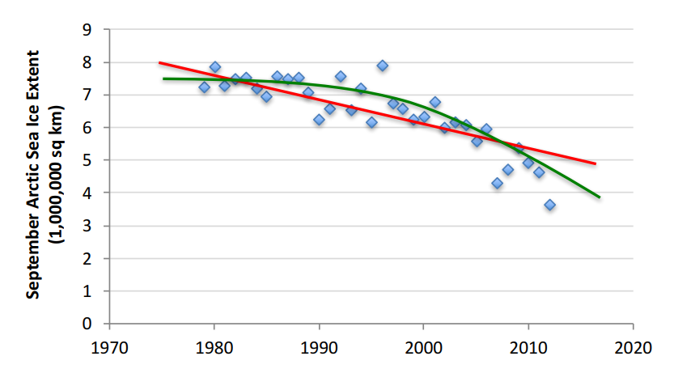
- `y` è **categorico**: classificazione 

**Unsupervised Learning**

L'utilizzo principale dell'Unsupervised Learning è l'individuazione di pattern nascosti nei dati di input.
Delle applicazioni concrete possono essere:

* l'organizzazione di cluster di computer
* analisi di social network
* segmentazione del mercato
* astronomical data analysis

**Reinforcement learning**

Il Reinforcement Learning si basa su un sistema di reward ritardato con il quale viene fornita in output una policy che è una mappatura stato - azione (in un dato stato ti dice quale azione eseguire).
Alcuni esempi possono essere:

* Game Playing
* Robot in a maze
* Bilanciare un palo nella mano


## Progettare un sistema di Learning

Per progettare un sistema di leaning vanno seguiti i seguenti passi:

1. Scegliere il tipo di learning (supervised, unsupervised, ...)
2. Scegliere che cosa si vuole imparare (l'obbiettivo da raggiungere)
3. Scegliere come rappresentare l'obbiettivo
4. Scegliere un algoritmo di learning per dedurre la funzione obbiettivo dall'esperienza


Ogni algoritmo è costituito da 3 componenti:

* Rappresentazione
* Ottimizzazione
* Valutazione

Alcune funzioni di rappresentazione:

* Funzioni Numeriche
  * Regressione Lineare
  * Neural Network
* Funzioni simboliche
  * Decision Tree :palm_tree:
* Funzioni Instance-based
  * Nearest neighbor
* Modelli Probabilistic Graphical
  * Naive Bayes
  * Hidden Markov Models (HMMS)
  * Probabilistic Context Free Grammars (PCFGs)
  * Markov Networks

Algoritmi di Ricerca/Ottimizzazione:

* Gradient decent
  * Perceptron ([Pompotron](https://www.youtube.com/watch?v=0YQmE21aMnw&ab_channel=OrionNebula))
  * BackPropagation
* Dynamic Programming
  * HMM Learning
  * PCFG Learning
* Divide and Conquer
  * Decision tree induction
  * Rule learning
* Evolutionary Computation
  * Genetic Algorithm (GAs)
  * Genetic Programming (GP)
  * Neuro evolution

Alcuni criteri di valutazione:

* Accuracy
* Precision ad Recall
* Squared error
* Likelihood
* Posterior probability
* Cost / Utility
* Margin
* Entropy
* K-L Divergence
* ecc.

## Classificazione

**Definizione Classificazione**: dato un training set, ogni elemento è caratterizzato da una tupla $(x, y)$ dove:

* $x$ è un insieme di attributi (_input_)
* $y$ è il nome della classe (_label_)

Il nostro obbiettivo è quello di imparare un modello che mappa ogni set di attributi $x$ in una data classe $y$.


Ci sono vari modi per effettuare la classificacazione che si dividono in 2 principali categorie:

* Base Classification
  * Decision Tree :palm_tree:
  * Rule Based
  * Nearest Neighbor
  * Neural Networks
  * Deep Learning
  * Naive Bayes and Bayesian Belief methods
  * Support Vector Machines
* Ensemble Classification
  * Boosting
  * Bagging
  * Random Forest (:palm_tree: :palm_tree: ? :palm_tree: ?? :palm_tree:)

### Decision Treeee :evergreen_tree:

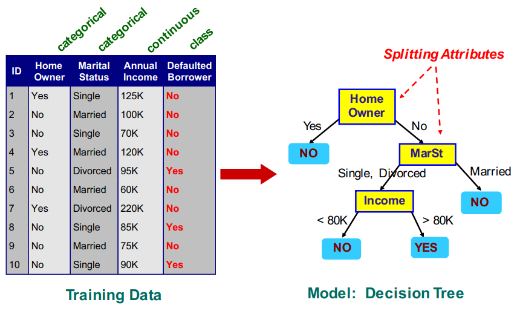

ALcuni algoritmi per la classificacazione basati su decision tree sono:

* Hunt's Algorithm
* CART(s)
* ID3 (volkswagen), C4.5 (Picasso Citroen)
* SLIQ, SPRINT

### Hunt's Algorithm

**Funzionamento**: sia $D_t$ un set di dati di training si ha la seguente procedura:

* se $D_t$ contiene record che appartengono alla stessa classe $y_t$, allora $t$ è un nodo foglia ed appartiene alla classe $y_t$
* se $D_t$ contiene record che appartengono a più di una classe, allora testa un attributo per dividere i dati in sottoinsiemi più piccoli. Poi viene applicata ricorsivamente la procedura di prima.


## Problemi di design di alberi ad induzione elettromagnetica :zap:

Due problemi principali sono:

* la determinazione di una metodologia di split che dipende da due fattori principali:
  * specifica di una condizione di test, che dipende dal tipo di attributo
  * unità di misura per valutare la correttezza di una misura di test (quanto bene un attributo rappresenta la classe)
* determinare quando terminare la divisione:
  * fermarla anticipatamente (Early termination :robot:)
  * fermarla se tutti i record appartengono alla stessa classe (foglia raggiunta) oppure se hanno tutti gli attributi uguali (porteranno allo stesso risultato)

### Metodi per effettuare i test

Questi metodi variano in base al:

* Tipo di Attributo
  * Binary
  * Nominal
  * Ordinal
  * Continussssss
* Numero di vie per lo split
  * 2 way split
  * multy way split

**Multiway or Binary Split**:

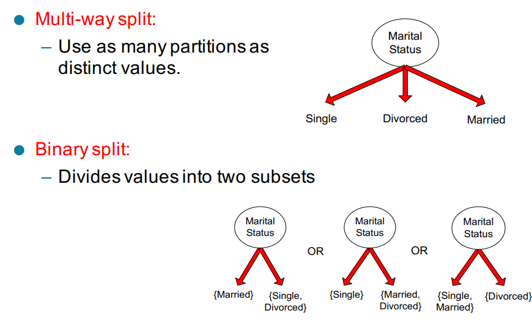

**Splitting di Attributi Continui**

Possono essere gestiti in 2 modi principali:

* Discretizzazione: permettono di formare categorie ordinali. Possono essere raggruppati in cluster, in insiemi di frequenze equivalenti o intervalli equivalenti. Questa divisione può essere effettuata in maniera **Statica** (solo all'inizio) o **Dinamica** (per ogni nodo)
* Decisione Binaria: esegue dei test binari come $A > v$ o $A <= V$

Un possibile approccio è quello greedy che guarda l'indice di purezza della divisione delle classi:


Indici per misurare l'impurità sono :

* GEEEEENEEEEEE Index<br> 
* Entropy<br> 
* Misclassification error<br> 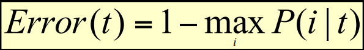

**Come scegliere lo split migliore**:

1. Calcolare l'indice di impurità `P` prima dello split
2. Calcolare l'indice di impurità `M` dopo lo split
   * `M` è l'impurità pesata dei figli
3. Scegliere l'attributo che produce il valore `Gain` maggiore: `Gain = P - M` (equivalente a scegliere l'attributo con `M` minore)


#### Gini

`p(j|t)` è la frequenza relativa della classe j al nodo t

Il valore massimo che può assumere è $1 - \frac{1}{nc}$ quando i record sono distribuiti in maniera equa e quindi si ha un alto livello di impurità

Il minimo è 0.0 che implica che titti i record appartengono ad una sola classe (l'informazione più interessante)

L'indice Gini è usato negli algoritmi CART, SLIQ SPRINT

#### Entropy

L'entropia è come l'indice geany, serve per trovare lo split migliore (quello che ha valore di entropia più vicino allo 0). Questi indici però tendono a tenere in considerazione la purezza degli attributi, senza tenere conto della larghezza dell'albero.

Per aggirare questo problema viene introdotto il Gain Ratio che penalizza le partizioni piccole con molti elementi.


#### Pro Vs Cons

*Pro*:

* Costruzione poco costosa
* Incredibile velocità della classificazione di record sconosciuti :rocket:
* Di facile interpretazione per alberi di piccole dimensioni
* Resistente al rumore (IP68)
* Può gestire facilmente attributi ridondanti o irrilevanti

*Contro*:

* lo spazio delle decisioni piò essere esponenziale e quindi l'approccio greedeeeee non riesce spesso a trovare l'albero migliore
* Non considera le interazioni tra gli attributi
* Il confine decisionale considera solo un attributo alla volta

### Caratteristiche degli Alberi

Se viene utilizzato 1 attributo per test condition le decision boundary corrisponderanno a rette perpendicolari agli assi dei corrispondenti attributi.


_Test condition con un singolo attributo_

Per avere delle decision boundary più elaborate è necessario creare test condition che considerano attributi multiply.


_Test condition con più attributi: `x + y < 1`_

## Errori

Ci sono 3 tipi di errori:

* **Training**: sono gli errori effettuati durante la fase di training (utilizzando dataset di training)
* **Testing**: sono gli errori effettuati durante la fase di testing (utilizzando il dataset di testing)
* **Generalization**: l'errore intrinseco del modello testato su un insieme di record non precedentemente visti appartenenti alla stessa distribuzione

### Overfitting e Underfitting


**Overfitting**:
Se i dati di training sono sotto rappresentativi (non rappresentano bene l'ambiente), all'aumentare dei nodi aumentano gli errori di testing e diminuiscono gli errori di training. Aumentando la dimensione dei dati di training riduce questa differenza tra i dati ad un qualsiasi numero di nodi.

__In breve__: se vengono forniti dati che non rappresentano completamente il problema allora l'algoritmo andrà ad imparare solamente come risolvere quelle situazioni e non riuscirà a gestirne di diverse (esempio: vengono fornite 2 razze di primati per il problema del riconoscimento di scimmie, l'algoritmo imparerà a conoscere perfettamente quelle 2 razze, ma quando gli verrà presentata una nuova razza non comprenderà che è una scimmia).

Le cause dell'overfitting sono:

* Dimensioni dei dati di Training limitate
* Alto livello di complessità del modello

Decision Trees molto più complessi del dovuto portano all'Overfitting.
Gli errori di Training non forniscono una buona stima degli errori di Testing.

**Underfitting**:
Quando un modello risulta troppo semplice e non è in grado di classificare correttamente i dati.

## Model Selection

Serve per valutare la bontà di un dato modello, e quindi per evitare che incappi in overfitting stimandone il Generalization. Il **Generalization Error** può essere calcolato nei seguenti modi:

* Usando un **Validation Set**
  * E' un set di dati, diverso dal training, che serve per stimare quanto sia affidabile il modello, ma non è sufficiente per il testing (esempio dell'esame di Bartoli). Si creano e allenano più modelli differenti e con il validation set si sceglie quello più preciso.
* Incorporando la **Model Complexity**
  * Un'alta complessità tende a causare un numero maggiori di errori, quindi, dati 2 modelli è sempre meglio preferire quello con complessità minore. La complessità equivale a: $GenError(Model) = TrainError(Model, TrainData) + a \cdot Complexity(Model)$
* Stimando i Limiti Statistici

### Approccio pessimistico

Questa formula serve per calcolare il Generalization Error e quindi la complessità del Decision Tree


_E' equivalente alla formula_ $GenError(Model) = TrainError(Model, TrainData) + a \cdot Complexity(Model)$

### Approccio Ottimistico

Nel caso in cui non si voglia calcolare il Generalization Error, può essere fatta una stima molto ottimistica dell'errore con il Training Error.

### PrePruning

Per evitare che un modello incappi in overfitting si può applicare la strategia del pruning: ovvero la potatura di alcune foglie per semplificare l'albero.

Il PrePruning avviene prima del completamento del Decision Tree e per decidere quando potare vengono usate dei valori di threshold che, se superati, portano all'eliminazione di un sotto albero.

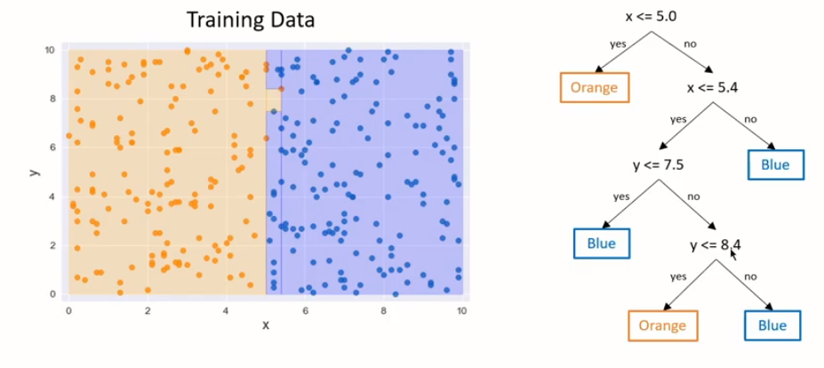


### PostPruning

E' simile al prepruning solo che la potatura viene effettuata solo dopo che il Decision Tree viene calcolato completamente, con modalità Bottom-Up.
La classe scelta per sostituire il sotto albero sarà quella con il numero maggiore di record.
E' più preciso del PrePruning però richiede più calcoli.

## Valutazione delle Performance di un Classificacatore

Ci sono vari modi per valutare le performance di un classificacatore:

* **Metodo Holdout**: consiste nel dividere i dati originali in 2 set: uno di training e uno di testing (la divisione è a discrezione dell'analista). Successivamente il classificatore viene allenato col set di training e poi viene testata la sua accuratezza con il set di testing. Questo modello presenta svariati problemi: se forniamo troppi dati di testing e pochi di training, il modello potrebbe non operare al massimo delle sue potenzialità, mentre se vengono forniti troppi dati di training e pochi di testing, la stima finale potrebbe non essere affidabile al 100%. Infine, poiché i set di training e di testing sono derivati dallo stesso insieme di dati, potrebbe capitare che uno dei 2 sottoinsieme sia più rappresentativo del dataset originale, mentre l'altro no. Per migliorare la precisione di questo metodo piò essere applicato il Random Subsampling che consiste nel ripetere più volte l'allenamento e il testing con sotto set differenti per ogni iterazione.
* **Cross-Validation**: un'alternativa al Random Subsampling è il Cross-Validation che consiste nel dividere il dataset in `k` partizioni di dimensioni equivalenti e successivamente di utilizzare `k-1 ` partizioni per il training e 1 per il testing. Queste partizioni si scambieranno fin quando tutti gli elementi verranno utilizzati per il testing 1 sola volta. Un metodo speciale è il _leave on out_, che è simile al metodo descritto sopra ma ha `k = N` (dove `N` è la dimensione del dataset) e consiste nell'usare un solo record alla volta per il testing. Questa procedura risulta molto precisa ma molto costosa.

## Imbalanced Class Problem ⚖️

In alcuni problemi di classificazione il numero di record delle classi potrebbero essere sbilanciati. Come si può valutare la precisione di un classificatore con queste caratteristiche ??

### Precision & Recall

Per valutare la bontà di un classificatore possiamo utilizzare varie metriche, la più comune è l'Accuracy. Tuttavia, se è più importante che il modello rilevi la "classe rara" (e.g. transazione fraudolenta su dataset di transazioni) l'accuracy non è molto utile perché il suo valore viene incrementato notevolmente dai record dell'altra classe (quella più comune).

Per visualizzare meglio il problema possiamo utilizzare la **confusion matrix**, una matrice che mette in evidenza come vengono classificati i vari record.

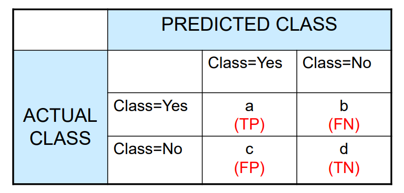

Basandoci sulla confusion matrix possiamo calcolare l'accuracy come: 

Esistono altre metriche importanti per valutare meglio i classificatori:

- **Precision**: serve a mettere in evidenza i _false positive_, più è alta la percentuale meno ce ne sono. (verticale) 
- **Recall**: serve a mettere in evidenza i _false negative_, più è alta la percentuale meno ce ne sono. (orizzontale) 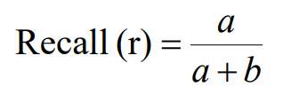
- **F-measure**: sintetizza in un'unica misura i valori di Precisione e Recall. 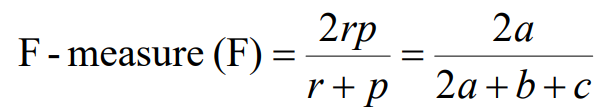

Ne esistono tantissime altre che vanno utilizzate in base al problema specifico che andiamo ad affrontare (generalmente Precision e Recall sono quelle più utili ed efficaci).

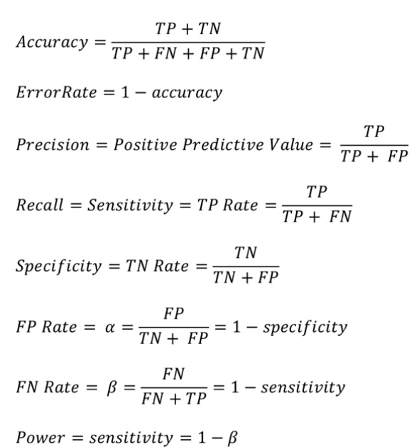

**Esempio**:

Nel seguente esempio possiamo vedere come l'Accuracy è alta ma i valori di Precision e Recall sono estremamente bassi, indice di un classificatore dalle scarse performance (tabella 1).


### ROC 🪨


Un metodo grafico per confrontare vari modelli è quello di utilizzare le curve **ROC** (Receiver Operating Characteristics). Esse rappresentano la relazione tra True Positive Rate (**TPR**, asse y) e False Positive Rate (**FPR**, asse x) mostrando i compromessi tra TPR e FPR.

Nelle ROC ci sono dei punti che hanno un'interpretazione ben conosciuta:

- (0, 0): un modello che predice tutte le istanze come negative
- (1, 1): un modello che predice tutte le istanze come positive
- (1, 0): modello ideale con assenza di False Positive (le azzecca tutte)

La retta che congiunge i punti (0, 0) e (1, 1) rappresenta il Random Guessing. Se un grafico si avvicina a questa il modello fa molto schifo.

Se un grafico si trova più a sinistra dell'altro (più verso (1, 0)) allora è migliore localmente. Non possiamo però affermare che uno è meglio dell'altro in generale.

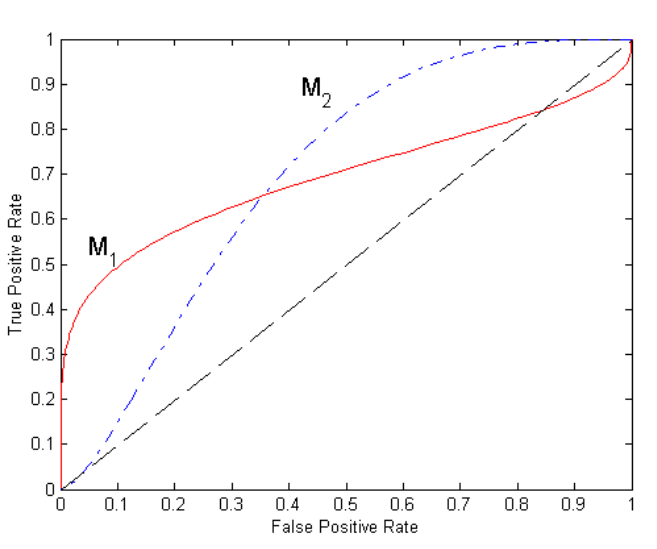

Nella figura precedente possiamo vedere che il modello M1 risulta migliore con un FPR inferiore di ~0.36, invece M2 è migliore con un FPR maggiore. Non possiamo però affermare che uno sia meglio dell'altro globalmente.

Un buon indice per valutare quando un modello è migliore di un altro in generale è calcolare l'area sotto la curva ROC, se questa è maggiore di un altro modello possiamo affermare che questo è migliore dell'altro globalmente. Se l'area di una ROC è 0.5 rappresenta un modello equivalente al Random Guessing. Un modello ideale ha l'area uguale ad 1.

#### Generazione di una ROC

Le curve ROC possono essere rappresentate solo se il modello produce output continui che verranno utilizzati per fare il ranking delle predizioni. Questi output continui potrebbero essere le Posterior Probabilities generate da un Naive Bayesian Classifier o valori numerici prodotti da un ANN.

Assumendo che gli output del modello siano continui per tracciare la curva ROC bisogna:

1. Ordinare tutti i record di test in ordine crescente in base al loro valore di output
2. Selezionare il record con rank più basso e assegnare questo e tutti gli altri record sopra di lui come Positive Class (equivale a classificare tutto come Positive Class, TPR = FPR = 1)
3. Selezionare il record successivo, classificare il record selezionato e tutti quelli superiori come Positive e quelli sotto di esso come Negative. Aggiornare il TPR e FPR come segue:
   - se il record precedente è Positive, decrementa il TP Count e lasciare inalterato i FP Count
   - se il record precedente è Negative, decrementa i FP Count e lascia inalterati i TP Count
4. Ripeti lo step 3 fin quando non raggiungi il record con il rank più alto.
5. Stampa TPR e FPR

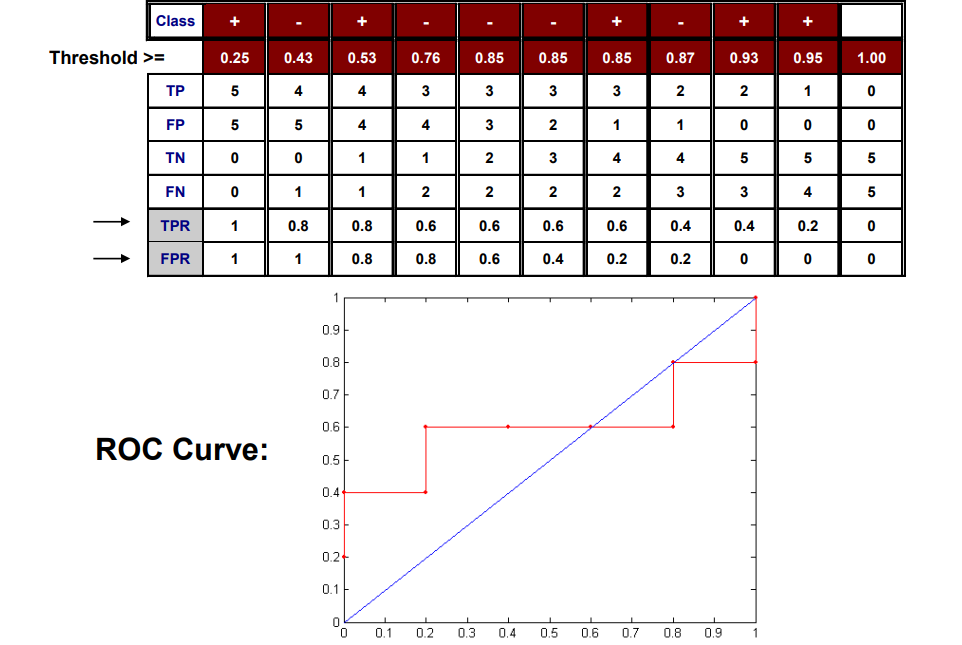

### Conclusione del problema

Per risolvere il problema delle classi sbilanciate bisogna:

- Undersample della classe più popolosa
- Oversample della classe più rara.

## Nearest Neighbor Classification

Esistono dei tipi di algoritmi di learning che non costruiscono un modello a priori per classificare i dati ma che li classificano solamente nel momento del bisogno, essi sono detti lazy learners. Un esempio è il Rote Classifier che si ricorda tutti i suoi esempi di training e una volta passati dei dati di testing li classifica solo se corrispondono esattamente a dati già visti nella fase di training. Questo implica una scarsa flessibilità nella classificazione. E' stato quindi ideato un approccio più generale chiamato Nearest Neighbor Classifier.

Esso si basa sullo stesso concetto della Rote Classifier ma non guarda l'equivalenza ma la similarità tra il dato di testing e quelli di training, ovvero cerca i vicini più vicini al record di testing.

I dati con `n` attributi vengono rappresentati su uno spazio n-dimensionale e la precisione della classificazione dipende da una variabile distanza `k`. Ci sono altre varianti di questo algoritmo che alterano il modo di determinare i vicini più vicini basandosi non solo sulla distanza ma anche sulla _classe di maggioranza_, oppure sulla _classe di maggioranza con distanze pesate_ dove non conta solamente la classe che compare più volte ma anche la sua distanza dal record di testing (più lontano sarà e minore sarà l'importanza).
È importante notare che un numero `k` troppo alto di vicini potrebbe includere anche classi errate ed un numero troppo piccolo risulta essere molto sensibile al rumore.


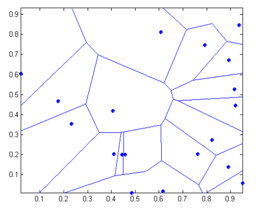


_Diagramma di Voronoi per 1-nearest Neighbor e Distanza Euclidea_

### Vantaggi

* Non hanno bisogno di mantenere un modello astratto derivato dai dati
* Non richiedono model building
* Poiché possono generare decision boundaries arbitrariamente dispongono di una maggiore flessibilità rispetto agli eager learner

### Svantaggi

- Richiedono più computazione degli eager learner nella fase di testing
- Poiché fanno classificazioni basate su informazioni locali sono molto suscettibili al rumore
- Possono generare errori di classificazione se non avvengono step di preprocessing (aggiustamento delle scale dei dati)

## Bayesian Classification

Un classificatore bayesiano basa il suo processo di learning su un importatane teorema statistico: Il teorema di Bayes.


Questo teorema fornisce un modo per revisionare delle predizioni o teorie esistenti, aggiornandone le probabilità in seguito alla scoperta di informazioni aggiuntive.
Il teorema afferma che: la _probabilità a posteriori_ `P(Y|X)` è data dal prodotto della _probabilità condizionale di classe_ `P(X|Y)` per la _probabilità a priori_ `P(Y)` fratto le _nuove informazioni_ `P(X)`

**N.B.** quando si confrontano varie probabilità per differenti valori di Y, il denominatore può essere ignorato.

Tale teorema può essere applicato da un algoritmo di ML in due modi in base a come viene implementato il calcolo della _probabilità condizionale di classe_:

* Naive
* Belief Network

Per la classificazione si va a vedere il valore più alto tra le varie probabilità a posteriori `P(Y|X)` e la classe con probabilità maggiore sarà la vincente.

### Naive Bayesian Classifier

Il metodo Naive calcola il valore di `P(X|Y)` nel seguente modo:


Va però fatta una distinzione in base ai tipi di attributo che si prendono in considerazione:

* **Categorici**: si calcola il rapporto tra il numero di volte che l'attributo compare all'interno dei record che contengono la classe in questione fratto il numero di volte che compare la classe Y in questione

* **Continui**: per trattare questi dati si può procedere in 2 modi diversi:
  
  * **Discretizzando**: si dividono i dati in intervalli più piccoli trasformando quindi l'attributo continuo in un attributo categorico e si procede come visto sopra. Bisogna fare attenzione a come vengono scelti gli intervalli: troppo grandi sono poco precisi e troppo piccoli causano overfitting
  * **Utilizzano le distribuzioni di Probabilità**: si cerca una distribuzione di probabilità più adatta alle variabili continue e si stimano i parametri della distribuzione usando i dati di training. Generalmente la distribuzione Gaussiana è la più utilizzate e quindi ne deriva la seguente formula: 

Se una probabilità condizionale è `0` allora verrà azzerata tutta l'espressione. Per questo motivo sono state implementate delle variazioni che permettono di evitare il problema:

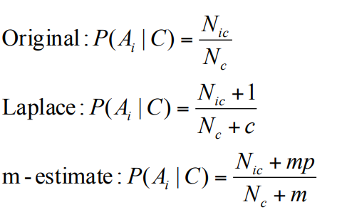

#### In Breve

* Sono resistenti a punti di rumore isolati che vengono cancellati durante i calcoli
* Sono resistenti ad attributi irrilevanti
* Le performance vengono peggiorate da attributi correlati perché non esiste più l'assunzione dell'indipendenza condizionale (per risolvere questo problema si usa il BBN spiegato dopo)

### Bayesian Belief Network

Se sono presenti degli attributi correlati questo algoritmo offre performance migliori. Esso fornisce una rappresentazione grafica delle relazioni probabilistiche tra un insieme di variabili random tramite un DAG (Grafo Orientato Aciclico).
A seconda del numero di nodi padri viene fatta una distinzione:

* Se non ha genitori allora contiene la probabilità a priori `P(X)`
* Se ha 1 solo genitore, contiene la probabilità condizionale `P(X|Y)`
* Se ha più genitori, contiene la probabilità condizione `P(X|Y1, Y2, ..., Yn)`
  

Queste probabilità vengono poi inserite in una tabella relativa ad ogni nodo. Durante la classificazione vengono presi questi valori per calcolare la classe di appartenenza.

#### In Breve

* Permette la visualizzazione grafica tramite un DAG
* La prima costruzione richiede molto tempo e risorse, ma una volta costruito è di facile gestione
* Gestiscono facilmente i dati incompleti (attributi mancanti)
* Resistente al Model Overfitting

## Support Vector Machine 🎰

Le Support Vector Machine sono una tecnica di classificazione basata sullo _statistical learning_ che di recente ha visto un incremento di interesse nell'ambito della ricerca. Si presta bene alla classificazione e riconoscimento di testi.

La sua applicabilità ricade principalmente in casi in cui i dati sono linearmente separabili, ma sono state studiate strategie per poterle applicare anche negli altri casi.

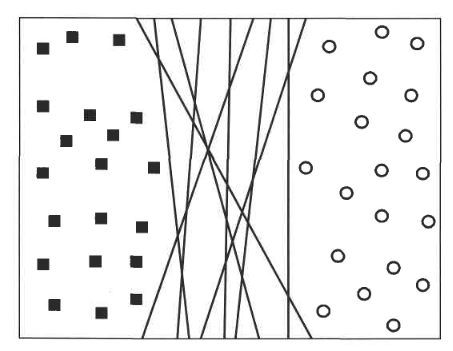

Il principio di funzionamento di questi classificatori si basa nel suddividere l'insieme dei dati di training con un iperpiano affinché i dati a destra e a sinistra dell'iperpiano facciano parte di classi distinte (linearmente separabili).

_In breve_: individuazione dell'iperpiano che separa i dati.

Tuttavia, per un dato set di dati è possibile trovare infiniti iperpiani che separano i dati, dunque è importante trovare l'iperpiano che dia i risultati migliori. Per farlo è necessario introdurre il concetto di **margine**: il margine può essere identificato come la distanza tra le rette parallele all'iperpiano passanti per i vettori di supporto (i punti del dataset) di classi diverse più vicini.


Per ottimizzare il modello, l'algoritmo dovrà cercare i vettori di supporto più vicini andando a massimizzare il loro margine, poiché un margine ampio genera un minore errore di classificazione (su record non visti precedentemente) e riduce l'overfitting.

### Classificazione

Essendo l'iperpiano una retta, il decision boundary del modello può essere rappresentato con la seguente formula:

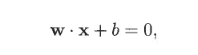

dunque, per poter classificare i dati situati al disopra e la disotto del decision boundary, per un dato input (`z`) dovremmo risolvere la seguente disequazione:


### Training - Caso Separabile

Come per tutti i classificatori lineari, l'obiettivo di training sarà quello di stimare i parametri `w` e `b` per determinare un decision boundary, questi parametri andranno scelti in modo tale da rispettare le seguenti condizioni:


Tuttavia per le SVM è necessario un requisito aggiuntivo, ovvero quello di massimizzare il margine relativo al decision boundary. Il margine può essere ricavato tramite la seguente formula:

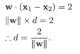

Dobbiamo quindi massimizzare questa distanza, ma per motivi matematici e di semplificazione dei calcoli possiamo riscriverla nel seguente modo e minimizzarla (risulterà più semplice minimizzare che massimizzare):

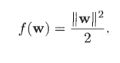

Riassumendo, il processo di training di una Linear SVM con dati separabili, può essere formalizzato con il seguente problema di ottimizzazione vincolato:

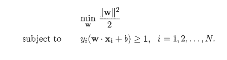

Per risolvere effettivamente questo problema, sarà necessario riscrivere la funzione obbiettivo come Lagrangiana affinché essa tenga conto dei vincoli imposti alle sue soluzioni.

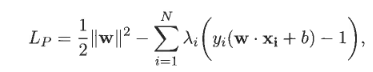

_Ulteriori spiegazioni sono delegate al Dott. Cristian Cosci :scroll:._

### Training - Caso non Separabile

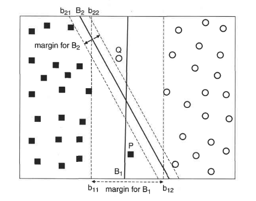

Come si vede dall'immagine, `B2` è l'unico margine privo di errori, tuttavia essendo piccolo è molto suscettibile all'overfitting. Per questo motivo può essere una buona opzione scegliere il margine `B1` che, anche se presenta dei piccoli errori, è molto probabile che dia performance che siano migliori in generale. Questo approccio è detto **Soft Margin** e consiste nel trovare un compromesso tra larghezza del margine e numero di errori commessi nella fase di training. Questo permette anche di risolvere semplici problemi non linearmente separabili.

La funzione per la massimizzazione del margine rimane invariata rispetto a quella dell'approccio per dati separabili, tuttavia bisognerà cambiare le restrizioni che verranno invalidate dal nostro nuovo approccio. Sarà necessario avere una piccola soglia di tolleranza agli errori durante la fase di training, questo viene raggiunto introducendo le *Slack Variables* che forniscono una stima dell'errore per il decision boundary su un dato esempio di training.


Tuttavia, applicando questa definizione direttamente all'algoritmo di training, non viene imposto alcun vincolo sul numero di errori che possono essere commessi e di conseguenza, l'algoritmo troverebbe un margine molto ampio ma pieno di errori in fase di training. Per evitare il problema è necessario penalizzare decision boundary con un valore delle slack variable alto.

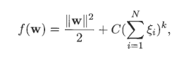

I parametri `C`e `k` rappresentano quanto l'errore penalizzi il modello. Per esempio:

- con valori di C **grandi**, il peso delle violazioni aumenta e di conseguenza si avrà un margine piccolo che porterà ad overfitting
- con valori di C **piccoli**, si avrà un margine ampio con molti errori ed un elevato bias

### Training - Caso Non Lineare

Gli approcci definiti fino ad ora non sono applicabili agli spazi di training non linearmente separabili, dunque è necessario trovare un nuovo approccio che consiste nel trasformare lo spazio di partenza $x$ in uno spazio linearmente separabile $\Phi(x)$.


Come possiamo vedere da questo esempio, il decision boundary che originariamente era circolare viene linearizzato applicando la trasformazione non lineare $\Phi(x)$.


Il nuovo learning task potrà essere formalizzato come il seguente problema di ottimizzazione:


L'unica differenza con il caso linearmente separabile è che il vincolo viene calcolato non più sul set degli attributi base $x$ ma, sulla loro trasformazione $\Phi(x)$, che è un vettore con tante componenti quante sono le dimensioni dello spazio trasformato.

Sviluppando la Lagrangiana, il calcolo si ridurrà a un *dot product* (prodotto scalare o similarità) tra una coppia di vettori dello spazio trasformato ($\Phi(x_i) \cdot \Phi(x_j)$ ). Tuttavia questo calcolo risulta essere tremendamente costoso e per causa sua possiamo incappare nella **Maledizione della Dimensionalità**: aumentando il numero di dimensioni (features) il quantitativo di dati necessario per generalizzare con precisione aumenta esponenzialmente (servono tantissimi dati di training per permettere al modello di apprendere tutte le possibili combinazioni di feature possibili)!

Questo problema può essere aggirato tramite il **Kernel Trick**.

Il kernel trick è un metodo che permette di calcolare la similarità tra 2 vettori partendo dal set di attributi originale, che può essere espresso come segue:


La sua applicabilità richiede che sia vera la seguente affermazione: deve esistere una trasformazione corrispondente tale che la kernel function calcolata per una coppia di vettori è equivalente al dot product dei vettori nello spazio trasformato. Tale proprietà viene espressa dal teorema di Mercer.


In sostanza, applicando la funzione kernel si evita di calcolare le $\Phi$, riducendo il costo computazionale dell'algoritmo.

### Caratteristiche

Le caratteristiche generali delle SVM sono le seguenti:

- Il learning problem può essere formulato come un problema di ottimizzazione convesso per i quali sono disponibili algoritmi molto efficienti che garantiscono il ritrovamento di un minimo globale (che fornisce le performance migliori)
- Performa il Capacity Control, massimizzando il margine del Decision Boundary
- Può essere applicato a variabili categoriche introducendo Dummy Variables per ogni categoria degli attributi
- Sono applicabili a problemi multi classe

## Ensemble Methods

Gli ensemble methods sono delle tecniche di classificazione che basano il loro principio di funzionamento sul combinare vari classificatori per ottenere un risultato più preciso.
È stato osservato che i classificatori di base non devono essere correlati tra di loro perché in quel caso l'errore di generalizzazione totale non verrà migliorato dal metodo ensemble (meglio classificatori indipendenti).

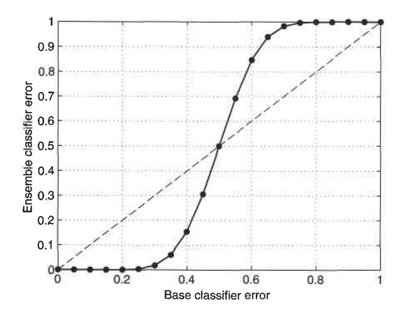

Dall'immagine possiamo notare come i metodi ensemble vanno a migliorare il generalization error totale solo fino a quando il generalization error dei modelli di base è migliore del random guessing (<.5). La linea tratteggiata mostra le performance di classificatori base correlati tra di loro, mentre la riga continua mostra le performance di classificatori base indipendenti.

### Metodi per costruire Ensemble Classifier

1. **Manipolando i dati di training (training set)**: vengono creati più set di training basandosi su una qualche distribuzione di campionamento. Dopodiché viene creato un classificatore utilizzando degli algoritmi particolari come _Bagging_ e _Boosting_.
2. **Manipolando le input features**: da ogni dataset viene scelto un sottoinsieme di input features che verranno poi utilizzate per allenare i vari classificatori dell'ensemble.
3. **Manipolando le label di classe**: questo metodo si usa quando ci sono un grande numero di classi, il dataset di training viene trasformato in un problema di classificazione binario partizionando le label in due sottoinsiemi disgiunti $A_0$ e $A_1$ che verranno utilizzate successivamente per allenare un classificatore. Ripetendo questo step più volte (relabeling) si otterrà un ensemble di classificatori base. Quando poi verrà passato un dato di test $x$ viene fatta la somma delle volte che viene classificato nella classe $A_0$ o nella classe $A_1$ e poi viene scelta la classe di maggioranza.
4. **Manipolando l'algoritmo di learning**: l'algoritmo di learning scelto viene applicato più volte per ottenere più modelli di base che poi verranno utilizzati per creare l'ensemble. Un esempio di modelli che si prestano meglio a questo processo sono i decision tree e le ann, perché variando i parametri (pesi, bias, topologia del modello, ecc.) con cui sono costruiti creano classificatori abbastanza diversi.

I primi 3 approcci sono metodi generici, mentre l'ultimo è dipendente dal tipo di classificatore utilizzato.

Gli ensemble methods funzionano meglio con classificatori instabili, ovvero modelli molto sensibili a piccole perturbazioni nel dataset di training.

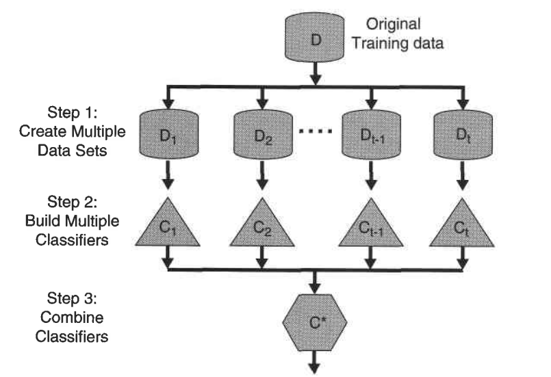
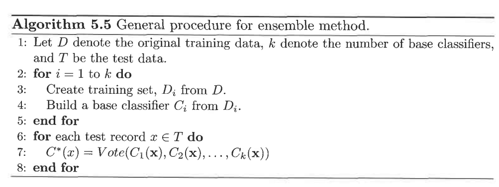

### Bias-Variance Decomposition

L'inabilità di un modello di machine learning nel catturare la vera relazione tra i dati è chiamata **Bias** (min sqrt error, la distanza tra i pallini e la riga rossa).


A sinistra un esempio di bias elevato (c'è molta distanza tra i pallini e la retta), a destra un esempio di bias nullo, la riga rossa riesce perfettamente a dividere ogni pallino.

La **Varianza** è quanta differenza c'è tra accuracy nel dataset di training ed in quello di testing (quanto classifica bene il training e il testing).


A sinistra il training set viene classificato perfettamente, a destra il testing set viene classificato abbastanza male (distanza tra pallini e linea) quindi abbiamo una varianza elevata.

Con un bias estremamente piccolo ed un elevata varianza siamo di fronte all'overfitting.

### Bagging

È un metodo di classificazione che manipola i dati di training campionando con ripetizione l'insieme di training e ottenendo così `n` sotto set, tutti della stessa dimensione del dataset originale,(fase di bootstrap) che verranno utilizzati per allenare `n` modelli dell'ensemble. I record vengono scelti secondo la distribuzione uniforme e dunque ogni campione di bootstrap conterrà circa `63%` dei dati del set originale. Può capitare che in alcuni campioni di bootstrap compaiano molteplici volte lo stesso record o che alcuni siano del tutto assenti.

Una volta allenati i modelli, per classificare un record mai visto prima viene effettuata una votazione di maggioranza e la classe con più voti risulterà la classe di output (aggregation).

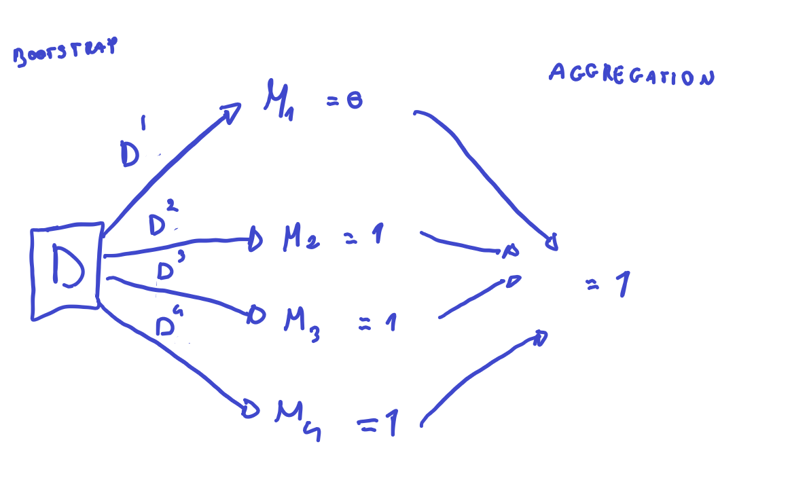
_Romani Artista 🖌️_

Il Bagging migliora l'errore di generalizzazione riducendo la varianza dei classificatori di base, questo perché le prestazioni del bagging dipendono dal classificatore di base:

- se il classificatore di base è instabile, aiuta a ridurre gli errori associati alle fluttuazioni nei dati di training
- se il classificatore di base è stabile (robusto a piccole perturbazioni nell'insieme di addestramento), l'errore dell'ensemble è principalmente causato da bias nel classificatore di base. In questo caso il bagging potrebbe non migliorare le performance ma andare addirittura a peggiorarle.

### Boosting

Il Boosting è una procedura iterativa che cambia in maniera adattiva la distribuzione dei campioni di training in maniera tale che vengano favoriti i campioni classificati erroneamente. Ad ogni campione viene assegnato un peso (nella fase iniziale hanno tutti lo stesso `1/N`, con `N` il numero di record) e si effettua un campionamento con ripetizione con cui verrà costruito il primo modello. Successivamente il modello viene testato ed in base agli errori di classificazione commessi, i pesi dei campioni del dataset originale verranno aggiornati e si ripeterà il processo fino ad ottenere il numero di modelli richiesto. I pesi dei record correttamente classificati verranno decrementati metre quelli misclassificati saranno aumentati per far si che nello step successivo verranno scelti.


_Esempio di classificatori generati con 10 Round di Boosting_

Esistono differenti versioni che variano nel come i pesi vengono aggiornati e in come le predizioni fatte dai vari classificatori sono combinate. Una possibile implementazione di questo metodo è l' **Ada Boosting**.

#### AdaBoosting

L'algoritmo di Ada Boosting funziona nel seguente modo:

1. Inizialmente viene assegnato ad ogni record del dataset lo stesso peso: `1/N`.
2. Per ogni feature del dataset viene generato un modello base (e.g. decision stump) e viene calcolato l'errore pesato `ei` di ogni modello. Se `ei` supera `0.5` allora i pesi vengono resettati ai valori di partenza (`1/N`). 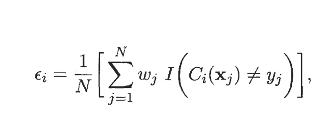.
   Da questo errore è possibile ricavarsi il parametro `aj` che verrà utilizzato per aggiornare i pesi nello step successivo (è tipo un indice di performance). 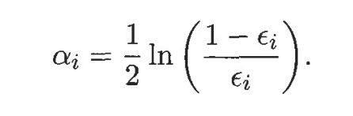
3. Aggiorna i pesi di ogni record basandosi sulla seguente formula: . Se il record è classificato correttamente il peso viene diminuito, altrimenti viene aumentato. `Zj` è un fattore di normalizzazione che permette di far tornare la somma di tutti i nuovi pesi del dataset a 1 (ricondotto alla probabilità che venga scelto nella nuova istanza di training)(calcola i nuovi pesi e li normalizza).
4. Continua partendo dai nuovi pesi fin quando non si ottiene il numero di classificatori voluti.

Dato un test record, il risultato viene scelto basandosi su una media pesata dei risultati di classificazione di tutti i classificatori base. Si tende a dare più peso ai classificatori con accuracy più alta sfavorendo quelli dalle performance peggiori (che solitamente sono quelli generati durante le prime fasi di boosting).

È importante notare che possiamo stimare l'errore di training dell'ensemble ed è dato dalla seguente formula (pone un limite superiore):

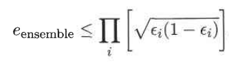

Dato che questo algoritmo tende a concentrarsi su esempi di allenamento che vengono classificati in modo errato, la tecnica di boosting può essere piuttosto suscettibile all'overfitting.

### Random Forest

L'algoritmo Random Forest combina le decisioni di più alberi decisionali (ensamble). Ogni albero viene generato basandosi su valori di un vettore scelto a caso tramite una distribuzione di probabilità fissa (a differenza di quella dell'AdaBoosting che variava nel tempo).

Usare il Bagging con alberi decisionali è un particolare tipo di Random Forest che serve per aggiungere casualità durante la costruzione del modello per evitare alberi troppo correlati tra di loro.

Si può stimare un limite superiore del generalization error (a patto che il numero di alberi della random forest sia abbastanza elevato):

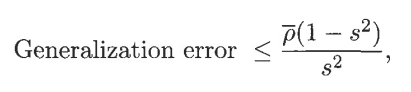

dove `p` rappresenta la correlazione media tra gli alberi e `s` misura la forza dell'albero di decision (le performance medie dei classificatori). Più gli alberi diventano correlati (`p` grande) o la forza `s` diminuisce, maggiore sarà il limite dell'errore (il generalization error aumenta). La correlazione può essere migliorata tramite la randomizzazione.

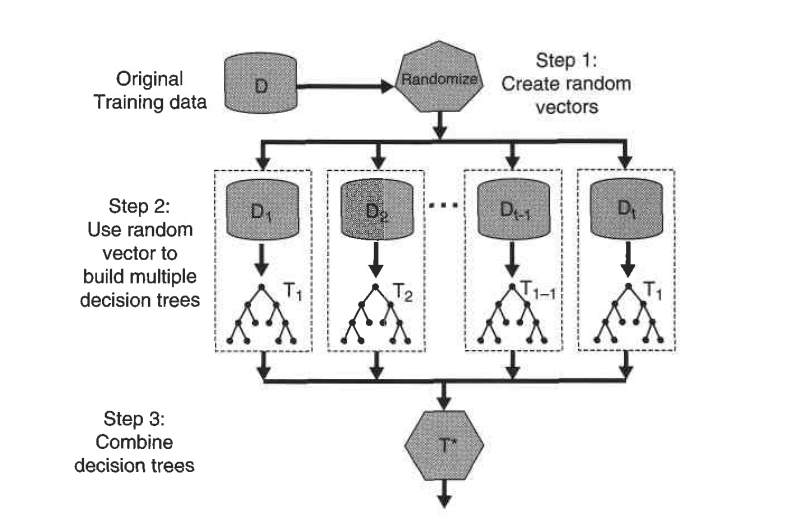

Un vettore casuale può essere incorporato nella crescita dell'albero in più modi (come creare il vettore random):

1. **Forest-RI** (random input selection):  vengono selezionate randomicamente `F` features (colonne) tra cui scegliere per effettuare lo split di ogni nodo dell'albero. L'albero viene costruito interamente senza effettuare pruning per ridurre il bias. La forza `s` e la correlazione `p` dipendono da `F`:
   
   - F **piccolo** genera una minore correlazione (la migliora) tra gli alberi ma una minore forza (la peggiora)
   
   - F **grande**: genera una maggiore correlazione (la peggiora) ma una maggiore forza (la migliora)
     
     Un modo (trade-off) per scegliere la dimensione di `F` è data dalla seguente formula:
        dove `d` è il numero di features.
   
   Dato che non vengono prese in considerazione tutte le features per effettuare gli split, il tempo di runtime è considerevolmente ridotto.

2. **Forest-RC**: se il numero di feature originale `d` è troppo piccolo è difficile scegliere un set di random features indipendente, quindi un modo per risolvere questo problema è quello di creare nuove combinazioni lineari di feature. Per fare questo, ad ogni split dell'albero vengono prese `L` features di input e vengono combinate tra loro seguendo una distribuzione uniforme ([-1, 1]) e di queste nuove feature viene scelta quella che genera lo split migliore. Anche questa migliora le performance di tempo.

3. **Metodo 3**:  viene selezionata randomicamente una tra le migliori feature di split (le guarda tutte quelle a disposizione). Se le feature a disposizione sono poche può generare alberi correlati tra di loro (meglio utilizzare uno degli altri due metodi). Questo metodo non ha il vantaggio di andare a migliorare il tempo di esecuzione perché è costretto a controllare tutte le features ad ogni split.

Le Random Forest sono più robuste al rumore e veloci rispetto all'AdaBoost, sono anche più resistenti all'overfitting dato che hanno alberi più profondi e quindi hanno un bias ridotto.

## Artificial Neural Network (ANN)

Le ANN si ispirano al funzionamento del cervello umano, si basano su:

* Neuroni
* Assoni
* Dendriti
* Sinapsi

Le ANN non hanno tutti questi elementi ma solo i Neuroni (Nodi) e gli Assoni (link pesati) che fungono anche da Dendriti e Sinapsi.

Il modello più semplice di ANN è chiamato Percettrone e vedremo che sarà utile per risolvere problemi di classificazione.

### Percettrone (pompotron :robot:)

Il percettrone consiste in 2 tipi di Nodi:

* Più Nodi di Input: che rappresentano i dati di input
* Un Nodo di Output: che rappresenta l'output del modello

I nodi vengono anche chiamati Neuroni o Unità.

Ogni nodo input è connesso con il nodo output tramite un collegamento pesato che emula il collegamento sinaptico. Allenare dunque un percettrone vuol dire aggiustare il valore dei pesi finché non si adattano alla relazione di input-output richiesta. Il risultato del neurone di output è la somma pesata di tutti i neuroni di input più l'aggiunta di un bias (threshold di attivazione)


_Esempio di un percettrone_

Il risultato di un neurone di output può essere scritto come:


#### Modello di Apprendimento del Pompotron

Come detto prima la fase di Training di un Percettrone vuol dire aggiustare i pesi dei collegamenti. La seguente formula indica come effettivamente viene aggiornato il valore dei pesi dei collegamenti:

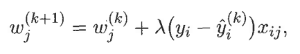

In modo molto intuitivo, il nuovo peso $w^{(k+1)}$ è la combinazione del vecchio peso $w^{(k)}$ e un valore proporzionale all'errore di predizione $(y - \hat{y})$. Se la predizione è corretta (il risultato di $(y - \hat{y})$ è $0$) allora il peso rimane invariato. Altrimenti viene modificato nel seguente modo:

* Se $y = +1$ e $\hat{y} = -1$ : l'errore è dunque uguale a `2` e per compensare l'errore bisogna aumentare il peso dei link positivi e diminuire il peso dei link negativi.
* Se $y = -1$ e $\hat{y} = +1$: l'errore è dunque uguale a `-2` e per compensare l'errore bisogna diminuire il peso dei link positivi e aumentare il peso dei link negativi.

Lambda è chiamato _Learning Rate_, che è un valore che varia tra 0 e 1 e serve per controllare quanto fini devo essere gli aggiustamenti durante il processo di learning. Se lambda è più vicino a 0, i nuovi pesi variano meno rispetto a quelli precedenti. Se è più vicina ad 1, i nuovi pesi possono variare molto rispetto a quelli vecchi. Alcune volte si può usare il valore lambda in modo adattivo: all'inizio sarà più vicino ad 1 in quanto "deve imparare di più" per poi avvicinarsi sempre più allo 0 per effettuare delle piccole modifiche per raggiungere la precisione.

Il percettrone sa fare operazioni di classificazione solo se  i dati sono linearmente separabili, altrimenti è necessario aumentare la complessità del percettrone aggiungendo degli Hidden Layer.

I set di dati linearmente separabili possono essere visti come un Hyperpiano che può essere separato da una retta. L'algoritmo di learning del percettrone converge in problemi linearmente separabili, altrove non converge.
La funzione XOR non è linearmente separabile.


### Esempi di Funzioni di Attivazione

Alcuni esempi di funzioni di attivazione usati negli ANN sono:

- *identity*: viene utilizzata quando il target è un valore reale (quando si lavora con numeri reali)
- *sign*: si usa su problemi binari
- *sigmoid*: si usa quando si lavora con le probabilità perché i valori di ritorno sono compresi tra 0 e 1
- *tanh*: simile alla sigmoid ma varia tra -1 e 1. Preferibile alla sigmoid quando gli output richiedono valori sia positivi che negativi
- *ReLU*
- *Hard Tanh*


### MultyLayer ANN

Per creare strutture più complesse per classificare dati non linearmente divisibili si possono utilizzare 2 metodi:

* Il primo è quello di inserire vari livelli, detti _Hidden Layer_, tra il livello di input e quello di output. La struttura risultante si chiama **MultyLayer Neural Network** può essere distinta in base ai link tra i livelli in 2 categorie:
  * *Feed-Forward*, dove i nodi in un livello possono solamente connettersi al livello successivo
  * *Recurrent*, dove i link possono connettere nodi tra lo stesso livello o tra un livello precedente.


* Il secondo è quello di utilizzare funzioni di attivazioni diverse da quella segno, come funzioni lineari, sigmoidi, tangente, ecc..
  Queste funzioni di attivazione permettono ai nodi nascosti e di output di produrre valori di output che hanno valori di input non lineari (come la funzione XOR).
  

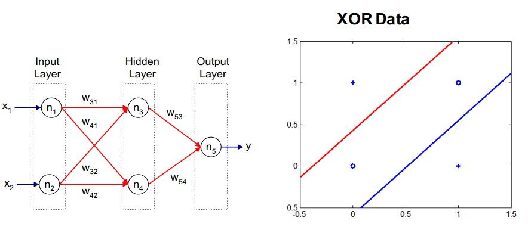

_MNN per classificazione di funzione XOR_

### Learning per ANN

L'obiettivo dell'allenamento di una rete neurale è quello di determinare un set di pesi che minimizzano la somma degli errori quadratici medi:

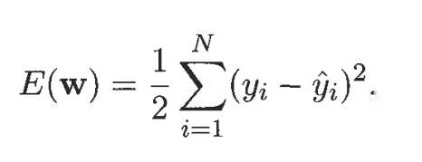

La somma degli errori dipende da `w` perché la classe predetta $\hat{y}$ è una funzione che dipende dai pesi assegnati ai nodi nascosti e quelli di output.

Poiché spesso l'output di un ANN è *non lineare* non si riesce a determinare una soluzione per `w` che sia garantita essere globalmente ottimale. Tuttavia sono stati sviluppati dei metodi per aggirare questo problema come il **Gradient Descent**.

La formula per determinare i pesi secondo il gradient descent è la seguente:


dove `lambda` rappresenta il learning rate. Il secondo termine è l'errore che va minimizzato (modifichi i pesi `w` per diminuirlo), tuttavia succede spesso che rimane intrappolato in un minimo locale (perché la error function non è lineare) senza riuscire a trovare il minimo globale. Questo metodo viene utilizzato per trovare i pesi dei nodi di output e di quelli hidden, ma per quest'ultimi risulta molto difficile calcolare il secondo termine dato che non si conoscono i valori di output. Questo problema si risolve tramite la **Back Propagation**: in questo metodo, ogni iterazione dell'algoritmo viene suddivisa in 2 fasi:

1. *Forward*: i pesi ottenuti dalle precedenti iterazioni sono utilizzate per calcolare i valori di output di ogni neurone
2. *Backward*: la formula per l'aggiornamento dei pesi viene applicata al contrario , questo ci permette di usare l'errore dei nodi al layer `k+1` per stimare l'errore dei nodi al layer `k`.

### Convolutional Neural Network

Poiché in alcuni problemi la posizione del pattern da individuare può variare all'interno dell'input è importante che i modelli siano *Shift Invariant*, ovvero che nel cambiamento della posizione dell'oggetto che si vuole analizzare non deve andare a degradare la capacità di classificarlo del classificatore. Di solito nei modelli standard questo non è possibile a meno che non si creino più modelli che prendono in input varie parti del campione da analizzare, i cui output verranno combinati per individuare il pattern. Tutti i modelli che formano questa mega rete devono essere identici.

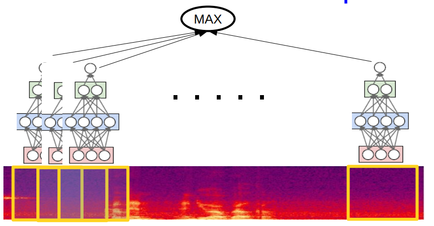

Il modo migliore per risolvere questo problema è di utilizzare le **Convolutional Neural Network**  (CNN) che introducono 2 nuovi tipi di layer che permettono di estrarre le feature latenti presenti nell'immagine (*Convolutional* e *DownSampling*):

- Il layer **Convolutivo**: è composto da un insieme di kernel/filter (matrici) che vengono fatte scorrere sull'immagine per generare una nuova matrice di output che mette in risalto determinate feature presenti nell'input. Questo layer è definito dai pesi (valori del filtro), bias e la dimensione dei passi che farà mentre si sposta lungo l'input (stride). Spesso la dimensione della matrice di output è minore di quella di input e dunque ci sarà una perdita di informazione, per questo a volte può essere importante aggiungere del padding (tanti 0) attorno all'input originale per mantenere gli output identici. 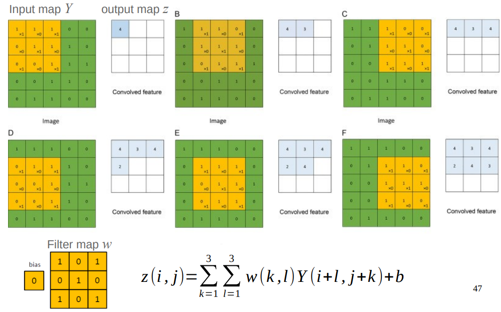 
- Il **Pooling** Layer: serve a sintetizzare l'applicazione del kernel in un numero che viene inserito in una matrice che ha dimensione pari alla dimensione dello stride. 

Combinando questi due layer con una fully connected network si può ottenere una rete convolutiva.

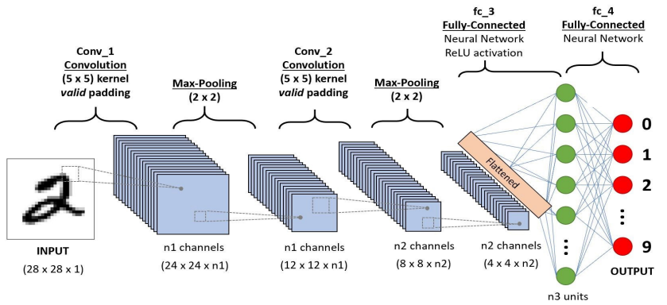

### Problemi di Design delle ANN

Quando si sviluppa una ANN bisogna tenere in considerazione questi problemi di design:

* Il numero di nodi di input deve essere determinato, solitamente bisogna creare un nodo di input per ogni variabile, tuttavia, per le variabili categoriche è accettabile codificarle in una variabile k-array avente `int_sup(log2(k))` nodi di input.

* Il numero di nodi di output deve essere prestabilito: per un problema a 2 classi basta un solo nodo di output, ma per un problema con k classi ne servono k

* Deve essere scelta una topologia per la rete poiché essa andrà ad influenzare la target function. Per scegliere la giusta topologia si può procedere in 2 modi:
  
  1. Creare una fully connected network e iterarci sopra per costruire una nuova rete ogni volta con un numero minore di nodi (si reitera la procedura di model-building e ha una complessità di tempo mooolto alta)
  2. Creare una fully connected network e togliergli nodi per poi ripetere il processo di valutazione della rete.

* Vanno inizializzati i pesi e i bias. E' comunemente accettata una inizializzazione randomica

* Gli esempi di training con valori mancanti dovrebbero essere sostituiti o rimossi

## Cluster Analysis

La Cluster Analysis divide i dati in vari gruppi (clusters) che sono sia Significativi che Utili. In base allo scopo finale della cluster analysis possiamo identificare 2 differenti tipi di analisi:

- **Understanding**: serve per dividere i dati in vari gruppi in base alle caratteristiche che accomunano i dati stessi (serve per identificare le possibili classi per la classificazione in modo automatico).
- **Utility**: approccio che fornisce un'astrazione dei dati individuali all'interno del cluster, generando un **cluster prototype**. Questi cluster prototypes possono essere utilizzati come basi per tecniche di data analysis e data processing.

È difficile definire come ogni cluster debba essere costituito poiché per certo dataset esistono molteplici modi  corretti di suddividere i dati in vari cluster (guarda foto sotto). L'unico modo per capire qual è la corretta suddivisione in cluster e' analizzando i dati.

_N.B il clustering può sembrare simile alla classificazione ma risulta essere privo di fase di training supervisionato._

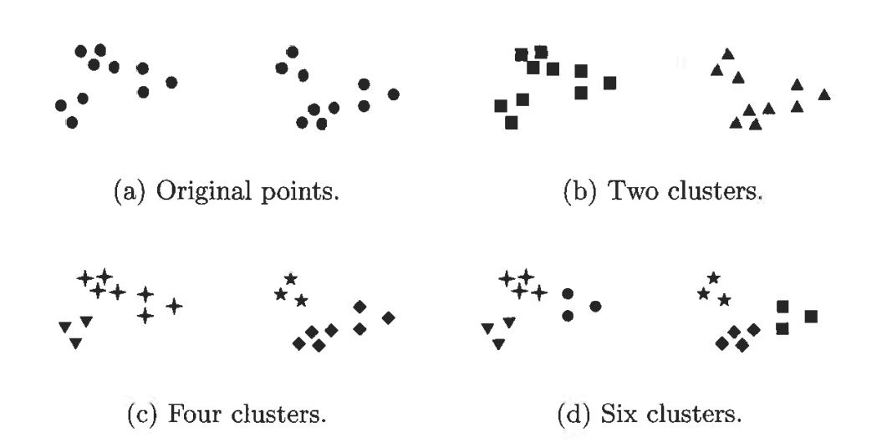

### Tipi di clustering

Il clustering è la collezione di un insieme di cluster. Possono essere suddivisi in base ad alcune caratteristiche che possono presentare:

#### Hierarchical vs Partitional

- _hierarchical_: suddivide i dati in cluster nestati che possono essere rappresentati con un albero in cui la radice rappresenta la totalità del dataset e, più si va in profondità, più aumenterà il numero di cluster e diminuirà il numero di record.
- *partitional*: i dati vengono suddivisi in maniera "standard", dunque non sono ammessi sotto cluster all'interno di ogni cluster. Ogni layer dell'albero di un Hierarchical Clustering può essere visto come un Partitional Clustering diverso.

#### Exclusive vs Overlapping vs Fuzzy

- *exclusive*: ogni data object può appartenere ad un solo cluster
- _overlapping_: ogni data object può appartenere a più cluster simultaneamente. Questo può essere utili per dati che possono essere identificati in più classi (uno studente universitario può anche essere un dipendente dell'università)
- _fuzzy_: ogni data object appartiene a tutti i cluster con un peso di appartenenza (membership) che varia tra `0` e `1` dove `0` rappresenta la NON appartenenza e `1` la totale appartenenza. Sostanzialmente crea una distribuzione di probabilità dell'appartenenza dei dati alle varie classi (è esclusivo, ogni dato può appartenere solo ad un cluster).

#### Complete vs Partial

- *complete*: assegna tutti i data object del data ad un cluster senza lasciarne nessuno fuori
- *partial*: esclude dai cluster alcuni elementi che non mostrano appartenenza a nessun cluster (possono essere punti di *rumore* o *outliers*)

### Tipi di Cluster

- *Well Separated*: sono dati ben divisi tra di loro (appiano naturalmente separati e non globulari). Ogni dato del cluster è più vicini ai punti del cluster a cui appartiene che ai punti di altri cluster.
- Prototype Based: si basa sul concetto di Prototype (la generalizzazione del Cluster), ogni data object è più vicino al Prototype del cluster di appartenenza che del Prototype di altri cluster. Per attributi continui, il prototype del cluster è il **Centroid** (la media); per attributi categorici è il **Medoid** (il punto più rappresentativo). Viene anche chiamato **Center Based**.
- Graph Based: i dati sono raggruppati in base alle connessioni che hanno sul grafo che li rappresenta. Un cluster è un insieme di punti connessi tra di loro che non sono connessi con altri elementi. È suscettibile al rumore in quanto un punto può creare ponti tra cluster differenti ed unirli.
- Density Based: guarda la densità dei punti. Un cluster è un insieme denso di punti circondato da un insieme con scarsa densità. È più resistente al rumore del Graph Based.
- Shared Property: un cluster è formato da data object che hanno alcune caratteristiche in comune

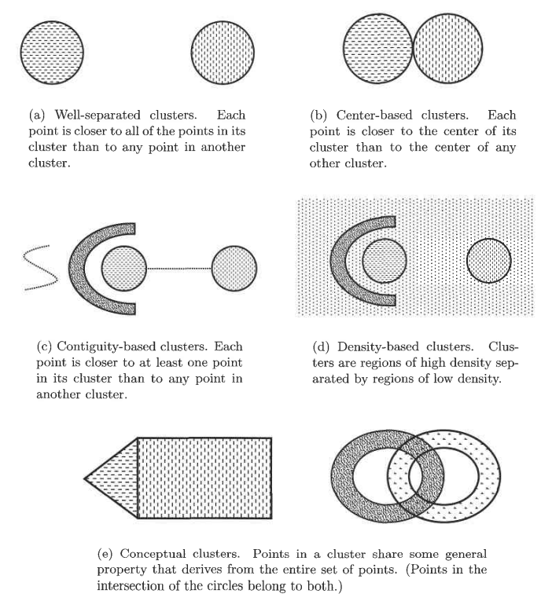

### Clustering Algorithms

#### K-means

Questo algoritmo è una tecnica di **Partitional Clustering** basata su **Prototype-Based Cluster**. Funziona cercando di trovare, dato un numero di Centroidi definito dall'utente `K`, i punti che sono più vicini ad ogni centroide e che andranno quindi ad identificare un cluster (simile al knn).

Ci sono due variazioni di questo algoritmo, a seconda del tipo di dato con cui lavoriamo:

- K-means per dati continui
- K-medoid per dati categorici

##### Algoritmo

1. Si selezionano `K` punti come Centroidi (punti a caso nel dataset)
2. Si assegna ogni punto del dataset al suo centroide più vicino e si ricalcolano i centroidi dei nuovi cluster così generati
3. Si continua fin quando i centroidi non cambiano più

Spesso la condizione `3.` genera dei punti che oscillano tra cluster differenti impedendo che l'algoritmo converga in una soluzione, dunque è possibile rilassare questa condizione rimpiazzandola con la seguente:

```
si continua fino a quando solo l'1% dei punti cambia cluster
```

A seconda del tipo di spazio di dati con cui si lavora possono essere utilizzate varie misure di prossimità per calcolare la distanza punti-centroidi. Alcuni esempi sono:

- **Euclidea (L2)** o **Manhattan (L1)** per gli spazi Euclidei
- **Cosine Similarity** o la **Jaccard Measure** per i documenti

Per scegliere i Centroidi migliori ottenuti con varie esecuzioni del K-means è necessario scegliere un objective function adeguata. Per farlo è necessario calcolare la qualità del Clustering utilizzando la Somma dell'Errore Quadratico (SSE). Guardando questo indice, dati due cluster ottenuti con K-means, quello che avrà SSE minore sarà il migliore. Per calcolare l'SSE con la distanza Euclidea si usa la seguente formula:

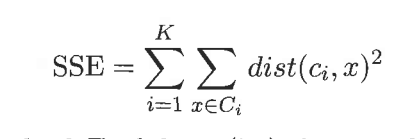

La formula che segue è come vengono aggiornati i centroidi all'i-esima iterazione


Con vari calcoli, utilizzando la distanza euclide, si può dimostrare che il centroide migliore è la media.

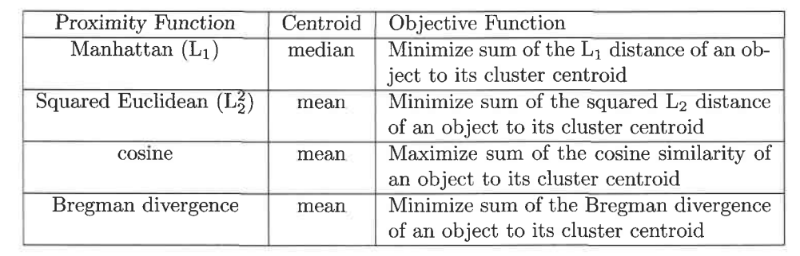

Inizializzare in modo Random i Centroidi può degradare la qualità dei Cluster creati dato che non è garantita la convergenza ad un minimo globale. Un approccio naive per risolvere questo problema potrebbe essere quello eseguire più volte il K-means scegliendo ogni volta Centroidi di partenza diversi ed infine scegliendo il Clustering con SSE minore. Risulta essere molto costoso e non garantisce il ritrovamento di una soluzione. Un altro metodo è di creare dei Cluster di tipo Hierarchical campionando dei punti dal dataset ed utilizzarli per calcolare i Centroidi che verranno poi utilizzati come centroidi iniziali. Questo approccio è utilizzabile solo se i campioni sono piccoli (Hierarchical Clustering è costoso) e `K` deve essere piccolo rispetto alla dimensione dei campioni.

##### Costo

- Spazio: $O((m+K)n)$ dove $m$ è il numero di data point, $n$ è il numero di attributi
- Tempo: $O(I \cdot K \cdot m \cdot n)$ dove $I$ è il numero di iterazioni richieste per la convergenza

`I` può essere limitata superiormente dato che tendenzialmente i cambiamenti più significativi avvengono nelle prime iterazioni. L'algoritmo risulta efficiente e semplice a patto che `K` sia significativamente minore di `m`.

##### Bisecting K-Means

Il funzionamento è il seguente:

1. Considera tutti i dati come un unico mega cluster
2. Applica 2-means (k-means con 2 centroidi) per ottenere 2 sotto cluster
3. Scegli il sotto cluster da suddividere basandosi su criteri come numero di elementi (splitti quello più grosso) o SSE (splitti quello con SSE maggiore)
4. Ripetere step 2. e 3. fino al numero desiderato di cluster

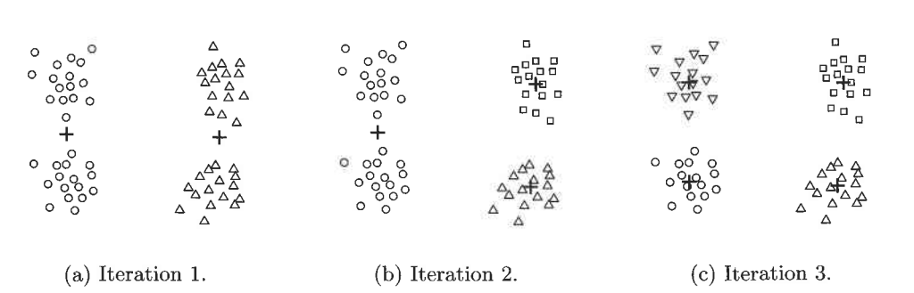

##### Applicabilità

K-means si applica a cluster globulari, ben separabili e con dimensioni e densità simili. Per K abbastanza grande può essere applicato a cluster naturali ed è in grado di trovare sotto cluster puri. È molto suscettibile agli outliers e la loro detection e rimozione può essere molto utile.

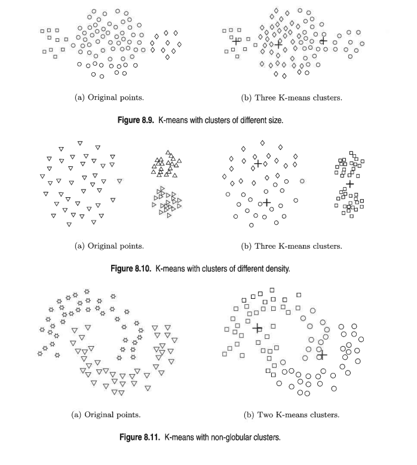

#### Agglomerative Hierarchical

Queste tecniche sono utilizzate per generare cluster di tipo Hierarchical e ne esistono 2 diversi tipi:

- **Agglomerative**: all'inizio ogni punto è un cluster e procedendo con l'algoritmo, punti vicini vengono fusi insieme fino ad ottenere un unico mega cluster. È necessario definire il concetto di 'prossimità'.
- **Divisive**: inizia con un cluster contenente tutti i punti che mano a mano viene diviso, fino ad ottenere cluster singleton. Serve una tecnica per decidere chi e come splittare.

È possibile rappresentare Clustering di questo tipo con un diagramma simile ad un albero chiamato _Dendrogramma_.


##### Basic algorithm

1. Calcola la proximity matrix (se necessario)
2. Unisci i due cluster più vicini
3. Aggiorna la proximity matrix
4. Ripeti i punti 2. e 3. fin quando non rimane un solo cluster

Ciò che caratterizza questi algoritmi di Clustering è il metodo con cui viene definita la _prossimità_. I due approcci principali sono:

- Graph Based: Si basa su un'astrazione del cluster che viene visto come un Grafo. Per questa tecnica si hanno varie implementazioni:
  
  - **MIN**: calcola la prossimità in funzione della distanza tra i punti più VICINI di cluster differenti (aka single link). Questa tecnica è buona per gestire cluster dalla forma non-ellittica, ma molto sensibile a rumore e punti di outlier.
  - **MAX**: calcola la prossimità in funzione della distanza tra i punti più LONTANI di cluster differenti (aka complete link). Risulta più resistente al rumore ed agli outliers ma può spezzare cluster grandi favorendo forme globulari.
  - **GROUP AVERAGE**: calcola la media delle distanze tra tutti i punti di due cluster differenti. Questo approccio è un compromesso tra il MIN e il MAX. È meno suscettibile al rumore ma predilige forme globulari.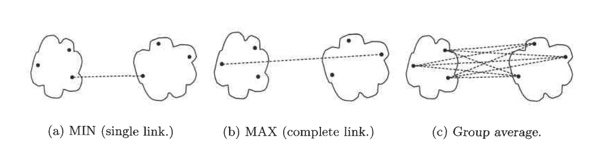

- Prototype Based: basa il calcolo della prossimità sui centroidi (che rappresentano il cluster).
  
  - **Centroid Method**: basa il calcolo della prossimità sulla distanza tra i centroidi di differenti cluster (forse deve essere minima). Questo metodo presenta un problema che non è presente in nessun altro metodo Hierarchical: l'**inversione**, in cui due cluster che vengono fusi possono essere più simili di un paio di cluster fusi in precedenza.
  - **Ward's Method**: aggiunge al calcolo, oltre all'uso dei centroidi, il concetto di SSE che deve risultare minia quando vengono fusi due cluster. Questa tecnica è meno suscettibile al rumore, ma favoreggia cluster di forma globulare. Utilizza la stessa objective function del K-means ('è l'equivalente gerarchico del K-means').

##### Complessità

La complessità in spazio è: $O(m^2)$.

La complessità in tempo è: $O(m^3)$.

Va notato che questa può essere ridotta se si utilizzano liste ordinate o heap per tenere traccia dei dati. Questo riduce la complessità in tempo a: $O(m^2 \ log(m))$.

Questi costi molto elevati rendono la scalabilità di questi tipi di clustering molto difficile.

##### Forza e Punti Deboli

1. **Mancanza di una objective function globale**: le tecniche appena viste decidono localmente il processo di ottimizzazione. Questo è uno svantaggio perché non ci sarà un processo di ottimizzazione globale, però semplifica anche la rivoluzione del problema. Per via della sua complessità in spazio e in tempo molti dataset non sono risolvibili. Questo problema dell'ottimizzazione deriva dal fatto che una volta effettuata l'operazione di merge essa non potrà essere annullata. Una possibile soluzione a questo problema di non reversibilità è quello di provare a spostare i rami dell'albero generato per provare a migliorare la global objective function; un altro metodo ancora è quello di utilizzare un algoritmo come K-means per generare molti piccoli cluster che verranno utilizzati come punto di partenza dall'algoritmo di hierarchal clustering.
2. Sono suscettibili al rumore
3. Presentando difficoltà nel gestire cluster di diverse dimensioni e di forma non globulare
4. Dividono cluster grandi in cluster più piccoli

#### DBScan

DBScan è un algoritmo di Clustering che si basa sul concetto di densità: per uno specifico punto è la quantità di punti vicini ad esso compresi in un dato raggio (definito dall'utente) _EPS_ (questo include anche il punto stesso !). Questo metodo è abbastanza semplice da implementare ma la scelta del raggio risulta critica, per un EPS abbastanza grande possiamo avere, come densità di un punto, `m` (il numero dei punti nel nostro dataset) e per un raggio sufficientemente piccolo riusciamo a trovare come densità 1. L'algoritmo DBScan cerca di trovare un modo per la scelta di un EPS adeguato.

In base al punto in cui si trovano, i data point di un Clustering di tipo Center-Based possono essere classificati nel seguente modo:

- **Core Point**: punti interni ad un density based cluster sono quei punti che ricadono all'interno di un raggio specifico (_EPS_) e superano una certa condizione _MinPts_. Sia EPS che MinPTS sono scelti dall'utente.
- **Border Point**: sono quei punti che non sono Core Point, ma che ricadono all'interno di un vicinato di un Core Point. Un Border Point può appartenere a diversi vicinati di Core Point diversi
- **Noise Point**: sono quei punti che non sono nè Core Point nè Border Point.

Nella figura sottostante possiamo vedere che, dato un EPS e MinPts <= 7, il Punto `A` risulta essere un Core Point (ha 7 punti nel suo vicinato e quindi supera la condizione di MinPts); il punto `B` non soddisfa la condizione MinPts ma ricade all'interno di un vicinato (quello del punto A) quindi è un Border Point; `C` non è nè un core point nè un border point quindi è un Noise Point.


##### Algoritmo

1. Etichetta tutti i punti come **Core**, **Border** o **Noise**
2. Elimina i Noise Point
3. Raggruppa tutti i Core Point che sono all'interno di un raggio _EPS_ gli uni degli altri
4. Crea un cluster con ogni gruppo di Core Point creato allo step 3.
5. Assegna ogni border point ad uno dei suoi core point associati 

Il problema principale di questo algoritmo è quello di selezionare un valore appropriato per _EPS_ e _MinPts_. L'approccio base per trovarli è quello di guardare come varia la distanza tra i punti ed i loro k-esimi vicini più vicini (k-dist). Per punti che appartengono ad un cluster, k-dist sarà piccola (alta densità); mentre per Noise Point sarà grande (bassa densità). È dunque possibile stimare i parametri calcolando la k-dist per ogni punto del dataset, ordinarli in ordine crescente e vedere il punto in cui c'è la variazione più netta (il momento di transizione tra elementi appartenenti ad un cluster e rumore). Questo valore verrà utilizzato com EPS ed il valore k (utilizzato nella k-dist) verrà assegnato a MinPts. Il valore EPS dipende dalla scelta di `k`, ma generalmente non cambia poi così tanto al variare di k. Se `k` viene scelto troppo piccolo, allora anche alcuni Noise Point verranno inseriti nei cluster; invece con `k` troppo grande, cluster di piccole dimensioni verranno etichettati come rumore. DBScan originale utilizza `k = 4` dato che funziona generalmente bene per la maggior parte dei dataset di 2 dimensioni.

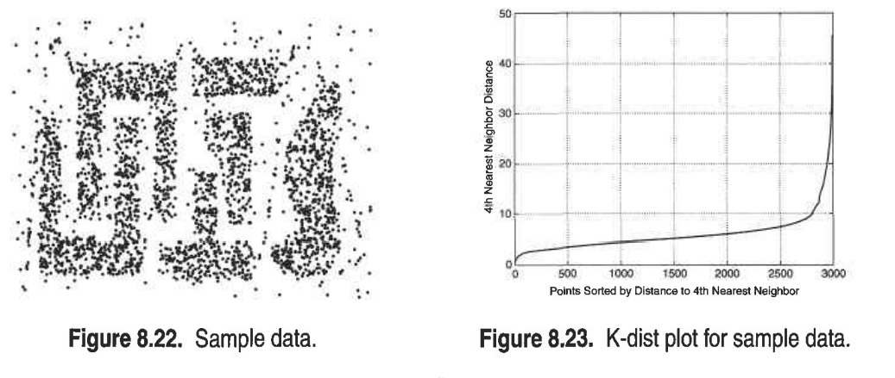

##### Complessità in Spazio e Tempo

La complessità in spazio di questo algoritmo è $O(m)$ in quanto deve salvare in memoria solo poche informazioni (l'etichetta di ogni punto: Core, Noise, Border ed il cluster label).

La complessità in tempo è, nel caso peggiore $O(m^2)$, ma tramite l'utilizzo di strutture dati come i kd-tree (solo nel caso di dataset con spazio a bassa dimensione), riesce a scendere fino a $O(m \ log(m))$.

##### Vantaggi e Svantaggi

- Può trovare cluster con forme che non potrebbero essere trovate da nessun altro algoritmo
- Se la densità dei punti del dataset sono estremamente variabili non è garantito il ritrovamento di una soluzione corretta
- È resistente al rumore
- Poco applicabile quando si lavora con alte dimensionalità
- Se non è possibile calcolare i vicini più vicini utilizzando strutture dati particolari, l'algoritmo può risultare costoso (generalmente succede in dataset ad alte dimensioni)


### Cluster Evaluation

A volte può essere utile valutare i risultati forniti da un algoritmo di Clustering allo stesso modo in cui viene valutato un modello di classificazione. Spesso non è necessario e non è facile da applicare dato che ci sono vari algoritmi con funzionamenti diversi e per ogni caso servirebbero metodi e metriche diverse. Gli algoritmi di clustering trovano sempre cluster anche se effettivamente non esistono cluster naturali nei dati, quindi risulta utile controllare se quei cluster sono sensati (in dati con alte dimensioni non è facile individuare visivamente questa problematica).

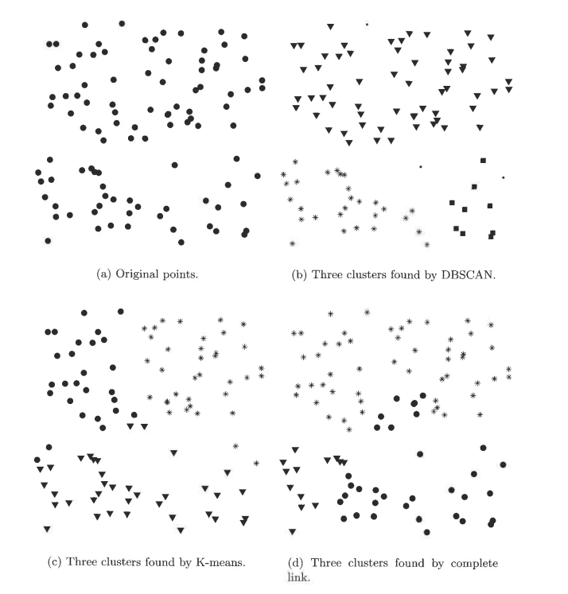

Gli indici di valutazione utilizzati per valutare vari aspetti dei cluster sono suddivise nelle seguenti categorie:

- **Unsupervised**: misura varia aspetti della struttura del cluster senza basarsi su dati esterni (un esempio è SSE), spesso sono chiamati **Internal Indices**. Ne esistono 2 sotto categorie:
  - _Cluster Cohesion_: determina quanto gli oggetti del cluster sono correlati tra di loro
  - _Cluster Separation_: determina quanto, cluster differenti, sono separati o ben distinti l'uno dall'altro
- **Supervised**: misura quanto le strutture generate da un algoritmo di clustering, corrispondono ad una qualche struttura esterna (un esempio è l'Entropia). Spesso queste misure sono chiamate **External Indices**.
- **Relative**: misura che serve per confrontare diversi clustering o cluster tra di loro. Può essere sia Supervised che Unsupervised. Un esempio può essere l'SSE per l'unsupervised e l'entropy per la supervised.

#### Unsupervised Cohesion and Separation

La validità di un cluster per un insieme di K cluster, in generale può essere espressa come la somma pesata della validità dei singoli cluster:

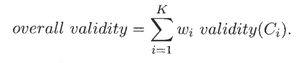

La funzione `validity` può essere sia Coesione, Separazione o una combinazione delle due. I pesi `w` dipendono da caratteristiche del cluster: potrebbero essere tutti 1, la radice quadrata della coesione, la dimensione del cluster, ecc.
Se, per la validity function si sceglie la coesione, valori grandi sono meglio; se viene scelta la separazione, valori più piccoli sono meglio.

##### Graph Based

Per i graph based cluster, la Coesione e la Separazione vengono espressi nel seguente modo:

- Cohesion: è la somma dei pesi dei cammini nel proximity graph che connette punti nello stesso cluster 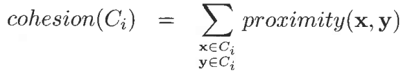
- Separation: è la somma dei pesi dei cammini dai punti di un cluster ai punti di un altro cluster. 

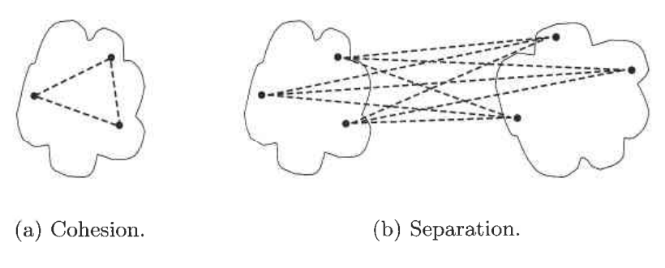

##### Prototype Based

Per i cluster prototype based la coesione e la separazione  si esprimono nel seguente modo:

- Cohesion: è definita come la somma delle prossimità tra il prototipo di un cluster (centroide/medoide) ed i suoi punti. 
- Separation: è data dalla misura della prossimità di prototipi di due cluster differenti. 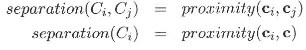


##### Overall

Questi due indici possono essere misurati in vari modi in base a come viene calcolato il peso. Questi sono alcuni esempi:

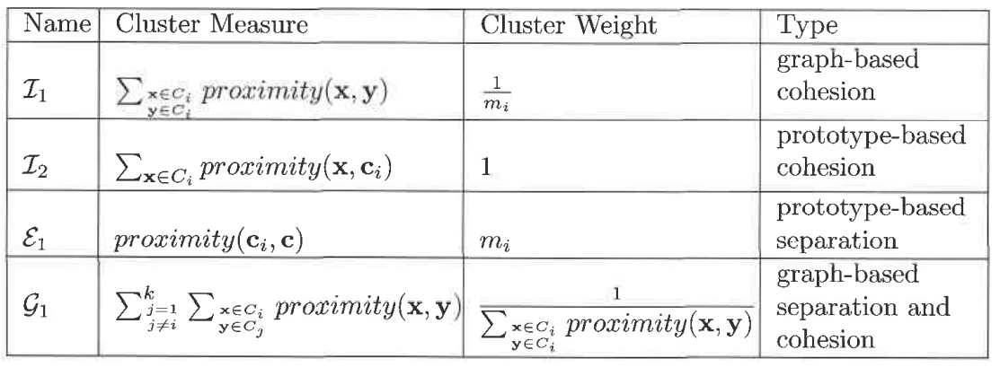

##### Relazione tra Coesione e Separation

La Coesione e la Separazione sono, in alcuni casi, fortemente correlate tra di loro, infatti è possibile dimostrare (noi non lo faremo) che la somma tra SSE Totale e SSB Totale è costante, ergo massimizzare l'SSB (separazione) equivale a minimizzare l'SSE (Coesione).

##### Silhouette Coefficient

Metodo per la valutazione di un singolo Cluster che combina i concetti di Coesione e Separazione. Si calcola come segue:

1. Per l'i-esimo oggetto (punto) se ne calcola la distanza media tra tutti gli altri oggetti dello stesso cluster a cui appartiene. Il risultato di questo step viene chiamato $a_i$
2. Per l'i-esimo oggetto e per ogni cluster non contenente l'oggetto calcolare la distanza media tra tutti gli oggetti in uno dei questi cluster (quelli che non contengono l'oggetto). Dopodiché si prende il valore minore tra queste distanze che chiameremo $b_i$.
3. Per l'i-esimo oggetto il Silhouette Coefficient è $s_i = \frac{b_i - a_i}{ max(a_i, b_i)}$


$s_i$ può variare tra $-1$ e $1$. Il valore $1$ è il migliore (si ottiene solo quando $a_i = 0$) mentre $-1$ è un valore brutto perché, in questo caso, la distanza $a_i$ risulta più grade di $b_i$, vuol dire che il punto analizzato apparterrebbe più ad un cluster che non lo contiene piuttosto che a quello che lo contiene.

Questo coefficiente può essere utilizzato per misurare la bontà di un clustering calcolandolo su tutti i punti e poi facendo una media.

##### Unsupervised Similarity Matrix

Per giudicare la bontà di un clustering possiamo anche utilizzare un approccio grafico che si basa sulle matrici. È possibile farlo misurando la correlazione tra la similarity matrix e una similarity matrix ideale calcolata basandosi sui label del dataset, se queste due matrici si assomigliano possiamo dire che il clustering è buono. È possibile esprimere un giudizio sulla bontà di un clustering anche ad occhio nudo osservando la similarity matrix: una matrice ``n x n`` dove `n` è il numero di punti del dataset, la i-esima cella conterrà il valore della similarità (varia tra 0 e 1) tra i due punti che la identificano. Le righe e colonne di questa matrice verranno poi ordinate in modo tale da avere punti appartenenti allo stesso cluster tutti vicini. Nella matrice ideale, tutti i punti che appartengono allo stesso cluster avranno 1, mentre gli altri 0 e si formeranno blocchi ben definiti sulla diagonale che rappresenteranno i cluster trovati.


_Esempio di buona similarity matrix_

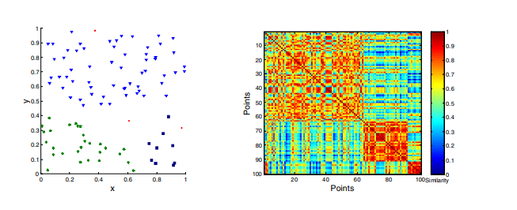
_Esempio di similarity matrix su dati random (no real clusters)_

##### Giusto numero di cluster

Per decidere qual è il giusto numero di cluster in cui dividere un dataset, bisogna analizzare le curve formate dagli indici di SSE o di Silhouette Coefficient:

- per SSE si guarda dove viene creato un 'gomito'
- per Silhouette si guarda dove compare un picco

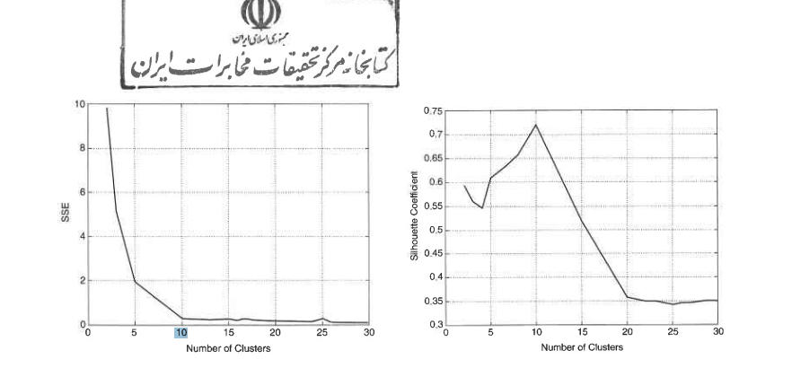

#### Supervised Measures

Quando si analizzano cluster con approccio supervised possiamo identificare due tecniche differenti: 

- classification based: si basa su metodi per valutare i classificatori già visti in precedenza (Entropy, Precision, Purity, Recall, F-measure)
- similarity based

Lo scopo di questo tipo di approccio è quello di vedere quanto una tecnica automatica può produrre risultati comparabili ad un'analisi manuale.

#### Assessing the Significance of Cluster Validity Measures

Spesso, una volta ottenuto un valore dall'indice di misura utilizzato per valutare un cluster/clustering sarà necessario anche fornirne un'interpretazione. Per alcuni indici, come Purity o Entropy, si può utilizzare la definizione della misura per capire se il risultato ottenuto è buono o meno (`Entropy = 0` molto cattivo). Per tutte le altre si può utilizzare un approccio statistico: 

1. si calcola una distribuzione della misura di nostro interesse basandosi sui dati
2. si calcola l'effettivo valore per i cluster ottenuti
3. si valuta quanto è probabile che la misura ottenuta sia un risultato puramente casuale. Se questa probabilità è bassa, allora la misura è buona.

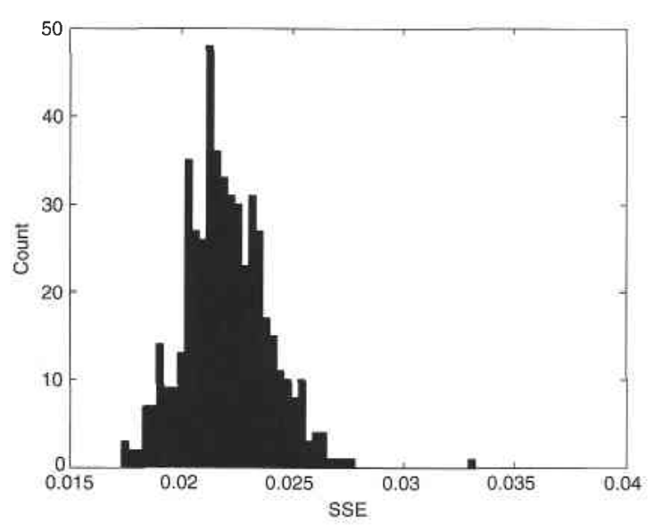

La precedente immagine è ottenuta campionando un dataset con cui è stato generato un cluster 3-mean. Mostra la distribuzione random dell'SSE dati 500 campioni. Per interpretare se l'SSE del cluster originale è buono o no, si guarda se il valore che assume cade o no all'interno dell'istogramma: se ci cade dentro è probabile che sia frutto di casualità (non va bene), se non ci cade allora è abbastanza probabile che sia effettivamente un buon indice.

## Anomaly Detection

Spesso in un dataset sono presenti dati anomali che però possono avere un'importanza significativa, sono chiamati _outliers_. Può essere di interesse la loro individuazione e la branca che studia come individuarle è chiamata Anomaly Detection. Storicamente è stata studiata per rimuovere dati anomali che potevano interferire con l'allenamento di un dato modello, esecuzione di algoritmi di clustering, ecc. Spesso questa è parte del preprocessing.

Alcuni esempi di applicazione dell'anomaly detection sono:

- Fraud Detection
- Intrusion Detection
- Ecosystem Disturbances
- Public Health
- Medicine 🧑‍🦼

### Cause delle Anomalie

Un outlier (anomalia) è definito come segue (Definizione di Douglas Howking (Hawkins) Mortimer Giunior II(2)): un outlier è un osservazione che differisce talmente tanto dalle altre osservazioni che fa sorgere il sospetto (sus) che sia stata generata da un meccanismo differente.

Le anomalie possono essere generate da differenti cause. Di seguito illustreremo le principali:

- **Data from different classes**: un oggetto può essere diverso dagli altri oggetti, e quindi anomalo, poiché appartiene ad una classe di diverso tipo. Un esempio è una persona che usa la carta di credito in modo fraudolento, apparterrà ad una classe differente rispetto ad una che ne fa un uso normale. Questa classe di anomalie è il focus dell'anomaly detection nel data mining.
- **Natural Variation**: spesso i dataset assumono distribuzioni che si possono ricondurre a distribuzioni statistiche ben conosciute (come la normale) e in queste distribuzioni la maggior parte die dati è concentrata intorno alla media, dunque dati anomali saranno quelli che una o più attributi assumono valori che si discostano, anche di molto, dalla media (dal centro). Un esempio è l'altezza in cui una persona molto alta farà sempre parte della stessa classe delle altre, ma avrà il valore dell'altezza che varia di molto rispetto alla media generale.
- **Data Measurement and Collection Errors**: Spesso quando vengono raccolti i dati si possono generare errori causati o dallo strumento con cui si raccolgono o dall'errore umano. Si andranno dunque a generare delle anomalie che non sono desiderabili, dato che vanno a peggiorare la qualità del dataset. Dunque queste anomalie vanno eliminate e sono il focus del preprocessing e nello specifico del _data cleaning_.

### Differenti Approcci

Una distinzione ad alto livello tra gli approcci per la anomaly detection può essere la seguente:

- **Model Based**: prima viene generato un modello partendo dai dati e vengono considerati anomali tutti i dati che non vengono riconosciuti dal modello (do not fit the model). Un esempio può essere la distribuzione creata stimando statisticamente i parametri. Questa tecnica può essere fatta sia con modelli di classificazione che regressione. Per la regressione un oggetto è un'anomalia se il suo valore è molto lontano da quello predetto. Per la classificazione si possono considerare 2 classi, una per i dati anomali ed una per quelli normali e procedere con la classificazione (servono sempre le label perché senno non possiamo creare un modello).
- **Proximity Based**: vengono considerati anomali gli oggetti che distano maggiormente dalla maggioranza degli altri oggetti. Questo tipo di tecnica permette una visualizzazione grafica semplice delle anomalie (quando i dati sono 2 o 3 dimensionali) utilizzano degli scatter plot e individuando i punti maggiormente separati dagli altri.
- **Density Based**: oggetti che si trovano in regioni a bassa densità sono relativamente distanti dai loro vicini e dunque possono essere considerati anomali. Un'accortezza in più è quella di classificare come outlier i punti solo se hanno densità locale significativamente minore della maggior parte dei propri vicini (questo approccio evita di classificare erroneamente aree di minor densità del dataset che però presentano valori validi).

Questi approcci, in base alla conoscenza che si ha dei dati, possiamo dividerli in 3 categorie:

- **Supervised**: si ha un dataset con oggetti normali e outlier che hanno entrambi label che li identificano. Sarà dunque possibile allenare un modello in gradi di identificare le anomalie.
- **Unsupervised**: non c'è disponibilità di class label e dunque l'obbiettivo sarà quello di assegnare un punteggio ad ogni valore che andrà a riflettere quanto esso viene considerato anomalo. Tuttavia se le anomalie sono simili tra di loro, andranno a fare abbassare questo valore e dunque a farle riconoscere come oggetti normali.
- **Semisupervised**: i label sono presenti solo per gli oggetti normali, dunque l'obiettivo sarà analogo all'unsupervised però si avrà una maggiore resistenza alle anomalie simili.

#### Approccio Statistico

Un esempio di _model based_ approach è lo Statistical Approach. Tale approccio crea un modello statistico stimandone i parametri dal dataset di partenza e gli outlier vengono identificati in base alla loro probabilità dato il modello scelto.

**Definizione probabilistica di outlier**: un outlier è un oggetto che ha una bassa probabilità rispetto alla probability distribution utilizzata per modellare i dati.

##### Problematiche

- _Identificazione della giusta distribuzione_: spesso non è facile identificare la distribuzione che meglio rappresenta i dati e questo può portare a delle classificazioni errate.
- _Numero di attributi usato_: le anomalie si possono presentare su uno o più degli attributi dei dati di interesse, dunque se un dato attributo non è anomalo non significa che quel dato non lo sia. È importante scegliere il giusto numero di attributi da analizzare a seconda dei dati che si hanno.
- _Mischiaticcio di distribuzioni_: i dati possono essere modellati da una misticanza di distribuzioni, benché più potente risulta essere più complicata sia da individuare che da utilizzare.

##### Distribuzione Normale Univariata

_Dati univariati = dati osservati in un solo attributo._

Una delle distribuzioni più versatili è quella Normale che è in funzioni dei parametri $\mu$ e $\sigma$ ($N(\mu, \sigma)$). Questa può essere utilizzata per lo scopo di anomaly detection nel seguente modo:

**Definizione di outlier per un singolo attributo N(0,1)**: un oggetto con attribute value `x` dalla distribuzione gaussiana `N(0,1)` è un outlier se `|x| >= c`, dove `c` è una costante scelta in maniera tale che `prob(|x|) >= c = a`.

`a` è una costante che va scelta per far funzionare la definizione rappresenta il grado di rarità dell'oggetto `x` (quanto è improbabile che appartenga alla distribuzione). Molto probabilmente non avremmo mai una distribuzione `N(0,1)` e dunque dovremmo trovare un modo per trasformare l'attributo `x` in un nuovo attributo `z` che abbia la distribuzione `N(0,1)`. Per farlo dobbiamo stimare i parametri $\mu$ e $\sigma$ tramite l'utilizzo della media campionaria e la deviazione standard campionaria. Questo approccio funziona bene quando abbiamo molti dati. Molto spesso però la distribuzione stimata non è proprio `N(0,1)` e  per risolver questo problema c'è il metodo di Grubb.

##### Distribuzione Normale Multivariata

Possiamo vedere il nostro dataset come mix di distribuzioni di probabilità:

- M che è quella dei punti normali
- A che è quella degli outliers

Queste distribuzioni vanno scelte e di solito per gli outlier si utilizza una distribuzione normale. 

Un metodo basato su questo concetto e quello della Verosimiglianza (likelihood), quanto una distribuzione riesce ad approssimare un dataset, per effettuare Anomaly Detection è il seguente:

1. Assumere che tutti i punti appartengono a M e A è vuoto
2. Calcolare la verosimiglianza del dataset alla distribuzione scelta
3. Provare a spostare un punto da M ad A e vedere se la verosimiglianza aumenta: se lo fa quel punto viene messo permanentemente in A (quindi un outlier)
4. Ripeter per tutti i punti del dataset

##### Pro e Contro

- Si basano sulla teoria di base della statistica (buono perché sai che questa teoria funziona)
- Quando c'è abbastanza conoscenza dei dati e dei tipi di test da applicare, ha un'alta efficienza
- Ci sono un'ampia varietà di test per attributi singoli, meno per opzioni per quelli multivariati
- Scarse performance per dati multidimensionali

#### Approccio Proximity Based

È un approccio più facile ed intuitivo di quello statistico dato che è molto più facile determinare una misura di prossimità significativa rispetto al determinare una distribuzione statistica di un dato dataset. Il metodo più semplice per valutare la distanza è quello di k-nearest neighbor, in cui ad ogni punto viene assegnato un valore che riflette quanto esso sia un outlier oppure no. Questo valore è 0 per punti normali e infinito per punti che sono sicuramente outlier.

**Definizione di outlier**: l'outlier score di un oggetto è dato dalla distanza dal suo knn.

È importante scegliere correttamente il numero `k` poiché se si sceglie `k` grande quasi quanto la dimensione del dataset allora tutti i valori di quel dataset verranno considerati outlier, mentre se è troppo piccolo alcuni outlier verranno considerati normali. Per ridurre il problema della scelta di k è possibile utilizzare al posto della distanza dal suo knn la media tra le distanze dei primi knn.

##### Pro e Contro

- Semplice
- Costoso e poco applicabile per dataset grandi ($O(m^2)$ in tempo)
- Sensibile alla scelta dei parametri
- Non è in grado di gestire dataset con regioni a densità variabili (utilizza threshold globali che non tengono conto di variazioni di densità)


In questo esempio possiamo vedere come scegliendo `k` troppo grande i pochi punti in alto a destra che formano un cluster naturale vengono visti come outlier.

#### Approccio Density Based

Gli outlier per un approccio density based sono definiti nel seguente modo: l'outlier score di un oggetto è l'inverso della densità di quell'oggetto, dunque questo approccio basa il suo funzionamento sulla densità di una data area intorno ad un punto. È facilmente intuibile che è strettamente correlato all'approccio Proximity Based poiché la densità è un concetto che deriva dalla prossimità.

La densità è definita dalla seguente formula:  dove `N(x,k)` è un insieme che contiene i k vicini più vicini di x; `|N(x,k)|` è la dimensione dell'insieme; `y` è il vicino più vicino.

Un altra definizione di densità può essere la seguente: la densità attorno ad un oggetto equivale al numero di oggetti che si trovano all'interno di una distanza specificata `d` dall'oggetto (come il knn). Il parametro `d` deve essere scelto con cura perché valori troppo grandi falliranno nell''identificare gli outlier e valori troppo piccoli identificheranno punti normali come outliers.

La stessa problematica del proximity based si presenta anche in questo approccio, non è in grado di gestire dataset con aree di densità variabile. Ci sta un metodo per aggirare il problema: invece di considerare la densità assoluta si considera solo la densità relativa di un dato punto che può essere trovata con la seguente formula: . Un algoritmo che usa questo approccio prende il nome di Local Outlier Factor (**LOF**) di cui vedremo una versione semplificata:

1. Si itera per ogni `x` appartenente al dataset e si determinano i suoi k vicini più vicini
2. Si calcola il valore `density(x,k)` per ogni `x` utilizzando i suoi `k` vicini più vicini (punto 1.)
3. Per ogni `x` assegna un outlier score utilizzando l'equazione sopra riportata (average relative density)


##### Pro e Contro

- Se ci si basa sulla relative density si possono gestire anche aree di densità variabile
- Complessità in tempo elevata: $O(m^2)$. Può essere ridotta a $O(m \ log(m))$ per dati a basse dimensioni utilizzano strutture dati speciali
- La scelta dei parametri è difficili

#### Approccio Clustering Based

Poiché gli algoritmi di clustering trovano quanto un dato insieme di punti è correlato con altri punti viene intuitivo capire che questi algoritmi possono essere anche utilizzati per determinare l'inverso: quanto un punto si discosta notevolmente dagli altri. Un approccio per effettuare anomaly detection con clustering è quello di scartare piccoli cluster che sono lontani dagli altri cluster. Per questo approccio è necessario stimare dei threshold minimi per la dimensione del cluster e la distanza. Un approccio più sistematico è quello di determinare quanto ogni punto appartiene ad un dato cluster (per prototype based la distanza dai centroidi, oppure quanto un punto peggiora la objective function).

**Definizione di cluster based outlier**: un oggetto è un cluster based outlier se essono non appartiene fortemente a nessun cluster.

##### Determinazione di quanto un oggetto appartiene ad un cluster

Come detto in precedenza, per determinare un outlier score si possono applicare vari metodi. Per prototype based è possibile calcolare la distanza da il prototype e il oggetto, tuttavia questo metodo non funziona bene per cluster con densità variabili e quindi in questi casi l'outlier score può essere determinato con la distanza relativa tra il prototype e tutti gli altri oggetti. Se i cluster possono essere modellati in termini di distribuzioni gaussiane utilizziamo la distanza di Mahalanobis 🌴 ( aka Bionicle Divinità).

Per tecniche di clustering che hanno un objective function possiamo assegnare come outlier score dell'oggetto il miglioramento che si avrà nell'objective function se quell'oggetto viene eliminato. Questo può essere molto costoso.

##### Impact of Outlier on the Initial Cluster

Ci si può porre la domanda "il clustering è valido dopo aver determinato i suoi outlier?" dato che gli outlier vanno ad influenzare l'algoritmo di clustering. Per gestire questa problematica si può rigenerare il clustering una volta rimossi gli outlier anche se questo non garantisce il miglioramento dei risultati. Un approccio piu sofisticato è quello di generare un gruppo di potenziali outlier che verrà popolato dai punti che non sono fortemente connessi agli altri mentre si effettua il clustering così da poter essere eliminati direttamente. Anche questo metodo non garantisce un risultato ottimale o che funzioni meglio di quello più semplice descritto prima.

##### Il numero di cluster da utilizzare

Un'altra problematica è quella di determinare il numero di cluster poiché può far variare il processo di outlier detection. Per esempio, un numero elevato di cluster piccoli fornisce meno outlier che probabilmente sono più veri rispetto a pochi cluster molto grandi. Un approccio per risolvere questo problema è quello di ripetere più volte l'analisi con differenti numeri di cluster oppure provare a trovare un grande numero di piccoli cluster perché piccoli cluster tendono ad essere più coesi e perché se un oggetto è un outlier con un grande numero di piccoli cluster allora è più probabile che sia un vero outlier.

##### Pro e Contro

- Alcune tecniche (come il K-means) hanno una complessità in spazio e tempo non lineare o lineare. Quelle con complessità lineari possono risultare molto efficienti
- Di solito si possono trovare contemporaneamente cluster e Outlier
- Dipendono molto dal tipo di algoritmo di Clustering e quindi possono essere estremamente influenzati dagli outlier (il caso dei prototype based)
- La bontà degli outlier dipende fortemente dall'algoritmo di clustering scelto (dipendono fortemente dai tipi di dato)

#### Approccio Reconstruction Based

È possibile ridurre il numero di features di un dato insieme di dati in maniera tale che queste features siano ancora rappresentative per i dati normali, ma non per le anomalie. Per i dati lineari è possibile utilizzare la Principal Component Analysis (PCA), un approccio basto su combinazioni lineari degli attributi originali e altre trasformazioni strane dell'algebra lineare. Successivamente, dopo averle riportate alle dimensioni iniziali, sarà possibile vedere se un dato è anomalo in base a quanto si discosta dal valore originale. Questo prende il nome di reconstruction error ed è definito come il quadrato della distanza euclidea.

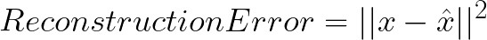

dove $x$ è il valore originale e $\hat{x}$ è il valore ottenuto dalla ricostruzione.

Ci aspettiamo che il reconstruction error sia basso per dati appartenenti alla nostra distribuzione di dati, mentre risulti alto per dati anomali.

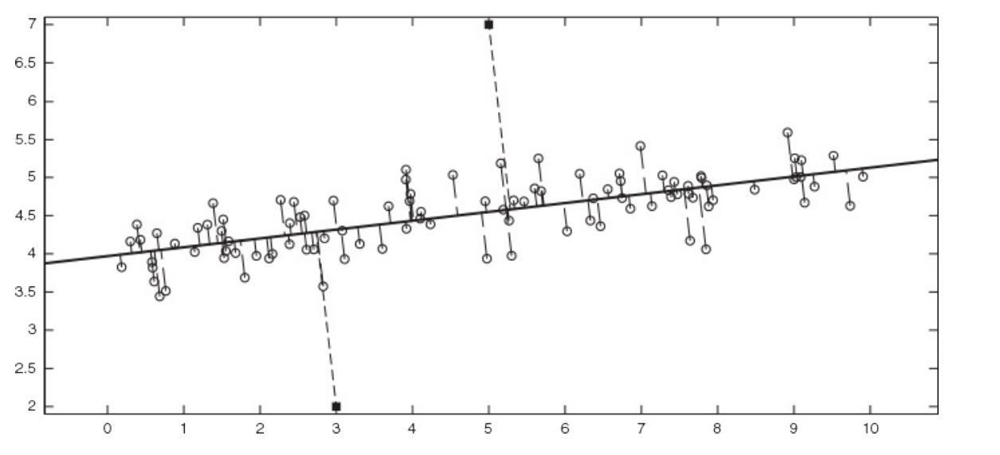

Nella foto precedente la linea nera rappresenta la direzione di massima varianza dell'istanza normale (come i dati vengono rappresentati una volta ricostruiti), le linee tratteggiate rappresentano il reconstruction error, i cerchi sono i dati normali, i quadrati neri gli outlier.

Per i dati non lineari non è possibile applicare la PCA ed è necessario utilizzare un approccio basato su MNN chiamato Autoencoder. Un autoencoder è un MNN avente un numero di neuroni di input e di output uguali al numero di attributi originali, la sua architettura è composta di due step principali:

- Encoding: riduce sempre di più il numero di dimensioni delle feature utilizzando trasformazioni non lineari
- Decoding: mappa le rappresentazioni ottenute con l'encoding con lo spazio degli attributi originali ottenendo così una ricostruzione di $x$ chiamata $\hat{x}$. La distanza tra questi 2 valori sarà il reconstruction error, ovvero l'indice per l'anomaly detection. Il punto centrale di minori dimensioni viene chiamato bottleneck.

Esistono vari tipi di autoencoder come ad esempio il Denoising Autoencoder che è in grado di apprendere rappresentazioni non lineari anche in presenza di rumore.

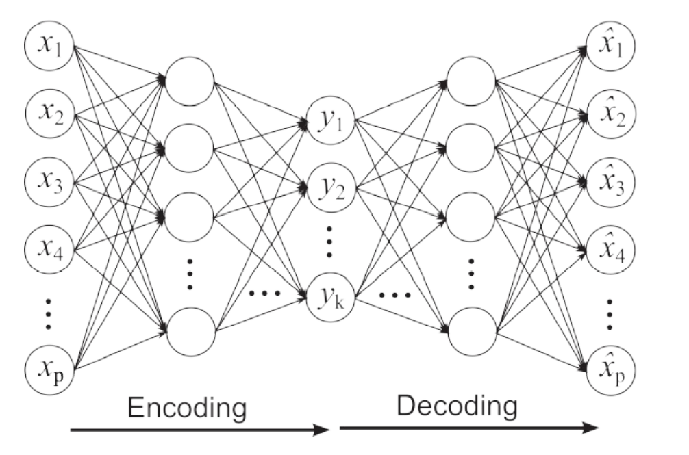

##### Pro e Contro

- Possono apprendere la rappresentazione di molte classi normali utilizzando svariate tecniche di Dimensionality Reduction
- Possono essere utilizzate anche in presenza di attributi irrilevanti (verranno ignorati nello step di encoding)
- Scarse performance quando il numero di attributi è grande (a causa del calcolo del reconstruction error)

#### Approccio One Class SVM

Si possono utilizzare i classificatori per risolvere problemi di anomaly detection trasformandoli in un One Class Problem: un problema in cui l'interesse è solo quello di determinare un decision boundary che rappresenti la classe normale.

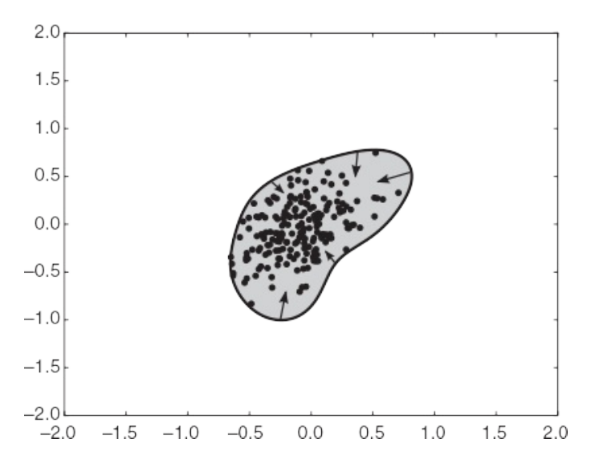

In questo caso possiamo utilizzare le SVM che riescono bene a trovare un boundary per effettuare questa distinzione. Come per il normale caso di SVM in ambito non lineare andremo ad utilizzare un kernel per trasformare i dati in una dimensione maggiore per trovare un iperpiano che li separa. Un kernel molto utilizzato è quello Gaussiano che mappa i dati su una ipersfera di raggio 1 e tutti i punti sono sulla stessa orthant (l'equivalente del quadrante in più di 2 dimensioni). Quindi andremo a trovare l'iperpiano che li separa meglio.
Un iperparametro molto importante è $\nu$ (nu) che indica la percentuale di outlier che andremo a permettere. Questo fa si che nel nostro dataset possono essere presenti anche punti di outlier, a differenza degli autoencoder.

Queste SVM riescono a trovare boundary molto interessanti come le seguenti:

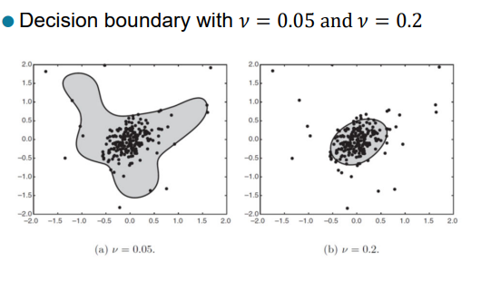

##### Pro e Contro

- Forte base teorica (cosa buona perché sappiamo che funziona bene e perché)
- La scelta di $\nu$ è molto difficile (va scelto bene)
- Risultano computazionalmente costosi per dati a tante dimensioni
- Ammettono punti di outlier nel dataset di training
- Molto efficaci per dataset di piccole dimensioni

#### Approccio Information Theoretic

Questo approccio codifica i dati e invece di apprendere la loro rappresentazione, basa la sua analisi sul quantitativo di informazioni che questi dati rappresentano. Le anomalie, poiché sono irregolari rispetto ai dati, aumentano la quantità di informazioni del dataset. Ci sono vari approcci a seconda del tipo di dato, per dati qualitativi si può utilizzare l'entropy, per i dati quantitativi si può usare la Kolmogorov (Karasni) complexity. Un approccio pratico è quello di comprimere i dati e rimuovere volta per volta dati per vedere se l'information gain aumenta. Nel processo di rimozione non si può rimuovere un singolo dato alla volta perché le variazioni nell'information gain causate dalla rimozione di un singolo dato sono irrilevanti, dunque bisogna trovare il sottoinsieme X più piccolo del dataset che mostra la più grande variazione di information gai una volta eliminato.

##### Pro e Contro

- Sono versatili perché non fanno alcun tipo di assunzioni sulla struttura del dataset
- Non richiedono training
- La loro performance dipende pesantemente dalla misura scelta per calcolare le informazioni
- Sono computazionalmente costosi e difficilmente applicabili a dataset di grandi dimensioni

### Valutazione dell'Anomaly Detection

- Se sono presenti le class label nel dataset, allora si utilizzano gli approcci standard per la classificazione di classi rare: precision, recall, false positive rate (False alarm rate)
- Se non sono presenti label (unsupervised) si utilizzano misure fornite dal metodo di anomaly detection utilizzato: Reconstruction error o Information Gain 
- Si può anche guarda la distribuzione degli anomaly scores con un istogramma o density plot per vedere se abbiamo dei risultati ragionevoli (se tutto è un anomalia c'è qualcosa che non va)

## Dimensionality Reduction

Spesso i dati hanno un numero estremamente alto di attributi che ne rendono la rappresentazione e complessa dunque per aumentare l'efficienza degli algoritmi di data mining spesso vengono applicate tecniche di dimensionality reduction che trasformano il dataset in un altro con un numero inferiore di features che vengono generate tramite combinazioni lineari delle features originali. Questo processo ha altri vantaggi come ad esempio la riduzione del numero di attributi irrilevanti o del rumore. Riesce anche a ridurre la Curse of Dimensionality :skull_and_crossbones:.

### Curse of Dimensionality ☠️

Si riferisce al fenomeno che rende i dati ad un elevato numero di dimensioni (attributi) difficilmente classificabili. Questo avviene perché se le dimensioni aumentano i dati diventano incrementalmente sparsi nello spazio che occupano e quindi è possibile che i nostri data object non saranno un campione rappresentativo di tutti i possibili oggetti. Per la classificazione questo significa che non saremmo in grado di creare un modello affidabile e per il clustering significa che i concetti critici per la creazione di un clustering, come densità e distanza, diventano meno significativi.


### Feature Selection

Un possibile approccio per ridurre il numero di dimensioni è quello di selezionare un sotto set di attributi. Una possibile idea per svolgere questo compito potrebbe essere quella di testare tutte le possibili combinazioni di attributi con l'algoritmo bersaglio ma per $d$ attributi, verrebbero fuori $2^d$ sotto set da controllare che nella maggior parte dei casi è un calcolo ingestibile. È possibile applicare altre tecniche come:

- **forward selection**: inizi con un set di features vuoto e aggiungi ripetutamente le feature che riducono maggiormente l'errore fino a quando questi decrementi sono insignificanti (mean square error, misclassification error, ecc).
- **backward selection**: iniziamo con tutte le features e si rimuove la feature che decrementa maggiormente l'errore e si continua fin quando l'incremento di errore della rimozione è molto significante.

Entrambi questi approcci hanno costo $O(d^2)$.

### Feature Extraction

Cerca di trovare un insieme di nuove features mappate tramite una data funzione. Spesso le combinazioni lineari si prestano bene a questo approccio perché sono semplici da calcolare e sono analiticamente trattabili.


In base alla loro objective, si possono classificare in varie categorie per esempio:

- Minimizing information loss: rappresenta i dati nel modo più accurato possibile in uno spazio a meno dimensioni (PCA)
- Maximize discriminatory information: accentua le informazioni determinanti per la classificazione in una spazio a meno dimensioni (utile per la classificazione)

Ma ce ne sono molte altre.

#### Tecniche Lineari

L'approccio più comunemente utilizzato è quello del Principal Component Analysis (PCA) che cerca una proiezione che preserva il maggior numero di informazioni possibili. Altri metodi sono:

- Linear Discriminant Analysis (LDA): cerca una proiezione che discrimina al meglio i dati
- Independent Component Analysis (ICA): rende le features il più indipendenti possibile

#### PCA

Questa tecnica funziona proiettando i dati di input su gli eigenvector della matrice di covarianza dei dati.

1. Si calcola la matrice di covarianza `C` che serve a quantificare la varianza dei dati e quanto una variabile varia rispetto ad un'altra. 
2. Si trovano gli eigenvector `u_i` di `C`: 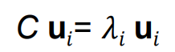
3. Si cercano i `K` eigenvector più grandi che corrispondono ai `K` eigenvalue più grandi (`<u1, u2, ..., uk>`). Questa sarà la nuova base del nostro spazio 

Stiamo essenzialmente estraendo i componenti di ogni variabile che porta alla maggiore varianza quando proiettiamo i dati su questi vettori. Usiamo gli eigenvalue della matrice di covarianza perché riflettono la magnitudine della varianza nella direzione dell'eigenvector corrispondente.

Per scegliere la dimensione `K` si utilizzano una threshold scelto arbitrariamente `T` che rappresenta la percentuale dell'informazione che vogliamo preservare. Se `K = N` verranno mantenute il 100% delle informazioni ed è solo un cambio di base. Applicare solo un cambio di base potrebbe essere utile per rappresentare e visualizzare meglio i dati. 

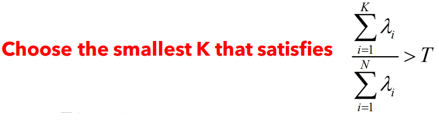

##### Pro e Contro

- Interpretabile
- Veloce nell'esecuzione
- Trova solo trasformazioni lineari
- Problema del Crowding
- La direzione della massima varianza non è detto che sia la più informativa
- Fallisce su dati composti da molteplici cluster separati

#### Crowding Problem

Il Crowding problem si presenta quando, passando da una dimensione più grande ad una più piccola, vogliamo preservare le distanze tra i vicini ma alcune volte risulta essere impossibile.


Dalla foto sopra possiamo vedere che la distanza tra i vicini di $x_1$ non viene rispettata quando si riduce il numero di dimensioni.

#### t-SNE

t-distributed Stochastic Neighbor Embedding è una tecnica di dimensionality reduction che si presta molto bene per la visualizzazione dei dati che prova a concentrare i punti con similarità maggiore il più vicino possibile nello spazio a dimensioni minori (tenta di risolvere il crowding problem). Preserva la struttura locale dei dati utilizzando la distribuzione t-student.

L'algoritmo funziona nel nel seguente modo:

1. Cerca la pairwise similarity (similarità di coppia) tra punti vicini dello spazio ad alte dimensioni (definita in termini di probabilità di essere vicini)
2. Mappa ogni punti nello spazio a meno dimensioni basandosi sulla pairwise similarity
3. Cerca una rappresentazione nello spazio a meno dimensioni che minimizza le differenze tra i dati. Lo fa utilizzando il gradient descent e il KL-divergence (KullbakLaber divergence)


##### Pro e Contro

- È ottimo per visualizzare i dati
- Aiuta a comprendere gli algoritmi black box come DNN
- Riduce il problema del Crowding con distribuzioni heavily tailed
- Non convesso, quindi richiede gradient descend con momentum

### Representation Learning (aka Features Learning)

Questo tipo di learning basa il suo principio di funzionamento sull'apprendere una rappresentazione dei dati di input che potranno poi essere passati a vari modelli che riescono a gestire tale rappresentazione. Si presta bene a Unsupervised e SemiSupervised learning perché permette di combinare dataset con label e dataset senza label insieme per ridurre l'overfitting che potrebbe derivare dall'utilizzo del solo dataset con label. Questo perché l'algoritmo studia features sul dataset senza label ed impara come classificarle utilizzando il dataset con label.

In sostanza, rende input che potrebbero essere difficili da utilizzare per algoritmi di ML facilmente rappresentabili ed utilizzabili.

#### Natural Language Processing 🗻 🪵

NLP è il campo che si occupa della comprensione del processing, dell'analisi e della generazione dei linguaggi naturali (CARPI TRIGGERED).
Può essere applicata a vari campi come:

- TRANSlation
- Information Extraction
- Summarization
- Parsing
- Question answering
- Sentiment Analysis ❤️
- Text Classification

NPL è un campo molto difficile che presenta svariati problemi da risolvere ma negli ultimi anni linguisti e informatici ci si sono dedicati moltissimo ed hanno ottenuto risultati molto interessanti. Questi risultati non sono quelli ottimali, ma risultano essere molto buoni e soprattutto estremamente migliori rispetto a quelli ottenuti 10 anni fa.

Gli aspetti più complessi dell'NLP sono i seguenti:

- **Polysemy**: a seconda di dove vengono utilizzate le parole possono assumere diversi significati. `Book a flight` e `read a book`, `book` come prenotare o libro. 
- **Syntactic Ambiguity**: la sintassi della frase può essere interpretata in modi diversi. `Kids make nutrition snacks` si interpreta come `I bambini sono degli snack nutrienti` (come mangiare i bambini) o `I bambini fanno degli snack nutrienti` (come li preparano).
- **Variability**: frasi con diverse parole ma che assumono lo stesso significato. `They allowed him to ...` e `They let him ...`
- **Co-reference Resolution**: trovare i nomi a cui i pronomi fanno riferimento. 
- **Carenza** di dati o quantitativi **enormi** di dati

##### World Embedding

La rappresentazione delle parole è semplice per l'uomo e non per la macchina dunque è necessario studiare un metodo per rendere questa rappresentazione utilizzabile nei processi di allenamento di ML. A questo scopo è stato studiato il World Embedding in cui le parole vengono rappresentate come vettori a valori reali che codificano il significato delle parole in maniera tale che le parole più vicine nello spazio vettoriale ci si aspetta che saranno simili nel significato. Si utilizza anche il contesto in cui la parola viene utilizzati per capirne il significato. Il Word Embedding si può ottenere utilizzando un insieme di tecniche di language modeling e feature learning.

Viene utilizzato per vari problemi di NLP come:

- Semantic Similarity
- Word Sense Disambiguation
- Semantic Role (Playing) Labeling
- Named Entity Recognition 👻
- Summarization
- Question Answering
- Sentiment Analysis ❤️

I modelli più famosi per World Embedding sono (vengono visti come blackbox, non ci serve sapere i dettagli, li usiamo e basta):

- World2Vec (2013)
- GloVe (2014)
- Fast Text (2017)

###### Word2Vec

Questa è la tecnica più giovane e la prima ad esplorare l'utilizzo delle Neural Network in modo efficacie per generare l'embedding. L'implementazione si basa sulla seguente intuizione: due parole che condividono un contesto simile sono associate con vettori vicini tra loro nello spazio vettoriale. Non siamo interessati all'output di questi modelli ma solo ai pesi appresi durante il learning process perché saranno quelli che faranno il nostro embedding. Un po' come gli Autoencoder che, come side effect, hanno la features reduction, anche questi come side effect hanno l'embedding. In pratica ci sono 2 diversi modelli:

- CBOW 🐄: prova a prendere un insieme di parole e predirre quella mancante
- Skip Gram: predice le parole in base al contesto dell'input

Tutti e 2 i modelli come dataset utilizzano una enorme collezioni di testi grammaticalmente corretti del linguaggio scelto che prende il nome di `corpus`. La scelta dei testi è molto importante ed deve basarsi sull'obbiettivo finale dell'embedding: per fare l'embedding dei paper che trattano argomenti scientifici non si potranno utilizzare articoli di un forum di cucina. L'idea è che non devo insegnare al modello come funziona la grammatica ma la apprende da solo.

**Continuos Bag of Words (CBOW) 🐄**

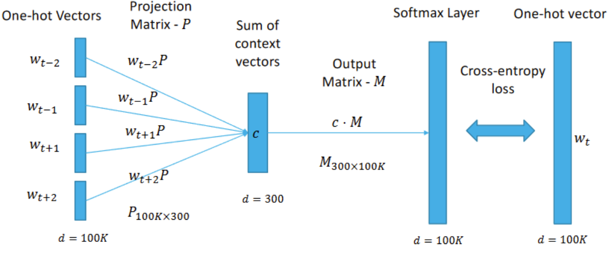

Una parola può essere rappresentata da un tot di parole che la precedono e un tot che la seguono, questo è il contesto. Nella foto possiamo vede che la parola viene rappresentata come le 2 precedenti $w_{t-1}$ e $w_{t-2}$ e le due successive $w_{t+1}$ e $w_{t+2}$. In pratica abbiamo un modello con un solo hidden layer, che generalmente utilizza la cross entropy loss, e creiamo un problema di apprendimento supervisionato basandoci sul testo che abbiamo (la label dell'output sarà la parola target). Successivamente alleno la rete per taaaantissime epoche e alla fine prendo in considerazione solo i pesi ottenuti durante questa fase per creare l'embedding matrix che utilizzerò per il mio problema di NLP.

N.B.: nella foto, il numero 300 indica la dimensione del feature vector che rappresenta una parola e 100k il numero di parole che formano il dataset (corpus). Avrò quindi una matrice finale 100kx300. 

**Skip Gram**


Si basa sullo stesso concetto di CBOW ma è il contrario: partiamo da una parola centrale e vogliamo trovare il contesto (le 2 parole successive e le 2 precedenti). Come per l'altro modello andiamo a creare un learning task supervisionato e alla fine dell'allenamento prendo i pesi e ignoro l'output (esattamente come l'altro).

**Modelli Preallenati**

Quando utilizziamo modelli pre allenati (cosa abbastanza comune) bisogna prestare attenzione ai parametri del modello che possono andare ad alterarne le performance. Parametri importanti sono:

- window size: è il numero di parole che compongono il contesto (tipo $w_{t-1}, w_{t-2}, ecc.$)
- il corpus
- numero di iterazioni
- dimensione del feature vector

**Rappresentazione**

Una volta ottenuto l'embedding possiamo anche rappresentare le parole in uno spazio 2D per poterle visualizzare meglio. È da notare che 2 (che viene dal 2D) non è il numero di features utilizzate per rappresentare le parole ma il tutto è il risultato di applicazione di un visualization algorithm tipo il t-sne.

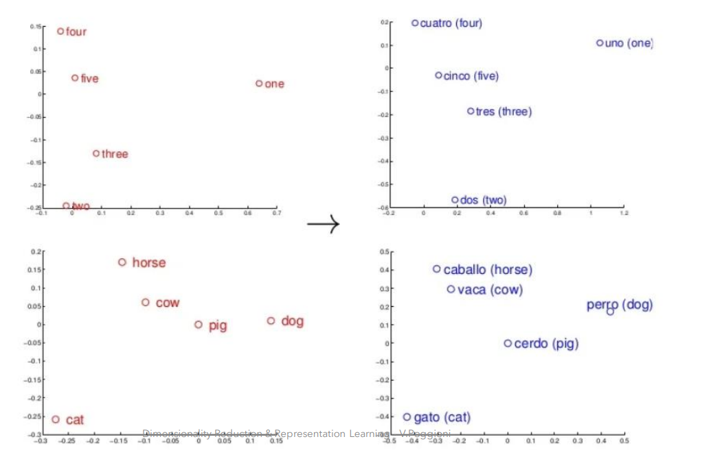

Si è anche visto che è possibile definire una specie di algebra con queste parole, di seguito possiamo apprezzarne un esempio:

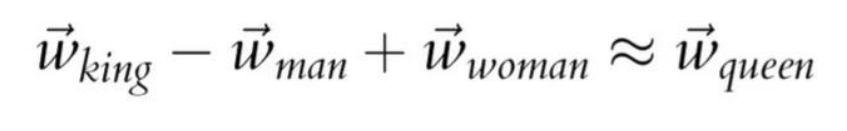

È anche possibile risolvere delle proporzioni del tipo `roma: italia = parigi : francia` e quindi `roma : italia = x : cuba`.

> in italiano we say proporzioni.

## Recurrent Neural Networks

In alcune applicazioni del machine learning è importante tenere in considerazione la sequenza in cui si presentano i dati in input, questo perché sono informazioni che risultano significative per ottenere il corretto output (andamento del mercato che dipende dai prezzi precedenti o text processing che dipende dalla semantica). Nelle architetture standard tuttavia non si può tenere conto di questa sequenzialità dato che trattano ogni input come indipendente l'uno dall'altro (tipo i pixel di una foto). Per questo motivo sono state studiate le Recurrent Neural Networks che effettuano parameter sharing tra i vari layer della rete e riuscendo così a tenere in considerazione la sequenza in cui si presentano i dati. Spesso sono anche in grado di prendere in input sequenze di dimensioni variabili. Esempi possibili sono:

- Predizione di testo
- Traduzione 
- Image Captioning
- Sentiment Analysis
- Sentence Centric Classification

Due esempi di architetture di RNN sono:

- LSTM, Long Short Term Memory
- GRU, Gayted Recurrent Unit

Le RNN sono _TURING COMPLETE ⚧️_, con abbastanza tempo e risorse può simulare qualsiasi algoritmo. Questa informazione è completamente inutile perché per riuscire in questo compito servono risorse e tempo estremamente elevate che a volte potrebbero essere anche irrealistiche. Spesso un altro problema in cui incappano questi modelli è quello del gradient vanishing e exploding la cui severità aumenta all'aumentare della lunghezza della sequenza in input.


### Struttura Base

Per semplificare la visualizzazione di queste reti si può introdurre l'idea dell'Unfolding Computational Graph, con cui si dispiegano una serie di calcoli ricorsivi in un grafo che ha una struttura ripetitiva tipicamente corrispondente ad una catena di eventi. Questo grafo inoltre mostra la condivisione dei parametri lungo la DNN.

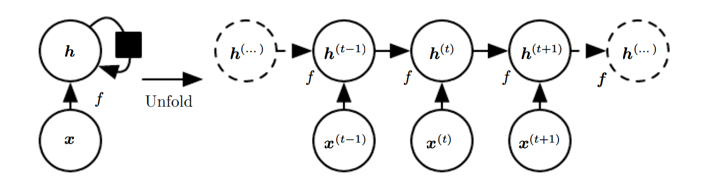

Ora che abbiamo introdotto il concetto di unfolding possiamo analizzare le varie metodologie di design delle RNN.

I design patter più importanti sono i seguenti:

- Recurrent Network che producono un output ad ogni time-step ed hanno connessioni ricorrenti tra le hidden unit 
- Recurrent Network che producono un output ad ogni time-step ed hanno recurrent connection solo tra output ad un time step e hidden unit al time step successivo. Questo design sarà sempre peggiore degli altri e non è turing completo perché le informazioni non vengono passate direttamente tra hidden layer ma tra output ed hidden layer poiché l'output layer prova a far combaciare con la propria matrice dei pesi l'output con la ground through sarà difficile preservare le informazioni. Il vantaggio di togliere hidden to hidden connection è che il calcolo del gradiente per ogni time stamp può essere parallelizzato 
- Recurrent Network con un solo output finale con connessioni ricorrenti tra hidden units. 

Nella forward phase abbiamo le seguenti equazioni:

- 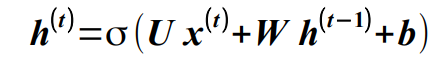
- 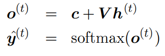

Dove $\sigma$ è la funzione di attivazione per l'hidden layer che di solito è la `tanh`.

I parametri allenabili della rete sono: 

- `b` e `c`: rappresentano i vettori di bias
- `U`, `V`, `W`: sono le matrici dei pesi, che rappresentano rispettivamente le connessioni _input-to-hidden (U)_, _hidden-to-output (V)_, _hidden-to-hidden (W)_

$\hat{y}$ è la probabilità di output normalizzata che servirà per il confronto, tramite Loss Function, con la ground through $y$; $o_t$ è l'output non normalizzato che verrà utilizzato per calcolare $\hat{y}$ tramite una funzione di attivazione (di solito la softmax).

Calcolare il gradiente è costoso e richiede svariati passaggi, inoltra non può essere parallelizzato e dunque il tempo è `O(T)` (dove `T` è il numero di time step). Dato che stati calcolati nella fase forward devono essere salvati avremo un costo in memoria equivalente. Questo approccio è chiamato Back Propagation Through Time (BPTT).

#### Sequence To Sequence Learning

A seconda della mappatura tra input e output possono essere realizzate delle reti che saranno utili per varie situazioni:

- One to One: semplice rete feed forward, utile per l'image classification
- One to Many: utile per image captioning
- Many to One: utile per text classification e sentiment analysis
- Many to Many: utile per machine translation
- Sync Many to Many: utile per video classification (image classification per ogni frame)


### BPTT

Nella fase di apprendimento, per aggiornare le matrici di pesi non possiamo utilizzare la normale back propagation perché la funzione $h_t()$ dipende da $h_{t-1}()$ (e così via fino all'inizio) e non risultano derivabili con la normale back propagation (causerebbe anche perdita di informazioni). Si utilizza una versione leggermente diversa chiamata Back Propagation Thought Time perché sa tornare "indietro nel tempo".
Vedremo una versione molto semplificata dei calcoli.

L'idea è che nella la fase forward, andiamo a calcolare la Loss Totale (calcoliamo ogni $Loss_i$ e le sommiamo insieme) e da questa possiamo calcolare il gradiente di ogni parametro per andarlo poi ad aggiornare nella fase backward. 


_Dove_ $L_i$ _è la loss function del time step_ $i$

Queste sono le formule con cui vengono aggiornate le matrici di pesi ad ogni epoca in base alla loss function.
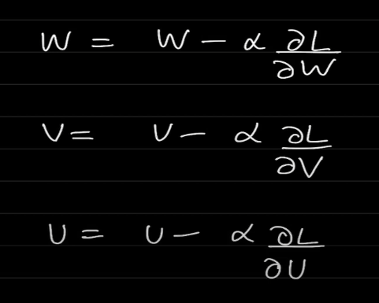

Prendiamo il caso di `V`, con pochi calcoli possiamo vedere che il calcolo del gradiente può essere riportato alla seguente sommatoria: 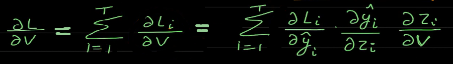

Tutti i prodotti tra quelle derivate sono date dalla chian rule che serve per rendere derivabili funzioni composte, dato che $L_i$ dipende da $\hat{y}$ che dipende da `z`. Questi calcoli non sono problematici per il computer e si fa tutto senza tanti problemi.

Il vero problem viene con `W` e `U`.
Prendiamo in esame `W`, la cui formula per calcolare il gradiente è la seguente: 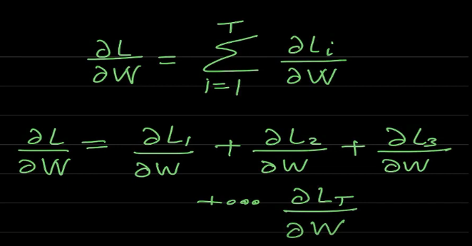

Dobbiamo quindi calcolare tutte quelle derivate e sommarle. Per L1 no ci sono molti problemi dato che h1 dipende da h0 (che praticamente è una costante). Il problema sta nel calcolo di quelle successive, perché bisogna ripercorrere i vari time step precedenti fino ad arrivare ad h0 (qui prende il nome di BP through time perché torna "indietro nel tempo"). Di seguito un esempio di come effettivamente si torna indietro nel tempo per il calcolo della seconda derivata.

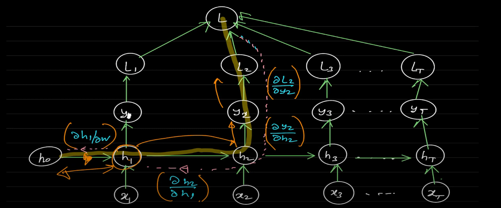

Possiamo generalizzare tutti questi calcoli in una formula più compatta: . 
Qui sorgono due problemi, il primo è che questi calcoli risultano mooolto complessi e numerosi piu andiamo avanti nel tempo (il time step 20 dipende dal 19 che dipende dal 18, e così via) il secondo è che quella produttoria causa il vanishing/exploding del gradiente (moltiplicare tante volte la stessa cosa o la porta all'infinito o a 0).

Lo stesso problema avviene per `U` dato che anche qui per sviluppare i calcoli dobbiamo passare per `h`.

In caso guarda questo video: [Mega Indi che spiega cose](https://www.youtube.com/watch?v=phOVApJHjsU&list=LL&index=1&ab_channel=AhladKumar)

### Deep Recurrent Networks

Fino ad ora abbiamo visto delle reti ricorrenti formate da un solo hidden layer, ma aggiungendone altri adiamo ad avere dei miglioramenti nelle performance significativi ?

Da degli studi pratici è emerso che questa aggiunta è sensata e apporta miglioramenti nelle performance della nostra rete. 

Esistono 3 modi per farlo:

- **Hidden Recurrent Layers**: aggiungiamo più layer ricorrenti tra l'input e l'output. Questo fa si che i layer più vicino all'input riescono a trasformarlo in modo da rendere la rappresentazione dei dati più appropriata per i layer successivi 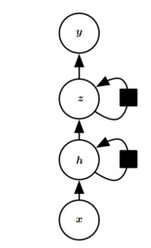

- **Hidden MLP/Pompotron layers**: possiamo aggiungere layer MLP in qualunque punto della rete (input-to-hidden, hidden-to-hidden, hidden-to-output). Questo aumenta la capacità (memoria) della rete ma, aggiungendo profondità, va a peggiorare in termini di tempo e risorse il processo di learning e ottimizzazione. Questo avviane perché i MLP layer aumentano la distanza tra il time step `t` e il time step `t + 1` (solitamente la raddoppiano). 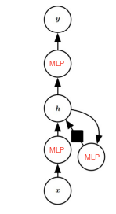

- **Hidden MLP/Pompotron + Skip Layers**: per evitare il problema dell'allungamento della distanza tra i time step (problema del punto precedente) possiamo introdurre, oltre che layer MLP, anche skip layer per accorciare queste distanze. 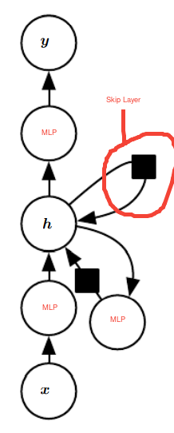

In generale è più semplice ottimizzare e lavorare con architetture più semplici e meno profonde possibili.

### Il problema delle Long-Term Dependencies

Un problema molto importante dell RNN è quello delle Long-Term Dependencies ovvero la propagazione del gradiente per molti step (quindi passare per moooolti hidden layer recurrent, anche solamente 10 o 20), tende a risultare in un vanishing o exploding del gradiente. Da un punto di vista matematico, il problema risiede nel moltiplicare la matrice dei pesi hidden `W` tantissime volte per se stessa (alla fine viene fuori $W^t$). QUesta moltiplicazione di matrici deriva dal fatto che la funzione $h_t$ dipende da $h_{t-1}$ e continua così ricorsivamente. Si possono fare calcoli strani per scriver questa matrice come prodotto di eigenvalues e eigenvectors(??). Moltiplicando moooolte volte eigenvalues con base (la chiama magnitude) < 1 il calcolo tende a diventare 0, quelli con magnitude > 1 tendono ad esplodere (infinito).
Con questo problema la fase di learning può impiegare tantissimo tempo ad apprendere queste Long-Term Dependencies o non riuscirci affatto.

Sono stati quindi introdotti alcuni metodi per cercare di risolvere questo problema.

### Gestire le Long-Term Dependencies

Un modo per gestire le long-term dependencies è quello di creare un modello che opera a molteplici time scale in maniera tale che alcune parti del modello opereranno con un time scale a grana fine e gestiranno piccoli dettagli mentre altre parti opereranno a time scale a grana grossa passando informazioni da passati distanti al presente in maniera efficiente. Le strategie piu importanti per gestire questo problema sono quelle delle:

- Skip Connection: aggiungono collegamenti tra variabili in un passato lontano a variabili nel presente
- Leaky Units: integrano segnali con differenti costanti di tempo e rimuovono alcune connessioni utilizzate per modellare i time scale a grana fine

#### Skip Connection

Questa tecnica è stata introdotta per cercare di ridurre il problema del gradient vanishing/exploding introducendo delle connessioni dirette che passano da un time step `t` ad un time step `t + d` riducendo quindi il numero di dipendenze per tutti gli hidden layer sopra a `t + d` (da `t+d` può tornare indietro direttamente a `t` senza passare per tutti gli altri). In questo modo il gradiente non diminuirà esponenzialmente in funzione di `T` ma in funzione di `T/d` rallentandone quindi il vanishing/exploding (può comunque esplodere/scomparire). Questo permette all'algoritmo di learning di rappresentare delle dipendenze piu lunghe che però non è detto che verranno rappresentate bene.

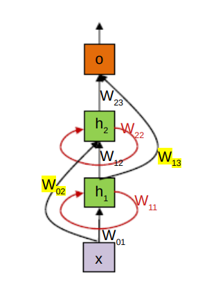

#### Leaky Units

L'effetto di skip di `d` time step (con `d` un numero intero) può anche essere ottenuto con un numero reale `a` che essendo reale permette aggiustamenti più fini e precisi. Le leaky units sono hidden units cone self connection lineari. Quando `a` è vicino ad 1 il modello ricorda informazioni del passato per un lungo tempo mentre quando è più vicino a 0 le informazioni vengono scartate rapidamente.

#### Gated RNN :family_man_man_girl_boy:

Ad oggi le Gated RNN sono il metodo più utilizzato nella pratica per realizzare RNN. Come le Leaky Unit il loro funzionamento si basa sull'idea della creazione di cammini attraverso il tempo le cui derivate non svaniscano o esplodano. Mentre nelle leaky unit queste weighted connection venivano scelte manualmente le gayted RNN provano a generalizzare, permettendo al modello di apprendere quale sia il migliore valore da assegnargli (ricordiamo che per valori vicino ad 1 si ha una memoria a lungo termine, per valori vicino a 0 si indurrà il modello a dimenticare il passato). Quindi il modello sarà in grado di decidere automaticamente quando dimenticare eventi passati impostando lo stato a 0.

Due implementazioni di Gayted RNN sono:

- Long Short-Term Memory (LSTM) [BDSM]
- Gayted Recurrent Unit (GRU)

#### LSTM

Per permettere al modello di aggiustare i parametri di queste connessioni tra i vari time step viene introdotta un'unità che andrà a sostituire il classico hidden state visto fin ora. Queste unità sono composte internamente da 3 gate che prendono in input l'hidden state precedente e la sequenza in input attuale. Queste gate sono:

- Input Gate
- Output Gate
- Forget Gate

Esternamente si comportano come un hidden state visto fin ora quindi si collegano anche con l'hidden state successivo.


_Rappresentazione interna di una cella_

> LARGER IS BETTER
>  _Valentina Poggioni_

#### GRU

È una semplificazione di LSTM che combina l'input e il forget gate in un unico update gate e unisce in una sola cella la Cell State e l'hidden state. Queste stanno diventando sempre più popolari per via della loro semplicità e perché sono più semplici da allenare.

#### Gradient Clipping

A causa delle numerose moltiplicazioni della stessa matrice di pesi si possono forma delle "colline": una regione di pianura seguita ta una discesa ripida e poi una sezione di pianura. Quando il calcolo del gradiente approccia questa collina può succedere che i parametri vengono lanciati molto lontano causando la perdita di tutta l'ottimizzazione fatta fin ora. Per risolver questo problema una tecnica è quella del Gradient Clipping che può essere applicata in 2 modi:

- clippare il gradiente, prima che i parametri vengano aggiornati, all'interno di un minibach element-wise (dovrebbe essere un area oltre la quale il gradiente non può andare)
- clippare il gradiente se la sua norma supera una certa soglia `v` 

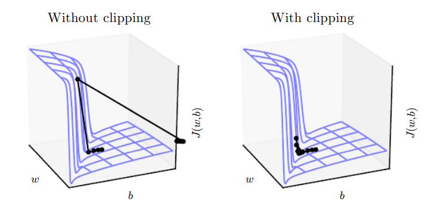