# Franzoni

Appunti per superare il corso della Franzoni :floppy_disk:

# Indice

<details>
    <summary><a href="#processi">Processi</a></summary>
    <ul>
        <li><a href="#definizione-di-un-processo">Definizione</a></li>
        <li><a href="#il-pcb">Il PCB</a>
            <ul>
                <li><a href="#definizione">Definizione</a></li>
                <li><a href="#descrizione">Descrizione</a></li>
                <li><a href="#priorità">Priorità</a></li>
                <li><a href="#memoria">Memoria</a></li>
            </ul>
        </li>
        <li><a href="#thread">Thread</a></li>
        <li><a href="#scheduler-dei-processi">Scheduler dei Processi</a>
            <ul>
                <li><a href="#context-switch">Context Switch</a></li>
                <li><a href="#ios-e-android">iOS e Android</a></li>
            </ul>
        </li>
        <li><a href="#operazioni-su-processi">Operazioni su Processi</a>
            <ul>
                <li><a href="#duplicazione-del-padre">Duplicazione del Padre</a></li>
                <li><a href="#gerarchia-dei-processi-nei-dispositivi-mobili">Gerarchia dei processi nei dispositivi
                        mobili</a></li>
            </ul>
        </li>
        <li><a href="#architetture-multi-processo">Architetture multi-processo</a></li>
        <li><a href="#cooperazione-tra-processi">Cooperazione tra Processi</a>
            <ul>
                <li><a href="#comunicazione-diretta">Comunicazione Diretta</a></li>
                <li><a href="#comunicazione-indiretta">Comunicazione Indiretta</a></li>
                <li><a href="#comunicazione-sincrona-asincrona">Comunicazione Sincrona/Asincrona</a></li>
                <li><a href="#esempi-di-ipc">Esempi di IPC</a>
                    <ul>
                        <li><a href="#lpc">LPC</a></li>
                        <li><a href="#pipes">Pipes</a>
                            <ul>
                                <li><a href="#ordinarie">Ordinate</a></li>
                                <li><a href="#nominali">Nominali</a></li>
                            </ul>
                        </li>
                    </ul>
                </li>
                <li><a href="#comunicazione-client-server">Comunicazione Client-Server</a>
                    <ul>
                        <li><a href="#socket">Socket</a></li>
                        <li><a href="#remote-procedure-call">Remote Procedure Call</a></li>
                        <li><a href="#problema-producer-consumer">Problema Producer-Consumer</a></li>
                    </ul>
                </li>
            </ul>
        </li>
    </ul>
</details>

<details>
    <summary><a href="#threads">Threads</a></summary>
    <ul>
        <li><a href="#benefici">Benefici</a></li>
        <li><a href="#programmazione-multicore">Programmazione Multicore</a>
            <ul>
                <li><a href="#tipi-di-parallelismo">Tipi di Parallelismo</a></li>
                <li><a href="#legge-di-amdahl">Legge di Amdahl</a></li>
            </ul>
        </li>
        <li><a href="#kernel-e-user-threads">Kernel e User Threads</a></li>
        <li><a href="#modelli-multithread">Modelli MultiThread</a></li>
        <li><a href="#impliciti-ed-espliciti">Impliciti ed Espliciti</a></li>
        <li><a href="#gestione-dei-segnali">Gestione dei Segnali</a></li>
        <li><a href="#cancellazione">Cancellazione</a></li>
        <li><a href="#tls">TLS</a></li>
        <li><a href="#processi-lightwaight">Processi Lightwaight</a></li>
    </ul>
</details>

<details>
    <summary><a href="#scheduling">Scheduling</a></summary>
    <ul>
        <li><a href="#dispatcher">Dispatcher</a></li>
        <li><a href="#criteri-dello-sheduler">Criteri di Scheduling</a></li>
        <li><a href="#algoritmi-di-scheduling">Algoritmi di Scheduling</a>
            <ul>
                <li><a href="#fcfs">FCFS</a></li>
                <li><a href="#sjf">SJF</a></li>
                <li><a href="#rr">RR</a></li>
                <li><a href="#priorità">Priorità</a>
                    <ul>
                        <li><a href="#multilevel-queue">Multilevel Queue</a></li>
                    </ul>
                </li>
            </ul>
        </li>
        <li><a href="#thread-scheduling">Thread Scheduling</a>
            <ul>
                <li><a href="#multiprocessor-scheduling">MultiProcessor Scheduling</a>
                    <ul>
                        <li><a href="#smp">SMP</a></li>
                    </ul>
                </li>
                <li><a href="#multicore-processors">Multicore Processors</a></li>
                <li><a href="#multithread-multicore-systems">MultiThread MultiCore Systems</a></li>
                <li><a href="#bilanciamento-del-carico">Bilanciamento del Carico</a></li>
                <li><a href="#affinità">Affinità</a></li>
            </ul>
        </li>
        <li><a href="#real-time-cpu-scheduling">Real Time CUP Scheduling</a>
            <ul>
                <li><a href="#real-time-system">Real Time System</a></li>
                <li><a href="#latenza-di-un-evento">Latenza di un Evento</a>ù</li>
                <li><a href="#scheduling-su-priorità">Scheduling su Priorità</a></li>
            </ul>
        </li>
    </ul>
</details>

<details>
    <summary><a href="#strumenti-di-sincronizzazione">Strumenti di Sincronizzazione</a></summary>
    <ul>
        <li><a href="#sezione-critica">Sezione Critica</a></li>
        <li><a href="#metodo-degli-interrupt">Metodo degli Interrupt</a></li>
        <li><a href="#soluzione-di-peterson">Soluzione di Peterson</a></li>
        <li><a href="#memory-barrier">Memory Barrier</a>
            <ul>
                <li><a href="#memory-models">Memory Models</a></li>
            </ul>
        </li>
        <li><a href="#mutex">Mutex</a>
            <ul>
                <li><a href="#spinlocks">Spinlocks</a></li>
            </ul>
        </li>
        <li><a href="#semafori">Semafori</a></li>
        <li><a href="#problema-dei-semafori">Problema dei Semafori</a></li>
        <li><a href="#monitor">Monitor</a>
            <ul>
                <li><a href="#contition-variables">Contition Variables</a></li>
                <li><a href="#riprendere-un-processo">Riprendere un Processo</a></li>
                <li><a href="#single-source-allocation">Single Source Allocation</a></li>
            </ul>
        </li>
        <li><a href="#livness">Livness</a>
            <ul>
                <li><a href="#deadlock">Deadlock</a>
                    <ul>
                        <li><a href="#starvation">Starvation</a></li>
                        <li><a href="#priority-invertion">Priority Invertion</a></li>
                    </ul>
                </li>
            </ul>
        </li>
        <li><a href="#deadlocks">Deadlocks</a>
            <ul>
                <li><a href="#resourche-allocation-graph">Resourche Allocation Graph</a>
                    <ul>
                        <li><a href="#claim-edge">Claim Edge</a></li>
                    </ul>
                </li>
                <li><a href="#prevention">Prevention</a></li>
                <li><a href="#avoidance">Avoidance</a></li>
                <li><a href="#safe-state">Safe State</a></li>
                <li><a href="#algoritmi-per-la-gestione-dei-deadlock">Algoritmi per la gestione dei deadlock</a>
                    <ul>
                        <li><a href="#avoidance-e-prevention">Avoidance e Prevention</a>
                            <ul>
                                <li><a href="#single-istance">Single Istance</a>
                                    <ul>
                                        <li><a href="#algoritmo-con-resource-allocation-graph">Algoritmo con
                                                Resource Allocation Graph</a></li>
                                    </ul>
                                </li>
                                <li><a href="#multiple-istance">Multiple Istance</a>
                                    <ul>
                                        <li><a href="#algortimo-dei-banchieri">Algortimo dei Banchieri</a></li>
                                    </ul>
                                </li>
                            </ul>
                        </li>
                        <li><a href="#detection-algortim-usage">Detection Algortim Usage</a></li>
                    </ul>
                </li>
                <li><a href="#recovery-from-deadlock">Recovery From Deadlock</a>
                    <ul>
                        <li><a href="#process-termination">Process Termination</a></li>
                        <li><a href="#resource-preemption">Resource Preemption</a></li>
                    </ul>
                </li>
            </ul>
        </li>
    </ul>
</details>

<details>
    <summary><a href="#memoria-principale">Memoria Principale</a></summary>
    <ul>
        <li><a href="#protezione">Protezione</a></li>
        <li><a href="#address-binding">Address Binding</a></li>
        <li><a href="#spazio-di-indirizzamento">Spazio di Indirizzamento</a></li>
        <li><a href="#mmu">MMU</a></li>
        <li><a href="#dinamic-loading">Dinamic Loading</a></li>
        <li><a href="#linking">Linking</a></li>
        <li><a href="#allocazione-contigua">Allocazione Contigua</a>
            <ul>
                <li><a href="#partizionamento-variabile">Partizionamento Variabile</a></li>
            </ul>
        </li>
        <li><a href="#goal-della-gestione-della-memoria">Goal della Gestione della Memoria</a></li>
        <li><a href="#delegazione">Delegazione</a></li>
        <li><a href="#strategie">Strategie</a></li>
        <li><a href="#goal-della-memoria-virtuale">Goal della Memoria Virtuale</a></li>
        <li><a href="#un-idea-di-base">Un idea di Base</a></li>
        <li><a href="#frammentazione">Frammentazione</a></li>
        <li><a href="#paginazione">Paginazione</a>
            <ul>
                <li><a href="#schema-per-la-traduzione-degli-indirizzi">Schema per la traduzione degli Indirizzi</a>
                </li>
                <li><a href="#implementazione-della-page-table]">Implementazione della Page Table</a>
                    <ul>
                        <li><a href="#tbls">TBLS</a>
                            <ul>
                                <li><a href="#tbls-miss">TBLS MISS</a></li>
                            </ul>
                        </li>
                    </ul>
                </li>
                <li><a href="#memory-protection">Memory Protection</a></li>
                <li><a href="#page-size">Page Size</a></li>
                <li><a href="#pagine-condivise">Pagine Condivise</a></li>
                <li><a href="#struttura-della-page-table">Struttura della Page Table</a>
                    <ul>
                        <li><a href="#paging-gerarchico">Paging Gerarchico</a></li>
                        <li><a href="#hasehd-page-table">Hasehd Page Table</a></li>
                        <li><a href="#inverted-page-table">Inverted Page Table</a></li>
                    </ul>
                </li>
                <li><a href="#swapping">Swapping</a></li>
            </ul>
        </li>
        <li><a href="#segmentazione">Segmentazione</a>
            <ul>
                <li><a href="#allocazione-significativa">Allocazione significativa</a></li>
                <li><a href="#segment-table">Segment Table</a></li>
                <li><a href="#shered-segment">Shered Segment</a></li>
                <li><a href="#frammentazione">Frammentazione</a></li>
            </ul>
        </li>
    </ul>
</details>

<details>
    <summary><a href="#i/o">I/O</a></summary>
    <ul>
        <li><a href="#polling">Polling</a></li>
        <li><a href="#interrupt">Interrupt</a></li>
        <li><a href="#dma">DMA</a></li>
        <li><a href="#application-i/o-interface">Application I/O Interface</a></li>
        <li><a href="#nonblocking-e-asicnroni-i/o">NonBlocking e Asicnroni I/O</a></li>
        <li><a href="#kernel-i/o-subsistem">Kernel I/O Subsistem</a></li>
        <li><a href="#error-handling">Error Handling</a></li>
        <li><a href="#riassuntino">Riassuntino</a></li>
        <li><a href="#streams">Streams</a></li>
    </ul>

</details>

<details>
    <summary><a href="#memoria-di-massa">Memoria di Massa</a></summary>
    <ul>
        <li><a href="#strutture-dei-dischi">Strutture dei Dischi</a></li>
        <li><a href="#hhd-scheduling">HHD Scheduling</a></li>
        <li><a href="#error-correction/detection">Error Correction/Detection</a></li>
        <li><a href="#formattazione">Formattazione</a></li>
        <li><a href="#gestione-dello-storage-device">Gestione dello Storage Device</a></li>
        <li><a href="#swapping">Swapping</a></li>
        <li><a href="#raid">RAID</a></li>
        <li><a href="#deframmentazione">Deframmentazione</a></li>
    </ul>
</details>

<details>
    <summary><a href="#file-system">File System</a></summary>
    <ul>
        <li><a href="#file">File</a>
            <ul>
                <li><a href="#scelte">Scelte</a></li>
                <li><a href="#struttura-fisica">Struttura Fisica</a></li>
            </ul>
        </li>
        <li><a href="#file-system-logico">File System Logico</a></li>
        <li><a href="#attributi-dei-file">Attributi dei File</a></li>
        <li><a href="#metodi-di-accesso">Metodi di Accesso</a></li>
        <li><a href="#operazioni-sui-file">Operazioni sui File</a></li>
        <li><a href="#implementazione-delle-directory">Implementazione delle Directory</a></li>
        <li><a href="#metodi-di-allocazione">Metodi di allocazione</a>
            <ul>
                <li><a href="#contiguo">Contiguo</a></li>
                <li><a href="#link">Link </a></li>
            </ul>
        </li>
        <li><a href="#fat">FAT</a></li>
        <li><a href="#ntfs">NTFS</a></li>
        <li><a href="#ufs">UFS</a></li>
    </ul>
</details>
                
---

# Processi

## Definizione di un processo

Un **processo** è la **rappresentazione dinamica** astratta di un programma in esecuzione.

## Il PCB

### Definizione

Quando un programma viene messo in stato di esecuzione gli viene assegnato un PCB (Process Contol Block).<br>
Il **PCB** è una **tabella** di **dati** relativi al processo (pid, pc, state, ecc)
Può essere anche inteso come la sequenza di tutte le configurazioni che i suoi valori assumono dall'inizio alla fine dell'esecuzione.

### Descrizione


* **Pid**: Identificativo univoco del processo
* **Process State**: Stato del processo
    * **Ready**: al processo è stato assegnato un processore ed è pronto all'esecuzione
    * **Exec**: il processo detiene un processore che sta lavorando
    * **Wait**: al processo è stato temporaneamente tolta la risorsa processore
    * **Terminate**: al processo si sta togliendo in maniera definitiva la risorsa processore (i dati necessari vengono salvati in memoria secondaria)
* **Registers**: registri coinvolti nell'esecuzione del programma.
* **Pointer**: Puntatore all'istruzione attuale.
* **Program Counter**: Puntatore all'istruzione successiva.
* **List of open files**: Lista con tutti i file (processi, file, ecc) aperti con cui il processo può interagire.
* **Memory Limits**: Limiti della memoria per mantenere la sicurezza.
* **Father**: Puntatore al processo padre (colui che ha creato il processo).
* **Child**: Lista dei processi figli.
* **Priority**: Livello di priorità del processo.
* **...**: altri elementi che variano in base al processo e al sistema operativo.

Il PCB ha una rappresentazione dinamica in quanto viene aggiornato continuamente dal sistema operativo e dagli altri processi.

### Priorità

L'**assegnazione** dei processori **non avviene** in maniera **democratica**, ma avviene in base ad un sistema di **priorità**.<br>
La priorità è salvata su un campo del PCB.
Quando un processo viene messo in wait (con una System Call) alcuni valori (PC, Registri, ecc) del processo vengono salvati nel PCB.

### Memoria

Il **Pointer to Process Memory** è un puntatore ad una lista che contiene gli **ID** e gli **stati** delle **pagine di memoria**.<br>
Questo è importante perchè per ogni processo è necessario sapere se le pagine di RAM sono salvate sul disco o sono effettivamente in memoria.

Per garantire la sicurezza in memoria vengono implementati dei limiti (**Memory Limits**) all'interno del PCB, che vanno ad indicare gli intervalli di memoria utilizzabili dal processo.

## Thread

Per ogni programma si possono avere:

* **processi separati**: sono più pesanti ma, garantiscono più facilmente di non causare l'uno il crash dell'altro
* **vari thread**: che sono facilmente gestibili ma possono causare più facilmente problemi

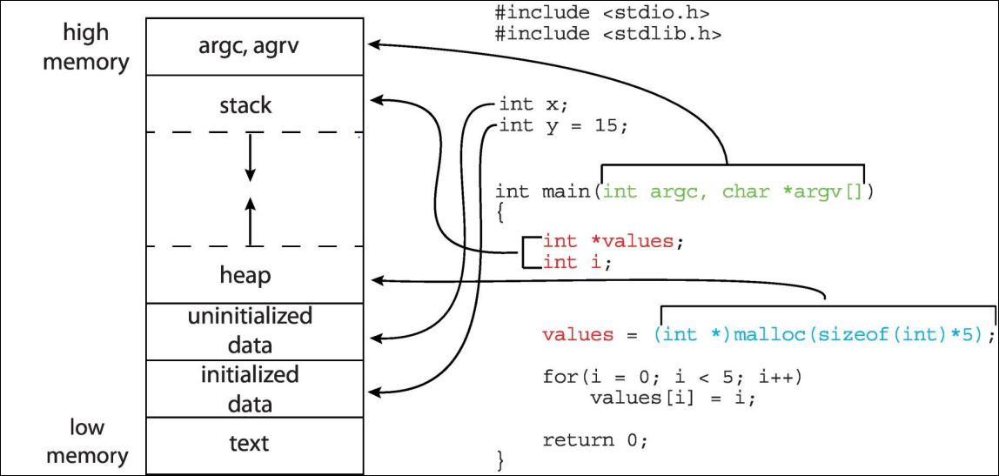

## Scheduler dei Processi

Lo **Scheduler** sceglie tra i vari processi disponibili il prossimo a cui assegnare la CPU.<br>
L'**obbiettivo** è di **massimizzare** l'uso della **CPU** e di avere un cambio di contesto veloce.<br>
Lo shceduler ha due **code** di processi:

* **Coda Ready**: sono i processi pronti ad essere eseguiti
* **Coda Wait**: sono i processi che stanno aspettando un evento


### Context Switch

Quando il processore viene assegnato ad un altro processo, il sistema salva lo stato del vecchio processo e carica quello nuovo. Questo viene chiamato **Context Switch**.<br>
Il contesto di un processo viene rappresentato nel PCB.

Il cambio di contesto è "**tempo morto**", il tempo è pesantemente **influenzato** dalla complessità del **sistema operativo** ed a seconda di quanti registri ha la **CPU** possiamo caricare più contesti alla volta.


### IOS e Android

Il sistema di **multitasking** nei sistemi operativi **mobili** è leggermente diverso a causa dell'hardware **limitato** e dal fatto che ci può essere solo un processo in primo piano alla volta. I processi in background vengono gestiti in maniera diversa a seconda dei vari sistemi operativi:

* **iOS**: consente processi in background senza accesso al display e limitando le operazioni
* **Andorid**: utilizza dei servizi che non hanno una UI in modo da avere un minore impatto sulla memoria. 

## Operazioni su Processi

Il sistema operativo deve offrire meccanismi per **creare** e **terminare** processi.<br>
I processi padre coreano processi figli e questi vengono identificati e gestiti tramite un PID (Process IDentifier).

Le **modalità** di **condivisione** delle **risorse** sono:

1. **Padre** e **figlio** condividono **tutte** le risorse
2. Il **figlio** condivide una **parte** delle risorse del **padre**
3. Il **figlio NON** condivide le **risorse** del padre


Le **modalità** di **esecuzione** sono:

1. **Esecuzione concorrenziale**
2. Il **padre attende** la **terminazione** del **figlio**

La **creazione** di un processo **figlio** può avvenire con:

* la **duplicazione** del programma **padre**
* con la **creazione** di un **programma differente** dal padre

### Duplicazione del Padre
_Esempio di duplicazione del padre:_


Il processo **figlio** quando **termina** la sua esecuzione, tramite una system call, chiede al SO di **deallocare** le sue **risorse**. Il **return status** viene passato al padre tramite la funzione `wait()`.<br>
Il **padre** può far **terminare** l'esecuzione del **figlio** tramite la SC `abort()` e alcune ragioni possono essere:

* il **figlio** ha **superato** le **risorse** allocate
* il compito assegnato al figlio **non è più necessario**
* il padre sta terminando la sua esecuzione e il SO (non tutti lo fanno) **non permette** l'esecuzione del **figlio** senza il **padre**.

Se il padre non ha effettuato la SC `wait()` il processo figlio è detto **zombie**.<br>
Se il padre è terminato senza invocare la SC `wait()` il processo figlio è detto **orfano**


### Gerarchia dei processi nei dispositivi mobili

I **dispositivi mobili** posso **terminare** alcuni **processi** per riottenere **risorse** di sistema. La terminazione avviene tramite una **gerarchia** (dal più importate al meno):

1. Processi in primo piano
2. Processi visibili
3. Servizi
4. Processi in background
5. Processi vuoti

**Android** per riottenere risorse **termina** i processi **meno importanti**.

## Architetture multi-processo

Alcuni **Web browser** funzionano con un **singolo processo** ma se una finestra **crasha** questo causa il crash dell'intero browser.

Browser come **Chrome** utilizzano un'architettura **multi-processo** con 3 diversi tipi di processo:

* **Browser**: gestisce UI, disco e network I/O
* **Renderer**: renderizza le pagine web (HTML, JavaScript, ecc..). Viene eseguito in una sandbox per questioni di sicurezza.
* **PlugIn**: un processo diverso per ogni plugin.

## Cooperazione tra Processi

I processi in un sistema possono essere:

* **indipendenti**
* **cooperanti**

I processi cooperanti possono essere influenzati e influenzare altri processi e possono anche condividere dati tra di loro.
I processi cooperanti **utilizzano** un **IPC** (InterProcess Communication) per la **comunicazione** e può essere:

* **Shared Memory**
* **Message Passing**


I link di comunicazione possono essere:

* **Fisici**
    * Memoria Condivisa
    * Hardware Bus
    * Network
* **Logici**
    * Diretti o Indiretti
    * Sincroni o Asincroni
    * Automatici o con buffer esplicito

### Comunicazione Diretta

**Due** soli **processi** vengono connessi tramite **un solo link**, che viene creato automaticamente, il quale può essere unidirezionale ma solitamente è **bidirezionale**.

I processi devono chiamarsi esplicitamente "per nome":

* `send(P, message)`: invia un messaggio al processo P
* `receive(Q, message)`: riceve un messaggio dal processo Q

### Comunicazione indiretta

I **messaggi** vengono scambiati in modo **indiretto** tramite una **mailbox** o **porta**. Ogni mailbox ha un **id** unico e i processi possono comunicare solo se hanno una mailbox in comune.

Proprietà del link:

* il **link** viene **creato** solo se due processi **condividono** una **mailbox**
* un **link** può essere **associato** con **più processi**
* ogni coppia di processi può **condividere più di un link** di comunicazione
* i **link** possono essere **unidirezionali** o **bidirezionali**

Operazioni:

* **Creare/eliminare** una mailbox
* **inviare/ricevere** messaggi alla mailbox

Le funzioni sono definite come:

* `send(A, message)`: invia un messaggio alla mailbox A
* `receive(A, message)`: riceve un messaggio dalla mailbox A

### Comunicazione Sincrona/Asincrona

I messaggi passati possono essere:

* **Bloccanti**: considerati Sincroni
    * **In Invio**: il mittente è bloccato finchè il messaggio non è ricevuto
    * **In Ricezione**: il ricevente è bloccato finchè non riceve un messaggio
* **Non Bloccanti**: considerati Asincroni
    * **In Invio**: il mittente invia il messaggio e continua la sua esecuzione
    * **In Ricezione**: il ricevente riceve un messaggio valido o non valido.

Possono esistere diverse combinazioni: se sia in **invio** e in **ricezione** sono **bloccanti** si ha un **rendezvous** <!-- randevu -->.

Il link viene gestito tramite una **coda di messaggi** che può essere:

* **Capacità Zero**: non ci stanno messaggi nella coda e sia in invio che in ricezione i processi devon aspettare (rendezvous)
* **Capacità Limitata**: il mittente deve aspettare se il link è pieno
* **Capacità Illimitata**: il mittente non aspetta mai

#### Problema Producer-Consumer

Ci possono essere 2 varianti:

* **buffer unbounded**: il produttore **non aspetta mai** e il consumatore aspetta solo se non c'è **nessun buffer** da consumare
* **buffer bounnded**: il **produttore** aspetta fin quando il **buffer non è pieno**, il consumatore aspetta solo se non c'è un buffer da consumare.

### Esempi di IPC

#### LPC

**LPC**: Local Procedure Call, vengono utilizzate su **windows**

Funziona solo su **processi** sullo **stesso sistema**. Utilizza delle **porte** per stabilire dei canali di **connessione** la quale funziona con:

* il **client** apre una **connection port** e **invia** una **richiesta**
* il server crea 2 **canali privati** di comunicazioni e ritorna uno dei 2 handle al client
* il **client** e il **server** tramite i propri **handle comunicano** tra di loro


#### Pipes

Le **pipe** funzionano come una "conduttura" e permettono la **comunicazione** tra 2 **processi**.
Esistono 2 tipi di pipe:

* **Ordinarie**: **non** possono essere utilizzate al di **fuori** dal **processo** che le ha create. Vengono usate solitamente da un processo **padre** per comunicare con un processo **figlio**.
* **Nominali**: **possono** essere **utilizzate senza** la necessità di una **relazione padre-figlio**.

##### Ordinarie

Le pipe ordinarie permettono una comunicazione del tipo **produttore-consumatore**:

<!-- pussy-end -->
* Il **produttore** scrive nella **write-end** della pipe
* Il **consumatore** legge nella **read-end** della pipe

Le **pipe ordinarie** sono dunque **unidirezionali** e **widnwos** le chiama **Pipe Anonime**

<!-- memset(&pipe, SIGPIPE, MAX_SAFE_INTEGER); -->
##### Nominali

Sono **più potenti** delle ordinarie e sono **bidirezionali**, non richiedono una relazione padre-figlio e **più processi diversi** possono utilizzare la stessa **pipe** nominale.

Vengono fornite sia da **windows** che da **UNIX**.

### Comunicazioni Client-Server

#### Socket

Un **socket** è l'insieme di indirizzo **IP** e **Porta**.<br>
Un socket del tipo: 161.25.16.8:1625 si riferisce alla porta 1625 del dispositivo con IP 161.25.16.8.<br>
La comunicazione avviene tra 2 socket.<br>
Tutte le porte sotto la 1024 sono well known e non possono essere utilizzate.

#### Remote Procedure Call

Le **RPC** (Remote Procedure Call) sono chiamate di procedure da remoto che all'arrivo vengono processate da una Stubs che riceve il messaggio e spaccetta i parametri compressi ("marshalled") e poi esegue la procedura.


# Threads

La creazione di processi è più pesante rispetto a quella dei thread.

_Differenza tra processo single thread e processo multi thread:_


## Benefici

Il multithreading porta i seguenti benefici:

* **Responsività**: può permettere l'**esecuzione continua** di un processo anche se una sua **parte** è **bloccata**. È molto importante per la gestione della **User Interface**.
* **Condivisione di Risorse**: la condivisione delle risorse è più semplice perchè i **thread condividono** le **risorse** dello **stesso processo**.
* **Economia**: il cambio di contesto di un thread genera **meno** "**tempo morto**" che il cambio di contesto di un processo.
* **Scalabilità**: i threads possono trarre benefici da un'**architettura multicore**.

## Programmazione Multicore

Per la gesione di processi multicore è importante tenere conto di:

* **Parallelismo**: implica che il sistema può **eseguire più operazioni simultaneamente** 
* **Concorrenza**: accesso mutuale alle risorse 

### Tipi di parallelismo

Esistono 2 tipi di parallelismo:

* **dei Dati**: distribuisce dei sottoset degli stessi dati a più core e assegna qualche operazine ad ognuno
* **dei Compiti**: distribuisce i thread ai diversi core, ogni thread esegue un'unica operazione


### Legge di Amdahl <!-- GANGA RIVAH -->

La legge di Amdhal **identifica** il **guadagno** di **performance** nell'aggiungere **più core** ad una applicazione che ha sia componenti seriali che paralleli.


* **S**: è la parte seriale del programma (espressa in percentuale)
* **N**: è il numero di core

La **porzione seriale** di un'applicazione ha degli **effetti sproporsionati** nel guadagno di performance aggiungendo più core

<br>

_Grafico che rappresenta la legge di Amdahl:_
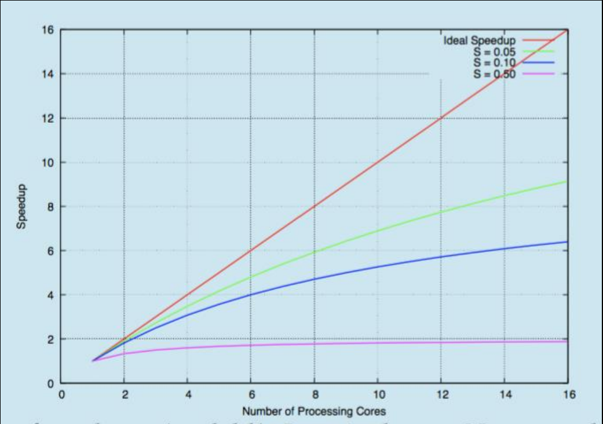

## Kernel e User Threads

I thread possono essere:

* **dell' Utente**: vengono gestiti a **livello utente** da apposite librerie
    * POSIX pthreads
    * Windows threads
    * Java threads
* **del Kernel**: vengono gestiti dal **Sistema Operativo**


## Modelli MultiThread

* **Many to One**:
    * **Più thread** vengono mappati con un **unico thread** del **kernel**
    * il blocco di un thread causa il **blocco di tutti** gli altri
    * più thread potrebbero **non** essere **eseguiti** in **parallelo** perchè può esistere solo un thread a livello kerner (**è poco utilizzato**)<br>
* **One to One**:
    * **Ogni thread** a livello **utente** viene mappato con un **thread** del **kernel**
    * C'è **più concorrenza** del modello Many to One
    * Il **numero** di thread per processo può essere **limitato** per via del sovraccarico<br> 
* **Many to Many**:
    * Mappa **più thread** a livello **utente** con **più thread** a livello **kernel**
    * Ci sarà sempre un **numero sufficente** di **thread** kernel e quindi non ci sarà bisogno di limitare il numero di thread (a differenza del One to One)
    * Non è un modello molto comune<br> 
* **Two-Level**:
    * Simile al Many to Many ma permette di associare anche un solo user thread ad un solo kernel thread.<br> 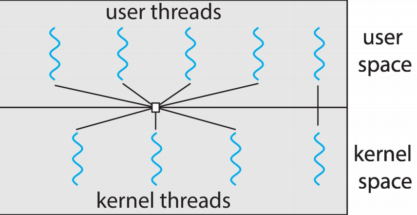

## Impliciti ed Espliciti

Fino adesso abbiamo parlato di **thread esplicti** che devono essere **gestiti** dal **programmatore** tramite delle **API** (Application Programming Inteface) :bee:.<br>
Esistono anche i **thread impliciti** che vengono **gestiti** in tempo reale dal **compilatore** utilizzando delle librerie dedicate.

## Gestione dei Segnali

I segnali sono usati dai **sitemi UNIX** per notificare ad un processo l'avvenimento di un particolare **evento**.<br>
Per la gestioni di questi segnali viene utilizzato un **signal handler**.

* Il segnale viene **generato** da un evento
* Il segnale viene **inviato** al processo
* Il segnale viene **gestito** da 2 tipi di signal handler:
    * default
    * user-defined

Tutti i segnali hanno un gestore di default che il kernel usa per gestire il segnale a meno che non viene sovrascritto dall'utente.

In un modello multithread i segnali possono essere mandati a:

* al thread interessato
* a tutti i thread del processo
* alcuni thread del processo
* designare un thread specifico per ricevere tutti i segnali del processo

## Cancellazione

Per cancellare un thread ci sono 2 approcci:

* **Cancellazione Asincrona**: **termina** il thread bersaglio **immediatamente**
* **Cancellazione Differita**: permette al thread bersaglio di **controllare periodicamente** se deve essere **cancellato** oppure no

La cancellazione di un thread in linux viene gestita tramite i segnali.

## TLS

Ad ogni thread viene assegnata una propria copia di dati chiamata TLS (**Thread Local Storage**).<br>
È diversa dalle variabili locali, perchè è **visibile** da tutte le invocazioni di **funzioni** del thread ed è **univoca** per ogni thread. Può essere utile quando non si ha il controllo del processo di creazione del thread.

## Processi Lightwaight

Per **mantenere** il numero di **thread** del kernel **allocati** vengono usate delle **struttre dati intermedie** chiamate Processi Lightwaight.<br>
Ogni Processo Lightwaight è collegato ad un thread del kernel, può essere visto come un **processore virtuale** sul quale il processo può pianificare il funzionamento dell'user thread.


# Scheduling

L'obbiettivo dello scheduler è di **massimizzare** il **tempo** di utilizzo della **CPU** e questo viene raggiunto con la **multiprogrammazione**.

Un **ciclo di esecuzione** di un processo consiste in un **periodo di esecuzione** e un **periodo di attesa** dell'input/output.

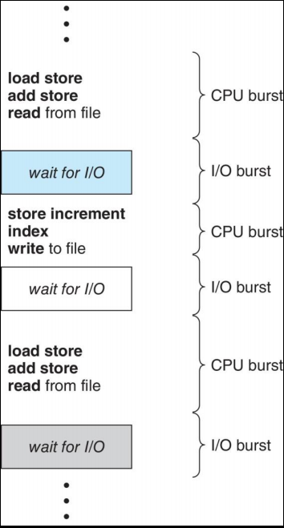

Lo scheduler della CPU sceglie uno tra i processi nella coda ready e gli assegna un core (lo esegue).

Le decisioni dello scheduler possono avvenire quando:

1. Un processo passa dalla coda di **running** a quella di **wating**
2. Un processo passa dalla coda di **running** a quella di **ready**
3. Un processo passa dalla coda di **waiting** a quella di **ready**
4. Termina

Per la situazione 1. e 4. non ci sono decisioni da prendere per lo shceduling: un nuovo processo deve essere messo in esecuzione.<br>
Invece per i putni 2. e 3. lo scheduler deve effettuare delle scelte.

Se lo scheduling che avviene solo nelle situazioni 1. e 4. viene detto **nonpreemptive**, ovvero, lo scheduler **non può rimuovere** un processo dal **core** della cpu se non quando va in wait o termina.<br>
Lo scheduler viene detto **preemprive** quando può **rimuovere un core** assegnato ad un processo.

Quando i processi hanno dati condivisi e vengono gestiti con uno scheduler preemptive possono dare luogo a race condition.

## Dispatcher

Il dispatcher si occupa del **cambio di contesto** tra un processo e un altro. Questo provoca un "tempo morto" dato che il processo deve essere fermato, salvato il suo contesto nel PCB e ripristinato il contesto del prossimo processo da eseguire.


## Criteri dello sheduler

* **utilizzo della CPU** (da massimizzare): mantenere la CPU più **impegnata** possibile
* **Throughtput** (da massimizzare): numero di processi che vengono completati per unità di tempo
* Tempo di **Tournaround** (da minimizzare): tempo necessario per eseguire un particolare processo
* Tempo di **attesa** (da minimizzare): tempo di attesa di un processo nella coda di ready
* Tempo di **Risposta** (da minimizzare): tempo trascorso da quando una richiesta viene effettuata a quando viene soddisfatta

## Algoritmi di Scheduling

### FCFS 

**First Cum First Served** :sweat_drops:

Il primo processo che arrivà è il primo ad essere eseguito

Il tempo di attesa medio dipende dall'ordine di arrivo dei processi

### SJF

**Shortest Job Fist**

Il processo con minor tempo di completamento viene eseguito.<br>
È un algoritmo ottimo e minimizza il tempo di attesa dei processi.

La versione preemptive viene chiamata Shortest Remaining Time First.

### RR

**Round Robbin**

Imposta un limite di tempo **q** (quantum: 10-100 ms) per l'esecuzione di ogni processo e quando questo scade, il processo viene fermato e posto in fondo alla ready queue per poi passare ad eseguire il processo successivo.

Se q è piccolo deve comunque essere **più grande** del tempo di **Context Switch**, altrimenti il tempo di **overhead** è troppo **alto**.


### Priorità

Ad ogni processo viene assegnato un **numero** che rappresenta la sua **priorità** (più basso più importante). La CPU esegue i processi dal più importante al meno importante.

C'è il problema dalla **starvation**: i processi con priorità bassa potrebbero non essere mai eseguiti, quindi per risolvere questo problema si utilizza la tecnica dell'**invecchiamento**: i processi vengono aumentati di priorità con il passare del tempo.

#### Multilevel Queue

Per ogni priorità c'è una **coda differente** e parte ad eseguire i processi dalla coda di priorità maggiore.

 

## Thread Scheduling

Quando c'è il supporto per i thread, sono questi ad essere schedulati invece che i processi
C'è differenza tra lo scheduling degli user-thread e dei kernel-thread:

* **user-thread**: vengono utilizzati sui modelli **Many to One** e **Many to Many**
    * viene utilizzato un **sistema di priorità** definito dal **programmatore**
    * vengono utilizzati gli **LWP**
    * vengono chiamati **PCS**
* **kernel-thread**: c'è **competizione** tra tutti i thread del sistema e vengono chiamati **SCS**

### MultiProcessor Scheduling

Lo scheduling della CPU è più complesso quando si hanno a disposzione più CPU.<br>
Il **multiprocesso** può essere una delle seguenti archietture:

* **CPU multicore**
* **Core MultiThread**
* **NUMA**
* **Multiprocesso Eterogeneo**

#### SMP

**Symmetric multiprocessing**, ogni processore si **schedula in automatico**

* Tutti i thread possono essere in una **ready queue comune** (a)
* Ogni processore può avere una **ready queue privata**


### MultiCore Processors

Ultimamente si tende a mettere** più core** nello **stesso chip fisico**, questo è **più veloce** e consuma **meno energia**. Si utilizzano più core contemporaneamente e quando un core va in stallo si da priorità all'altro.


### MultiThread MultiCore Systems

Si utilizzano **più thread** nello **stesso core** e durante lo stallo di memoria viene fatto eseguire un altro thread così da velocizzarne l'esecuzione.

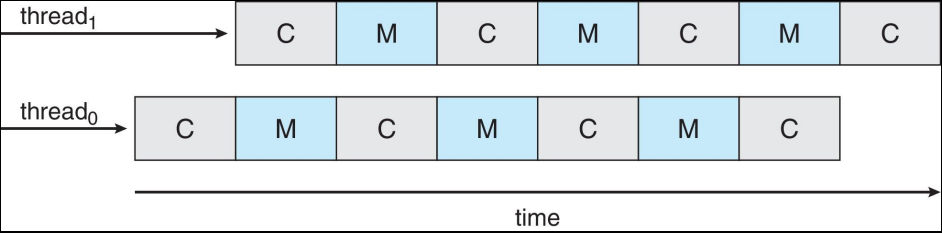


Ci sono due livelli di schedulitng:
    * Il sistema operativo decide quele **thread software** far **eseguire** nei **thread logici** della CPU
    * Ogni **core** decide quale **thread logico** fare eseguire nel core fisico

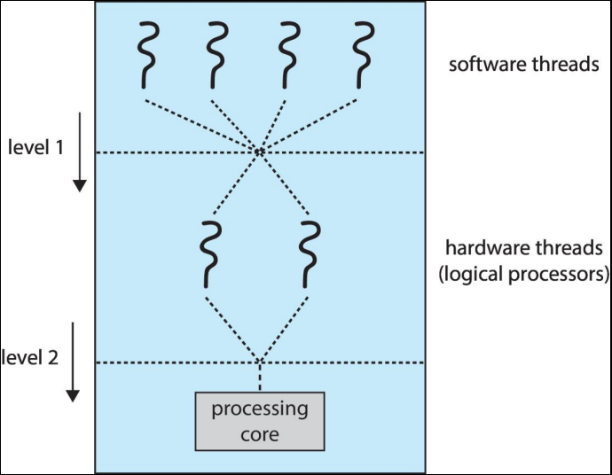

### Bilanciamento del Carico

La **SMP** deve tenere tutte le CPU al lavoro per un fattore di efficienza utilizzando:

* **Bilanciamento del Carico**: tiene il **carico coputazionale distribuiti** tra tutte le CPU
* **Push Migration**: **periodicamente** viene **controllato** il **carico di ogni CPU** e se troppo alto questo viene reindirizzato ad altre CPU
* **Pull Migration**: le **CPU** in **IDLE** vanno a **richiedere del carico** alle CPU impegnate

### Affinità

L'affinità di un thread è definita dal fatto che per più tempo un thread viene eseguito su una CPU più la sua **memoria chache** sarà **piena** di **riferimenti** alla memoria di quel thread, quindi il bilanciamento del carico potrebbe spostare quel thread da una CPU affine a una meno affine rallentando perciò il tempo di esecuzione.<br>
Per ovviare a questo problema si utilizzano:

* **Soft Affinity**: il sistema operativo prova a manternere l'esecuzione del thread nel Core affine, **ma non è al 100% garantita**
* **Hard Affinity**: **garantisce al 100%** che un thread che lavora su una CPU affine non verrà mai spostato su una CPU meno affine.

## Real Time CPU Scheduling

### Real Time System

* **Soft Real Time System**: i **task Critici** hanno la **priorità** più **alta** ma non si ha garanzia che saranno eseguiti per primi
* **Hard Real Time System**: i task devono essere **eseguiti prima** della loro **deadline**

### Latenza di un Evento

La latenza di un evento è l'ammontare del **tempo** che passa da quando un evento **accada** a quando è **eseguito**<br>
Ci sono 2 tipi di latenze:

* **Interrupt**: il tempo da quando arriva il segnale di interrupt a quando viene iniziata la routine di interruzione
* **Dispatch**: il "tempo morto" impiegato per cambiare processo


### Scheduling su Priorità

* Per lo scheduling real time, lo scheduler deve supportare un priority based scheduling preemptive, ma garantisce solo il soft real time
* Per lo scheduling hard real time, deve assicurare l'esecuzione prima delle deadlines

## Su Linux e Windows

### Linux :penguin:

Prima della versione 2.5 funzionava con una variazione dell'algoritmo di shceduling standard per UNIX.

#### 2.5

Ha introdotto un nuovo algoritmo di scheduling chiamato **a ordine costante O(1)**

Caratteristiche:

* È preemptive e basato sulle priorità
* Ha 2 range di priorità: time sharing e real time
    * Il realt time va da 0 a 99
    * I nice values vanno da 100 a 140
* La priorità è costituita da valori numerici (più basso = più importante)
* La priorità più alta ha una q più grande
* I task vengon eseguiti fin quando hanno uno slice di tempo a loro disposizione (task attivi)
* Se non hanno più tempo (task scaduti) non sono eseguibili fino a quando un altro task usa la loro fetta di tempo
* Tutti i task eseguibili sono inserite in una coda di esecuzione (runqueue), formata da 2 array di priorità:
    * attvi
    * scaduti
* I task sono indicizzati in base alla priorità
* Quando non ci sono più task attivi gli arrey vengono scambiati

Questo algoritmo funzionava bene ma aveva una scarsa velocità di risposta per i processi interattivi.

#### 2.6.23

Introduce un nuovo algoritmo: CFS (Completely Fair Scheduling).<br>
Si basa su delle classi di scheduling:

* Ogni classe ha una priorità assegnata
* Lo scheduler esegue il task con priorità più alta nella classe con priorità più alta
* Non si basa su un tile slice fisso, ma è proporzionato al tempo della CPU
* Ci sono due classi di cheduling, ma se ne possono aggiungere anche altre:
    * default
    * real time

Per calcolare le slice di tempo ci si basa sui nice values che vanno da -20 a +19

* Più è piccolo il valore più la priorità è alta
* Calcola la latenza del target: l'intervallo in cui una task deve essere eseguita almeno una volta

Il CFS mantiene una variabile vruntime per ogni task:

* è associata con un fattore di decadimento basato sulla priorità delle task
* bassa priorità, alto fattore
* il virtual run time di un task con priorità normale = runtime effettivo

Per decidere cosa eseguire lo shceduler prende il task con il vruntime più piccolo.


Linux supporta il bilanciamento del carico, è anche NUMA aware.<br>
I domini di scheduling sono un set di core della CPU che possono essere bilanciati l'uno con l'altro. Questi domini sono organizzati in base a ciò che condividono, questa organizzazione c'è per evitare che i thread migrino tra un dominio e l'altro.


### Windows

Windows usa un algoritmo di scheduling preemptive basato sulla priorità.

* il thread con priorità maggiore viene sempre eseguito come successivo
* Il Dispatcher funge da scheduler
* I thread sono eseguti fino a quando:
    * non si bloccano
    * non finiscono il time slice
    * vengon sospesi per far eseguire un thread con priorità maggiore
* I thread real time possono sospednere dei thread non realtime
* Lo schema di priorità ha 32 livelli
    * da 1 a 15 sono Classi Variabili
    * da 16 a 31 sono Calli Realtime
* La priorità 0 è la priorità del thread che gestisce la memoria
* C'è una coda per ogni priorità
* Se non ci sono thread da eseguire viene fatto eseguire un thread IDLE

Se avviene un wait, la priorità viene boostata a seconda di cosa ha scaturito il wait. Per esempio, alle finestre in foreground viene dato un boost di priorità di 3x.

Windows 7 ha introdotto l'UMS (UserMode Scheduling):
    * le applicazioni creano e gestiscono thread in maniera indipendente dal kernel
    * è molto più efficente per grandi numeri di thread

## Valutazine degli algoritmi di Scheduling

Per determinare l'efficienza di un algoritmo di scheduling bisogna prima definire dei criteri per valutarlo.<br>
Viene usato un modello deterministico:

* Valutazione di tipo ANALitico
* prende uno specifico e predeterminato carico di lavoro e determina le perfomance di ogni algoritmo su quel carico di lavoro.

Per ogni algoritmo si calcola il tempo di attesa medio minimo


## Formula di Little

La forumla di Little afferma che: in uno stato ottimale, il numero di processi che lasciano la coda deve essere uguale al numero dei processi che arrivano `n = λ * W`.

* n: lunghezza media della coda
* W:  tempo di attesa medio nella coda
* λ: rateo di arrivo medio nella coda

# Strumenti di Sincronizzazione

I processi possono essere eseguiti in maniera concorenziale e possono essere interrotti in qualsiasi momento, anche quando la sua esecuzione non è completata.<br>
Questo accesso concorrenziale può creare:

* inconsistenza dei dati
* race condition

Una race condition si ha quando il risultato finale dell'esecuzione dipende dalla temporizzazione o dall'ordine di esecuzione del programma.

Per mamentenere la consistenza dei dati è necessario un meccanismo che garantisce l'esecuzione ordinata dei processi che cooperano.

_Esempio di Race Conditon:_


## Sezione Critica

La sezione critica è dove si può verificare una race condition.<br>
Quando un processo è nella sua sezione critica nessun altro processo può entrare nella propria sezione critica.<br>
Il problema della sezione critica consiste nella creazione di un protocollo per poterla gestire.<br>
Ogni processo, prima di entrare nella propria sezione critica, deve chiedere il permesso per potervi accedere.

```C
do {
    entry_section();

        critical_section();
    
    exit_section();

    remainder_section();

} while (true);
```

I requisiti per la soluzione del problema della sezione critica sono 3:

* Mutua Esclusione: se un processo P sta eseguendo la sua sezine critica, allore nessun altro processo può eseguire la propria.
* Progresso: se nessun processo sta eseguendo la propria sezione critica e ci sta qualche processo che desidera entrare nella sua sezione critica, allora la selezione del prossimo processo che entrerà nella sezione critica non può essere posposta in maniera indefinita.
(tutti i processi devono poter essere eseguiti)
* Attesa Limitata: deve esistere un limite sul numero di volte che un processo può entrare nella propria sezione critica dopo che si ha ricevuto una richesta di ingresso da un altro processo (per evitare la starvation dell'ultimo processo richiedente il permesso di entrata)

## Metodo degli Interrupt

Una possibile soluzione è quella di utilizzare gli interrupt per gestire la mutua esclusione.<br>
Quando un processo entra nella sezione critica disbilita gli interrupt e quando ne esce li riabilita. Viene utilizzata la variable turn che indica chi ha accesso alla sezione critica. Questa è una soluzione per 2 processi.

Questo garantisce la mutua esclusione ma non il progresso e l'attesa limitata.

## Soluzione di Peterson

È una soluzione per 2 processi.

I processi condividono 2 variabili:

* turno: è un intero che serve ad indicare quale processo ha il permesso di accedere alla sezione critica
* flag: è un array che viene usato per indicare se un processo è pronto per accedere alla sezione critica

Questo metodo rispetta tutti i 3 requisiti della sezione critica.

Questa soluzione funziona solo con architetture single thread ma non con quelle moderne.<br>
Per garantirne il funzionamento su architetture multithreading bisogna usare una Memory Barrier.

## Memory Barrier

### Memory Models

I modelli della memoria possono essere:

* Fortemente ordinata: quando la memoria viene modificata da un processo viene resa immediatamente visibile a tutti gli altri processori
* Debolmente ordinata: quando la memoria viene modificata da un processo può non essere immediatamente visibile dagli altri processori

Una memory barrier è un'istruzione che forza i cambiamenti in memoria ad essere immediatamente visibili da tutti gli altri processori

Quando un'istruzione di memory barrier viene eseguta il sistema si assicura che tutte le operaizoni di load e store sono state completati prima di qualsiasi altra operazine load o store successiva.

## Mutex

Ci stanno delle soulzioni software per risolvere la sezione critica, una di queste è la Mutex Lock che consiste in una variabile booleana che indica se il blocco è disponibile oppure no.

Ha 2 funzioni principali (atomiche):

* acquire(): aquisice il blocco della risorsa
* release(): rilascia la risorsa


_Esempio di mutex:_
```C
while (true)
{
    acquire_lock();

        critical_section();

    release_lock();

    remainder_section();
}
```

### SpinLocks

La mutex necessita di uno SpinLock, un loop all'interno di un thrad che controlla se la risorsa è disponibile (se può aquisire il lock). Il thread rimane in uno stoto di busy waiting: non sta eseguendo operazioni a parte controllare la disponibilità della risorsa.

## Semaferi :vertical_traffic_light:

I semafori sono metodi di sincronizzazini più sofisticati delle mutex.<br>
Sono costituiti da:

* una variabile S: una variabile intera che rappresenta il semaforo
* 2 operazioni atomiche:
    * wait()
    * signal()

Esistono 2 tipi di Semafori:

* Counting: S può variare in un intervallo non ristretto
* Binary: S varia tra 0 e 1 (come la mutex)

Nell'implemetnazione dei semafori bisogna impedire che vengano chiamate contemparenaem sullo stesso semaforo le azioni wait() e signal().

Per eliminare la busy waiting ad ogni semaforo si associa una coda di attesa. Ogni elemento della coda ha 2 attributi:

* Value (int)
* Puntatore al prossimo elemento

La coda ha 2 operazioni:

* block(): mette il processo che la invoca nella coda di attesa
* wakeup(): rimuove uno dei processi nella coda di attesa e lo mette nella coda di ready

Anche con i semafori si possono avere dei problemi di sincronizzazione quali:

* acquisire una risorsa e dimenticarsi di rilasciarla
* rilasciare una risorsa che non era mai stata bloccata
* bloccare una reisorsa per un lungo tempo senza averne bisogno
* usare una risorsa senza averla richeista prima

## Problema dei Filosofi

Ci stanno 5 filosofi intorno ad un tavolo, ognuno dei quali alla propria destra ha una forchetta, al centro del tavolo c'è un piatto di spaghetti e i filosofi possono fare 2 azioni:

* mangiare
* pensare

Le due azioni sono mutualmente esclusive.<br>
Per mangiare il filoso ha bisogno di prendere la forchetta sia di destra che di sinistra.

Questo problema mostra come la sincronizzazione dei processi può evitare deadlock e starvation: se tutti i filosofi provano a mangiare in contemporanea avranno solo accesso ad una forchette e quindi non potranno completare le loro azioni, quindi moriranno di fame.<br>
Se invece provano a mangiare a turni, avranno accesso a tutte le risorse necessareie per completare l'operazione.

## Monitor

I monito sono un'astrazione ad alto livello che fornisce un meccanismo conveniente ed efficacie per la sincornizzazione dei thead.<br>
Sono delle variabili di tipo astratto visibili soltanto all'interno della procedura

Solo un processo per volta può essere attivo all'interno di un monitor.


_Esempio di Uovo del Maestro Calogero:_


### Condition Variables

Sono strumenti per la sincronizzazione delle risorse che consentono 2 tipi di operazioni:

* `x.wait()`: sospende il processo chiamante in attesa che la risorsa sia libera (in atteda si un signal) e lo inserisce in una lista
* `x.signal()`: riprende uno dei processi che attendono la risosra (presenti nella lista di attesa)


### Riprendere un Processo

Per implementare un sistema di priorità su utilizza la conditional-wait sulla conditional variable:

* x.wait(c): dove c è un intero che indica la priorità

Il prossimo processe ad essere eseguito sarà quello con c minore.

### Single Source Allocation

Per allocare una singola risorsa tra più processi in competizione tra loro si può utilizzare un numero che indica il massimo numero di volte che quel processo utilizzerà questa risorsa.

```C
R.acquire(t);
    
    access_the_resource();

R.release();
```
R è un'istanza di ResourceAllocator

## Lievness

La Liveness è un'insieme di proprietà che un sistema deve soddisfare per assicurarsi che i processi continuino.

Processi che attendono all'infinito una risorsa sono un esempio di fallimento della Liveness perchè non garantiscono le proprietà della critical section: 

* Progresso
* Bounded Waiting

### Deadlock

Due processi si dicono essere in uno stato di deadlock quando si trovano ad attendere, in maniera indefiita, un evento che può essere causato da uno dei due.

#### Starvation

È anche detto indefinite blocking, ed è un processo che non verrà mai rimosso dalla coda in cui si trova bloccato.

#### Priority Invertion

Un problema di scheduling che si presenta quando un processo con priorità minore contiene il blocco necessario per far avanzare un processo di priorità più alta.

Può essere risolto con il Protocollo dell'Ereditarietà della Priorità.<br>

Permette che la priroità del thread più alto, che sta attendendo l'acceso ad un risorsa condivisa, potrà essere assegnata al thread che sta correntemente utilizzando la risorsa

## Deadlocks

I sistemi sono composti da risorse:

* che possono essere utilizzate da più entità alla volta
* che possono essere utilizzate da solo un entità alla volta (read-only files)

Un deadlock si verifica quando queste 4 condizioni si verificano simultaneamente:

* Mutual exclusion: solo un processo può accedere alla risorsa
* Hold and Wait: un processo che ha già almeno una risorsa e che sta aspettando di acquisire altre risorse aggiuntive utilizzati da altri processi.
* No Preemption: una risorsa può essere rilasciata solo quando il processo ha completato il suo lavoro.
* Circular Waiting: un insieme di processi che in maniera circolare aspettano ognuno il rilascio di una risorsa bloccata dagli altri.

### Resourche Allocation Graph

_Esempio di grafo di allocazione delle risorse con deadlock:_

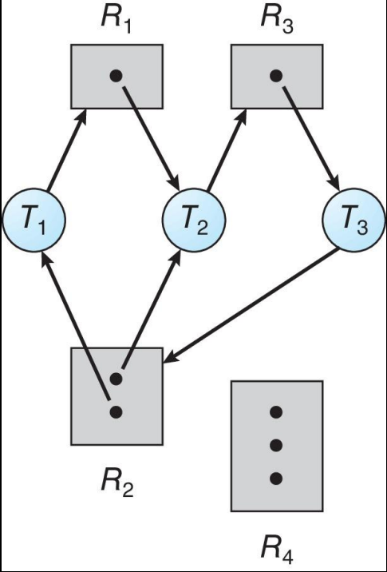

* `R2 → T1`: T1 ha la risorsa R2
* `T1 → R1`: T1 necessita di R1 ma ancora non ne ha accesso

Se un grafo non ha cicli allora NON ha deadlock.<br>
Se il grafo contiene un cilco:

* se c'è solo un istanza per tipo di risorsa c'è un deadlock
* se ci sono più istanze per tipo di risorsa ci può essere la possibilità di un deadlock

#### Claim Edge

Si può introdurre un tipo di arco chiamato claim edge (servirà per la deadlock avoidance) che indica la possibilità di richiesta di una risorsa.

Un Calim Edge può essere convertito in un Request Edge se l'assegnazione della risorsa non porta ad un deadlock.

Quando una risorsa viene rilasciata l'Assignament Edge ritorna ad essere un Claim Edge.


### Prevention

La Prevenzione è una tecnica per evitare deadlock, che vieene utilizzata per invalidare una delle 4 condizioni per il verificarsi di un deadlock :lock::

* Mutual Exclusion: non è richiesta per risorse condivisibili quali read-only files
* Hold and Wait: deve garantire che ogni volta che un processo richiede una risorsa non abbia ostaggio nessun'altra risorsa
* No Preemption: 
    * Se un processo possiede una risorsa ma ne necessita un'altra che non può essergli data immediatamente, allora rilascia tutte le risorse che ha bloccato. Queste risorse sono aggiunte alla lista delle risorse per le quali il processo sta aspettando
    * I processi verranno ripresi solo quando possono ottenere tutte le risorse di cui necessitano
* Circular Wait: impone un ordinamento totale di tutti i tipi di risorse e fa eseguire i processi che necessitano meno risorse

### Avoidance

Richiede che il sistema abbia una disponibilità delle informazioni a priori e il metodo più facile per implementarla è quello di far si che in ogni processo sia dichiarato il massimo numero di risorse necessarie. L'algoritmo antideadlock esamina dinamicamente lo stato dell'allocazione delle risorse per assicurarsi che non ci possa mai essere una condizione di circular wait. Questo stato di allocazione delle risorse è definito dal numero di risorse disponibili, allocate e dalla richiesta massima del processo.


### Safe State

Un sistema si dice essere in un safe state se esiste una sequenza P1, P2, ..., Pn di tutti i processi nel sistema tale che per ogni processo, quel processo può fare richieste che possono essere soddisfatte dalle risorse attualmente disponibili e dalle risorse tenute da tutti gli altri processi che lo precedono.

Questo safe state può essere utilizzato dal sistema per decidere se allocare immediatamente oppure no delle risorse dopo una richiesta effettuata da un processo.

Se un sistema si trova in un safe state allora NON ci sono deadlock.

### Algoritmi per la gestione dei deadlock

#### Avoidance e Prevention

##### Single Istance

###### Algoritmo con Resource Allocation Graph

Controlla che la richeista effettuata dal Claim Edge non comporti la creazione di un cilco e quindi di un deadlock. Se la richiesta più essere soddisfatta trasforma il Claim Edge in Request Edge.


##### Multiple Istance

###### Algoritmo dei Banchieri :bank:

Ogni processo deve dichiarare a priori un massimo numero di risorse che necessita.<br>
Un processo che effettua una richiesta potrebbe dover aspettare. E quando un processo ottiene tutte le risorse necessarie deve rilasciarle in un tempo finito (non può tenerle per sempre).

**Struttura dati:**

* n = numero di processi, m = numero di risorse
* avaiable[m]: array di lunghezza m dove [i] = k, cioè ci sono K istanze libere della risorsa Ri
* max[n,m]: una matrice n * m dove se [i, j] = k, allora il rpocesso Pi può richiedere al massimo k istante della risorsa Rj
* allocation[n,m]: una matrice n*m dove se [i, j] = k, allora il processo Pi ha al momento allocate k istanze della risorsa Rj
* need[n,m]: una matrice n*n dove se [i, j] = k, allora il processo può avere bisogno di altre k istazne della risorsa Rj per completare l'operazione
    * need[i, j] = max[i, j] - allocation[i, j]

**Funzionamento:**

1. Crea 2 array Work[m] e Finish[n] e li inizializza:
    * Work = Avaible
    * Finish[i] = false (perogni i = 0 to n-1)
2. Cerca se esiste una i tale che:
    * Finish[i] == false
    * Need[i,] <= Work
    * se non esiste i passa allo step 4
3. Work = Work + Allocation[i, ]<br>Finish[i] = true<br>Goto step 2
4. Se, per ogni i, finish[i] == true allora è un safe state, altrimenti puoi imbatterti in un deadlock

**Richieste:**

Controlla se la richiesta non supera i limiti delle risorse massime che un processo può avere. Se le supera lancia un errore, controlla se ci sono abbastanza risorse libere da poterle allocare, in caso negativo mette il processo in wait. In caso positivo le assegna e controlla se questo porta ad un deadlock, se non lo fa le risorse gli vengono realmente assegnate. Se invece porta ad un deaddlock ripristina il vecchio stato di safe e il processo viene messo in wait. 

#### Deadlock Detention

Permette al sistema di entrare in deadlock e una volta successo li trova e risolve il problema.

##### Single Istance per Risorsa

Utilizza i wait-for graph:
* ogni nodo è un processo
* un arco indica l'attesa, un arco (i, j) indica che i sta aspettando j

Periodicamente utilizza un algoritmo che trova l'esistenza di un ciclo nel grafo. Se c'è un cilco allora significa che c'è un deadlock.<br>
Questo algoritmo impegna O(n^2) operazioni.

_Esempio di conversione da RAG a WFG:_


##### Multiple Istance per Risorsa

Si utilizza un algoritmo simile a quello di Banchieri.

**Struttua dati:**

* n = numero di processi, m = numero di risorse
* avaiable[m]: array di lunghezza m dove [i] = k, cioè ci sono K istanze libere della risorsa Ri
* allocation[n,m]: una matrice n*m dove se [i, j] = k, allora il processo Pi ha al momento allocate k istanze della risorsa Rj
* request[n,m]: una matrice n*n dove se [i, j] = k, allora il processo sta richiedendo altre k istazne della risorsa Rj

**Funzionamento:**

1. Crea 2 array Work[m] e Finish[n] e li inizializza:
    * Work = Avaible
    * Per i = 1, ..., n se Allocationio[i, ] != 0 allora Finish[i] = false, altrimenit Finish[i] = true
2. Cerca se esiste una i tale che:
    * Finish[i] == false
    * Request[i,] <= Work
    * se non esiste i passa allo step 4
3. Work = Work + Allocation[i, ]<br>Finish[i] = true<br>Goto step 2
4. Se, per qualche i compreso tra 1 e n, finish[i] == false allora il sistema è in deadlock e nello specifico se Finish[i] == false allora il processo Pi è in deadlock.

Questo algoritmo utilizza O(m * n^2) operazioni per scoprire se il sistema è in deadlock.

#### Detection Algoritm Usage

Se gli algoritmi di scoperta dei deadlock vanno utilizzati con criterio, altrimenti si potrebbero imbattere in più cicli e non sarebbe possibile comprendere la causa del deadlock.

### Recovery from Deadlock

#### Process termination

Ci sono 3 possibilità per risolvere un deadlock con la process termination:

* Uccidere tutti i processi in deadlock
* Uccidere un processo alla volta finche il deadlock non termina.
* Uccidere secondo un ordine:
    1. Priorità
    2. Per quanto temo è stato eseguito e tempo previsto per il completamento
    3. Risorse utilizzate
    4. Risorse di cui ha bisogno per il completamento
    5. Quanti processi dovranno essere temrinati
    6. Il processo è interattivo o batch

#### Resource Preemption

Scegliere una vittima minimizzando il costo per poi eseguire il Rollback: ritornare ad un safe state precedente di quel processo.<br>
Questa operazione può portare a starvation perchiò bisogna includere il numero di rollback quando si va a selezionare una vittima.

# Memoria Principale

I programmi per essere eseguiti devono essere spostati dalla memoria di archiviazione all RAM.<br>
La RAM e i registri sono le uniche memorie alle quali il processore può accedere direttametne.<br>
La RAM vede solo uno stream di:

* indirizzi + richieste di lettura
* indirizzi + dati + richieste di scrittura.

Ogni tipo di memoria ha una velocità di accesso differente e l'accesso ai registri viene effettuato in un ciclo di clock o anche meno. L'accesso alla RAM può richiedere molti cicli causando uno stallo.<br>
La cache è una via di mezzo tra la RAM e i Registri.

## Protezione 

Per garantire il corretto funzionamento del sistema è neccassario garantire la protezione della memoria, perciò i processi possono solo accedere agli indirizzi di memoria presenti nel suo spazio di indirizzamento.<br>
Questo può essere garantito tramite l'utilizzo di due registri "limite":

* base: indirizzo da dove parte l'area di indirizzamento
* limit: indirizzo oltre il quale il processo non può accedere

Questi registri definiscono lo spazio di indirizzamento logico del processo.


La CPU deve controllare ogni accesso di memoria effettuato dal processo per assicurarsi che sia entro quei limiti.<br>
Le istruzioni per controllare i registri base e limit sono privilegiate.


## Address Binding

I programmi sulla memoria secondaria, che sono pronti ad essere portati nella RAM, formano una coda di input che senza nessuno supporto, deve essere caricata nell'indirizzo 0000, ma questa azione non è conveniente.

Gli indirizzi sono rappresentati in maniera diversa durante la vita del programma:

* Il codice sorgente ha indirizzi simbolici
    * int a;
* Il codice compilato ha indirizzi relocabili
    * 14 byte dall'inizio del modulo
* Il linker o loader eseguono il binding degli indirizzi relocabili a indirizzi assoluti
    * 14014
* L'operazione di binding mappa univocamente uno spazio di indiirzzamento ad un altro

Il Binding può essere effettuato in 3 stadi differenti:

* Compile Time: se le locazioni di memoria sono conosciute a priori, su può generare il codice assoluto e va ricompilato se gli indirizzi di partenza vengon cambiati 
* Load Time: deve generare un codice rilocabile se le locazioni di memoria non sono conosciute a tempo di compilazione
* Execution Time: assegna gli dinirizzi di memoria durante l'esecuzione del programma. Necessita di un supporto hardware (e.g. base e limit registri)

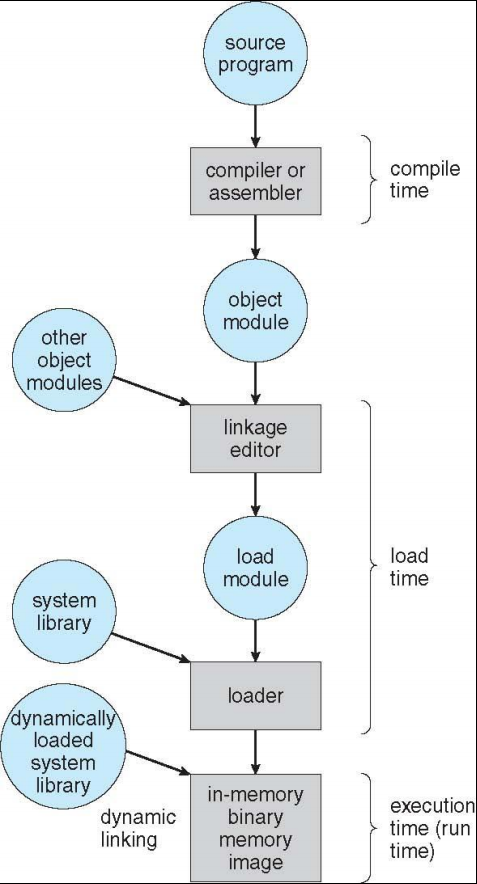

## Spazzi Di indirizzamento

Gli spazzi di indirizzamento si dividono in 2 tipi:

* Logico: l'insieme di tutti gli indirizzi logici generati dal programma
    * vengono generati dalla CPU
    * sono chiamati indirizzi virtuali
* Fisico: l'insieme di tutti gli indirizzi fisici generati dal programma
    * sono quelli visibili dalla RAM

Questi due tipi di indirizzi differiscono solo a tempo di esecuzione e per lo schema di address binding.

## MMU

Memory Management Unit è un componente hardware che serve a mappare gli indirizzi fisici e virtuali a tempo di esecuzione.

Può essere realizzata in vari modi.


Con questo metodo i programmi utilizzano solo gli indirizzi logici e non vedranno mai quelli fisici di cui si occuperà la MMU.

## Dinamic Loading

Non semplre il programma deve essere presente interamente in memoria per essere eseguito, ma può essere caricato in maniera dinamica, questo garantisce un miglior utilizzo dello spazio di memoria perchè le routine vengono caricate solo quando vengono chiamate.<br>
Deve essere implementato completametne dal programmatore anche se il SO fornisce delle libreria per agevolarlo.

## Linking

Il linking può essere di 2 tipi:

* Statico: le librerie di sistema e i programmi sono combinati in forma binaria dal loader
* Dinamico: il linking viene postposto fino a tempo di esecuzione

Per trovare l'area di memoria in cui risiedono le librerie vengon usati piccoli pezzi di codice chiamati Stub che vengono rimpiazzati con l'indirizzo della routine quando viene eseguita.<br>
Questo sistema è conosciuto anche con il nome di Librerie Condivise.

## Allocazione Contigua

Uno dei primi metodi di ottimizzazione è quello dell'Allocazione Contigua.

La RAM deve supportare si i processi del SO che dell'utente, poichè dispone di risorse limitate deve usarle in maniera efficiente.<br>
Per questo la RAM viene divisa in 2 parti:

* parte bassa: in cui viene caricato il SO (parte dal basso)
* parte alta: in cui vengono caricati i vari processi. (parte dall'alto)

Utilizza i ragistri base e limit e la MMU mappa gli indirizzi in modo dimanico.
  


### Partizionamento Variabile

Buco: un blocco di memoria disponibile.<br>
Quando un processo termina la sua esecuzione libera la memoria in RAM lasciando un buco. Questi buchi vanno uniti tra di loro per garantire una gestione efficente della memoria.


Quando la RAM ha una richiesta bisogna controllare come assegnargli la memoria in base ai buchi:

* First Fit: alloca il primo buco di memoria abbastanza grande da contenere il processo
* Best Fit: alloca il più piccolo buco abbastanza granda da contenere il processo, ma, se la lista non è ordinata, va controllata tutta
* Wort Fit: alloca il più grande buco al processo, deve comunque controllare tutta la lista e si lascia deitro altri buchi

Il first fit e il best fit sono più efficienti del Worst Fit.

## Goal della Gestione della Memoria

* Fare un uso efficente della memoria disponibile
    * Fornire livelli aumentati di concorrenza
    * Fornire alta utilizzazione

Non è così importante dove la memoria è poco costosa, ma è molto importane in sistemi piccoli che vanno a batteria e dove si ha memoria molto limitata.

* Supportare i vari paradigmi di memoria usati dai linguaggi di programmazione
    * Memroia Dinamica (garbage collector)
    * Moemoria Non dinamica
* Sicurezza e Robustezza
    * Rednere più difficile agli utenti di fare danni (accedere ad aree di memoria proibite)

## Delegazione

Il Sistema Operativo fa decisioni a "grana grossa" allocando grandi spazi di memoria al processo.<br>
Il runtime package fa decisioni a "grana fina" e quindi distribusice piccoli pezzi di memoria al'interno del processo.<br>
Questo si basa sull'aspettativa che le task individuali sappiano più cose riguardo al codice e quindi possano gestire meglio la memoria

## Strategie 

Ci sono 4 strategie diverse in base al sistema:

* monoprogramming
    * le task dell'utente vengono gestite internamente dal programma<br>
    
* multiprogramming con partizioni fisse
    * Divide la memoria in una partizione per ogni task. Può succedere che ad un processo gli viene allocata più memoria del necessario e questo si chiama frammentazione interna. Bisogna cercare di limitare al minimo questo spreco.<br>
    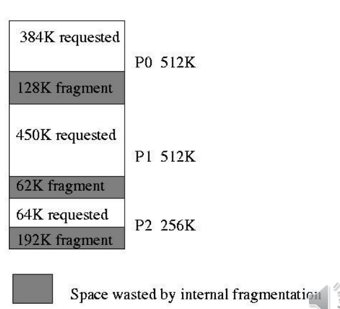
* multiprogramming con partizioni variabili
    * Bisogna provare a mantenere la memoria libera untia, bisogna allocare solamente quanto necessario ai task. Dividere e riunire i blocchi di memoria consuma cicli della CPU. I residui di memoria troppo piccoli per essere utilizzati formano la frammentazione esterna.
* buddy system

## Goals della Memoria Virtuale

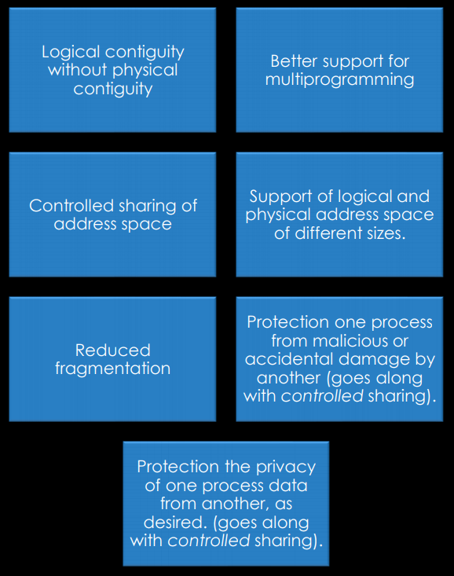

## Un idea di base

L'hardware e il SO devono cooperare per fornire una mappatura da uno spazio di indirzzamento virtuale ad uno fisico che deve essere completametne trasparente all'utente e avere un impatto minimo sulle performance.<br>
Ci sono 2 strategie:

* Paginazione: divide lo spazio di indirizzametno in sottospazi di dimensini uguali chiamate pagine
* Segmentazione: divide lo spazio di indirizzamento in parti non uguali che possono essere più appropriate per i vari programmi.

Queste 2 possono essere usate insieme.<br>
La paginazione è più semplice da implementare della segmentazione.

## Frammentazione

* Esterna: esiste sufficiente spazio per soddisfare la richiesta ma non è contiguo
* Interna: la memoria assegnata ad un processo può essere più grande di quanto ne necessita.

Per ridurre la frammentazione esterna si eseguono delle operazioni di compattazione: riunisce tutti i blocchi di memoria liberi per crearne uno solo grande blocco libero. Questa operazione è possibile solo se la rilocazione è dinamica ed è fatta al tempo di esecuzione.

## Paginazione

> per me si va nella città dolente, per me si va nell'eterno dolore, per me si va tra la perduta gente ... Lasciate ogne speranza, voi ch'intrate'

Divide la memoria fisicia in unità di memoria di ugali dimenzioni chiamati frames. La loro dimenzione è una potenza di 2 per migliorare la prestazione dell'hardware di supporto.<br>
Divide la memoria logica in unità chiamate pagine aventi la setssa dimemnzione dei frame.

Definisce la mappatura dalla memoria logica alla memoria fisica. La mappatura deve essere semplice e veloce ed è fatta di solito con una lookup table.

Un indirizzo virtuale di solito è fatto da 2 campi:

* numero pagina
* offset

Lo spazio di indirizzamente all'interno  di un processo può non essere contiguo, infatti vengono allocati appena la memoria fisica è libera, questo aiuta ad evitare la frammentazione esterna e altri problemi legati ai blocchi di memoria. Aiuta inoltre a tener traccia di tutti i frame liberi.<br>
Per eseguiri un programma che necessita N pagine bisogna trovare N frame liberi per caricarlo.

Viene creata una tabella di pagine per tradurre indirizzi da logici a fisici

Ci può comunque essere frammentazione interna.


### Schema per la traduzione degli Indirizzi

L'indirizzo generato dalla CPU è diviso in:

* Numero di Pagine: usato come indice nella tabella della pagine
* Offset di Pagina: combinato con l'indirizzo di base definisce l'indirizzo di memoria fisica

**Step per la traduzione di un indirizzo:**

* Divide gli indirizzi virutali
* Guarda il numero della pagina
* Concatena il numero del frame con l'offset per produrre l'indirizzo fisico
* Effettua l'acccesso alla memoria fisica


### Implementazione della Page Table

La Page Table viene mantenuta nella RAM tramite:

* Page Table Base Register (PTBR): puntatore alla Page Table
* Page Table Lenght Register (PTLR): indica la dimenzioen della Page Table

Con questo schema ogni accesso ai dati o ogni istruzione richiede 2 accessi alla memoria: uno per la page table e uno per i dati effettivi.

Questo problema può essere risolto utilizzando una speciale tipo di cache chiamata Translation Look Aside Buffer (TLBS) che ha un tempo di lettura molto rapido (anche detta memoria associativa).

#### TLBS

Il TLBS salva i mapping più recenti degli indirizzi virutali a quelli fisici. Esiste in forma hardware ed è invisibile al sistema operativo, però questo può eseguirne un flush su di esso quando avviene un context switch eliminando così le vecchie entries (non eseguire il flush è un errore comune e grave).<br>
Opera alla velocità della cache e molte architetture possono eseguire lookup in Cache e TLB in contemporanea.

Alcuni TLB salvano degli Address Space Identifiers (ASIDs) in ogni entry. Servono per identificare univocamente ogni processo per eliminare l'utilizzo del flush e forniscono una protezione spaziale al processo.

Il TLB ha una dimensione tipica che varia tra le 64 e 1024 entries

Dopo un evento di MISS il valore mancate viene caricato nel TLB per avere un accesso più rapido el volte successive.<br>
Bisogna considerare anche le modalità di rimpiazzametno e alcune entry possono essere fissate per avere permanentemente un rapido accesso.

##### TB MISS

Inseguito ad un evento di MISS la traduzione degli indirizzi deve essere trovata nella tabella della page table e la nuova mappatura deve essere salvata nel TB.

Nelle macchine CISC viene fatto completamente con l'hardware.<br>
Nelle macchine RISC il processo viene gestito dal software, il SO viene informato di un tale evento tramite una trap generata dall'hardware


### Memory Protection

La memory protection è implementata associando un bit di protezione ad ogni frame per indicare se ha accesso di read only  o read write. Possono esser anche aggiunti più bit per indicare altri permessi.

Un altro bit è il Valid-Invalid: viene associato ad ogni elemento della Page Table

* valid: indica che la pagina associata è nello spazio di indirizzamento logico nel processo e quindi è legale
* invalid: la pagina non è nello spazio dell'indirizzamento logico del processo quindi è Illegale 

Per controllare che una pagina sia valida o no si può anche utilizzare il page table lenght register (PTLR)


### Page Size

A secodna della dimenzione delle pagine possiamo avere  o non avere determinati benefici:

* pagine piccole: 
    * gestione della memoria a grana fine
    * più pagine
    * page table più grandi
    * TB più grandi (costoso)
    * Più spazzi in memoria (overhead più grande)
* pagine grandi:
    * gestione a grana grossolana della memorai
    * più frammentazione interna
    * un TB più piccolo (meno costoso)
    * Page Table più piccola (meno overhead)

I problemi principali sono:

* se lo spazio di indirizzameto è per tutto il sistema implica un modello dove i processi si comportano come thread e quindi si perde il concetto di task
* se la page tamble è monolitica (unico livello) avremo page table molto ampia e quindi grande quantità di memoria contigua
* se la page table è multilivello necessiterà di meno memoria contigua ma aumenterà il numero di accessi alla memoria

### Pagine condivise

* Codice Condiviso
    * una copia di codice read only è condivosa tra i processi
    * è simile a molti thread che condividono lo stesso spazio dei processi
    * può essere utile per la comunicazione tra processi se è consentito lo sharing delle pagine read write
* Codice Privato
    * Ogni processo tiene una copia separata del codice e dei dati
    * le pagine di questi dati possono apparire ovuqneu nello spazio di indirizzamento logico


### Struttura della Page Table

Le strutture di memoria per il paging possono diventare enormi utilizzando dei metodi semplici.

La soluzione è quella di dividere le page in unità più piccole in 3 modi:

* Paging Gerarchico
* Hashed Page Table
* Inverted Page Table

#### Paging Gerarchico

Suddivide lo spazio di indirizzamento logico in molte page table.<br>


#### Hashed Page Table

Vengon usate negli spazi di indirizzamento maggiori di 32 bit

Il numero della pagina virtuale viene memorizzato in una tabella hash, quindi la page table contiene una catena di elementi che sono in hash per la stessa locazione.

Ogni elemento contiene:

* Il numero della Pagina Virtuale
* Il valore del frame della pagina mappata
* Un puntatore al prossimo elemento

Cercando il numero della pagina virtuale in questa catena possiamo ricavare il corrispondetne indirizzo fisico.

Nei sistemi ha 64 bit si utilizza una leggera variazione delle Hashed Page Table: Cluterd Page Table. Sono simili alle precedenti ma ogni entry della Page Table si rifierisce ad un cluster.

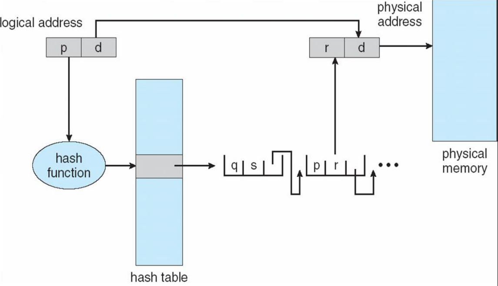

#### Inverted Page Table

Invece di avere una tabella che tiene traccia di tutte le pagine virtuali, terrà traccia di tutte le pagine fisiche.

Ogni riga della nuova tabella rappresenta una pagina fisica. Le entry sono formate dall' indirizzo virutale della pagina memorizzata in quella locazione fisica di memroia.

Con questa strategia avremmo bisongo di meno memoria per memroizzare le page table, ma aggiungeremo tempo per la ricerca della pagina.

Per diminuire il tempo della ricerca si possono usare delle tabelel hash

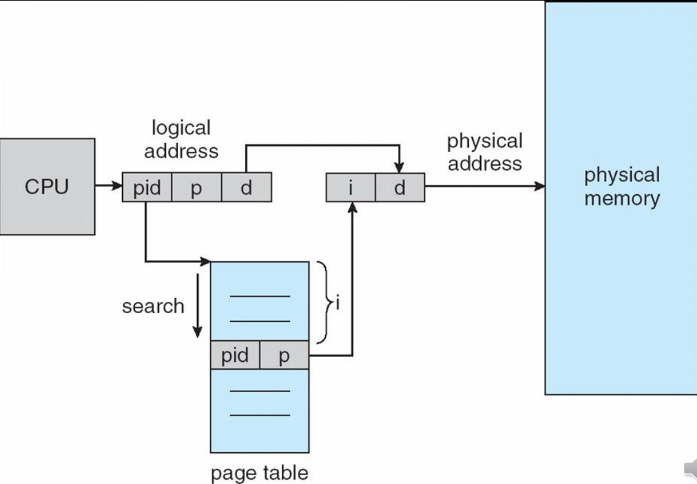

### Swapping

Un processo può essere swappato temporaneamente fuori dalla RAM in un'altra memoria e poi ricaricato in RAM per continuare l'esecuzione. Questo veine fatto perchè potrebbe succedere che tutta la memoria necessaria ai processia sia più grande della RAM.

Backing Store: deve essere un disco veloce e abbastanza grande per accomodare tutte le pagine. Deve fornire un accesso diretto a queste pagine

Roll out, Roll in: una variante di swapping utilizzata per algoritmi di scheduling basati sulla priorità. Processi di priorità più bassa sono swappati fuori per permettere l'esecuzione di processi di priorità più alta per poi essere ricaricati quando sarà il loro turno.

La maggior parte del tempo di swap è quello di trasferimetno che è direttametne proproszionale alla quantità di dati swappati.

Il sistema mantiene una coda di ready di processi pronti per essere riswappati nella RAM

Il context switch con lo swapping può essere molto costoso per il tempo, soprattutto se conivolgie trasferimenti di processi coinvoti in operazion di input e oputpu.

Alcuni programmi possono aver bisogno di essere riswappati nella RAM nelle stesse pagine fisiche soprattutto se ci sono processi conivolti in operazioni di input e output su quelle pagine fisiche.

Sui moderni sistemi operativi lo swapping viene diasbilitato.

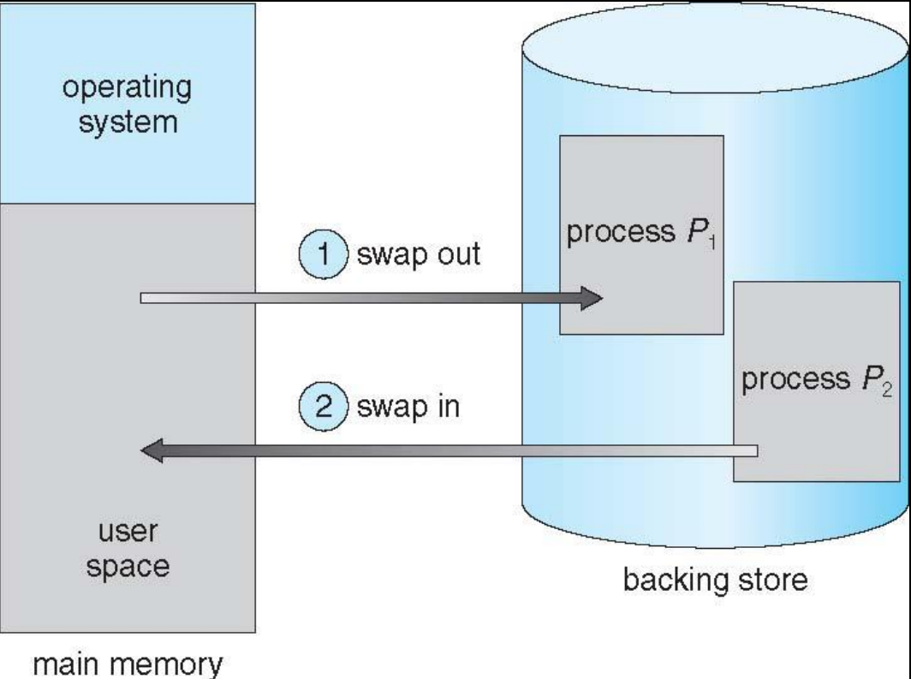

Lo swapping nei sistemi mobili genermalemnte non viene supportato data la scarsa dimenzione dei dischi di supporto.

## Segmentazione

La segmentazione è una tecnica di allocazione di memoria in blocchi di varia dimenzione a differneza di una pagina che ha una dimenzione arbitraria.

Dato che la dimenzione dei segmenti è selezionata dal compilatore la frammentazione interan è ridotta, ma a causa della dimenzione variabile dei segmenti si possono avere di frammentazione esterna e di compattazione.<br>
Per questa ragione la segmentazione è meno utilizzata della paginazione dai sistemi che la supportano.

### Allocazione significativa

Il programma viene diviso in vari segmenti: codice, stack, heap, ecc.<br>
Ad ognuno di questi segmente gli viene allocata esattamente quanta memoria necessitano in modo tale da eliminare la frammentazione interna. Questi segmenti vengono numerati e il loro indirizzo viene rappresetnato da una tupla che consiste in:

* numero del segmento
* offset

### Segment Table

Per la mappatura logica della moria usiamo le Segment Table. Dato che la dimenzione dei segmenti è prestabilita a tempo di compilazione, la dimensione delle Segment Table è fissata a tempo di linkage.<br>
La tabella contiene un entry per ogni segmento e ongi entry è fromata da: base e limit (il buond del segmento).

Poichè ogni programma possiede un proprio spazio di indirizzamento virtuale ogni processo ha una propria segment table. Le segment table dei processi attuali sono mantenute nella RAM e il loro riferimento è in 2 registri hardware:
* Segment Table Base Register (STBR)
* Segment Table Lenght Register (STLR)

In alcune architetture se il segment table è abbastanza piccolo può essere direttametne salvato nei registri della CPU


### Shered Segment

Poichè i segmenti rappresentano le unità logiche del programma sono ideai per essere condivisi.<br>
Per esempio: se abbiamo un segmento di codice che deve essere utilizzato da molti processi, potreemo condividerelo invece di ripercarlo. Bisogna implementare metodi per garantire la sicurezza.

Quando gli array e altre strutture vengon allocate il costo del controllo dei limiti è gratuitio.

### Frammentazione

La segmentazione elimina la frammentazione interna al costo della frammentazione esterna. È possibile, benche sia disponibile un quantitativo sufficente di memoria, essa venga partizionata in piccoli pezzi da segmenti esistenti rendendola inutilizzabile.<br>

I sistemi di compattazione, che sono capaci di rilocare segmeti di processi esistenti, possono ridurre il costo di compattazione rendendo i segmenti allocati fisicamente contigui.<br>
Questo dipende dalla dimenzione dei segmenti e l'operazione è molto costosa perchè richiede molte copie tra le varie memorie.

# I/O

La gestione degli input/output è una componente molto importante nei sistemi operativi. Ci sono molti tipi di device di I/O, ognuno dei quali necessita di metodi di gestione differetni.

Device Driver: incapsula i dettagli del dispositivo, presenta un'interfaccia di accesso al dispositvo per il sottosistema I/O


## Polling

Per ogni byte di I/O:

* Controlla che il busy bit, nel registro di stato, sia 0 (periferica non occupata)
* L' Host setta, a seconda della righiesta, i bit read e write. In caso di write copia i dati nel dataout register
* L'Host setta il biti di command ready.
* Il controller modifica il bit di busy bit ed esegue il trasferimento
* Dopo il traferimento, il controller pulisce il busy bit, bit di errore, bit command ready.

Se durante il trasferimento dei dati il processo viene interrotto si potrebbe perdere qualche informazione, perciò si utilizzano gli Interrupt.

## Interrupt

Sono delle richieste che vengono effettuate dai dispositivi I/O e inviate alla CPU tramite un Interrupt Request Line. Servono per avvertire la CPU che il dispositivo è pronto ad effettuare operazioni. Vengono controllati dal processore dopo ogni istruzione.

Gli interrupt vengono ricevuti dall'Interrupt Handler che si occuperà di gestirli.

C'è un Vettore di Interrupt che serve ad inviare i vari interrupt ai corretti handler. Effettua un context switch all'inizio e alla fine di ogni operazione ed è basato sulla priorità.

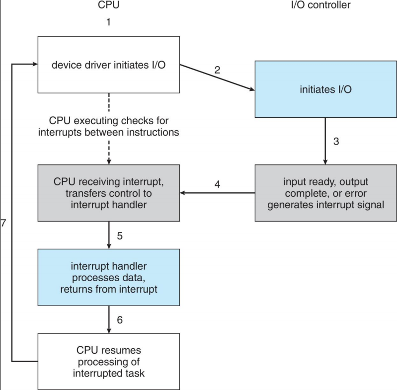

Il meccanismo degli interrupt viene utilizzato anche per la gestione delle Eccezioni.<br>
Sistemi multiCPU possono processare gli interrupt in maniera concorrenziale.

## DMA

Direct Access Memory, viene utilizzato per evitare l'I/O programmato (un byte alla volta) per grandi spostametni di dati.<br>
Necessita di un DMA controller (hardware).<br>
Permette di bypassare la CPU per trasferire dati in maniera diretta tra il dispositivo I/O e la RAM.

## Application I/O Interface

Le system call di I/O incapsulano i comportamenti dei dispositivi in classe generiche.<br>
Per rendere più facile la gestione al Kernel, la stratificazione dei driver nascondono le differenze tra i vari dispositivi.

I dispositivi possono essere molteplici:

* Character Stream o a Blocchi
* Sequenziali o Accesso Random
* Sincroni o Asincroni
* Condivisi o Dedicati
* Sola lettura, sola scrittura, lettura scrittura


## NonBlocking e Asicnroni I/O

* Bloccanti: il processo viene sospeso fino al completamento dell'I/O
    * di facile utilizzo e comprensione
    * alcune necessità non vengono soddisfatte
* NON bloccante: la chiamata dell'I/O è fatta tramite un iterfaccia utente dove i dati vengon copiati in un buffer. Restituiscono tutto quello che è disponibile con una certa rapidità
* Asicnrono: il processo continua durante l'esecuzione dell'I/O
    * è difficiel da utilizzare
    * il sottosistema di I/O segnala al processo quando l'I/O è completato

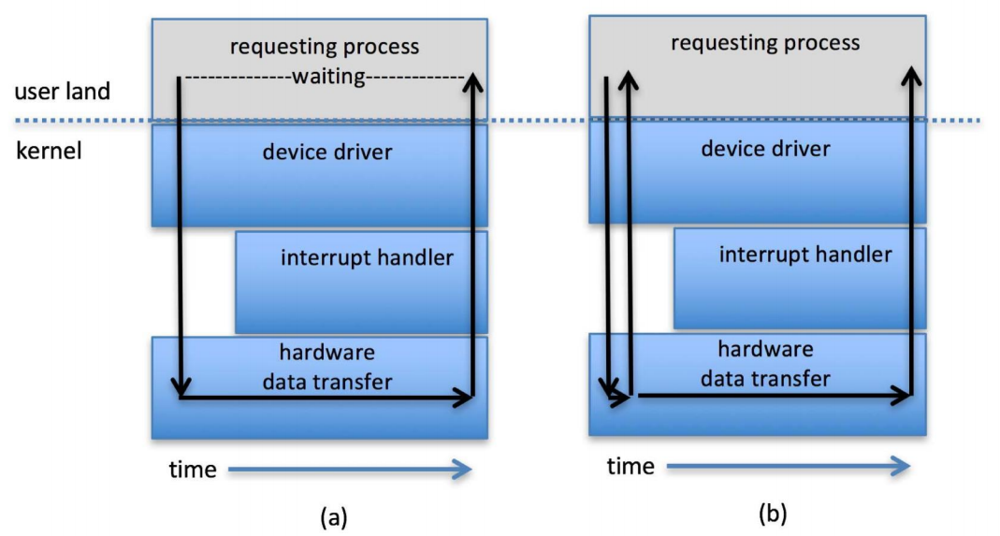

## Kernel I/O Subsistem

Il Sottosistema dell'I/O si occupa del Buffering e dello Scheduling.<br>
Per ogni dispositivo viene tenuta una coda di richeiste.


Il sottosistema gestisce anche

* Caching: tenere una copia dei dati più importanti in cache. È utile per migliorare le performace
* Spooling: server per trattenere l'output di dispositivi che possono completare una richiesta alla volta (stampanti)
* Devise Reservation: garantisce l'esclusività di accesso ad un dispositivo (upsiiii deadlock)

## Error Handling

Gli errori vanno gestiti lanciando eccezzioni per avvisare l'utente dell'errore. Di questo se ne occupa il SO. Alcuni sistemi possono fare una recovery dei dati se sono non raggiungibili o danneggiati.

## Riassuntino

Il sottosistema I/O del kernel deve:

* Gestire il name space per dispositivi e file
* Controllare l'accesso ai file e ai dispositivi
* Controllare le operazioni
* Allocare lo spazio per il File System
* Allocazione dei dispositivi
* Buffering, Caching, Spooling
* Scheduling dell'I/O
* Monitoragglio dello stato dei dispositivi
* Gestione degli errori
* Recovery dei fallimenti
* Configurazione e inizializzazione dei driver
* Gestione energetica dei dispositivi I/O


## Streams

Uno Stream è un canale di comunicazione full-duplex tra un processo a livello utente e un dispositivo.<br>
Uno stream è formato da:

* uno Stream Head Interface con il processo dell'utente
* Driver End Interface con il dispositivo
* nessuno o più moduli di Stream intermedi

Ogni modulo contiene una coda di lettura e una coda di scrittura.<br>
Per comunicare tra di loro viene utilizzato il Message Passing che ha l'opzione di Flow Controll che serve ad indicare se è disponibile o occupato.

Uno stream internamente è Asincrono, ma è Sincrono dove l'utente comunica con la Stream Head


# Memoria di Massa

La memoria secondaria (di Massa), è una memoria che contiene grandi quantià di dati che non devono essere persi quando il computer viene spento (memorie NON volatili).


Sui dischi SSD per poter sovrascrivere dei dati bisogna prima cancellare i dati presenti in quel settore e solo dopo riscriverci sopra. Inoltre questi dischi possono eseguire le operazioni di cancellazione solo un tot di volte prima di rovinarsi.

Il nastro amgnetico viene ancora utilizzato pechè ha una durata di vita molto più lunga dei normali dischi e permette di conservare i dati molto piùa lungo.

## Strutture dei Dischi

Come la RAM anche i dischi vengono divisi in blocchi logici e fisici. I blocchi logici sono memorizzati in un array monodimenzionale mappato sopra i settori del disco. Si parte dai settori esterni fino a quelli interni.<br>
Ci possono essere anche dei settori corritti (non vengono messi nell'array) che possono essere ripristinati tramite procedeure come la formattazzione o altre procedure che non la comportano.

Quando si va ad eliminare i dati nel disco non si eliminano effettivametne i dati fisici, ma si azzera il puntatore presente nell'array facendo vedere che punta a blocchi vuoti (questo permette il data recovery).

Il file system potrebbe corrompersi (e.g rimozione insicura di una chiavetta USB).<br>
Il mapping viene fatto durante la formattazione.<br>
Dato che l'occupazione è sequenziale e dato che non è possibilie la sovrascrittura al volo se lo spazio finisce verrà restituito un errore.

Il trasferimento dei dati viene fatto tramite un particolare processorre: Il controller.<br>
Verranno scritti nel controller dell'host dei comandi utilizzando delle porte specifiche I/O.
il controller host manda il messaggio messaggio al controller interno al disco.
Ci sarà un'autorizzazione e i dati, tramite il DMA verranno trasferiti e scritti all'interno dei settori fisici del disco.

## HDD Scheduling

Il SO è responsabile dell'uso efficente dell'hardware e deve minimizzare il tempo di ricerca del settore a seconda della banda (la quantità di informazione che il dispositivo può scambiare) a disposizione.

Ci possono essere molteplici entità che effettuano richieste I/O:

* SO
* Processi del Sistema
* Processi Utente

In passato il SO doveva mantenere una coda di queste richieste per ogni device, ma adesso questa funzione viene eseguita dal controller interno dei dispositivi. Questi però possono gestire code piccole, perciò vengono utilizzati algoritmi per ottimizzare lo scheduling I/O.

## Error Correction/Detection

* Error Detection: identificazone dell'errore (tipo il checksum). Si può decidere di interrompere l'operazioe o anche di correggere l'errore
* Error Correction: oltre che identificare l'errore lo corregge.

## Formattazione

* Formattazione a basso livello: divide fisicametne il disco in vari settori
* Formattazione logica: crea il file sytem e lo rende disponibile
* Partizionamento: crea un disco virtuale all'interno del disco fisico

## Gestione dello Storage Device

Le partizioni possono essere montate all'accenzione del sistema o in seguito manualmente. Al momento del mounting la partizione va verificiata. Vengono controllati i metadati e se questi sono corretti il disco viene aggiunto ad una tabella di mount, altrimenti si tenta la correzzione e si riporva la fase di mount.

La partizione di Root contiene il SO.<br>

La partizione di Boot contiene all'inizio l'MBR (Master Boot Record) che contiene l'inizio del SO. L'indirizzo del MBR è contenuto nella ROM e all'avvio del computer viene montata la partizione a cui punta il MBR.

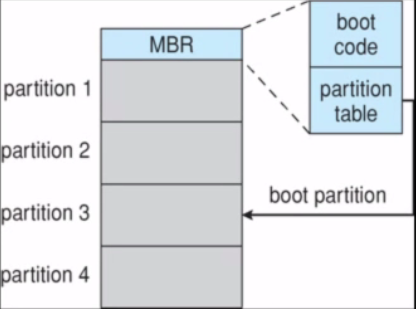

## Swapping

Un disco può anche contere una partizione di Swap, che verrà utilizzata per lo swapping dei processi. Solitamente viene preallocata.

## RAID

Redundant Arry of Inexpensive Disks

Vengon utilizzati quando un sistema non può permettersi di bloccarsi se un hd si rompe.<br>
Viene utilizzato un sistema di dischi ridondate, ovvero il contenuto di un disco viene copiato in un altro disco. In questo modo se un disco si rompe il sistema è in grado di riprendere il funzionamento con il disco secondario.


## Deframmentazione

È simile al concetto di frammentazione esterna nella RAM e quindi le locazini di memoria vuote devono essere disposte sequenzialmente per risolver il problema della frammetnazione.<br>
Nei nuovi SO questa operazione viene fatta in automantico quando server (prima di Windows 8 era manuale).

# File System

Il file system è un interfaccia comune che astrae la complessità del sistema di sotring dei dati.<br> 
È :

* Comune
* Efficiente
* Di facile utilizzo

I dispositivi vengono divisi in Partizioni, le quali contengono Volumi.<br>
I Volumi possono essere spalmati su più partizioni.<br>
Ogni volume è di solito formattato con un file system. Esistono vari tipi di file system.

Dala punto di vista dell'utente il file system è composto da 2 elementi:

* file 
* cartelle

Dal punto di vista del sistema operativo è molto differente perchè i file sono semplicemente delle stringhe di byte tranne che per i file eseguibili, che dipendono dallo specifico sistema operativo.

## File

Un file è uno spazio di indirizzamento logico contiguo.<br>
Può essere di 2 tipi:

* Dati: possono essere numeri, caratteri, binari
* Programmi

### Scelte

La scelta principale è tra:

* Più Formati:
    * Codice di sistema più pesante
    * Incompatibilità delle applicazioni
    * Gestione efficiente senza ridondaza per formati speciali
* Meno Formati:
    * Codice di sistema più leggero
    * non ha le caratteristiche del precedente

### Struttura Fisica

La struttura fisica del file è divisa in blocchi (gruppi di Settori), chiamati Record Fisici.<br>
Abbiamo anche i Record Logici che saranno inclusi nei Record Fisici.<br>
I record fisici sono formati da 1 o più blocchi.<br>
I Blocchi servono per scambiare informazioni con le librerie.<br>
Cambiare la dimenzione dei blocchi influenza la gestione della memoria e quindi lo spreco della memoria di massa.

Ci sono diverse strutture:

1. Sequenza di Byte
2. Sequenza di Record
3. Indexed File (struttura ad albero, simile ad una lista linkata)

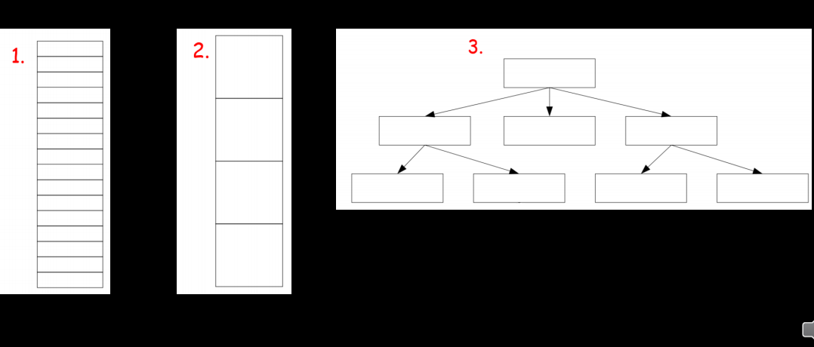

## File System Logico

<!-- su questa parte non si capiva un cazzo -->
Gestisce le informazini dei metadati, le directory e la protezione (usa un santino).

La posizione dei file viene gestita con i blocchi di controllo.<br>
Per ridurre la ridondanza si utilizzano un sistema di Layering.

_Modello di file system a livelli:_
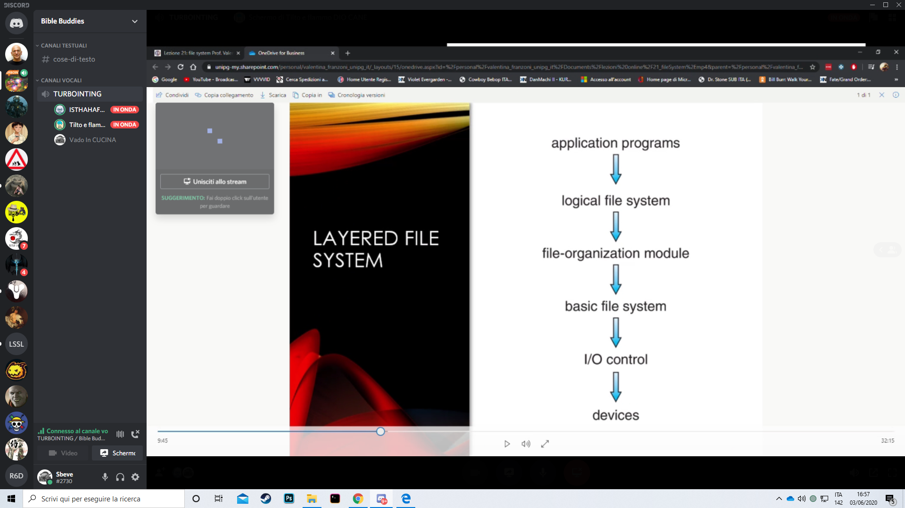

## Attributi dei file

* Nome
* Identificativo: numero univoco
* Tipo
* Locazione: posizone sul dispositivo
* Dimenzione
* Protezione: i permessi RWX
* Dati realtivi al tempo
* Informazione sulla struttura della directroy
* Altre cazzate

## Metodi di accesso

In base alle caratteristiche fisice del dispoitivo ci sono 3 tipi di accesso:

* sequenziale:
    * è il più semplice
    * deve esser indicato il punto da leggere o scrivere
    * non è possibile la riscrittura diretta (bisogna riposizionarsi)
* diretto:
    * sarà possibile se ho record logici di lunghezza fissa
    * è possibile la riscrittura
* indicizzato:
    * un indici è una tabella dove c'è una corrispndeza chiave-posizione
    * l'indice deve essere posizionato da qualche parte, può essere tenuto in RAM ma è costoso
        * se l'indice è molto ampio, può essere memorizato sul disco rigiso (meno efficente)

ISAM è un metodo dell'IBM indicizzato e sequenziale.

## Operazioni sui file

* Creazione
* Apertura/Chiusura
* Scrittura/Lettura/Append/Troncamento
* Cancellazione
* Posizionamento
* Leggere e scrivere gli attributi

Oguna di queste operaizoni modifica i file e quindi il file system deve essere aggiornato.

## Implementazione delle Directory

Ci sono vari modi di gestione delle directroy:

* Liste lineari: sono liste di nomi di file posti in sequenza. Righiedono abbastanza tempo, tempo di ricerca lineare.
* Tabelle Hash: saranno utilizzae all'interno di liste lineari con struttura ad Hash. Diminuisce il tempo di ricerca. Dovremmo gestire le collisioni, quando 2 file verranno portati alla stessa posizione. È buono solo se i dati sono di dimenzione fissata o se possono essere utilizzate delle catene di overflow.

## Metodi di allocazinoe

Come i blocchi dei dischi vengon allocati ai file<br>
I vari metodi per allocazione di un file:

* Contiguo:
    * buono per l'accesso sequenziale e Random
* Link:
    * buono per il sequenziale ma non per il random

Va prima dichiarato prima il tipo di accesso e poi scelto il metodo di allocazione migliore.

### Contiguo

Prevede che ogni file occupi un insieme di blocchi contigui.
Nella maggioranza dei casi ottine la migliore performace. È molto semplice perche si deve dare il blocco da cui si parte e il numero di blocchi richiesti per l'allocazione.
Un problema è trovare lo spazio per i fila e gestire la frammentazione esterna.

### Link

Un file viene gestito come una lista linkata di blocchi che termina con un puntatore a NULL.<br>
Non c'è frammentazione estrena e ogni blocco conterrà il puntatore al blocco successivo.
Non c'è bisogno di compattare lo spazio.
Il problema è l'affidabilità, la ricerca di un blocco può richiedere più di un cilco di ricerca.

## FAT
Un esempio è la FAT (File Allocation Table), una variazione dell'allocation Linked.
All'inizio del volume c'è una tabella che viene indiciazzata con un numbero di blocco. Può avere una cache. Quando viene creato un nuovo blocco si aggiorna il puntatore a null della fine della lista con l'indirizzo del nuovo blocco.


## NTFS

È proprietario della Microsoft.<br>
Introduce dei miglioramenti a FAT:

* Supporto ai metadati e strutture dati avanzate
* Affidabilità
* Utilizzo dello spazio di Disco (inserimento di file > 4GB)

## UFS

Unix File System. Utilizza in contemporanea una gestione Contigua e Linkata.


# Sicurezza

La sicurezza è irraggiungibili e può essere visto come una catena, se crolla un anello crolla tutto.<br>
Generalmente il problema principale sono gli errori che può commettere l'uomo (l'anello debole).

Un sistema si dicie Sicuro se tutte le risorse possono essere usate e accesse sempre come viene inteso dal creatore del sistema.

Un intruso o cracker è un individuo che tenta di rompere la sicurezza.<br>
La Minaccia è una potenziale violazione del sistema.<br>
Un attacco è lo sfruttamento delle minacce per entrare nel sistema.<br>
Gli attacchi possono essere:

* accidentali
* intenzionali

Esistono varie brecce del sistema:

* Confidenziale: utenti non autorizzati leggono i dati
* Integrità: utenti non autorizzati modificano i dati
* Disponibilità: utenti non autorizzati distruggo i dati
* Servizio: utenti non autorizzati utilizzano il servizio senza autorizzazione
* Negazione del Servizio (DoS): nego l'utilizzo del servizio ad altri utenti

## Metodi di Violazione

* Masquereding (breach autentication): violazione dell'autenticazione per ottenere privilegi che non dovrei avere.
* Replay Attack: modifica di un messaggio
* Man in the Middle: un attaccante (intruder) che si mette in mezzo alla comunicazione di 2 entità.
* Session Hijacking: una chiave di sessione viene intercettata e quindi si bypassa l'autenticazione
* Privilege Escalation: accesso all'utente base per poi arrivare ad avere privilegi speciali.


## Prevenzione degli attacchi

Gli attacchi possono avvenire a vari livelli:

* Applicativo: bug logici, code injection ed errori di design problemi di sicurezza. Possono essere risolte con una SandBox o restrizioni di softwar
* SO: sono vulnerabilità che le piattaforme presentano. Si prevengono con patch di sicurezza o una riconfigurazione del sistema
* Rete
* Fisico


## Minacce Software

* virus
* Malware
* Trojan
    * Spyware
    * Ransomware

Le minacce cercano di violare il least privileges: tutti i programmi e gli utenti privilegiate devono cercare di operare il minor numero di privilegi necessario per cercare di ridurre il numero di interazioni tra programmi privilegiati allo stretto necessario.

## Code Injection

Attacco che funziona iniettando il codcie di un programma malizioso all'interno di un programma in esecuzione (presenta una vulnerabilità) che permette l'accesso ad aree di memoria (e quindi altro codice) a cui solitamente non si avrebbe l'accesso.

Solitamente viene sfruttato un buffer overflow per accedere ad aree di memoria proibite.


## BootSectro Virus

Sono dei viruse che riescono a copiare e modificare il settore di boot in modo tale da potersi avviare con il sistema operativo e poterne controllare le operazioni (monitoraggio di tutte le attività dei dischi).<br>
Questi viruse possono moltiplicarsi e infettare tutto il MONDO (ce la faremo!)


## DoS

Ci sono diversi tipi di attacco DoS.

## Port Scanning

Tentativi automatici di connettersi ad una serie di porte del PC o attraverso al rete, permettendo anche di verifiare il SO caricato e la versione (collezzionare dati per un attacco successivo più mirato).

## Crittografia Simmetrica e Asimmetrica

Ricordarsi che esistono. F.C.

## User Atuentication

L'utente deve autenticarsi con le sue credenziali (e.g. password alfanumerica, dati biometrici).<br>
Le password generalmente richiedono criteri di scelta.<br>
Le password possono essere criptate o monouso.

## Politica di Sicurezza

Per descrivere i criteri di sicurezza viene utilizzata una Politica di Sicurezza che serve ad analizzare il rapporto tra danni e costo di prevenzione: se il danno causato è minimo ma il costo di prevenzione è molto alto, non conviene difendersi da questi tipi di danni.

Se c'è un intrusione si dovrà cercare di accorgersi e di bloccarla.<br>
Possono esserci casi di :

* falsi positivi: si identifica un intrusione che non c'è
* falsi negativi: non si identifica un intrusioen che sta avvenendo

Ci si può proteggere tramite un antivirus o una Sandbox (esegue tutto il SO in uno spazio sicuro).

Per migliorare la sicurezza dopo un attacco si può effettuare una procedura di Logging: leggere i file di log per capire cos'è andato storto e successivametne creare un sistema di prevenzione.

## Educazione dell'utente

Dato che l'utente è l'elemeto debole della sicurezza va educato:

* deve aggionrare sempre il software
* deve utilizzare delle password forti
* ecc.

## Goal della protezione

Per proteggerci dalle minacce bisognaa vere un modello di protezione: una collezione di oggetti hardware e softwer che vanno a garantire la mia protezione.

## Principi della Protezione

Least Privilegis: programmi utenti e sistemi dovrebbero avere solo i privilegi necessari per svolgere i loro compiti.<br>
Possono essere privilegi:

* statici: rimangon quelli per sempre.
* dinamici: cambiano in base alle necessità.

Ci possono essere 2 tipi di protezione:

* a grana grossa: meno sicurezza ma con gestioni più facili. Fatta da processi UNIX che possono operare come utente normale o root.
* a grana fine: più costosa da mantenere ma più sicura. È fatta con liste di accesso ACL.

## Protection Rings

Si può adottare una protezione in profondità rappresentata ad Anelli.
Per accedere ad ogni livello servono diversi tipi di autorizzazioni.

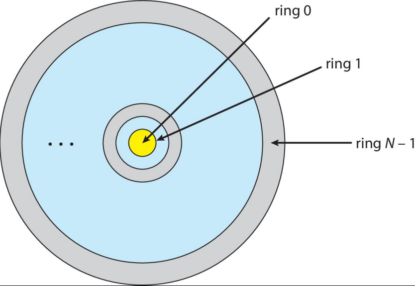

## Anelli di protezioni

Servono per dividere le funzioni in vari domini ordinati in modo gerarchico.

L'implementazione dei domini viene realizzata tramite la restrizione dello spazio di operazione dei processi in domini di protezione.

* Limitano le risorse a cui possono accedere
* Specifica quali oggetti e operazioni possono essere eseguiti

## MAtrice di Accesso

Il sistema deve tener traccia di quali oggetti accedono ai domini e rappresenta i loro permessi con una MAtrice di Accesso.

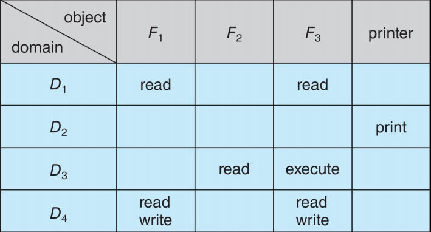

Ci deve essere sempre una polisi di protezione.<br>
Il meccanismo fornito dal SO assicura che la matrice venga editata solo da entità autorizzate.<br>
La Polisi di gestione vene indicata dall'utente.

I diritti di accesso possono essere anche revocati.<br>
Ci sono vari modi per rimuovere i diritti di accesso ad un dominio:

* Revoca Immediata o Successiva
* Revoca Selettiva o Generale
* Revoca Parziale o Totale
* Revoca Temporale o Permanente

Una volta tolti i diritti viene rimosso anche il diritto di accesso dalla lista degli accessi.

## Sicurezza basata sui Ruoli

Il controllo degli accessi può essere basato sul ruolo (e.g. user o root) anche ottenibile con una password.<br>
I privilegi sono la possibilità di eseguire o meno determinate azioni.

Esistono molti altri tipi di controlli e protezioni.<br>
Un esempio sono le firme di codice che permettono ad un sistema di fidarsi del codice che proviene da quella firma.<br>
Oppure in base al lingaggio di programmazione utilizzato.
