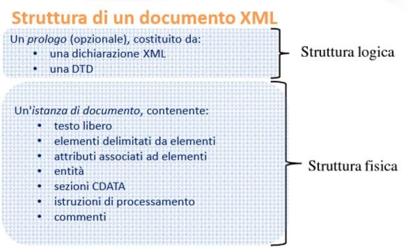

# Sistemi Multimediali

## Multimedia

La parola multimediale in generale intende la
combinazione di due o più media continui:

* Media che debbono essere riprodotti in sincrono durante qualche ben definito intervallo di tempo;
* Interazione dell’utente;

## Analogico Vs Digitale

**Analogico Definizione**: in elettronica (in contrapposizione a digitale o numerico) di apparecchi, strumenti o dispositivi che trattano grandezze rappresentandole con altre grandezze
legate alle prime da una relazione di analogia.

**Digitale Definizione**:  in elettronica e in informatica di apparecchi o dispositivi che rappresentano grandezze sotto forma numerica, rappresentate cioè da cifre di un adatto sistema
di numerazione.

I vantaggi del digitale:

* Maggiore fedeltà di trasmissione e riproduzione
* Nessuna degradazione del segnale
* Il computer tratta solo informazioni digitali
* Facilità di memorizzazione delle informazioni
* Versatilità

## Tipi di Media

I media si dividono in 2 tipi:

* **Discreti**: sono sequenze di elementi che non dipendono dal tempo(come le **immagini** o **testi**)
* **Continui**: sono media i cui valori cambiano in funzione del tempo (come **audio** e **video**)

## Conversione da Analogico a Digitale

Per la conversione è neccessaria una codifica che avviene in 2 passaggi:

* **Campionamento**: consiste nel misurare la funzione continua analogica in vari istanti. Ogni misurazione è detta _campione_ o _sample_
* **Quantizzazione**: discretizza questi campioni in modo da poterli utilizzare

## Compressione

La compressione facilita la trasmissione e la memorizzazione, riducendo il volume dei dati (riduce il numero di bit che possono essere sia ridondandi sia utili).

L'insieme dei calcoli che conducono a tale riduzione
prende il nome di algoritmo di compressione.

Queste tecniche sono di 2 tipi:

* tecniche reversibili (_lossless_), come ZIP, Codifica Huffman, PCX
* tecniche irreversibili (_lossy_), come JPEG, MP3 e MPEG

Il parametro per valutare la qualità della compressione è il tasso di compressione. Più è alto, peggiore sarà la qualità del file.

## Codifcia delle immagini

Le immagini possono essere memorizzate in 2 modi differenti:

* **Raster o Bitmap**: l’immagine è memorizzata come una griglia
regolare di pixel per ognuno dei quali viene indicato un colore.
Adatto per immagini fotografiche che prevedono gradazioni di
colore.
* **Vettoriale**: l’immagine è memorizzata attraverso una descrizione
matematica dei vari elementi geometrici che la compongono.
Adatto per disegni,illustrazioni e animazioni.

## Markup

**Definizione**: 
In generale un linguaggio di markup è un
insieme di regole che descrivono i
meccanismi di rappresentazione
(strutturali, semantici e presentazionali) di
un insieme di dati che, utilizzando
convenzioni standardizzate, sono
utilizzabili su più supporti e interpretabili
da più sistemi sw.

### Esterno Vs Interno

* **Interno**: utilizza marcatori interni al testo (caratteri di escaping) che vengono interpretati cone caratteri speciali

* **Esterno**: il testo è diviso in 2 blocchi: Il contenuto e il Markup che sono collegati tra di loro tramite meccanismi di indirezione.

### Tipi di Markup

* **Puntuazionale**: la punteggiatura
* **Presentazionale**: interlinea, pallini degli elenchi puntanti, ecc
* **Referenziale**: collegamenti a fonti esterne al documento
* **Procedurale**: Latex, Tex, RTF
* **Descrittivo**: viene specificato per ogni elemento il proprio ruolo: HTML, XML, SGML (Simple Gay Markup Language).

### SGML (Standard Generalized Markup Language)

E' un metalinguaggio che permette di definire altri linguaggi di Markup, dal quale derivano: HTML e XML.

Non è proprioetario.

Una sua caratteristica importante è che permette di definire strutture a cui i documenti si devono attenere.

#### XML

E' un meta linguaggio, permette di definiri altri linguaggi di markup. E' progettato per la definizione e scambio di documenti strutturati

#### HTML

Utilizzato per la visualizzazione di documenti.

## HTML e XML

Per molti tipi di dati non è sufficiente l'utlizzio di HTML per la visualizzazione:

* differenti capacità di visualizzazione, Smartphone e Desktop
* pagine generate a partire da db

Oggi alcuni Browser hanno introdotto tag proprietari che rendono di fatto HTML proprietario e quindi non può essere visualizzato correttamente da tutti.

### XML

Negli ultimi anni XML è cresciuto in popolarità sia a livello industriale sia nelle comunità scientifiche.
Deriva da SGML.

Sta per eXtensible Markup Language:

* Language indica un linguaggio di marcatura desceritttiva con una sua grammatica e sintassi
* Markup: è basta su marcatori o tag
* eXtensible: è possibile definire tag peresonali

Una caratteristica importante di XML sono i _Metadati_: aumenta il livello di gestione e manipolazione dei dati.


Alcuni obiettivi di XML sono:

* XML deve essere usabile direttamente su Web
* deve essere semplice progettare programmi che
processano documenti XML
* documenti XML devono essere leggibili da umani e
sufficientemente chiari
* documenti XML devono essere facili da creare

Lo standard XML prevede il concetto di DTD (Document Type Definition): permette di imperre una determinata struttura al documento e la marcatura ammessa

#### Vantaggi

Alcuni vantaggi di XML:

* La scelta dei nomi dei tag può essere fatta per facilitare la comprensione del documento
* il DTD permette di rendere esplicite le regole di composizione del documento e i rapporti tra le varie parti
* la struttura ad albero del documento ne rende semplice la visualizzazione e l'analisi
* è uno standar aperto quindi è facilemnte personalizzabile
* è compatibile con molti altri linguaggi di markup e quindi ne conesnte una facile conversione

Ogni documento XML comprende:

* _struttura logica_: indica quali elementi includere e in che ordine
* _struttura fisica_: il contenuto effettivo del documento



**Struttura Logica**

In questa sezione viene sempre dichiarata la versine di xml con 
```XML
<?xml version="1.0"?>
```

La dichiarazione XML può anche contenere la codifica dei caratteri: 
```XML
<?xml version="1.0" encoding="ISO-8859-1"?>
```

Può essere anche specificato se il documento è standalone: se ci sono dichiarazioni esterne al documento.

```XML
<?xml version=“1.0”  encoding=“UTF-8” standalone=“yes”?>
```

In questa parte può anche essere inclusa la dichiarazione del DTD: 

```XML
<?xml version="1.0"?>
<!DOCTYPE Legge SYSTEM "legge.dtd">
```

*Struttura fisica**

Il primo elemento è detto _radice_ e tutti gli altri elementi sono contenuti all'interno della radice.

_Esempio di documento XML_

```XML
<?xml version="1.0"?>
<!DOCTYPE Legge SYSTEM "legge.dtd">
<Legge> 
    <Intestazione> 
        <DataLegge>22 dicembre 1983</DataLegge> 
        <NumeroLegge>383</NumeroLegge>
        <TitoloLegge>Disciplina delle associazioni di promozione sociale</TitoloLegge> 
    </Intestazione>
</Legge>

```